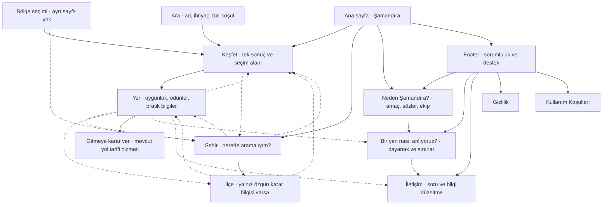

> Depoya aktarım notu — 13 Eylül 2026: Kaynak: dokumanlar/bilgi_mimarisi.md dosyası. Kullanıcının bu görevdeki beyanıyla kabul edilmiş referanstır. Özgün gövde korunmuş; yalnız metadata, köken notu ve belge ilişkileri eklenmiştir. Gövdedeki öneri/durum ifadeleri tarihsel haliyle bırakılmıştır.

# Şamandıra — Bilgi Mimarisi

Tarih: 13 Eylül 2026  
Durum: Kabul edilmiş Ürün Felsefesi temelinde hazırlanan nihai mimari önerisi. Uygulama veya yayın değişikliği değildir.

Temel belge: **0-Ürün Felsefesi** görevindeki Ürün Felsefesi. Kullanıcının bu görevdeki talimatıyla önceki planların üstündedir. Eski planlardaki rota, blog, genel sıralama ve sayfa çoğaltma fikirleri bu mimarinin gerekçesi sayılmaz. Veri sözlüğü ve kategori taksonomisi mevcut bilgi varlığını anlamak için okunmuştur; bir alanın veritabanında bulunması, güvenilir biçimde kullanıcıya sunulmaya hazır olduğu anlamına gelmez.

> Şamandıra, insanlara en iyi yeri göstermeye çalışmaz. Kendileri için doğru yeri, en az belirsizlik ve çabayla bulmalarını sağlar.

Bu mimarinin omurgası: **İhtiyacını belirt → anlamlı seçenekleri ayır → yeri anla → seç veya vazgeç.** Kullanıcı bu zincirin herhangi bir noktasından başlayabilir. Arama motorundan doğrudan yer sayfasına gelen birini ana sayfaya veya bir soru akışına döndürmeyiz.

## Mimari kararı

Yedi temel sayfa türü vardır: **Ana sayfa, Keşfet, Yer, Şehir, İlçe, Neden Şamandıra?, Bir yeri nasıl anlıyoruz?** İletişim, Gizlilik ve Kullanım Koşulları üç destek sayfasıdır.

Arama, Keşfet'in bir durumudur. Bölge, coğrafi bir seçimdir. Harita, aynı seçeneklerin konum bilgisidir. Bunlar ayrı ürün merkezleri oluşturmaz. Şehir ve ilçe sayfaları yalnızca özgün karar bilgisi taşıdıklarında yayımlanır; idari bir kaydın varlığı sayfa açmaya yetmez.

“Az sayfa”, az sayıda yer tanıtmak demek değildir. Her anlamlı yerin kendi adresi olabilir. Azaltılan şey, aynı kararı tekrar tekrar anlatan sayfa türleri ve geçişlerdir.

## 1. Ana sayfa

**Kullanıcının sorusu:** “Burada kendime uygun bir yeri nasıl bulurum?”

İçerik sırası aşağıdaki gibidir. Bu sıra bilgi önceliğidir; görsel yerleşim tarifi değildir.

| Sıra | Bölüm | İçerik ve görevi | Sonraki adım |
|---|---|---|---|
| 1 | Ne bulabilirsin? | Şamandıra'nın vaadini tek kısa açıklamada anlatır: bulunduğun duruma uygun yerleri, nedenleri ve önemli koşullarıyla anlamak. Aramanın yer adıyla da ihtiyaçla da başlayabileceğini belirtir. | Arama veya Keşfet |
| 2 | Nerede, ne yapmak istiyorsun? | Kullanıcı bildiği bir yer/şehir adını veya yapmak istediği şeyi belirtebilir. Başlamak için hesap, konum izni veya uzun tercih formu gerekmez. | İhtiyacı korunmuş Keşfet |
| 3 | Henüz karar vermediysen | “Sohbet edebileceğimiz bir yer”, “kısa bir yürüyüş”, “yağmurda vakit geçirmek” gibi az sayıda, birbirinden farklı başlangıç sunar. Bunlar vaat edilen seçeneklerin verisi varsa görünür. | İlgili Keşfet durumu |
| 4 | Nerelerde yardımcı olabiliyoruz? | Gerçekten kapsanan şehirleri gösterir. Türkiye çapında niyet ile mevcut kapsam ayrılır. Tek şehir hazırsa tek şehir anlatılır; boş şehirler eklenmez. Bölge seçimi ancak şehir sayısı ayırt etmeyi zorlaştırdığında burada anlam kazanır. | Şehir veya coğrafyası belirlenmiş Keşfet |
| 5 | Bir öneride ne göreceksin? | Gerçek bir yayımlanmış yer üzerinden tercih nedeni, vazgeçme nedeni ve bilgi sınırını birlikte gösterir. Ürünün değerini soyut sıfatlarla değil, karar bilgisiyle açıklar. | Örnek yer; yöntem sayfası |
| 6 | Footer | Ürünün sorumluluğu, yöntem, iletişim ve destek bağlantıları. | İlgili destek sayfası |

İlk iki bölüm tek başlangıç görevi taşır. Üçüncü bölüm yeni bir soru formu değildir; ne arayacağını henüz bilmeyene yardım eder. Kullanıcı başlamışsa ana sayfanın kalanını okumak zorunda değildir.

Ana sayfada ülke çapında bağlamsız bir mekân akışı, popülerlik tablosu, şehir başına uzun yer listeleri veya kurucu hikâyesinin tamamı bulunmaz. Ana sayfanın işi seçeneklerin tümünü göstermek değil, doğru keşif bağlamını kurmaktır.

## 2. Yer detay sayfası

**Kullanıcının sorusu:** “Burası şu an bize uygun mu; gidersek ne beklemeliyiz?”

Yer sayfası ürünün temel karar birimidir. Restoran, müze, park veya başka bir yer türü aynı karar sırasını paylaşır; pratik bilgi başlıkları türe göre değişir.

### Bilgilerin sırası

1. **Hangi yer?** Adı, türü, şehir/ilçe bilgisi ve bir cümlelik somut tanım. Aynı adlı yerlerin karışmasını önler. Bilinen kapanma, ciddi erişim engeli veya ziyaretin gerçekleşmesini önleyen bir koşul varsa burada görünür.
2. **Neden seçebilirsin; ne zaman seçmemelisin?** Az sayıda gerekçe ve bunlarla aynı öncelikte önemli ödünler. Kullanıcı ihtiyaç belirtmişse gerekçeler ona bağlanır. Belirtmemişse “Sana uygun” denmez; “Sakin sohbet arayanlar için…” gibi koşullu ifade kullanılır.
3. **Nasıl bir deneyim beklemelisin?** Ortam, ses, tempo, yapılabilecekler ve ziyaretin niteliği. Olgu, ziyaretçi deneyimlerinden çıkarım ve bilinmeyen aynı kesinlikle anlatılmaz. Fotoğraf bir niteliğin doğrulaması yerine geçmez.
4. **Gitme kararını değiştiren koşullar.** Ziyaret zamanı, kalabalık örüntüsü, ayrılacak süre, ücret/fiyat bilgisi, rezervasyon, fiziksel erişim ve ulaşım yükü. Açık saat bilgisi ile “şu an açık” iddiası ayrılır. Güncel ücret yoksa fiyat algısı kesin tutar gibi yazılmaz.
5. **Gitmek için gereken bilgiler.** Adres, konum, doğrulanmış iletişim veya resmî ziyaret bağlantısı ve yol tarifi. Yol tarifi mevcut bir harita hizmetine geçebilir; kullanıcıdan rota oluşturması istenmez. Kararını veren kullanıcının buraya ulaşması için tüm metni okuması gerekmez.
6. **Bu anlatıma ne kadar dayanabiliriz?** İlgili bilgilerin güncelliği, eksik veya çelişen noktalar, yönteme bağlantı ve “Bilgi hatalı mı?” üzerinden iletişim. Kararı etkileyen belirsizlik burada ilk kez açıklanmaz; yukarıda ilgili iddianın yanında da bulunur.
7. **Bu yer uymadıysa.** En çok üç anlamlı alternatif: örneğin daha az ulaşım gerektiren veya farklı atmosfer sunan yer. Her alternatifin bu yerden farkı açıklanır. Sadece yakın olmak yeterli gerekçe değildir. Uygun alternatif yoksa bölüm üretilmez.

### Öne çıkarılacak bilgiler

- İhtiyaca uyumun nedeni ve seçmeme nedeni.
- Kullanıcının açıkça belirttiği bütçe, zaman, ulaşım ve erişim sınırları.
- Kararı geçersiz kılabilecek güncel durumlar.
- Kararı etkileyen bilgi eksikliği. “Bilinmiyor” ile “yok” birbirinin yerine kullanılmaz.

### İlk okumadan geri alınabilecek bilgiler

Uzun tarihçe, ayrıntılı tesis/hizmet listesi, teknik yöntem açıklaması ve kapsamlı ulaşım ayrıntısı isteğe bağlı derinliktir. Bunlar aynı sayfada ikincil içerik olabilir; ayrı “tarihçe”, “özellikler” veya “yorumlar” sayfaları açılmaz.

Kullanıcının zorunlu koşuluyla ilgili bir ayrıntı bu grupta kalamaz. Örneğin merdiven bilgisi, basamaksız erişim arayan biri için ana karar bilgisidir. Genel olumlu özellikler bu engeli telafi etmez.

### Hiç yayımlanmayacak bilgiler

Ham yorumlar ve yorumcu kimlikleri, iç analiz puanları, açıklanamayan uygunluk yüzdeleri, kanıtsız kesin etiketler, aynı bilgiyi tekrarlayan metinler. Kaynak platform adları mevcut kaynak ifşası kararına uygun olarak gösterilmez; bu sınır, değerlendirme yöntemini ve belirsizliği gizleme gerekçesi değildir. Gerekli veri/lisans atıfları korunur.

Bir ziyaretçi grubunun yorumlarda sık geçmesi, o grup için uygunluğun kanıtı sayılmaz. “Çocuklu ziyaretçilerden söz ediliyor” ile “çocuklar için uygun ve güvenli” farklı iddialardır.

## 3. Şehir sayfası

**Kullanıcının sorusu:** “Bu şehirde istediğim deneyimi nerede aramalıyım?”

Şehir sayfası bir şehrin tüm özelliklerini anlatmaya çalışmaz. Şehir içindeki anlamlı farkları ve bunların seçim üzerindeki etkisini açıklar.

İçerik sırası:

1. **Şehri karar açısından anla.** Kısa bir çerçeve: ziyaret edilebilen çevrelerin birbirinden nasıl ayrıldığı, yayılım ve hareket etmenin seçime etkisi. “Her zevke hitap eden eşsiz şehir” gibi bilgi taşımayan metinler kullanılmaz.
2. **Bu şehirde ne yapmak istiyorsun?** Şehir bağlamını koruyarak Keşfet'e geçiş. Okumadan karar aramaya başlamanın yolu açık kalır.
3. **Nerede aramak daha anlamlı?** Aynı ölçütlerle anlatılan ilçeler veya şehir içindeki tanınabilir çevreler: hangi ihtiyaca neden uyar, hangi koşulda zorlar, ulaşım açısından ne fark yaratır? Bütün ilçeler sırf mevcut oldukları için listelenmez.
4. **Seçimi değiştiren şehir koşulları.** Merkez dışına çıkma gereği, ulaşım kısıtları veya deneyimi değiştiren dönemsel koşullar; yalnız dayanaklı olanlar. Mahalleler hakkında genelleyici güvenlik hükümleri kurulmaz.
5. **Başlamak için farklı seçenekler.** Üç ila beş yerlik, gerekçeleri birbirinden farklı bir başlangıç seçkisi. “En iyiler” sıralaması değildir. Kullanıcının ihtiyacı biliniyorsa seçki buna bağlanır; bilinmiyorsa her seçeneğin hitap ettiği ihtiyaç açıkça belirtilir.
6. **Kapsam ve devam.** Şehrin nereleri hakkında yeterli bilgi bulunduğu ve şehir içindeki Keşfet'e geçiş. Eksik kapsam, şehirde başka seçenek yokmuş gibi anlatılmaz.

Klasik gezi yazılarından ayrımı; tarihçe uzunluğu, öneri sayısı veya anlatıcının zevki üzerinden kurulmaz. Kullanıcıya **“Neyi seçersem ne kazanırım, neyi kabul ederim?”** sorusunun cevabı verilir. İlçe farkları anlatılmadan arka arkaya mekân sıralamak şehir sayfasının işini yerine getirmez.

## 4. İlçe sayfası

**Kullanıcının sorusu:** “Bu ilçenin neresinde, ne tür bir yer aramalıyım?”

Şehir sayfası arama alanı seçtirir; ilçe sayfası seçilen alan içindeki farkları anlaşılır hale getirir. Şehir metninin kısaltılmış kopyası değildir.

İçerik sırası:

1. **İlçenin ziyaret açısından karakteri.** Hangi deneyimler için anlamlı olduğu ve temel sınırlılığı.
2. **İlçe içindeki farklar.** Varsa sahil/iç kesim, merkez/çevre gibi gerçekten deneyimi değiştiren ayrımlar. Bunlar yeni mahalle sayfaları gerektirmez. Dayanak yoksa ayrım uydurulmaz.
3. **Zaman ve hareket koşulları.** Birbirine yakın görünen yerler arasında gerçek erişim farkları, gün/saat koşulları ve zaman ihtiyacı. Mesafeden yürünebilirlik sonucu çıkarılmaz.
4. **İhtiyaca göre yer seçenekleri.** Gerekçeleri ve önemli ödünleriyle sınırlı başlangıç seçkisi; ilçeye daraltılmış Keşfet'e devam.
5. **Burada aradığını bulamadıysan.** Şehre geri dönüş veya gerekçesi açıklanan komşu çevre önerisi. Kullanıcının alanı habersizce genişletilmez.
6. **Bilginin kapsamı.** Eksik alanlar, güncellik ve düzeltme bağlantısı.

**Yayımlama koşulu:** İlçe, şehir sayfasına ek olarak en az bir özgün karar ayrımı ve bunu destekleyen yeterli yer bilgisi sunmalıdır. Yalnızca “bu ilçedeki yerler” listesi varsa bağımsız ilçe sayfası açılmaz; şehir içinden ilçeye daraltılmış Keşfet'e gidilir. Bu eşik, sabit bir kayıt sayısına indirgenmez.

## 5. Bölge

**Kullanıcının sorusu:** “Henüz şehir seçmedim; bu coğrafyada nereden başlamalıyım?”

**Nihai karar: Bağımsız bölge sayfası yoktur.**

Bölge, şehir seçimini daraltmak için vardır. Ana sayfadaki kapsam bölümünde ve Keşfet'in coğrafya seçiminde, kapsanan şehirleri gruplar. “Karadeniz” seçimi bir Karadeniz tanıtım yazısına değil, o coğrafyadaki mevcut seçenekleri aramaya götürür. Bölgenin kapsandığı izlenimi yalnızca bir şehrin verisiyle verilmez.

Gerekçe: Bölge → şehir → ilçe → yer zinciri kullanıcıya gereksiz bir mecburi geçiş ekler. Bölgenin iklimi, kültürü veya tarihi üzerine genel metin, bu ürünün temel kararını yeterince ilerletmez. Şehir seçimi ihtiyacı, mevcut Keşfet içinde karşılanabilir.

Bu belgede “bölge” şehir üstü coğrafi gruplamadır. İlçe ve şehir içindeki çevreler bununla aynı kavram değildir. Mevcut veri modelindeki “bölge profili” adının kullanıcıya ayrı bir sayfa ailesi olarak yansıması gerekmez.

## 6. Keşfet sayfası

**Kullanıcının sorusu:** “Şu anki ihtiyacım için hangi seçeneklere bakmalıyım?”

Keşfet bir sonuç kataloğu olmakla yetinmez; seçeneklerin farkını açıklayan tek çalışma alanıdır. Arama, kategori ve coğrafya seçimleri burada birleşir.

### Bilgi sırası

1. **Anlaşılan ihtiyaç:** Aranan yer veya deneyim, seçili coğrafya ve açık koşullar. Kullanıcı bunları görebilir ve değiştirebilir.
2. **Kararı değiştirecek eksik bilgi:** Yalnız gerekli olduğunda kısa netleştirme. Belirsiz bir şehir adı veya bütün sonuçları değiştiren ulaşım sınırı buna örnektir. Varsayılan uzun anket yoktur.
3. **Anlamlı ilk seçenekler:** İlk değerlendirmede üç ila beş seçenek hedeflenir. Sayıyı doldurmak için zayıf öneri eklenmez.
4. **İhtiyacı düzeltme veya daha fazla sonuç:** Daha fazlası açık bir seçimle istenir. Sonuç sayısı ve sonu anlaşılırdır; sonsuz akış yoktur.

### Listeye girme ve sıralanma mantığı

- Önce kimliği ve temel konumu yeterli, karar vermeyi destekleyen kayıtlar değerlendirilir.
- Kullanıcının vazgeçilmez koşulları eleme sınırıdır. Bir zorunlu koşulu karşılamadığı bilinen yer uyumlu sonuç sayılmaz. Karşılayıp karşılamadığı bilinmeyen yer de doğrulanmış eşleşmeler arasına katılmaz.
- Ardından mevcut ihtiyaca uyum ve bu uyumu açıklayabilecek dayanak değerlendirilir. Çok yorum almak veya pahalı olmak otomatik üstünlük sağlamaz.
- Benzer uygunluktaki seçenekler arasından anlamlı farklar korunur. Çeşitlilik uğruna açık ihtiyaca daha az uyan yer yukarı taşınmaz.
- İhtiyaç belirtilmediyse sonuçlar kişiselleştirilmiş gibi sunulmaz; farklı kullanım amaçları olan başlangıç seçenekleri gösterilir.
- Kullanıcı isterse mesafeye göre sıralayabilir; başlangıç noktası ve mesafenin neyi ifade ettiği açık olmalıdır. Genel “en iyi” sıralaması yoktur.
- Ticari ilişki uygunluğu veya organik sırayı satın alamaz.

### Her sonuçta bulunması gereken ortak bilgi

Yer adı ve türü; konumu; bu aramada neden anlamlı olduğu; önemli koşul veya ödün; kararla ilgili bilgi sınırı. Kullanıcının belirttiği bütçe veya süre için güvenilir bilgi varsa görünür. Ortak ölçütler, yerleri zihinde karşılaştırmayı mümkün kılar; ayrı karşılaştırma sayfası gerekmez.

Kategori “ne olduğu”, deneyim “ne yapmak istediğin”, koşul “neye ihtiyaç duyduğun”, coğrafya “nerede aradığın” anlamına gelir. Bunlar aynı düzeyde yüzlerce etikete dönüştürülmez. Sakinlik gibi çıkarımlar ile doğrulanmış basamaksız giriş gibi özellikler aynı kesinlikte filtrelenmez.

Konaklama dahil mevcut yer kategorileri ancak bu karar bilgisini taşıyorsa aynı yapı içinde yer alır. Veritabanında kategori bulunması, rezervasyon veya ayrı ticari sayfa ailesi açmayı gerektirmez.

Kullanıcı yer detayından döndüğünde ihtiyaç, koşullar ve sonuçlardaki yeri korunur. Reddettiği bir seçenek aynı bağlamda yeni bir gerekçeyle tekrar dayatılmaz; açıkça geri alabilir.

### Sonuç bulunamadığında

“Bu koşullara uygun, yeterince bildiğimiz bir yer bulamadık” denebilir. Hangi sınırın sonucu azalttığı biliniyorsa açıklanır. Bütçeyi artırmak, mesafeyi genişletmek veya zorunlu koşulu kaldırmak kullanıcı adına yapılmaz. Kullanıcıya neyi değiştireceği açıkça anlatılan bir genişletme seçeneği sunulur.

Şehrin henüz kapsanmaması, eşleşme bulunmaması ve geçici bilgi yükleme sorunu birbirinden ayrı durumlardır.

## 7. Arama deneyimi

**Ayrı arama sonuç sayfası yoktur.** Arama Keşfet'i doldurur; böylece kullanıcı iki farklı filtre ve sonuç sistemini öğrenmez.

| Kullanıcı ne arayabilir? | Örnek | Beklenen karşılık |
|---|---|---|
| Belirli bir yer | Yer adı | Önce tam ad eşleşmesi; tür ve konumla ayrıştırılmış yer bağlantısı |
| Şehir | Samsun | Şehri anlama sayfası ve o şehirde Keşfet seçenekleri |
| İlçe | Atakum | Varsa özgün ilçe sayfası; her durumda kapsam uygunsa ilçede Keşfet |
| Bölge | Karadeniz | Kapsanan şehirlerle sınırlı coğrafi Keşfet durumu |
| Yer türü | Müze, kafe | Coğrafyası belirlenebilen tür araması |
| Yapılacak şey | Kısa yürüyüş, sohbet | Anlaşılabilen ihtiyaca göre gerekçeli seçenekler |
| Koşullar | Yağmurda gidilecek, ücretsiz | Yalnız ilgili niteliği destekleyen bilgiyle değerlendirme |
| Birleşik ihtiyaç | Atakum'da sakin sohbet edilecek kafe | Yer + deneyim + tür koşullarının birlikte uygulanması |

Bu örnekler arama kapsamının hedefidir; sınırsız doğal dil anlayışı iddiası değildir. Sistem bir kısmını anlayamadığında bunu saklamaz. Örneğin yer ve tür anlaşılmış, sakinlik için yeterli bilgi yoksa tam eşleşme iddia edilmez.

Türkçe karakter farklılıkları, yaygın adlar ve basit yazım yanlışları aramayı gereksiz yere çıkmaza sokmamalıdır. Aynı adlı farklı yerler konumlarıyla ayrılır. “En iyi kafe” sorgusu evrensel bir sıralama üretmez; hangi amaç için arandığına dönüştürülür.

“Yakınımda” için kullanıcının seçtiği başlangıç noktası veya kendi isteğiyle verdiği konum kullanılır. “Şu an açık” veya “şu an sakin” ancak bunu destekleyen güncel bilgi varsa karşılanır; geçmiş örüntü canlı durum gibi sunulmaz. Anlaşılmayan vazgeçilmez koşul sessizce düşürülmez.

## 8. Neden Şamandıra?

**Kullanıcının sorusu:** “Bu ürüne neden ihtiyaç duyayım; kimin yaklaşımına güveniyorum?”

Sayfanın sırası:

1. **Yaşanan problem:** Çok seçenek bilmenin uygun seçeneği anlamaya yetmemesi.
2. **Ürünün üstlendiği iş:** İhtiyaç ile yer arasındaki ilişkiyi açıklamak; gerekçeyi ve ödünü görünür kılmak.
3. **Kullanıcıya verilen sözler:** Evrensel en iyi yok; dezavantaj saklanmaz; bilgi yoksa kesinlik üretilmez; ticari çıkar uygunluk gibi gösterilmez.
4. **Sınırlar:** Kararın kullanıcıda kalması, koşulların değişebilmesi, her yerde yeterli kapsamın bulunmaması. Mevcut gerçek durum anlatılır.
5. **Kim yapıyor, kime ulaşabilirsin?** Şamandıra ve Alegre Group ilişkisi, sorumluluğu üstlenen ekip hakkında kısa bilgi, iletişim bağlantısı.
6. **Bu sözlerin pratiği:** Bir yeri nasıl anlıyoruz? sayfasına ve Keşfet'e geçiş.

Ayrı Hakkımızda sayfası açılmaz; onun kimlik ve sorumluluk işlevi burada karşılanır. Daha önce yayımlanmış Hakkımızda adresi varsa bu içeriğe götürülür. Ürün Felsefesi'nin tamamı pazarlama metni olarak kopyalanmaz; kullanıcıyı ilgilendiren taahhütler anlatılır.

## 9. Bir yeri nasıl anlıyoruz?

**Kullanıcının sorusu:** “Bu öneriyi hangi temelde söylüyorsunuz; hangi noktada yanılabilirsiniz?”

Sayfanın sırası:

1. **Neleri ayırıyoruz?** Doğrulanmış yer bilgisi, ziyaretçi deneyimlerinden çıkarılan örüntü ve yeterince bilinmeyen konular.
2. **Neye bakıyoruz?** Kullanım amacı, ortam, pratik koşullar, zaman bağımlılığı ve kullanıcının açık ihtiyacı. Örneğin kalabalık bir ortamın bir ihtiyaçta olumlu, diğerinde olumsuz anlam taşıması.
3. **Öneri nasıl oluşuyor?** Kullanıcının sınırları, uygunluğun gerekçesi, önemli ödünler ve alternatiflerin farkı. Kullanıcıya gereksiz teknik detay sunmadan uygulanmakta olan yöntem açıklanır.
4. **Neyi söyleyemiyoruz?** Seyrek, eski, çelişkili veya yalnız belli ziyaretçileri temsil eden bilgilerden kaynaklanan sınırlar. Bir nitelik hakkında bilgi olmaması, o niteliğin olmadığı anlamına gelmez.
5. **Ne değişebilir?** Saat, fiyat, işletme durumu ve ortam gibi bilgilerin değişebilirliği; hangi bilginin ne zaman kontrol edildiğinin anlamı. Her alan denetlenmediyse sayfanın genel güncellenme tarihi bunu ima etmez.
6. **Ticari ilişkiler karara nasıl yansıyor?** Varsa ilişki açıkça belirtilir; ödeme uygunluk kanıtına veya organik sıra avantajına dönüştürülmez. Olmayan bir denetim veya bağımsızlık süreci varmış gibi yazılmaz.
7. **Hata nasıl düzeltilir?** İlgili yere bağlı iletişim yolu. Kimlik bilgisi veya uzun üyelik süreci talep ederek hata bildirimine engel olunmaz.

“Neden Şamandıra?” amacı ve sorumluluğu açıklar; bu sayfa iddiaların dayanağını ve sınırını açıklar. Ayrı tutulmalarının gerekçesi budur. Yer sayfası belirli bir iddianın belirsizliğini yöntem sayfasına havale edemez.

## 10. Footer

Footer'ın görevi kullanıcının üç sorusunu cevaplamaktır: **“Bu kimin ürünü?”, “Bu bilgiye nasıl yaklaşmalıyım?”, “Bir sorun varsa nereye ulaşırım?”**

İçerik:

- Şamandıra'nın amacını anlatan tek kısa cümle ve Alegre Group ilişkisi.
- Neden Şamandıra?
- Bir yeri nasıl anlıyoruz?
- İletişim — ürün soruları ve yere bağlı düzeltme bildirimleri aynı kanala ulaşır.
- Gizlilik ve Kullanım Koşulları.
- Kullanılan veriye ve hizmetlere ilişkin gerekli atıflar; mevcut OpenStreetMap contributors atfı korunur.

Gizlilik sayfası gerçek veri kullanımını ve kullanıcı kontrolünü; Kullanım Koşulları kullanım çerçevesini ve sorumluluğu anlatır. Metin içerikleri bu bilgi mimarisinin dışında ayrıca hazırlanır.

Footer bir ikinci keşif dizini değildir. Bütün şehirler, ilçeler, anahtar kelimeler ve kategoriler burada tekrarlanmaz. Kullanıcıya bir iş sağlamayan sosyal bağlantılar, rozetler veya bülten daveti eklenmez.

## 11. Menü

**Şamandıra → Ana sayfa · Keşfet · Neden Şamandıra? · Ara**

- **Şamandıra:** Ana sayfaya dönüş; ayrıca “Ana sayfa” maddesiyle tekrar edilmez.
- **Keşfet:** Yeni yer bulmanın ana girişi.
- **Neden Şamandıra?:** Ürünün ne olduğunu ve taahhütlerini anlamanın girişi.
- **Ara:** Sayfa kategorisi değil, aynı keşif yapısına giriş eylemi.

Şehirler, ilçeler, bölgeler ve yer türleri ana menü maddeleri değildir. İlgili bağlamdan ve Keşfet'ten ulaşılır. Yöntem sayfası yerlerin bilgi açıklamalarından, Neden Şamandıra?'dan ve footer'dan bulunur.

Geçişler coğrafi sıralamayı zorunlu tutmaz. Yer sayfasından şehre veya ilçeye çıkılabilir; aramadan doğrudan yere girilebilir. Keşfet'e geri dönüş kullanıcının koşullarını korur.

## 12. Açılmayacak sayfalar

### Felsefeyle çeliştiği için hiçbir zaman açılmayacak yapılar

- Herkes için “en iyi 10”, “mutlaka gidilecek 50” gibi evrensel hüküm ve sıralama sayfaları.
- Ücretli görünürlüğü uygunluk tavsiyesi gibi sunan listeler.
- Kullanıcının okuması gereken ham yorum yığınları ve yorumcu profilleri.
- Bağlamdan bağımsız trend, viral veya sonsuz içerik akışları.
- Bilgi olmayan şehir/ilçe/kategori kombinasyonlarını dolduran kopya sayfalar.

### Bu mimaride ihtiyacı başka yerde karşılandığı için açılmayacak yapılar

- Ayrı Arama Sonuçları: Keşfet karşılar.
- Bölge tanıtım sayfaları ve ayrı Şehirler dizini: coğrafya seçimi ve mevcut kapsam bölümü karşılar.
- Şehirden ayrı “şehirde gezilecek yerler”, “şehirde kafeler” sayfa ailesi: aynı şehir bağlamındaki Keşfet karşılar.
- Her deneyim, özellik veya filtre birleşimi için ayrı sayfa: Keşfet'in durumu olarak kalır.
- Ayrı Hakkımızda, Manifesto, Vizyon ve Misyon sayfaları: Neden Şamandıra? karşılar.
- Ayrı genel SSS ve puan açıklama sayfaları: cevaplar kararın verildiği içerikte; ortak yöntem yöntem sayfasında bulunur.
- Blog, gezi rehberleri portalı, rota portalı, zorunlu gezi planlayıcısı, rezervasyon merkezi.
- Bağımsız harita, karşılaştırma, kullanıcı profili, topluluk, takip sistemi ve liste paylaşım portalı.
- Üyelik gerektiren başlangıç, ücret planları, işletme paneli ve sponsor başvurusu sayfaları.

İkinci gruptaki araçlar için geleceğe dönük mutlak yasak konmuyor. Kabul edilen mimaride yer almıyorlar; ancak mevcut sayfalarda çözülemeyen, kanıtlanmış ayrı bir karar ihtiyacı doğarsa Ürün Felsefesi'nin kontrol sorularından yeniden geçmeleri gerekir. 404, bulunamayan sonuç ve geçici hata gibi sistem durumları ise gereklidir; içerik aileleri değildir.

## Önerinin eleştirisi ve son kararlar

| İtiraz | Karar |
|---|---|
| Bölgeyi kaldırmak şehir seçimini zorlaştırmaz mı? | Bölge seçimi korunur; genel bir anlatı sayfası kaldırılır. Kullanıcı yine bir coğrafyayı daraltabilir. |
| Şehir ve ilçe aynı şablonun kopyasına dönüşmez mi? | Şehir alanlar arasında, ilçe alanın içinde seçim yaptırır. Özgün ayrım üretemeyen ilçe sayfası yayımlanmaz. |
| Arama ile Keşfet'i birleştirmek belirli bir yeri arayanı yavaşlatmaz mı? | Tam ad eşleşmesi doğrudan yer bağlantısı verir; kullanıcı ihtiyaç formundan geçirilmez. |
| Az seçenek göstermek kullanıcı adına fazla karar vermek değil mi? | Gerekçeler, değiştirilebilir koşullar ve açık “daha fazla sonuç” yolu korunur. İlk küme sonucun tamamı gibi sunulmaz. |
| İki açıklama sayfası fazla değil mi? | Amaç/kimlik ile dayanak/belirsizlik ayrı sorulardır. Hakkımızda, manifesto ve SSS bunlara eklenmez. |
| Dezavantajları erken göstermek seçimleri azaltmaz mı? | Yanlış seçimi önlemek başarıdır. Önemli bilgiyi saklayan dönüşüm artışı kabul edilmez. |
| Arama motorları için daha çok sayfa gerekmez mi? | Özgün yer ve coğrafya bilgisi yayımlanır. Aynı kararı farklı anahtar kelimelerle tekrarlayan yeni sayfalar açılmaz. |
| Eldeki rota ve profil verisi kullanılmayacak mı? | Kullanıcı ihtiyacını açıklayan bilgiler kullanılır. Mevcut yatırım yeni sayfa veya özellik açmak için tek başına gerekçe değildir. |

Bu eleştirilerden sonra tek mimari kalır: **tek keşif alanı, kendi başına karar verdirebilen yer sayfası, gerektiği kadar coğrafi açıklama ve iki ayrı güven sorusuna cevap veren iki sayfa.**

## Mimariyi kabul ederken aranacak kanıt

Uygulama sonrasında şu akışlar ayrıca doğrulanmalıdır; bu belge bunların yapılmış olduğunu iddia etmez:

- Belirli bir yeri arayan kişi şehir veya tercih adımlarına zorlanmadan doğru yere ulaşabiliyor mu?
- Bir ihtiyacı olan kişi seçeneklerin neden farklı olduğunu ve önemli ödünlerini anlatabiliyor mu?
- Arama motorundan gelen kişi yerin kendisine uymama nedenini ve bilgi eksiklerini de öğrenebiliyor mu?
- Zorunlu koşul bilinmiyorsa ürün bunu uyumlu sonuç gibi göstermeyi önlüyor mu?
- Kullanıcı yerden Keşfet'e dönünce karar bağlamını yeniden kurmak zorunda kalıyor mu?
- Şehir/ilçe sayfası, düz bir filtrelenmiş listeden daha iyi bir seçim yaptırıyor mu? Yaptırmıyorsa ayrı sayfa gerekçesi yeniden değerlendirilir.
- Kullanıcı neden güvenebileceğini, hangi iddianın belirsiz olduğunu ve nasıl düzeltme bildireceğini bulabiliyor mu?

Sayfa görüntülemesini veya üründe geçirilen süreyi artırmak tek başına başarı değildir. Esas kanıt, kullanıcının daha az uğraşarak gerekçeli bir karar verebilmesi ve sonradan yaşadığı deneyimin anlatılanla örtüşmesidir.

## Tüm site — tek bilgi mimarisi diyagramı

Düz çizgiler içerik yapısını, kesikli çizgiler bağlama bağlı geçişleri gösterir. Diyagram bir zorunlu tıklama zinciri değildir. Bölge ve arama bağımsız sayfa değil, Keşfet durumlarıdır.

---

## Belge ilişkileri — depoya aktarım eki

### Bu dokümanın bağlı olduğu belgeler

- [00-urun-felsefesi.md](./00-urun-felsefesi.md)

### Bu dokümanın etkilediği belgeler

- [02-product-language.md](./02-product-language.md)
- [03-karar-motoru.md](./03-karar-motoru.md)
- [04-sistem-mimarisi.md](./04-sistem-mimarisi.md)

### Bundan sonra okunması gereken belge

[02-product-language.md](./02-product-language.md)
