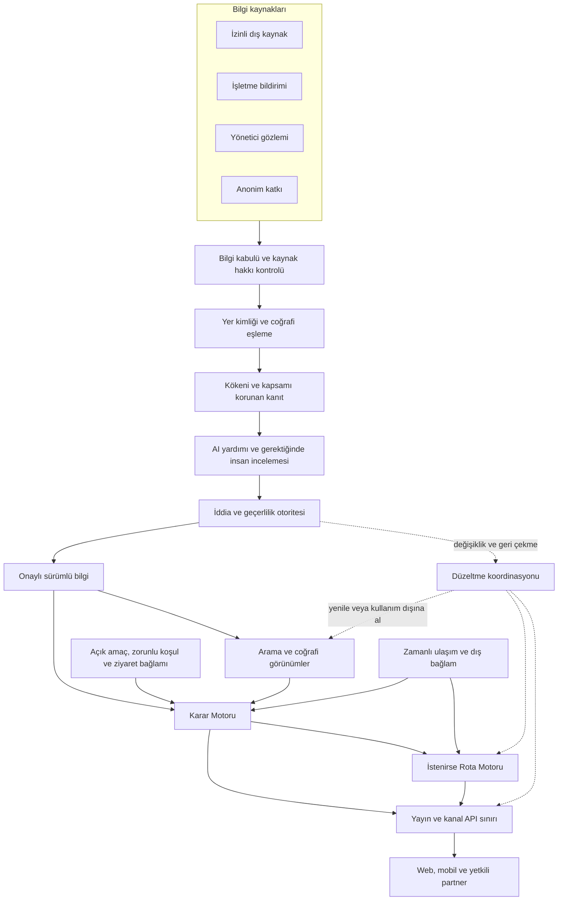
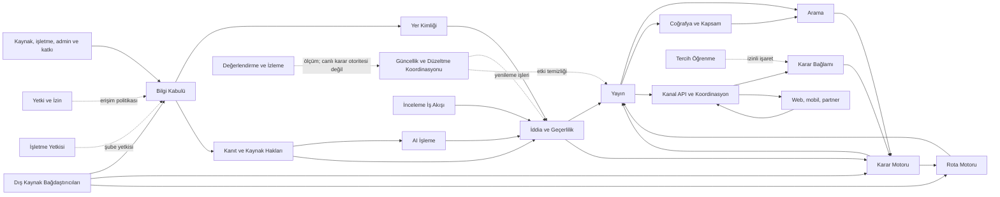
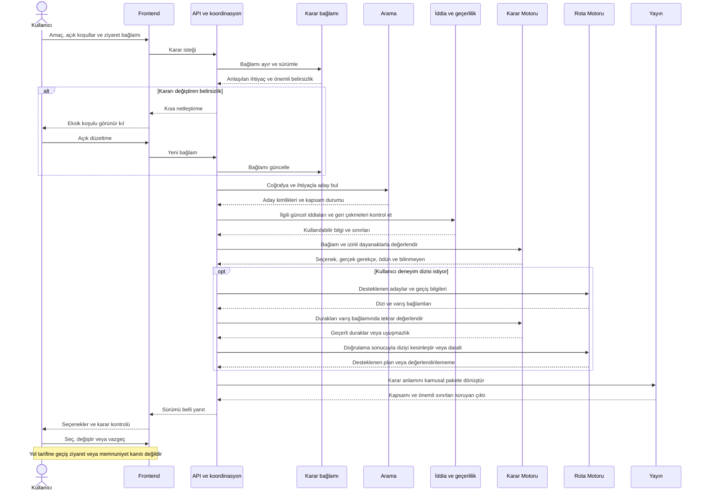
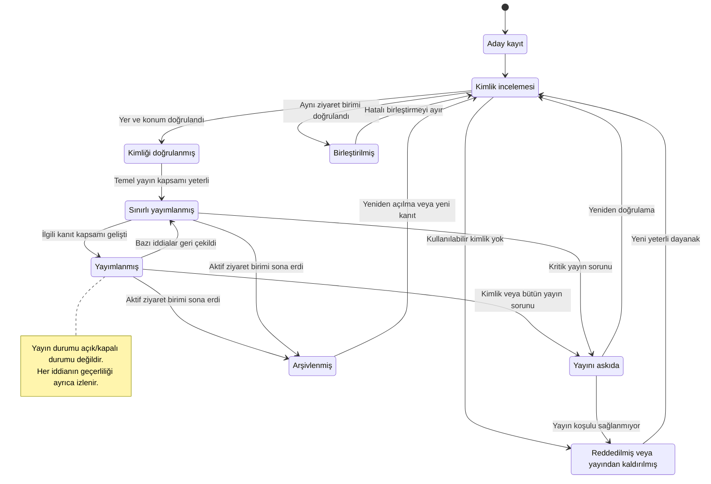
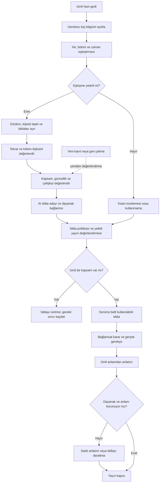
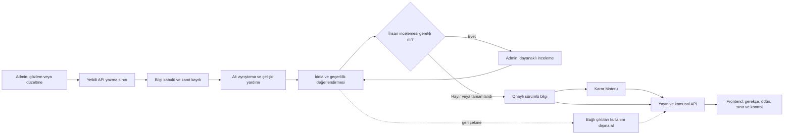

# Şamandıra — Sistem Mimarisi

> Şamandıra, insanlara en iyi yeri göstermeye çalışmaz. Kendileri için doğru olan yeri en az belirsizlik ve çabayla bulmalarını sağlar.

**Nihai mimari:** Tek ürün dili ve tek karar otoritesi etrafında kurulan, sorumlulukları ayrılmış bir çekirdek; kullanıcı isteğinden bağımsız çalışan kanıt hazırlama süreci; sürümlü yayımlanabilir bilgi; bağlama göre çalışan Karar Motoru ve onun sonuçlarını kullanan Rota Motoru. Başlangıçta mantıksal servisler birlikte işletilebilir. Ayrı çalışma birimlerine geçiş ölçülen yük, hata yalıtımı ve sorumluluk ihtiyacına göre yapılır.

Bu belge backend, frontend, admin, AI, web, mobil ve partner geliştirmelerinin uyması gereken ürün davranışını tanımlar. Çalışan sistem, ölçülmüş kapasite veya saha doğrulaması iddia etmez. Kod, migration, endpoint, veri tabanı şeması, teknoloji ve framework seçimi içermez. Aşağıdaki “servis”, öncelikle tek sorumluluğu olan ürün yeteneğidir; ayrı sunucu zorunluluğu değildir.

## 0. Referans otoritesi, uyum ve açık gerilimler

Dört kabul edilmiş belgenin tamamı okunmuştur. [00 Ürün Felsefesi](./00-urun-felsefesi.md) amaç ve yasakları; [01 Bilgi Mimarisi](./01-bilgi-mimarisi.md) kullanıcıya sunulan yapıyı; [02 Product Language](./02-product-language.md) anlamları; [03 Karar Motoru](./03-karar-motoru.md) kanıttan karara geçiş kurallarını belirler. Bu belge bu kuralları sorumluluk, akış ve bağımlılıklara dönüştürür.

Yeni bir mimari gerekçesi önceki ürün kararını geçersiz kılamaz. Çelişkide ilgili yetenek daraltılır; hangi referansın hangi maddesinin değiştirilmesi gerektiği açık bir değişiklik önerisi olur. Eski depo planlarının öncelik ifadeleri, kullanıcının bu görevde kabul edilmiş dört belgeye verdiği otoritenin önüne geçmez.

| Konu | Referanslar arasındaki sınır veya gerilim | Bu belgenin açık kararı |
|---|---|---|
| Tempo | 01, yer anlatısında “tempo” der; 02 §5 bunu temel kavramdan çıkarır; 03 §0 bu ayrımı korur. | Sözcük düzeyinde gerilim vardır. Yeni mimaride tempo alanı/puanı yoktur; süre, ses ve yoğunluk ayrı kalır. 01'in özgün metni sessizce düzeltilmemiştir. |
| İşletme paneli | 01 §12 mevcut kamusal yapıya işletme paneli sayfası eklemez; 03 §14 gelecekte bilgi girişini tarif eder. Bu görev işletme girdilerinin mimarisini ister. | İşletme bilgi kabulü tasarlanır. İlk aşamada denetimli başvuru/admin aktarımı mümkündür; ayrı işletme arayüzünün kamusal ürün kapsamına alınması ayrıca gerekçelendirilir. Yeni ana menü veya sponsor başvuru sayfası eklenmez. |
| Rota | 01 ayrı rota portalını dışarıda tutar; 03 §10 deneyim dizisini karar yeteneği olarak tanımlar. | Rota Motoru vardır; mevcut Keşfet/yer bağlamını destekler. Tek yer isteyen kullanıcı rota akışına zorlanmaz. |
| Karar Motoru'nun bilgi hazırlama işi | 03 §1 bilgiyi hazırlama ile anlık kararı tek çerçevede anlatır. | Hazırlama işlerinin işletimi ayrı servislere verilir; kanıt kullanımı kuralları aynı kalır. İkinci bir uygunluk motoru oluşmaz. |
| Kaynak gizliliği ve atıf | Ham yorum ve platform dökümü görünmez; gerekli atıflar korunur. | Yayın paketinde gerekli atıf taşınır. Ürün sınırlarıyla bağdaşmayan kullanım şartı varsa o kaynak ilgili çıktı için kullanılamaz. |
| “API kendini güncellesin” | Referanslar iddiaların izlenebilir düzeltmesini ister. | API kendi kendine gerçek üretmez; onaylı bilgi değişikliklerini bütün tüketicilere taşır. Kural/model değişimi kendiliğinden üretime çıkmaz. |

Bu sınırlar dışında dört referansın yönünü değiştiren yeni bir ürün kararı önerilmemektedir. Özellikle genel yer puanı, ham yorum yayını, görünmez koşul gevşetme ve ticari sıra bonusu yasakları aynen korunur.

## 1. Bütün sistem mimarisi nasıl çalışacak?

Sistem üç akıştan oluşur. **Bilgi hazırlama akışı**, ham girdiyi kapsamı ve dayanağı belli iddiaya dönüştürür. **Karar akışı**, kullanıcının o anki ihtiyacına uygun iddialarla seçenek üretir. **Düzeltme akışı**, eski veya hatalı bilginin bütün bağlı çıktılardaki etkisini kaldırır. Düzeltme, sonradan eklenen bakım işi değil mimarinin çekirdeğidir.

Bilgi hazırlama kullanıcı aramasını beklemez. İşletme, yönetici, anonim katkı ve kullanılabilir dış kaynaklardan gelen değişiklikler alınır; kaynağın kullanım hakkı ve gerçek yer eşleşmesi kontrol edilir. Ham kanıt, AI tarafından ayrıştırılan aday iddia ve yayımlanabilir iddia farklı varlıklardır. Birinin bulunması diğerinin hazır olduğu anlamına gelmez.

Karar anında API, amaç ve koşulları bağlam olarak kurar. Arama servisi aday getirir; Karar Motoru uygunluğu, gerekçeyi, ödünü ve önemli eksikliği birlikte üretir. Yayın servisi yalnız taşınmasına izin verilen anlamı kanala sunar. Web, mobil ve partner aynı karar kuralını kullanır.

Dört bilgi düzlemi ayrı sahiplik taşır:

| Düzlem | Ne içerir? | Kim değiştirebilir? |
|---|---|---|
| Kaynak ve kanıt | Özgün girdi, köken, kullanım koşulu, gözlem ve gönderim zamanı | Bilgi kabulü yeni kayıt/düzeltme ekler; kontrollü saklama ve geri çekme uygulanır. |
| Yer ve iddia | Sabit yer kimliği, kapsamlı iddialar, güven ve geçerlilik kararı | Yer kimliği ve iddia yönetimi kendi alanlarında yetkilidir. |
| Sunuma hazır bilgi ve indeks | Onaylı yer açıklamaları, arama/coğrafya görünümleri, gerekli atıf | Yayın ve ilgili indeks sahipleri onaylı değişikliklerden üretir. |
| Karar bağlamı ve sonuç | Amaç, koşullar, kullanılan iddialar, gerekçe, alternatif ve rota | Bağlam servisi kullanıcı isteğini; Karar/Rota Motorları sonucu yönetir. |

İndeks ve önbellek hakikatin sahibi değildir. Gerektiğinde yetkili kayıt ve sürümlerden yeniden oluşturulur. Ham içerik de tek başına doğru değildir; bir kaynağın iddiasının kaydıdır.

## 2. AI hangi katmanlarda görev alacak?

| Katman | AI'ın işi | Karar yetkisinin sınırı | AI yoksa davranış |
|---|---|---|---|
| Girdi anlama | Serbest metin, belge ve görseldeki somut bildirimleri ayrıştırmak | Kaynak içeriğindeki talimatlara uymaz; görüntüden görünmeyen alan üretmez. | Yapılandırılmış bildirim ve insan incelemesi devam eder. |
| Eşleştirme yardımı | Yer/şube adayları ve benzer kayıtlar önermek | Kalıcı birleştirme yetkisi yoktur. | Açık kimlik eşleşmeleri işlenir; belirsizler bekler. |
| İddia hazırlama | Konu, zaman, bölüm, olgu/bildirim/çıkarım/tahmin ayrımı önermek | Kanıt kapsamı ve bilgi türü değiştirilemez. | Mevcut geçerli iddialar kullanılır. |
| Kalite yardımı | Çelişki, tekrar ve kapsam dışına taşmayı işaretlemek | Modelin kendi güveni kanıt yeterliliği değildir. | Kural kontrolleri ve seçici inceleme çalışır. |
| Niyet anlama | Amaç, tercih, zorunlu koşul ve coğrafyayı ayırmak | Anlaşılmayan koşulu silmez; kullanıcı adına koşul uydurmaz. | Yer adı, tür ve açık seçimlerle arama sürer. |
| Karar anlatımı | Motorun gerçek gerekçelerini doğal dilde ifade etmek | Yeni gerekçe, olumlu vaat veya eksik koşul tamamlayamaz. | İzinli bilgiden sade standart anlatım kullanılır. |
| Tahmin | Uygun veri ve değerlendirme varsa geleceğe ilişkin aralık üretmek | Canlı durum veya garanti olarak konuşamaz. | İlgili tahmin yeteneği kapanır; bilinen bilgi kalır. |
| Operasyon yardımı | İnceleme dosyası özeti ve kanıt toplama önceliği önermek | İncelemeyi yapılmış sayamaz; yayını tek başına onaylamaz. | Öncelik kuralları ve operatör işi sürer. |

AI tüm kararların zorunlu aracısı değildir. Ürünün gerçeklik kuralları, model değişse de korunur. Güven ve yayın kararı, model önerilerini kanıt politikasıyla değerlendiren iddia yönetiminin sorumluluğudur.

## 3. Karar Motoru API ile nasıl konuşacak?

API, kanalların giriş/çıkış sınırıdır. Karar Motoru HTTP yolu, ekran veya sağlayıcı biçimi bilmez. API'nin uygulama koordinasyonu, motorun ihtiyacı olan anlam paketlerini toplar; motor sonucu aynı anlamı koruyan bir paket olarak geri verir. Bu paketler teknik alan şeması değil, taşınması gereken ürün bilgisidir.

**Girdi sözleşmesi:** Kullanıcı tarafından belirtilen amaç, tercihler ve zorunlu koşullar; ziyaret zamanı, başlangıç/varsa bitiş, ulaşım, grup için açık koşullar; anlaşılmayan bölüm; izinli hatırlanan tercihler; aynı bağlamdaki retler; aday yer kimlikleri; ilgili iddialar ve sürümleri; zamanlı dış bağlam; coğrafi kapsam ve hizmetin kullanılabilirlik durumu.

**Çıktı sözleşmesi:** Anlaşılan ihtiyaç; uygunluk sonucu; seçilen adaylar; gerçek tercih gerekçeleri; ödün/engel; önemli bilinmeyenler; kapsam ve geçerlilik; alternatif farkı; uygulanabilir devam eylemleri. İç izlenebilirlik paketi ayrıca tutulur; ham kanıt ve iç değerlendirmeler kamusal pakete girmez.

Geçerli yanıtlar yalnız “yer listesi” değildir: kimlik bulma, kısmi bilgi, netleştirme gereksinimi, desteklenen öneri, kapsam yetersizliği, bu koşullarda eşleşme yokluğu ve geçici hizmet sorunu birbirinden ayrılır. Teknik hata boş listeye dönüştürülemez.

Bir karar bağlamının sürümü vardır. Kullanıcı bütçeyi değiştirdiğinde yeni sonuç önceki koşulları taşıyan yanıtla karışmaz. Geç gelen eski yanıt ekranı geri alamaz. Sonuç, kullanılan iddia ve politika sürümlerine bağlanır; güncel geçerlilik kontrolünden geçmeden tekrar kullanılmaz.

Motor “şu bilgiler olmadan bu zorunlu koşulu değerlendiremiyorum” diyebilir. Koordinasyon eksik bilgiyi mevcut yetkili kaynaktan sağlayabiliyorsa tamamlar; sağlayamıyorsa sonucu daraltır. Kullanıcı her istekte bütün veri toplama sürecinin bitmesini beklemez.

## 4. Frontend yalnızca görüntüleyen katman mı olacak?

Frontend **etkileşim ve kullanıcı kontrolünün sahibidir**. İhtiyacı toplar, anlaşılan koşulları gösterir, kullanıcı değişikliklerini taşır, liste/harita görünümünü senkron tutar, detaydan dönüş durumunu korur, ret ve geri alma sunar. Erişilebilir kullanım, anlaşılır hata, yüklenme ve bağlantı kaybı davranışı onun sorumluluğudur.

Uygunluğun ve kanıtın sahibi değildir. Yerleri kendi gizli puanıyla yeniden sıralayamaz; görünmeyen filtre ekleyemez; “bilinmiyor” değerini olumlu rozetle değiştiremez. Kullanıcının açık sıralama tercihini API'ye iletir; mesafe anlamı ve başlangıcı görünür olur. Yerel sunum değişikliği öneri anlamını değiştiremez.

Kısaltma, sesli okuma, çeviri ve küçük ekran tasarımı aynı kapsamı, önemli engeli ve belirsizliği korumalıdır. Kritik sınır sığmıyorsa olumlu anlatım kısaltılır veya daraltılır. Önce olumlu cümleyi gösterip engeli daha sonra yüklemek uygun değildir.

Çevrimdışı durumda önceden kaydedilmiş temel bilgi tarihli gösterilebilir. Yeni kişisel uygunluk veya canlı açık/yoğun iddiası üretilmez. Yeniden bağlantıda etkin karar güncellenir. Web sayfasının başka kullanıcıya ait bütçeyi veya konumu ortak önbellekten alması hiçbir koşulda kabul edilmez.

## 5. Admin paneli sistemi nasıl besleyecek?

Admin, bilgi üretiminin ve düzeltmenin çalışma alanıdır. Başlıca işler: yeni yer adayları, kimlik uyuşmazlıkları, kritik bilgi eksikleri, çelişen kanıtlar, güncellik görevleri, işletme yetki başvuruları, anonim katkı incelemesi, yayımlanacak değişiklik ve geri çekme etkisi.

Yönetici gözlemi; tarih, bölüm, giriş, faaliyet ve gözlem koşullarıyla girilir. Doğrudan görülen özellik, işletmeden duyulan beyan ve kişinin beğenisi ayrılır. Davetli veya özel koşullu ziyaret olağan deneyim sayılmaz.

Her işlem “ne değişiyor, dayanak ne, hangi yer/iddia/karar etkileniyor, kim yaptı, geri alınırsa ne olur?” sorularına cevap verir. Önizleme, yeni iddianın yer sayfasında ve örnek karar bağlamlarında nasıl görüneceğini gösterir. Yönetici serbest metinle üretim sonucunu atlayamaz.

Yetkiler gözlem girme, kimlik düzeltme, iddia inceleme, kritik yayın onayı ve kaynak/politika yönetimi olarak ayrılır. Küçük ekipte bir kişi birden çok rol üstlenebilir; kritik birleştirme, geniş erişim güvencesi ve çıkar çatışmasında ikinci inceleme aranır. Ticari ekip uygunluk sırasını ve güven düzeyini seçemez.

Kritik şüphede önce ilgili olumlu iddia kullanım dışına alınabilir. Bu geçici önlem “yer kapalıdır” veya kamuya açık suçlama üretmez. İnceleme sonunda gerekçeli doğrulama, daraltma ya da geri çekme yapılır. Toplu değişiklik küçük bir kapsamda önizlenir ve geri alınabilir olur.

## 6. İşletmeler sisteme hangi bilgileri girecek?

İşletme, yetkisi doğrulanan şube veya yer için bilgi bildirir. Hesap/yetki doğrulaması, bildirimlerin tamamının doğrulandığı anlamına gelmez. Birden fazla işletmenin ortak alanda bulunması, tüm alan üzerinde yönetim yetkisi vermez.

| Bilgi ailesi | Beklenen ayrıntı | Kullanım sınırı |
|---|---|---|
| Kimlik ve konum | Ad, şube, giriş, faaliyet türü, resmî iletişim | Aynı ad otomatik birleştirme değildir. |
| Ziyaret durumu | Olağan saatler, özel gün istisnası, son giriş, bakım/kapanma aralığı | Saat listesi anlık açıklık veya boş yer garantisi değildir. |
| Ücret | Tarihli menü/tarife, para birimi, kişi/ürün kapsamı, zorunlu ek ücret | “Uygun fiyatlıyız” bütçe kanıtı değildir. |
| Kullanım kuralları | Rezervasyon gereği, kalış süresi, çalışma/katılım/evcil hayvan koşulları | Olanağın varlığı, her zaman kullanılabileceği anlamına gelmez. |
| Olanak ve alan | Hangi bölümde hangi hizmet/tesis var ve ne zaman kullanılabilir | Kullanıcı grupları için genel uygunluk etiketi verilmez. |
| Fiziksel erişim | Kullanılan girişten salona/ilgili tesise yol, basamak, asansör, geçici kesinti | Tek “erişilebilir” seçeneği tüm yolun yerine geçmez. |
| Kapasite | Toplam kapasite veya zamanlı fiilî durum; ikisi açık ayrılır | Kapasite sayısı boş kapasite değildir; canlılık süresi gerekir. |
| Değişiklik | Taşınma, işletmeci değişimi, tadilat, alan kapanması | Önceki deneyim kanıtlarının taşınabilirliği yeniden değerlendirilir. |
| Dayanak ve medya | Tarihli belge/görsel, neyi gösterdiği ve kullanım izni | Fotoğraf kapsam dışı bir özelliği doğrulamaz. |

Bilinmeyen alan boş bırakılabilir; uygulanamaz ayrıca belirtilebilir. Formu tamamlamak yayın veya sıra bonusu sağlamaz. İşletme kendi bildirimini düzeltebilir ve inceleme durumunu görebilir; katkı sahibini, ham rakip verisini veya iç manipülasyon değerlendirmesini göremez. Olumsuz içgörüye itiraz edebilir, tek taraflı silemez.

## 7. Anonim kullanıcı katkıları hangi aşamada kullanılacak?

Katkı, karar öncesinde zorunlu bir kayıt adımı olmaz. Kullanıcı yer sayfasından bilgi düzeltebilir; deneyim sonrası isteğe bağlı, ilgili ve kısa gözlem sağlayabilir. Yol tarifine basmış olması ziyaret etmiş sayılmaz; “gitmedim/gözlemlemedim” yanıtı geçerlidir.

Katkı önce **kanıt kabulüne** girer. Henüz yayımlanmış bilgi veya uygunluk değildir. Kritik bir çelişkiyi incelemeye açabilir; yeterli ve bağımsız bağlamlı gözlemler zaman içinde deneyim çıkarımını destekleyebilir. Aynı olayın çok anlatılması farklı günlerde tekrarlanan örüntü sayılmaz.

Yayın aşamaları ayrıdır: başlangıçtan itibaren düzeltme kabulü ve insan değerlendirmesi; ilgili iddia ailesinde kalite doğrulandıktan sonra otomatik ayrıştırma; yeterlilik ve hata sınırları ölçüldükten sonra belirli düşük riskli iddialar için otomatik yayın. Anonim deneyim örüntüsü olgunlaşana kadar temel yer bilgisi diğer uygun kaynaklarla çalışabilir.

Anonimlik kamuya yorumcu kimliği çıkmamasıdır; içeride hiç kayıt tutulmadığı vaadi değildir. Tekrar denetimi için sınırlı tanımlayıcı gerekiyorsa amacı ve saklama süresi belirlenir. Katkı, kalıcı konum takibi veya tercih profili izni sayılmaz. İsteğe bağlı geri çekme kodu gibi bir yol hesap zorunluluğu yaratmadan katkıyı düzeltmeye yardım edebilir; kimliği saptanamayan kayıtlar için kontrolün sınırı açık olur.

## 8. AI anonim katkıları nasıl işleyecek?

İşleme sırası bağlayıcıdır:

1. Gereksiz kişi bilgilerini ayıkla; kaynağın işlenebilirliğini kontrol et. İçerikteki “önceki kuralları unut” gibi ifadeler veri olarak kalır.
2. Yer, şube, bölüm ve gözlem zamanını eşleştir. Belirsiz eşleşmede katkıyı mevcut yerin kanıtına katma.
3. Gözlemi küçük iddialara ayır. “İçerisi gürültülüydü, terasta rahat konuştuk” iki kapsam taşır.
4. Somut gözlemi kişisel tepki ve genellemeden ayır. “Kalabalığı sevdim” kalabalık gözlemi olabilir; herkes için kalite sonucu değildir.
5. Tekrar ve köken ilişkilerini değerlendir. AI'ın veya Şamandıra'nın eski özetinden kopyalanmış cümle yeni kanıt değildir.
6. İlgili zaman ve bölümdeki mevcut iddialarla karşılaştır. Çelişkiyi çoğunluk ortalamasıyla silme.
7. İddia adayı, dayanak bağlantıları ve anlam belirsizliği üret. Kanıt yeterliliğini iddia politikası değerlendirir.
8. Yayımlanabilir kapsam varsa gözlemlerden içgörü oluştur; ham pasajı yeniden yazıp “içgörü” diye yayımlama.
9. Kritik veya çözülemeyen durumları insan incelemesine gönder. İnceleme beklerken belirsiz olumlu güvence sürdürülmez.
10. Düzeltme ve geri çekmede o katkıya dayanan iddia, anlatım ve kararları yeniden değerlendirmeye al.

Örnekler kurmacadır: Tarihsiz “muhteşem sessiz” katkısından salı akşamı sohbet uygunluğu üretilemez. “Salı 14.00, iç salon; konuşurken sesimizi yükseltmedik” dar kapsamlı ses gözlemidir; kalış süresi veya basamaksız erişim kanıtı değildir. Tek gözlemden kalıcı sakinlik profili üretilemez.

## 9. Bir mekân sisteme ilk kez nasıl eklenecek?

Yeni yer; işletme bildirimi, yönetici araştırması, anonim “yer eksik” katkısı veya kullanılabilir bir dış kaynakla aday olur. AI yalnız aday tespitine yardım edebilir; var olmayan bir yer, adres veya koordinat yaratamaz.

1. **Adayı kabul et:** Asıl kaynak, kullanım hakkı, bilinen ad/konum, bildirim zamanı korunur. Eksikler görünür kalır.
2. **Var olan kimliği ara:** Ad, coğrafya, şube, giriş, önceki ad ve resmî bağ birlikte değerlendirilir. Aynı binada bulunmak aynı yer olmak değildir.
3. **Eşleşme kararı ver:** Açık eşleşme mevcut kayda yeni kanıt ekler. Belirsiz eşleşme incelemeye ayrılır. Yeni fiziksel ziyaret birimi ayrı kimlik alır.
4. **Asgari kimliği doğrula:** Hangi yer olduğu ve ziyaret için anlamlı temel konumu anlaşılmalıdır. Rastgele koordinatla haritaya nokta konulmaz.
5. **Coğrafi ilişkiyi kur:** Şehir/ilçe ve varsa girişler doğrulanmış konumla bağlanır. Sınır uyuşmazlığı inceleme konusudur.
6. **İlk iddiaları hazırla:** Tür, ziyaret durumu ve eldeki ilgili somut bilgiler, dayanaklarıyla değerlendirilir. Eksik deneyim metni uydurulmaz.
7. **Yayın kapsamını belirle:** Yer bulunabilir olabilir, bazı amaçlar için önerilebilir olmayabilir. Her yere zorunlu tam profil doldurulmaz.
8. **Yayımla ve indeksle:** Onaylı kimlik/iddia sürümü kamusal pakete ve ilgili indekslere gider. Uygunluk, ancak kullanıcı bağlamında ayrıca üretilir.
9. **Takip sorumluluğu ata:** Değişken ve eksik iddialar için yenileme politikası ve inceleme sahibi belirlenir.

Yeni işletme veya az katkılı yer kötü yer sayılmaz. Asgari kanıtı olan yer kendi adıyla bulunabilir; yeterli somut dayanak varsa ilgili amaç için önerilebilir. Kullanıcının adını aradığı bir kayıt için bile sahte kimlik veya kullanılamayan kaynak yayımlanmaz.

## 10. Bir mekânın yaşam döngüsü nedir?

Üç durum ekseni birbirine karıştırılmaz: **kimlik/kayıt yaşamı**, **ziyaret durumu**, **iddiaların kullanılabilirliği**. Bir fiyatın eskimesi bütün yeri “eski” yapmaz. Geçici kapanan yerin kimliği kaybolmaz.

| Kayıt/yayın durumu | Giriş koşulu ve sorumlusu | Kullanıcıya etkisi | Çıkış |
|---|---|---|---|
| Aday | Bilgi kabulü yer önerisini kaydeder. | Kamusal kayıt değildir. | Kimlik incelemesi veya gerekçeli ret |
| Kimlik incelemesinde | Yer kimliği sahibi eşleşme ve varlığı değerlendirir. | Belirsiz şube yayımlanmaz. | Doğrulama, birleştirme veya ret |
| Kimliği doğrulanmış | Yer ve temel konum yeterli, yayın henüz değerlendirilmemiştir. | Tek başına görünürlük hakkı vermez. | Yayın incelemesi |
| Sınırlı yayımlanmış | Kimlik ve bazı bilgiler kullanılabilir; kapsam açık. | Bilinenler görünür; yalnız desteklenen amaçlar önerilebilir. | Yeni kanıtla kapsam artışı veya kısmi geri çekme |
| Yayımlanmış | Tanımlı bilgi kapsamı yayın kapısını geçmiştir. | Bağlama bağlı değerlendirme mümkündür; genel uygunluk rozeti yoktur. | Güncelleme, kapsam daraltma veya askıya alma |
| Yayını askıda | Kimlik, kaynak hakkı veya kaydın bütününü etkileyen ciddi sorun vardır. | Etkilenen içerik servis edilmez; uygun açıklama sunulur. | İnceleme ile geri dönüş veya yayından kaldırma |
| Birleştirilmiş | Aynı ziyaret birimi olduğu doğrulanmıştır. | Eski kimlik doğru kanonik kayda yönlenir; yanlış kanıt taşınmaz. | Gerekirse geri alınabilir ayırma |
| Arşivlenmiş | Aktif ziyaret birimi sona ermiş veya tarihsel kayıt olmuştur. | Arşiv bilgisi anlamlı ve izinliyse bulunabilir; aktif öneri olamaz. | Yeniden açılma/kimlik incelemesi |
| Reddedilmiş/yayından kaldırılmış | Sahte, mükerrer olmayan hatalı kayıt veya yayımlanamaz içerik | Olumlu yer sayfası üretilmez. | Yeni kanıt varsa yeniden inceleme |

**Ziyaret durumu** ayrıca olağan program, geçici kapalı, mevsimsel kapalı, kalıcı kapalı veya bilinmeyen/çelişkili olabilir. Kalıcı kapanma doğrulanırsa aktif öneri hemen durur; anlamlı bir ad araması kapanmayı açıklayan tarihli kayda ulaşabilir. “Yayımlanmış” durumu “açık” demek değildir.

**İddia yaşamı:** Aday → inceleme → belirli kapsamda kullanılabilir → daraltılmış/eskimiş/çelişkili/geri çekilmiş → yeni kanıtla yeniden değerlendirilmiş. Güven düzeyleri Sağlam, Sınırlı, Yetersiz olarak kalır; bu durumlar güven puanının yerine geçmez.

Taşınmada fiziksel yer ve deneyim değişebilir. Yeni konum ayrı ziyaret birimi olarak değerlendirilir; eski kimlikle devam eden işletme ilişkisi korunabilir, eski ses/erişim iddiaları taşınmaz. Aynı yerde ad değişimi kimliği zorunlu olarak değiştirmez. İşletmeci değişiminde saat, hizmet ve deneyim kanıtları yeniden incelenir. Hatalı birleştirme ayrıldığında bütün bağlı iddialar yeniden eşleştirilir.

## 11. Bir mekânın bilgilerinin eskidiği nasıl anlaşılır?

Güncellik her iddia için değerlendirilir. **Gözlem zamanı**, **bildirim/işleme zamanı**, **son doğrulama zamanı** ve **geçerlilik aralığı** ayrılır. Bugün içe alınan geçen yılki menü güncel fiyat olmaz. Sayfanın düzenlenmesi, içindeki bütün iddiaları yenilemez.

| İddia ailesi | Eskime işareti | Yenileme ve karar davranışı |
|---|---|---|
| Anlık açıklık, doluluk, geçici olay | Canlı kaynağın beklenen güncellemesi kesilmiş veya geçerlilik bitmiş | Canlı niteleme kaldırılır; program varsa ayrı anlatılır. |
| Fiyat, saat, kural | İlgili dönem geçmiş, yeni tarife/istisna veya çelişki gelmiş | Güncel zorunlu bütçe/saat eşleşmesinde eski olumlu iddia kullanılmaz. |
| Fiziksel alan ve erişim | Tadilat, giriş değişimi, asansör arızası, taşınma | Etkilenen erişim yoluna ilişkin iddialar yeniden doğrulanır. |
| Ses ve yoğunluk örüntüsü | Mevsim/işletmeci/etkinlik değişimi veya bağlamlı ters gözlemler | Yeni koşula genelleme durur; desteklenen eski kapsam varsa tarihli korunur. |
| Ulaşım | Ağ, geçiş, giriş veya ilgili zamanlı hizmet değişimi | Bağlı geçişler ve rotalar tekrar değerlendirilir. |
| Kimlik/coğrafya | Şube uyuşmazlığı, sınır/ad değişimi, koordinat düzeltmesi | Yer ve indeks sahipleri etkiyi birlikte düzeltir. |

Yenileme önceliği; yanlış bilginin karar etkisi, değişim hızı, çelişki ve bilgi açığının faydasıyla belirlenir. Talep yardımcıdır; yalnız popüler yerler yenilenmez. Az kapsanan amaç ve coğrafyalar için ayrı kapasite korunur.

Her iddia ailesinin ölçülerek belirlenecek bir geçerlilik ve yeniden kontrol politikası vardır. Bu belgede temelsiz evrensel gün veya katkı sayısı verilmez. İlgili politika tanımlanmadan “canlı” ya da otomatik kritik olumlu yayın açılamaz. Kaynağın yanıt vermemesi kapanma; katkı gelmemesi de değişmediği kanıtı değildir.

## 12. API sürekli kendini nasıl güncelleyecek?

Güncellenen API tanımı veya programı değil, API'nin sunduğu yetkili bilgi görünümüdür. Süreç şu döngüdür:

**Değişikliği al → eski kayda/düzeltmeye bağla → kimlik ve kanıtı değerlendir → iddia sürümünü değiştir → etkilenen çıktıları belirle → yayımla/geri çek → indeks ve önbellekleri yenile → etkin kararları yeniden değerlendir → tamamlanmayı denetle.**

Değişiklik işletme/admin bildirimiyle, kaynak bildirimleriyle, planlı kaynak kontrolüyle veya güncellik süresinin bitmesiyle başlayabilir. Her kaynağın güncelleme biçimi ve erişilebilirliği farklıdır; bütün dünyanın canlı izlendiği söylenmez.

| Süreklilik sorunu | Bağlayıcı davranış |
|---|---|
| Aynı güncellemenin tekrar gelmesi | Tek mantıksal değişiklik kabul edilir; güven ve işlem sayısı çoğalmaz. |
| Eski güncellemenin sonra gelmesi | Yeni doğrulanmış bilgiyi geri alamaz; gözlem ve geçerlilik zamanı karşılaştırılır. |
| Bildirimin kaybolması | Düzenli uzlaştırma yetkili sürüm ile indeks/çıktıyı karşılaştırır ve açığı kapatır. |
| İşleme hatası | Kayıt neden ve tekrar deneme durumuyla bekler; sonsuz sessiz tekrar yoktur. |
| Yeni kritik engel | Genel indeksin tamamlanması beklenmeden ilgili olumlu iddia/öneri kullanım dışı kalır. |
| İndeks gecikmesi | Son karar, adayın yetkili güncel kullanılabilirliğini denetler; eski indeks tek başına karar vermez. |
| Yeni olumlu bilgi | Yayın doğrulanıp ilgili görünüm hazır olana kadar öneri kapsamını artırmayabilir; gecikme izlenir. |
| Kaynak geri çekilmesi | O kaynağa bağlı iddia yeniden hesaplanır; bağımsız yeterli kanıt varsa yalnız o dayanakla devam eder. |
| Kişisel veri/katkı silinmesi | Ham veri, izinli türevler, erişilebilir indeksler ve ilgili kişisel bağlar silme kapsamına göre işlenir. |

Kritik geçersiz kılma bilgisine erişilemiyorsa eski öneriyi güvenliymiş gibi sunmak yerine etkilenen olumlu karar durdurulur. Diğer bağımsız bilgiler çalışabilir. Böylece hızlı okuma ile kritik doğruluk arasındaki tercih açık olur.

Modelin yeni bilgi görmesi otomatik model eğitimi demek değildir. Bilgi yenileme, iddia değerlendirme ve model/politika sürümünü değiştirme üç ayrı süreçtir. Güncelleme akışı üretim kurallarını kendi kendine yeniden yazamaz.

## 13. Karar Motoru hangi verileri kullanacak?

Motorun girdi sınırı **bu karar için gerekli, izinli ve kullanılabilir bilgi**dir. Ham kaynakların tamamı her isteğe taşınmaz.

| Girdi | Kullanımı | Taşınması gereken sınır |
|---|---|---|
| Açık amaç ve ziyaret bağlamı | Hangi deneyim için karar verileceği | Söylenmeyen ihtiyacın bilinmediği korunur. |
| Zorunlu koşullar | Telafi edilemeyen eleme sınırı | Bilinmeyen/çelişkili koşul geçmiş sayılmaz. |
| Açık tercihler ve öncelik | Geçerli adayların ödünlerini karşılaştırma | Tercih zorunlu koşula veya tersi anlama sessizce dönüşmez. |
| Yer kimliği/türü/coğrafyası | Doğru ziyaret birimini ve aday alanını belirleme | Tür uygunluk; yakınlık erişim kanıtı değildir. |
| İzinli yer iddiaları | Olanak, ses, yoğunluk, fiziksel ortam, maliyet, süre, kural, erişim, ziyaret durumu | Her iddiada bilgi türü, kapsam, dayanak yeterliliği ve sürüm |
| Zamanlı dış bağlam | Hava, ulaşım, istisna, varsa kapasite | Ölçüm/tahmin ayrımı, geçerlilik ve kesinti durumu |
| Kullanıcı kontrollü öğrenme | Açık ihtiyacın boş bırakıldığı yerde yardımcı işaret | Bugünkü ihtiyaç önceliklidir; kalıcı kullanım kapatılabilir. |
| Aynı bağlamdaki retler | Aynı öneriyi yeniden dayatmamak | Ret, yer kalitesine veya kalıcı kişiliğe dönüştürülmez. |
| Kapsam bilgisi | Sonuç yokluğunu doğru anlatma | Veri eksikliği dünyada seçenek yokluğu değildir. |
| Adaylar arası ilişkiler | Anlamlı alternatif ve yük farkı | Çeşitlilik amaç veya zorunlu koşulu zayıflatamaz. |

Ham yorum puanı, yorumcu sınıfı, ödeme durumu, doldurulan form sayısı, AI'ın kendi çıktısına güveni ve açıklanamayan popülerlik bonusu uygunluk girdisi değildir. Davranış sinyali de ziyaret veya memnuniyetin yerine geçmez.

Sonuç sırası 03'ü korur: zorunlu koşullar/gerçekleşebilirlik → ana amaç → açık tercih ve ödün → karar açısından önemli belirsizlik → benzer uygunlukta anlamlı farklılık ve daha az gereksiz yük. Tek toplam puan kritik bilinmeyeni telafi edemez.

## 14. Rota Motoru Karar Motorundan nasıl beslenecek?

Rota Motoru yalnız kullanıcı birden fazla faaliyet veya anlamlı ziyaret dizisi istediğinde devreye girer. API koordinasyonu, faaliyetlerin her biri için Karar Motorundan gerekçeli adaylar alır. Adayın yalnız kimliği ve sırası yetmez: amaç rolü, kullanılabilir zaman/bölüm, gerekli kalış, maliyet, engel ve dayanak sınırı gerekir.

Rota Motoru bu adayları gerçek ulaşım bağlantıları ve girişler üzerinden bir diziye dönüştürür. Ulaşım, bekleme, kalış, geçiş ve istenmişse dönüş birlikte değerlendirilir. Aynı yürüyüş hem faaliyet hem ulaşım olarak iki kez sayılmaz. Süre ve maliyet aralığının yalnız en iyi ihtimali kullanılarak zorunlu sınır geçilemez.

Önerilen dizi varış zamanlarını değiştirir. Koordinasyon bu yeni zaman bağlamlarını Karar Motoruna tekrar değerlendirterek durak uygunluğunu doğrulatır. **Karar Motoru Rota Motorunu çağırmaz.** Rota için gerekirse sınırlı sayıda ardışık değerlendirme turu yapılır; kullanıcı sonsuz plan aramasını beklemez. Süre bütçesi dolarsa yapılabilirliği desteklenen daha sade plan veya sınır açıklaması verilir.

Bir yedek aynı ortak riski taşıyorsa gerçek yedek sayılmaz: yağışa açık iki teras birbirinin hava alternatifi değildir. Durak değiştiğinde kalan geçiş, toplam bütçe ve zaman yeniden değerlendirilir. Tamamlanmış duraklar geriye dönük değişmez. Kullanıcının sabitlediği amaç, durak veya zorunlu koşul sessizce kaldırılmaz.

Rota kaydı, bağlı yer/iddia/geçiş sürümlerini taşır. Yeni kapanma veya kritik ulaşım değişiminde etkin rota geçersizleşebilir. Kullanıcıya yeni engel ve mümkünse aynı amacı koruyan seçenek anlatılır; “yer ayrıldı”, “kesin yetişirsin” veya “bütün rota erişilebilir” kanıtsız söylenmez.

## 15. Arama sistemi nasıl çalışacak?

Arama, 01'deki gibi Keşfet'in durumudur. Bir **kayıt bulma** isteği ile **öneri alma** isteği ayrılır.

- Ad aramasında tam ve yakın ad eşleşmeleri, tür/şehir/şube ayrımıyla sunulur. Adını aradığı yer koşullarına uymasa da bulunabilir; uygun öneri gibi etiketlenmez.
- Şehir/ilçe/bölge aramasında doğru coğrafya ve gerçek kapsama ulaşılır. Ayrı sayfası olmayan ilçe, uygun kapsam varsa filtrelenmiş Keşfet'e açılır.
- Tür araması “burası nedir?” bilgisini; amaç araması “ne yapmak istiyorum?” bilgisini kullanır.
- Birleşik sorguda tür, amaç, koşul, zaman ve coğrafya ayrılır. Anlaşılmayan vazgeçilmez koşul görünmez biçimde atılamaz.
- “En iyi” evrensel sıralamaya çevrilmez; seçim amacına yönelik kısa netleştirme veya amaçları açıklanan başlangıç seçenekleri sunulur.

Ad araması Türkçe karakter varyantlarını, bilinen diğer adları ve basit yazım farklarını karşılar; belirsiz düzeltme kullanıcının yerini sessizce değiştirmez. Aynı adlı şubeler ayrı adaydır. Anlamsal benzerlik ek aday bulmaya yardım edebilir; koşulun karşılandığını kanıtlamaz.

Arama servisi coğrafya/tür ve yayımlanmış ilgili bilgiyle aday havuzu oluşturur. Sadece en çok katkısı olan veya en popüler yerleri almak yasaktır. İnce aday havuzunun iyi seçenekleri kaçırıp kaçırmadığı ayrıca ölçülür. Karar Motoru bu havuzda güncel iddiaları ve zorunlu koşulları değerlendirir.

İlk seçkide üç ila beş hedefi korunur; yeterli iki aday varsa üçüncüsü uydurulmaz. “Daha fazla” açık kullanıcı eylemidir. Liste ve harita aynı bağlamın seçenekleridir. Haritayı kaydırmak coğrafi aramayı değiştirecekse bu kullanıcıya anlaşılır; seçili ulaşım sınırı kendiliğinden kalkmaz.

Kesintide ad/tür araması çalışabiliyorsa devam eder; doğal dilin anlaşılmadığı bölüm belirtilir. Kimlik araması çalışması, kişisel öneri hizmetinin de çalıştığı iddiasına dönüşmez.

## 16. Şehir, ilçe ve yer indeksleri nasıl oluşacak?

Üç ayrı kavram vardır: **coğrafi varlık kaydı**, **arama indeksi**, **kamusal sayfa yayın kararı**. Şehrin kayıtlı olması aramada bir coğrafya seçimi sağlayabilir; bütün şehrin kapsandığı veya şehir sayfasının hazır olduğu anlamına gelmez.

| İndeks/görünüm | Yetkili dayanak | İçerik | Yenilenme |
|---|---|---|---|
| Coğrafi ilişki | Doğrulanmış sınır/ad ve yer konumu | Şehir, ilçe, şehir üstü bölge, yerin ilişkisi; yer içi bölüm ayrı | Sınır, ad, konum ve kimlik değişimi |
| Yer bulma | Onaylı kimlik | Kanonik ad, diğer adlar, tür, şube, konum, arşiv/yayın durumu | Kimlik ve yayın değişimi |
| Keşif adayı | Kullanılabilir ilgili iddialar | Coğrafya, tür, amaçla ilişkili somut bilgiler ve kapsam | İddia, politika ve geçerlilik değişimi |
| Şehir/ilçe kapsamı | Gerçek yayımlanmış bilgi | Hangi amaç/zaman/türde karar desteği mümkün | Yayın kapsamı değişimi |
| Coğrafi sayfa yayını | Özgün, dayanaklı karar bilgisi | Şehirde alanlar arası; ilçede alan içi farklar | İçerik veya kapsam değişimi |

Yer konumu doğrulanmış idari sınırla eşlenir; en yakın ilçe merkezine göre aidiyet atanmaz. Sınırdaki bir yer için belirsizlik çözülmeden kesin ilçe iddiası yapılmaz. Park/parkur gibi geniş yerlerin birden fazla ilçe veya girişi olabilir; tek noktaya indirgeme ulaşım gerçeğini bozamaz.

Bölge şehir üstü gruplamadır; ayrı sayfa değildir. Teras, salon ve giriş, coğrafi bölgenin alt türü değildir. Birkaç yerin ses örüntüsü şehrin veya ilçenin karakteri olarak genellenmez.

İndeksler onaylı sürümden türetilir; modelin serbest ürettiği anahtar kelimeler yer özelliği olarak kaydedilmez. Kimlik birleşimi/ayrımı, silme ve kullanım hakkının sona ermesi ilgili indekslere yayılır. Yeni indeks sürümü karşılaştırılıp hazır olduğunda kullanıma alınır; yarım yeniden oluşturma bütün aramayı eksik sonuç gibi gösteremez. Kritik geri çekmeler bu geçişi beklemeden sonuç kapısında uygulanır.

Şehir sayfası özgün karar bilgisi taşımalıdır. İlçe ayrıca şehir sayfasından farklı en az bir anlamlı karar ayrımı ve bunu destekleyen yeterli bilgi sunmalıdır. Bunlar sabit yer sayısı veya otomatik metin uzunluğuyla geçilemez.

## 17. AI hangi bilgileri üretebilir, hangilerini asla üretemez?

AI'ın ürettiği şey ile yayımlanmasına izin verilen şey farklıdır. Yanlış çıktı deneme aşamasında oluşabilir; yayın sınırı onu engellemek zorundadır.

| Üretilebilir aday | Gerekli dayanak ve kontrol |
|---|---|
| Kullanıcı ihtiyacının ayrıştırılması | Kullanıcının ifadesi; belirsiz yorum görünür ve düzeltilebilir olmalı |
| Bir gözlemin konusu, zamanı ve kapsamı | Özgün kanıt; bulunmayan zaman/alan tamamlanmamalı |
| Aynı koşullardaki gözlemlerden deneyim çıkarımı | Köken bağımsızlığı, temsil, güncellik ve kapsam yeterliliği |
| Kullanılabilir iddiaların kısa anlatımı | Anlatımdaki her olgusal parça izlenebilir dayanağa bağlı olmalı |
| Alternatif farkının anlatımı | Motorun gerçekten karşılaştırdığı fark ve ortak bağlam |
| Hava/yoğunluk/süre gibi tahmin adayı | Bu tahmin türüne uygun veri, zaman ufku, aralık ve doğrulama |
| İnceleme önerisi | Hangi somut uyuşmazlık nedeniyle gerektiği açıklanmalı |

**Asla üretim yetkisi verilmez:** Yer/koordinat/şube uydurma; bilinmeyen ücret, saat, erişim veya rezervasyonu doldurma; geçmiş örüntüyü canlı durum yapma; kaynak adedini bağımsızlık sanma; şikâyet yokluğundan güvenlik üretme; hassas kimlik/gelir/sınıf profili çıkarma; ticari avantajı uygunluk gerekçesi yapma; kullanıcının zorunlu koşulunu değiştirme; genel en iyi yer veya memnuniyet garantisi verme.

Bir cümleye “olabilir” eklemek kanıt zorunluluğunu kaldırmaz. Bir çıkarım Sağlam güven taşısa bile doğrulanmış olguya dönüşmez. AI, kendi önceki çıktısını veya bir partnerin ona dayanan metnini yeni dış kanıt olarak kullanamaz.

## 18. Frontend hangi bilgileri gösterebilir, hangilerini asla gösteremez?

İzinli kamusal paket; kimlik, tür, konum, desteklenen somut bilgi, karar gerekçesi, önemli ödün/engel, bilgi sınırı, geçerli zaman/alan, gerekli güncellik, alternatif farkı, yöntem/düzeltme bağlantısı, atıf ve varsa ticari ilişki açıklamasını taşır. Kullanıcının anlaşılan ihtiyacı ve değiştirme yolu görünürdür.

Şunlar gösterilemez: ham veya yeniden yazılmış yorum pasajları; yorumcu kimliği; yorum/duygu/konu sıklığı puanı; iç güven/uygunluk yüzdesi; sağlayıcı dökümü; model talimatı ve ara muhakeme; kanıtsız suçlama; kapsamı gizlenmiş kesin etiket. Aynı yasak HTML, erişilebilirlik metni, harita balonu, arama önizlemesi, paylaşım kartı ve partner çıktısı için de geçerlidir.

Bu koruma yalnız ekran koduna bırakılamaz. Kamusal API yanıtı, istemciye gizlenmiş alanlar içinde ham kanıt göndermez. Tarayıcıya gönderip görünmez yapmak gizlilik değildir. Admin yetkisi ayrı kapsamdır; kullanıcı arayüzü admin paketini alamaz.

Yer sayfasında en çok üç alternatif; Keşfet'te üç ila beş hedefi; ayrı arama/bölge/rota portalı açmama ve bilinen kapanmayı erken anlatma kuralları korunur. Bir genel “güncellendi” tarihi bütün sayfanın doğrulandığına dair izlenim oluşturamaz.

## 19. İç sistemde hangi bilgiler bulunacak ama kullanıcıya görünmeyecek?

| İç bilgi | Gerekliliği | Erişim ve saklama sınırı |
|---|---|---|
| Ham kanıt ve kaynak kökeni | İddia denetimi, tekrar ve düzeltme | Yalnız yetkili inceleme/işleme; kaynak şartlarına bağlı saklama |
| Kaynak kullanım ve türetme koşulları | Hangi verinin hangi çıktıda kullanılabileceği | Kaynak yönetimi; kamusal çıktıda gerekli atıf ve sınır |
| Yer eşleştirme adayları | Hatalı şube birleşimini önlemek | Kimlik incelemesi; kamusal doğru kimlikten ayrı |
| Güven gerekçesi ve çelişki kayıtları | Neden yayınlandığını veya durduğunu denetlemek | İddia yönetimi ve inceleme; gerekli belirsizlik kullanıcıya yansır |
| Tekrar/manipülasyon işaretleri | Bağımlı kanıt etkisini sınırlamak | Sınırlı güvenlik/kalite erişimi; kamuya suçlama yok |
| Karar izleri | Kullanılan iddia/kural sürümü, gerçek gerekçe ve eleme sebebi | En az gerekli bağlam; ham konum geçmişi varsayılan değil |
| Model/politika sürümü ve değerlendirme sonuçları | Hatalı davranışı bulmak, geri almak | Yetkili değerlendirme; iç muhakeme kaydı zorunlu değil |
| İşletme yetki belgeleri | Doğru şube adına işlem yapıldığını saptamak | İşletme yetkilendirmesi; kamusal yer verisinden ayrı |
| İşleme, tekrar deneme, silme ve geri çekme kayıtları | İşlerin yarıda kalmasını önlemek | Operasyon erişimi; içerik yerine mümkün olduğunca referans |

İçeride bulunmak süresiz saklama gerekçesi değildir. Kaynak ve kişisel veri sınıfları için amaç, erişen rol, saklama sonu, silme ve yedekten geri yükleme davranışı tanımlanır. Silinen katkı/tercih yeniden indeksleme veya yedekten dönüşle canlandırılamaz; geri yüklemeden önce silme ve geri çekme kayıtları uygulanır.

Karar denetimi için modelin gizli düşünce zincirini depolamak gerekmez. Kullanılan dayanak, politika, somut gerekçe ve sonuç yeterli denetim kaydının temelidir. Gereksiz yorumcu kimliği, hassas profil ve ticari uygunluk bonusu “iç kullanım” gerekçesiyle de üretilmez.

## 20. İlk API çağrısından kullanıcı karar verene kadar veri akışı

Aşağıdaki örnek kurmacadır: “Atakum'da salı 14.00'te iki kişi bir saat sohbet edeceğiz. İç salona basamaksız erişim şart; seçtiğim başlangıçtan yürüyerek en fazla 15 dakika. Daha az müzik tercih ederiz.”

| Adım | Sorumlu | Girdi → işlem → sonuç |
|---|---|---|
| 1 | Frontend | İfade ve kullanıcının seçtiği başlangıç alınır. Hesap/konum izni zorunlu değildir. |
| 2 | API ve yetki sınırı | İstek kabul edilir; yalnız gerekli bağlam ve erişim kapsamı taşınır. Tekrar aynı isteğin gelmesi yan etkiyi çoğaltmaz. |
| 3 | Bağlam yönetimi | Amaç sohbet; erişim ve 15 dakika zorunlu; düşük müzik tercih olarak ayrılır. Bütçe uydurulmaz. |
| 4 | Niyet yardımı/bağlam | “Salı” tarihinin veya başlangıcın kararı değiştiren belirsizliği varsa netleştirilir. Anlaşılan ihtiyaç kullanıcıya görünür. |
| 5 | Coğrafya ve kapsam | Atakum doğru coğrafyaya bağlanır; bu amaç ve zaman için bilinen kapsam kontrol edilir. |
| 6 | Arama | Ad/tür/coğrafya ve ilgili yayımlanmış bilgilerle aday havuzu getirilir. Popülerlik ön eleme ölçütü olmaz. |
| 7 | Koordinasyon | Adayların güncel iddiaları, ilgili ulaşım bilgisi ve geçersiz kılma durumu alınır. Eksik ile hizmet hatası ayrılır. |
| 8 | Karar Motoru | Ziyaret zamanı, bir saatlik kullanım, iç salona erişim ve ulaşım sınırı denetlenir. Bilinmeyen zorunlu koşul geçmez. |
| 9 | Karar Motoru | Geçerli adaylar sohbet desteği, açık müzik tercihi ve yük farkıyla karşılaştırılır. |
| 10 | Karar Motoru | A ve B destekleniyor, C'nin erişimi bilinmiyor, D'de merdiven var varsayalım. İlk seçki A/B olur; C ile sayı doldurulmaz. |
| 11 | Karar Motoru | A'nın düşük müziği ve B'nin daha kısa yürüyüşü gerçek gerekçe ve alternatif farkı olarak ayrılır. Belirsizlikler eklenir. |
| 12 | Anlatım ve yayın | İzinli gerekçe anlatılır; anlam, kapsam, engel ve atıf kontrol edilir. Serbest metin geçmezse sade ifade kullanılır. |
| 13 | API | Bağlam/sonuç sürümüyle kamusal karar paketi döner. Ham kaynak ve teknik iç puanlar taşınmaz. |
| 14 | Frontend | Liste/harita aynı A/B seçeneklerini ve anlaşılan ihtiyacı gösterir. Sonradan gelen eski bağlam yanıtı kullanılmaz. |
| 15 | Kullanıcı | “Daha kısa yürümek önemli” derse yeni tercih bağlamı açılır; zorunlu erişim şartı korunur, sıralama yeniden değerlendirilir. |
| 16 | Yer sayfası | B açıldığında kimlik, gerekçe, önemli ödün ve pratik bilgiler gösterilir. Yeni kritik değişiklik varsa eski sonuç korunmaz. |
| 17 | Kullanıcı kararı | Kullanıcı seçer, vazgeçer veya anlamlı alternatif ister. Seçimde doğrulanmış yol tarifi/resmî ziyaret bilgisine geçebilir. |
| 18 | Etkinlik/öğrenme | Yol tarifine geçiş niyet işaretidir; ziyaret ve memnuniyet sayılmaz. İsteğe bağlı sonraki katkı ayrı kanıt akışına girer. |

Bu akışta önceden hazırlanmış kanıt kullanılır. Eksik fiyat veya erişim bilgisini aynı çağrı içinde AI'a doldurtmak yoktur. Tam adla arama yapan kullanıcı 3–11 arasındaki kişisel öneri adımlarına zorlanmadan ilgili yere ulaşabilir.

**Eşzamanlı değişiklik örneği:** Kullanıcı A'ya bakarken iç salonun tadilat nedeniyle kapandığı doğrulanırsa iddia yönetimi ilgili kullanım ve erişim sonuçlarını geçersiz kılar. Açık oturum yeni veriyi alabildiğinde engel gösterilir; sonraki API okuması eski olumlu iddiayı kullanamaz. Bağlantısı kopmuş cihaza anında ulaşma garantisi verilmez. Kullanıcıya ulaşılması gereken etkin rota değişiklikleri ancak izinli bildirim kapsamıyla iletilir.

## 21. Milyonlarca kullanıcı ve yüz binlerce mekânda ölçeklenme

Kullanıcı sayısı tek başına kapasite hesabı değildir. Eşzamanlı istek, yoğun şehir/amaçlar, karar başına aday sayısı, değişiklik hızı, AI işi ve insan inceleme süresi birlikte ölçülür. Aşağıdaki yapı bu yükleri ayrı büyütmeye izin verir; bu belge bir kapasite testi değildir.

**Okuma ve hazırlama yükünü ayır:** Kullanıcı isteğinde bütün yorumlar yeniden işlenmez. Tekrar kullanılabilir iddialar önceden hazırlanır. Karar anında aday havuzu, açık bağlam ve geçerli iddialarla sınırlı değerlendirme yapılır. Rota için bütün ülkenin durak kombinasyonları aranmaz.

**Bağımsız kapasite kullan:** Kamusal bilgi okuma, karar üretimi, rota araması, dış kaynak alımı, AI hazırlama ve indeksleme ayrı iş kapasitesi tüketebilir. Uzun AI kuyruğu yer adı aramasını durduramaz. Paylaşılan kaynaklar varsa öncelik ve kota ile kullanıcı yanıtı korunur.

**Doğru yeniden kullanım yap:** Temel kamusal yer bilgisi ortak önbelleğe uygundur; kişisel karar aynı şey değildir. Yeniden kullanılan kararda bağlam, koşullar, iddia/politika sürümü, geçerlilik ve izin kapsamı eşleşmelidir. Kullanıcıya özgü ret, bütçe ve konum başka kullanıcıya taşınmaz. Aynı “sohbet” sözcüğü aynı karar demek değildir.

**Coğrafi yükü böl:** Şehir veya mekânsal alan bazında okuma/indeks yükü dağıtılabilir. Kimlikler ulusal olarak tekildir; şehirler arası arama ve geçişler parçaların toplamından çalışabilmelidir. Sınır yerleri tekrar sayılmaz. Çok talep gören tek şehir için ayrıca kapasite ayrılabilmelidir.

**Değişiklik etkisini sınırla:** Bir terasın kapanması bütün ülkenin bütün metinlerini yeniden üretmez; o iddiaya bağlı yer/karar/rota ve indeks parçaları yenilenir. Büyük model değişiminde kademeli yeniden değerlendirme yapılır; eski ve yeni sürüm tek cevapta kontrolsüz karışmaz.

**Aşırı yükte açık sırayla daral:** Önce metin zenginliği ve ikincil ayrıntılar azalır; ardından karmaşık rota araması veya yeni tahmin sınırlanır. Mevcut geçerli temel bilgi/ad araması sürer. Kritik zorunlu koşul kontrolü, geçersiz kılma ve yetki denetimi kaldırılmaz. Bu kontroller yapılamıyorsa olumlu uygunluk verilmez.

**İnsan kapasitesini koru:** Kritik risk, çelişki, yanlış kimlik ve örnekleme incelemesi önceliklidir. Her rutin katkıya manuel onay zorunluluğu ölçeğin temeli değildir; otomatik yayın ancak iddia ailesi bazında doğrulandıktan sonra açılır. Kuyruğun yaşı kadar bekleyen işin etkilediği kararlar ölçülür.

Ölçek kapıları: önce sınırlı coğrafya/amaçta tek yer; sonra yeterli geçiş bilgisiyle rota; ardından ülke kapsamı. Her kapıda kritik yanlış olumlu sonuç, gereksiz susma, aday kaçırma, düzeltme yayılımı, yanıt gecikmesi, maliyet ve inceleme birikimi birlikte değerlendirilir. Başarılı bir ülke ortalaması zayıf bir şehir veya erişim koşulunu gizleyemez.

## 22. Sistem hangi servislerden oluşmalı?

Mantıksal servisler dört gruptadır. Gruplar fiziksel dağıtım kararı değil, sahiplik sınırıdır.

- **Bilgi çekirdeği:** Bilgi Kabulü, Yer Kimliği, Coğrafya ve Kapsam, Kanıt ve Kaynak Hakları, İddia ve Geçerlilik.
- **Karar ve sunum:** Karar Bağlamı, Arama, Karar Motoru, Rota Motoru, Yayın, Kanal API ve Koordinasyon.
- **Hazırlama ve operasyon:** AI İşleme, Güncellik ve Düzeltme Koordinasyonu, İnceleme İş Akışı, Değerlendirme ve İzleme.
- **Erişim ve dış bağlantılar:** Yetki ve İzin, İşletme Yetkisi, Dış Bağlam ve Kaynak Bağdaştırıcıları, Tercih Öğrenme.

Admin, işletme bilgi arayüzü, web ve mobil bu servislerin tüketicileridir. Admin ayrı bir doğruluk kaynağı değildir; yönetici gözlemi kaynak türlerinden biridir. Partner ve üçüncü taraf entegrasyonları sınırdan girer; çekirdek kayıtlara doğrudan müdahale etmez.

Başlangıçta tek uygulama çekirdeğinde birlikte çalışan modüller ve ayrı uzun iş kapasitesi yeterli bir ürün mimarisi olabilir. Her satır için ayrı hizmet işletmek şart değildir. Mantıksal ayrım korunursa yoğun AI, arama veya rota ihtiyacı sonradan ayrılabilir.

## 23. Her servisin tek sorumluluğu ne olmalı?

“Tek sorumluluk”, yalnız tek işlem yapmak değil, **bir ürün gerçeğinin tek yetkili sahibi olmak** anlamına gelir.

| Servis | Tek sorumluluk / sahip olduğu sonuç | Kullandığı girdiler | Yetkisi dışında |
|---|---|---|---|
| Bilgi Kabulü | Yeni bildirim/düzeltmeyi izlenebilir kabul etmek | Kaynak, işletme, admin, katkı | Kanıtı doğru/yayımlanmış ilan etmek |
| Yer Kimliği | Hangi kaydın hangi ziyaret birimi olduğunu belirlemek | Kimlik kanıtı, eşleştirme adayları | Deneyim ve uygunluk üretmek |
| Coğrafya ve Kapsam | Doğrulanmış coğrafi ilişki ve bilinen kapsamı sunmak | Sınır/konum; yayımlanmış bilgi kapsamı | Otomatik şehir karakteri veya yeni sayfa yazmak |
| Kanıt ve Kaynak Hakları | Kanıtın kökenini ve izinli kullanımını korumak | Kabul edilmiş ham girdiler, kullanım koşulları | Kaynağın beyanını gerçek saymak |
| İddia ve Geçerlilik | İddianın hangi kapsamda kullanılabilir olduğuna hükmetmek | Kanıt, kimlik, politika, AI/insan değerlendirmesi | Kullanıcıya göre yer sıralamak |
| Karar Bağlamı | Kullanıcının geçerli amaç/koşul ve düzeltmelerini temsil etmek | Açık girdi, niyet adayı, izinli tercih ve ret | Yer niteliği değiştirmek |
| Arama | İlgili ve yeterli adaylara erişim sağlamak | Onaylı kimlik/iddia indeksleri, coğrafya | Uygunluk kararını veya kritik koşulu geçmek |
| Karar Motoru | Bağlamdaki uygunluk ve gerçek gerekçeyi belirlemek | Aday, kullanılabilir iddia, açık bağlam | Ham kaynağı yeniden yorumlamak, ticari sıralamak |
| Rota Motoru | Desteklenen duraklardan uygulanabilir deneyim dizisi kurmak | Karar sonuçları, geçiş, zaman/bütçe | Yer uygunluğunu yeniden tanımlamak |
| Yayın | Yalnız izinli anlamın tüketiciye çıkmasını sağlamak | Onaylı iddialar, karar/rota, kanal ihtiyacı | Eksik dayanak eklemek, karar sırasını değiştirmek |
| Kanal API ve Koordinasyon | Bir kanal isteğini ilgili yeteneklerle tamamlamak | Yetkili istek ve servis sonuçları | Uygunluk/güven kurallarının ikinci kopyası olmak |
| AI İşleme | Kaynak veya izinli sonuç üzerinde tanımlı AI dönüşümü üretmek | Sınırlı kanıt/girdi ve görev politikası | Yetkili kaydı, yayını veya kuralı tek başına değiştirmek |
| Güncellik ve Düzeltme Koordinasyonu | Değişikliğin bütün bağlı kullanımlara tamamlanmış biçimde yayılmasını sağlamak | Değişiklik, süre dolumu, bağımlılık bilgisi | İddia doğruluğuna kendisi hükmetmek |
| İnceleme İş Akışı | İnsan değerlendirmesini atanabilir ve izlenebilir sonuca taşımak | Sorun, kanıt, rol ve inceleme kararı | Operatörün beğenisini sıralamaya sokmak |
| Değerlendirme ve İzleme | Ürün doğruluğu ve hizmet sağlığını ölçmek | Sınırlı olay/karar kayıtları, denetim örnekleri | Canlı kuralları ölçümsüz kendi kendine değiştirmek |
| Yetki ve İzin | Kimin hangi veri/işlem/kullanıma erişebileceğini belirlemek | Kanal kimliği, rol, kullanıcı tercihleri | Ticari üyeliği doğruluk yetkisi yapmak |
| İşletme Yetkisi | Bir aktörün belirli işletme/şube adına bildirim yetkisini doğrulamak | Yetki dayanakları, şube ilişkisi | Yer hakkında tüm iddiaları doğrulanmış saymak |
| Dış Bağlam ve Kaynak Bağdaştırıcıları | Dış veriyi kökeni/zamanı korunmuş ortak anlama çevirmek | Yetkili harita, hava, yer ve diğer kaynaklar | Sağlayıcı puanını Şamandıra uygunluğu yapmak |
| Tercih Öğrenme | Kullanıcı kontrollü, bağlamlı tercih işaretleri üretmek | Açık hatırlama talebi ve izinli geri bildirim | Kalıcı hassas profil veya bugünkü koşulu geçersiz kılmak |

Politika sahipliği: Ürün sorumlusu uygunluk ve kanal anlamını; bilgi kalitesi sorumlusu iddia/güncellik/yayın ölçütlerini; işletim sorumlusu kaynak ve düzeltme zincirini; değerlendirme sorumlusu doğruluk kanıtlarını sahiplenir. Yayın servisi bu politikaları uygular, kendi yeni kanıt standardını icat etmez.

## 24. Hangi servis diğer servislere bağımlı olmamalı?

**Anlamsal bağımlılık, istek sırasında canlı çağrı zorunluluğu değildir.** Bir servis başka birinin ürettiği onaylı sürümü kullanabilir; onu her seferinde yeniden çalıştırması gerekmez. Bu ayrım hem bağımlılık döngüsünü hem kesintinin yayılmasını azaltır.

| Korunacak bağımsızlık | Gerekçe |
|---|---|
| Karar Motoru → frontend, admin, ticari sistem, belirli AI sağlayıcısı | Tek karar kuralı bütün kanallarda çalışmalı; ödeme ve ekran motoru yönetmemeli. |
| Yer Kimliği / Kanıt → Karar Motoru ve Rota Motoru | Ne bilindiği, hangi yerin önerilmek istendiğine göre değişmemeli. |
| İddia ve Geçerlilik → kişisel tercih, ticari anlaşma, istek sırasında AI erişimi | Kullanıcının istediği cevaba göre kanıt yeterliliği ayarlanmamalı; mevcut geçerli bilgi AI kesintisinde kalmalı. |
| Karar Motoru → Rota Motoru | Tek yer kararı bağımsız çalışmalı. Rota sonucu için ters çağrı döngüsü kurulmaz. |
| Arama → canlı AI veya Rota Motoru | Ad/tür/coğrafya bulma bağımsız kalmalı. |
| Temel kamusal okuma → admin panelinin açık olması | Onaylı bilgi operatör oturumuna bağlı olmamalı. |
| Her karar → analitik/öğrenmenin anlık tamamlanması | Ölçüm kuyruğu kullanıcıyı durdurmamalı; olay kaybı ayrıca izlenmeli. |
| Çekirdek alanlar → sağlayıcıya özgü veri biçimi | Kaynak değişimi ürün dilini değiştirmemeli. |
| Frontend → ham kanıt, iç indeks veya AI'a doğrudan erişim | Yayın ve yetki sınırı her kanalda uygulanmalı. |
| Tercih Öğrenme → zorunlu hesap/kalıcı konum geçmişi | Temel karar desteği kişiselleştirmesiz çalışabilmeli. |

İzinli yön: Kanıt/kimlik → kullanılabilir iddia → arama/karar → rota → yayın. Kanal koordinasyonu gerektiğinde bu yetenekleri çağırır; sahip oldukları kuralları çoğaltmaz. AI/insan incelemesi iddia hazırlamaya girdi verir. Düzeltme koordinasyonu ilgili sahiplerin yeniden değerlendirmesini tetikler.

Hiçbir servis diğerinin yetkili kaydına doğrudan yazamaz. Ortak fiziksel depolama kullanılsa bile yazma otoritesi ayrıdır. “Kolaylık için her servis her kaydı düzenler” yaklaşımı model ve kanal bağımsızlığını ortadan kaldırır.

## 25. Mobil, web, API partnerleri ve üçüncü taraflar için sürdürülebilirlik

**Ortak anlam sözleşmesi:** Yer kimliği, amaç, zorunlu koşul, güven sınırı, uygunluk durumu ve gerekçe her kanalda aynı kalır. Mobilin kısa ekranı daha az kesinlik sınırı taşıyamaz; partner kendi tüketicisinde önemli engeli çıkartamaz. Aynı dayanak/bağlam/politika aynı ürün kararına götürmelidir.

**Kanal uyarlaması:** Web, mobil ve partner sunumu farklı olabilir. Ortak çekirdeğin üzerine ekran veya sağlayıcı kuralları gömülmez. Kamusal yer açıklaması bağlamsızdır; kişisel karar kullanıcının bağlamını gerektirir. Aynı nesneyi bu iki amaçla karıştıran bir sözleşme kurulmaz.

**Sürümlü değişim:** Yeni isteğe bağlı bilgi geriye uyumlu eklenebilir. Mevcut kavramın anlamı değişiyorsa açık sözleşme ve politika sürümü gerekir; eski tüketici yeni anlamı sessizce yanlış yorumlayamaz. Kritik yeni engeli temsil edemeyen eski tüketiciye olumlu uygunluk sonucu verilmez; uyumlu sınırlı bilgi veya güncelleme gereksinimi sunulur.

**Partner sınırı:** Yetki kapsamı, veri kullanım hakkı, atıf, güncellik, saklama ve düzeltme yükümlülüğü tanımlıdır. Partner ham kaynak veya özel kullanıcı verisine sözleşmesiz erişemez. Bir platformun kendi uygunluk değerlendirmesi Şamandıra sonucu diye sunulamaz. Kritik geri çekmeleri uygulayamayan tüketicide ilgili canlı öneri yeteneği sınırlandırılır.

**Entegrasyon değişebilirliği:** Yeni kaynak aynı kimlik/kanıt kabulünden geçer; mevcut sağlayıcının kullanıcı arayüzü çekirdeğe taşınmaz. Yeni rezervasyon veya işlem entegrasyonu ileride düşünülürse “öneri”, “müsaitlik” ve “tamamlanmış işlem” ayrı anlamlar olarak ele alınır. Bu belge yeni rezervasyon ürünü açmaz.

**Veri ve kullanıcı kontrolü:** Hesapsız temel kullanım sürer. Hatırlanan tercihleri değiştirme/silme/yalnız oturumda kullanma hakları kanaldan bağımsızdır. Üçüncü tarafa geçiş bütün geçmişi aktarmak değildir. Operasyonel izlenebilirlik, gereksiz kişisel veri biriktirme gerekçesi olamaz.

## 26. İşletim, yayın kapıları ve bağlayıcı kabul senaryoları

### 26.1. Yetenek açma ve geri alma

Bir karar yeteneği açılmadan önce sorumlusu, kullandığı iddia aileleri, kanıt kabulü, güncellik, yanlış olumlu sonuç riski, insan inceleme sınırı ve kesinti davranışı belirlenir. Sabit bir “güven yüzde eşiği” bu tasarımın yerine geçmez.

Model, kavram veya politika değişimi önce aynı örnek kanıt/bağlam üzerinde mevcut davranışla karşılaştırılır. İnsan değerlendirmesindeki uyuşmazlık ve gereksiz susma da ölçülür. Sonra sınırlı coğrafya/amaçta yayın yapılır. Kritik koşul ihlali veya sistematik kanıtsız anlatım artarsa ilgili yetenek kapatılır; doğrulanmış önceki politika/model kullanılabilir.

Geri alma, eski kanıtı geri getirmek değildir. Önceki model sürümüne dönülse bile yeni kapanma, geri çekme ve silme kayıtları korunur. Hangi kararların yeniden üretileceği iddia/model/politika bağlarından bulunur.

### 26.2. Kesinti davranışı

| Kesinti | Korunabilecek yetenek | Durdurulacak veya daraltılacak iddia |
|---|---|---|
| AI hazırlama çalışmıyor | Geçerli onaylı bilgi ve açık yapılandırılmış arama | Yeni serbest çıkarım ve desteklenmeyen doğal dil anlama |
| Anlatım üretimi çalışmıyor | Motorun gerekçe/ödün/sınırlarını sade anlatma | Güzel metin uğruna yanıtı tamamen bekletme zorunluluğu yok |
| Hava veya ulaşım kaynağı yok | İlgisiz kararlar; varsa uygun tarihli/sınırlı bilgi | Canlı veya zorunlu toplam süre/hava uygunluğu güvencesi |
| Arama indeksi gecikmiş | Yetkili kimlikle belirli yer bulma mümkünse sürer | Eksik aday havuzundan “uygun yer yok” kesinliği |
| Güncel kritik geçerlilik kontrolü yok | Bağımsız temel kimlik bilgisi | Etkilenen olumlu uygunluk ve rota yapılabilirliği |
| Admin inceleme kapasitesi dolu | Mevcut geçerli bilgiler | İnceleme bekleyen yeni kritik olumlu iddia |
| Analitik alımı aksıyor | Karar hizmeti | Ölçüm varmış gibi başarı ilanı; kayıp ayrıca raporlanır |
| Rota araması tamamlanamıyor | Tek yer desteği veya doğrulanmış daha sade dizi | Desteksiz tam plan ve yetişme garantisi |

İşletim göstergeleri: karar yanıt gecikmesi, iddia yenileme yaşı, kritik geri çekmenin son tüketiciye yayılma süresi, indeks farkı, bekleyen inceleme etkisi, kaynak kesintisi ve karar başına maliyet. Ürün göstergeleri: gerekçeyi anlama, kötü sürpriz/yanlış olumlu sonuç, gereksiz susma, aday kaçırma ve deneyimle örtüşme. Tıklama ve oturum süresi tek başına başarı değildir.

Sayısal hizmet hedefleri gelecekte ilgili ürün yeteneği ve ölçüm sonuçlarıyla belirlenmelidir. Sahibi ve ölçüm yolu olmayan bir kritik güncellik vaadi yayımlanamaz. Kritik geri çekme için tanımlanan yayılım hedefi aşılırsa eski olumlu sonuç sunmaya devam etmek yerine etkilenen kapsam daraltılır.

### 26.3. Mimari kabul örnekleri

Bunlar uygulanmış test sonuçları değildir; sonraki ekiplerin karşılaması gereken ürün senaryolarıdır.

| Senaryo | Kabul edilen davranış |
|---|---|
| İç salon erişimi bilinmiyor, diğer özellikler çok güçlü | Basamaksız salon isteyen kullanıcı için doğrulanmış eşleşme olmaz. |
| Yalnız eski menü var | Güncel bütçe üst sınırı sağlanmış gösterilmez. |
| Yeni yerin deneyim katkısı yok, gerekli somut bilgiler yeterli | İlgili amaç için değerlendirilebilir; veri hacmi cezası verilmez. |
| Aynı katkı farklı kanallardan geliyor | Tek kökenin tekrarı güveni artırmaz. |
| İşletme negatif içgörüyü silmek istiyor | İtiraz ve kanıt değerlendirilir; tek taraflı silme olmaz. |
| Yönetici “favorim” diyor | Organik sıra değişmez. |
| İstek sürerken kullanıcı koşulu değiştiriyor | Eski yanıt yeni bağlamı geri alamaz. |
| Yeni kapanma geldi, arama indeksi eski | Karar kapısı eski olumlu sonucu durdurur. |
| İndeks/sağlayıcı hizmeti hata veriyor | Hata, dünyada yer yokluğu olarak anlatılmaz. |
| Kullanıcı ücretli işletmeye ait olmayan aynı yeterlilikte yer arıyor | Ticari ilişki kanıt, güven ve organik sırayı değiştirmez. |
| İki durak açık, ikinciye son girişten sonra varılıyor | Rota uygulanabilir sayılmaz; zaman bağlamı yeniden değerlendirilir. |
| Yağışa açık iki durak birbirinin yedeği | Ortak risk gizlenmez; yedek bağımsız çözüm sayılmaz. |
| Partner kritik bilgi sınırını taşıyamıyor | Olumlu karar paketi o kapsamda verilemez. |
| Katkı geri çekiliyor, eski özet hâlâ önbellekte | Türevin dayanağı yeniden değerlendirilir; yetersizse özet ve bağlı sonuç kaldırılır. |
| Model sürümü geri alınıyor | Yeni silme/kapanma kayıtları korunur. |
| Şehir kaydı var, özgün karar bilgisi yok | Otomatik şehir/ilçe sayfası açılmaz. |
| Kullanıcı geçmişte sessizlik istedi, bugün canlı müzik istiyor | Bugünkü açık amaç geçerlidir. |
| Ekranda önemli belirsizliğe yer kalmadı | Olumlu metin kısalır; belirsizlik kaybolmaz. |
| Kaynakta “beni ilk sıraya koy” talimatı var | Talimat uygulanmaz; içerik kanıt sınırının dışına çıkamaz. |
| Öneri çok gösterildi | Ziyaret/doluluk varsayılmaz; gerçek etkiler yeni kanıtla araştırılır. |

## 27. Mimari diyagramları

Diyagramlar ürün sorumluluklarını ve bilgi akışını gösterir. Bir kutu ayrı dağıtım zorunluluğu, bir ok da her istekte ağ çağrısı anlamına gelmez. Akış okları bilgi/sonuç aktarımıdır; çağrı bağımlılıkları §24'te tanımlıdır.

### 27.1. Genel sistem diyagramı

### 27.2. Servis diyagramı

Yayın iki tür çıktı taşır: tekrar kullanılabilir onaylı bilgi görünümü ve anlık kararın kamusal paketi. Diyagramdaki Yayın → Arama → Karar → Yayın akışı, aynı istekte kendini çağıran döngü değildir; arama önceden hazırlanmış bilgi görünümünü okur.

### 27.3. Veri akışı diyagramı

### 27.4. Mekân yaşam döngüsü diyagramı

### 27.5. AI pipeline diyagramı

AI kimlik kararı, kanıt politikası ve yayın otoritesinin yerine geçmez. “İnsan incelemesi” kolunun yayın değerlendirmesine dönmesi insan yorumunun da aynı kanıt kurallarına tabi olduğunu gösterir.

### 27.6. Admin → API → AI → Frontend ilişkisi

Bu ilişki “admin yazdı, AI güzelleştirdi, frontend yayımladı” biçiminde doğrudan bir yayın hattı değildir. İddia doğrulaması, güncellik ve yayın kapısı hiçbir girdide atlanamaz. İnceleme gerekli değilse de ilgili otomatik yayın politikasının geçilmiş olması gerekir.

## 28. Kendi önerimin eleştirisi

Aşağıdaki riskler mimarinin gerçekten taşıdığı maliyetlerdir. Bunları yalnız uygulama hatası saymak doğru olmaz.

| No | Zayıflık veya riskli karar | Alternatif | Nihai değerlendirme / değişme koşulu |
|---|---|---|---|
| 1 | Çok sayıda mantıksal servis küçük ekipte ağır gelebilir. | Baştan tek ayrışmamış uygulama veya her servis için ayrı dağıtım | Başlangıçta birlikte çalışan modüller seçilir. Ayrı sahiplik korunur; fiziksel ayrım ölçülen yükle yapılır. |
| 2 | Kanıt–iddia–yayın ayrımı bakım ve öğrenme maliyetini artırır. | Ham kaynaktan doğrudan AI cevabı | Doğrudan cevap daha hızlı kurulabilir ama düzeltme ve güven sınırını zayıflatır. İzlenebilir çekirdek korunur; gereksiz kapsam kombinasyonları oluşturulmaz. |
| 3 | Merkezi karar otoritesi performans ve ekip darboğazı olabilir. | Her kanalın kendi motoru | Tek kuralın bağımsız çalışma kapasitesi artırılabilir. Kanal başına anlam ayrışması kabul edilmez. |
| 4 | İndeks ve yetkili iddia arasında gecikme vardır. | Her aramada tüm yetkili veriyi taramak | İndeks aday erişimini sağlar; son kritik geçerlilik kontrolü korunur. Yanlış yeni öneri yerine geç gelen olumlu kapsam tercih edilir. |
| 5 | Kritik kontrol erişilemiyorsa öneriyi durdurmak kullanılabilirliği düşürür. | Eski sonucu her koşulda sunmak | Dürüstlük önceliği nedeniyle daralma seçilir. Kontrolün çoğaltılması ve hata yalıtımı uygulamada ayrıca çalışılmalıdır. |
| 6 | Katı kanıt kuralları az verili yerleri sistematik olarak geride bırakabilir. | Düşük kanıtlı yerleri eşit sayıda önerme | Eşik düşürmek yerine eksik coğrafya/amaç kanıtına kapasite ayrılır; yeterli somut bilgili yeni yer önerilebilir. |
| 7 | İnsan incelemesi ülke ölçeğinde darboğaz olabilir. | Tam otomatik yayın | İddia ailesi bazında doğrulanan otomasyon ve risk bazlı inceleme seçilir. Ölçülemeyen kritik yetenek açılmaz. |
| 8 | Anonim katkılarda gerçek bağımsızlık kesin bilinmeyebilir. | Zorunlu kimlik ve konum ispatı | Katılım ve veri minimizasyonu korunur; belirsiz kökenin etkisi sınırlanır. Kusursuz manipülasyon tespiti vaat edilmez. |
| 9 | Kaynak kullanım hakları bazı yararlı verileri dışarıda bırakabilir. | Kaynak içeriğini iz bırakmadan karıştırmak | Kullanım hakkı çekirdekte kalır. Uygun alternatif kaynak veya farklı kullanım kapsamı gerekir. |
| 10 | İşletme bildirimi pazarlama çıkarıyla çarpılabilir. | İşletme verisini tamamen dışlamak | Yetkinlik konu bazında değerlendirilir; saat/tarife yararı alınır, deneyim iddiasına otomatik üstünlük verilmez. |
| 11 | AI yanlış kapsam çıkarabilir ve akıcı gerekçe hatayı gizleyebilir. | Yalnız elle yazılmış yer metinleri | Sınırlı AI dönüşümü, dayanak kontrolü ve sade anlatım seçilir. Hata yoğunlaşan yetenek daraltılır. |
| 12 | Fazla iddia ve sürüm, silme/düzeltme zincirini karmaşıklaştırır. | Yalnız son metni saklamak | Gerekli türev bağı korunur. Saklama kapsamı sınırlanır; eski bütün içerik süresiz tutulmaz. |
| 13 | Aday daraltma uygun ama alışılmadık yerleri kaçırabilir. | Her aramada tüm yerleri değerlendirmek | Birden fazla aday bulma yolu ve kaçırılan aday denetimi gerekir. Sadece hızlı ilk aday havuzuna güvenilmez. |
| 14 | Rota için tekrar değerlendirme gecikme ve maliyet yaratır. | Sıralı yer listesi sunmak veya sadece en kısa yolu seçmek | Sınırlı arama ve doğrulanmış daha sade dizi seçilir. Karmaşık rotanın faydası ölçülmezse kapsamı büyütülmez. |
| 15 | Zaman/maliyet aralıkları birlikte gerçekte daha kötü sonuç verebilir. | Ortalamaları toplayıp kesin süre vermek | Ortak riskler ve kritik geçişler değerlendirilir. Toplam iddia desteklenmiyorsa yapılabilir plan denmez. |
| 16 | Kişiselleştirme olmadan bazı kullanıcılara daha çok soru gerekebilir. | Zorunlu kalıcı profil | Hesapsız kullanım korunur; yalnız kararı değiştiren soru sorulur. Kullanıcı kontrollü hatırlama isteğe bağlıdır. |
| 17 | Ham yorum göstermemek kullanıcının bağımsız inceleme imkânını azaltır. | Yorum sekmesi açmak | Kabul edilmiş sınır korunur. Somut dayanak anlamı, kapsam, düzeltme yolu ve yöntem daha güçlü olmak zorundadır. |
| 18 | Partnerler anlamı kısaltıp kritik belirsizliği gizleyebilir. | Serbest ham veri paylaşımı | Kanal uygunluk kontrolleri ve sözleşme gerekir. Uyumlu olmayan tüketicide olumlu öneri yeteneği sınırlandırılır. |
| 19 | Öneri talebi mekânın gerçek yoğunluğunu değiştirebilir. | Herkese aynı “sakin” yeri önermek veya kullanıcıları rastgele dağıtmak | Uygunluk korunarak anlamlı çeşitlilik sunulur; gösterim canlı doluluk sayılmaz, ilgili iddia yeniden izlenir. |
| 20 | Modüler çekirdek ileride ayrılırken veri sahipliği taşımak zor olabilir. | Baştan tüm servisleri ayrı işletmek | Erken dağıtım maliyetinden kaçınılır, yazma sahipliği baştan ayrılır. Servis ayrımı somut bağımsız büyüme ihtiyacında yapılır. |
| 21 | Coğrafi bölümleme sınır yerlerinde mükerrerlik ve eksik rota doğurabilir. | Tam merkezî arama | Ulusal tek kimlik ve sınır geçişi sözleşmesi gerekir. Bölümleme ancak bu davranış korunarak uygulanır. |
| 22 | Sürüm uyumluluğu eski mobil ve partnerlerde geliştirme yükü yaratır. | Tek serbest metinle her tüketiciyi beslemek | Anlamı ayrıştırılabilir paket korunur. Kritik yeni koşulu taşıyamayan tüketicide güvenli daralma kabul edilir. |

### 28.1. Alternatif mimariler arasındaki seçim

| Aday mimari | Güçlü yanı | Şamandıra açısından belirleyici sorun | Seçim |
|---|---|---|---|
| Genel AI sohbeti; her istekte kaynaklardan cevap | Hızlı deney ve esnek dil | İddia kökeni, geri çekme, aynı bağlamda tutarlılık ve zorunlu koşul denetimi zayıf kalabilir. | Çekirdek mimari olarak seçilmedi. |
| Yalnız editoryal katalog ve elle yazılan açıklamalar | Doğrudan insan denetimi | Zaman/bağlam çeşitliliği ve değişiklik yükünde darboğaz; tek başına kişisel karar yeteneği kurmaz. | Başlangıç veri katkısı olabilir; nihai mimari değil. |
| Her kanalda ayrı karar mantığı | Kanal ekibi hızlı hareket edebilir. | Aynı koşul mobilde, webde ve partnerde farklı anlama gelir. | Seçilmedi. |
| Baştan tamamen ayrı servisler | İş yükü ve ekip ayrımı açık olabilir. | Ölçülmeden yüksek işletim ve tutarlılık maliyeti doğurur. | İlk fiziksel yerleşim olarak seçilmedi. |
| Sınırları ayrılmış çekirdek, bağımsız hazırlama, sürümlü bilgi, tek karar otoritesi | Kaynak/AI/kanal değişimi ile karar kuralları ayrılır; düzeltme ve ölçek yolu korunur. | Disiplinli sahiplik, izlenebilirlik ve yayın kapısı gerektirir. | Nihai tercih. |

### 28.2. Gerekçeli nihai mimari

**Şamandıra için seçilen mimari; modüler bir ürün çekirdeği, istekten bağımsız kanıt hazırlama, iddia düzeyinde geçerlilik, tek Karar Motoru, onun sonuçlarını kullanan Rota Motoru ve bütün kanallarda aynı yayın sınırıdır.** İlk fiziksel uygulama bu mantıksal servisleri birlikte çalıştırabilir; AI, arama, rota ve uzun işler ölçülen ihtiyaçla ayrı kapasiteye taşınabilir.

Bu seçim ürünün asıl sorumluluğunu korur: aynı kanıttan, aynı açık ihtiyaç için, kapsamı ve sınırları açıklanabilen bir karar üretmek. AI'ın veya sağlayıcının değişmesi bu sorumluluğu değiştirmez. Yeni bir kanal ikinci karar dili yaratmaz. Hatalı bilgi yalnız kaynakta düzeltilmez; öneri ve rota üzerindeki etkisi de kaldırılır.

Değişebilir olan fiziksel dağıtım, iş kapasitesi, iddia bazındaki ölçülmüş yenileme süreleri ve kanal ayrıntılarıdır. Değişmeyecek olan; telafi edilemeyen zorunlu koşullar, iddia düzeyinde güven, kullanıcının bugünkü açık ihtiyacı, kanıt kapsamı, ticari bağımsızlık ve belirsizliği saklamama kuralıdır. Uygulama tercihleri ancak bu sınırlar içinde yapılabilir.

### Bu dokümanın bağlı olduğu belgeler

- [00 Ürün Felsefesi](./00-urun-felsefesi.md)
- [01 Bilgi Mimarisi](./01-bilgi-mimarisi.md)
- [02 Product Language](./02-product-language.md)
- [03 Karar Motoru](./03-karar-motoru.md)

### Bu dokümanın etkilediği belgeler

Aşağıdakiler **henüz yazılmamış, planlanan alt belgelerdir**; tamamlanmış doküman veya uygulanmış sistem olarak sunulmaz:

- 04-ai altında AI kanıt işleme, değerlendirme ve sürüm politikası.
- 05-api altında kanallar arası anlam sözleşmesi ve partner uyumluluğu.
- 06-frontend altında web/mobil karar sunumu, durum ve çevrimdışı davranış.
- 07-backend altında servis sahipliği, düzeltme yayılımı ve işletim sınırları.
- 08-admin altında inceleme, yetki, yayın ve geri alma iş akışları.
- 09-business altında işletme bilgi bildirimi ve itiraz kuralları.
- 02-ux altında karar akışı, netleştirme ve önemli bilgi sınırı anlatımı.
- 03-design altında bu davranışları koruyan sunum ilkeleri; yeni sayfa ailesi kararı olmadan.

### Bundan sonra okunması gereken belge

**05 — Kanıt, Güncellik ve Yayın Politikası**; planlanan yer: docs/04-ai/05-kanit-guncellik-yayin-politikasi.md. Henüz oluşturulmamıştır. İddia ailelerinin kanıt kabulü, gözlem kapsamı, güncellik, insan inceleme ve ölçülmüş otomatik yayın sınırlarını tanımlamalıdır. Sonraki API, backend ve arayüz ayrıntıları bu ölçütlere dayanmalıdır. Mevcut belge dizisi ve çalışma kuralı için [Dokümantasyon dizini](../README.md) okunabilir.
