# Şamandıra — UX Karar Akışları

> **Kullanıcı mümkün olan en az karar yüküyle istediği yere ulaşmalı.**

Bu belge, kabul edilmiş ürün kararlarını kullanıcının gördüğü, anladığı ve kontrol ettiği etkileşimlere dönüştürür. UX Architecture, Product Design, Interaction Design, Behavior Design ve Service Design bakışlarını birleştirir. Kod, framework, API, veritabanı, wireframe veya yeni bir teknik mimari içermez. Mermaid şemaları kullanıcı davranışını anlatır; ekran yerleşimi tarif etmez.

30 istenen akışın her biri ayrı bölümde tasarlanmıştır. Bir bölümü tek başına okumak için amaç, kullanıcı hissi, karar yükü, ana akış, başarısızlık noktaları ve alternatif akışlar ayrı tutulmuştur. Bölüm 31, mevcut destek ve coğrafya yollarını bağlar. Bölüm 32 doğrulama planını, bölüm 33 elli maddelik öz eleştiriyi, bölüm 34 öz eleştiri sonrası nihai UX kararlarını içerir.

Bu tasarım kullanıcılarla sınanmış veya uygulanmış değildir. Duygu ifadeleri hedeflenen deneyimdir; kullanıcının gerçekten ne hissettiğine ilişkin iddia değildir. Örnek metinler ve süreler kurmacadır. Akışların kapsamı geniş olsa da her özellik ilk yayında açılacak anlamına gelmez.

## 0. Referanslar, sınırlar ve ortak etkileşim sözleşmesi

### 0.1. Kabul ve izlenebilirlik

Kullanıcının bu görevdeki açık beyanıyla **00–06 belgelerinin tamamı kabul edilmiş referanstır**. Özellikle 05 ve 06 içindeki tarihsel kabul/durum ifadeleri değiştirilmemiştir. Bu yeni belge onların üzerine inşa edilir; daha yeni tarih taşıması önceki kararları geçersiz kılmaz.

| Referans | Bağlayıcı karar | Bu belgedeki karşılığı |
|---|---|---|
| [00 Ürün Felsefesi](../00-product/00-urun-felsefesi.md), §2, §5–9 | Uygunluğu anlama yükü, dürüstlük, özerklik, faydasız etkileşimi kaldırma | Bütün akışlar; özellikle 1, 13–18, 26, 30 |
| [01 Bilgi Mimarisi](../00-product/01-bilgi-mimarisi.md), §1–12 | Tek Keşfet, doğrudan yer girişi, sınırlı seçenekler, mevcut menü | 1–6, 10–12, 21–22, 31 |
| [02 Product Language](../00-product/02-product-language.md), §3–6, §8–14 | Amaç/tercih/zorunlu koşul; somut dil; bilgi ve uygunluk ayrımı | 4–8, 15–18, 23, 26–29 |
| [03 Karar Motoru](../00-product/03-karar-motoru.md), §2, §6–12, §15, §18 | Kritik bilinmeyen geçilmez; anlamlı alternatif; kontrollü öğrenme | 3–8, 11, 15, 19–20, 29 |
| [04 Sistem Mimarisi](../00-product/04-sistem-mimarisi.md), §0, §4, §14, §18 | Kanal değişince anlam değişmez; kullanıcı seçimi korunur; kesintide daralma | 8, 12, 16–18, 21–25 |
| [05 AI Bilgi Motoru](../04-ai/05-ai-bilgi-motoru.md), §23–29, §34–35, §38–43 | Bir İz isteğe bağlıdır; kayıt/yayın ayrı; geri çekme ve güncellik sınırları | 11–12, 16, 18, 26, 29, 31 |
| [06 Akıllı Rota Motoru](../00-product/06-akilli-rota-motoru.md), §2–21, §23–26 | Beş rota girişi; boş taslak; kullanıcı kontrolü; kayıt/paylaşım/ücretsiz sınırı | 6–14, 17–22, 27–29 |

### 0.2. Açık kapsam kararları

- **Ekran, yeni sayfa ailesi demek değildir.** Rota taslağı, kayıtlar, Gezeceğim Yerler, Gezdiğim Yerler, giriş daveti ve paylaşım; Keşfet/yer bağlamında açılan görev durumlarıdır. Yeni rota portalı, sosyal profil, liste dizini veya bağımsız harita merkezi oluşmaz. 01'deki ana menü korunur.
- **Kayıtlara yeniden erişim görünürdür.** Keşfet içindeki “Kaydettiklerin” eylemi aynı alanın kayıt durumunu açar. Buradan “Rotalar”, “Gezeceğim Yerler” ve “Gezdiğim Yerler” seçilir; bunlar yeni ana menü maddeleri değildir. Kullanıcı son baktığı tür ve konuma döner. Yer sayfasındaki mevcut kayıt durumu ilgili kayda doğrudan dönüş sağlar.
- **Gezdiğim Yerler bu belgenin UX ayrıntısıdır.** 03'ün niyet–ziyaret ayrımı ve 06'nın “Buradaydım” davranışı üzerine kuruludur. Kişisel ziyaret beyanlarının görünümüdür; kamuya açık geçmiş, puanlama veya otomatik takip değildir.
- **Premium adaydır.** 06 §18'deki olası kolaylıkların var olduğu veya ücretinin belirlendiği varsayılmaz. Bölüm 14 ancak faydası doğrulanıp kullanıma açılan bir kolaylık için geçerlidir. Bu belge satış/ödeme akışı veya ücret planları sayfası açmaz.
- **Login zorunlu değildir.** Kimliğe bağlı hesabını açmak isteyen kişi doğrulama yapabilir; bu, keşfetmenin, taslak oluşturmanın, temel kaydın, paylaşım okumanın veya karar almanın şartına dönüşmez. İstemeyen aynı cihazda devam eder.
- **Tek günlük karar dilimi korunur.** Çok günlük tatil, rezervasyon organizasyonu ve şehirler arası seyahat planlama bu kapsamda açılmaz. Başka şehre uyarlama yeni taslaktır; eski gün korunur.

### 0.3. Karar yükünü nasıl sayıyoruz?

Karar yükü yalnız tıklama sayısı değildir: neyin seçileceğini anlamak, bilgiyi hatırlamak, seçenek karşılaştırmak, belirsizliği yorumlamak ve hata sonrası aynı şeyi yeniden yapmak da yüktür. Aşağıdaki sayılar ölçülmüş sonuç veya katı soru kotası değil, **tasarım bütçesidir**.

1. Her görev durumunda bir baskın devam eylemi bulunur. Geri, vazgeç, düzelt ve gerekli alternatif görünür kalır; aynı ağırlıkta eylem yığını yapılmaz.
2. Kullanıcının söylediği bilgi tekrar sorulmaz. Yalnız yanıtı kararı değiştiren bir eksik için bir kısa soru açılır. Sonraki soru gerekiyorsa nedeni açıklanır; sahte “son soru” sözü verilmez.
3. Başlamak ve taslak kaydetmek için sıfır zorunlu profil alanı vardır. Yapılabilirlik iddiasının ihtiyaç duyduğu bilgi eksikse kullanıcı taslakla devam edebilir; iddia daralır.
4. Keşfet'in ilk kümesi 3–5 gerekçeli yer hedefler; sayıyı doldurmaz. Yer alternatifleri en çok 3'tür. Rota bir ana öneriyle başlar; anlamlı fark varsa en çok 2 ek gün seçeneği istenebilir.
5. Basit ve geri alınabilir açık eylem ayrıca onay istemez. Eylem başka bir zorunlu koşuldan vazgeçmeyi gerektiriyorsa yalnız bu ek karar sorulur. Onay gerektiren paylaşım gibi işlemler kapsam önizlemesinden sonra gerçekleşir.
6. Geri dönmek işi yeniden başlatmaz: sorgu, şehir, koşullar, liste konumu, seçili yerler, retler, taslak ve odak bağlamı korunur. Farklı şehirde gezinmek açık rotayı değiştirmez.
7. Kullanıcının güncel seçimi esastır. Geç gelen sonuç eski sorguyu, sırayı veya sınırı geri getiremez. İşlem sürerken yapılan yeni değişiklik görünür kalır.

### 0.4. Her durumun iletişim sırası

**Neredeyim / ne seçtim → karar için önemli bilgi → bir sonraki anlamlı eylem → düzeltme veya çıkış.** Engeller ve kritik bilinmeyenler olumlu sonucun parçasıdır; ayrıntı açma zorunluluğuna saklanmaz. Olgu, çıkarım ve tahmin iç etiketler ezberletilmeden kapsamlı cümlelerle ayrılır. Kaydetme tarihi bilgi doğrulama tarihi değildir.

| Kullanıcı eylemi | Ne olmuş sayılır? | Ne olmuş sayılmaz? |
|---|---|---|
| Yer açma | Yeri inceliyor | Beğendi, ziyaret etti |
| Gezeceğim Yerler'e ekleme | Daha sonra bakma niyeti | Ziyaret sözü, rota oluşturma |
| Rotaya ekleme | Gün için aday seçimi | Mutlaka ziyaret, yer ayırtma |
| Rota kaydetme | Seçimleri saklama | Yapılabilirlik onayı |
| Yol tarifi açma | Dış yönlendirme hizmetine geçiş | Varış, ziyaret, gün tamamlama |
| Buradaydım | Kullanıcı ziyaret beyanı | Her niteliği doğrulama, beğeni |
| Bir İz gönderme | Gözlem alındı | Doğrulandı, yayımlandı |
| Paylaşım aracını açma | Önizleme/aktarım başladı | Gönderildi, yayımlandı |
| Günü bitirme | Kullanıcı bugün duruyor | Başarı veya memnuniyetsizlik hükmü |

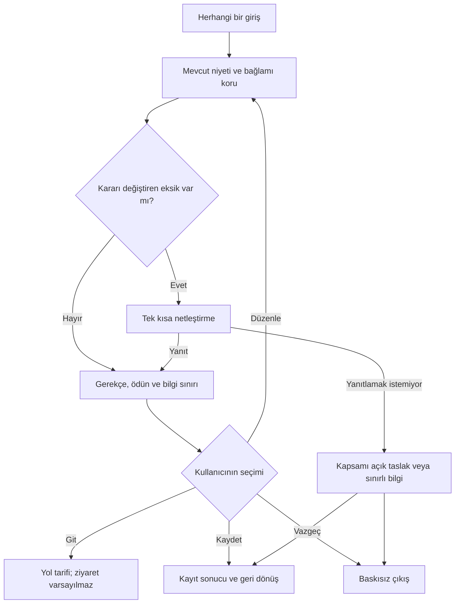
```mermaid
flowchart TD
    A["Herhangi bir giriş"] --> B["Mevcut niyeti ve bağlamı koru"]
    B --> C{"Kararı değiştiren eksik var mı?"}
    C -->|Hayır| D["Gerekçe, ödün ve bilgi sınırı"]
    C -->|Evet| E["Tek kısa netleştirme"]
    E -->|Yanıt| D
    E -->|Yanıtlamak istemiyor| F["Kapsamı açık taslak veya sınırlı bilgi"]
    D --> G{"Kullanıcının seçimi"}
    G -->|Git| H["Yol tarifi; ziyaret varsayılmaz"]
    G -->|Düzenle| B
    G -->|Kaydet| I["Kayıt sonucu ve geri dönüş"]
    G -->|Vazgeç| J["Baskısız çıkış"]
    F --> I
    F --> J
```

## 1. İlk giriş deneyimi

### Amaç

Kullanıcıya ürünü öğrenme görevi vermeden geldiği işi başlatmak. “İlk giriş” herhangi bir ilk açılış anıdır; bölüm 2 ise ürünle henüz deneyimi olmayan kişinin ilk faydaya ulaşmasını anlatır.

### Kullanıcı hissi

“Burada ne yapabileceğimi anlıyorum; önce kendimi tanıtmam gerekmiyor.” Doğrudan bağlantıdan gelen kişi “Beni beklediğim yere getirdiler” hissini yaşamalı.

### Karar yükü

Kimlik, ilgi alanı, konum veya bildirim için sıfır başlangıç sorusu. Ana sayfadan gelen kişi yalnız nasıl başlamak istediğini seçer. Doğrudan yer veya paylaşım açılışında başlangıç seçimi bile gerekmez.

### Ana akış

1. Giriş adresi korunur. Yer bağlantısı yeri, paylaşım bağlantısı paylaşılan görünümü, Keşfet bağlantısı taşıdığı koşulları açar.
2. Ana sayfada kısa vaat ve “Yer adı ya da yapmak istediğin şey” giriş açıklaması bulunur. Arama ile Keşfet başlangıçları anlaşılırdır.
3. “Yakınımda” kullanıcı seçerse neden konum gerektiği belirtilir; elle başlangıç seçimi aynı noktada bulunur. Açılışta izin penceresi yoktur.
4. Ürün tanıtım turu, açılış videosu, zorunlu karşılama dizisi ve uygulama yükleme perdesi yoktur. Yardım bağlam içinde isteğe bağlı açılır.
5. Kullanıcı ilk anlamlı içeriğe ulaşır; ürün anlatısını bitirmesi beklenmez.

### Başarısızlık noktaları

Yanlış/bozuk bağlantı bölüm 16'ya gider ve özgün adres bağlamı korunur. Kapsanmayan şehir bölüm 15'tir. Çerez/cihaz kaydı olmadığı için kullanıcı “yeni” varsayılıp tura zorlanmaz. İçerik yüklenemiyorsa boş ana sayfaya sessiz yönlendirme yapılmaz.

### Alternatif akışlar

Konum reddinde elle alan seçimi; aramayı bilmeyende amaç örnekleri; yalnız okumak isteyende doğrudan yer/yöntem içeriği. Çıkışta login veya “Gitmeden önce” daveti yoktur.

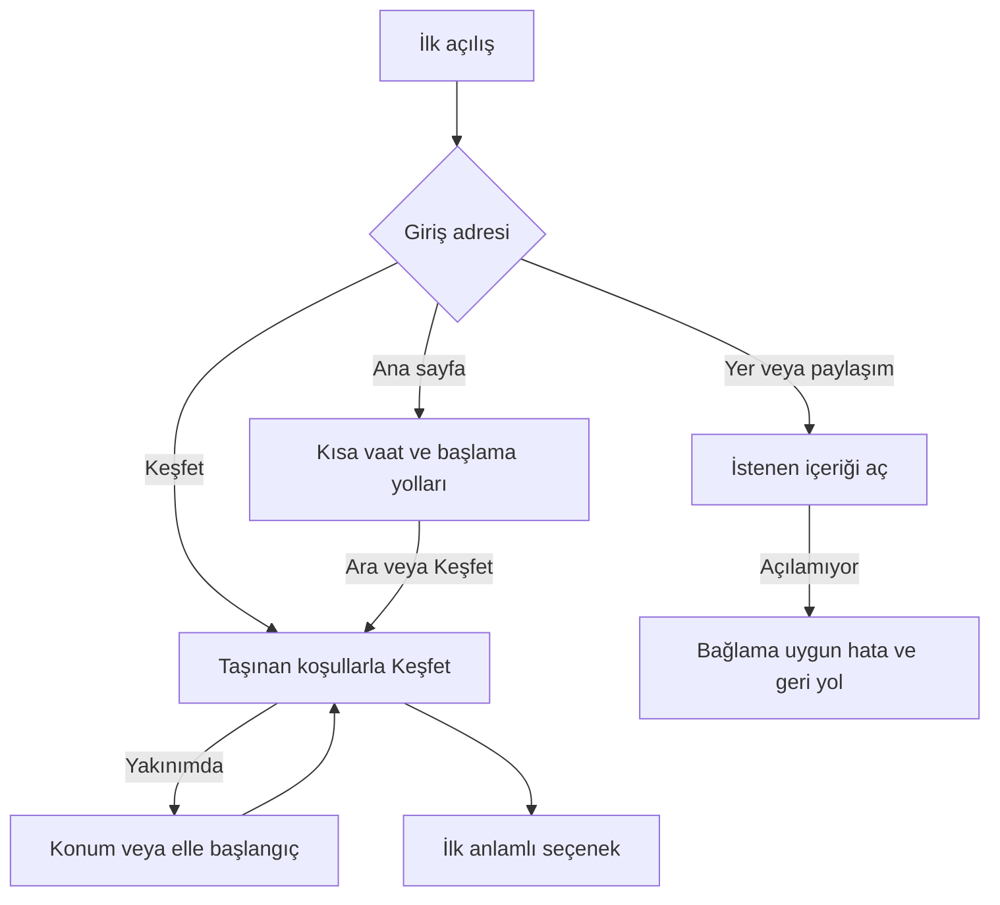
```mermaid
flowchart TD
    A["İlk açılış"] --> B{"Giriş adresi"}
    B -->|Yer veya paylaşım| C["İstenen içeriği aç"]
    B -->|Ana sayfa| D["Kısa vaat ve başlama yolları"]
    B -->|Keşfet| E["Taşınan koşullarla Keşfet"]
    D -->|Ara veya Keşfet| E
    E -->|Yakınımda| F["Konum veya elle başlangıç"]
    F --> E
    C -->|Açılamıyor| G["Bağlama uygun hata ve geri yol"]
    E --> H["İlk anlamlı seçenek"]
```

## 2. İlk kez gelen kullanıcı

### Amaç

Ürünün farkını açıklama turuyla değil, ilk gerekçeli seçimle öğretmek.

### Kullanıcı hissi

“Neye bakacağımı biliyorum; bilmediğim şey yüzünden yanlış yapmış sayılmıyorum.”

### Karar yükü

Bir başlangıç niyeti; yalnız gerekirse tek netleştirme. İlk sonuçta bütün filtreleri öğrenme zorunluluğu yoktur. İlk kullanım olduğunun tespiti davranış zorunluluğu yaratmaz.

### Ana akış

1. Kullanıcı yazabilir veya kapsamı olan az sayıdaki farklı amaç örneğinden başlayabilir. Örnek seçimi değiştirilebilir bir başlangıçtır.
2. “Şunu arıyorsun” özeti anlaşılmış coğrafya ve ihtiyacı görünür kılar. Yanlış anlama için “Düzelt” bulunur; her doğru anlama için ayrı onay ekranı açılmaz.
3. 3–5 hedefli ilk seçkide aynı karşılaştırma bilgileri vardır: yer kimliği, neden bakmaya değer, önemli ödün ve bilinmeyen.
4. İlk kartın gerçek içeriği nasıl karar verileceğini gösterir. İsteğe bağlı “Bu öneri neden?” açıklaması yöntem ayrıntısına götürür.
5. Yer açılır; “Yol tarifi” ile görev tamamlanabilir. Rota, hesap, liste veya katkı oluşturmak gerekmez.

### Başarısızlık noktaları

Kullanıcı örnekleri tek izin verilen amaçlar sanabilir; serbest yazma görünür kalır. İlk öneri “tam sana göre” diye sunulmaz. Yardım kutuları kritik yer bilgisi üzerine kapanmaz. Sonuç yoksa yeni kullanıcıya uzun form yüklenmez.

### Alternatif akışlar

Yalnız şehir bilen şehir bağlamında Keşfet'e geçer. Ne istediğini bilmeyen kullanım amacı açıklanmış farklı başlangıçlara bakar. Ürünü anlamak isteyen “Neden Şamandıra?”ya gider ve geldiği yere döner.

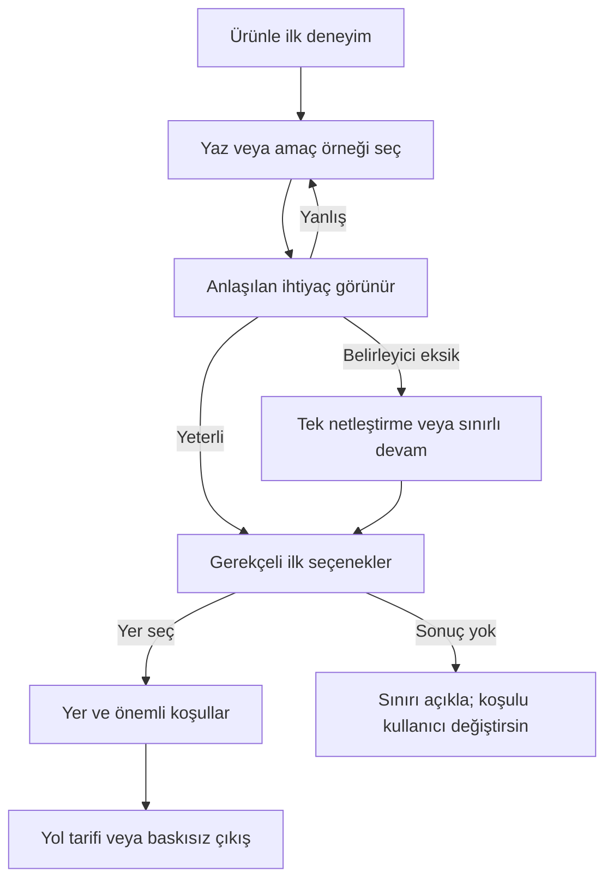
```mermaid
flowchart TD
    A["Ürünle ilk deneyim"] --> B["Yaz veya amaç örneği seç"]
    B --> C["Anlaşılan ihtiyaç görünür"]
    C -->|Yanlış| B
    C -->|Yeterli| D["Gerekçeli ilk seçenekler"]
    C -->|Belirleyici eksik| E["Tek netleştirme veya sınırlı devam"]
    E --> D
    D -->|Yer seç| F["Yer ve önemli koşullar"]
    D -->|Sonuç yok| G["Sınırı açıkla; koşulu kullanıcı değiştirsin"]
    F --> H["Yol tarifi veya baskısız çıkış"]
```

## 3. Tekrar gelen kullanıcı

### Amaç

Önceki emeğe kolay erişim sağlamak, bugünkü niyeti geçmişe mahkûm etmemek.

### Kullanıcı hissi

“Kaldığım yeri bulabiliyorum; bugün başka bir şey istemekte özgürüm.”

### Karar yükü

İlgili kayıt varsa “Devam et” veya yeni ihtiyaçla başlama arasında bir anlamlı seçim. Önceki alışkanlıkları doğrulayan başlangıç anketi yoktur.

### Ana akış

1. Doğrudan bağlantı eski oturumdan önceliklidir. Ana sayfa/Keşfet açılışında erişilebilen son taslak kısa şehir ve tarih bağlamıyla sunulur; kendiliğinden açılmaz.
2. “Devam et” kullanıcının son seçimlerini açar. Gün değişmişse kayıt ile bugünkü değerlendirme ayrılır.
3. “Yeni bir şey ara” önceki taslağı yeniden yazmadan yeni keşif bağlamı kurar.
4. Hatırlanması açıkça seçilmiş tercihler kullanılıyorsa görünürdür. “Bu aramada kullanma”, düzeltme ve unutma bulunur. Hassas notlar karşılama metnine taşınmaz.
5. Güncel bilgi önceki seçimi geçersiz kılıyorsa hangi durak/koşulun değiştiği gösterilir; kullanıcı adına başka yer konmaz.

### Başarısızlık noktaları

Cihaz kaydı yoksa “Kayıtların silindi” diye kesin neden uydurulmaz; “Bu cihazda kayıt görünmüyor” denir. Açık hesap varsa kullanıcı kendi isteğiyle hesabındaki kayda bakabilir. Eski retler başka günün bütün aramalarını gizlice daraltmaz.

### Alternatif akışlar

Aynı cihazda hesapsız devam; farklı cihazda yeni başlangıç veya isteğe bağlı hesap erişimi; geçmişi kullanmadan keşif. Kayıt erişimi sorunu yeni karar vermeyi engellemez.

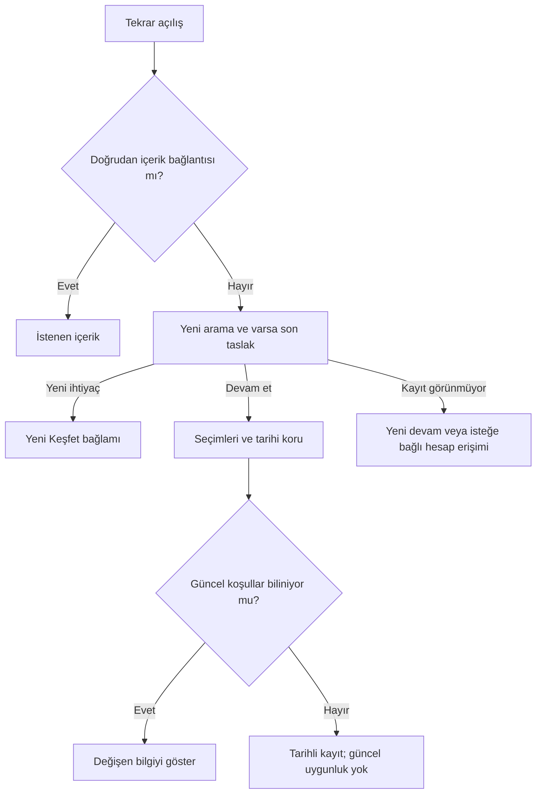
```mermaid
flowchart TD
    A["Tekrar açılış"] --> B{"Doğrudan içerik bağlantısı mı?"}
    B -->|Evet| C["İstenen içerik"]
    B -->|Hayır| D["Yeni arama ve varsa son taslak"]
    D -->|Yeni ihtiyaç| E["Yeni Keşfet bağlamı"]
    D -->|Devam et| F["Seçimleri ve tarihi koru"]
    F --> G{"Güncel koşullar biliniyor mu?"}
    G -->|Evet| H["Değişen bilgiyi göster"]
    G -->|Hayır| I["Tarihli kayıt; güncel uygunluk yok"]
    D -->|Kayıt görünmüyor| J["Yeni devam veya isteğe bağlı hesap erişimi"]
```

## 4. Arama ile giriş

### Amaç

Yer adı, coğrafya veya günlük dilde ihtiyaçtan en kısa anlamlı karşılığa ulaşmak.

### Kullanıcı hissi

“Nasıl yazmam gerektiğini tahmin etmiyorum; ne anlaşıldığını görebiliyorum.”

### Karar yükü

Bir sorgu; ad/şehir belirsizse bir ayırt etme. Yer adını bilen kişiye amaç anketi yoktur. Uzun doğal dil kullanmak şart değildir.

### Ana akış

1. Yer adı, şehir/ilçe, tür, faaliyet ve birleşik ihtiyaç aynı arama girişinde kullanılabilir.
2. Tam yer eşleşmesi ad, tür ve şehir/şubeyle ayrılır; kullanıcı doğrudan yer sayfasını seçer. Yanlış koşula sahip yer bulunabilir ama uygun öneri gibi sunulmaz.
3. İhtiyaç sorgusu Keşfet durumuna dönüşür. Anlaşılan ve anlaşılmayan önemli parçalar kaybolmaz; örneğin “ücretsiz” değerlendirilmediyse tam eşleşme denmez.
4. Türkçe karakter/yazım farkı için anlamı koruyan eşleşmeler gösterilir. Belirli yer adını değiştiren düzeltme sessizce uygulanmaz; “Bunu mu aradın?” yolu vardır.
5. “Yakınımda” için seçilmiş başlangıç veya isteğe bağlı konum kullanılır. “En iyi” yerine amaç netleştirilir; “şu an sakin” için canlı bilgi yoksa geçmiş örüntü açıkça ayrılır.
6. Kullanıcı sorguyu yenilerken eski sonuçlar eski sorguya ait oldukları anlaşılır biçimde kalabilir; yeni sorgunun sonucu sayılmaz.

### Başarısızlık noktaları

Aynı adlı şubeler, yanlış coğrafya, anlaşılmayan zorunlu koşul ve eski yanıtın yeni yazıyı ezmesi. Sistem sorunu “Aradığın yer yok” diye anlatılmaz. Sorgu hata/geri dönüşte korunur.

### Alternatif akışlar

Doğal dil işlenemiyorsa yer adı, tür ve coğrafyayı açık seçimle kullanma; yanlış şubede diğer eşleşmelere dönüş; şehir sayfası varsa onu okuma veya doğrudan o şehirde Keşfet. Sesli giriş mevcutsa düzeltilebilir metne aynı anlamla dönüşür; zorunlu yöntem değildir.

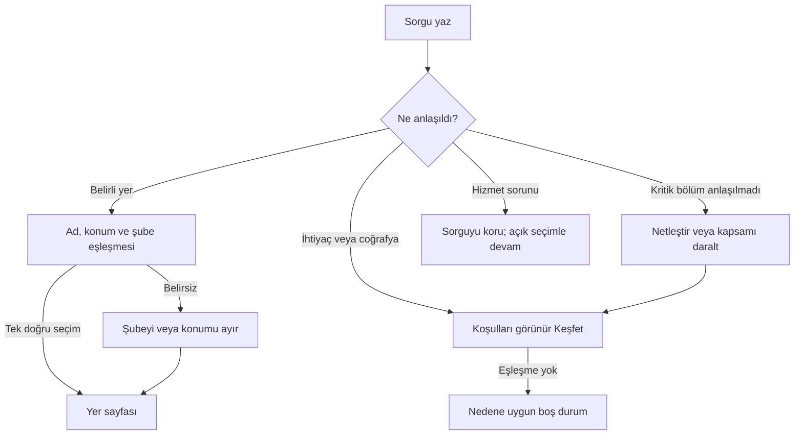
```mermaid
flowchart TD
    A["Sorgu yaz"] --> B{"Ne anlaşıldı?"}
    B -->|Belirli yer| C["Ad, konum ve şube eşleşmesi"]
    C -->|Tek doğru seçim| D["Yer sayfası"]
    C -->|Belirsiz| E["Şubeyi veya konumu ayır"]
    E --> D
    B -->|İhtiyaç veya coğrafya| F["Koşulları görünür Keşfet"]
    B -->|Kritik bölüm anlaşılmadı| G["Netleştir veya kapsamı daralt"]
    G --> F
    F -->|Eşleşme yok| H["Nedene uygun boş durum"]
    B -->|Hizmet sorunu| I["Sorguyu koru; açık seçimle devam"]
```

## 5. Keşfet ile giriş

### Amaç

Anlamlı farkları karşılaştırarak karar vermeyi kolaylaştırmak; kullanıcıyı katalog taramaya bırakmamak.

### Kullanıcı hissi

“Az ama farklı seçenek görüyorum; daha fazlasını istemek de elimde.”

### Karar yükü

İlk kümede 3–5 hedefli seçenek. Bir seferde bütün filtre aileleriyle uğraşma zorunluluğu yoktur. Harita açmak ek seçenek seçme şartı değildir.

### Ana akış

1. Şehir/çevre ve mevcut ihtiyaç görünür. Bilinmiyorsa yalnız gerekli coğrafya sorulur; otomatik tüm Türkiye önerisi oluşmaz.
2. İlk sonuçlar ortak karar ölçütleriyle sunulur. Bilgi yetersizse sayı tamamlanmaz.
3. Koşullar ihtiyacı değiştirdikleri anda açılır. Tercih ile zorunlu sınırın anlamı gerektiğinde “Olmazsa olmaz” gibi somut açıklamayla ayrılır; her tercih için ikili sınav yapılmaz.
4. Harita aynı sonuçların konumunu gösterir. Haritayı kaydırmak sorguyu değiştirmez; “Bu alanda ara” seçimi gerekiyorsa sonucu nasıl daraltacağı açıklanır.
5. “Daha fazla sonuç” açık eylemdir; sonuçların sonu anlaşılır. Yer detayından dönüş sorguyu, filtreleri, reddedilenleri ve liste konumunu korur.
6. “Bu seçenek uymuyor” aynı bağlamda reddi uygular; neden yazmak şart değildir. Geri alma ile tekrar görülebilir.

### Başarısızlık noktaları

Harita hareketinin sessiz coğrafya değişimi, çok filtre yüzünden boş sonuç, aynı yerlerin farklı gerekçeyle tekrarı. Zorunlu erişim bilinmeyenler doğrulanmış eşleşme kümesine karışmaz.

### Alternatif akışlar

Haritasız liste; başlangıcı biliniyorsa anlamı açıklanan mesafe sıralaması; şehir/ilçe hakkında karar bilgisine bakıp geri dönme; mevcut koşulları tek tek düzeltme. “Tümünü temizle” açık seçimdir ve kaydedilmiş rotayı temizlemez.

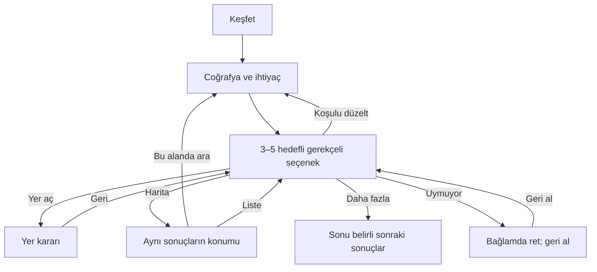
```mermaid
flowchart TD
    A["Keşfet"] --> B["Coğrafya ve ihtiyaç"]
    B --> C["3–5 hedefli gerekçeli seçenek"]
    C -->|Yer aç| D["Yer kararı"]
    D -->|Geri| C
    C -->|Koşulu düzelt| B
    C -->|Harita| E["Aynı sonuçların konumu"]
    E -->|Bu alanda ara| B
    E -->|Liste| C
    C -->|Daha fazla| F["Sonu belirli sonraki sonuçlar"]
    C -->|Uymuyor| G["Bağlamda ret; geri al"]
    G -->|Geri al| C
```

## 6. Yer sayfasından rota oluşturma

### Amaç

Bir yeri daha geniş bir günlük niyetle ilişkilendirmek; tek yere gitmeyi gereksiz planlamaya çevirmemek.

### Kullanıcı hissi

“Bu yeri seçtim; istersem çevresindeki günü düşünebilirim.”

### Karar yükü

“Bu yerle rota oluştur” yalnız ilgili ikincil eylemdir. Aktif taslak tekse yeniden taslak seçtirilmez; birden fazla anlamlı hedef varsa hangi taslağa ekleneceği sorulur.

### Ana akış

1. Yer kimliği, önemli engeller ve karar bilgisi 01'deki sırayla görünür. “Yol tarifi” doğrudan kullanılabilir.
2. Kullanıcı “Bu yerle rota oluştur” seçerse yer, şehir ve mevcut açık koşullar taslağa taşınır. Bu seçim “mutlaka ziyaret” kilidi oluşturmaz.
3. Aktif taslak varsa eylem “Rotaya ekle” olarak anlamını açıklar; yeni taslak istenirse ayrı seçenek vardır.
4. Başka faaliyet/süre amacı zaten biliniyorsa tekrar sorulmaz. Bilinmiyorsa kullanıcı yer ekleyebilir, niyetini yazabilir veya tek yerli taslağı koruyabilir.
5. Ziyaret engeli/bilgi eksiği yeni taslağa da taşınır. Kişisel seçim korunur; desteklenmeyen uygunluk oluşmaz.

### Başarısızlık noktaları

Yanlışlıkla çift ekleme durumunda “Bu yer taslakta var” ve ilgili durağa geçiş sunulur. Bilinçli ikinci ziyaret seçilebilir; farklı şubeler birleştirilmez. Farklı şehir mevcut rotayı bozmaz; yeni şehir taslağı yolu açıklanır.

### Alternatif akışlar

Doğrudan yol tarifi; Gezeceğim Yerler'e kaydetme; uygun olmayan yeri not olarak taslakta tutma; yerden çıkıp alternatiflere bakma. Dış yol tarifi açılamazsa adres ve seçilebilir konum bilgisi kalır.

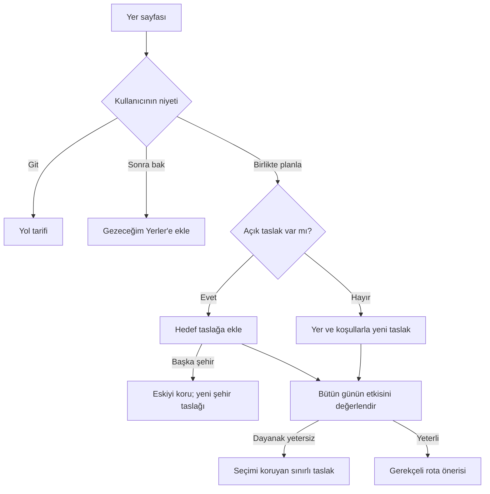
```mermaid
flowchart TD
    A["Yer sayfası"] --> B{"Kullanıcının niyeti"}
    B -->|Git| C["Yol tarifi"]
    B -->|Sonra bak| D["Gezeceğim Yerler'e ekle"]
    B -->|Birlikte planla| E{"Açık taslak var mı?"}
    E -->|Hayır| F["Yer ve koşullarla yeni taslak"]
    E -->|Evet| G["Hedef taslağa ekle"]
    G -->|Başka şehir| H["Eskiyi koru; yeni şehir taslağı"]
    G --> I["Bütün günün etkisini değerlendir"]
    F --> I
    I -->|Dayanak yetersiz| J["Seçimi koruyan sınırlı taslak"]
    I -->|Yeterli| K["Gerekçeli rota önerisi"]
```

## 7. Akıllı Rota oluşturma

### Amaç

Günün ana amacını, vazgeçilmez koşulları ve toplam yükü anlaşılır bir ziyaret dizisinde buluşturmak.

### Kullanıcı hissi

“Günümü doldurmaya çalışmıyor; neye zaman kalacağını ve neyi kabul edeceğimi anlıyorum.”

### Karar yükü

Doğal dil, seçilmiş yerler, ihtiyaç seçimi, hazır koleksiyon veya boş taslakla başlangıç. Her girişte tek tek bütün alanları doldurma zorunluluğu yoktur. Bir ana öneri; istenirse anlamlı fark taşıyan en çok iki ek gün seçeneği.

### Ana akış

1. Başlangıcın getirdiği amaç, şehir, aday yerler ve koşullar korunur. Koleksiyon güncel yapılabilir rota sayılmaz; tek yerini almak mümkündür. Boş taslak kaydedilebilir.
2. Yapılacak iddiayı değiştiren ilk eksik sorulur. Tarih/saat bilinmiyorsa tarihsiz fikir; başlangıç bilinmiyorsa ilk duraktan itibaren kapsam; dönüş istenmemişse “dönüş hariç” anlatılır. Ulaşım bilinmeden yürünebilirlik varsayılmaz.
3. Kullanıcının “rahat” sözü gerekirse “Daha az yürümek mi, daha az yer değiştirmek mi?” ile açılır; “ikisi de” mümkündür. Tempo puanı yoktur.
4. Birden çok amaç çatışırsa hangisinin korunacağı netleştirilir. Grupta bir kişinin zorunlu koşulu çoğunluk tercihine yenilmez. İşlevsel ihtiyaç sorulur; teşhis veya kimlik sorulmaz.
5. Sonuç; günün amacı, durak rolleri, sıra gerekçesi, kapsamlı toplam zaman/hareket, bilinen maliyet kapsamı, önemli ödün ve bilinmeyenle birlikte gösterilir. Bekleme, kalış, ilk yol ve istenen dönüş yok sayılmaz.
6. Seçilmiş ama sığmayan yerler görünür kalır. “Üçüncü yeri eklemek sohbet süresini azaltıyor” açıklaması kullanıcının kararına açılır. Sabit yer, saat ve sıra kendiliğinden çözülmez.
7. Kullanıcı öneriyi kullanabilir, düzenleyebilir, kaydedebilir veya vazgeçebilir. Tek durak, boş zaman ve daha kısa gün geçerli sonuçtur.

### Başarısızlık noktaları

Kritik erişim bilinmiyor, gerekli ücret bilinmiyor, son girişe yetişilemiyor, sabitler çatışıyor veya yeterli bağlantı bilgisi yok. Bunlar genel “Rota üretilemedi” metnine indirgenmez. Olumlu bütün rota iddiası kurulmaz; bağımsız bilinen kısım ve kullanıcının taslağı korunur.

### Alternatif akışlar

Soruyu yanıtsız bırakıp sınırlı taslak; kullanıcı seçimiyle tek sınır değişikliği; daha sade gün; sabitleri koruyan başka sıra; hiçbir uygun dizi yoksa kaydet ve sonra dön. Yağmur alternatifi aynı açık alan bağımlılığını taşırsa gerçek alternatif diye sunulmaz.

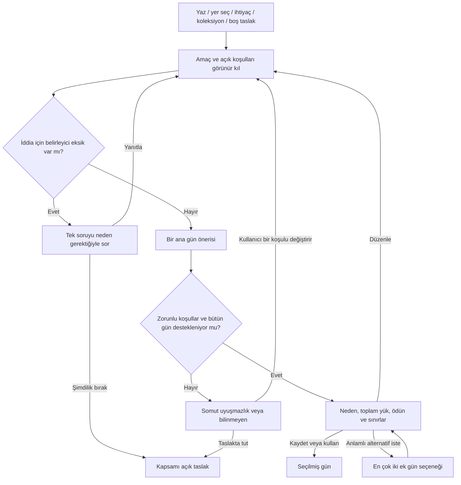
```mermaid
flowchart TD
    A["Yaz / yer seç / ihtiyaç / koleksiyon / boş taslak"] --> B["Amaç ve açık koşulları görünür kıl"]
    B --> C{"İddia için belirleyici eksik var mı?"}
    C -->|Evet| D["Tek soruyu neden gerektiğiyle sor"]
    D -->|Yanıtla| B
    D -->|Şimdilik bırak| E["Kapsamı açık taslak"]
    C -->|Hayır| F["Bir ana gün önerisi"]
    F --> G{"Zorunlu koşullar ve bütün gün destekleniyor mu?"}
    G -->|Evet| H["Neden, toplam yük, ödün ve sınırlar"]
    G -->|Hayır| I["Somut uyuşmazlık veya bilinmeyen"]
    I -->|Kullanıcı bir koşulu değiştirir| B
    I -->|Taslakta tut| E
    H -->|Düzenle| B
    H -->|Kaydet veya kullan| J["Seçilmiş gün"]
    H -->|Anlamlı alternatif iste| K["En çok iki ek gün seçeneği"]
    K --> H
```

## 8. Rota düzenleme

### Amaç

Bir değişiklik için bütün günü yeniden düşünme yükünü kaldırmak; yan etkileri saklamamak.

### Kullanıcı hissi

“Ne değiştiğini görebiliyorum; yaptığım iş kaybolmuyor ve geri dönebiliyorum.”

### Karar yükü

Bir düzenleme niyeti. Basit açık değişiklikte sıfır ek onay; başka sınırdan vazgeçmek gerekiyorsa yalnız o ek karar. Bütün formun yeniden doldurulması yoktur.

### Ana akış

1. Doğrudan eylemler ile günlük dil aynı anlamı taşır: yer ekle/çıkar, yerini değiştir, kalışı uzat, mola ekle, başlangıç/bitiş/süre/ulaşım/bütçe/amaç düzelt.
2. “Bu yer mutlaka olsun”, “Bu saatte burada olmalıyım” ve “Bu sırayı koru” ayrı seçimlerdir; hepsi varsayılan olarak kullanıcıya sorulmaz.
3. Kullanıcının basit isteği taslağa uygulanır. Yeniden değerlendirme sürerken yeni seçim ve bekleyen değerlendirme görünür; eski toplam yeni seçimin toplamı gibi kalmaz.
4. Değişikliğin zaman, maliyet, amaç ve zorunlu koşula ilgili etkisi kısa verilir. Yeni bir ödün gerekirse kullanıcıya önerilir; mevcut sınır korunur.
5. Sıra değişimi son girişe yetişmiyorsa yeni sıra taslakta kalabilir; yapılabilirlik hükmü kalkar. “Bu sırayı tut” ile “Uygun sırayı göster” ayrıdır.
6. “Geri al” kullanıcı seçimini önceki haline getirir. Yeni kapanma bilgisini silmez; geri gelen düzen güncel koşullarla değerlendirilir.
7. Aktif günün tamamlandığı beyan edilen ziyaretleri korunur; kalan bölüm düzenlenir. Yer çıkarmanın boşalttığı süre otomatik doldurulmaz.

### Başarısızlık noktaları

Arka arkaya iki düzenleme, değerlendirme kesintisi, zorunlu kilit çatışması ve fark edilmeyen kayıt durumu. Son niyet korunur; işlem belirsizken “Tamamlandı” denmez. Ana amacı taşıyan durak çıkarıldığında amacın artık karşılanmadığı söylenir.

### Alternatif akışlar

Sürükleme yerine “Öne al”, “Sona al”, “Şu yerden sonra”; bütün gün yerine bir durağı değiştirme; son durağı çıkarıp boş taslak; değişikliği geri alma; başka şehir için eskiyi koruyan yeni taslak. Her alternatifin sonucu aynı gerekçe ve sınırlara tabidir.

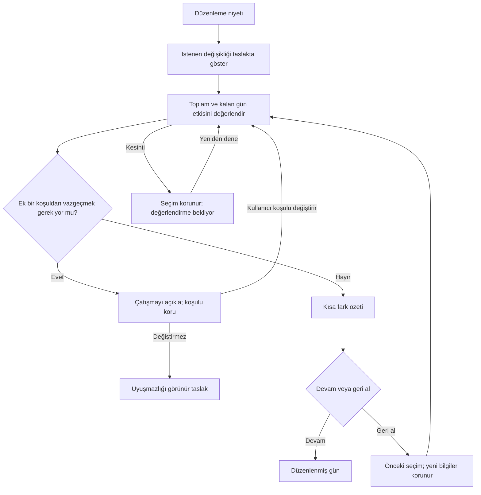
```mermaid
flowchart TD
    A["Düzenleme niyeti"] --> B["İstenen değişikliği taslakta göster"]
    B --> C["Toplam ve kalan gün etkisini değerlendir"]
    C --> D{"Ek bir koşuldan vazgeçmek gerekiyor mu?"}
    D -->|Hayır| E["Kısa fark özeti"]
    D -->|Evet| F["Çatışmayı açıkla; koşulu koru"]
    F -->|Kullanıcı koşulu değiştirir| C
    F -->|Değiştirmez| G["Uyuşmazlığı görünür taslak"]
    C -->|Kesinti| H["Seçim korunur; değerlendirme bekliyor"]
    H -->|Yeniden dene| C
    E --> I{"Devam veya geri al"}
    I -->|Devam| J["Düzenlenmiş gün"]
    I -->|Geri al| K["Önceki seçim; yeni bilgiler korunur"]
    K --> C
```

## 9. Rotayı kaydetme

### Amaç

Boş, tarihsiz, kısmi veya değerlendirilmiş günlük seçimi hesap zorunluluğu olmadan korumak ve tekrar bulmak.

### Kullanıcı hissi

“Emeğimi sakladım; nerede saklandığını ve sınırını biliyorum.”

### Karar yükü

Tek “Rotayı kaydet” eylemi; isim ve tarih zorunlu değildir. Nötr önerilen ad düzenlenebilir. İlk kayıtta kalıcılık açıklaması, ek bir onay formu olmadan eylemin yanında bulunur.

### Ana akış

1. Kayıt eylemi taslağın bulunduğu yerde sunulur. Hesapsız kayıt açıklaması: “Bu cihazda saklanır. Cihaz verileri silinirse veya cihaz değiştirirsen erişemeyebilirsin.”
2. Seçilmiş günün amacı, kararları, gerekli kapsam ve sınırları saklanır. Gereksiz hassas anlatı otomatik başlığa dönüşmez.
3. “Kaydediliyor” ile “Bu cihaza kaydedildi” ayrılır. Başarı yalnız kayıt doğrulandığında gösterilir. Hesap kaydı kullanılıyorsa onun tamamlanma durumu ayrıca anlaşılırdır.
4. “Kaydettiklerinde aç” aynı Keşfet bağlamındaki rotalara götürür. Kullanıcı kayıt sonrası hemen yol tarifine geçebilir.
5. Kaydedilmiş rotayı düzenlerken “Kaydedilmemiş değişiklikler” görünür; “Değişiklikleri kaydet” açık eylemdir. Taslak korunması, hesapta/paylaşımda güncelleme sayılmaz.
6. Yeniden açılan eski kayıtta tarih ve yeni koşullar ayrılır. Silme ve yeniden adlandırma aynı bağlamda yapılır; silme sonrasında geri alma vardır.

### Başarısızlık noktaları

Cihaz kaydı kullanılamıyorsa “Kaydedemedik; taslak bu açık görünümde duruyor” denir; kalıcılık sözü verilmez. Erişilebilen metni kopyalama ve yeniden deneme yolu bulunur. Kayıt durumu belirsizse önce mevcut kayıt kontrol edilir; yeniden deneme çift rota üretmiş gibi davranmaz.

### Alternatif akışlar

Boş taslağı kaydet; “Kopyasını oluştur” ile önceki günü koru; isteğe bağlı cihazlar arası devam bilgisine bak; kaydetmeden kullan. Kalıcılaştırılamayan değişikliklerle çıkışta yalnız gerçek kayıp varsa “Kaydet ve çık / Kaydetmeden çık / Geri dön” seçimi verilir. Silinen rotanın aktif paylaşımı kapanır; geri alma linki otomatik açmaz ve dış kopyaları geri çekmez.

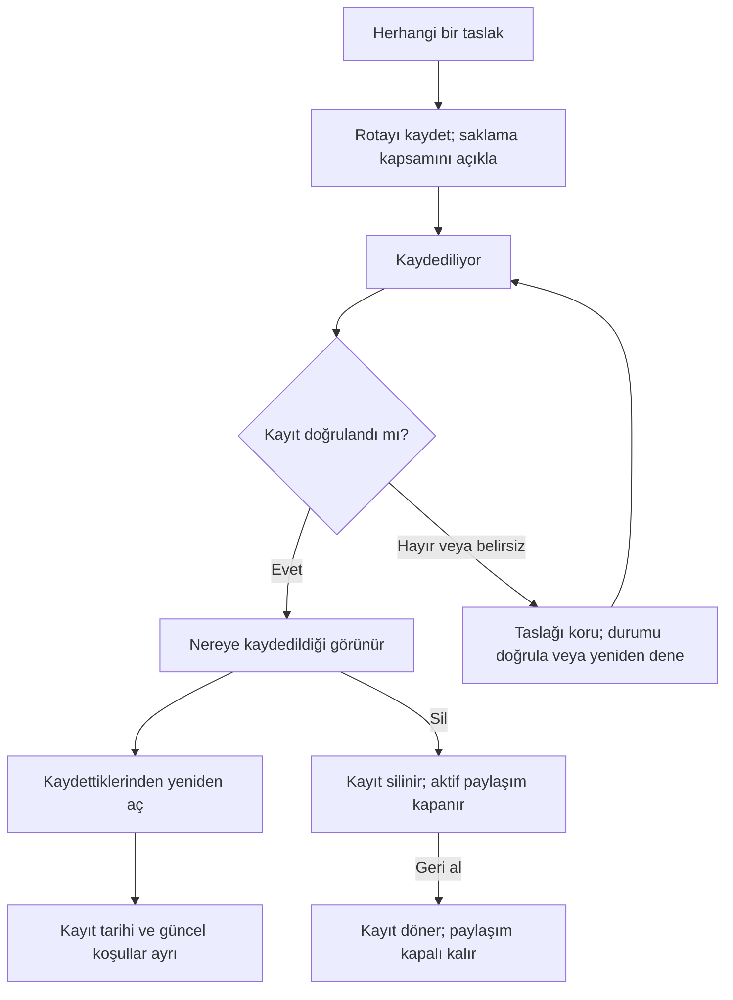
```mermaid
flowchart TD
    A["Herhangi bir taslak"] --> B["Rotayı kaydet; saklama kapsamını açıkla"]
    B --> C["Kaydediliyor"]
    C --> D{"Kayıt doğrulandı mı?"}
    D -->|Evet| E["Nereye kaydedildiği görünür"]
    D -->|Hayır veya belirsiz| F["Taslağı koru; durumu doğrula veya yeniden dene"]
    F --> C
    E --> G["Kaydettiklerinden yeniden aç"]
    G --> H["Kayıt tarihi ve güncel koşullar ayrı"]
    E -->|Sil| I["Kayıt silinir; aktif paylaşım kapanır"]
    I -->|Geri al| J["Kayıt döner; paylaşım kapalı kalır"]
```

## 10. Gezeceğim Yerler

### Amaç

Daha sonra değerlendirmek istenen yerleri ziyaret taahhüdü veya tamamlanacak görev üretmeden tutmak.

### Kullanıcı hissi

“Bunu aklımda taşımam gerekmiyor; ne zaman bakacağım bana ait.”

### Karar yükü

Tek ekleme; tarih, etiket, koleksiyon adı ve sıra zorunlu değil. Birkaç yeri gün için kullanmak isteyince yalnız seçilen yerler değerlendirilir.

### Ana akış

1. Yer veya Keşfet sonucundaki “Gezeceğim Yerler'e ekle” kişisel niyeti kaydeder. Simgesiz/metinle anlamı da anlaşılır; kalp otomatik beğeni anlamı yüklemez.
2. Gerçek kayıt sonrası durum “Gezeceğim Yerler'de” olur; çıkarma ve geri alma mümkündür. Hesapsız saklama sınırı bölüm 9 ile aynıdır.
3. Keşfet → Kaydettiklerin → Gezeceğim Yerler aynı durum içinde listeyi açar. Şehir arama/daraltma isteğe bağlıdır; tarihsiz ve farklı şehirlerden yerler bulunabilir.
4. Bir veya birkaç yer seçip “Birlikte değerlendir” denir. Liste korunur; rotaya aday taşınır, “mutlaka” yapılmaz. Farklı şehirlerin tek günlük kapsamı aşması açıkça belirtilir.
5. Kapanmış veya bilgisi değişmiş yer listeden silinmez; engel yanında görünür. Kaydedilmiş olmak uygunluğa bonus değildir.

### Başarısızlık noktaları

Simgeden eylemin anlaşılmaması, çift kayıt, cihaz kaydı kaybı, liste silmeyle rotadan çıkarmanın karışması. Kayıt başarısızsa dolu simge kesin başarı gibi kalmaz. Boş liste “Henüz burada bir yer saklamadın” der; eksik kullanıcı hissi yaratmaz.

### Alternatif akışlar

Yer sayfasını aç; yalnız bir yere git; listeden çıkar ve geri al; rotaya eklemeden sakla; ziyaret ettikten sonra gelecekte tekrar gitmek için listede tut. Uzun süre bekleyen yere ilişkin baskılı hatırlatma yoktur.

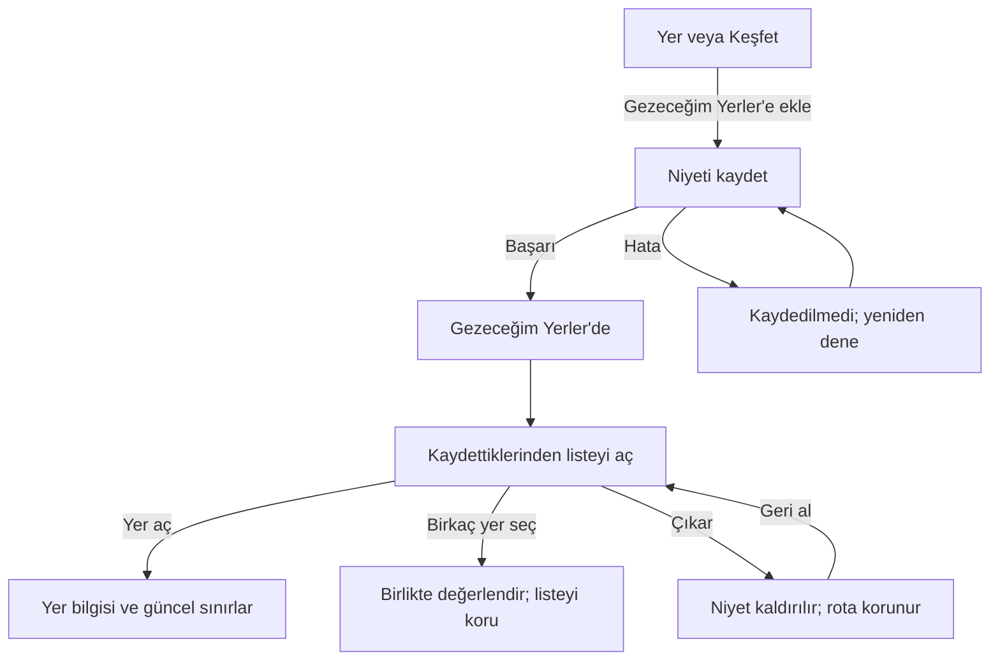
```mermaid
flowchart TD
    A["Yer veya Keşfet"] -->|Gezeceğim Yerler'e ekle| B["Niyeti kaydet"]
    B -->|Başarı| C["Gezeceğim Yerler'de"]
    B -->|Hata| D["Kaydedilmedi; yeniden dene"]
    D --> B
    C --> E["Kaydettiklerinden listeyi aç"]
    E -->|Yer aç| F["Yer bilgisi ve güncel sınırlar"]
    E -->|Birkaç yer seç| G["Birlikte değerlendir; listeyi koru"]
    E -->|Çıkar| H["Niyet kaldırılır; rota korunur"]
    H -->|Geri al| E
```

## 11. Gezdiğim Yerler

### Amaç

Kullanıcının ziyaret ettiğini söylediği yerleri yeniden bulmasını ve isterse yeni bir güne taşımasını sağlamak; beğeni veya doğrulama puanı üretmemek.

### Kullanıcı hissi

“Geçmişimi ben tarif ediyorum; her ziyareti kaydetmek veya değerlendirmek zorunda değilim.”

### Karar yükü

“Buradaydım” bir ziyaret beyanıdır. Tarih/bölüm/saat yalnız biliniyorsa eklenebilir; bilinmeyeni doldurma zorunluluğu yoktur. Bir İz ikinci ve isteğe bağlı iştir.

### Ana akış

1. Yer sayfası, rota durağı veya kayıtlı yer üzerinden “Buradaydım” seçilir. Yanında “Gezdiğim Yerler'e eklenir” sonucu anlaşılırdır.
2. Ziyaret beyanı kaydedilir; bilinmeyen tarih “Tarih belirtilmedi” kalır. Planlanan saat gerçekleşmiş saat yerine konmaz.
3. Aynı etkin rota durağı üzerinden verildiyse o ziyaret, kullanıcının tamamladığını bildirdiği bölüm olur. Yer sayfasından genel geçmiş beyanı, bugünkü rota durağını otomatik tamamlamaz.
4. Gezeceğim Yerler'deki niyet yerinde kalır; kaldırmak ayrı eylemdir. Gezdiğim Yerler → yer → “Yeniden gitmek için değerlendir” yeni gün taslağı açar.
5. Yanlış işaretleme “Geri al” ile düzelir. Ziyaret kaydı silmek zaten ayrıca gönderilmiş Bir İz katkısını silmiş sayılmaz; iki işlemin kapsamı açık tutulur.
6. Kullanıcı kendi isteğiyle “Bir gözlem bırak” açabilir. Ziyaret kapsamı zaten doğrulanmışsa tekrar sorulmaz. Gözlem kaydı ve yayın ayrı anlamlardır.

### Başarısızlık noktaları

Yol tarifi/konumdan otomatik ziyaret çıkarma; bilinmeyen tarihi bugün sanma; her geçmiş yerin beğenildiğini varsayma; kayıt yokken “Hiç gezmemişsin” söylemi. Boş durum yalnız “Henüz ziyaret ettiğini işaretlediğin yer yok” der.

### Alternatif akışlar

Tarihsiz ziyaret; aynı yere başka gün yeniden ziyaret; hatalı beyanı kaldırma; geçmişi kaydetmeden çıkma; gözlemlemediği konuya cevap vermeme. Aynı rota durağına tekrar dokunmak ikinci ziyaret üretmez; bilinçli yeni ziyaret ayrı seçimdir.

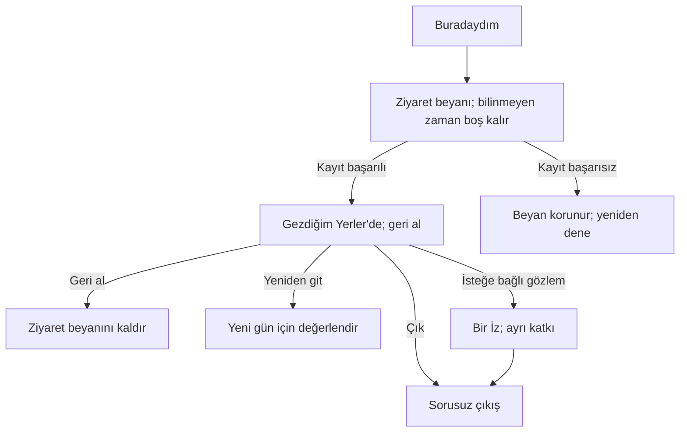
```mermaid
flowchart TD
    A["Buradaydım"] --> B["Ziyaret beyanı; bilinmeyen zaman boş kalır"]
    B -->|Kayıt başarılı| C["Gezdiğim Yerler'de; geri al"]
    B -->|Kayıt başarısız| D["Beyan korunur; yeniden dene"]
    C -->|Geri al| E["Ziyaret beyanını kaldır"]
    C -->|Yeniden git| F["Yeni gün için değerlendir"]
    C -->|İsteğe bağlı gözlem| G["Bir İz; ayrı katkı"]
    C -->|Çık| H["Sorusuz çıkış"]
    G --> H
```

## 12. Paylaşım

### Amaç

Seçilmiş yer veya günü başka bir kişinin gerekçesi ve sınırlarıyla anlayabilmesini sağlamak; özel bilgiyi veya özel düzenlemeleri kendiliğinden yayımlamamak.

### Kullanıcı hissi

“Ne paylaşılacağını görüyorum; kontrolü ve sınırlarını biliyorum.” Alıcı için: “Birinin planını okuyorum; bu benim koşullarıma verilmiş öneri değil.”

### Karar yükü

Paylaşım niyeti → kapsam önizlemesi → kanal/aktarım seçimi. Gizlilik kararlarının hepsi boş seçimlerle kullanıcıya yüklenmez; varsayılan içerik asgaridir. Gönderim kullanıcının açık eylemidir.

### Ana akış

1. “Paylaş” doğrudan dış gönderim yapmaz; okunabilir önizleme açar. Varsayılan nötr başlık, şehir, seçilmiş duraklar, roller, süre kapsamı, önemli koşullar ve kayıt/değerlendirme bağlamıdır.
2. Ev/otel başlangıcı, canlı konum, kişiler, sağlık gerekçesi, özel not, kişisel bütçe ve rezervasyon ayrıntıları varsayılan dışarıda kalır. Başlık ve dış önizleme metni de buna dahildir.
3. Gizlenen kişisel koşul bir olumlu hükmün gerekçesiyse hüküm de daralır veya koşul kişisiz anlatılır: “Bu geçişin basamaksız olduğu doğrulanmadı.” Kritik uyarı görünüm tercihiyle çıkarılamaz.
4. Link için “Bağlantıyı bilenler açabilir; başkalarına iletilebilir” ve yönetme/kapatma erişimi açıklanır. Hesapsız kişi yönetim erişimini kaybederse kapatmanın garanti olmadığı, mevcut desteğe ulaşabileceği belirtilir. Yönetim erişimi alıcı bağlantısına eklenmez.
5. Kullanıcı bağlantı oluşturma veya metin/görsel hazırlamayı seçer; sonra kendisi kopyalar, kaydeder ya da dış paylaşım aracına geçer. Dış uygulamaya geçiş “Gönderildi” diye raporlanmaz.
6. Alıcı salt okunur görünümü hesap ve uygulama yükleme zorunluluğu olmadan açar. “Kendi günüm için değerlendir” ayrı taslak oluşturur; sahibin özel tercihleri alıcıya mal edilmez.
7. Özel taslak değişirse “Paylaşılan sürüm farklı” sahibi için görünür. “Paylaşılan sürümü güncelle” yeniden kapsam önizlemesiyle seçimi değiştirir. Doğrulanmış kapanma gibi bilgi düzeltmeleri ise eski olumlu güvenceyi açık linkte kendiliğinden durdurur; yeni yer seçmez.
8. “Paylaşımı kapat” ve isteğe bağlı süre sonu temel kontroldür. Rota silinirse aktif paylaşım kapanır. İndirilmiş metin/görsel veya dış platform kopyaları geri alınmış sayılmaz.

| Kanal | Önizleme ve alternatif | Başarı geri bildirimi |
|---|---|---|
| Link | Salt okunur kapsam, yeniden iletilebilirlik, kapatma yolu | Bağlantı gerçekten hazırsa “Bağlantı hazır”; kopyalama gerçekleşirse “Kopyalandı” |
| WhatsApp | Görselsiz anlaşılır sıralı metin; süre/dönüş ve kritik koşul | Aktarım açıldı; gönderim kanıtı yoksa “Gönderildi” yok. Metin/link kopyalama alternatifi |
| Story | Okunabilir gün fikri, tarih/kapsam, sığmayan durak sayısı ve gerekli sınır | Görsel hazır/kaydedildi; dış yayın iddiası yok. Görsele eşdeğer metin bulunur |
| QR | Açıklama ve okunabilir/kopyalanabilir bağlantıyla aynı hedef | QR hazır; tarama ziyaret veya onay sayılmaz |
| Tek yer | Kamusal yer bağlantısı, gerekli karar sınırı; kişisel arama metni otomatik eklenmez | Kaynak yerin güncel kapsamına açılır; kişisel uygunluk aktarılmış sayılmaz |

### Başarısızlık noktaları

Bağlantı oluşturulamaması, dış paylaşımın iptali, kapsamı gizlenmiş olumlu görsel, yönetim erişiminin kaybı ve eski link. İptal taslağı değiştirmez. Bağlantı kapalıysa “Bu paylaşım artık açık değil” denir; özel içerik veya sahibin kimliği açılmaz. Story'ye kritik sınır sığmıyorsa özet daralır, ek görsel kullanılır veya yalnız taslak anlatılır.

### Alternatif akışlar

Kopyala; okunabilir metin kullan; yalnız tek yer paylaş; paylaşmadan çık; yeni kişisel kopya oluştur. Çevrimdışı yeni erişilebilir link oluşturulduğu söylenmez. İleri davetli ortak çalışma henüz kapsam adayıdır; açılırsa okuma/öneri/düzenleme ayrılır, öneriler otomatik uygulanmaz ve başkasının zorunlu koşulu kaldırılamaz.

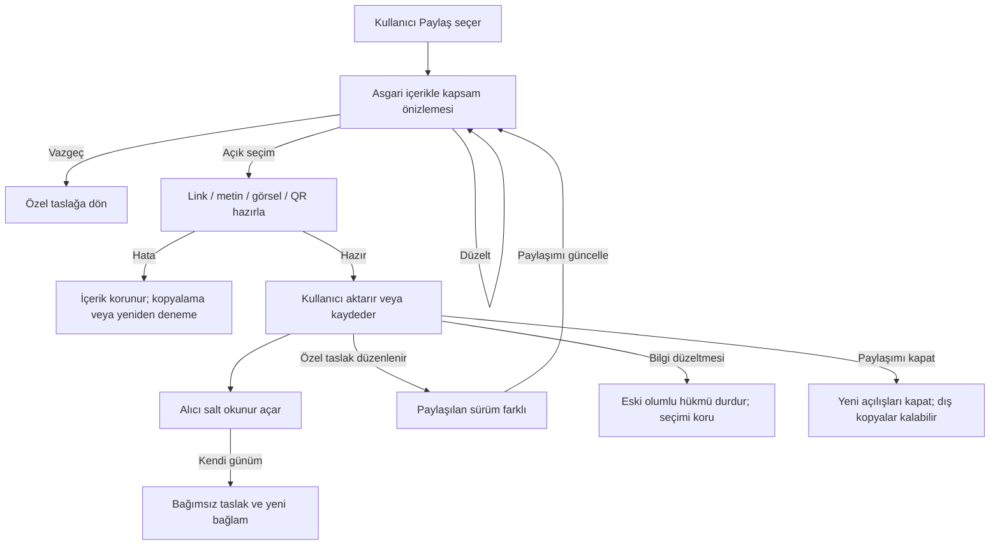
```mermaid
flowchart TD
    A["Kullanıcı Paylaş seçer"] --> B["Asgari içerikle kapsam önizlemesi"]
    B -->|Düzelt| B
    B -->|Vazgeç| C["Özel taslağa dön"]
    B -->|Açık seçim| D["Link / metin / görsel / QR hazırla"]
    D -->|Hata| E["İçerik korunur; kopyalama veya yeniden deneme"]
    D -->|Hazır| F["Kullanıcı aktarır veya kaydeder"]
    F --> G["Alıcı salt okunur açar"]
    G -->|Kendi günüm| H["Bağımsız taslak ve yeni bağlam"]
    F -->|Özel taslak düzenlenir| I["Paylaşılan sürüm farklı"]
    I -->|Paylaşımı güncelle| B
    F -->|Bilgi düzeltmesi| J["Eski olumlu hükmü durdur; seçimi koru"]
    F -->|Paylaşımı kapat| K["Yeni açılışları kapat; dış kopyalar kalabilir"]
```

## 13. Login zamanı

### Amaç

Kimliğe bağlı devam isteğini kullanıcı seçtiğinde karşılamak; hesap ihtiyacını ilk kararın önüne koymamak.

### Kullanıcı hissi

“Hesap benim işimi kolaylaştırıyorsa seçebilirim; kullanmaya devam etmek için mecbur değilim.”

### Karar yükü

Varsayılan sıfır giriş sorusu. Uygun bağlamda bir reddedilebilir davet. Giriş ekranı açılırsa doğrulama için gerekli bilgi kadar alan; profil zenginleştirme soruları yoktur.

| Ne zaman? | Davranış ve gerekçe |
|---|---|
| Kullanıcı “Hesabımdaki kaydı aç” der | Giriş akışı isteği karşılar; aynı cihazda hesapsız devam yolu açık kalır |
| Kullanıcı cihazlar arası devam kolaylığını kendisi araştırır | Gerçek kullanılabilirlik ve varsa ticari kapsam girişten önce anlatılır; giriş satın alma sayılmaz |
| İlk yer/rota kaydı tamamlanır | Saklama sınırı gösterilir; cihazlar arası seçenek mevcutsa küçük isteğe bağlı bağlantı olabilir, modal veya yeni adım olmaz |
| Kullanıcı paylaşımı daha sonra yönetmek ister | Mevcut yönetim erişimi sunulur; hesap tek kapatma yöntemi diye dayatılmaz |
| İlk açılış, arama, Keşfet, yer veya rota oluşturma | Giriş istenmez |
| Temel düzenleme/kayıt, Gezeceğim/Gezdiğim Yerler, paylaşım okuma | Giriş istenmez; hesapsız saklama/erişim sınırı dürüstçe anlatılır |
| Yol tarifine çıkış, aktif gezi, hata, boş sonuç, yavaş/offline durum | Giriş daveti gösterilmez; sıkışmış an ticari veya hesap fırsatı yapılmaz |
| Bilgi düzeltme, Bir İz, temel silme veya paylaşımı kapatma | Yeni login duvarı kurulmaz; mevcut yönetim yetkisinin kapsamı korunur |

### Ana akış

1. Giriş daveti kendi yararını söyler; “Deneyimini tamamla” gibi belirsiz baskı kurmaz. “Bu cihazda devam et” aynı görev bağlamında görünürdür.
2. Kullanıcı giriş yapmayı seçerse taslak, seçili yer ve çağıran eylem korunur. Açıklanan hesap işi dışında izin verilmiş sayılmaz.
3. Doğrulama tamamlanınca gelinen göreve dönülür; ana sayfaya veya profil doldurmaya gönderilmez.
4. Cihazdaki kayıtlar hesaba sessizce aktarılmaz. Bir kez “Bu cihazdaki kayıtları hesabına ekle” kapsam seçimi sunulur; özellikle paylaşılan cihazda nelerin taşınacağı görülebilir. Çakışmada iki kopya korunur, biri gizlice ezilmez.
5. Vazgeçme veya doğrulama hatası aynı taslağa döner. Kapatılmış davet aynı oturumda yeniden gösterilmez; “Bir daha önerme” tercihi erişilebilir kapsamda korunur.
6. Çıkış yapma sonrasında hesaba özel içerik açık kalmaz. Cihazda kalacak kişisel kopya ancak kullanıcının seçimiyle bırakılır; çıkış yanlışlıkla veri silme diye anlatılmaz.

### Başarısızlık noktaları

Doğrulama başarısızlığı, süresi dolmuş oturum, kayıt çakışması, paylaşılan cihazda yanlış aktarım. Hesap işlemi doğrulama bekleyebilir fakat temel görev ve erişilebilir yerel taslak sürer. Girişin hangi veriyi nereye taşıdığı belirsiz bırakılamaz.

### Alternatif akışlar

Hesapsız devam; girişten vazgeçip mevcut kaydı kullanma; yalnız seçili kayıtları hesaba alma; kaydı aktarmadan hesabı açma. Üyelik faydası mevcut değilse gelecekteki özellik için giriş daveti üretilmez.

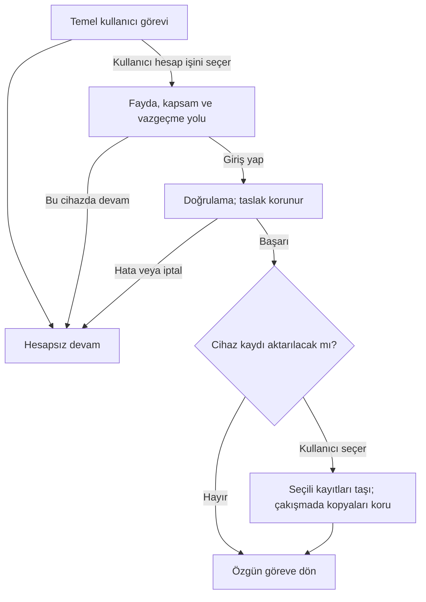
```mermaid
flowchart TD
    A["Temel kullanıcı görevi"] --> B["Hesapsız devam"]
    A -->|Kullanıcı hesap işini seçer| C["Fayda, kapsam ve vazgeçme yolu"]
    C -->|Bu cihazda devam| B
    C -->|Giriş yap| D["Doğrulama; taslak korunur"]
    D -->|Hata veya iptal| B
    D -->|Başarı| E{"Cihaz kaydı aktarılacak mı?"}
    E -->|Kullanıcı seçer| F["Seçili kayıtları taşı; çakışmada kopyaları koru"]
    E -->|Hayır| G["Özgün göreve dön"]
    F --> G
```

## 14. Premium gösterimi

### Amaç

Yalnız doğrulanmış bir ek kolaylığı, ilgili ihtiyacı olan kişinin kendi isteğiyle değerlendirebilmesini sağlamak.

### Kullanıcı hissi

“Temel işimi tamamlayabiliyorum; istersem ek kolaylığın ne kazandırdığını öğrenirim.”

### Karar yükü

Temel akışta sıfır Premium kararı. Kullanıcı ek kolaylığı seçerse bir açıklama; vazgeçtiğinde yeni teklif, indirim geri sayımı veya karşı teklif yoktur.

### Ana akış

1. Özellik henüz aday veya açılmamışsa Premium daveti yoktur. 06 §18 aday listesi satın alınabilir ürün vaadine dönüştürülmez.
2. Kullanıcı örneğin açılmış bir gün şablonu kolaylığını kendisi seçtiğinde, işlevin Premium kapsamı eylemden önce açık olur. Ücretsiz temel işi kilitliymiş gibi gösteren simgeler kullanılmaz.
3. Mevcut görevde küçük, kapatılabilir açıklama; sağladığı somut kolaylık, kapsam ve varsa gerçekten belirlenmiş ücret koşullarıyla gösterilir. Sahte fiyat veya tasarlanmış ödeme akışı eklenmez.
4. “Şimdilik devam et” kullanıcının taslağına döner. İlgili ücretsiz alternatif, örneğin aynı değişikliği mevcut taslakta yaparak yeniden değerlendirme, bulunabilir kalır.
5. Kullanıcı kapatınca aynı oturumda tekrar gösterilmez. “Bu önerileri gösterme” tercihi korunur; yeni ihtiyaç yokken diğer ekranlarda yeniden hedeflenmez.
6. Premium sona ermişse kayıt okuma, temel düzenleme, kritik yeniden değerlendirme, dışa paylaşma ve silme devam eder. Yalnız ileri kolaylığın yeni kullanım sınırı ilgili anda anlatılır.

### Başarısızlık noktaları

Rota oluşturmanın sonunda emek üzerinden ödeme isteme; login faydasını ücretsizmiş gibi sunup sonradan Premium açıklama; uyarı/belirsizliği ücretli ayrıntıya saklama. Hata, boş sonuç, düşük bağlantı ve gezi sırasında teklif gösterilmez. Ücretsiz kullanıcı için daha gevşek doğruluk veya kötü alternatif üretilmez.

### Alternatif akışlar

Ücretsiz araçla devam; açıklamayı kapat; teklifleri kapat; kayıtlı içeriğini kullan. Temel özelliklerde kota veya fiyat bu belgede icat edilmez. İleride gerçek kullanım sınırı onaylanırsa işe başlamadan önce anlaşılır; etkin gün ortasında ödeme duvarı olmaz.

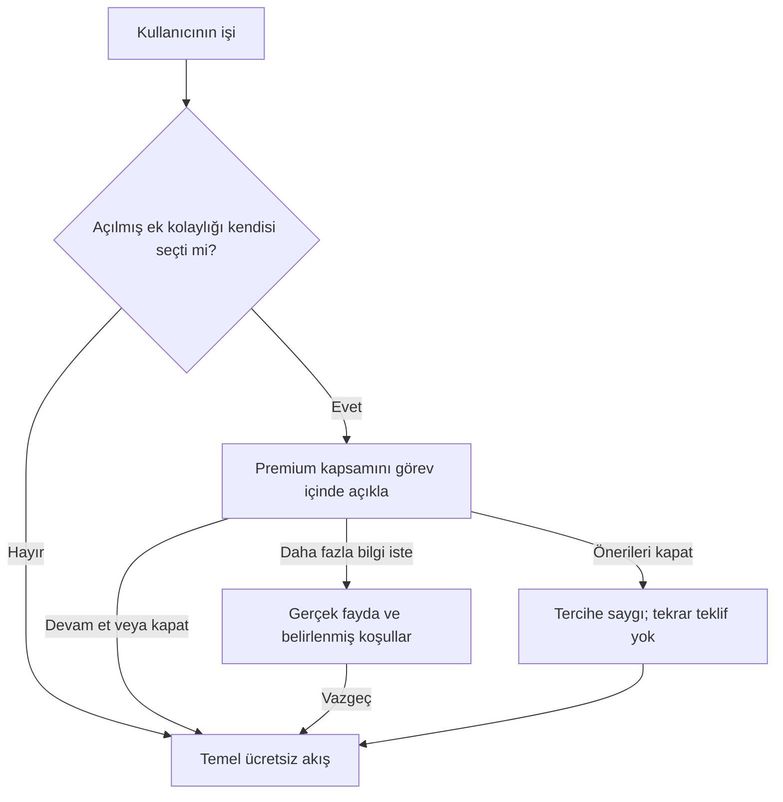
```mermaid
flowchart TD
    A["Kullanıcının işi"] --> B{"Açılmış ek kolaylığı kendisi seçti mi?"}
    B -->|Hayır| C["Temel ücretsiz akış"]
    B -->|Evet| D["Premium kapsamını görev içinde açıkla"]
    D -->|Devam et veya kapat| C
    D -->|Daha fazla bilgi iste| E["Gerçek fayda ve belirlenmiş koşullar"]
    E -->|Vazgeç| C
    D -->|Önerileri kapat| F["Tercihe saygı; tekrar teklif yok"]
    F --> C
```

## 15. Boş sonuç

### Amaç

Sonuç yokluğunun gerçek nedenini açıklayıp kullanıcının yalnız anlamlı bir sonraki kararı vermesini sağlamak.

### Kullanıcı hissi

“Yanlış aramadım; ürünün nerede yardımcı olamadığını ve neyi değiştirebileceğimi biliyorum.”

### Karar yükü

Bir seferde en anlamlı düzeltme önerisi; otomatik genişletme yoktur. Kullanıcı bütün koşullarını silmek zorunda değildir.

| Neden | Örnek anlatım | Devam |
|---|---|---|
| Bu koşullarda desteklenen eşleşme yok | “Bu koşullara uygun, yeterince bildiğimiz bir yer bulamadık.” | Sonucu daralttığı bilinen tek koşulu açık seçimle düzenle |
| Coğrafya kapsam dışı | “Bu şehirde şu an yeterli karar bilgimiz yok.” | Gerçekten kapsanan şehirleri gör; eski taslağı koru |
| Zorunlu koşulun bilgisi yetersiz | “Bu yerlerde basamaksız geçişi doğrulayamıyoruz.” | Bilinen uygun seçenek varsa göster; yoksa taslak ve koşul korunsun |
| Ad bulunamadı / belirsiz ad | “Bu adla eşleşen yeri bulamadık.” | Yazımı veya şehri düzelt; doğrulanmış eşleşmeleri ayır |
| Bir günlük dizi kurulamıyor | “Seçtiğin ziyaretler bu bitiş saatine birlikte sığmıyor.” | Bir ziyareti/sırayı kullanıcı değiştirsin; bütün seçilmişler görünür kalsın |
| Boş kişisel liste | “Henüz burada sakladığın bir yer yok.” | Keşfet'e tek geçiş; “eksik profil” anlatısı yok |

### Ana akış

1. Sonuç yokluğunun türü belirlenir; hizmet kesintisi bu akışa sokulmaz.
2. Mevcut sorgu, coğrafya, koşullar ve seçilmiş yerler görünür kalır.
3. Bilinen neden kısa anlatılır. Neden bilinmiyorsa belirli bir koşul suçlanmaz.
4. Örneğin “Aramayı seçtiğin ilçenin dışına genişlet” sınırın nasıl değişeceğini gösterir; kullanıcı uygulamadan coğrafya değişmez. “Bütçeni artır” varsayılan kurtarma eylemi değildir.
5. Kullanıcı bir koşulu değiştirirse yeni arama yapılır; vazgeçerse taslak veya önceki geçerli sonuç korunur. Zorunlu koşulu kaldırmak öneriyi okumakla ya da uyarıyı kapatmakla gerçekleşmez.

### Başarısızlık noktaları

Zayıf eşleşmeleri boşluğu doldurmak için uygun gösterme; “Burada böyle yer yok” genellemesi; engel ile bilgi eksikliğini karıştırma; tüm filtreleri tek mecburi eylemle sıfırlama. Bunlar kabul edilmez.

### Alternatif akışlar

Koşulları aynı tutarak taslağı sakla; belirli yeri öneri saymadan bilgisi kadar incele; farklı coğrafyayı kendin seç; yeni bir ihtiyaç yaz; çık. Giriş veya Premium çözümmüş gibi sunulmaz.

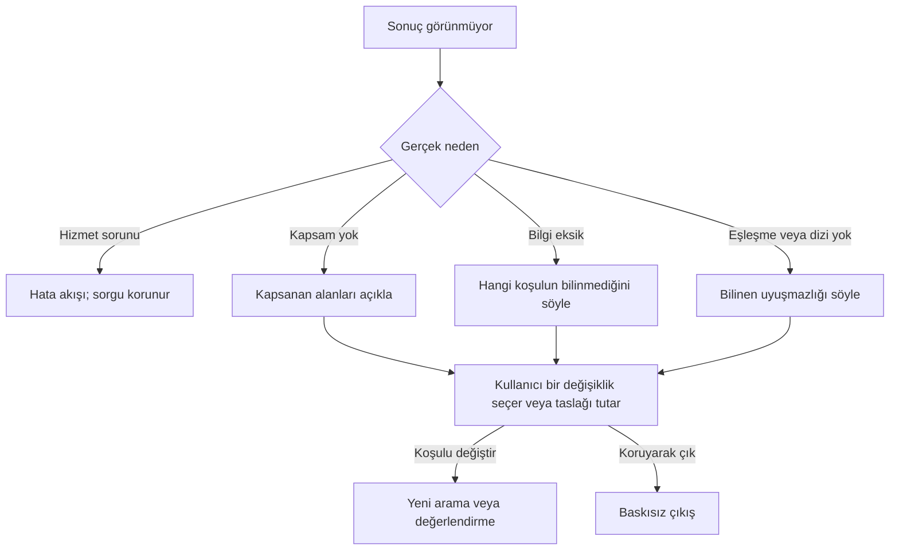
```mermaid
flowchart TD
    A["Sonuç görünmüyor"] --> B{"Gerçek neden"}
    B -->|Hizmet sorunu| C["Hata akışı; sorgu korunur"]
    B -->|Kapsam yok| D["Kapsanan alanları açıkla"]
    B -->|Bilgi eksik| E["Hangi koşulun bilinmediğini söyle"]
    B -->|Eşleşme veya dizi yok| F["Bilinen uyuşmazlığı söyle"]
    D --> G["Kullanıcı bir değişiklik seçer veya taslağı tutar"]
    E --> G
    F --> G
    G -->|Koşulu değiştir| H["Yeni arama veya değerlendirme"]
    G -->|Koruyarak çık| I["Baskısız çıkış"]
```

## 16. Hata ekranları

### Amaç

Neyin yapılamadığını, neyin korunduğunu ve en kısa kurtarma yolunu göstermek; sorunu kullanıcıya teşhis ettirmemek.

### Kullanıcı hissi

“Bir sorun var ama emeğim ve kontrolüm kaybolmadı.” Bu his ancak gerçekten korunan veri kadar vaat edilir.

### Karar yükü

Bir ana kurtarma eylemi; gerekiyorsa bir devam alternatifi. Teknik hata kodunu yorumlama, formu yeniden doldurma veya hesabı yeniden açma zorunluluğu yoktur.

### Ana akış

1. Hata başarısız olan işin yanında görünür. Harita sorunu okunabilen yer listesini; paylaşım sorunu özel taslağı; bir durak bilgisi sorunu bütün bilinen bilgiyi kapatmaz.
2. Mesaj üç parçadır: “Geçiş sürelerini şu anda değerlendiremiyoruz. Seçtiğin yerler duruyor. Yeniden dene.” Teknik neden bilinmiyorsa tahmin edilmez.
3. İşlemin başarısız olduğu kesin değilse “Sonucu doğrulayamadık” denir. Kayıt/gönderim yeniden denenmeden mevcut sonuç görünür biçimde kontrol edilir; çift iş üretmek normal kurtarma sayılmaz.
4. “Yeniden dene” son geçerli kullanıcı isteğini kullanır. Kullanıcı bu sırada değişiklik yaptıysa eski isteği uygulamaz.
5. Tekrarlayan sorunda sonu belirsiz deneme döngüsü yerine mevcut destek yolu ve çalışabilen alternatif sunulur. Destek, asgari bağlam önizlemesiyle kullanıcının açık gönderimine bağlıdır.
6. Düzelince kısa durum bilgisi verilir; kullanıcının bulunduğu yer ve odağı korunur. Bütün ekran tekrar başa sarmaz.

| Hata durumu | Birincil devam | Korunan sınır |
|---|---|---|
| Bulunamayan adres / 404 | Ad veya şehir bağlamıyla aramaya dön | Özel/eski içerik uydurulmaz |
| Yer bilgisinin bir kısmı alınamıyor | Bilinen bilgiyi oku; yeniden dene | Eksik kritik bilgiyle olumlu uygunluk yok |
| Harita/yol tarifi açılamıyor | Liste, adres ve mevcut dış yol tarifi alternatifi | Harita temel görevin şartı değil |
| Rota değerlendirmesi kesildi | Taslağı tut; yeniden değerlendir | Eski toplam yeni öneri gibi görünmez |
| Kayıt başarısız veya belirsiz | Sonucu kontrol et; yeniden dene | “Kaydedildi” erken söylenmez |
| Paylaşım kapalı / erişim yok | Paylaşımın kapalı olduğunu öğren; Keşfet'e geç | Login kapalı bağlantıyı açmanın çözümü değildir |
| Hesap oturumu sona ermiş | Hesap işi için isteğe bağlı doğrulama; yerel görevde devam | Temel keşif kilitlenmez |

### Başarısızlık noktaları

Genel “Bir şeyler ters gitti”, tekrar tekrar aynı düğme, tam ekran hata, korunmayan taslak için “Hiçbir şey kaybolmadı” vaadi. Hata mesajı kaybolup kurtarma eylemi erişilemez hale gelmez.

### Alternatif akışlar

Metinle devam; kaydedilmiş tarihli bilgiyi oku; taslağı kopyala; bir yeri çıkarıp daha sınırlı karar ver; destek iste veya çık. Destek için ekran görüntüsü, telefon veya üyelik temel önkoşul değildir; cevap isteyen kişi tercih ettiği ulaşılabilir dönüş yolunu isteğe bağlı sağlar.

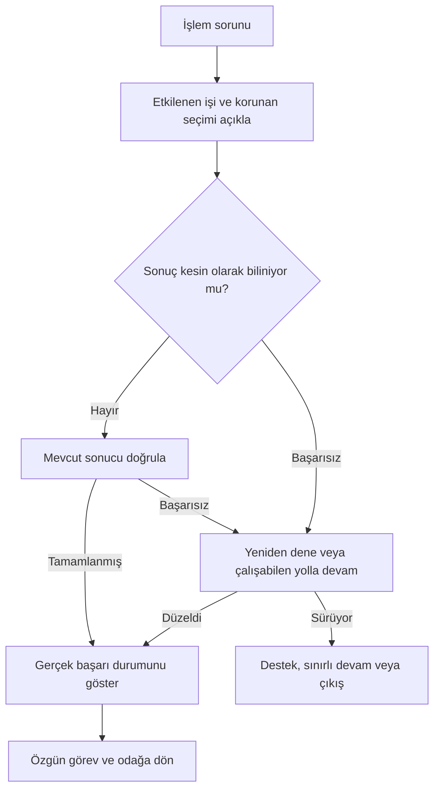
```mermaid
flowchart TD
    A["İşlem sorunu"] --> B["Etkilenen işi ve korunan seçimi açıkla"]
    B --> C{"Sonuç kesin olarak biliniyor mu?"}
    C -->|Hayır| D["Mevcut sonucu doğrula"]
    C -->|Başarısız| E["Yeniden dene veya çalışabilen yolla devam"]
    D -->|Tamamlanmış| F["Gerçek başarı durumunu göster"]
    D -->|Başarısız| E
    E -->|Düzeldi| F
    E -->|Sürüyor| G["Destek, sınırlı devam veya çıkış"]
    F --> H["Özgün görev ve odağa dön"]
```

## 17. Yavaş internet

### Amaç

Beklemenin nedenini ve sınırını anlaşılır kılmak; bekleyen kullanıcının düşüncesini ve seçimini korumak.

### Kullanıcı hissi

“İsteğim alındı; boşuna tekrar basmam gerekmiyor ve beklemeyi bırakabilirim.”

### Karar yükü

İlk anda yeni karar yoktur; eylemin alındığı hemen anlaşılır. Bekleyiş uzarsa tek görünür “Beklemeyi bırak” ve mevcut taslakla devam yolu sunulur. Sayısal bekleme eşiği bu belgeyle uydurulmaz; araştırmada belirlenir.

### Ana akış

1. Eyleme anında anlaşılır geri bildirim verilir: “Seçtiğin yerleri değerlendiriyoruz.” Sahte yüzde, kalan saniye veya hayalî AI düşünme aşamaları yoktur.
2. Kullanıcının yazısı, koşulları ve seçili duraklar görünür kalır. Yeni görev hakkında olumlu hüküm üretilmeden önce gerekli kritik bilgi de hazır olmalıdır.
3. Metin kararı için yeterli içerik varsa görsel/harita beklenmeden okunabilir. Olumlu iddia önce, onu geçersiz kılan uyarı sonra yüklenmez.
4. “Beklemeyi bırak” işlem başladığından beri erişilebilirdir. Uzayan bekleyişte “Henüz tamamlanmadı; taslakla devam edebilirsin” açıklaması bu yolu daha belirgin kılar. Kullanıcı yeni sorgu/düzenleme yapabilir; bekleyen işin hangi seçime ait olduğu anlaşılır.
5. Bağlantı düzelip sonuç geldiğinde yalnız son geçerli isteğe uygulanır. Kullanıcı başka göreve geçtiyse odağı çalmaz veya eski sonucu açmaz.
6. İşlem tamamlanamıyorsa bölüm 16; bağlantı yoksa bölüm 18 kullanılır. Sonsuz hareketli yükleme durumu nihai cevap olamaz.

### Başarısızlık noktaları

Tekrar dokunmayla çift kayıt; bütün ekranın donması; görsel yüklenince butonun parmak altından kayması; ekran okuyucunun her ilerlemeyi tekrar etmesi. İşin alınmasıyla bitmesi farklı duyurulur, yardımcı teknoloji gereksiz tekrarlarla bölünmez.

### Alternatif akışlar

Görselsiz liste; tarihli kayıtla devam; beklemeyi bırakıp taslağı sakla; yeni sorgu; daha sonra yeniden değerlendir. Yavaş bağlantı kullanıcının hatası olarak anlatılmaz ve login/Premium çözümü sunulmaz.

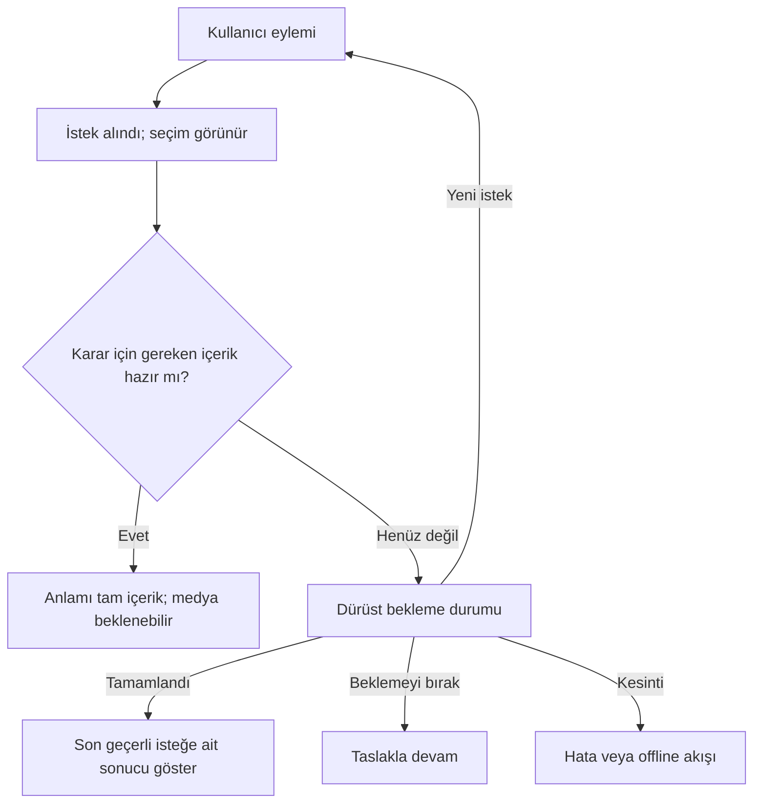
```mermaid
flowchart TD
    A["Kullanıcı eylemi"] --> B["İstek alındı; seçim görünür"]
    B --> C{"Karar için gereken içerik hazır mı?"}
    C -->|Evet| D["Anlamı tam içerik; medya beklenebilir"]
    C -->|Henüz değil| E["Dürüst bekleme durumu"]
    E -->|Tamamlandı| F["Son geçerli isteğe ait sonucu göster"]
    E -->|Beklemeyi bırak| G["Taslakla devam"]
    E -->|Yeni istek| A
    E -->|Kesinti| H["Hata veya offline akışı"]
```

## 18. Offline davranışı

### Amaç

Bağlantı yokken gerçekten erişilebilen seçim ve bilgiyi kullanılabilir tutmak; güncel yapılabilirlik vaadi üretmemek.

### Kullanıcı hissi

“Yanımda ne kaldığını ve neye artık güvenemeyeceğimi biliyorum.”

### Karar yükü

Bağlantı kesilmesi yeni anket açmaz. Durum tek kısa açıklamayla görünür. Yeniden bağlantıda yalnız kullanıcının seçimini etkileyen gerçek uyuşmazlık karar gerektirir.

| İş | Offline karşılık |
|---|---|
| Önceden saklanmış yer/rota okuma | Yalnız cihazda gerçekten bulunan içerik; kayıt bağlamı/tarihi görünür |
| Güncel açık/yoğun bilgisi veya kişisel yapılabilirlik | Yeni iddia yok; önceki olumlu karar tarihsel değerlendirme olarak ayrılır |
| Durak çıkarma, sıra değiştirme, özel not | Taslak düzenlenebilir; yeni süre/erişim uyumu hesaplanmış gibi sunulmaz |
| Cihaza kaydetme | Yalnız gerçekleşebiliyorsa başarı; hesapta güncellendi denmez |
| Yeni yer arama | Mevcut cihaz içeriğiyle sınırlı arama açıkça adlandırılır; genel kapsam sanılmaz |
| Link oluşturma, güncelleme veya kapatma | Sunucuda tamamlandı sözü yok; bekleyen işlem ve sınırı görünür |
| Sabit metin/görseli kullanma | Erişilebilen tarihli içerik; canlılık garantisi yok |
| Harita/yol tarifi | Saklı adres/sıralı metin; harita ve dış hizmetin offline çalışacağı vaat edilmez |
| Bir İz | Varsa cihazda bekleyen katkı; “Alındı/yayımlandı” denmez; gönderimden önce geri alınabilir |

### Ana akış

1. “Çevrimdışısın. Bu cihazdaki kayıtları görüyorsun; güncel ziyaret koşullarını kontrol edemiyoruz” açıklaması görünür. Tek başına kırmızı simgeye dayanmaz.
2. Kullanıcı saklı liste/rota bilgisini okur. İçerik yoksa “Bu cihazda çevrimdışı açılabilen kayıt yok” denir; boş keşif sonucu sayılmaz.
3. Düzenlemeler kullanıcı niyeti olarak korunur. Kaydedilebilen yerel değişiklik ile bekleyen hesap işlemi ayrılır. Çözümlenmemiş engel uyarıları kaybolmaz.
4. Bağlantı geldiğinde güncel bilgiler kontrol edilir; kullanıcının son seçimleri korunur. Yeni kapanma eski olumlu hükmü durdurur. Gün otomatik yeniden sıralanmaz.
5. Başka yerde de düzenlenmiş kayıtla çakışma varsa iki hal “Bu cihazdaki değişiklikler” ve “Hesaptaki kayıt” olarak açıklanır. Önizleme ve kopyayı koruma yolu vardır; sessiz üzerine yazma yoktur.
6. Açıkça istenmiş kayıt/katkı gönderimi hâlâ bekliyor ve iptal edilmemişse bağlantıda tamamlanabilir; kullanıcı bekleyenleri görebilir ve kaldırabilir. Dış mesaj otomatik gönderilmez. Paylaşım yayımlama/güncelleme işlemi bağlantıda güncel önizlemeye döner; sessiz yayın yapılmaz.
7. Offline paylaşımı kapatma isteğinde “Henüz kapatılmadı; bağlantı gelene kadar link açılabilir” denir. İptal edilmemiş kapatma isteği bağlantıda tamamlanır ve gerçek sonuç bildirilir. Yalnız yerel olarak gizlemek kapatma sayılmaz.

### Başarısızlık noktaları

Eski saatleri canlı sanma, çevrimdışı kapatmanın dünyada gerçekleştiğini söyleme, bağlantı gelince seçimi ezme, bilinmeyen ağ durumunu kesin teşhis etme. Ağ durumu kesin değilse “Bağlantıyı doğrulayamıyoruz” gibi kapsamlı dil kullanılır.

### Alternatif akışlar

Mevcut metni oku/kopyala; taslağı sakla; bağlantıda yeniden değerlendir; bekleyen katkıyı iptal et; geziyi durdur. Kullanıcı offline kararını kendi verebilir ama ürün doğrulanmamış rota için güvence üretmez.

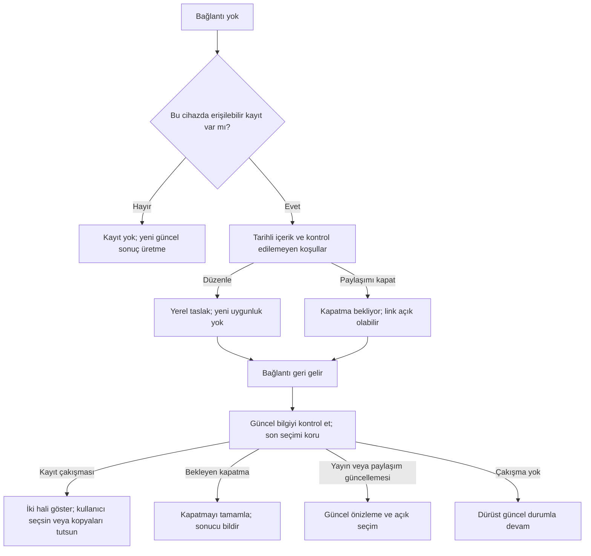
```mermaid
flowchart TD
    A["Bağlantı yok"] --> B{"Bu cihazda erişilebilir kayıt var mı?"}
    B -->|Hayır| C["Kayıt yok; yeni güncel sonuç üretme"]
    B -->|Evet| D["Tarihli içerik ve kontrol edilemeyen koşullar"]
    D -->|Düzenle| E["Yerel taslak; yeni uygunluk yok"]
    D -->|Paylaşımı kapat| F["Kapatma bekliyor; link açık olabilir"]
    E --> G["Bağlantı geri gelir"]
    F --> G
    G --> H["Güncel bilgiyi kontrol et; son seçimi koru"]
    H -->|Kayıt çakışması| I["İki hali göster; kullanıcı seçsin veya kopyaları tutsun"]
    H -->|Bekleyen kapatma| J["Kapatmayı tamamla; sonucu bildir"]
    H -->|Yayın veya paylaşım güncellemesi| K["Güncel önizleme ve açık seçim"]
    H -->|Çakışma yok| L["Dürüst güncel durumla devam"]
```

## 19. İlk kez rota oluşturan biri

### Amaç

Akıllı Rota'nın değerini ilk kendi günü üzerinde göstermek; planlama dili ve araçlarını önceden öğretmemek.

### Kullanıcı hissi

“Günümü anlatmam yetiyor; değiştirmek kolay ve bitirmem gereken bir program yok.”

### Karar yükü

Bir başlangıç; gerekirse bir belirleyici soru; bir öneri. Sürükleme, sabitleme, alternatif senaryo ve paylaşımın hepsini ilk anda öğrenme zorunluluğu yoktur.

### Ana akış

1. Kullanıcı kendi seçtiği girişten başlar. Boş taslakta “Ne yapmak istiyorsun?” yazma yardımı ve “Yer ekle” bulunur. Gerçek kapsamla desteklenen örnek ihtiyaç kullanılabilir; sahte demo duraklar kişisel öneriye karışmaz.
2. Kendi cümlesindeki koşullar açıkça görünür. Eksik bilgi yüzünden devam daralıyorsa “Saat belirtmeden bunu fikir taslağı olarak tutabiliriz” denir.
3. İlk öneri günün amacını tek kısa cümlede açıklar; her durağın rolü ve ana ödün yanında bulunur. Harita okumak gerekmez.
4. Yardım, eylemin yanında bir kez ve isteğe bağlıdır: “Sırayı ve kalış süresini değiştirebilirsin.” Kapatınca tur başka adımlarda tekrar açılmaz.
5. Kullanıcı ilk düzenlemeyi yaparsa bölüm 8'in fark özeti ve geri alma davranışıyla kontrolü öğrenir. Düzenleme yapmak başarı için şart değildir.
6. İlk kayıt bölüm 9'un cihaz sınırını açıklar. “Şimdi başlayacağım”, yol tarifi, kaydetme veya çıkış arasından ihtiyacına göre devam eder.

### Başarısızlık noktaları

İlk öneriyi kesin program sanma; aday yer ile mutlaka ziyaretin karışması; taslağın bitmemişlik hissi yaratması. “Günün hazır, hepsini tamamla” yerine mevcut kapsam ve değiştirme hakkı anlatılır.

### Alternatif akışlar

Tek yerle bitir; boş taslağı sakla; belirli bir yere dön; yardımı kapat; ilk düzenlemeyi geri al. İlk gezi sonrası geri bildirim veya üyelik istenerek çıkış uzatılmaz.

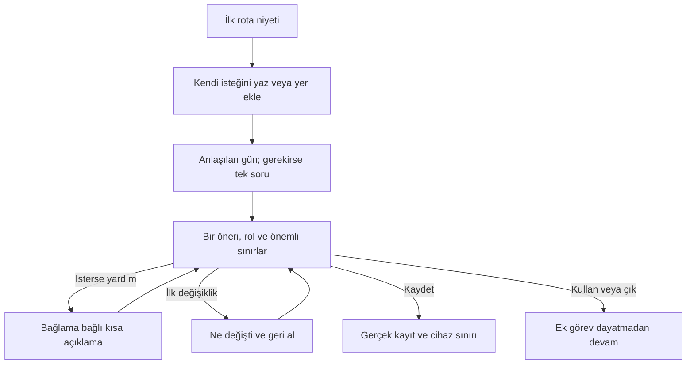
```mermaid
flowchart TD
    A["İlk rota niyeti"] --> B["Kendi isteğini yaz veya yer ekle"]
    B --> C["Anlaşılan gün; gerekirse tek soru"]
    C --> D["Bir öneri, rol ve önemli sınırlar"]
    D -->|İsterse yardım| E["Bağlama bağlı kısa açıklama"]
    E --> D
    D -->|İlk değişiklik| F["Ne değişti ve geri al"]
    F --> D
    D -->|Kaydet| G["Gerçek kayıt ve cihaz sınırı"]
    D -->|Kullan veya çık| H["Ek görev dayatmadan devam"]
```

## 20. Daha önce rota oluşturan biri

### Amaç

Tekrarlanan planlama yükünü azaltmak; eski günün koşullarını yeni güne sessiz taşımamak.

### Kullanıcı hissi

“Önceki emeğim işe yarıyor; bugünkü gün yine benim seçimim.”

### Karar yükü

“Bu güne devam et”, “Başka gün için kullan” veya yeni başlangıç bağlama göre sunulur. Güncel değerlendirme için zaten bilinen bilgiler tekrar sorulmaz; değişen ve belirleyici bilgi kadar soru vardır.

### Ana akış

1. Kullanıcı kaydını açar; şehir, kayıt tarihi ve günün durumu görünür. Tamamlanmış gün aktif gezi gibi başlamaz.
2. “Başka gün için kullan” eski kaydı koruyan yeni taslak oluşturur. Tamamlanmış ziyaret beyanları, eski rezervasyonun gerçekleşmişliği ve ziyaret saati yeni güne aktarılmış sayılmaz.
3. Kullanıcının açıkça taşımak istediği amaç ve tercihler görünür; o gün için kullanılmayabilir. Eski zorunlu koşul habersiz düşürülmez.
4. Güncel kontrol önemli farkları gösterir: “İkinci yerin ziyaret bilgisi değişti.” Kullanıcı değiştirmeyi seçmeden yeni yer veya sıra uygulanmaz.
5. Devam eden günde “Geç kaldım”, “Burada kalacağım”, “Bu durağı atla”, “Kalanını yeniden değerlendir” ve “Günü bitir” ilgili yerde bulunur.
6. Kalan bölümde ana amaç ve zorunlu koşullar korunur; tamamlananlar geçmişte kalır. Daha önce rota yaptığı için kritik uyarılar gizlenmez; yalnız öğretici yardım varsayılan tekrarlanmaz.
7. “Bugün bu kadar” nötr kapanıştır. Kalan duraklar beğenilmedi/istenmiyor sayılmaz; ziyaret beyanı oluşmaz.

### Başarısızlık noktaları

Eski fiyat/açıklığın bugün için geçerli görünmesi; farklı şehre bakınca günün değişmesi; tekrar kullanımın geçmiş ziyareti çoğaltması; eski kullanıcıya bütün bilgiyi gizleyen uzman modu. Akış hızı kritik koşulu saklayarak sağlanmaz.

### Alternatif akışlar

Önceki fikri kullanmadan yeni arama; aynı amacı farklı şehirde yeni taslakla düşünme; kalan günü sadeleştirme; geri alma; erken bitiş. Gün şablonları henüz aday olduğundan hazır özellik gibi dayatılmaz.

```mermaid
flowchart TD
    A["Önceki rota açılır"] --> B{"Kullanıcının niyeti"}
    B -->|Bu güne devam| C["Tamamlananı koru; kalanı kontrol et"]
    B -->|Başka gün| D["Eskiyi koruyan yeni taslak"]
    B -->|Yeni başlangıç| E["Yeni Keşfet veya boş taslak"]
    D --> F["Tarih, koşullar ve bilgideki farklar"]
    C --> F
    F -->|Değiştir| G["Kontrollü düzenleme ve geri al"]
    G --> F
    F -->|Devam| H["Seçilmiş kalan gün"]
    H -->|Burada kal veya günü bitir| I["Nötr bitiş; ziyaret ve memnuniyet varsayma"]
```

## 21. Mobil deneyim

### Amaç

Kısa dikkat aralıklarında, tek elle, dışarıda veya bağlantı kesintisinde aynı karar bütünlüğünü korumak.

### Kullanıcı hissi

“Az alanda da karar verebiliyorum; yanlış dokunursam kolayca düzeltebilirim.”

### Karar yükü

Bir anda bir etkin görev. Dar ekran nedeniyle kullanıcıya bilgi ezberleme, harita açma veya ayrıntılar arasında kritik uyarı arama işi verilmez.

### Ana akış

1. Kullanıcının geldiği yer/arama/rota açılır. Uygulama kurma perdesi veya cihazı yatay çevirme zorunluluğu yoktur.
2. Şehir, anlaşılan ihtiyaç ve gerekçeyle birlikte önemli engel/bilinmeyen korunur. Yer kazanmak için önce olumlu anlatım kısalır; uyarı saklanmaz.
3. Arama yazarken klavye ilgili alanı ve devam eylemini örtmez. Sayfa açılır açılmaz otomatik odakla klavye zorla açılmaz; kullanıcı aramayı seçince yazı alanına geçilir.
4. Liste ve harita arasında açık geçiş aynı seçimi korur. Harita gerektirmeden yer seçme, durak ekleme ve sıra değiştirme tamamlanır.
5. Açılan görev panelinde başlık, kapatma/geri ve yapılan işlemin sonucu anlaşılırdır. Üst üste panel yığılmaz; bir alt görev kapanınca onu açan bağlama dönülür.
6. Sistem/tarayıcı geri hareketi önce açık alt görevi kapatır, sonra geçmiş bağlama döner. Sürükleyerek kapatma tek yol değildir; yanlış hareket kaydedilmemiş emeği sessiz silmez.
7. Dış yol tarifinden dönüşte aynı durak, sıra ve gün görünür; ziyaret olmuş sayılmaz. Gelen çağrı veya ekran kilidi sonrası erişilebilen son taslak korunur; korunamayan kayıt için kalıcılık vaadi yoktur.

### Başarısızlık noktaları

Küçük/bitişik hedefler, kaydırmayla silme, görünmez ikonlar, güneşte yalnız renge dayanan durum, sabit butonun içerik/odağı kapatması. Dokunma hedefleri ayrışır; yıkıcı eylem yanlış kaydırmanın doğrudan sonucu olmaz. Ekran kenarı hareketleri görev eylemi için tek yöntem yapılmaz.

### Alternatif akışlar

Tek dokunuşlu metin eylemleri; haritasız kullanım; büyütülmüş yazı; cihaz döndürmeden devam; düşük bağlantıda saklı metin. Mobil kullanıcıya desktop'a göre daha az kritik bilgi veya temel kontrol verilmez.

```mermaid
flowchart TD
    A["Mobil giriş"] --> B["Tek etkin görev; bağlam görünür"]
    B -->|Yaz| C["Klavye açık; alan ve eylem erişilebilir"]
    C --> B
    B -->|Liste veya harita| D["Aynı seçim korunur"]
    B -->|Alt görev aç| E["Başlık ve görünür geri yolu"]
    E -->|Geri veya kapat| B
    B -->|Yol tarifi| F["Dış hizmet"]
    F -->|Dönüş| B
    B -->|Kesinti| G["Mevcut taslak ve dürüst kayıt durumu"]
```

## 22. Desktop deneyim

### Amaç

Geniş alanı karşılaştırma ve bağlamı hatırlama yükünü azaltmak için kullanmak; daha fazla içerik tüketimine çevirmemek.

### Kullanıcı hissi

“İhtiyacı, seçenekleri ve seçtiğim günün etkisini birlikte anlayabiliyorum.”

### Karar yükü

Mobildekiyle aynı öneri sınırları ve karar dili. Fazla ekran alanı daha fazla zorunlu filtre, sürekli açık panel veya eşdeğer buton demek değildir.

### Ana akış

1. Keşfet'te ihtiyaç ve sonuç bağlamı birlikte okunabilir. İsteğe bağlı harita veya rota bilgisi aynı kararın yardımcı görünümüdür.
2. Yer ayrıntısını açma ve listeye dönüş sorguyu/konumu korur. Ayrı sekmede açma da desteklenen bir okuma yoludur; yer sayfası kendi başına anlam taşır.
3. Seçenekler ortak ölçütlerle karşılaştırılır. Çoklu görünüm varsa hangi yerin seçili olduğu metin ve durumla anlaşılır; fare üzerinde bekleme bilgiye tek erişim yolu değildir.
4. Rota düzenlenirken değişen durak ve toplam etki ilişkilidir. Kullanıcı başka panelde çalışırken sonuç odağı ele geçirmez.
5. Pencere daralınca bölüm 21'in tek görev mantığına geçilir; seçilmişler, açık soru ve yazı korunur. Yakınlaştırma görev kaybı yaratmaz.
6. Aynı kaydın iki sekmede/cihazda değişmesi halinde yeni kayıt sessizce eskisinin üstüne yazılmaz. İlgili değişiklik anlaşılır adlarla karşılaştırılır; kopya tutma ve önceki seçime dönüş bulunur.

### Başarısızlık noktaları

Ekranı doldurmak için fazla öneri, hover'a saklanan kritik bilgi, iç içe kaydırma alanlarında kaybolma, panel değişince odağın yok olması. Geniş görünümün okuma sırası belirli kalır; klavye kullanıcısı harita içinde hapsolmaz.

### Alternatif akışlar

Yalnız liste, yalnız görev görünümü, klavyeyle tam kullanım, yeni sekmede yer okuma, büyütülmüş yazıyla dar görünüm. Desktop'a özel etkileşim temel işlemin tek yolu değildir.

```mermaid
flowchart TD
    A["Desktop giriş"] --> B["İhtiyaç ve sonuçların ortak bağlamı"]
    B -->|Yer oku| C["Yer ayrıntısı veya ayrı sekme"]
    C -->|Geri| B
    B -->|Rotayı düzenle| D["Değişen durak ve toplam etki"]
    D --> B
    B -->|Pencere daralır| E["Aynı seçimle tek görev görünümü"]
    E -->|Alan genişler| B
    D -->|Başka kopya değişti| F["Farkı göster; kullanıcı seçimi veya iki kopya"]
```

## 23. Accessibility — erişilebilirlik

### Amaç

Görme, işitme, hareket, bilişsel ve geçici kullanım farklılıklarında aynı kararı bağımsız verebilmek. Ürünün erişilebilirliği ile bir yerin fiziksel erişim bilgisi farklı sorumluluklardır.

### Kullanıcı hissi

“Bu ürün benim kullanım biçimimi de temel kabul ediyor; yardım istemeden kontrol edebiliyorum.”

### Karar yükü

Standart akışa ek bir “erişilebilir modu aç” önkoşulu yoktur. Yardımcı teknoloji kullanan kişi aynı bilgiye ulaşmak için daha uzun bir zorunlu yol izlemez.

### Ana akış

1. Her görevde anlamlı başlık, dil, açıklanmış eylem adı ve tutarlı okuma sırası vardır. Sayfa/görev değişimi anlaşılır biçimde duyurulur; yalnız görsel değişim yeterli sayılmaz.
2. Yer kimliği → gerekçe ve önemli sınır → karar eylemi sırası görsel, sesli ve büyütülmüş sunumda korunur. Görsel/harita için karar açısından eşdeğer metin ve sıralı durak listesi bulunur.
3. Renk; seçili, hatalı, bekleyen veya kapalı durumun tek işareti değildir. Metin, sembol açıklaması ve ayrışan görünüm birlikte çalışır. Okunabilirlik gerçek içerik ve farklı ışık koşullarında sınanır.
4. Metin büyütme ve yakınlaştırmada işlev kaybı, kesilmiş eylem, kritik uyarıyı örten sabit alan veya zorunlu iki yönlü metin kaydırma oluşmaz. Haritanın doğası gereği kaydırılması, metin alternatifinin bulunmasını değiştirmez.
5. Form alanı amacı ve hatasıyla birlikte anlaşılırdır. Hata ilgili alanın yanında kalır; hata özeti doğrudan düzeltilecek yere götürür. Yazılan doğru alanlar silinmez.
6. Sürükleme, hassas hareket, çok parmak, ses, hover veya cihaz sallama hiçbir temel işlemin tek yolu değildir. Durak sırası düğmelerle değişir; sesli içerik varsa metinsel eşdeğeri vardır.
7. Süreli fırsat veya geri sayımlı temel karar yoktur. Giriş doğrulama süresi dolarsa taslak korunur ve yeniden deneme mümkündür. Geri alma yalnız kısa süre görünen bir mesajda bulunmaz; ilgili kaydın eylemlerinden de erişilir.
8. Sonuç sayısı, kaydetme başarısı ve sıra değişimi kısa duyurulur. Her kart, animasyon karesi veya yeniden hesaplama gereksiz sesli tekrar üretmez. Kritik değişikliğin anlamı kaybolmaz.

### Başarısızlık noktaları

Ekran okuyucuda uyarının olumlu cümleden çok sonra okunması; adsız simgeler; görünmeyen odak; yalnız renk; haritasız tamamlanamayan rota; paylaşım görselinde kaybolan uyarı. Belge bir sertifika veya erişilebilirlik uygunluk beyanı değildir; davranışlar yardımcı teknolojiler ve gerçek kullanıcılarla sınanmalıdır.

### Alternatif akışlar

Metin/listeden tam görev, klavye veya anahtar denetimle kullanım, büyütülmüş içerik, hareket azaltma, kopyalanabilir link ve QR alternatifi. Mekânın erişimi bilinmiyorsa ürünün erişilebilir arayüzü bu dış dünya bilgisini doğrulamış sayılmaz.

```mermaid
flowchart TD
    A["Her kullanım biçimiyle giriş"] --> B["Anlamlı başlık, okuma sırası ve eylem adları"]
    B --> C["Gerekçe ve kritik sınırı birlikte anla"]
    C --> D{"Tercih edilen etkileşim"}
    D -->|Metin veya yardımcı teknoloji| E["Haritasız eşdeğer görev"]
    D -->|Dokunma veya işaretçi| F["Ayrışan hedefler ve açık durumlar"]
    E --> G["İşlem sonucu anlaşılır duyurulur"]
    F --> G
    G -->|Hata| H["Yerinde hata; doğru girdiler korunur"]
    H --> C
    G -->|Geri al veya devam| I["Aynı kontrol hakları"]
```

## 24. Klavye ile kullanım

### Amaç

Arama, seçim, rota düzenleme, kayıt, paylaşım ve çıkışı işaretçi veya harita hareketi gerektirmeden tamamlamak.

### Kullanıcı hissi

“Odağın nerede olduğunu biliyorum; beklenmedik yere gitmiyor ve hiçbir yerde sıkışmıyorum.”

### Karar yükü

Gizli kısayol öğrenme zorunluluğu yoktur. Görünür eylemler sırayla erişilebilir; kısayollar ancak ek kolaylık olabilir.

### Ana akış

1. Başlangıçta ana içeriğe geçiş bulunur. Odak sırası bilgi önceliğini izler; görünür odak sabit öğelerin altında kalmaz.
2. Arama alanına kullanıcı ulaşır. Önerilerde ok tuşlarıyla gezinme, Enter ile seçim ve Escape ile yalnız önerileri kapatma anlamı tutarlıdır. Escape yazılmış sorguyu silmez.
3. Tab/Shift+Tab eylemler arasında ilerler. Enter bağlantıyı, Enter veya Space uygun düğme/seçimi çalıştırır; sadece odaklanmak eylem başlatmaz.
4. Koşul/alt görev açıldığında odak anlamlı başlığa veya ilk gerekli alana gider. Gerçek modal görevde odak içeride kalır ve görünür kapatma/Escape ile çıkılır. Modal olmayan listede odak hapsedilmez.
5. Durakta “Öne al / Sona al / Şu yerden sonra” kullanılır. Sonuç “Müze, 3 duraktan 1. sıraya taşındı” gibi anlaşılır duyurulur; odak taşınan durağın eyleminde kalır.
6. Silme sonrası odak mantıksal komşu durağa, hiç durak kalmadıysa “Yer ekle”ye gider. Geri alma ilgili durağı döndürür; odak kaybolmaz.
7. Kapatılan alt görev odağı onu açan eyleme döndürür. Eylem kaldırılmışsa en yakın anlamlı başlığa gider. Yeni sonuçlar kullanıcı okurken kendiliğinden odağı almaz.

### Başarısızlık noktaları

Harita tuzakları, taşınan öğeyle odak kaybı, bir tuşla beklenmedik silme, global kısayolun yazı alanını kesmesi, iptalin taslağı silmesi. Haritaya girmeden temel görev tamamlanır ve haritadan çıkış yolu açıklıdır.

### Alternatif akışlar

Kısayolsuz görünür eylemler; sonuç başlıklarıyla okuma; modal kapatma düğmesi; sırayı hedef yer seçerek değiştirme. Kritik uyarı yalnız fareyle üzerine gelindiğinde açılmaz.

```mermaid
flowchart TD
    A["Klavye ile giriş"] --> B["Ana içeriğe geç; görünür odak"]
    B --> C["Arama ve sonuç eylemlerine ilerle"]
    C -->|Alt görev aç| D["Anlamlı başlangıç odağı"]
    D -->|Kapat veya Escape| C
    C -->|Durak sırasını değiştir| E["Metin eylemiyle taşı"]
    E --> F["Yeni sırayı duyur; odağı durakta koru"]
    F -->|Sil| G["Odağı komşuya veya Yer ekleye taşı"]
    G -->|Geri al| F
    C -->|Yeni sonuç geldi| H["Durumu duyur; odağı çalma"]
```

## 25. Motion azaltılmış kullanıcılar

### Amaç

Hareket hassasiyeti olan veya hareketi azaltmayı seçen kişinin aynı bilgi ve kontrolle çalışmasını sağlamak.

### Kullanıcı hissi

“Ürün tercihimle uyumlu; rahat kullanmak için açıklama yapmak zorunda değilim.”

### Karar yükü

Sistem tercihi mevcutsa otomatik saygı; ayrıca kişisel ayar isteğe bağlıdır. Kullanıcıdan sebep, teşhis veya her oturumda tercih doğrulaması istenmez.

### Ana akış

1. Hareket azaltma tercihi açılıştan itibaren geçerlidir. Otomatik uçan harita, büyük yakınlaştırma, parallax, yaylanma ve hareketli kutlama gösterilmez.
2. Yer/rota geçişi doğrudan veya gereksiz hareket taşımayan kısa durum değişimiyle olur. Hangi bağlama geçildiği başlık, seçili durum ve odakla anlaşılır.
3. Sıra değişikliği öğenin ekranda yolculuğuna bağlı anlatılmaz; yeni sıra ve “Ne değişti?” metni vardır.
4. Bekleme durağan durum metniyle açıklanır. Sürekli dönen/büyüyen nesne ilerlemenin tek kanıtı değildir. Tamamlanma aynı metin ve erişilebilir duyuruyla bildirilir.
5. Tercih etkin kullanım sırasında değiştirilirse mevcut taslak ve odak korunur; sayfayı yeniden başlatmak gerekmez. Uygulama içi “Hareketi azalt” seçimi temel görevden bağımsızdır ve hareketi artırmaya zorlamaz.

### Başarısızlık noktaları

Animasyon kalkınca durum geri bildiriminin de kalkması; haritanın yine otomatik pan yapması; üçüncü taraf içeriğin yoğun hareket üretmesi. Kullanıcı hareketsiz eşdeğer metin/listede kalabilir; zorunlu hareketli içeriğe gönderilmez.

### Alternatif akışlar

Hareketsiz geçiş, metinsel fark özeti, liste görünümü. Sistem tercihi belirlenemiyorsa temel kullanım yine düşük hareketlidir; kullanıcı ayrıca azaltabilir. Bu tercih için Premium veya login yoktur.

```mermaid
flowchart TD
    A["Görev başlar"] --> B{"Hareket azaltma tercihi var mı?"}
    B -->|Evet| C["Büyük ve sürekli hareketleri kaldır"]
    B -->|Hayır| D["Yalnız anlam taşıyan sınırlı hareket"]
    C --> E["Başlık, durum ve metinsel değişiklik özeti"]
    D --> E
    E -->|Tercih değişti| B
    E -->|Düzenleme| F["Yeni durumu hareket zorunluluğu olmadan anlat"]
    F --> E
```

## 26. Her ekranda kullanıcının ne hissetmesini istiyoruz?

### Amaç

Duyguyu dekoratif coşkuya değil, anlaşılır beklenti ve gerçek kullanıcı kontrolüne bağlamak.

### Kullanıcı hissi

Genel hedef **“anlaşıldım, yeterince biliyorum, seçim bende”**dir. Belirsizlik varken kullanıcıyı rahatlatmak adına sahte güven oluşturulmaz; kaygıyı azaltmanın yolu bilinmeyeni dürüstçe yönetmektir.

### Karar yükü

Duygusal hedef yeni bir kullanıcı sorusu yaratmaz. “Kendini nasıl hissediyorsun?” her ekranda sorulmaz. Duygu ve davranış hedefleri görev gözlemi ve isteğe bağlı görüşmeyle değerlendirilir.

| Ekran / görev durumu | Hedef his | Bunu taşıyan somut davranış | Kaçınılacak his / yanlış araç |
|---|---|---|---|
| Ana sayfa | Başlayabilirim | Kısa vaat, serbest başlangıç | Sınava giriyorum; onboarding duvarı |
| Arama girişi | Kendimi doğal ifade edebilirim | Yazım toleransı, görünür anlama | Doğru komutu bilmeliyim |
| Netleştirme | Bu soru işime yarıyor | Neden gereken tek soru, sınırlı devam | Sorgulanıyorum |
| Keşfet | Farkları anlayabiliyorum | Ortak ölçütler, sınırlı ilk küme | Kaçırıyorum; sonsuz akış |
| Yer | Seçsem ne olur biliyorum | Gerekçe, ödün, pratik bilgi | İkna edilmeye çalışılıyorum |
| Şehir | Nerede arayacağımı anlıyorum | Alanlar arasında özgün fark | Uzun gezi yazısında kayboldum |
| İlçe | Bu çevrede seçim yapabilirim | Alan içindeki gerçek ayrım | Şehir metnini yeniden okuyorum |
| Boş rota | Eksik başlamam normal | Yer/yazı girişi, boş kayıt | Formu bitirmeliyim |
| Rota değerlendirilirken | İsteğim kaybolmadı | Seçim görünür, iptal mümkün | Sihirli ama kapalı kutu |
| Rota önerisi | Günü ve yükünü anlıyorum | Amaç, rol, kapsam ve sınır | Programı tamamlamak zorundayım |
| Düzenleme | Kontrol bende | Fark özeti, geri al | Her şey yeniden değişti |
| Çatışmalı taslak | Nerede uyuşmadığını biliyorum | Somut engel, koşulu koruma | Başarısız oldum |
| Kaydetme | Emeğim doğru yerde saklandı | Gerçek sonuç ve kalıcılık sınırı | Sonsuza kadar garanti sanma |
| Kaydettiklerin | Kolay buluyorum | Anlamına göre kayıt türleri | Arşiv yöneticisi olmak zorundayım |
| Gezeceğim Yerler | Sonra düşünebilirim | Tarihsiz niyet, baskısız liste | Görev birikiyor |
| Gezdiğim Yerler | Geçmişim bana ait | Beyan, düzeltme, silme | İzleniyorum, puanlanıyorum |
| Paylaşım önizlemesi | Neyi açtığımı biliyorum | Asgari içerik, açık alıcı kapsamı | Bilgim sızacak mı? |
| Paylaşılan görünüm | Planı kendi koşulumla okuyorum | Salt okunur, bağımsız kopya | Bu kesin bana da uygun |
| Kapalı paylaşım | Sınırı anlayabiliyorum | Nötr kapalı durum, özel veri yok | Hesap açarsam kırarım |
| Login daveti | Seçim bana ait | Hesapsız devam, bağlam korunması | İçeriğim rehin alındı |
| Premium açıklaması | Ek faydayı değerlendirebilirim | Somut kapsam, kolay kapatma | Temel kullanıcı olarak eksikim |
| Boş sonuç | Sınır açıklanıyor | Gerçek neden, tek açık düzeltme | Yanlış zevkim/bütçem var |
| Hata | Kurtarma yolum var | Korunan veri ve ilgili eylem | Suç bende, baştan başlamalıyım |
| Yavaş bağlantı | Beklemeyi yönetebilirim | Dürüst durum ve iptal | Sonsuz beklemek zorundayım |
| Offline | Ne elimde kaldı biliyorum | Tarihli içerik, güncel iddia yok | Yanlış canlılık güvencesi |
| Aktif gün | Fikrimi değiştirebilirim | Kal, atla, yeniden değerlendir, bitir | Takip ediliyorum |
| Günün bitişi | Bugünlük yeterli olabilir | Nötr çıkış, zorunlu anket yok | Eksik bıraktım |
| Bir İz | İstersem küçük katkı verebilirim | Tek gözlem, atla, geri al | Ürüne borçluyum |
| Bilgi düzeltme / destek | Sesim duyuldu | Alındı ile düzeltildi ayrımı | Şikâyetim yayımlandı sanma |
| Neden Şamandıra? / yöntem | Sözün kapsamını anlayabilirim | Amaç, dayanak, sınır ve dönüş | Pazarlama iddiasına inanmalıyım |
| İletişim / Gizlilik / Koşullar | Sorumluluk ve haklar anlaşılır | Okunabilir içerik, geldiği yere dönüş | Ayrıntı içinde çıkış kayboldu |
| Silme / geri alma | Kontrolüm gerçek | Neyin silindiği ve geri döndüğü açık | Dış kopyalar da silindi sanma |

### Ana akış

Her görevde kullanıcının sorusu belirlenir; o soruyu cevaplayan bilgi ve kontrol verilir; işlemden sonra gerçek sonuç açıklanır; çıkış serbest bırakılır. Bir duyguyu zorlamak için metin, animasyon veya ödül kullanılmaz.

### Başarısızlık noktaları

Kritik bilinmeyende aşırı rahatlatıcı dil; başarısız kayıtta kutlama; erken bitişte üzgün maskot; bütçeyi küçümseyen alternatif. Kullanıcı hedef duyguyu yaşamıyorsa önce bilgi ve kontrolün neden işlemediği incelenir.

### Alternatif akışlar

Kullanıcı açıklama istemeden ilerleyebilir, daha fazla gerekçe okuyabilir, öneriyi reddedebilir veya çıkabilir. Hiç tepki vermemesi memnuniyet kanıtı değildir.

```mermaid
flowchart TD
    A["Bir görev durumuna giriş"] --> B["Kullanıcının gerçek sorusunu karşıla"]
    B --> C["Gerekli bilgi ve kontrolü birlikte ver"]
    C --> D{"Kullanıcının seçimi"}
    D -->|İlerle| E["Gerçek işlem sonucu"]
    D -->|Anlamadım| F["İsteğe bağlı açıklama"]
    D -->|Uymuyor| G["Düzelt, reddet veya çık"]
    F --> C
    E --> H["Baskısız devam veya bitiş"]
```

## 27. Mikro etkileşimler

### Amaç

Küçük eylemlerden sonra “Algılandı mı, oldu mu, geri alabilir miyim?” belirsizliğini ortadan kaldırmak.

### Kullanıcı hissi

“Dokunduğum/yazdığım şeyin karşılığını görüyorum; işlem durumu konusunda yanıltılmıyorum.”

### Karar yükü

Mikro etkileşim yeni görev açmaz. Kısa geri bildirim ile eylemin sonucu anlaşılır; onay veya kutlama ekranı eklenmez.

| Tetik | Anlık karşılık | Tamamlanma / geri alma | Sınır |
|---|---|---|---|
| Arama yazma | Metin ve öneri durumu | Seçimle Keşfet/yer | Her harfte sayfa veya odak sıçramaz |
| Koşul değiştirme | Yeni koşul görünür, sonuç bekliyor | Güncel sonuç ve değiştir/geri al | Eski sonuç yeni koşula ait sanılmaz |
| Yer ekleme | İsteğin alındığı anlaşılır | Gerçek kayıtta “Listede” | Kayıt tamamlanmadan kalıcı başarı yok |
| Durak ekleme | Taslaktaki aday görünür | Etki özeti, çıkar/geri al | Eklemek uygunluk onayı değildir |
| Sıra değiştirme | Yeni sıra ve bekleyen değerlendirme | Yeni sıra metni, geri al | Toplam yük sessiz eski kalmaz |
| Yer reddetme | Bağlamda kaldırma | Geri al | Gerekçe yazma şartı yok |
| Kaydetme | “Kaydediliyor” | Gerçek hedefe “Kaydedildi” | Tekrar basma çift kayıt oluşturmaz |
| Bağlantı kopyalama | Kopyalama isteği | Gerçek başarıda “Kopyalandı” | Başarısızsa seçilebilir metin |
| Alt görevi kapatma | Önceki bağlam görünür | Odak açan eyleme döner | Taslak sessiz silinmez |
| Bir İz yanıtı | Gönderim durumu | “Kaydedildi”, geri al | Yayınlandı iddiası yok |
| Silme | Hangi kaydın kaldırıldığı açık | Görünür ve sonradan erişilebilir geri alma | Aktif paylaşımı diriltmez |

### Ana akış

1. Eylem alınır; seçili/basılı/bekleyen durum metinle de anlaşılır.
2. İşlem beklerken kullanıcının eylemi korunur. Kullanıcının kendi taslak değişikliği hemen görünebilir; dış kayıt/gönderim başarısı için gerçek sonuç beklenir.
3. Tamamlanma aynı görevde kısa bildirilir. Değişiklik önemliyse ilgili kalıcı durum da güncellenir; tek başına uçup giden mesaj yeterli değildir.
4. Hata durumunda niyet kaybolmaz ve tekrar yoluna gidilir. Geri alma hangi eylemi geri aldığını açıkça söyler; seri işlemlerde yanlış adım geri alınmaz.

### Başarısızlık noktaları

Simgedeki değişimi anlamamak, aynı anda birden çok kısa mesaj, hatada kaybolan giriş, kullanıcı okumadan kapanan tek geri alma. Titreşim/ses kullanılırsa isteğe bağlı ve tamamlayıcıdır; başarının tek işareti değildir.

### Alternatif akışlar

Hareketsiz metin, ekran okuyucu duyurusu, ilgili kaydın eylemlerinden geri alma, kopyalanabilir çıktı. Mikro etkileşim sevindirmek için gerçeği öne çekmez.

```mermaid
flowchart TD
    A["Küçük kullanıcı eylemi"] --> B["Algılandı; mevcut niyet görünür"]
    B --> C{"İşlem tamamlandı mı?"}
    C -->|Bekliyor| D["Bekleyen durum; çift işlem yok"]
    D --> C
    C -->|Evet| E["Kısa sonuç ve kalıcı durum"]
    C -->|Hayır| F["Niyeti koru; düzelt veya yeniden dene"]
    E -->|Geri al| G["İlgili seçimi geri getir; güncel bilgi korunur"]
    E -->|Devam| H["Ek ekran olmadan göreve dön"]
```

## 28. Animasyonların amacı

### Amaç

Yalnız bağlam, ilişki veya değişikliği anlamayı kolaylaştırmak. Dikkati tutmak, beklemeyi teatral hale getirmek ve ürünü olduğundan akıllı göstermek animasyon amacı değildir.

### Kullanıcı hissi

“Bir şeyin nereden nereye değiştiğini anlıyorum; hareket beni yönetmiyor.”

### Karar yükü

Animasyon kullanıcıdan bekleme veya kapatma kararı istemez. Eylem animasyon bitene kadar geciktirilmez; bilgi animasyon izlenmeden de anlaşılır.

| Kullanım | İzin verilen amaç | Hareket olmadan karşılık |
|---|---|---|
| Görev açma/kapatma | Hangi bağlamdan gelindiğini korumak | Başlık, geri yolu, odak |
| Durak sırası değişimi | Hangi durağın taşındığını göstermek | Yeni sıra ve metinsel fark |
| Liste/harita seçimi | Aynı yerin iki görünümdeki ilişkisi | Seçili yer adı ve durum |
| İşlem durumu | Eylemin alındığını göstermek | Bekliyor/tamamlandı metni |
| Hata sonrası düzeltme | Hatanın nerede çözüldüğünü belirtmek | Yerinde hata/düzeltme açıklaması |

### Ana akış

1. Her hareket için “Hangi anlamı daha kolay kurduruyor?” sorusuna somut cevap aranır. Cevap yoksa hareket kaldırılır.
2. Hareket azaltma tercihi bölüm 25'e yön verir. Standart kullanımda da büyük, sürekli ve otomatik hareket varsayılan değildir.
3. İzin verilen hareket kısa, kesilebilir ve kullanıcının eylemini takip eder. Sahte rota çizimi, haritada otomatik şehirler arası uçuş, konfeti veya ekranı kaplayan başarı sahnesi yoktur.
4. Kullanıcı yeni eylem verirse hareket onu bekletmez. Güncel durum/odak hareketten bağımsız anlaşılır kalır.
5. Anlaşılabilirlikte fayda göstermeyen animasyon kaldırılır; yalnız beğeni veya üründe kalma süresi gerekçe değildir. Kesin süre/eğri bu UX belgesinde belirlenmez.

### Başarısızlık noktaları

Yavaş ağda animasyonun hesaplama sanılması, sürüklenen nesneyi izleyememe, harita hareketinin rahatsızlık yaratması, ekranın zıplaması. Sahte ilerleme ve parlayan aciliyet işaretleri kullanılmaz.

### Alternatif akışlar

Doğrudan durum değişimi, metinsel açıklama, seçili yer adı, yerinde fark özeti. Hareket olmadan bilgi kayboluyorsa tasarım henüz tamamlanmış sayılmaz.

```mermaid
flowchart TD
    A["Bir geçiş veya değişiklik"] --> B{"Hareket somut anlam katıyor mu?"}
    B -->|Hayır| C["Hareketi kaldır"]
    B -->|Evet| D{"Hareket azaltılıyor mu?"}
    D -->|Evet| C
    D -->|Hayır| E["Kısa, kesilebilir, göreve bağlı hareket"]
    C --> F["Metin, başlık ve odakla aynı bilgi"]
    E --> F
    E -->|Yeni kullanıcı eylemi| G["Hareket bekletmeden yeni eyleme geç"]
```

## 29. Bildirimler

### Amaç

Yalnız kullanıcının etkin kararını anlamlı biçimde etkileyen değişikliği veya açıkça istediği hatırlatmayı bildirmek.

### Kullanıcı hissi

“Bu mesajın neden geldiğini ve ne yapabileceğimi biliyorum; susturmak da elimde.”

### Karar yükü

Başlangıçta sıfır bildirim izni. İlgili hatırlatma kullanıcı tarafından seçilirse amacı belli tek izin adımı. Her durak için ayrı bildirim yönetimi zorunlu değildir.

| Tür | Gösterim ve öncelik | Ne yapılmaz? |
|---|---|---|
| Eylem sonucu | İlgili yerde kısa kayıt/düzenleme bilgisi | Cihaz bildirimi üretmek |
| Etkin günün önemli değişikliği | İlgili durakta kalıcı açıklama; izinli kanal varsa tek anlamlı bildirim | Her küçük tahmin değişiminde uyarı |
| Kullanıcının seçtiği hatırlatma | Açık zaman/kapsam ve seçilen kanal | Kaydedilen her yer için otomatik hatırlatma |
| Bir İz daveti | Anlamlı dönüşte isteğe bağlı, reddedilince tekrar yok | Her durakta soru, ödül veya seri baskısı |
| Premium / ürün tanıtımı | Temel bildirim akışına girmez | Ziyaret uyarısının arasına promosyon |
| Geçmiş günün sıradan güncellemesi | Yeniden açıldığında ilgili bilgi | Bitmiş günleri sürekli bildirmek |

### Ana akış

1. Etkin gün için eylem gerektiren bir değişiklik varsa neyin değiştiği ve etkisi belirlenir. “Müze için son giriş bilgisi değişti; bu sırayla yetişemeyebilirsin” gibi somut cümle kullanılır.
2. Kullanıcı üründe ilgili içeriği okuyorsa durum yerinde gösterilir. Zorunlu koşulun geçersizleşmesi görünür kalır; otomatik tam ekran müdahale yerine göreve bağlı açıklama kullanılır.
3. Dış bildirim yalnız izinli kanal ve seçilmiş kapsamda gönderilebilir. Kullanıcı “Bu gün için önemli değişiklikleri bildir” veya bir hatırlatma seçmeden sistem izni istenmez. Teslim ve sürekli canlı izleme garantisi verilmez.
4. Kilit ekranı/önizleme özel yer, tam başlangıç, sağlık veya grup bilgisini ifşa etmez. “Etkin gününde bir değişiklik var” gibi asgari anlatımdan ilgili duruma geçilir.
5. Açılan bildirim ana sayfaya değil, değişikliğin olduğu gün/durağa götürür. Yeni sıra/yer kendiliğinden kabul edilmez; “Değişikliği incele” kontrolü kullanıcıdadır.
6. Aynı olaya bağlı mesajlar birleştirilir. Okunmuş değişiklik tekrar çalmaz. Sessiz saat/kanal tercihleri ve reddedilmiş izin korunur; kritik bilgi uygulama içinde yine erişilebilir kalır.
7. Kullanıcı “Bu gün için kapat” veya genel tercihleri kapatabilir. Yeniden izin yalnız kullanıcı ilgili ayarı tekrar seçerse gündeme gelir.

### Başarısızlık noktaları

Özel bilgi sızıntısı, eski güne açılan bildirim, teslim edilmemiş uyarıya güvenmek, kapatmanın zorunlu koşulu kaldırdığı sanısı. Bildirimi kapatma değerlendirme sınırını veya yerindeki uyarıyı kaldırmaz. Aynı olay hem bildirim hem açılır pencere hem tekrar mesajıyla üç kez dayatılmaz.

### Alternatif akışlar

Bildirim izni vermeden uygulama içinde güncel durumu gör; yalnız kendi hatırlatmasını seç; gün uyarılarını kapat; katkı istemlerini tamamen kapat. Bildirim reddi ürünün temel faydasını azaltmaz.

```mermaid
flowchart TD
    A["Değişiklik veya hatırlatma"] --> B{"Etkin karara anlamlı etkisi ya da açık istek var mı?"}
    B -->|Hayır| C["Bildirim üretme"]
    B -->|Evet| D["İlgili yerde bilgi ve devam eylemi"]
    D --> E{"Dış kanal için izin var mı?"}
    E -->|Hayır| F["Uygulama içindeki bilgi yeterli kalır"]
    E -->|Evet| G["Tek, asgari ve özel bilgiyi koruyan bildirim"]
    G -->|Aç| H["İlgili gün ve değişen durak"]
    H -->|Kullanıcı değiştirir| I["Kalan günü değerlendir"]
    G -->|Bu gün için kapat| J["Tekrar yok; yerindeki kritik bilgi korunur"]
```

## 30. Asla yapılmayacak UX davranışları

### Amaç

Kısa vadeli etkileşim, dönüşüm veya gösteriş uğruna karar yükünü ve yanlış güveni büyüten davranışları tasarım dışında tutmak.

### Kullanıcı hissi

“İhtiyacım, zamanım ve sınırlarım ticari veya davranışsal hedeflerin önünde.”

### Karar yükü

Bu kontrol kullanıcıya soru veya kontrol listesi olarak çıkmaz. Tasarımın kendi yüküdür; kullanıcıdan kötü tasarımı kapatması beklenmez.

### Ana akış

Yeni ekran, buton, soru, geçiş, kampanya veya etkileşim önce sağladığı karar faydasını açıklamalıdır. Aşağıdaki yasaklardan biri varsa yayımlanmaz; kullanıcı lehine sadeleştirilir veya kaldırılır. Daha çok tıklama ve ilgi, yasağı aşma gerekçesi değildir.

1. İlk açılışta login, konum, bildirim veya profil zorunluluğu.
2. Temel keşif, rota, kayıt veya paylaşım okuma önüne üyelik duvarı.
3. Tek yer isteyen kişiyi rota oluşturmaya zorlama.
4. Zorunlu onboarding turu, izlenmeden geçilemeyen video veya uygulama yükleme perdesi.
5. Herkes için “en iyi”, açıklanamayan uygunluk/güven yüzdesi ve genel tempo/enerji puanı.
6. Kritik engeli ayrıntıya, hover'a, haritaya veya ücretli alana saklama.
7. Bilinmeyeni “yok”, “uygun”, “ücretsiz”, “açık” veya yalnız “koşula bağlı” diye geçirme.
8. Kullanıcının bütçesini, bitişini, coğrafyasını, ulaşımını veya zorunlu ihtiyacını sessiz genişletme.
9. Kaydetmeyi, tıklamayı, yol tarifini veya konumu ziyaret/memnuniyet sayma.
10. Eski kayıt tarihini bütün bilginin güncellik kanıtı yapma.
11. Kullanıcının kilidini veya açık reddini otomatik bozma.
12. Silinen durağın yerini yeni bir durakla kendiliğinden doldurma.
13. Sırf görsel çeşitlilik için daha az uygun yer öne çıkarma.
14. Sonsuz içerik, yapay kıtlık, kaçırma korkusu, sayaç ve seri tamamlama baskısı.
15. Erken bitişi başarısızlık, üzüntü veya suçlulukla karşılama.
16. Premium için ücretsiz karar kalitesini veya temel kontrolü düşürme.
17. Hata, boş sonuç, zayıf bağlantı veya kayıt emeğini ödeme fırsatına dönüştürme.
18. Kapatılan login/Premium/katkı davetini yeni gerekçelerle tekrar dayatma.
19. Ticari ilişkiyi uygunluk veya organik sıra avantajı olarak kullanma.
20. Gizli onay, önceden seçili dış paylaşım, otomatik mesaj veya rehber erişimi.
21. Özel taslaktaki değişikliği açık paylaşım güncellemesi olmadan yayımlama.
22. Linki bilenlerin erişimini “yalnız arkadaşların” diye sunma.
23. Dış kopyaları, görselleri veya mesajları uzaktan geri alabileceğini vaat etme.
24. Çevrimdışı paylaşım kapatmayı tamamlandı gösterme.
25. Hareket, renk, sürükleme, hover, ses, QR veya haritayı tek erişim yolu yapma.
26. Odağı çalma, klavye tuzağı, kaydırmada yanlış silme, süresiz yükleme.
27. Animasyonu ilerleme, kayıt veya yayın başarısı gibi sunma.
28. Geç gelen yanıtla kullanıcının son seçimini geri alma.
29. Birden çok pencere/cihaz düzenlemesini sessizce birbirinin üstüne yazma.
30. Ham yorum, yeniden yazılmış yorum, yıldız, kullanıcı itibarı veya liderlik tablosu.
31. Gözlemi doğrulanmış/yayımlanmış bilgi gibi anlatma.
32. Gereksiz kimlik, gelir, sağlık tanısı veya sürekli konum geçmişi isteme.
33. Hassas tercihleri kullanıcı kimliği, grup ortak zevki veya paylaşım başlığı haline getirme.
34. Uygun olmayan sonucu kolaylaştırmak için “Yine de devam et” düğmesini gizli koşul kaldırma olarak kullanma.
35. Kullanıcı kararını verip ayrılırken ek görev, anket, puan veya teklif dayatma.

### Başarısızlık noktaları

Yasakların yalnız ilk ekranda uygulanıp paylaşım, hata, mobil kısaltma veya geri almada kaybolması. Değerlendirme bütün durumlara uygulanır; ürünün kendi anlatımı ve dışa aktarılan özetleri aynı sınırı taşır.

### Alternatif akışlar

Eylemi kaldır; daha dar işlevle sun; açık kullanıcı seçimi ekle; kritik bilgiye eşdeğer metin sağla. Bir ihlal canlı deneyimde fark edilirse ilgili davranış daraltılır; kullanıcının işi mümkün olan mevcut güvenilir yolla sürer.

```mermaid
flowchart TD
    A["Yeni UX davranışı"] --> B{"Somut karar faydası var mı?"}
    B -->|Hayır| C["Kaldır"]
    B -->|Evet| D{"Yasak davranış içeriyor mu?"}
    D -->|Evet| E["Yayımlama; sadeleştir veya kapsamı daralt"]
    E --> B
    D -->|Hayır| F["Geri alma, erişim ve kritik bilgiyi sınama"]
    F -->|Başarısız| E
    F -->|Başarılı| G["Kullanıcı doğrulamasına al"]
```

## 31. Akışları tamamlayan mevcut yollar

Bu bölüm yeni portal açmaz. 01'in coğrafya/güven/destek içeriğini ve 05'in katkı kontrolünü yukarıdaki görevlerle bağlar.

### 31.1. Şehir, ilçe, kapsam ve güven sayfalarından devam

**Amaç:** Nerede arayacağını veya öneriye nasıl yaklaşacağını anlamak isteyen kişiyi asıl kararına bağlamını kaybetmeden döndürmek.

**Kullanıcı hissi:** “Açıklama kararımı kolaylaştırıyor; okumak mecburi bir ara durak değil.”

**Karar yükü:** Şehir → ilçe → yer sırasını takip etme zorunluluğu yoktur. Kullanıcı açıklama veya doğrudan Keşfet arasında ihtiyacına göre tek seçim yapar.

**Ana akış:** Şehir araması, anlamlı şehir sayfasını ve o şehirde Keşfet'i sunar. İlçe sayfası yalnız özgün karar bilgisi varsa açılır; yoksa ilçeye daraltılmış Keşfet yeterlidir. Şehir/ilçeden geçişte coğrafya korunur; yer sayfasında adres zaten belliyse tekrar şehir seçilmez. Bölge seçimi kapsanan şehirleri daraltır, yeni tanıtım sayfasına götürmez. “Neden Şamandıra?” amaç ve sorumluluğu; “Bir yeri nasıl anlıyoruz?” dayanak ve sınırları açıklar. Bu sayfalardan geri dönüş özgün yer/Keşfet ve okuma konumunadır. Footer'daki İletişim, Gizlilik ve Kullanım Koşulları okunabilir; dönüşte taslak korunur.

**Başarısızlık noktaları:** Özgün bilgisi olmayan ilçe için boş sayfa, kaynak yetersizliğini açıklama sayfasına gömme, şehir değiştirirken açık rotayı yeniden yazma. Önemli yer belirsizliği yöntem sayfasında ilk kez açıklanmaz.

**Alternatif akışlar:** Şehir açıklamasını atlayıp Keşfet; ilçeden şehre çıkıp yeni alanı açıkça seçme; ürün yöntemini okumadan yol tarifi; yayımlanmamış coğrafya sayfası yerine kapsamı belirli arama.

```mermaid
flowchart TD
    A["Arama, yer veya ana sayfa"] --> B{"Ne öğrenmek istiyor?"}
    B -->|Nerede arayayım| C["Şehir; gerekirse özgün ilçe bilgisi"]
    C --> D["Aynı coğrafyayla Keşfet"]
    B -->|Ürünün sözü| E["Neden Şamandıra?"]
    B -->|Dayanak ve sınır| F["Bir yeri nasıl anlıyoruz?"]
    E --> F
    F -->|Geri| A
    B -->|Doğrudan karar| G["Yer veya Keşfet; açıklama mecburi değil"]
    C -->|İlçe içeriği yok| D
```

### 31.2. Bir İz, bilgi düzeltme ve destek

**Amaç:** Küçük bir gözlemi veya somut hatayı hesap zorunluluğu olmadan alıp gerçek işlem durumu ve geri çekme kontrolü sunmak.

**Kullanıcı hissi:** “Katkımın ne için kullanılacağını biliyorum; söylemediğim şey bana mal edilmiyor.”

**Karar yükü:** Bir İz'in ana yolunda ziyaret bağlamı bilinmiyorsa ziyaret doğrulama ve tek gözlem olmak üzere iki seçim; bağlam zaten kullanıcı tarafından açıkça verilmişse tekrar sorulmaz. Başka tarih veya ayrıntılı hata daha uzun, isteğe bağlı yoldur. Beş saniye 05'teki araştırılacak hedeftir; kullanıcıya süre baskısı veya tamamlanmış performans vaadi değildir.

**Ana akış:** Kullanıcı “Bir gözlem bırak” seçer. Yer adıyla “Yanıtın bilgi kontrolünde kullanılacak; yorum olarak yayımlanmaz” açıklaması ve veri kullanımı ayrıntısına bağlantı vardır. “Bugün burada mıydın?” için Evet / Başka zaman / Gitmedim bulunur. Gitmedim katkıyı sonlandırır; gerekirse kimlik/konum gibi bildiği somut hata için ayrı düzeltme yolu açıktır. Evet sonrası yönlendirmeyen tek gözlem sorusu ve “Gözlemlemedim” karşılığı sunulur. Örneğin “Konuşurken sesini yükseltmen gerekti mi?”; yanıtlar Gerekmedi / Bazen / Gerekti / Konuşmadım. Önce olumlu öneri tekrar edilmez. Gerçekten alınınca “Kaydedildi” ve geri al görünür. Saat/alan eklemek bitişten sonra isteğe bağlıdır; bilinmeyen bağlam uydurulmaz.

“Bilgi hatalı mı?” ilgili yer/iddia bağlamını taşır. Kullanıcı yanlış görünen bilgi türünü seçer, isterse kısa açıklama ekler; uzun yorum, fotoğraf veya telefon zorunlu değildir. Göndermeden hangi bilgilerin destek/incelemeye gideceğini görebilir. “Bildirim alındı; bilgi kontrol edilecek” ile “Bilgi düzeltildi” ayrılır; destek süresi icat edilmez. İnceleme gerekirse mevcut olumlu güvence daralabilir, fakat doğrulanmamış “yer kapalı” iddiası üretilmez. Kullanıcı isterse mevcut durum/geri çekme erişimini saklar. Hesapsız yönetim erişimi kaybolursa kesin bulma vaadi yoktur; destek alternatifi açıklanır. Geri çekme katkının sonraki değerlendirmelerde kullanımını durdurur; bağlı bilgilerin kalan kanıtla incelenmesi ayrı süreçtir.

**Başarısızlık noktaları:** Gönderim başarısızken teşekkür ekranı; aynı yanıtı iki kez kanıt sayma; katkıyı işletmeye ham kimlikli metin olarak açma; tarih uydurma; geri alma erişimini sadece kısa mesaja koyma. Gönderim belirsizse önce sonucu kontrol et, taslağı koru. Gönderim alındı diye kullanıcının önerisi doğru ilan edilmez.

**Alternatif akışlar:** Atla; gözlemlemedim; başka zaman ve yalnız bilinen bağlam; katkı istemlerini kapat; hiç katkı vermeden çık; açıklama metni gerektiren somut hatayı ayrı yoldan ilet. İletişimden destek sorusu da aynı asgari bilgi/gerçek alındı anlayışını kullanır. İnceleme için kullanıcıya ücretsiz araştırmacı görevi verilmez.

```mermaid
flowchart TD
    A["Yer veya ziyaret bağlamı"] --> B{"Kullanıcının seçimi"}
    B -->|Bir gözlem bırak| C["Kullanım açıklaması; gerekiyorsa gerçek ziyareti sor"]
    C -->|Gitmedim veya atla| D["Sorusuz çıkış"]
    C -->|Bugün veya başka zaman| E["Tek somut gözlem; bilinmeyen kapsamı koru"]
    E -->|Gözlemlemedim| D
    E -->|Yanıt| F["Gönderim durumunu doğrula"]
    B -->|Bilgi hatalı mı| G["İlgili bilgi ve isteğe bağlı açıklama"]
    G --> F
    F -->|Başarısız veya belirsiz| H["Taslağı koru; sonucu kontrol et"]
    H --> F
    F -->|Alındı| I["Gerçek alındı; yayın onayı değil"]
    I -->|Geri çek| J["Katkı kullanımını durdur; etki ayrıca incelenir"]
    I -->|Bitti| D
```

## 32. Deneyimi doğrulama planı

Bu bölüm kod testi veya tamamlanmış kullanıcı araştırması değildir. Tasarımın kullanıcı kararını gerçekten kolaylaştırıp kolaylaştırmadığını sınayacak senaryoları tanımlar. Sonraki araştırma belgesi katılımcı kapsamı, yöntem, süre ve ölçülebilir hedefleri yayından önce belirlemelidir. Burada temelsiz başarı yüzdesi veya evrensel bekleme eşiği verilmez.

### 32.1. Ölçülecek yük ve koruyucu ölçütler

- **İlk anlamlı karar:** Kullanıcı bir yer/rotayı neden seçeceğini veya neden vazgeçeceğini anlatabiliyor mu? Yalnız ilk tıklama süre hedefi değildir.
- **Karar yükü:** Tekrar sorulan bilgi, gereksiz karşılaştırma, hatırlanması gereken bağlam, düzeltme adımları ve geri dönüşte yeniden yapılan iş ayrı gözlenir.
- **Anlama:** Gerekçe, önemli ödün, zorunlu engel ve bilinmeyenin ayrımı; taslak/kayıt/ziyaret/paylaşım anlamlarının karışması incelenir.
- **Kontrol:** Reddetme, çıkma, geri alma, hesapsız devam, paylaşımı kapatma ve izin kapatma aynı temel görevler kadar gözlenir.
- **Gerçek hayat karşılığı:** Gönüllü geri bildirimde ana amaca zaman kalması ve beklenmedik koşullar değerlendirilir. Geri bildirim vermeyen kişi olumlu sayılmaz.
- **Erişim eşitliği:** Mobil/desktop, klavye, yardımcı teknoloji, büyütülmüş metin, hareket azaltma ve bağlantı kesintisinde aynı kritik bilgi ve temel kontrol bulunur.
- **Gereksiz susma:** Yeterli bilgiyle verilebilecek yararlı kararın gereksiz yere engellenmesi de hata sayılır; hiç önermeyerek doğruluk ilan edilmez.
- **Davet yükü:** Reddedilen login/Premium/katkı davetinin tekrarı, işe dönüşte bağlam kaybı ve kullanıcı kendisi istemeden açılan izinler izlenir. Dönüşüm artışı tek başarı değildir.

### 32.2. Görev senaryoları ve gözlenebilir kabul sonucu

| No | Senaryo | Geçerli sonuç |
|---|---|---|
| 1 | İlk açılışta bilinen yer bağlantısı | Hesap, şehir seçimi veya tanıtım turu olmadan doğru yer |
| 2 | Aynı adlı iki şubeyi arama | Konumla ayrım; yanlış şube bilgisinin birleşmemesi |
| 3 | Eksik anlaşılan zorunlu koşulla sorgu | Koşul görünür; netleştirme veya dar kapsam, tam eşleşme iddiası yok |
| 4 | Konum iznini reddetme | Elle başlangıçla aynı temel göreve devam |
| 5 | Keşfet → yer → geri | Sorgu, koşul, ret ve liste/odak konumu korunur |
| 6 | Haritayı başka alana kaydırma | Açık yeni arama seçimi olmadan coğrafya ve rota değişmez |
| 7 | Tarihsiz/boş rota kaydetme | Kayıt mümkün; bugünkü açıklık veya yapılabilirlik onayı yok |
| 8 | İlk ulaşımı bilinmeyen rota | İlk duraktan itibaren kapsam; kapıdan kapıya toplam yok |
| 9 | Bütçeye gerekli ücret bilgisi eksik | Bütçe uyumu yok; eksik ücret ücretsiz varsayılmaz |
| 10 | Basamaksız geçiş zorunlu, bağlantı bilgisi eksik | Durakların olumlu bilgisi tam rota erişim uyumu üretmez |
| 11 | Sıra değişikliğiyle son girişin kaçması | Yeni sıra taslakta kalır; uygunluk hükmü kaldırılır |
| 12 | Art arda düzenleme ve geç eski sonuç | Kullanıcının son seçimi geri alınmaz |
| 13 | Ana amacı taşıyan durağı silme | Etki açık, boşluk doldurulmaz, geri alma mümkün |
| 14 | Son durağı silme | Boş taslak, mantıklı odak ve geri alma; hata muamelesi yok |
| 15 | Yer listesinden silme | Mevcut rotadan habersiz çıkarılmaz |
| 16 | Yol tarifinden uygulamaya dönüş | Ziyaret ve memnuniyet otomatik oluşmaz |
| 17 | Tarihsiz Buradaydım beyanı | Gezdiğim Yerler'de bilinmeyen tarih; Bir İz ayrı |
| 18 | İlk kayıt başarısızlığı | Gerçek başarı yok; görünür taslak ve yeniden deneme |
| 19 | Login davetini reddetme | Aynı görev sürer; aynı oturumda tekrar davet yok |
| 20 | Giriş sonrası cihaz kayıtlarını taşıma | Açık kapsam, çakışan kopyaları koruma, özgün göreve dönüş |
| 21 | Premium açıklamasını kapatma | Temel rota/kayıt/düzeltme sürer; karşı teklif yok |
| 22 | Özel notlu rotayı Story/link olarak hazırlama | Hassas başlık/not dışarı çıkmaz; gerekli sınır korunur |
| 23 | Özel rotayı düzenleme | Açık güncelleme olmadan paylaşılan seçim değişmez |
| 24 | Paylaşılan yerde yeni kapanma | Seçim korunur; eski olumlu hüküm açık linkte sürmez |
| 25 | Linki kapatma, sonra QR açma | Aynı kapalı durum; dış görsellerin silindiği söylenmez |
| 26 | Offline link kapatma | “Henüz kapatılmadı” görünür; bağlantıda gerçek tamamlanma |
| 27 | Offline düzenleme ve başka cihaz çakışması | Son seçimler kaybolmaz; iki hal kullanıcıya açıklanır |
| 28 | Yavaş bağlantıda iptal ve yeni sorgu | Eski iş sonradan odağı veya sonuçları ele geçirmez |
| 29 | Klavyeyle durak ekle/sırala/sil/geri al/paylaş | Harita veya sürükleme olmadan tam görev; odak mantıklı |
| 30 | Yardımcı teknoloji ve büyütülmüş içerik | Kritik sınır olumlu gerekçeyle birlikte erişilebilir |
| 31 | Hareket azaltmayla aynı düzenleme | Bilgi/geri bildirim kaybı veya otomatik harita uçuşu yok |
| 32 | Günü erken bitirme | Nötr bitiş; tamamlama baskısı veya zorunlu anket yok |
| 33 | Bir İz gönderim hatası ve geri çekme | Alındı/yayın ayrımı, tek kayıt, geri çekme yolu |
| 34 | Bildirim iznini reddetme | Etkin günün kritik bilgisi uygulama içinde hâlâ görünür |
| 35 | Kapsanmayan şehir | Gerçek kapsam açıklaması; sahte yer veya otomatik şehir değişimi yok |
| 36 | Şehir/ilçe/yöntemden geri dönüş | Özgün karar bağlamı korunur; zorunlu içerik zinciri yok |

### 32.3. Yayın öncesi karar

Kritik zorunlu koşulun yanlış olumlu sunumu, özel bilgi ifşası, kullanıcı seçiminin kaybı, zorunlu login veya temel görevin klavye/yardımcı teknolojiyle tamamlanamaması ilgili deneyimin açılmasını engeller. Sorunlu yetenek daraltılır; erişilebilen güvenilir görevler korunur. Araştırma sonucu fayda göstermeyen soru, davet veya hareket kaldırılır. “Bir ana öneri”, soru sırası ve kayıt erişiminin bulunabilirliği ayrıca araştırılır; belgede yazılı olmak doğrulanmış olmak değildir.

## 33. Öz eleştiri — 50 itiraz, düzeltme ve açık sınama

Öz eleştiri, tasarımı öven kontrol listesi değildir. Seçilen yaklaşımın maliyetlerini ve yanlış anlaşılma risklerini gösterir. Düzeltmeler yukarıdaki akışlara işlenmiştir; sınama sonuçları henüz yoktur.

| No | Kendi tasarımıma itiraz | Risk / maliyet | Nihai düzeltme ve nasıl sınanacağı |
|---|---|---|---|
| 1 | En az karar ilkesi az buton hedefi sanılabilir | Gerekli seçenekler gizlenir | §0.3: hatırlama ve anlama yükü de ölçülür; birincil eylem yanında gerçek ret/çıkış sınanır |
| 2 | İlk girişte hiç soru sormamak boşluk yaratabilir | Kullanıcı nereden başlayacağını bilemez | §1–2: serbest giriş ve dayanaklı farklı amaç örnekleri; ilk başlama gözlenir |
| 3 | İlk kez geleni tanımaya çalışmak takip ihtiyacı doğurabilir | Sırf öğretim için kalıcı kimlik çıkarılır | §1–2: ilk kullanım tespiti zorunlu davranış yaratmaz; öğretim isteğe bağlıdır |
| 4 | Doğrudan bağlantı eski bağlamı kaybettirebilir | Kullanıcı gününe dönemez | §0.3, §1: hedef içerik açılırken mevcut taslak korunur; bağlantıdan dönüş sınanır |
| 5 | Tek soru kuralı ardışık sonsuz sorulara dönüşebilir | Yük görünmez biçimde uzar | §0.3, §7: her yeni soru gerekçeli, kapsamlı taslak çıkışı açık; toplam soru ve vazgeçiş gözlenir |
| 6 | Görünür anlama özeti de sürekli onay işi olabilir | Kullanıcı her cümleyi kontrol etmek zorunda kalır | §2, §4: doğru anlama için ayrı onay ekranı yok; yalnız belirleyici belirsizlik sorulur |
| 7 | Yazım toleransı yanlış yer seçtirebilir | Aynı adlı şubeler birleşir | §4: ad/konum ayrımı ve anlam değiştiren düzeltmeye açık seçim; yanlış şube senaryosu |
| 8 | 3–5 sonuç yeterli çeşitliliği taşımayabilir | Kullanıcı ilk kümenin bütün kapsam olduğunu sanır | §5: daha fazla sonuç ve sonu açık; ilk küme kota değil, ortak farklar korunur |
| 9 | Az alternatif motorun seçimine aşırı güven yaratabilir | Kullanıcı gerekçeyi incelemez | §7: neden, sınır, ret ve alternatif isteme; kullanıcıdan vazgeçme nedenini anlatması istenir |
| 10 | Harita kaydırınca aramamak beklenmedik gelebilir | Kullanıcı haritanın çalışmadığını sanır | §5: Bu alanda ara eylemi ve mevcut kapsam görünür; harita görevinde anlama sınanır |
| 11 | Ana menüye kayıtları eklememek bulunabilirliği azaltabilir | Hesapsız kişi emeğine ulaşamaz | §0.2, §9–11: Keşfet içinde görünür Kaydettiklerin ve kayıt sonrası doğrudan dönüş; yeniden bulma görevi |
| 12 | Kaydettiklerin üç türü yeni sınıflandırma yüküdür | Rota, niyet ve ziyaret karışır | §0.4, §10–11: anlam farklılığı kısa metinle ve son kullanılan konumla gösterilir; doğru kaydı bulma sınanır |
| 13 | Gezeceğim Yerler adı yine taahhüt çağrıştırır | Listede bekleyenler suçluluk yaratır | §10: tarihsiz niyet açıklaması, sayaç/hatırlatma yok; kullanıcı algısı görüşmede incelenir |
| 14 | Gezdiğim Yerler eksik geçmiş sanılabilir | Kullanıcı bütün gezilerini girmek ister | §11: yalnız beyan edilen yerler; tamlık hedefi yok, boş dil nötr |
| 15 | Buradaydım tek eylemle yanlış geçmiş üretebilir | Yanlış dokunma kalıcı kayıt olur | §11: açık eylem sonucu, geri al, bilinçli ikinci ziyaret; yanlış işaretleme görevi |
| 16 | Gezeceğim listesinden gezileni silmemek şaşırtabilir | İki listede aynı yer hata sanılır | §10–11: tekrar gitme niyeti ile geçmiş bağımsız; çıkarma ayrı, açıklama anlama sınaması |
| 17 | Boş taslak kaydetmek değersiz arşiv çoğaltabilir | Kullanıcı kayıtlarını ayıramaz | §9: nötr düzenlenebilir ad, silme ve kayıt bağlamı; boş kayıtları bulma gözlenir |
| 18 | Cihazda kayıt açıklaması güveni azaltabilir | Kullanıcı kaydetmekten vazgeçer | §9, §13: gerçek sınır kısa, fayda zorunlu hesaba dönmez; yanlış kalıcılık beklentisi ölçülür |
| 19 | Açık Kaydet eylemi unutulabilir | Kullanıcı düzenlemeyi kalıcı sanır | §9: kaydedilmemiş durum ve gerçek kayıp anında çıkış seçimi; kesinti/geri dönüş sınaması |
| 20 | Hesap aktarımı fazladan karar yaratır | İlk kolaylık uzun veri yönetimine döner | §13: tek kapsam seçimi, yalnız çakışmada ayrıntı; paylaşılan cihaz senaryosu |
| 21 | Login hiç zorunlu değil ifadesi hesap verisinin herkese açılması sanılabilir | Mahremiyet sınırı belirsizleşir | §0.2, §13: kimliğe bağlı iş doğrulanır, temel hesapsız alternatif sürer; erişim ve vazgeçme ayrı sınanır |
| 22 | Login daveti kayıt başarısını bölebilir | İlk fayda hesap işine dönüşür | §13: yalnız küçük isteğe bağlı bağlantı, modal yok; kayıttan yol tarifine kesintisiz geçiş |
| 23 | Premium hiç görünmezse ek fayda bulunamaz | İş modeli ve kullanıcı kolaylığı gelişmez | §14: açılmış kolaylığı kullanıcı seçince kapsam görünür; görev faydası kanıtlanmadan teklif yok |
| 24 | Premium kapsamı ile hesap faydası karışabilir | Sonradan ücret sürprizi doğar | §13–14: kapsam girişten önce; cihazlar arası devam ücretsizmiş gibi vaat edilmez |
| 25 | Bir ana rota önerisi fazla kesin görünebilir | Alternatif düşünme daralır | §7: tek yer/boş zaman geçerli, iki ek seçeneğin gerçek farkı var; kullanıcı rol/ödün anlatabilmeli |
| 26 | Yer, saat ve sıra sabitlemesi öğrenme yükü yaratır | Her durakta üç karar beklenir | §8: varsayılan sorulmaz; ihtiyaç anında ayrılır; yanlış kilit beklentisi test edilir |
| 27 | Çatışmalı sırayı taslakta tutmak yanlış güven yaratabilir | Kullanıcı bunu yapılabilir sayar | §7–8: olumlu hüküm kalkar, somut çatışma görünür; taslak/yapılabilirlik ayrımı sınanır |
| 28 | Durak silmek ana amacı sessiz yok edebilir | Kullanıcı daha kısa ama anlamsız gün alır | §8: kaybolan amaç etkisi açıklanır, yeni amaç atanmaz; amaç durağını silme görevi |
| 29 | Geri alma geçmiş bilgiyi geri getirme sanılabilir | Yeni kapanma kaybolur | §8–9: seçim geri gelir, yeni gerçek korunur; kapanma sonrası geri alma görevi |
| 30 | Aynı yeri iki kez eklemeyi önlemek gerçek ihtiyacı engelleyebilir | Sabah/akşam dönüş ziyareti kaybolur | §6: çift ekleme açıklanır, bilinçli ikinci ziyaret ayrı; şube ve tekrar ziyareti sınanır |
| 31 | Başlangıç/dönüş kapsamı kısa özette kaybolabilir | Kullanıcı gün süresini az sanır | §7, §12: toplamın yanında kapsam, paylaşımda da aynı; kullanıcıya toplamın parçaları anlattırılır |
| 32 | Maliyet belirsizliği bütün öneriyi susturabilir | Bütçe belirtmeyen de yararlı bilgiden mahrum kalır | §7, §15: ilgili hüküm daralır, bağımsız bilinen kısım kalır; gereksiz susma ölçülür |
| 33 | Grup ihtiyacını kişisiz anlatmak açıklamayı soyutlaştırabilir | Kimin karar vermesi gerektiği bilinmez | §7, §12: gerekli koşul açık, özel kimlik paylaşılmaz; koşul sahibi dışında kaldırma yok |
| 34 | Paylaşım önizlemesi fazla iş olabilir | Kullanıcı dışarı ekran görüntüsü alarak atlar | §12: asgari güvenli varsayılan ve kısa kapsam; kritik bilgi sabit çıktıda da görünür |
| 35 | Paylaşılan ve özel sürüm ayrımı unutulabilir | Alıcı eski planla hareket eder | §12: sahibine sürüm farkı, açık güncelleme; değişiklik sonrası alıcı okuması sınanır |
| 36 | Bilgi düzeltmesinin otomatik yansıması planı bozdu hissi yaratabilir | Kullanıcı özel seçimin değiştiğini sanır | §12: bilgi değişikliği ile durak seçimi ayrı açıklanır; kapanma senaryosu |
| 37 | Link kapatma gerçek kontrol olduğundan fazla anlaşılabilir | Kullanıcı dış kopyaların da silindiğini sanır | §12, §18: yeni açılış ve dış kopya ayrımı; QR ve sabit görselle sınama |
| 38 | Hesapsız yönetim erişimi kaybolabilir | Kullanıcı açık paylaşımı kapatamaz | §12: sınır oluşturma öncesinde, ayrı yönetim erişimi ve destek; erişim kaybı görevi |
| 39 | Offline paylaşım kapatma beklemesi tehlikeli biçimde belirsiz kalabilir | Link hâlâ açıkken kapalı sanılır | §18: henüz kapatılmadı ve gerçek sonuç; bağlantı kes/yine bağla senaryosu |
| 40 | Otomatik yeniden bağlantı kullanıcıyı şaşırtabilir | Bekleyen iş sessiz yayın olur | §18: bekleyenleri gör/iptal; dış yayın güncel önizlemeye döner; iptal edilmiş katkı gönderilmez |
| 41 | Hata durumlarını ayırmak çok mesaj yaratabilir | Kullanıcı farklı terimleri çözmek zorunda kalır | §15–16: teknik sınıf değil, başarısız iş ve tek kurtarma; doğru devamı bulma görevi |
| 42 | Bekleme süresi belirlememek sonsuz spinner'a alan açabilir | Uygulama tasarım boşluğunu yanlış doldurur | §17, §32: sonu belirsiz yükleme yasak; eşik araştırmayla açılıştan önce belirlenir, iptal baştan mümkündür |
| 43 | Geri al kısa mesajda fark edilmeyebilir | Özellikle yavaş okuyan kullanıcı kontrolü kaybeder | §23, §27: ilgili kayıt eylemlerinden de erişim; mesaj kaybolduktan sonra geri alma sınanır |
| 44 | Mobil tek görev ilkesi fazla geri dönüş yaratabilir | Durak ve toplam arasında bağ kopar | §21: değişiklik etkisi görev içinde, dönüşte konum korunur; tek elle düzenleme görevi |
| 45 | Desktop çoklu görünüm daha karmaşık olabilir | Odak ve kaydırma alanları karışır | §22: yardımcı görünüm isteğe bağlı, tutarlı okuma sırası ve tek görev alternatifi |
| 46 | Hareketi azaltınca ilişki anlatımı eksilebilir | Yer değişimi fark edilmez | §25–28: başlık, metinsel fark ve odak; hareketsiz sıra değişimi sınanır |
| 47 | Erişilebilirlik maddeleri uygulama kontrol listesine dönüşebilir | Gerçek görev yine tamamlanamaz | §23–24, §32: uçtan uca görev ve kullanıcı sınaması; yalnız özellik varlığı yeterli değil |
| 48 | Kritik bildirimler rahatlatıcı izleme vaadi yaratabilir | Kullanıcı hiç uyarı gelmemesini koşullar iyi sanır | §29: teslim/canlı takip garantisi yok, açılışta güncel bilgi sınırı; izin kapalı görev sınaması |
| 49 | Bir İz çıkışta küçük de olsa borç hissi yaratabilir | Gönüllülük görünüşte kalır | §11, §29, §31.2: atla/kapama, tekrar davet yok, ana göreve etkisiz; katkısız çıkış gözlenir |
| 50 | Bu kadar kapsamlı UX belgesi ürünün sade olmasını zorlaştırabilir | Her akış aynı ekranda gösterilmeye çalışılır | §0 ve tüm akışlar: durumlar yalnız bağlamında açılır; faydasız soru/davet/hareket kaldırılır, ilk görev gözlemi esas alınır |

## 34. Öz eleştiri sonrası nihai UX kararları

**Şamandıra'nın kullanıcı deneyimi; doğrudan başlayabilen, gerekli bilgiyi yerinde açıklayan, seçimleri koruyan ve kullanıcının istediği anda durabildiği tek bir karar alanıdır.**

1. **Giriş kullanıcı niyetini korur.** Yer, Keşfet veya paylaşım bağlantısı kendi içeriğini açar; ana sayfa, şehir seçimi ve tanıtım turu mecburi ara adımlar değildir.
2. **İlk fayda hesap gerektirmez.** Konum, login, bildirim ve profil başlangıç şartı değildir. Kimliğe bağlı isteğe bağlı işlerde doğrulama olsa da temel hesapsız yol sürer.
3. **Soru yalnız karar farkı yaratıyorsa sorulur.** Söylenen bilgi tekrar istenmez; bilinmeyeni saklamak yerine kapsamı açık taslakla devam edilebilir.
4. **Arama ve Keşfet tek alandır.** Tam yer adı doğrudan yeri buldurur; ihtiyaç sorgusu değiştirilebilir koşullarla gerekçeli seçenek verir. Harita yardımcı görünüm kalır.
5. **Seçenek sayısı sınırlı, çıkışlar açıktır.** Keşfet 3–5 hedefler, yer alternatifleri en çok 3, rota bir ana ve gerekirse en çok 2 ek seçenek sunar. Ret ve daha fazla isteme kontrolü korunur.
6. **Olumlu gerekçe tek başına gösterilmez.** Önemli ödün, engel, bilinmeyen ve toplamın kapsamı karar anında görünür; mobil, sesli, paylaşılmış ve hareketsiz sunumda da kalır.
7. **Akıllı Rota günü doldurmaz.** Ana amaç, zorunlu koşullar ve anlamlı toplam yük esastır. Tek yer, boş zaman, boş taslak ve erken bitiş geçerli sonuçtur.
8. **Düzenleme yeniden başlangıç değildir.** Açık basit değişiklik uygulanır, etki açıklanır ve geri alınabilir. Ek koşuldan vazgeçme yalnız kullanıcının ayrı seçimidir.
9. **Kullanıcının son seçimi korunur.** Geç sonuç, ağ dönüşü, ekran değişimi veya başka şehre bakma mevcut işi sessizce ezemez. Çakışan kişisel kopyalar anlaşılır biçimde ayrılır.
10. **Kayıt ile doğruluk farklıdır.** Boş veya uyumsuz taslak saklanabilir. Kayıt yalnız gerçekten tamamlanınca başarılıdır; cihaz kalıcılığı ve hesap durumu açıkça ayrılır.
11. **Kayıtlı yer niyet, gezilmiş yer beyan, rota günlük karardır.** Biri diğerini otomatik üretmez veya silmez. Ziyaret ve beğeni tıklamadan ya da konumdan çıkarılmaz.
12. **Kaydettiklerine dönüş bulunabilir kalır.** Keşfet içindeki kayıt durumu ve kayıt sonrası doğrudan dönüş, bağımsız profil/rota portalı oluşturmadan devamı sağlar.
13. **Login daveti fayda anında ve reddedilebilirdir.** Kapatınca aynı oturumda tekrar etmez; girişten sonra özgün görev sürer. Cihaz kayıtları hesaba açık kapsam seçimiyle taşınır.
14. **Premium temel sözü daraltamaz.** Yalnız açılmış, doğrulanmış ek kolaylığın bağlamında açıklanır. Hata, gezi, kayıt emeği ve kritik bilgi ödeme gerekçesi yapılmaz.
15. **Paylaşım önizlemeyle ve kullanıcı seçimiyle oluşur.** Asgari içerik, özel/paylaşılan/alıcı kopyası ayrımı, güncel bilgi sınırı ve kapatma kontrolü korunur. Dış gönderim/yayın varsayılmaz.
16. **Boş sonuç, bilgi açığı ve hata ayrı anlatılır.** Kullanıcıya somut neden ve bir anlamlı kurtarma yolu verilir; koşullar habersiz gevşetilmez.
17. **Yavaşlık ve offline durumda dürüstçe daralınır.** Seçimler ve erişilebilir tarihli bilgi korunur; yeni canlılık veya yapılabilirlik üretilmez. İptal ve bekleyen iş kontrolü vardır.
18. **Mobil, desktop ve yardımcı teknolojiler aynı karar hakkını taşır.** Sürükleme/harita/renk/hareket tek yol değildir; klavye odağı ve metinsel eşdeğerlerle bütün temel görev tamamlanabilir.
19. **Hareket ve mikro etkileşim yalnız anlam taşır.** Eylemin alınması, bitmesi ve geri alınması açıklanır; sahte ilerleme, teatral AI ve zorunlu kutlama yoktur.
20. **Bildirim yalnız ilgili ve izinli işi destekler.** Kullanıcının etkin kararı veya açık hatırlatma isteği dışında dikkat talep edilmez. İzin reddi temel faydayı azaltmaz.
21. **Bir İz ve destek gönüllü, düzeltilebilir ilişkilerdir.** Alındı, doğrulandı ve yayımlandı ayrı kalır. Kullanıcı bilgiye erişmek veya çıkmak için katkı borcu ödemez.
22. **Başarı daha çok etkileşim değildir.** Gerekçeli karar, daha az yeniden düşünme, anlaşılmış sınırlar, gerçek kontrol ve gönüllü deneyim karşılığı birlikte aranır. Kanıtlanmayan kolaylık sadeleştirilir; kritik ihlal ilgili deneyimi durdurur.

Bu kararlar yeni belgenin savunulan nihai UX önerisidir. Önceki yedi referans değişmemiştir; bu belgenin kabulü ve kullanıcı araştırması sonuçları ayrıca kayda alınmalıdır.

## Bu dokümanın bağlı olduğu belgeler

- [00 Ürün Felsefesi](../00-product/00-urun-felsefesi.md)
- [01 Bilgi Mimarisi](../00-product/01-bilgi-mimarisi.md)
- [02 Product Language](../00-product/02-product-language.md)
- [03 Karar Motoru](../00-product/03-karar-motoru.md)
- [04 Sistem Mimarisi](../00-product/04-sistem-mimarisi.md)
- [05 AI Bilgi Motoru](../04-ai/05-ai-bilgi-motoru.md)
- [06 Akıllı Rota Motoru](../00-product/06-akilli-rota-motoru.md)

## Bu dokümanın etkilediği belgeler

Aşağıdakiler **planlanan çalışmalardır; bu görevde oluşturulmamıştır**:

- 01-research: UX Kullanıcı Doğrulama Planı — bölüm 32'deki senaryoların gerçek kullanıcılarla sınanması.
- 03-design: Erişilebilir Etkileşim ve İçerik Sunumu — aynı karar anlamının farklı sunumlarda korunması.
- 06-frontend: Web ve Mobil Davranış — odak, geri dönüş, kayıt, kesinti ve kanal eşdeğerliği.
- 08-admin: Bilgi Düzeltme ve Destek Deneyimi — alındı, inceleme, düzeltme ve geri çekme iletişimi.
- 09-business: Premium Değer ve Davet Politikası — temel ücretsiz sınırlar içinde ek kolaylık faydasının doğrulanması.

Bu ilişkiler yeni teknik tasarım veya önceki belgeleri değiştirme yetkisi oluşturmaz. Mevcut kayıt için [Dokümantasyon dizini](../README.md) kullanılır.

## Bundan sonra okunması gereken belge

**UX Kullanıcı Doğrulama Planı**, docs/01-research altında planlanmalıdır; henüz mevcut değildir. Bu belgenin özellikle soru yükü, kayıtların yeniden bulunması, taslak–yapılabilirlik ayrımı, login reddi, sıra değiştirme, offline paylaşım kapatma ve erişilebilir görev tamamlama varsayımlarını sınamalıdır. İlk ve tekrar kullanıcılar, mobil/desktop, klavye ve yardımcı teknoloji kullanımında gerçek davranış kanıtı üretmelidir.

04–06 referanslarında planlanan **05 Kanıt, Güncellik ve Yayın Politikası** çalışmasının konumu docs/04-ai/05-kanit-guncellik-yayin-politikasi.md olarak korunur; henüz mevcut değildir. Bu UX belgesi o çalışmanın ölçülmüş bilgi ve yayın eşiklerini tamamlamaz.
