# Şamandıra — Design System

> Şamandıra, insanlara en iyi yeri göstermeye çalışmaz.
>
> Kendileri için doğru olan yeri en kısa yoldan bulmalarını sağlar.

Bu belge, bu ilkeyi bütün ekranlarda koruyacak tasarım sisteminin anayasasıdır. Bir stil galerisi veya uygulanmış bileşen kütüphanesi değildir. Bileşenlerin anlamını, davranışını, birlikte çalışma sınırlarını ve görsel kararların dayanağını tanımlar. Web, mobil, tablet, admin paneli, Premium, Akıllı Rota, AI ve Yer sayfaları aynı çekirdeğe bağlıdır.

**Kapsam:** Yalnız dokümantasyon. Bu çalışmada kod, ekran, Figma çizimi, HTML, CSS, widget, component uygulaması veya Tailwind üretilmemiştir. Mermaid blokları mimari ve davranış diyagramlarıdır. Belgenin hazırlanması kabul, uygulama, erişilebilirlik uygunluk sertifikası veya tamamlanmış kullanıcı araştırması anlamına gelmez.

**Okuma haritası:** §1–60 istenen konuları aynı sırayla cevaplar. §61, ürünün özel görevlerine ait bileşen sözleşmelerini tamamlar. §62 kabul senaryolarını; §63 altmış maddelik öz eleştiriyi; §64 dış sistemlerle farkları; §65 değişmesi muhtemel kararları; §66 alternatif mimarileri; §67 belge ilişkilerini içerir. Son bölüm bağlayıcı nihai ilkeleri toplar. B01–B48 kimlikleri bileşen kataloğudur; her biri yedi zorunlu değerlendirme başlığını taşır.

## 0. Referans otoritesi ve kararların statüsü

14 Eylül 2026 tarihli görevdeki açık kullanıcı beyanı uyarınca **00–09 belgelerinin tamamı kabul edilmiş referanstır**. Tamamı ve proje README'si okunmuştur. Dosyalarındaki tarihsel öneri ve kabul etiketleri korunur. Yeni tarih veya daha ayrıntılı görsel tarif, bu belgenin ürün kapsamını yeniden belirlemesine yetki vermez.

| Referans | Bu sistemde korunacak sınır |
| --- | --- |
| 00 Ürün Felsefesi | Kişiye uygun karar; popülerlik, satış ve oturum uzatma hedefi yok |
| 01 Bilgi Mimarisi | Mevcut sayfa aileleri; arama Keşfet durumu, harita yardımcı görünüm |
| 02 Product Language | Amaç, tercih, zorunlu koşul ve bağlam ayrımı; iddiaya bağlı belirsizlik |
| 03 Karar Motoru | Uygunluğu yalnız yetkili karar süreci belirler; UI yeniden sıralamaz |
| 04 Sistem Mimarisi | Bilgi hazırlama, karar, koordinasyon ve sunum ayrı sorumluluklardır |
| 05 AI Bilgi Motoru | AI kanıt ve yayın otoritesi değildir; kaynak hakkı ve düzeltme yayılımı korunur |
| 06 Akıllı Rota Motoru | Günlük plan, açık kısıtlar, kullanıcı düzenlemesi ve yeniden değerlendirme |
| 07 UX Karar Akışları | Misafir kullanımı, geri dönüş, kesinti, kayıt ve paylaşım hakları |
| 08 Tasarım İlkeleri | Kritik bilginin görünürlüğü, sakinlik, erişilebilirlik ve kullanıcı iradesi |
| 09 Ürün Ekosistemi | Ücretsiz temel haklar; kişisel hafıza, katkı, paylaşım ve gelir ayrımı |
| Proje README | Depo ve dokümantasyon haritası; tarihsel uygulama notları hedef ürünün üstünde değildir |

08, sayısal stil tarifini kendi kapsamının dışında bırakır. Bu belge o boşluğu tamamlar; 08'in anlam ve kontrol sınırlarını kaldırmaz. Bilgi Mimarisi'ndeki tarihsel tempo ifadesi, 02 ve 04 doğrultusunda yeni bir enerji puanına veya filtre eksenine dönüşmez. Admin kapsamı iç operasyon yetkisidir; işletme portalı açma kararı değildir. Rota ve Kaydettiklerin mevcut Keşfet/Yer görev bağlamlarında kalır; yeni ana menü veya sosyal ağ oluşturmaz.

Kararlar üç düzeyde okunur:

- **Çekirdek yükümlülük:** Kabul edilmiş referanslardan gelir; görsel denemeyle aşılamaz. Zorunlu koşulun sessizce gevşetilmemesi buna örnektir.
- **Sistem kararı:** Bu sürümün ortak çözümüdür. Örneğin üç katmanlı token yapısı, normal gövde boyutu ve yüzey rolleri. Değişikliği gerekçeli sürüm kaydı gerektirir.
- **Doğrulama hedefi:** Boyut, yoğunluk, süre ve performans bütçesinin gerçek kullanımda sınanmasıdır. Tablodaki başlangıç değeri ölçülmüş kullanıcı başarısı değildir.

Bir ekran sözleşmeyi karşılayamıyorsa önce kapsamı veya yerleşimi daraltır. Tasarım sistemi, veri yokluğunu görsel güvene dönüştüremez. Çatışma ilgili referans ve maddeyle kaydedilir; sessiz istisna yaratılmaz.

## 1. Design System felsefesi

Şamandıra'nın görsel kimliği **kararın gerekçesini, sınırını ve geri dönüşünü birlikte okunabilir kılmasından** doğar. Sakin yüzey, belirgin metin, ölçülü vurgu, gerçek yere ait görüntü ve az sayıda anlamlı seçenek bu amacın araçlarıdır. Deniz metaforu her ekrana dalga, çapa veya hareketli şamandıra yerleştirme zorunluluğu yaratmaz.

“En kısa yol”, anlatma, anlama, kıyaslama, bekleme ve yanlış seçimden dönme çabasının toplamıdır. İki tıklamayla yanlış kesinlik vermek, üç adımda doğru sınırı anlamaktan iyi değildir. Kullanıcının bir yeri reddetmesi, rota oluşturmaması veya gününü erken bitirmesi geçerli sonuçtur. Tamamlama oranı, kayıt sayısı ve uygulamada geçirilen süre tek başına tasarım başarısı olamaz.

Hiyerarşi şu sırayı izler: kararı engelleyen bilinen durum; kişinin ihtiyacına ilişkin gerekçe ve sınır; seçenekler arasındaki gerçek fark; devam etme veya vazgeçme eylemi. Fotoğraf, marka ve Premium anlatısı bu sırayı bozmaz. “Premium his”, bütün kullanıcılara sunulan özenin adıdır; ödeme yapanlara daha güvenilir arayüz anlamına gelmez.

**Özgünlük ölçütü:** Logo gizlendiğinde Şamandıra; puansız yer anlatımı, iddiayla birlikte okunan sınır, günlük plan üzerindeki açık kontrol ve baskısız ayrılma davranışıyla tanınmalıdır. Özgün olmak için tanıdık buton, geri hareketi veya klavye davranışı yeniden icat edilmez.

### Diyagram 01 — İlkeden tasarım kararına

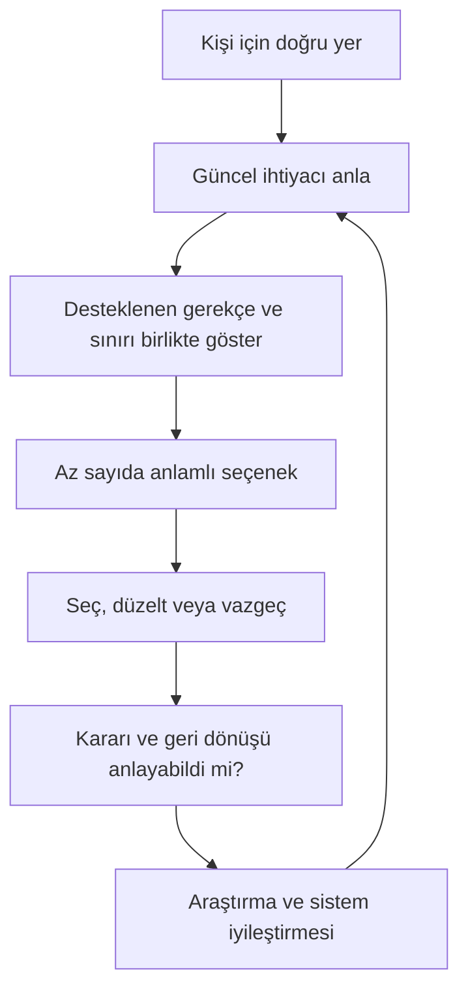
```mermaid
flowchart TD
    A["Kişi için doğru yer"] --> B["Güncel ihtiyacı anla"]
    B --> C["Desteklenen gerekçe ve sınırı birlikte göster"]
    C --> D["Az sayıda anlamlı seçenek"]
    D --> E["Seç, düzelt veya vazgeç"]
    E --> F["Kararı ve geri dönüşü anlayabildi mi?"]
    F --> G["Araştırma ve sistem iyileştirmesi"]
    G --> B
```

## 2. Component Architecture

Seçilen mimari **ortak anlam çekirdeği, bileşen sözleşmeleri, görev örüntüleri ve kanal uyarlamalarından** oluşur. Bileşen yalnız görünüm değildir: içerik gereksinimi, etkileşim, durum, erişilebilirlik, mahremiyet ve kesinti davranışı bir bütündür.

| Katman | Sorumluluk | Yapamayacağı iş |
| --- | --- | --- |
| İlkeler ve ortak dil | Karar anlamı, haklar, doğruluk sınırları | Bileşenin piksel düzenini belirlemek |
| Temeller ve tokenlar | Renk, tipografi, boşluk, hareket, odak ve yüzey rolleri | Uygunluk, ticari öncelik veya veri geçerliliği üretmek |
| Temel bileşenler | Eylem, metin girişi, seçim, katman ve geri bildirim | Yer veya rota önerisini hesaplamak |
| Alan bileşenleri | Yer, günlük rota, iddia, kayıt, paylaşım ve inceleme sunumu | Yetkili sonucu değiştirip daha çekici hale getirmek |
| Görev örüntüleri | Arama–filtre–sonuç; düzenleme–yeniden değerlendirme; önizleme–paylaşım | Yeni ürün hakkı veya navigasyon ailesi açmak |
| Kanal uyarlaması | Ekran alanı, giriş yöntemi, işletim sistemi ve yardımcı teknolojiye uyum | Mobilde kritik bilgi silmek veya admin yetkisini tüketiciye taşımak |

Bağımlılık aşağı yönlüdür. Buton Yer Kartı'nı tanımaz; Yer Kartı buton ve iddia sunumunu kullanır. Token bir bileşene geri bağlanmaz. İki alan bileşeni ortak kavrama ihtiyaç duyarsa ortak sözleşme çıkarılır; birbirlerinin özel iç düzenine bağımlı olmazlar. Aynı görünüm farklı anlamı birleştirmek için yeterli gerekçe değildir: seçim chip'i ve durum badge'i ayrı kalır.

Her bileşen kaydı şu bilgileri içerir: kararlı kimlik, sahibi, yedi değerlendirme başlığı, gerekli/isteğe bağlı içerik, izinli varyantlar, erişilebilir ad ve odak davranışı, durum geçişleri, dar/geniş uyarlama, yerelleştirme, mahremiyet, bağımlılıklar, doğrulama senaryoları ve değişiklik geçmişi. Bu alanlar gelecekteki kataloğun kabul sözleşmesidir; bu görev katalog uygulaması oluşturmaz.

### Diyagram 02 — Component Tree

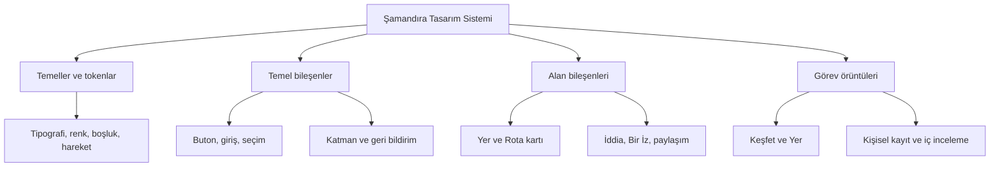
```mermaid
flowchart TD
    A["Şamandıra Tasarım Sistemi"] --> B["Temeller ve tokenlar"]
    A --> C["Temel bileşenler"]
    A --> D["Alan bileşenleri"]
    A --> E["Görev örüntüleri"]
    B --> B1["Tipografi, renk, boşluk, hareket"]
    C --> C1["Buton, giriş, seçim"]
    C --> C2["Katman ve geri bildirim"]
    D --> D1["Yer ve Rota kartı"]
    D --> D2["İddia, Bir İz, paylaşım"]
    E --> E1["Keşfet ve Yer"]
    E --> E2["Kişisel kayıt ve iç inceleme"]
```

### Diyagram 03 — Bileşen bağımlılığı ve yetki

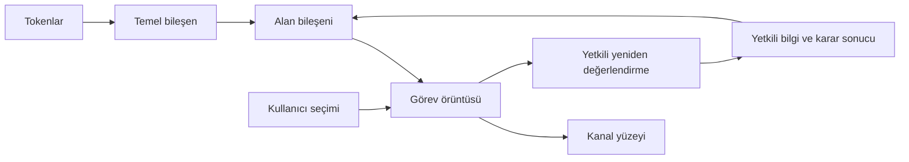
```mermaid
flowchart LR
    T["Tokenlar"] --> B["Temel bileşen"]
    B --> A["Alan bileşeni"]
    A --> O["Görev örüntüsü"]
    O --> K["Kanal yüzeyi"]
    V["Yetkili bilgi ve karar sonucu"] --> A
    U["Kullanıcı seçimi"] --> O
    O --> Y["Yetkili yeniden değerlendirme"]
    Y --> V
```

## 3. Atomic Design yaklaşımı kullanılmalı mı?

**Evet, parçayla bütün arasında düşünme yöntemi olarak; zorunlu klasör ve sahiplik modeli olarak hayır.** Brad Frost'un yaklaşımı atom, molekül, organizma, şablon ve sayfanın birlikte değerlendirilmesini anlatır; beş aşamalı düz bir üretim sırası önermez. Şamandıra bu dersle bileşeni gerçek içerik ve görev içinde sınar. [Atomic Design Methodology](https://atomicdesign.bradfrost.com/chapter-2/).

| Atomic kavramı | Şamandıra'daki karşılık | Sınır |
| --- | --- | --- |
| Atom | Metin rolü, ikon, tek eylem kontrolü | Her çizgi için ayrı bileşen zorunluluğu yok |
| Molekül | Etiket–alan–yardım–hata birlikteliği | Yardım ve hata yalnız dekor değildir |
| Organizma | Yer kartı, rota düzenleyici, paylaşım önizlemesi | Alan anlamı genel kart görünümüne indirgenmez |
| Şablon | Keşfet ve Yer okuma düzeni | Veri eksikliği için sahte içerik konmaz |
| Sayfa | Gerçek bağlam ve durumla sınanan bütün | Mutlu durum ekranı tek kabul örneği olamaz |

Avantajı tekrarın görünmesi ve tutarlılıktır. Riski “bu atom mu molekül mü?” tartışmasının kullanıcı işinin önüne geçmesidir. Bileşen sınırı; bağımsız anlam, değişim nedeni, erişilebilir davranış ve tekrar kullanım üzerinden çizilir. Yer kartının kimliği, gerekçesi ve kritik sınırı aynı sunum sözleşmesinde kalır; atomlaştırma bunları ayrı zamanlarda yayımlamak için gerekçe değildir.

## 4. Design Token yapısı

Üç katman kullanılır: **ilkel değer → anlamsal rol → gerekli olduğunda bileşen rolü**. Bileşen katmanı bütün değerleri yeniden adlandıran zorunlu kopya değildir; gerçekten bağımsız değişmesi gereken alanlarda açılır. Tokenlar bu belgede insan tarafından okunur adlarla tarif edilir; herhangi bir dosya biçimi, framework veya üretim aracı seçilmez.

| Katman | Örnek ad | Anlam |
| --- | --- | --- |
| İlkel | renk.koyu-yesil; aralik.4; sure.kisa | Bağlamsız renk veya ölçü |
| Anlamsal | metin.birincil; eylem.birincil.zemin; bosluk.grup | Kullanım amacı, tema ve erişilebilirlik beklentisi |
| Bileşen | yer-karti.ic-bosluk; arama.odak-cercevesi | Bileşene ait gerekçeli karar; anlamsal role bağlanır |

Adlar teknik katalogda kararlı Türkçe ASCII, kullanıcı metinleri doğru Türkçe olur. Token adı renk görünümünü kullanım amacının yerine koymaz: “mavi-buton” yerine “eylem.birincil”. Durum, parça ve özellik açık ayrılır; “aktif” sözcüğü hem seçili hem basılı hem ziyaret edilmiş anlamında kullanılmaz.

Her token için tür, değer/birim, rol, mod karşılıkları, izinli eşleşmeler, sahibi, eklenme sürümü, kullanımdan kaldırma durumu ve gerekçe kaydedilir. Aynı anlamlı iki token birleştirilir; aynı HEX'e sahip farklı anlamsal roller gelecekte ayrışabilecekleri için korunabilir. Referans döngüsü, çözülmeyen rol ve kullanıcı arayüzündeki doğrudan keyfî değer kabul edilmez. İstisna gerekçeli ve süreli olur.

Mod eksenleri tema, kontrast gereksinimi, hareket tercihi ve izinli yoğunluktur. Ekran genişliği yerleşimi; metin büyütme tipografiyi etkiler. Premium ayrı tema veya doğruluk tokenı değildir. Dil, hak ve bilgi geçerliliği tokenla kodlanmaz. Tema değişimi seçim, içerik veya karar sırasını değiştirmez.

### Diyagram 04 — Token Flow

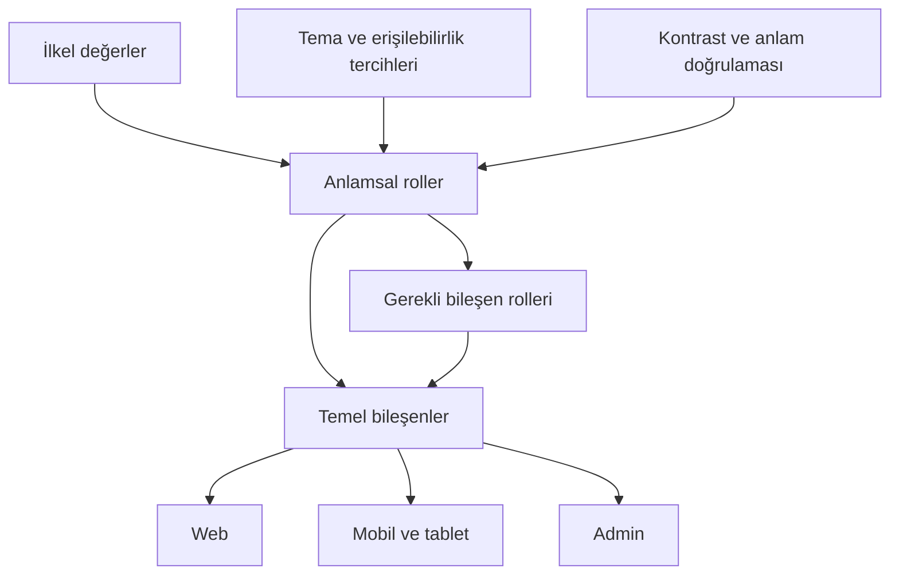
```mermaid
flowchart TD
    P["İlkel değerler"] --> S["Anlamsal roller"]
    M["Tema ve erişilebilirlik tercihleri"] --> S
    S --> C["Gerekli bileşen rolleri"]
    S --> B["Temel bileşenler"]
    C --> B
    B --> W["Web"]
    B --> N["Mobil ve tablet"]
    B --> A["Admin"]
    Q["Kontrast ve anlam doğrulaması"] --> S
```

## 5. Spacing sistemi

Ölçüler fiziksel ekran pikseli değildir. **Tasarım birimi (tb)**, normal metin ölçeğinde web için CSS pikseli, yerel uygulamada platformun mantıksal yerleşim birimiyle eşlenen tasarım referansıdır. Bu eşleme fiziksel boyut eşitliği iddia etmez; platform metin ve erişim hedefleriyle doğrulanır. Yazı büyüdüğünde içerik kutusunun yüksekliği serbest büyür.

| Basamak | Başlangıç değeri | Kullanım |
| --- | --- | --- |
| S0 | 0 tb | İlişkili yüzeylerin birleşmesi |
| S1 | 4 tb | Etiket ile yakın açıklama; dokunma hedefleri arası genel varsayılan değil |
| S2 | 8 tb | İkon–metin, kısa satır içi ilişki |
| S3 | 12 tb | Aynı görev içindeki yakın alt grup |
| S4 | 16 tb | Form alanı aralığı; dar kart iç boşluğu |
| S5 | 24 tb | Kartlar ve ayrı karar grupları; geniş kart iç boşluğu |
| S6 | 32 tb | Sayfa alt bölümleri |
| S7 | 48 tb | Ana içerik bölümleri |
| S8 | 64 tb | Geniş ekranda ayrı anlatı bölümleri |

Dört birim tabanı düzenli ilişki kurar; tipografinin satır yüksekliği veya optik düzeltmesi dört katı olmaya zorlanmaz. İki birim yalnız optik hizalama ve odak ayrımı için gerekçeli istisnadır; yeni yoğunluk basamağı değildir. Kart içindeki ilişkili bilgi, kartlar arasındaki mesafeden daha yakın olmalıdır. Zorunlu koşul açıklaması ait olduğu iddiadan S2–S3 ile ayrılır; farklı bölüm gibi uzaklaştırılmaz.

Dar ekranda boşluk azalabilir, anlam azalmaz. Tasarruf önce dekoratif alan, yinelenen açıklama ve kolon sayısından yapılır. Negatif boşlukla örtüşen kontroller, görünmeyen dokunma hedefi çakışmaları ve kritik metni daraltmak yasaktır. Görsel boşluk ile etkileşim alanı birlikte değerlendirilir.

## 6. Grid sistemi

Grid, okuma ve karşılaştırma hizasıdır; her yüzeyi kutularla doldurma talimatı değildir. Şamandıra'da **okuma genişliği**, **görev genişliği** ve **çok panelli çalışma genişliği** ayrılır.

| Alan | Başlangıç düzeni | İçerik kuralı |
| --- | --- | --- |
| Dar görev | 4 kolon; 16 tb dış boşluk; 16 tb oluk | Tek ana okuma akışı |
| Orta görev | 8 kolon; 24 tb dış boşluk; 24 tb oluk | Yeterli alanda iki ilişkili bölüm |
| Geniş görev | 12 kolon; 32 tb dış boşluk; 24 tb oluk | Ana içerik ve isteğe bağlı yardımcı panel |
| Uzun okuma | Yaklaşık 60–70 karakterlik satır; üst sınır 75 hedefi | 12 kolonun tamamına yayılmaz |
| Genel görev kabı | En çok 1280 tb başlangıç hedefi | Daha geniş ekranda okunabilir içerik ortalanır |
| İç admin çalışma alanı | En çok 1600 tb başlangıç hedefi | Kanıt ve değerlendirme gerekiyorsa yan yana; genişlik veri hakkı değildir |

Yer sonuçları varsayılan olarak karşılaştırılabilir dikey listedir; geniş ekranda yeterli kart genişliği ve aynı okuma sırası sağlanırsa iki kolon kabul edilebilir. Masonry seçilmez: değişken dikey sıçrama gerekçe ve sınır karşılaştırmasını bozar. Kolon sayısı ilk öneri sayısını artırmaz. Boşluk, daha fazla aday getirme gerekçesi olamaz.

Metin, eylem ve kritik bilgi aynı hizalama mantığını kullanır. Fotoğraf taşıyabilir; içerik onun kenarına göre okunamayacak kadar dağılmaz. Kenardan kenara harita veya fotoğraf, metin ve eylemlerin güvenli alanını ortadan kaldırmaz.

## 7. Responsive kuralları

Öncelik **anlamı koru → yeniden akıt → ilişkili alanları birleştir → yardımcı görevi isteğe bağlı aç** sırasıdır. Mobil “eksik masaüstü”, masaüstü “daha çok sonuç” değildir. Aynı kişi, aynı ihtiyaç ve aynı bilgi sürümünde aynı kritik sınırı görebilmelidir.

| Durum | Dar alan | Geniş alan | Korunan anlam |
| --- | --- | --- | --- |
| Keşfet | Liste; istenince harita | Liste ve isteğe bağlı harita paneli | Aynı sonuç kümesi, seçili yer ve filtre |
| Filtre | Sheet veya tam görev görünümü | İçerik yanında panel | Taslak ile uygulanan koşullar ayrımı |
| Yer | Kimlikten karara dikey akış | Ana okuma ve yardımcı pratik bilgi | Engel, gerekçe ve belirsizlik sırası |
| Rota düzenleme | Bir etkin düzenleme bağlamı | Plan ve etki özeti yan yana | Aynı kilitler, sıra ve güncel değerlendirme |
| Admin | Kanıt ve karar arasında açık geçiş | Karşılaştırmalı paneller | Yetki, gerekçe ve işlem sonucu |

Yön değiştirme, bölünmüş pencere ve klavye açılması sırasında sorgu, taslak, seçim ve odak korunur. Kullanıcı bir modal içindeyken boyut değişti diye katman kapanmaz veya arka görev etkinleşmez. Başlık ve eylem sırası dil yönüne uyarlanır. Ana eylem ekran klavyesi, güvenli alan veya yapışkan başlık altında kalamaz; yeterli alan yoksa sabitliği bırakıp akışa katılır.

### Diyagram 05 — Responsive Structure

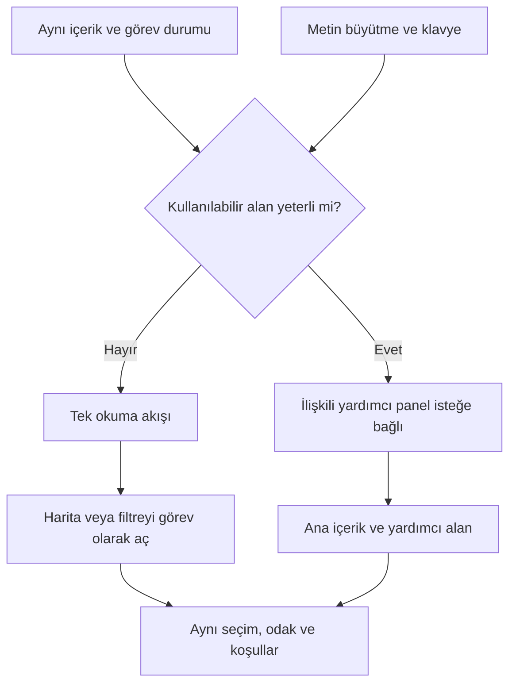
```mermaid
flowchart TD
    I["Aynı içerik ve görev durumu"] --> A{"Kullanılabilir alan yeterli mi?"}
    A -->|"Hayır"| S["Tek okuma akışı"]
    A -->|"Evet"| P["İlişkili yardımcı panel isteğe bağlı"]
    S --> H["Harita veya filtreyi görev olarak aç"]
    P --> R["Ana içerik ve yardımcı alan"]
    H --> K["Aynı seçim, odak ve koşullar"]
    R --> K
    T["Metin büyütme ve klavye"] --> A
```

## 8. Breakpoint stratejisi

Başlangıç eşikleri cihaz markasına göre değil kullanılabilir görev genişliğine göre belirlenir. Web'de aşağıdaki değerler CSS pikseli cinsinden referanstır; yerel uygulama pencere alanına ve platform metin ölçeğine göre eşdeğer davranışı sağlar.

| Sınıf | Kullanılabilir genişlik | Varsayılan |
| --- | --- | --- |
| Dar | 600'den küçük | 4 kolon, tek ana görev |
| Orta | 600–1023 | 8 kolon; iki bölüm ancak içerik sığıyorsa |
| Geniş | 1024–1439 | 12 kolon; ana alan ve yardımcı panel olanağı |
| Çok geniş | 1440 ve üzeri | Okuma sınırı korunur; görev kabı büyümeyi sınırlar |

Eşikler izin verir, zorunlu düzen dayatmaz. İki panel için başlangıç koşulu: ana içerik en az 480 tb, yardımcı alan en az 320 tb ve arada 24 tb; dış boşluk da hesaba katılır. Bu koşul metin büyütmeyle bozulursa geniş ekran tek akışa döner. Bileşen kendi kabına göre yeniden akar; dar bir drawer içindeki kart ekranın toplam genişliğini esas alamaz.

Kontrol matrisi: 320, 360, 390, 600, 768, 1024, 1280 ve 1440 referans genişlikleri; her eşiğin hemen altı/üstü; dikey/yatay yön; büyük metin; uzun Türkçe ad; sağdan sola dil. Bunlar desteklenen cihazların kapalı listesi değildir. Yeni breakpoint ancak tekrarlanan içerik kırılması gösteriliyorsa eklenir. Kullanıcı aracısı veya cihaz adı üzerinden anlam değiştirilmez.

## 9. Typography sistemi

Tipografi yerin karakterinden önce kararın okunmasını taşır. Başlangıç tercihi, işletim sisteminin erişilebilir metin ölçeğiyle uyumlu **sistem sans ailesidir**. Şamandıra'nın kimliği tek bir tescilli fontun yüklenmesine bağlı değildir. Özel bir marka fontu ileride ancak Türkçe ve diğer desteklenen alfabeler, lisans, dosya maliyeti, yedek font geçişi ve okunabilirlik birlikte doğrulanırsa eklenebilir.

| Rol | Normal ölçekte boyut / satır yüksekliği | Ağırlık hedefi | Kullanım |
| --- | --- | --- | --- |
| Büyük anlatı | 40 / 48 tb; dar alanda 32 / 40 | 600 | Ana sayfa veya yöntem anlatısında sınırlı |
| Sayfa başlığı | 32 / 40; dar alanda 28 / 36 | 600 | Yer kimliği ve görev başlığı |
| Bölüm başlığı | 24 / 32 | 600 | Anlamlı içerik bölümü |
| Alt bölüm / kart başlığı | 20 / 28 | 600 | Yer adı, rota veya grup |
| Vurgulu gövde | 18 / 28 | 400 veya 600 | Kısa karar özeti; her paragrafta kullanılmaz |
| Gövde | 16 / 24 | 400 | Gerekçe, sınır, pratik bilgi, form |
| İkincil gövde | 14 / 20 | 400 | Destekleyici ayrıntı; kritik engel için değil |
| Etiket | 16 / 24 | 600 | Buton ve form etiketi |
| Caption | 13 / 20 | 400 | Fotoğraf açıklaması ve ikincil metadata |

Bunlar sabit yükseklik değildir. Metin büyütme, farklı yazı sistemi ve kullanıcı satır aralığı içeriği büyütür. Hafif ağırlık, yoğun italik, harfleri açılmış küçük metin ve tamamı büyük harf ana ürün dili değildir. Sayıların hizalanması gerektiğinde tabular rakam kullanılabilir; teknik görünüm için bütün arayüz monospace olmaz. Rota süreleri ve para aralıkları birimleriyle birlikte okunur.

## 10. Font hiyerarşisi

Hiyerarşi en fazla üç eşzamanlı vurgu düzeyiyle anlaşılır olmalıdır: mevcut görev/yer; karar bilgisi; destekleyici bağlam. Bütün metinleri aynı anda kalınlaştırmak, büyütmek ve renklendirmek yasaktır. Boyut, ağırlık ve boşluk birbirini destekler; sırf daha dikkat çekmesi için yeni font ailesi açılmaz.

Sistem fontunun ağırlık eşlemesi kanala göre optik olarak doğrulanır; bir platformda “600” görünümünün diğerine birebir aynı olacağı varsayılmaz. Türkçe İ/ı, ş/Ş, ğ/Ğ, ö, ü ve ç; rakam, para simgesi, tarih ve uzun yer adları ilk örnek kümesidir. Fallback font yazıyı kesmemeli, düğmeyi taşırmamalı ve sonradan yüklenme tıklama hedefini kaydırmamalıdır.

Marka başlığı, Yer başlığından sürekli daha baskın tutulmaz. İç admin ekranında daha çok satır gösterme isteği, varsayılan gövdeyi 12 tb'ye düşürme gerekçesi değildir. İzinli sıkı yoğunluk yalnız yardımcı tablo içeriğini §61'deki sınırlar içinde etkiler; kritik inceleme metni ve eylem etiketleri okunabilir kalır.

## 11. Başlık yapısı

Her sayfa veya bağımsız görev yüzeyinin tanımlı ana başlığı olur. Görsel boyut ile anlamsal başlık düzeyi ayrıdır: küçük bir drawer başlığı kendi bağlamını adlandırabilir; daha büyük yazı kullanmak yeni sayfa seviyesi yaratmaz. Başlık sırası içerik ilişkisini izler, görünüş için düzey atlamaz. Bir sayfadaki yer kartları sonuç bölümünün altındadır; her kart yeni ana sayfa başlığı değildir.

Yer başlığında gerçek ve ayırt edici ad kullanılır; aynı adlı şubeyi ilçe/konum ayırır. Başlıkta “en iyi”, “kaçırılmayacak”, popülerlik veya yüzde uygunluk bulunmaz. Uzun yer adı sarılır; kritik kimlik ayrımı üç noktayla kaybolmaz. Düzenleme eylemi başlığın parçası değildir; ayrı erişilebilir kontrol olur.

### Diyagram 06 — Okuma ve başlık hiyerarşisi

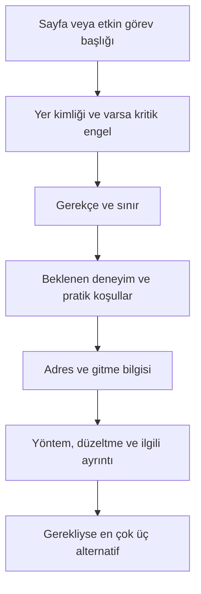
```mermaid
flowchart TD
    P["Sayfa veya etkin görev başlığı"] --> I["Yer kimliği ve varsa kritik engel"]
    I --> G["Gerekçe ve sınır"]
    G --> D["Beklenen deneyim ve pratik koşullar"]
    D --> U["Adres ve gitme bilgisi"]
    U --> Y["Yöntem, düzeltme ve ilgili ayrıntı"]
    Y --> A["Gerekliyse en çok üç alternatif"]
```

## 12. Body metin sistemi

Gövde metni 16/24 başlangıcını kullanır; kısa, somut cümlelerle tek fikri taşır. Gerekçe kullanıcının belirttiği ihtiyaçla bağ kurar: “İki kişi konuşmak için aradığın kapalı oturma alanı var; akşam ses düzeyini doğrulayamıyoruz.” Bu bir yer hakkında gerçek veri beyanı değil, dil örneğidir. Her olumlu ifadenin kapsamı kendi yakınında yer alır.

Paragraf 60–70 karakterlik satır hedefinde okunur; iki yana yaslanmaz. Bağlantı metni hedefi söyler, yalnız “buraya tıkla” olmaz. Karar için gerekli uzunluk zorunlu satır sınırıyla kesilmez. İkincil açıklama açılabilir, fakat kapanma, zorunlu koşul ihlali ve önemli bilinmeyen bu alana taşınamaz.

İç skor, kaynak yorum, yıldız, yorum yoğunluğu, model düşünce zinciri ve pazarlama sıfatı gövdeye giremez. Kişinin “rahat bir gün” sözü yürüyüş, bekleme, mola ve değişim ihtiyacıyla açıklanır; ürünün tempo/enerji ölçeği yapılmaz. Yüksek okuryazarlık varsayımıyla “senkronizasyon çatışması” gibi altyapı dili tüketiciye bırakılmaz; “İki cihazda farklı düzenlemeler var” denir.

## 13. Caption sistemi

Caption fotoğraf zamanı, kapsamı, izinli kaynak atfı ve ikincil açıklamaya ayrılır. 13/20 başlangıç değeri alt sınır hedefidir; küçük ekran nedeniyle küçültülmez ve kullanıcı ölçeğiyle büyür. Düşük önem, düşük kontrast demek değildir. Tüm caption metinleri normal metin kontrast koşulunu karşılar.

Bir fotoğrafın eski oluşu veya belirli girişe ait oluşu kararı değiştiriyorsa bu bilgi yalnız caption değildir; ilgili iddia yanında gövde düzeyinde de yer alır. “Temsili AI görseli” ibaresi yanlış gerçeklik algısını tek başına gidermez; §52'nin kullanım yasağını delmez. Caption tıklanabilir tek kontrol haline getirilmez; kaynak ayrıntısı bağlantıysa bağlantı davranışı ve adı korunur.

## 14. Renk sistemi

Şamandıra'nın başlangıç paleti, açık mineral yüzeyler, koyu okunabilir metin ve ölçülü yeşil vurgu kullanır. Bu seçim doğa, sağlık veya güvenlik garantisi değildir. Yeşil bir yerin iyi olduğunu göstermez. Yer kimliğini asıl taşıyan gerçek içerik ve fotoğraftır; bütün yerler marka rengine boyanmaz.

| Anlamsal rol | Açık tema | Koyu tema | Kural |
| --- | --- | --- | --- |
| Sayfa zemini | #F6F7F4 | #111916 | Uzun okumanın arka planı |
| Ana yüzey | #FFFFFF | #1B2620 | Kart, giriş ve içerik |
| İç yüzey | #EEF1ED | #15201B | Aynı grup içinde yardımcı bölge |
| Üst yüzey | #FFFFFF | #25342B | Geçici katman ve açılan içerik |
| Birincil metin | #202B28 | #F0F5EF | Kimlik, gerekçe ve kritik sınır |
| İkincil metin | #4C5B54 | #C0CEC2 | Destekleyen metin |
| Caption metni | #5C6962 | #A6B6A9 | İkincil metadata; kontrast korunur |
| Birincil eylem zemini | #185A48 | #8DD9B5 | Görevde baskın eylem |
| Birincil eylem metni | #FFFFFF | #102B20 | Yalnız eşleştiği eylem zemini üzerinde |
| Seçim zemini | #E0EFE7 | #233E30 | Kullanıcının seçimi; uygunluk hükmü değil |
| Güçlü sınır | #718078 | #829688 | Kontrolün algılanması için gerekli kenar |
| Hafif ayırıcı | #D3DAD4 | #405247 | Dekoratif ayrım; tek kontrol sınırı olamaz |
| Odak vurgusu | #164FAD | #A9CAFF | Klavye/yardımcı giriş odağı |
| Hata / tehlikeli işlem | #A52E34 | #FFADB0 | Hata anlamı ve açık eylem etiketiyle |
| Uyarı | #805400 | #EDC879 | Dikkat gerektiren koşul; otomatik uygunsuzluk değil |
| Bilgilendirme | #245B83 | #9ACFF2 | Nötr bilgi; AI üstünlüğü anlamı yok |
| Başarı | #185A48 | #8DD9B5 | Gerçek işlem sonucu; yer kalitesi değil |

Palet, Şamandıra v1 sistem kararıdır; tamamlanmış marka veya kullanıcı araştırması değildir. Her tonun bütün zeminlerde kullanılabileceği varsayılmaz. İzinli eşleşmeler birlikte yönetilir. Durum metinleri ana/açık üst yüzeyde, koyu temada ana/üst yüzeyde kullanılır; rastgele renkli zeminler ayrıca doğrulanmadan eklenmez.

Aşağıdaki oranlar opak sRGB değerlerinden WCAG bağıl parlaklık yöntemiyle hesaplanmıştır; ekran testinin yerine geçmez. Yuvarlanan değerler eşik kabulünde yukarı yuvarlama gerekçesi olamaz.

| Kontrol edilen eşleşme | Kontrast |
| --- | --- |
| Açık birincil metin / sayfa zemini | 13,58:1 |
| Açık ikincil metin / iç yüzey | 6,29:1 |
| Açık caption / iç yüzey | 5,05:1 |
| Açık buton metni / birincil eylem | 8,09:1 |
| Açık güçlü sınır / iç yüzey | 3,64:1 |
| Açık uyarı, hata, bilgi / beyaz | Sırasıyla 6,59; 6,91; 7,24:1 |
| Koyu birincil metin / üst yüzey | 11,85:1 |
| Koyu ikincil metin / üst yüzey | 8,01:1 |
| Koyu caption / üst yüzey | 6,16:1 |
| Koyu buton metni / birincil eylem | 9,16:1 |
| Koyu güçlü sınır / üst yüzey | 4,15:1 |
| Koyu uyarı, hata, bilgi / üst yüzey | Sırasıyla 8,19; 7,39; 7,84:1 |

Hover, basılı ve seçili durumlar yalnız alfa azaltarak üretilmez. Her izinli durum çifti kontrast ve seçilebilirlik incelemesine girer. Başlangıçta hover güçlü sınır/alt çizgi, basılı durum aynı okunabilir renkler ve durum göstergesiyle ayrılır; yeni ton gerekiyorsa tokena eklenir. Fotoğraf üstü saydam yazı, parıltılı gradient ve rastgele dinamik marka rengi karar yüzeylerinin varsayılanı değildir.

## 15. Semantic color yapısı

Renk rolü **anlamı destekler, anlam üretmez**. Eylem yeşili ile başarı yeşili aynı ilkel değeri paylaşabilir; farklı anlamsal tokenlardır. “Seçildi” kullanıcı iradesidir; “uygunluğu destekleniyor” yetkili değerlendirmedir. Birbirinin rengiyle aynı durum gibi sunulmaz.

| Anlam | Sunum sözleşmesi | Yasak çıkarım |
| --- | --- | --- |
| Eylem | Fiil, görünür odak, gerektiğinde ikon | Vurgulu buton tek geçerli seçimdir |
| Başarı | Tamamlanan işlemi ve kapsamı söyler | Yer güvenli veya kullanıcı memnun |
| Uyarı | Koşulu, etkisini ve düzeltme yolunu anlatır | Sarı olan her yer yine de önerilebilir |
| Hata | İşlemin başarısız veya sonucu belirsiz durumunu ayırır | Her bilinmeyen veri sistem arızasıdır |
| Nötr belirsizlik | İlgili iddiada neyin doğrulanamadığını söyler | Veri bulunmaması koşulun yokluğudur |
| Seçim | İşaret, etiket ve erişilebilir durum | Seçilen yer otomatik zorunlu duraktır |
| Devre dışı | Neden kullanılamadığı yakında açıklanır | Silik bilgi önemsiz veya ücretsiz kullanıcıya kapalı |

Renk körlüğünde, gri ölçekte, yüksek kontrast modunda ve basılı paylaşımda aynı anlam kalır. Zorunlu koşul ihlali yalnız kırmızı nokta değildir. Yerin genel güven puanı, “AI onaylı”, “Premium doğrulanmış” veya renkli uygunluk yüzdesi üretilmez. İç değerlendirme sınıfları gerekmedikçe kullanıcıya rozet olarak taşınmaz.

## 16. Dark Mode yaklaşımı

Açık ve koyu tema eşit kapsamlıdır. Başlangıçta sistem tercihi izlenir; kullanıcının açık seçimi varsa o korunur. Tercih kaydedilemediyse kalıcı olduğu söylenmez. İlk açılışta bütün sayfanın yanlış temayla parlamaması bir uygulama kabul koşuludur. Bu belge tema uygulaması yazmaz.

Koyu tema ters renk filtresi değildir. Fotoğraflar ters çevrilmez veya atmosfer değiştirecek şekilde karartılmaz. Yüzey ayrımı gölgeye değil uygun metin, sınır ve kontrollü ton farkına dayanır. Gece haritası bulunmuyorsa liste işlevi korunur; okunamayan harita sırf tema tamamlandı görünmek için gösterilmez. Harita ve üçüncü taraf yüzeylerin uyumu ayrıca doğrulanır.

Artırılmış kontrast ve zorlanmış renk ortamında marka tonlarından önce sistem renkleri ve algılanabilir sınırlar gelir. Ana içerik kaybolmaz. Koyu tema Premium özelliği değildir. Kullanıcı rota düzenlerken tema değişirse sorgu, sıra, odak ve açık katman aynı kalır.

### Diyagram 07 — Theme Architecture

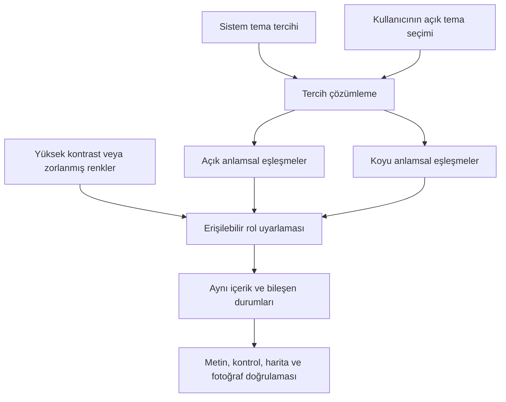
```mermaid
flowchart TD
    S["Sistem tema tercihi"] --> R["Tercih çözümleme"]
    U["Kullanıcının açık tema seçimi"] --> R
    R --> L["Açık anlamsal eşleşmeler"]
    R --> D["Koyu anlamsal eşleşmeler"]
    H["Yüksek kontrast veya zorlanmış renkler"] --> A["Erişilebilir rol uyarlaması"]
    L --> A
    D --> A
    A --> C["Aynı içerik ve bileşen durumları"]
    C --> V["Metin, kontrol, harita ve fotoğraf doğrulaması"]
```

## 17. Surface yapısı

Yüzey, içeriğin hangi göreve ait olduğunu anlatır. **Sayfa, ana içerik, iç grup, geçici üst katman ve harita kontrol yüzeyi** beş temel roldür. Her rol yeni bir kart zorunluluğu değildir. Yer sayfası uzun okumada çoğunlukla açık akış kullanır; her paragraf ayrı kutuya dönüşmez.

| Yüzey | Kullanım | Sınır |
| --- | --- | --- |
| Sayfa | Bütün görevin zemini | Başlık ve içerik arasında yapay derinlik kurmaz |
| Ana içerik | Karşılaştırılabilir kart veya form | Renkli dolgu kalite puanı değildir |
| İç grup | Aynı kartta ikincil, ilişkili bölüm | İkinci bir bağımsız kart gibi davranmaz |
| Geçici üst katman | Sheet, modal, menü | Açan bağlam ve kapanış yolu bellidir |
| Harita kontrolü | Değişken harita üstünde okunabilir eylem | Opak/öngörülebilir zemin, harita atıflarını örtmez |

Kalıcı içerikte art arda ikiden fazla yüzey kapsama düzeyi başlangıçta kabul edilmez: sayfa → kart → iç grup yeterlidir. Daha karmaşık veri varsa içerik yeniden bölünür. Premium, AI ve admin yeni dekoratif yüzey hiyerarşileri açmaz. Admin yalnız görev yoğunluğu ve yetkili içerikle ayrılır.

## 18. Elevation sistemi

Elevation, **etkileşim katmanı sırası**dır; önem veya öneri sırası değildir. Bir yer seçildiğinde görsel olarak havaya yükselmesi şart değildir. İçeriğin konumu ve seçili durumu çoğu zaman yeterlidir.

| Seviye | Rol | Etkileşim |
| --- | --- | --- |
| E0 | Sayfa, düz içerik, sıradan kart | Normal akış |
| E1 | Yapışkan görev başlığı, harita kontrolü | İçerik üstünde; odak ve metni örtmez |
| E2 | Menü, seçici, modal olmayan yardımcı panel | Açan kontrole bağlı; dış bağlam erişilebilir olabilir |
| E3 | Gerçek modal, modal sheet/drawer | Arka görev etkileşimi durur; odak içeride |
| E4 | Aktif göreve ait geçici durum bildirimi | Eylemi örtmez; yeni modal açmaz |

Bu sıra gelecekteki teknik yığınlama sayılarının kendisi değildir. E4, bildirimin her modalın üstüne ilgisiz biçimde çıkabileceği anlamına gelmez; bildirim aktif yüzeyin güvenli alanında konumlanır. Aynı anda en fazla bir modal görev açık olur. Modal içi yerel seçici, aynı görevin alt kontrolüdür; ikinci bağımsız modal değildir. Tooltip mevcut aktif katmana bağlı kalır.

## 19. Shadow kullanımı

Gölge geçici üst katmanı arka içerikten ayırmaya yardımcı olabilir. Sıradan kartta varsayılan gölge yoktur. İnce sınır, boşluk ve yüzey farkı önce gelir. Hover sırasında bütün kartı yükseltme ve manyetik imleç takibi kullanılmaz; görünüm kullanıcı hareketini kovalamaz.

Başlangıç gölge rolleri: **yok**, **yakın** ve **geçici katman**. Yakın rol için yaklaşık 2 tb düşey uzaklık, 8 tb bulanıklık ve düşük koyuluk; geçici katman için 8 tb uzaklık, 24 tb bulanıklık ve kontrollü koyuluk araştırma başlangıcıdır. Bunlar CSS tarifi değil görsel karar aralığıdır. Yayılma, ışık yönü ve renk, platformda tek sistem olarak doğrulanır; her bileşen bağımsız gölge seçmez.

Koyu temada gölgeyi karartarak ayrımı büyütmek yerine üst yüzey ve sınır güçlendirilir. Zorlanmış renklerde gölge tamamen kaybolsa da katman anlaşılır kalmalıdır. Gölge, kontrol sınırının veya odak göstergesinin tek taşıyıcısı olamaz. Performans yükü yaratan geniş hareketli bulanıklık kullanılmaz.

## 20. Radius sistemi

Radius, ürünün sakin ve yaklaşılabilir karakterini destekler; her öğeyi kapsüle çevirmez. Başlangıç ölçeği **0, 4, 8, 12 ve 16 tb**; tam yuvarlak yalnız chip, küçük durum işareti ve gerçek dairesel kontrol içindir.

| Rol | Başlangıç radius | Gerekçe |
| --- | --- | --- |
| Gömülü satır veya düz bölüm | 0–4 tb | İçerik akışını korumak |
| Buton, input, menü | 8 tb | Tutarlı kontrol ailesi |
| Yer / Rota kartı | 12 tb | Bir karar birimini ayırmak |
| Modal ve bağımsız sheet | 16 tb | Geçici görev yüzeyini tanımlamak |
| Chip | Tam yuvarlak | Kısa seçilebilir birim; badge ile davranış ayrımı sürer |

İç fotoğraf köşesi dış karttan taşmaz; iç kenar ilişkisi optik olarak tutarlı tutulur. Tam ekran sheet, cihaz çerçevesi nedeniyle köşe kırpmayı zorunlu kılmaz. İkonların ve harita yollarının köşeleri bu tabloya körlemesine uyarlanmaz. Radius büyüklüğü Premium veya yüksek uygunluk belirtmez.

## 21. Divider kullanımı — B01 Ayırıcı

### Amacı

Aynı akışta iki anlamlı bilgi grubunun sınırını görünür kılmak. Ayırıcı içerik veya durum taşımaz; kendi başına etkileşimli değildir.

### Ne zaman kullanılmalı

Boşluk tek başına sınırı yeterince anlatmıyorsa; örneğin liste satırları, bir formun farklı görev grupları veya rota özeti ile duraklar arasında. Varsayılan tek, ince çizgi ve anlamsal gruplamadır.

### Ne zaman kullanılmamalı

Her paragraf arasında, zaten kartla ayrılmış içerikte veya kritik uyarıyı görünür kılmanın yerine. Kontrolün gerekli kenarı hafif divider rengine bırakılamaz.

### Avantajları

Az alanla tarama düzeni sağlar; yeni yüzey ve gölge gereksinimini azaltır. Dar alanda ilişkinin korunmasına yardım eder.

### Riskleri

Çizgi çoğalırsa ekran tabloya benzer; hafif çizgi tek ayrım olduğunda düşük görmede kaybolur. Yapısal ayrım sadece görünüşte kalabilir.

### UX gerekçesi

Kullanıcı ayrı karar gruplarını anlayabilmelidir. Çizgi kaybolduğunda başlık ve boşluk ilişkisi anlamı korumalıdır; dekoratif çizgi yardımcı teknolojiye gereksiz durak olarak sunulmaz.

### Alternatifleri

Boşluk, alt başlık, liste gruplaması veya gerçekten bağımsız karar varsa kart. Taşınabilir anlam için önce bu alternatifler değerlendirilir.

## 22. Kart sistemi — B02 Temel kart

### Amacı

Kendi kimliği, ilişkili bilgisi ve gerekirse eylemi olan tek bir karar birimini toplamak. Kart bir görünüm kabıdır; “önerilen” veya “tıklanabilir” olmayı tek başına ifade etmez.

### Ne zaman kullanılmalı

Yer veya rota gibi bağımsız öğeler kıyaslanırken, kayıtlar tekrar açılırken ya da görev özeti diğer içerikten ayrılmalıdır. Varsayılan E0, 12 tb radius, dar alanda 16 ve geniş alanda 24 tb iç boşluktur.

### Ne zaman kullanılmamalı

Yer sayfasının her paragrafını kutulamak, yalnız başlık göstermek veya liste satırına gereksiz fotoğraf eklemek için. Aynı anda çok farklı görevleri tek mega kartta birleştirmek için kullanılmaz.

### Avantajları

Kimlik, gerekçe ve eylem ilişkisini tekrar edilebilir kılar. Boyut değişse de aynı içerik sözleşmesi korunabilir.

### Riskleri

Kart, fotoğraf vitrini veya bütün alanı belirsiz tıklama hedefi haline gelebilir. Birbirinin içine yerleştirilmiş kontroller ve eşit yükseklik baskısı kritik metni kesebilir.

### UX gerekçesi

İçerik sırası kimlik → karar bilgisi → destek → eylemdir; engel varsa kimliğin hemen yanına gelir. Bağımsız kaydetme gibi eylemler varsa bütün kart tek düğme değildir. Yer başlığı gerçek bağlantı, diğer eylemler ayrı kontrol olur; çakışan hedef ve aynı hedefe gereksiz tab durakları oluşturulmaz.

### Alternatifleri

Liste satırı, düz bölüm veya ilişki gerçekten tablosalsa tablo. Tek basit hedefe sahip kart bütünü bağlantı olabilir; içinde ikinci etkileşim bulunamaz.

**Varyant sınırı:** Özet kart, ayrıntılı karar kartı ve kayıt kartı içerik yoğunluğu varyantlarıdır. Yükleniyor, seçili ve hatalı birer durumdur. Premium kart görünümü veya “daha güvenilir” kart varyantı yoktur. Kart yüksekliği içerikten gelir; gerekçe ve önemli bilinmeyen satır sayısı kotasına bağlanmaz.

## 23. Yer kartı — B03

### Amacı

Kullanıcının “Bu yer benim bugünkü ihtiyacıma neden uyabilir, hangi sınırı var, sıradaki adımım ne?” sorularını kısa okumada cevaplamak.

### Ne zaman kullanılmalı

Keşfet sonuçları, Yer alternatifleri, rota için yer seçimi ve kişisel kayıt havuzunda. Her bağlam, öğenin öneri mi, adla bulunmuş yer mi, kullanıcının seçimi mi olduğunu açıkça ayırır.

### Ne zaman kullanılmamalı

Veri yetmediğinde sahte gerekçeyle öneri üretmek, sponsor sıralaması yapmak, yıldız/yorum/uygunluk yüzdesi göstermek veya zorunlu koşulu karşılamayan yeri olumlu kart olarak doldurmak için.

### Avantajları

Bütün yerlerin ortak sırayla okunmasını ve gerçek fark üzerinden kıyaslanmasını sağlar. Fotoğraf yokken de karar işlevi korunur.

### Riskleri

Kısa kart olumlu cümleyi koruyup sınırı kesebilir. Aynı adlı şubeler karışabilir. Kaydetme ikonu beğeni, erişim ikonu tam erişilebilirlik, renk genel kalite sanılabilir.

### UX gerekçesi

Zorunlu alanlar: gerçek ad, ayırt edici tür/konum, gösterim bağlamı, desteklenen ihtiyaç gerekçesi, varsa karar değiştiren engel/bilinmeyen ve açık devam yolu. İsteğe bağlı alanlar: izinli gerçek fotoğraf, ikincil koşullar, kişisel kayıt eylemi. Belirsizlik ilgili iddiayla birlikte ve aynı yenilemede görünür olur; kartta olumlu metin önce tek başına akmaz.

### Alternatifleri

Adla aramada kimlik satırı; bilgi sınırlıysa kimlik ve açık değerlendirme sınırı; kapsamlı karar için Yer sayfası. Kritik koşulu bilinmeyen aday, uygun öneri yerine ayrı “Bu koşulu doğrulayamadık” bağlamında sunulabilir; öneri kümesine karıştırılmaz.

**Kompozisyon:** Kimlik ve kapalı/engelli durum üstte; ardından gerekçe ve sınır; sonra somut koşullar; en sonda görünür eylemler. Tercihe ilişkin ödün zorunlu koşul ihlalini yumuşatamaz. “Dış alan var” bilgisi sigara, gölge veya basamaksız erişimi kendiliğinden kanıtlamaz. Mesafe ulaşım türü ve başlangıç bağlamı olmadan süreye çevrilmez.

**Durumlar:** Adla bulundu, öneri olarak değerlendirildi, kullanıcı seçti, güncellik sınırlı, değerlendirme bekliyor ve yayından kaldırıldı ayrı anlatılır. Kullanıcı kaydı yayından kaldırılan yerin izinli asgari kimliğini koruyabilir; eski olumlu iddiayı koruyamaz. Geri dönüldüğünde liste konumu ve filtreler sürer.

### Diyagram 08 — Card Composition

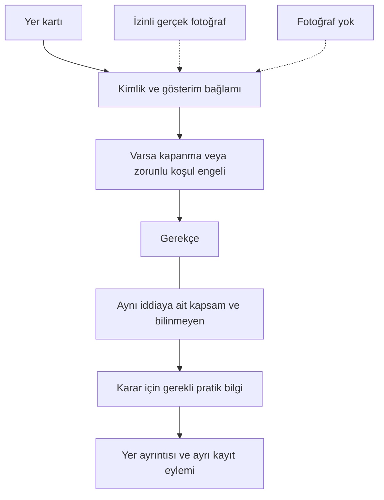
```mermaid
flowchart TD
    K["Yer kartı"] --> I["Kimlik ve gösterim bağlamı"]
    I --> E["Varsa kapanma veya zorunlu koşul engeli"]
    E --> G["Gerekçe"]
    G --- S["Aynı iddiaya ait kapsam ve bilinmeyen"]
    S --> P["Karar için gerekli pratik bilgi"]
    P --> A["Yer ayrıntısı ve ayrı kayıt eylemi"]
    F["İzinli gerçek fotoğraf"] -.-> I
    X["Fotoğraf yok"] -.-> I
```

## 24. Akıllı Rota kartı — B04

### Amacı

Bir günlük planın kapsamını, zaman ilişkilerini, kullanıcı seçimlerini ve hangi noktaların henüz değerlendirilemediğini anlaşılır bir karar özetiyle sunmak.

### Ne zaman kullanılmalı

Keşfet içindeki rota oluşturma/düzenleme görevinde, kayıtlı rotayı yeniden açarken ve açıkça hazırlanmış paylaşım önizlemesinde. Boş ve tarihsiz taslak da aynı ailede, durumuna uygun içerikle bulunur.

### Ne zaman kullanılmamalı

Çok günlük seyahat paketi, şehirler arası organizasyon, otomatik rezervasyon veya “kusursuz gün” garantisi için. Boş zamanları zorunlu durakla doldurmak ve geçmiş ziyareti yeniden yazmak için kullanılmaz.

### Avantajları

Duraklarla bütün günün ilişkisini aynı yerde görmeyi sağlar. Tek yer, mola, vazgeçme ve erken bitişi geçerli seçenek olarak taşıyabilir.

### Riskleri

Tek toplam süre kesinlik izlenimi verebilir. Kullanıcı sırası ile motorun önerisi karışabilir. Eski hesaplar yeni düzenleme üzerinde güncelmiş gibi kalabilir; çizilmiş harita yolu erişim kanıtı sanılabilir.

### UX gerekçesi

Kimlik/ad, gün veya “tarih seçilmedi”, varsa başlangıç/bitiş, ulaşım bağlamı, durak sırası, anlamlı süre aralıkları, bekleme/geçişler, önemli sınırlar ve değerlendirme durumu birlikte sunulur. Kullanıcının istediği dönüş ayağı toplama dahildir. Bütçe toplamı kapsamı ve para birimiyle verilir; bilinmeyen ücret toplamda sıfır değildir.

### Alternatifleri

Sadece niyet toplanıyorsa koleksiyon; tek yer kararı varsa Yer kartı; uzun düzenleme gerekiyorsa aynı görevde rota düzenleyici. Rota görünümü bir listeyi doğrulanmış günlük plana dönüştürmez.

**Kompozisyon ve kontrol:** Bir ana öneri ve en fazla iki anlamlı gün alternatifi; her birinin gerçek farkı açık olmalıdır. Seçilmiş durak ile zorunlu durak farklıdır. Yer, saat ve sıra sabitlemeleri yalnız ilgili ihtiyaçta ayrı gösterilir. Durak kaldırma günü yeniden doldurmaz; son durak kaldırılınca boş taslak kalır. Tarih/saat bilinmiyorsa kaydetme mümkün, uygulanabilirlik iddiası sınırlıdır.

**Düzenleme:** Açık ve geri alınabilir kullanıcının istediği değişiklik ek onay olmadan uygulanır. Başka bir zorunlu koşulu gevşetmek gerekiyorsa etkisi somutlaştırılır ve kullanıcı seçimi alınır. Yeniden değerlendirme boyunca güncel sıra korunur; önceki toplam “önceki değerlendirme” olarak ayrılır veya kaldırılır. Son gelen eski yanıt yeni taslağın üstüne yazılmaz.

### Diyagram 09 — Rota düzenleme durum makinesi

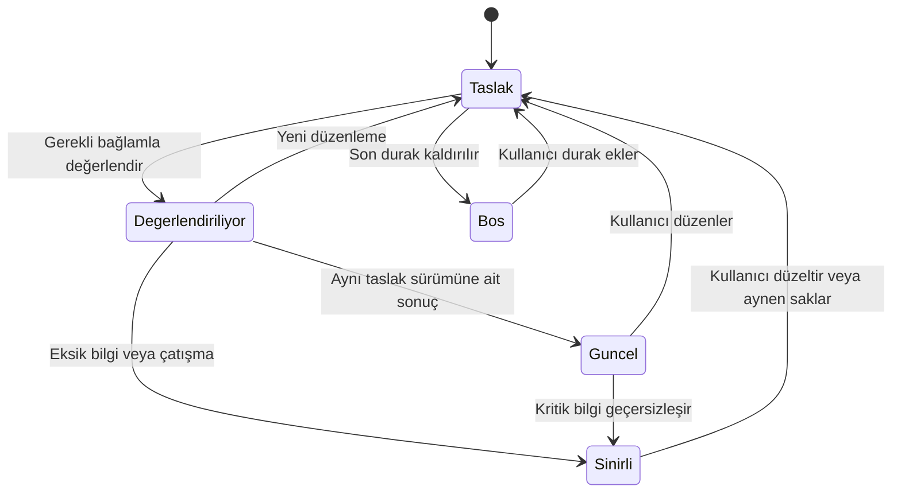
```mermaid
stateDiagram-v2
    [*] --> Taslak
    Taslak --> Degerlendiriliyor: Gerekli bağlamla değerlendir
    Degerlendiriliyor --> Guncel: Aynı taslak sürümüne ait sonuç
    Degerlendiriliyor --> Sinirli: Eksik bilgi veya çatışma
    Guncel --> Taslak: Kullanıcı düzenler
    Sinirli --> Taslak: Kullanıcı düzeltir veya aynen saklar
    Degerlendiriliyor --> Taslak: Yeni düzenleme
    Guncel --> Sinirli: Kritik bilgi geçersizleşir
    Taslak --> Bos: Son durak kaldırılır
    Bos --> Taslak: Kullanıcı durak ekler
```

## 25. Liste yapısı — B05

### Amacı

Aynı türden karar birimlerini öngörülebilir sırada taratmak ve karşılaştırmak. Listenin sırası ürün anlamının parçasıdır.

### Ne zaman kullanılmalı

Keşfet sonuçları, rota durakları, kayıtlar ve iç inceleme kuyruğunda. İlk Keşfet önerisi için 3–5 anlamlı aday hedefi korunur; yeterli aday yoksa sayı doldurulmaz. Yer sayfasında en fazla üç alternatif bulunur.

### Ne zaman kullanılmamalı

Sonsuz akışla kararı ertelemek, popülerliğe göre sıralamak veya görsel yüksekliği az olan kartı öne çekmek için. Rota sırası ile keşif sırası aynı mantık sayılmaz.

### Avantajları

Okuma düzeni ve klavye takibi nettir. Haritasız kullanımda yerleri ve durak ilişkilerini erişilebilir biçimde taşıyabilir.

### Riskleri

Yenileme sırasında sıralama atlayabilir; sanallaştırma odaklı öğeyi kaldırabilir; sınırsız yükleme kullanıcıyı kaybedebilir. Sıkı satırlar hedefleri çakıştırabilir.

### UX gerekçesi

Liste, öğelerin konumunu ve toplamını yalnız biliniyorsa açıklar. Yeni sonuçlar eski bağlama karışmaz; odağı çalmaz. Kullanıcı geri dönünce sorgu, filtre ve görülen öğe korunur. Rota sıralaması sürüklemeye ek olarak “Öne taşı / Arkaya taşı” veya hedef konum seçimiyle yapılabilir.

### Alternatifleri

Gerçek çapraz alan karşılaştırmasında tablo; bağımsız kısa karar biriminde kart; coğrafi ilişki için eşdeğer listeyi koruyan harita. Uzun kayıtlarda B47 ile kontrollü yükleme kullanılır.

**Sıralama sözleşmesi:** Keşfet sırası yetkili karardan gelir. Kullanıcının mesafe gibi açık başka sıralama seçimi varsa bağlamı belirtilir; bunun uygunluk değerlendirmesiyle aynı şey olmadığı anlatılır. Kritik güncelleme eski olumlu kartı geçersiz kılabilir, fakat kullanıcının açık rota sırasını sessizce değiştiremez.

## 26. Filtre yapısı — B06

### Amacı

Kullanıcının ihtiyacını ve açık koşullarını düzenleyerek sonuçların hangi çerçevede değerlendirildiğini görünür tutmak.

### Ne zaman kullanılmalı

Kategori, deneyim, somut koşul ve coğrafi kapsam daraltılırken. Kullanıcının metninden anlaşılan koşullar gerektiğinde düzeltilebilir kısa bir özetle gösterilir.

### Ne zaman kullanılmamalı

İlk sonuca ulaşmak için bütün alanları zorunlu doldurtmak, gerçek veri olmadan özellik sunmak veya “ucuz” tercihini kendiliğinden kesin bütçe sınırı saymak için. Tempo, enerji, yıldız ve popülerlik filtresi açılmaz.

### Avantajları

Sistemin ne anladığını denetlenebilir kılar. Kullanıcının tek koşulu değiştirmesi bütün ihtiyacı yeniden anlatmasını gerektirmez.

### Riskleri

Çok sayıda kontrol form yorgunluğu yaratır. Uygulanmayan taslak filtre aktifmiş gibi görünebilir; sonuç yokken koşullar sessizce gevşetilebilir.

### UX gerekçesi

Az ve bağımsız seçimde anlık uygulama mümkündür; çok alanlı sheet'te taslak–uygula modeli kullanılır. Aynı oturumda bu modeller belirsizce karıştırılmaz. “Uygula” etkin değişiklikleri sonuç bağlamına taşır; “Vazgeç” taslağı bırakır. Kapatmak otomatik uygulamak değildir. “Tümünü temizle” hangi filtreleri kapsadığını açıklar; sorguyu ve kişisel kayıtları kendiliğinden silmez.

### Alternatifleri

Tek belirsizlik için kısa netleştirme; görünür iki seçenek için radio; küçük çoklu küme için checkbox/chip; coğrafi kapsam için açık harita alanı seçimi. Her filtre bir dropdown olmak zorunda değildir.

**Zorunlu koşul:** Kullanıcı tarafından açıkça belirtilen sert sınır, tercih gibi soluk bir chip'e indirgenmez. Düzenleme onu gevşetiyorsa kullanıcı neyi değiştirdiğini görür. Sonuç bulunamadığında “koşulu değiştir” seçeneği belirli koşulu adlandırır; zorunlu koşulun bilinmeyen karşılığı olumlu seçeneklere katılmaz.

### Diyagram 10 — Filtre bağlamı ve sonuç

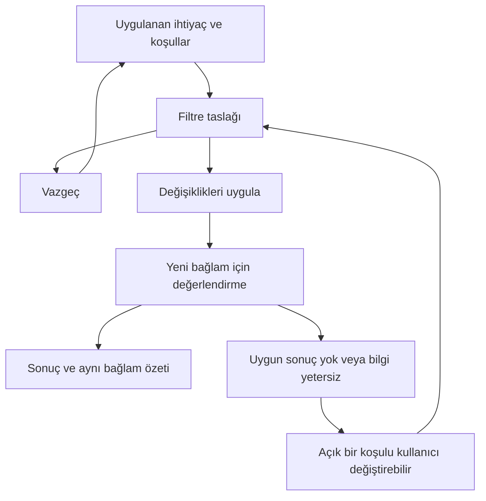
```mermaid
flowchart TD
    A["Uygulanan ihtiyaç ve koşullar"] --> D["Filtre taslağı"]
    D --> V["Vazgeç"]
    V --> A
    D --> U["Değişiklikleri uygula"]
    U --> R["Yeni bağlam için değerlendirme"]
    R --> S["Sonuç ve aynı bağlam özeti"]
    R --> N["Uygun sonuç yok veya bilgi yetersiz"]
    N --> K["Açık bir koşulu kullanıcı değiştirebilir"]
    K --> D
```

## 27. Arama kutusu — B07

### Amacı

Yer adı, konum veya doğal ihtiyaç ifadesini tek anlaşılır girişle Keşfet görevine taşımak. Arama bağımsız ürün portalı değildir.

### Ne zaman kullanılmalı

Ana sayfadan ve mevcut Keşfet bağlamından aramaya girerken, doğrudan yer ararken veya ihtiyaç değiştirilirken. Girişin neyi kabul ettiği kısa ve örnekle anlaşılır olmalıdır.

### Ne zaman kullanılmamalı

Her sorunu uzun AI sohbetine dönüştürmek, ilk açılışta klavyeyi zorla açmak veya konum/hesap iznini arama şartı yapmak için. Öneriler reklam ya da gizli sıralama yüzeyi olamaz.

### Avantajları

Kullanıcının kendi diliyle başlamasına ve bilinen yere doğrudan ulaşmasına izin verir. Gereksiz şehir–ilçe–kategori adımlarını kaldırabilir.

### Riskleri

Yer adı ile ihtiyaç karışabilir; otomatik tamamlama yazılanı değiştirebilir; geç kalan yanıt yeni sorguyu ezebilir. Placeholder, kalıcı etiket yerine kullanılırsa alanın amacı unutulur.

### UX gerekçesi

Görünür veya bağlamda açık “Ara” etiketi, temizleme ve gönderme eylemi vardır. Önerilerde ok tuşlarıyla gezinilir, Enter seçer/gönderir, Escape önce önerileri kapatır; sorguyu silmez. Metin birleştirme kullanan klavyede tamamlanmamış karakter sorgu gibi gönderilmez. Sonuç bölgesi yalnız en güncel sorguya bağlanır; sayısı erişilebilir biçimde ve odağı taşımadan duyurulur.

### Alternatifleri

Bilinen kısa seçenekler için liste; tek eksik bilgi için netleştirme; kullanıcı isterse kategoriyle keşif. Sesli giriş gelecekte platform erişim seçeneği olabilir; bu belge yeni ses özelliği ilan etmez.

**Yanıt modeli:** Adla bulunan ama ihtiyaca uymayan yer, bulunmuş kimlik olarak açılabilir; uygun öneri diye sunulmaz. AI kesilirse mevcut desteklenen arama ve manuel koşul düzenleme sürer. Arama geçmişi mahremiyet kapsamında yönetilir; özel ihtiyaçlar kendiliğinden herkese görünür öneri metnine dönüşmez.

## 28. Chip sistemi — B08

### Amacı

Kısa ve seçilebilir bir tercihi, uygulanan filtreyi veya kaldırılabilir seçimi göstermek. Chip bir eylem/seçim kontrolüdür.

### Ne zaman kullanılmalı

Küçük seçenek kümelerinde ve uygulanan koşul özetinde. Seçili, seçili olmayan ve kaldırılabilir varyantlar anlamlarına göre açık ayrılır.

### Ne zaman kullanılmamalı

Uzun açıklama, genel kalite rozeti, iddia güveni veya bütün kategorileri yatay sonsuz şeride doldurmak için. Kritik zorunlu koşulun tek anlatımı sadece chip olmaz.

### Avantajları

Geçerli seçimler kısa bakışla görülebilir; tek koşulu kaldırmak kolaylaşır. Formun tamamını yeniden açma gereksinimini azaltır.

### Riskleri

Tag ve badge ile karışabilir. Küçük çarpı hedefi erişimi zorlaştırabilir; taşan yatay şerit gizli koşullar yaratabilir.

### UX gerekçesi

Seçim işareti, metin ve erişilebilir seçili durum birlikte kullanılır. Dokunma hedefi §55'e uyar; kaldırma hedefinin adı “Basamaksız erişim koşulunu kaldır” gibi kapsamlıdır. Bir satıra sığmayan chip'ler sarılır; aktif kritik koşullar görünmez “+5” özetine tek başına saklanmaz.

### Alternatifleri

Checkbox, radio, kısa metin özeti ve ayrı düzenle eylemi. Salt bilgi için B10 Tag, kısa durum için B09 Badge kullanılır.

## 29. Badge sistemi — B09

### Amacı

Bir öğenin kısa, doğrulanabilir işlem veya yayın durumunu ilişkili etiketle göstermek. Badge varsayılan olarak etkileşimsizdir.

### Ne zaman kullanılmalı

“Taslak”, “Gönderim bekliyor”, “Bağlantı kapalı” gibi durumlarda. Sayaç ancak gerçek kapsamı ve sayısı biliniyorsa kullanılır; sıfır ile bilinmeyen farklıdır.

### Ne zaman kullanılmamalı

“En iyi”, “çok sevildi”, yıldız, yüzde uygunluk, “AI onaylı” veya “Premium güven” üretmek için. İddialardan bütün yere yayılan Sağlam/Sınırlı/Yetersiz etiketi kullanılmaz.

### Avantajları

Kaydın veya işlemin durumunu tekrarlanan listelerde hızlı ayırt ettirir. Uzun açıklamanın yerini almadan ona giriş sağlayabilir.

### Riskleri

Her kart çok rozetle dolarsa önem sırası kaybolur. Yeşil durum başarılı deneyim veya güvenli yer sanılabilir.

### UX gerekçesi

Metin ve varsa ikon birlikte anlam taşır; durum rengi tek başına kullanılmaz. Rozetin açıklaması gerekiyorsa yakın metin veya ayrı ayrıntı eylemi vardır. Genel güven rozeti yerine B39 ile iddia ve sınır gösterilir.

### Alternatifleri

Gövde içinde kısa durum cümlesi, form durum alanı veya kalıcı bildirim. Seçim gerekiyorsa chip kullanılır.

## 30. Tag sistemi — B10

### Amacı

Bir yere veya kayda ait kısa, somut sınıflandırmayı okumayı kolaylaştırmak. Tag salt tanımdır; kullanıcı seçimi değildir.

### Ne zaman kullanılmalı

Yer türü, somut alan niteliği veya koleksiyon içi sınıflandırmada; yalnız bilgi dayanağı ve kapsamı uygunsa. Çok sayı yerine karar için ilgili birkaç nitelik gösterilir.

### Ne zaman kullanılmamalı

“Güvenli”, “aile dostu”, “sakin” gibi kapsamı belirsiz kesinlikler yaratmak veya kaynaksız AI çıkarımını tesis özelliği yapmak için. Tag tıklanıyor görünerek hiçbir şey yapmamalıdır.

### Avantajları

Benzer yerlerde aynı kavramı aynı biçimde okumayı sağlar. Kısa bilginin paragrafı bölmesini azaltır.

### Riskleri

Nitelik kapsamı kaybolabilir; “rampa” etiketi bütün erişilebilirlik zinciri sanılabilir. Çoklu tag bulutu karar gürültüsü üretir.

### UX gerekçesi

Tag formu chip'in seçili formundan ayrılır; kontrol gibi odak almaz. Açıklama gerektiren koşul sadece kısa etikete sıkıştırılmaz. Bir tag filtreye götürecekse artık açık bağlantı veya chip davranışıyla adlandırılır.

### Alternatifleri

İkonlu ama metinli kısa bilgi satırı; iddia sunumu; sade gövde cümlesi. Somut alanları ayrı tutmak için küçük tanım listesi kullanılabilir.

## 31. Button sistemi

### B11 — Buton

#### Amacı

Kullanıcının bilinçli bir işlemi başlatmasını, değiştirmesini veya durdurmasını sağlamak. Buton etiketi beklenen sonucu söyler.

#### Ne zaman kullanılmalı

“Ara”, “Rotayı kaydet”, “Değişiklikleri uygula”, “Bağlantıyı kapat” gibi işlemlerde. Bir etkin görev bölgesinde bir baskın eylem; ikincil ve vazgeçme yolları okunabilir biçimde bulunur.

#### Ne zaman kullanılmamalı

Yalnız başka sayfaya gitmek için, metni dekoratif kutulamak için veya her satırda birden çok eşit baskın çağrı yapmak için. Geri dönüş ve reddetme eylemi kasıtlı olarak görünmezleştirilmez.

#### Avantajları

İşlemin sınırı ve başlama anı açıktır. Tekrar, bekleme ve sonuç davranışı ortaklaştırılabilir.

#### Riskleri

“Devam” gibi genel etiket yanlış beklenti yaratabilir. Basıldıktan sonra belirsizce kaybolan düğme tekrar gönderime; bütün formu devre dışı bırakmak veri kaybına yol açabilir.

#### UX gerekçesi

Birincil dolu, ikincil sınırlı/çerçeveli, üçüncül metin ve tehlikeli işlem varyantları vardır. Tehlikeli işlem açık fiille adlandırılır; yalnız kırmızı değildir. Beklerken ölçü ve etiket alanı korunur; “Kaydediliyor” gerçek işlem durumudur. Aynı işlem tekrar gönderilmez, bağımsız düzenleme gereksiz kilitlenmez. Bilinmeyen sonuçta doğrudan “Tekrar gönder” yerine önce sonucu kontrol etme yolu sunulur.

#### Alternatifleri

Navigasyon için bağlantı; kalıcı ayar için switch; seçenek için radio/checkbox; doğrudan geri alınabilir yerel işlem için satır eylemi. Tek ikonlu buton yalnız tanınan işlerde ve erişilebilir adla kullanılabilir; görünür etiketi kaldırmak alan kazanmanın ilk yolu değildir.

**Boyut:** Varsayılan hedef en az 48 × 48 tb; yatay iç boşluk 16 tb başlangıcıdır. Uzun etiket sarılabilir ve yükseklik büyür. Küçük yoğunluk varyantı masaüstünde §55'in 44 birim ürün alt sınırını korur. Gizli hit alanları birbirine değmez. Devre dışı durumun nedeni yakında bulunur; keşfedilemeyen tooltip'e bırakılmaz. Kullanıcı alanları düzeltebiliyorsa göndermeyi bütünüyle anlamsız biçimde susturmak yerine anlaşılır doğrulama yolu değerlendirilir.

### B12 — Bağlantı

#### Amacı

Bir belgeye, yer ayrıntısına veya dış hedefe geçişi belirtmek; navigasyon beklentisini korumak.

#### Ne zaman kullanılmalı

Yer başlığı, yöntem açıklaması, adres/yol tarifi sağlayıcısı ve izinli kaynak ayrıntısı gibi hedeflerde. Metin içinde alt çizgi veya renkten bağımsız ayırt edilebilirlik vardır.

#### Ne zaman kullanılmamalı

Kayıt silmek, paylaşımı yayımlamak veya yayın onayı vermek gibi durumu değiştiren işlemlerde. Otomatik dış yönlendirme ve gizli takip için kullanılmaz.

#### Avantajları

Yeni sekme, adresi kopyalama ve tarayıcı geri davranışları öngörülebilir kalır. Kullanıcı mevcut işi kaybetmeden ayrıntıya bakabilir.

#### Riskleri

Yeni pencere veya uygulama geçişi beklenmedik olabilir. Dış hedefteki bilgi Şamandıra garantisi sanılabilir.

#### UX gerekçesi

Hedef anlaşılır adlandırılır; yeni uygulama/pencere açılması gerekiyorsa önceden anlaşılır. “Yol tarifi aç” hazırlanan rotanın bütün koşullarını dış sağlayıcının doğruladığı anlamına gelmez. Kısa satır içi bağlantının hedef alanı, metin akışını bozmadan erişilebilir değerlendirilir.

#### Alternatifleri

Yerel işlem için buton; kısa ek açıklama için B37 açılır ayrıntı. Sırf görünüş için bağlantı davranışı taklit edilmez.

## 32. Input sistemi

### B13 — Metin alanı ailesi

#### Amacı

Kullanıcının metin, sayı veya açıklama girmesini; yanlışını veri kaybetmeden fark edip düzeltmesini sağlamak.

#### Ne zaman kullanılmalı

İhtiyaç ifadesi, rota adı, belirli bütçe, isteğe bağlı not ve görevde gerekli açıklamalarda. Tek satır ve çok satır aynı etiket–yardım–hata sözleşmesinin varyantlarıdır.

#### Ne zaman kullanılmamalı

Bilinen iki seçenek için yazı yazdırmak, sadece veri toplamak veya misafir keşfinde gereksiz kişisel bilgi istemek için. Placeholder tek etiket olmaz.

#### Avantajları

Serbest ifade ve açık düzeltme sağlar. Aynı doğrulama dili farklı kanallarda kullanılabilir.

#### Riskleri

Erken hata kullanıcının yazmasını bölebilir. Sayısal alan yerel ondalık işaretini reddedebilir; sabit yükseklik uzun metni gizleyebilir.

#### UX gerekçesi

Etiket görünürdür; gerekli/isteğe bağlı ayrımı metinle anlaşılır. Yardım girmeden önce, hata alanın yanında görünür. Yazarken gereksiz hata yağmuru yoktur; ayrılma veya gönderme anında, riske göre doğrulama yapılır. Çok hatada özet ilk sorunlu alana bağlantı verir. Değerler ve uygun otomatik doldurma korunur; yapıştırma engellenmez.

#### Alternatifleri

Radio, checkbox, dropdown veya tarih/saat seçici. Sayı aralığında slider tek giriş yolu olamaz; kesin değerin yazılabilir karşılığı gerekir.

**Durumlar:** Boş, dolu, odaklı, salt okunur, devre dışı, hatalı, doğrulanıyor ve sonucu belirsiz ayrılır. Salt okunur alan okunup kopyalanabilir; devre dışı kontrolle karışmaz. Ücret bilinmiyorsa alana sıfır koyulmaz. Birim etiketi her zaman değerin kapsamıyla ilişkilidir; kişi başı/toplam ayrımı kaybolmaz.

### B14 — Checkbox

#### Amacı

Birbirinden bağımsız çoklu seçimleri veya açık kapsamlı bir onayı ifade etmek.

#### Ne zaman kullanılmalı

Birden fazla bağımsız özellik seçilebildiğinde veya kullanıcı belirli bir paylaşım kapsamını bilerek onayladığında. Etiketin tamamı erişilebilir hedefe katılır.

#### Ne zaman kullanılmamalı

Birbirini dışlayan seçeneklerde, önceden seçilmiş pazarlama izninde veya “devam etmek istiyorsan tümünü kabul et” baskısında.

#### Avantajları

Birden çok seçimin açık ve kalıcı görünmesini sağlar. Klavyeyle kontrol edilebilir, yerleşik seçim beklentisi güçlüdür.

#### Riskleri

Tek kutu farklı hakları birleştirebilir; belirsiz grup seçimi kapsamı gizleyebilir. Karışık durum, kesin onay sanılabilir.

#### UX gerekçesi

İşaretli, işaretsiz ve grup için gerçekten gerekiyorsa karışık durum ayrıdır. “Tümünü seç” hangi küme üzerinde çalıştığını ve filtre değişimindeki davranışını açıklar; görünmeyen özel kayıtları sessizce seçmez.

#### Alternatifleri

Tek seçim için radio; küçük tercih kümesinde chip; hemen uygulanan kalıcı ayarda switch. Onay metni kapsamı taşımıyorsa kontrol türü değiştirmek sorunu çözmez.

### B15 — Radio

#### Amacı

Aynı soruya ait birbirini dışlayan seçeneklerden birini seçtirmek.

#### Ne zaman kullanılmalı

Ulaşım biçimi, ziyaret zamanına ilişkin açık seçenek veya tek tercih kaynağı gibi sınırlı kümelerde. Seçenekler birlikte görünür ve grup başlığı vardır.

#### Ne zaman kullanılmamalı

Bağımsız seçenekleri tek seçime zorlamak veya bilinmeyen bilgide önceden bir olumlu cevap seçmek için. Seçim yapmak kendiliğinden formu göndermez.

#### Avantajları

Alternatiflerin birlikte görünmesi karar maliyetini azaltır. Tek seçim ilişkisi yardımcı teknolojiye anlaşılır aktarılır.

#### Riskleri

Varsayılan cevap kullanıcı beyanı sanılabilir. Uzun seçenek listesi taramayı ağırlaştırabilir.

#### UX gerekçesi

Klavye ile grup içi gezinme beklenen seçim davranışını izler. Cevap gerekli değilse boş/“bilmiyorum” anlamı uygun şekilde korunur. Bir İz'de sistemin olumlu iddiası cevaplardan önce kullanıcıyı yönlendirmez.

#### Alternatifleri

Uzun sabit kümede dropdown; kısa görünüm değişiminde B36 sekme; birden çok seçim için checkbox.

### B16 — Switch

#### Amacı

Etiketi açık olan ikili bir ayarın hemen etkinleşmesini veya kapanmasını göstermek.

#### Ne zaman kullanılmalı

Kullanıcının anlayabildiği, bağımsız ve geri alınabilir ayarlarda. Etiket açıldığında hangi davranışın başlayacağını söyler; kaydetme ayrıca gerekiyorsa bu model seçilmez.

#### Ne zaman kullanılmamalı

Paylaşımı dışarı açmak, katkı yayımlamak, satın alma yapmak veya zorunlu koşulu sessizce gevşetmek gibi kapsamlı sonuçlarda. Sistem/ açık/koyu gibi üç durum iki konuma sıkıştırılmaz.

#### Avantajları

Basit ayarın o anki durumunu hızlı gösterir. Ayrı gönder düğmesini gereksiz kılabilir.

#### Riskleri

Sunucu onayı gelmeden gerçek ayar değişmiş sanılabilir. İzin reddi açık konumla çelişebilir.

#### UX gerekçesi

Yerel tercih hemen değişebilir; uzaktaki durum gerekiyorsa bekleme ve başarısızlık açık anlatılır. Bildirim izni reddedilmişse “açık” görüntüsü gönderim garantisi vermez. Etiket, durum ve odak görünürdür.

#### Alternatifleri

Gönderimle uygulanan form için checkbox; çok durumlu tercih için radio/dropdown; sonuç önizlemesi gereken işlem için buton.

## 33. Dropdown

### B17 — Seçici dropdown

#### Amacı

Sabit veya aranabilir bir seçenek kümesinden değer seçtirmek; seçimin alan değeri olduğunu korumak.

#### Ne zaman kullanılmalı

Şehir, dil veya görünür liste halinde fazla yer kaplayan belirli seçeneklerde. Platformun erişilebilir yerleşik seçicisi görevi karşılıyorsa önceliklidir.

#### Ne zaman kullanılmamalı

İki kolay seçenek, uzun serbest metin veya zorunlu koşulun kritik açıklamasını saklamak için. Açılan seçenek listesi eylem menüsüyle karıştırılmaz.

#### Avantajları

Alanı verimli kullanır ve kontrollü değer seçimi sağlar. Uzun kümede arama, seçenek bulmayı kolaylaştırabilir.

#### Riskleri

Seçenekler görünmez kalabilir; özel seçici klavye ve ekran okuyucu davranışını bozabilir. Aynı adlı şehir/ilçeler bağlamsız karışabilir.

#### UX gerekçesi

Etiket, güncel değer, açılma/seçilme durumu ve hata ilişkisi vardır. Açılınca seçili değer bağlamı korunur; ok tuşları ve Escape beklenen davranışı izler. Özel combobox kullanılırsa yazılan metin ile seçilmiş geçerli değer ayrılır. Seçenekler görüntü alanı ve klavyeye göre yer değiştirir; odak kaybolmaz.

#### Alternatifleri

Radio, liste seçimi, küçük kümede chip veya serbest metin arama. Özel kontrol yalnız görünüş uğruna seçilmez; W3C APG'nin ilgili seçim örüntüleri davranış referansıdır, otomatik uygunluk kanıtı değildir. [APG](https://www.w3.org/WAI/ARIA/apg/).

### B18 — Eylem menüsü

#### Amacı

Aynı öğeye ait seyrek kullanılan işlemleri tek, adlandırılmış tetikleyici altında toplamak.

#### Ne zaman kullanılmalı

Kaydın adını değiştirme, kopyalama veya silme gibi ikincil işlemlerde. Tetikleyici “Rota işlemleri” gibi bağlamlıdır.

#### Ne zaman kullanılmamalı

Ana karar eylemini, kritik düzeltmeyi veya tek vazgeçme yolunu gizlemek için. Çok katlı menü labirenti ve sadece hover ile açılma kullanılmaz.

#### Avantajları

Birincil işi sade tutar ve ikincil işlemlerin aynı yerde bulunmasını sağlar.

#### Riskleri

Üç nokta işlemleri görünmez kılabilir; silme ile sıradan eylem yan yana yanlış seçilebilir. Menü ile değer seçici karışabilir.

#### UX gerekçesi

Klavye ile açılır, öğeler arasında gezinilir ve Escape tetikleyiciye döner. Tehlikeli eylem ayrı gruplanır ve fiille adlandırılır. Gerekiyorsa menü kapanır, aynı görevin inceleme adımı açılır; bağımsız modallar üst üste birikmez.

#### Alternatifleri

Az sayıda eylem için görünür ikincil butonlar; kapsamlı iş için ayrı görev görünümü. “Geri al” yalnız menüde unutulacak kadar saklı olmamalıdır.

## 34. Bottom Sheet — B19

### Amacı

Dar ekranda mevcut bağlamdan ayrılmadan tek, sınırlı bir yardımcı görevi yürütmek.

### Ne zaman kullanılmalı

Filtre düzenleme, kısa yer önizlemesi veya bir durak işlemi gibi sınırlı içerikte. Modal olup olmadığı baştan belirlenir; görsel olarak benzer iki sheet farklı odak kurallarını belirsizce kullanmaz.

### Ne zaman kullanılmamalı

Uzun yer okuması, çok aşamalı yönetim, sürekli klavye gerektiren karmaşık form veya kritik koşulları küçük açıklıkta sıkıştırmak için.

### Avantajları

Bağlamı korur ve tek elle ulaşımı destekleyebilir. Küçük yardımcı görev için yeni sayfa ihtiyacını azaltır.

### Riskleri

Sürükleyerek kapanma taslağı kaybettirebilir; harita veya klavye kritik eylemi örtebilir. Belirsiz ara yükseklikler içeriği saklayabilir.

### UX gerekçesi

Başlık ve görünür kapat/vazgeç yolu vardır; sürükleme zorunlu değildir. İçerik büyüdüğünde tam görev yüksekliğine genişler, kullanıcı metnini küçültmez. Modal sheet arka görevi durdurur ve odağı içeride tutar; modal olmayan harita önizlemesi odak tuzağı kurmaz. Kapatma taslak–uygula modeline uyar; veri kaybı riski yoksa ek onay çıkarılmaz.

### Alternatifleri

Kısa açıklama için yerinde ayrıntı; geniş alanda drawer; uzun iş için aynı akışta tam görev görünümü. Kullanıcı boyutu değiştirince aynı taslak devam eder.

## 35. Modal — B20

### Amacı

Devam etmeden önce odaklanılmış bir karar veya açık kapsam incelemesi gerektiren işi geçici olarak ayırmak.

### Ne zaman kullanılmalı

Geri alınamayan veri işlemi, dış paylaşım kapsamı veya gerçek kayıp riski olan kararın somut sonucu hazır olduğunda. Modal, gereksiz onay değil riskli sonucu anlamanın aracı olmalıdır.

### Ne zaman kullanılmamalı

Karşılama reklamı, Premium dürtüsü, sıradan kaydetme, geri alınabilir rota düzenleme veya her uyarıyı büyütmek için. İkinci bağımsız modal açılmaz.

### Avantajları

İşlem kapsamını, etkisini ve vazgeçmeyi aynı anda görünür kılar. Yanlış bağlamda işlem yapmayı azaltabilir.

### Riskleri

Odak tuzağı, kapatılamayan katman, ezber onayı ve mobilde gizli eylemler oluşabilir. Çok kullanım kullanıcıyı metni okumadan onaylamaya alıştırır.

### UX gerekçesi

Başlık, sonuç açıklaması, net eylem ve eşit anlaşılır vazgeçme yolu vardır. Başlangıç odağı içerik uzunluğu ve riskine göre başlık/açıklama veya uygun kontrole gider; tehlikeli eylem otomatik seçilmez. Escape görünür vazgeçme ile aynı anlamdadır; işlem zaten gönderildiyse kapatmanın onu geri almadığı açık kalır. Kapanışta tetikleyiciye veya mantıksal devam noktasına dönülür.

### Alternatifleri

Geri alınabilir yerel işlem ve kalıcı geri alma; yerinde uyarı; kapsamlı inceleme için tam görev görünümü. Onaydan önce kullanıcıya somut sonuç hazırlanır, belirsiz “emin misin?” sorusu bırakılmaz.

## 36. Drawer — B21

### Amacı

Ana görevle ilişkili yardımcı içerik veya düzenlemeyi yan alanda sürdürmek.

### Ne zaman kullanılmalı

Geniş ekranda filtre, rota etkisi veya yetkili admin inceleme ayrıntısında. Ana alanın okunabilir minimum genişliği korunmalıdır.

### Ne zaman kullanılmamalı

Bütün ana navigasyonu gizlemek, ilgisiz ikinci iş açmak veya bütün panelleri sürekli açık tutmak için. Dar alanda iki kullanılmaz sütuna zorlanmaz.

### Avantajları

Ana seçimle ayrıntıyı birlikte değerlendirmeyi sağlar. Geri dönüş ve bağlam hatırlama yükünü azaltabilir.

### Riskleri

Kalıcı panelle modal panelin davranışı karışabilir. İç içe kaydırma ve dar ana alan karşılaştırmayı zorlaştırabilir.

### UX gerekçesi

Kalıcı/modal olmayan drawer ana görevi erişilebilir bırakır, odak hapsetmez. Modal drawer B20 kurallarını taşır. Kapanış odağı korunur; dar alana geçince aynı görev sheet veya tam görünüm olur. Yan panelde değiştirilen taslağın ne zaman uygulandığı açık kalır.

### Alternatifleri

Yerinde bölüm, bottom sheet veya tam görev görünümü. Bağımsız çoklu görev gerekmiyorsa yeni panel açılmaz.

### Diyagram 11 — Navigation Layer ve odak dönüşü

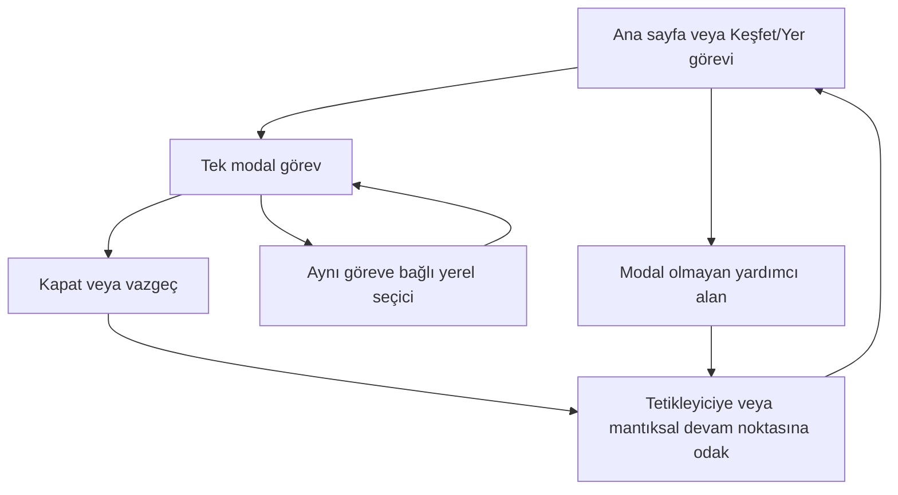
```mermaid
flowchart TD
    P["Ana sayfa veya Keşfet/Yer görevi"] --> N["Modal olmayan yardımcı alan"]
    P --> M["Tek modal görev"]
    M --> L["Aynı göreve bağlı yerel seçici"]
    L --> M
    M --> R["Kapat veya vazgeç"]
    R --> F["Tetikleyiciye veya mantıksal devam noktasına odak"]
    N --> F
    F --> P
```

## 37. Toast — B22

### Amacı

Düşük önem taşıyan ve başka yerde zaten doğrulanabilen kısa işlem bilgisini dikkat dağıtmadan vermek.

### Ne zaman kullanılmalı

“Bağlantı kopyalandı” gibi gerçek yerel sonuçlarda; yalnız gerçekten kopyalanmışsa. Mesaj kaçırıldığında kullanıcı hakkı veya görev durumu kaybolmamalıdır.

### Ne zaman kullanılmamalı

Kritik bilgi düzeltmesi, hata, tek geri alma yolu, dış paylaşım onayı veya kalıcı kayıt durumunun tek göstergesi için. Toast içinde zorunlu eylem bulunmaz.

### Avantajları

Basit geri bildirimi modal açmadan verir. Aynı işi tekrar yapma gereksinimini azaltabilir.

### Riskleri

Kısa sürede kaybolur, odak dışındadır ve başka eylemi örtebilir. “Kopyalandı” ifadesi “gönderildi” sanılabilir.

### UX gerekçesi

Başlangıç görünme süresi yaklaşık 5 saniyedir; bu bir hak süresi değildir. Odak taşınmaz; uygun nazik durum duyurusu kullanılır, bildirim kuyruğu konuşmayı kesmez. Aynı mesajlar birleştirilir. Eylem gerektiren içerik toast'tan çıkarılır ve kalıcı karşılığı sağlanır.

### Alternatifleri

Yerinde durum metni; geri alma eylemi için snackbar; kalıcı önemli bilgi için notification alanı.

## 38. Snackbar — B23

### Amacı

Tamamlanmış, geri alınabilir bir işlemin sonucunu kısa bir ilgili eylemle bildirmek.

### Ne zaman kullanılmalı

Durak kaldırma veya kişisel listeden çıkarma gibi sınırlı işlemler sonrasında. “Geri al” sonucu aynı bağlamda anlaşılırdır.

### Ne zaman kullanılmamalı

Geri alınamayan paylaşımı geri alınabilir göstermek, birden çok karar sunmak veya kritik işlem durumunu yalnız zamanlı mesajda tutmak için.

### Avantajları

Her küçük işlemde onay sormadan kullanıcı kontrolünü korur. Hatanın düşük maliyetle düzeltilmesini sağlar.

### Riskleri

Zamanlı eylem erişilemeyebilir; kuyruk eski bir işlemin geri alınmasına neden olabilir. Geri alma yeni dış gerçekliği tersine çeviremez.

### UX gerekçesi

Başlangıç görünme süresi yaklaşık 10 saniye; odak/işaretçi içindeyken kapanmaz ve erişilebilir zaman tercihi dikkate alınır. Her geri almanın zamanlayıcı dışında kalıcı görev karşılığı vardır. Mesaj kapanınca bu hak kaybolmaz. Geri alma kullanıcı seçimini geri getirir; yeni kapanma bilgisini, geri çekilmiş kanıtı veya kapatılmış paylaşım bağlantısını yeniden etkinleştirmez.

### Alternatifleri

Yerinde işlem geçmişi, açık “Son kaldırmayı geri al” eylemi veya geri dönüşü zor işlem için somut sonuçlu modal.

## 39. Notification — B24

### Amacı

Kullanıcının mevcut kararıyla ilgili anlamlı değişikliği veya açıkça istediği hatırlatmayı erişilebilir ve kalıcı bağlamıyla bildirmek.

### Ne zaman kullanılmalı

Aktif plandaki kritik bilgi değişikliği, kullanıcı tarafından istenen hatırlatma veya işlem için gereken kullanıcı müdahalesinde. Uygulama içi kalıcı bildirim ve izinli sistem bildirimi aynı olayın farklı kanallarıdır.

### Ne zaman kullanılmamalı

Uygulamaya döndürme baskısı, seri tamamlama, popüler yer duyurusu, rastgele AI önerisi veya Premium satışı için. Bildirim yokluğu planın güvenli/güncel olduğu anlamına gelmez.

### Avantajları

Değişen bir koşulu tekrar aramadan fark ettirebilir. Kullanıcının eski olumlu bilgiyle devam etme riskini azaltır.

### Riskleri

Aşırı sıklık duyarsızlaşma; kilit ekranında konum ve özel ihtiyaç ifşası yaratır. Gönderim/teslim garantisi yanlış anlaşılabilir.

### UX gerekçesi

Kullanıcı izin ve kanal seçimini kontrol eder. Kilit ekranı metni özel başlangıç, sağlık notu veya ayrıntılı planı açığa çıkarmaz. Aynı olay yinelenmez; bildirim ilgili değişikliğe götürür. Sistem izni reddedilse de uygulamadaki kritik bilgi ve kalıcı durum görünürdür. Okundu ve düzeltildi farklı durumlardır; bildirimi kapatmak alttaki kritik durumu çözmez.

### Alternatifleri

İlgili kartta kalıcı durum, yeniden açılışta güncellik özeti veya kullanıcı isterse kendi kontrolünde hatırlatma. Canlı takip yeteneği yoksa varmış gibi vaat edilmez.

## 40. Loading — B25 Yüklenme durumu

### Amacı

Gerçek bir işlemin sürdüğünü, hangi işin beklendiğini ve kullanıcının o sırada ne yapabileceğini göstermek.

### Ne zaman kullanılmalı

Arama, yeniden değerlendirme, kayıt veya inceleme işlemi gerçekten sürerken. Bekleme, bütün ekran yerine etkilenen bölüme uygulanır.

### Ne zaman kullanılmamalı

Kısa işi yapay olarak uzatmak, AI çalışıyormuş gösterisi yapmak veya veri eksikliğini sonsuz dönen simgeyle gizlemek için. Ölçülemeyen işlemde yüzde veya uydurma aşama gösterilmez.

### Avantajları

Tekrar gönderimi azaltır ve kesintide bağlamı korur. Kullanıcı başka işe devam edebildiğinde beklemenin toplam maliyeti düşer.

### Riskleri

Sonsuz bekleme, eski olumlu sonuçların güncel sanılması ve ekran okuyucuda sürekli duyuru oluşabilir. İptal düğmesi gönderilmiş işlemi gerçekten geri almıyor olabilir.

### UX gerekçesi

İşlem algılanabilir biçimde hemen karşılık verir. Yaklaşık 300 ms'den uzun işte görsel bekleme göstergesi kullanılabilir; bu süre işlemi başlatmayı veya ilk geri bildirimi geciktirmez. Yaklaşık 10 saniyede açıklama ve devam seçenekleri yeniden değerlendirilir; süre doldu diye başarı ilan edilmez. Uzun işte beklemeyi bırakma yolu baştan vardır. “Beklemeyi durdur” ile gerçekten desteklenen “İşlemi iptal et” ayrılır.

### Alternatifleri

İlk içerik için skeleton; mevcut içerik güncellenirken yerel durum etiketi; bilinmeyen sonuç için B28. Yerel taslak değişimi anlık olabilir, uzak kaydın başarısı teyitten önce söylenmez.

### Diyagram 12 — İşlem State Machine

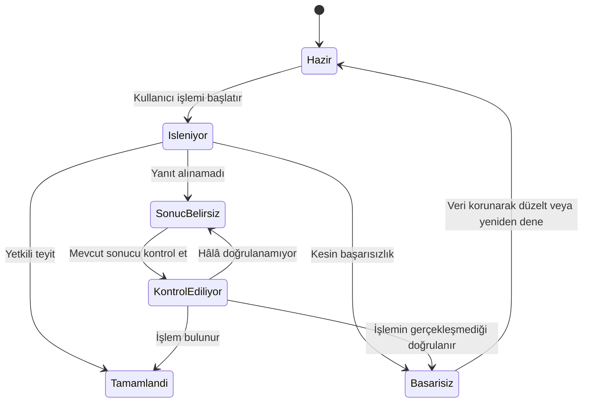
```mermaid
stateDiagram-v2
    [*] --> Hazir
    Hazir --> Isleniyor: Kullanıcı işlemi başlatır
    Isleniyor --> Tamamlandi: Yetkili teyit
    Isleniyor --> Basarisiz: Kesin başarısızlık
    Isleniyor --> SonucBelirsiz: Yanıt alınamadı
    SonucBelirsiz --> KontrolEdiliyor: Mevcut sonucu kontrol et
    KontrolEdiliyor --> Tamamlandi: İşlem bulunur
    KontrolEdiliyor --> Basarisiz: İşlemin gerçekleşmediği doğrulanır
    KontrolEdiliyor --> SonucBelirsiz: Hâlâ doğrulanamıyor
    Basarisiz --> Hazir: Veri korunarak düzelt veya yeniden dene
```

## 41. Skeleton — B26

### Amacı

İlk yüklenmede beklenen içerik yapısına yer ayırmak ve sonradan gelen içeriğin düzeni sıçratmasını azaltmak.

### Ne zaman kullanılmalı

İçeriğin geleceği ve genel yapısı gerçekten biliniyorsa, ilk Yer veya sonuç yüklemesinde. Görünür alandaki gerçekçi yapı kadar iskelet gösterilir; sahte sonuç kotası üretilmez.

### Ne zaman kullanılmamalı

Bilgi hiç bulunmadığında, yetki reddedildiğinde, sonuç boşken veya mevcut geçerli içerik yenilenirken bütün ekranı silmek için. Sahte fotoğraf, puan ve AI metni skeleton değildir.

### Avantajları

Yerleşim sürekliliği sağlar ve beklenen içerik türünü anlatır. Fotoğraf boyutuna önceden yer ayırabilir.

### Riskleri

Sürekli parlama hareket hassasiyetini zorlar; sabit iskelet gerçek metinle uyuşmayabilir. Ekran okuyucuda anlamsız tekrar yaratabilir.

### UX gerekçesi

Varsayılan statik iskelettir; dekoratif parçalar tek tek okunmaz, bölgenin yüklenme durumu bir kez anlatılır. Gerekçe ve önemli sınır birlikte hazır olmadan olumlu parça gösterilmez. Fotoğraf gelmezse alan anlamsız boşluk olarak sonsuza kadar tutulmaz; metnin işlevini koruyan son duruma geçilir.

### Alternatifleri

Basit yerel bekleme metni veya küçük yüklenme göstergesi. İçerik yapısı bilinmiyorsa iskeletle sahte beklenti kurulmaz.

## 42. Empty State — B27

### Amacı

Bir alanda neden içerik bulunmadığını ve varsa anlamlı sonraki seçeneği açıkça anlatmak.

### Ne zaman kullanılmalı

İlk kayıt, boş rota, kaldırılmış son durak veya gerçekten sonuç bulunamayan sorguda. Bu nedenler aynı metinle anlatılmaz.

### Ne zaman kullanılmamalı

Bağlantı hatasını “yer yok”, bilgi yetersizliğini “uygun değil” veya hesabı olmayan kullanıcıyı “hiçbir şey yapamaz” gibi göstermek için.

### Avantajları

Boşluğu ürün kusuru veya kullanıcı hatası gibi hissettirmeden işin durumunu açıklar. Az ama ilgili eylemle devam imkânı sağlar.

### Riskleri

Neşeli illüstrasyon gerçek sorunu örtebilir. Sonuçsuzluk koşulları gevşetme veya Premium'a yöneltme baskısına dönüşebilir.

### UX gerekçesi

Kısa neden, korunan bağlam ve en fazla bir baskın ilgili eylem gösterilir; çıkış serbesttir. “Henüz kaydettiğin yer yok” ile “Bu zorunlu koşulu doğrulayabildiğimiz bir yer bulamadık” farklıdır. Boş rota geçerli taslaktır; otomatik durak eklenmez. Sonuç sıfırsa uygulanmış koşullar görünür kalır.

### Alternatifleri

Bilgi yetersizliğinde B39 iddia sınırı, ağ hatasında B28, gerçekten çevrimdışı durumda B29. Yapılacak iş yoksa yalnız açıklama yeterlidir; her boşluk CTA gerektirmez.

## 43. Error State — B28

### Amacı

Neyin başarısız olduğunu, neyin korunduğunu ve kullanıcının nasıl devam edebileceğini doğru kapsamda anlatmak.

### Ne zaman kullanılmalı

Alan doğrulaması, servis hatası, izin/yetki reddi veya işlemin sonucunun doğrulanamaması durumunda. Kesin başarısızlık ile belirsiz sonuç ayrı varyantlardır.

### Ne zaman kullanılmamalı

Normal bilinmeyen bilgi, uygun aday yokluğu veya kullanıcı vazgeçmesi için. Kullanıcıyı suçlayan dil, hata kodundan ibaret ekran ve otomatik bütün sayfa yenileme kullanılmaz.

### Avantajları

Veri kaybetmeden onarım sağlar. Aynı işlemin tekrarlanmasıyla oluşabilecek çift kayıt ve çift paylaşımı azaltır.

### Riskleri

Genel “Bir hata oluştu” açıklaması etkisini gizler; aşırı teknik ayrıntı özel veri açığa çıkarabilir. Kör yeniden deneme işlemi çoğaltabilir.

### UX gerekçesi

Hata ilgili alan veya görev yanında görünür; uzun formda bağlantılı özet olabilir. Kullanıcı girdisi, doğru alanlar ve yetkili mevcut içerik korunur. “Kaydı doğrulayamadık” durumunda önce mevcut sonuç denetlenir. Oturum süresi bitmişse gerçek hesap erişimi yeniden kimlik doğrulama gerektirir; açık keşif ve izinli yerel taslak gereksiz kapatılmaz.

### Alternatifleri

Yerel alan yardımı, sınırlı bilgi durumu veya çevrimdışı görünüm. Çözüm yoksa dürüst açıklama ve çıkış yeterlidir; işlevsiz tekrar düğmesi bırakılmaz.

## 44. Offline State — B29

### Amacı

Bağlantısızken gerçekten erişilebilir içerik ve yapılabilir işlemlerle bağlantı isteyen işleri ayırmak.

### Ne zaman kullanılmalı

Bağlantı yokluğu yeterince anlaşılmışsa ve yerelde kullanılabilir veri/taslak varsa. Tek isteğin başarısızlığı kendiliğinden çevrimdışı kanıtı değildir.

### Ne zaman kullanılmamalı

Yerelde bulunmayan planın açılacağına, canlı saat/ulaşım verisinin güncel olduğuna veya paylaşım kapatma talebinin karşı tarafa ulaştığına dair güvence vermek için.

### Avantajları

Kişisel emeği ve temel okuma devamlılığını korur. Kullanıcının bağlantı gelene kadar neye güvenemeyeceğini gösterir.

### Riskleri

Eski içerik güncel uygunluk sanılabilir. Bekleyen işlemler yeniden bağlanınca kullanıcı fark etmeden yayımlanabilir; iki cihazın düzenlemesi birbirini silebilir.

### UX gerekçesi

Yerel içeriğin kapsamı ve varsa son alınma zamanı anlaşılırdır; bu zaman bütün iddiaların doğrulanma zamanı değildir. Yerel taslak düzenlenebilir ve gerçek yerel kayıt teyidi verilebilir. Uzak kayıt/katkı bekliyorsa kapsamı, durumu ve iptal yolu görünürdür. Yeniden bağlantıda yetkilendirilmiş kayıt/katkı işlemleri sürdürülebilir; paylaşım yayımlama/güncelleme güncel önizleme ve açık kullanıcı eylemine döner. Bağlantı kapatma isteği teyide kadar “kapatma bekliyor; bağlantı hâlâ açılabilir” anlamını taşır.

### Alternatifleri

Belirsiz ağ durumunda B28; yalnız bir bilginin eski olduğu durumda iddia güncellik açıklaması. Desteklenmeyen çevrimdışı özellik varmış gibi gösterilmez.

**Çatışma:** İki cihazda farklı kişisel düzenleme varsa iki sürüm de korunur; kullanıcı anlamlı farkı görür. Son yazanın sessizce kazanması tasarım sözleşmesi değildir. Yeni kapanma veya geri çekme bilgisi çevrimiçi geldiğinde eski olumlu iddia beklemeden sınırlandırılır; kullanıcı rota sırası yine kendi kontrolündedir.

### Diyagram 13 — Offline ve yeniden bağlanma

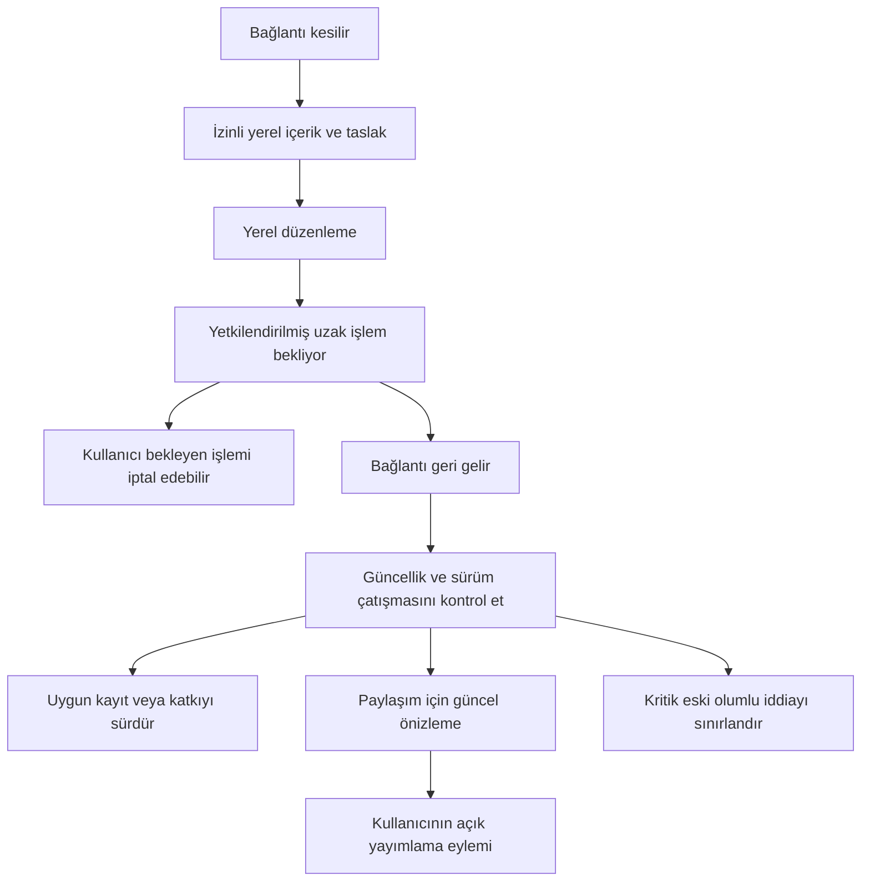
```mermaid
flowchart TD
    A["Bağlantı kesilir"] --> L["İzinli yerel içerik ve taslak"]
    L --> D["Yerel düzenleme"]
    D --> Q["Yetkilendirilmiş uzak işlem bekliyor"]
    Q --> I["Kullanıcı bekleyen işlemi iptal edebilir"]
    Q --> R["Bağlantı geri gelir"]
    R --> C["Güncellik ve sürüm çatışmasını kontrol et"]
    C --> K["Uygun kayıt veya katkıyı sürdür"]
    C --> P["Paylaşım için güncel önizleme"]
    P --> U["Kullanıcının açık yayımlama eylemi"]
    C --> X["Kritik eski olumlu iddiayı sınırlandır"]
```

## 45. Success State — B30

### Amacı

Gerçekten tamamlanan işlemi, hedefini ve kullanıcının bundan sonra yapabileceğini doğrulamak.

### Ne zaman kullanılmalı

Yerel kayıt, teyit edilmiş uzak kayıt, alınmış katkı, hazırlanmış bağlantı veya kapatıldığı teyit edilmiş paylaşım sonucunda. Her işlem kendi adını kullanır.

### Ne zaman kullanılmamalı

Bekleyen işlem, kopyalanmış metnin gönderimi, alınan gözlemin doğrulanması veya kaydedilmiş yerin ziyaret edildiği varsayımında. Başarı tüm günü tamamlama kutlamasına dönüşmez.

### Avantajları

Tekrar işlem ihtiyacını azaltır. Kayıt, ziyaret, katkı ve paylaşım arasındaki farkı kullanıcıya açık tutar.

### Riskleri

Genel onay işareti sonucun kapsamını gizler. Konfeti, puan ve seri rozetleri tamamlama baskısı yaratır.

### UX gerekçesi

“Bu cihazda kaydedildi”, “Hesabına kaydedildi”, “Gözlemin alındı” ve “Bağlantı hazır” aynı mesaj değildir. Sonuç, kalıcı ilgili kayıtta görülebilir. Önemli hak veya sınır geçici animasyona bırakılmaz. Başarının yanında otomatik Premium önerisi veya yeni katkı görevi açılmaz.

### Alternatifleri

Çok küçük yerel sonuçta toast; geri alınabilir işlemde snackbar; arka planda kayıt devam ediyorsa yüklenme/bekleme durumu. Kullanıcıyı çıkıştan alıkoyan başarı ekranı zorunlu değildir.

## 46. Mikro etkileşim kuralları

Mikro etkileşim bir soruyu cevaplar: **“Eylemim algılandı mı, ne değişti, bunu geri alabilir miyim?”** Basma karşılığı, görünür seçili durum, odak, alan doğrulaması ve kayıt teyidi bu kapsamda yer alır. Görsel karşılık, uzak işlemin tamamlanmasından ayrıdır.

| Tetikleyici | İzinli karşılık | Sınır |
| --- | --- | --- |
| Butona basma | Anında basılı/işleniyor durumu | Teyit gelmeden “tamamlandı” yok |
| Chip seçme | İşaret, metin ve görünür seçim | Seçim uygunluk hükmüne dönüşmez |
| Durak taşıma | Yeni konum ve kısa durum duyurusu | Eski toplam güncel gibi kalmaz |
| Kaydetme | Gerçek hedefe göre kayıt durumu | Kaydetme ziyaret veya beğeni sayılmaz |
| Hata düzeltme | İlgili hatanın kalkması | Tüm form gereksiz yeniden kurulmaz |
| Katman kapatma | Mantıksal odak dönüşü | Sayfa başına beklenmedik atlama yok |

Dokunsal geri bildirim platform ve kullanıcı tercihine bağlı isteğe bağlı yardımcıdır; tek başarı veya hata kanalı değildir. Ses varsayılan değildir. Hover davranışı dokunma veya klavye için zorunlu bilgi yaratmaz. Hareket olmadan da seçili ve basılı durum ayırt edilebilir olmalıdır. Aynı eylemin art arda basılmasında çifte uzak işlem başlatılmaması bütün eylem ailesinin sözleşmesidir.

## 47. Animasyon kuralları

Hareketin amacı konum, neden–sonuç veya katman ilişkisini açıklamaktır. Başlangıç süre rolleri **anlık 0 ms**, **kısa 120 ms**, **geçiş 180 ms**, **katman 240 ms** olarak belirlenir. Bunlar zorunlu bekleme değildir. İçerik ve eylem hazırsa animasyonun bitmesi için kullanıcı bekletilmez.

| Rol | Kullanım | Davranış |
| --- | --- | --- |
| Anlık | Azaltılmış hareket, kritik bilgi düzeltmesi | Durum doğrudan güncellenir |
| Kısa | Küçük durum değişimi | Düşük genlikli veya yalnız görünürlük değişimi |
| Geçiş | Aynı görev içi düzen değişimi | Mesafe küçük, yön açıklayıcı |
| Katman | Sheet/drawer açılışı | Kontrollü yavaşlama; zıplama ve geri sekme yok |

Marka adına yaylanma, parallax, dönen kart, manyetik kontrol, sürekli yüzen öğe ve otomatik harita uçuşu varsayılan sistemde yoktur. Hareket eğrisi platformda tutarlı, girişte kontrollü yavaşlayan, çıkışta kısa ve nötr davranır; bu belgede teknik eğri kodu tanımlanmaz. Kullanıcının doğrudan sürüklediği öğe işaretçiyi gecikmesiz takip eder; serbest bırakma hareketi içeriğin yerini açıklamakla sınırlıdır.

Azaltılmış hareket tercihi ilk anda uygulanır. Büyük mesafeli kayma, yakınlaştırma ve dekoratif döngü kaldırılır; işlevsel durum statik metin/işaretle sürer. Tercih görev ortasında değişirse seçim ve odak korunur. Kritik iddia düzeltmesi yumuşak geçiş uğruna geciktirilmez.

### Diyagram 14 — Motion Flow

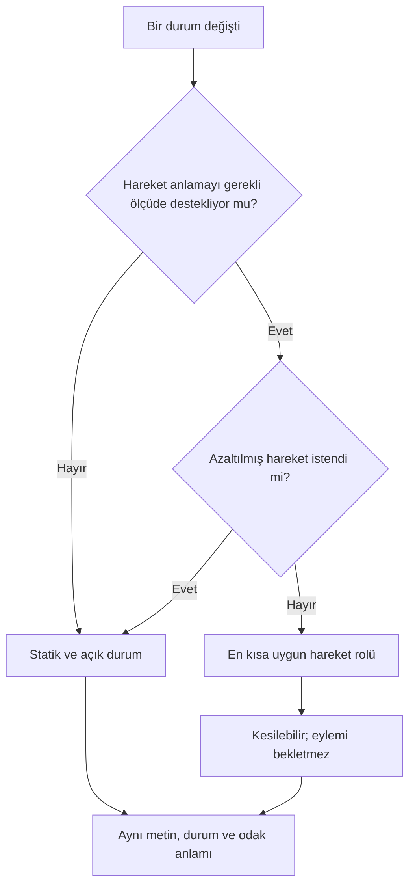
```mermaid
flowchart TD
    E["Bir durum değişti"] --> M{"Hareket anlamayı gerekli ölçüde destekliyor mu?"}
    M -->|"Hayır"| S["Statik ve açık durum"]
    M -->|"Evet"| R{"Azaltılmış hareket istendi mi?"}
    R -->|"Evet"| S
    R -->|"Hayır"| T["En kısa uygun hareket rolü"]
    T --> C["Kesilebilir; eylemi bekletmez"]
    S --> A["Aynı metin, durum ve odak anlamı"]
    C --> A
```

## 48. Gesture kuralları

Gesture, görünür eylemlerin kolaylaştırıcısıdır. Temel bir görev yalnız kaydırma, sürükleme, uzun basma, çok parmak veya cihaz hareketiyle tamamlanamaz. Silme için kaydırmanın görünür satır eylemi; rota sırası için sürüklemenin klavye ve taşıma kontrolü; harita pinch hareketinin yakınlaştırma düğmeleri vardır.

İşlem mümkün olduğunca basışın tamamlanmasıyla kesinleşir; kullanıcı hedef dışına çıkarak vazgeçebilir. Uzun basma tek bağlam menüsü yolu olmaz. İşletim sistemi kenar geri hareketiyle yarışılmaz. Kartlar ve filtreler yatay gizli eylem tünellerine dönüştürülmez. Harita içindeki pan ile sayfa kaydırması ayırt edilebilir; harita sayfayı ele geçirip kullanıcıyı hapsedemez.

Çoklu giriş desteklenir: dokunmatik dizüstü bilgisayarda fare bulunduğu için dokunma hedefi küçültülmez; klavye bağlı tablette masaüstü yetkisi varsayılmaz. Hareketle başlayan işlemde odak öğeyle ilişkisini korur. Motor kısıt nedeniyle değişikliği değerlendiremiyorsa kullanıcının seçimi taslakta korunur ve gerekçe açıkça gösterilir.

## 49. Scroll davranışları

Ana görevde tek baskın dikey okuma akışı tercih edilir. Sabit başlık veya eylem çubuğu ancak gerçekten yön bulmaya yardım ediyorsa kullanılır; içerik için alan bırakır ve odaklı öğeyi örtmez. Kısa yatay ekran veya büyük metinde sabitlik bırakılabilir.

- Geri dönüş, mümkün olduğunda aynı sorgu ve öğe konumuna getirir; seçili yer kaybolduysa mantıksal yakın konum ve kısa açıklama sağlanır.
- Sonuç güncellemesi kendiliğinden sayfanın başına sıçratmaz. Kullanıcının gönderdiği yeni sorguda sonuç başlığına geçiş gerekiyorsa açık, tutarlı ve erişilebilir davranır.
- Yeni içerik, işaretçinin altına farklı eylem yerleştirmez. Fotoğraf ve geç yüklenen bölümler için yer ayrılır; geçerliliği bitmiş olumlu bilgi sırf düzen sabit kalsın diye tutulmaz.
- Rota yeniden sıralamada odak taşınan durakta kalır; silmede sonraki/önceki durak veya “Durak ekle” eylemine gider.
- Anchor ile gidilen başlık yapışkan çubuk altında kalmaz. Odağı görünür kılan otomatik kaydırma en az gerekli mesafeyi kullanır.
- Sonsuz sonuç akışı varsayılan değildir. Uzun kişisel kayıt ve admin kuyruğu kontrollü sayfalama/yükleme kullanır; footer ve çıkış erişilebilir kalır.

Scroll konumu özel bir paylaşım kapsamı değildir; bir bağlantının alıcıyı otomatik kişisel notun ortasına götürmesi kabul edilmez. Hareket tercihi otomatik yumuşak kaydırmayı da kapsar.

## 50. Harita üzerindeki UI — B31

### Amacı

Yerlerin ve durakların coğrafi ilişkisini, kullanıcı listeden de anlayabileceği karar bağlamına ek olarak göstermek.

### Ne zaman kullanılmalı

Kullanıcı konum ilişkisini görmek istediğinde, rota duraklarını mekânsal olarak kıyaslarken veya açık coğrafi kapsam seçerken. Harita aynı sonuçların yardımcı görünümüdür.

### Ne zaman kullanılmamalı

Keşfe girişi harita kullanmaya bağlamak, konum iznini zorunlu kılmak veya çizgiyi yürünebilirlik/erişilebilirlik kanıtı yapmak için. Yoğun pin sayısı kalite ya da popülerlik değildir.

### Avantajları

Yakınlık, yön ve durak sırası anlaşılır hale gelebilir. Liste ile birlikte somut coğrafi hata fark edilebilir.

### Riskleri

Pinler üst üste binebilir; renkler karşılaştırmayı bozabilir; harita hareketi baş dönmesi ve sayfa kilidi yaratabilir. Üçüncü taraf atıfları kontroller altında kalabilir.

### UX gerekçesi

Seçili pin şekil/sınır/etiketle ayrılır, yalnız renkle değil. Rota numarası kalite sırası değildir. Küme açıldığında aynı öğelere listeden erişilir; her pinin adı ve ilgili eylemi eşdeğer listeyle kullanılabilir. Pan sonuçları kendiliğinden değiştirmez; kullanıcı “Bu alanda ara” ile kapsamı uygular. Konum izni yalnız ilgili eylemde istenir; elle başlangıç ve konum seçimi sürer.

### Alternatifleri

Mesafe/ulaşım bağlamı içeren liste, metinli durak sırası ve dış yol tarifi bağlantısı. Harita yüklenmezse bunlar çekirdek görevi sürdürür.

**Kontrol ailesi:** Yakınlaştır, uzaklaştır, konumuma git ve listeye dön eylemleri B11'in harita varyantıdır; yeni kontrol davranışı değildir. Zemin opak ve kontrastlıdır; atıf, ölçek ve önemli yol bilgisi örtülmez. Seçilmiş yeri görünür alana alma en az gerekli hareketle yapılır; azaltılmış harekette animasyonsuzdur. Konumun kesinliği daireyle gösteriliyorsa metin karşılığı bulunur; yaklaşık nokta kesin adres gibi sunulmaz.

### Diyagram 15 — Harita ve liste eşdeğerliği

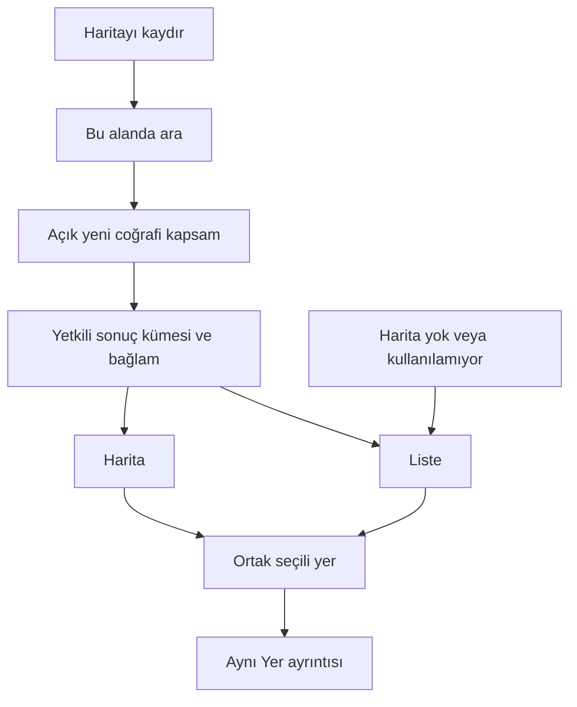
```mermaid
flowchart TD
    R["Yetkili sonuç kümesi ve bağlam"] --> L["Liste"]
    R --> M["Harita"]
    L --> S["Ortak seçili yer"]
    M --> S
    S --> D["Aynı Yer ayrıntısı"]
    P["Haritayı kaydır"] --> B["Bu alanda ara"]
    B --> N["Açık yeni coğrafi kapsam"]
    N --> R
    X["Harita yok veya kullanılamıyor"] --> L
```

## 51. Fotoğraf kullanımı — B32

### Amacı

Gerçek yerin ayırt edici fiziksel görünümünü ve karar için ilgili mekânsal ayrıntıyı göstermek.

### Ne zaman kullanılmalı

Doğru yere/şubeye ait, kullanım hakkı uygun, bağlamı bilinen ve anlamlı görüntü varsa. Giriş, oturma alanı veya fiziksel koşul gibi gerçek karar bilgisi taşıyan fotoğraf tercih edilir.

### Ne zaman kullanılmamalı

Başka yeri aynı yer gibi göstermek, stok fotoğrafı gerçek mekân kanıtı yapmak, kalabalığı/engeli silmek veya ticari anlaşmayla daha çekici fotoğrafı öne geçirmek için.

### Avantajları

Yer kimliğini ve somut fiziksel ayrıntıyı metne ek olarak anlatır. Kullanıcı farklı şubeyi veya ortam türünü fark edebilir.

### Riskleri

Tek an bütün günün atmosferi sanılabilir. Geniş açı, kırpma ve eski çekim erişim koşullarını çarpıtabilir. Tanınabilir kişilerin mahremiyeti ve kaynak hakkı ihlal edilebilir.

### UX gerekçesi

Kartta başlangıç oranı 4:3, ayrıntıda görüntünün anlamını koruyan doğal oran tercihidir. Kırpma giriş basamağı gibi önemli ayrıntıyı kesemez; gerekirse oran değişir. Fotoğraf üzerine kritik metin bindirilmez. Alternatif metin görünen karar bilgisini anlatır, yorum/AI çıkarımı eklemez. Aynı adla tamamen tekrarlanan dekoratif görsel gereksiz okunmaz; anlamlı fotoğraf boş alternatifle gizlenmez.

### Alternatifleri

Fotoğrafsız metin kartı, doğru türü belirten nötr yer tutucu veya izinli basit konum bilgisi. Eksik fotoğraf için sahte gerçek görüntü üretmek seçenek değildir.

**Yaşam döngüsü:** Yer, kaynak, hak, çekim zamanı biliniyorsa zaman ve gösterilen alan ilişkisi izlenir. Çekim tarihi bilinmiyorsa uydurulmaz. Hak geri çekildiğinde ilgili kart, önizleme ve yeniden açılan paylaşım türevleri kapsamına göre güncellenir. Fotoğrafın kanıt sayılması ayrı bilgi değerlendirmesidir; rampa görüntüsü bütün erişim zincirini doğrulamaz. Otomatik carousel ve video oynatma yoktur; galeri açılırsa kapatma, önceki/sonraki ve klavye yolları bulunur.

## 52. AI tarafından üretilen görsellerin kullanım ilkeleri

**Gerçek bir yerin, girişinin, yemeğinin, kalabalığının, manzarasının veya rota koşulunun yerine AI görüntüsü kullanılamaz.** “Temsilidir” etiketi gerçeklik izleniminin doğurduğu yanlışı ortadan kaldırmış sayılmaz. Var olmayan fotoğrafı tamamlamak, yağmur/kalabalık/engel silmek, erişim koşulunu iyileştirmek veya yerin görünümünü yeniden kurmak bu kapsama girer.

İzinli dar alan, ürünün nasıl çalıştığını anlatan açıkça soyut ve mekân kanıtı taşımayan öğretici illüstrasyondur. Bunun da kullanıcı işine katkısı, hakları, kültürel temsili, alternatif anlatımı ve dosya maliyeti değerlendirilir. AI kullanımı gerekli mi sorusunun cevabı yoksa sade metin tercih edilir. Üretim yöntemi karar açısından anlamlıysa açıkça belirtilir; belirsiz yıldız simgesiyle “AI kalitesi” satılmaz.

AI ile görüntü düzenlemede anlamı değiştiren içerik ekleme/çıkarma yasaktır. İzinli teknik boyutlandırma ve mahremiyet için maskeleme görüntünün kanıt kapsamını etkiliyorsa bu sınırlama korunur. Otomatik alternatif metin önerisi insan incelemesi olmadan görselden erişilebilirlik veya güvenlik çıkarımı yapamaz. Üretken görsel, fotoğraf hakları ve gerçek veri bakım maliyetinden kaçış yolu değildir.

## 53. İkon sistemi — B33

### Amacı

Tanıdık eylem veya somut bilgiye kısa görsel destek vermek; metin ve durumun anlaşılmasını hızlandırmak.

### Ne zaman kullanılmalı

Arama, kaydetme, kapatma, yön, sıra ve açık fiziksel özellik gibi anlamlarda. Başlangıç çizim kutuları 16, 20 ve 24 tb; etkileşim hedefi bunlardan bağımsız olarak §55'e uyar.

### Ne zaman kullanılmamalı

Her cümleyi süslemek, belirsiz kavramı tek başına açıklamak veya kalp/yıldızla beğeni ve puan kültürü oluşturmak için. Tekerlekli sandalye simgesi kapsamı doğrulanmamış genel erişim garantisi olamaz.

### Avantajları

Tekrarlanan eylemleri ayırt ettirir ve dar alanda yardımcı olur. Tutarlı çizgi ailesi görsel gürültüyü azaltır.

### Riskleri

Kültüre göre anlam değişebilir; küçük çizgi koyu zeminde kaybolabilir. Doluluk seçili, ziyaret edilmiş ve başarı anlamlarını karıştırabilir.

### UX gerekçesi

Tek çizim ailesi, tutarlı optik ağırlık ve köşe yaklaşımı kullanılır. Varsayılan çizgi ikon; dolu varyant yalnız tanımlı seçili durumda. Dekoratif ikon ayrı okunmaz; tek başına kontrolse eylem ve bağlamı açıklayan erişilebilir adı vardır. Kritik veya az tanınan eylemde görünür metin korunur. Lisansı doğrulanmış kütüphane ileride seçilebilir; bu belge ikon dosyası veya yeni logo çizmez.

### Alternatifleri

Açık fiilli metin, kısa bilgi satırı veya düz başlık. Sağdan sola dilde geri/ileri yön ikonları uyarlanır; coğrafi yön, marka, fotoğraf ve anlamı yönsel olmayan simgeler topluca aynalanmaz.

## 54. İllüstrasyon kullanılmalı mı? — B34

### Amacı

Yalnız metinle zor anlaşılan bir ürün ilişkisini sade ve erişilebilir biçimde açıklamak.

### Ne zaman kullanılmalı

Özel taslak–paylaşılan seçim–bağımsız kopya ayrımı gibi soyut ilişkilerde, kullanıcı anlama sınaması fayda gösteriyorsa. Kullanımı seyrek ve göreve bağlıdır.

### Ne zaman kullanılmamalı

Her empty/error ekranını doldurmak, gerçek yer görüntüsü yerine geçmek, zorunlu koşul ihlalini neşeli hale getirmek veya maskotla katkı/abonelik baskısı kurmak için.

### Avantajları

Soyut bir ilişkiyi tek bakışta anlaşılır hale getirebilir. Yöntem anlatısında zihinsel modeli destekleyebilir.

### Riskleri

Süsleme metni aşağı iter; kültürel kalıp, gereksiz veri yükü ve belirsiz sembol üretir. Görselle anlaşılabilen fakat metin karşılığı olmayan kritik anlam yaratabilir.

### UX gerekçesi

İllüstrasyonun açıklaması ve metinsel eşdeğeri bulunur. Hareket gerekli değildir; statik sunum temel kabul edilir. Kişi/bölge temsili stereotipe dayanmaz. Soyut çizim hiçbir yere ait doğrulanmış fiziksel koşul sanılmamalıdır.

### Alternatifleri

Kısa metin, adlandırılmış süreç adımları veya sade ilişki diyagramı. Fayda kanıtı yoksa kullanılmaması sistemin geçerli varsayılanıdır.

## 55. Accessibility

Erişilebilirlik temel kullanım hakkıdır; tema, platform, hesap veya Premium'a göre azalmaz. Bileşen tek başına erişilebilir görünse de görev bütünü tamamlanamıyorsa kabul edilmez. Dijital erişilebilirlik ile bir yerin fiziksel erişilebilirliğine ilişkin kanıt ayrı konulardır.

**Etkileşim hedefi kararı:** Dokunma ve karma giriş için varsayılan en az 48 × 48 mantıksal birim; küçük kontrolün ürün alt sınırı 44 × 44'tür. Bunlar Şamandıra'nın tasarım hedefleridir, WCAG AA'nın sayısal minimumu diye sunulmaz. Satır içi bağlantı gibi akış istisnaları §56 standardıyla ayrıca değerlendirilir. Hedefler çakışmaz; görsel ikon küçüklüğü hedefi küçültme gerekçesi değildir.

**Odak kararı:** Odak halkası normal görünümde başlangıçta en az 2 tb kalınlık ve 2 tb ayrım kullanır; komşu zeminlerden ayırt edilecek şekilde doğrulanır. Fotoğraf/harita gibi değişken zeminde çift sınır veya opak kontrol zemini gerekir. Halkayı kontrolün kenarında kırpmak yasaktır. Şamandıra, odaklı kontrolün tümünü görünür tutmayı hedefler; AA'nın yalnız tamamen örtülmeme tabanıyla yetinmez.

**Giriş ve okuma:** Klavye, dokunma, ekran okuyucu, anahtar denetimi ve sesle kontrol temel görevleri tamamlayabilir. Görünür etiket erişilebilir adın içinde bulunur. Odak sırası görsel görev sırasıyla tutarlıdır; geç gelen yanıt odağı çalmaz. Başlık, grup, liste ve tablo ilişkileri sunum biçiminden bağımsız korunur. Hatalar renk dışında metinle ifade edilir.

**Duyuru:** Rutin sonuç nazik durum duyurusu; hemen karar değiştiren kritik hata gerektiğinde dikkat isteyen duyurudur. Her karakter, her pin ve her yüklenme karesi okunmaz. Duyuru metni ham yorum, özel not veya iç skor sızdırmaz. Birden çok güncelleme ilgili tek olayda birleştirilir; kalıcı görünür bilgi kaybolmaz.

**Büyütme ve bilişsel erişim:** Kullanıcı metni ve aralığı büyütebilir. Önemli bilgi kısaltılarak veya tooltip'e taşınarak “sığdırılmaz”. Önce kolon sayısı ve sabit alanlar değişir. Tek görevde tek açık ana karar, somut fiiller, geri alma ve tutarlı yardım konumu korunur. Kimlik doğrulamada parola yöneticisi ve yapıştırma engellenmez; gereksiz hafıza bulmacası oluşturulmaz.

### Diyagram 16 — Accessibility Layers

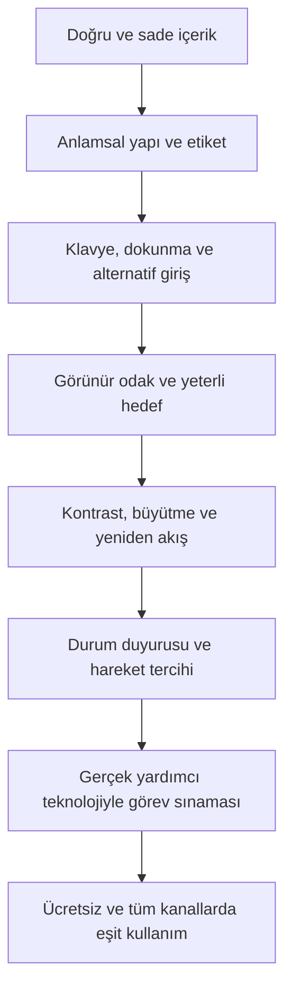
```mermaid
flowchart TD
    A["Doğru ve sade içerik"] --> B["Anlamsal yapı ve etiket"]
    B --> C["Klavye, dokunma ve alternatif giriş"]
    C --> D["Görünür odak ve yeterli hedef"]
    D --> E["Kontrast, büyütme ve yeniden akış"]
    E --> F["Durum duyurusu ve hareket tercihi"]
    F --> G["Gerçek yardımcı teknolojiyle görev sınaması"]
    G --> H["Ücretsiz ve tüm kanallarda eşit kullanım"]
```

## 56. WCAG yaklaşımı

Web için hedef **WCAG 2.2 AA**'dır. Bu yalnız seçilmiş maddeler değil, kapsam içindeki bütün sayfa ve tamamlanmış süreçlerde uygulanabilir A ve AA ölçütlerinin karşılanması demektir. Yerel uygulamada aynı kullanıcı sonuçları platformun erişilebilirlik özellikleriyle doğrulanır; web uygunluk iddiası yerel uygulamaya otomatik aktarılmaz. Otomatik tarama tek başına uygunluk kanıtı değildir. [WCAG 2.2](https://www.w3.org/TR/WCAG22/).

| Alan | Standart dayanağı | Şamandıra kabul yaklaşımı |
| --- | --- | --- |
| Metin kontrastı | 1.4.3: normal metin 4,5:1; büyük metin 3:1 | Caption dahil normal metin 4,5:1; büyük başlıkta da mümkünse daha yüksek |
| Kontrol ve durum görselleri | 1.4.11: gerekli metin dışı görsel ayrım 3:1 | Kontrol sınırı, seçili işaret ve anlamlı ikon kontrol edilir |
| Renkten bağımsız anlam | 1.4.1 | Engel, seçim ve başarı metin/şekille de anlaşılır |
| Metin büyütme / yeniden akış | 1.4.4 ve 1.4.10 | %200 metin; dikey içerikte 320 CSS pikseline eşdeğer alan; bilgi kaybı yok |
| Metin aralığı | 1.4.12 | Kullanıcı aralık değişiklikleri kesilme/örtüşme yaratmaz |
| Klavye ve odak | 2.1.1, 2.1.2, 2.4.3, 2.4.7 | Klavye tuzağı yok; mantıksal ve görünür odak |
| Odak örtülmesi | 2.4.11 AA | Tamamen örtülmeme tabanına ek, ürün hedefi tüm kontrolün görünmesi |
| Sürükleme alternatifi | 2.5.7 | Rota taşımanın tek işaretçili alternatif eylemi var |
| Minimum hedef | 2.5.8 AA: 24 × 24 CSS pikseli veya tanımlı istisnalar | Ürün varsayılanı daha büyük; 48, küçük kontrolde 44 mantıksal birim |
| Hata ve onarım | 3.3.1–3.3.4 | Alan ilişkisi, öneri ve uygun işlemlerde önleme/geri dönüş |
| Yinelenen bilgi / doğrulama | 3.3.7, 3.3.8 | Aynı süreçte gereksiz tekrar giriş yok; erişilebilir hesap doğrulaması |
| Durum mesajları | 4.1.3 | Sonuç odağı zorla taşımadan algılanabilir |

Büyük metin tanımı 18 punto veya 14 punto kalın ve eşdeğer ölçülerdir; bir tokena “başlık” demek bu eşiği sağlamaz. Kontrast, gerçek ön/arka plan birleşiminde ölçülür; saydamlık ve fotoğraf dikkate alınır. Devre dışı kontrolün standart istisnası, kullanıcıya gerekli açıklamayı okunamaz yapma izni değildir. [W3C metin kontrastı açıklaması](https://www.w3.org/WAI/WCAG22/Understanding/contrast-minimum.html).

24 piksel hedef ölçütündeki aralık, eşdeğer kontrol, satır içi kullanım, kullanıcı aracısı ve esas gereklilik istisnaları bilinçli değerlendirilir; bütün küçük kontrolleri istisna ilan etmek kabul edilmez. Harita geometrisi veya veri tablosu iki boyutlu düzen gerektirebilir; çevresindeki arama, açıklama ve eylemler yeniden akış yükümlülüğünü korur. Haritanın alternatif listesi ayrıca zorunludur. [Hedef boyutu](https://www.w3.org/WAI/WCAG22/Understanding/target-size-minimum.html), [yeniden akış](https://www.w3.org/WAI/WCAG22/Understanding/reflow.html).

AA'daki 2.4.11 ile AAA'daki 2.4.12 ve 2.4.13 birbirine karıştırılmaz. Bu belgenin daha görünür odak tercihi bütün ürün için AAA uygunluğu iddiası değildir. [Odak örtülmesi açıklaması](https://www.w3.org/WAI/WCAG22/Understanding/focus-not-obscured-minimum.html).

**Doğrulama kapsamı:** Açık/koyu tema; klavyeyle arama ve filtre; ekran okuyucuyla Yer kararı ve rota taşıma; %200 metin ve %400 yakınlaştırmada uygun yeniden akış; azaltılmış hareket; yüksek kontrast; hata, boş, çevrimdışı ve uzun içerik; misafir/Premium eşitliği. NVDA, VoiceOver ve TalkBack gibi gerçek yardımcı teknolojiler ilgili desteklenen platformda sınanır. Bulgu, kapsam ve tarih kaydedilmeden “erişilebilir” tamamlanma etiketi verilmez. Bunlar bu görevde yapılmış uygulama testleri değildir.

## 57. Performans ilkeleri

Performans, doğru karar içeriğinin erişilebilir zamanda gelmesi ve kişinin işlemi sırasında kontrolü kaybetmemesidir. Boş hızlı ekran, erken fakat eksik olumlu cümle veya yanlış önbellek kullanımı başarı değildir. Harita, fotoğraf, font ve AI yanıtı temel metin kararını gereksiz bekletmez.

| Başlangıç ürün hedefi | Doğrulama koşulu | Başarısız olursa |
| --- | --- | --- |
| Yerel girişe yaklaşık 100 ms içinde algılanabilir karşılık | Temsilî düşük/orta cihaz; arama ve düzenleme | İş ve görsel yük azaltılır |
| Temel metin görevinin yaklaşık 2,5 saniyede kullanılabilir olması | İlan edilmiş cihaz/ağ profili ve yeterli örnek; tercihen 75. yüzdelik izlenir | Harita/medya ertelenir; yanlış içerikle hız kazanılmaz |
| Yüklenirken hedef yerinin sıçramaması | Fotoğraf, font ve sonuç geliş sırası | Alan ayırma ve içerik teslimi düzeltilir |
| Liste etkileşiminin medya arızasında sürmesi | Harita/fotoğraf/AI bağımsız hata senaryosu | Bağımlılık daraltılır |
| Beklemenin belirsizliğe dönüşmemesi | Uzun süren ve sonucu kaybolan işlem | Durum ve onarım yolu gösterilir |

Bu süreler Şamandıra'nın başlangıç araştırma bütçeleridir; ölçülmüş sonuç veya tüm ağlarda garanti değildir. Teknik ölçüm adları ve üretim hedefleri sonraki kanal belgesinde ayrıntılandırılır. Tasarım sistemi kabulü yalnız tek laboratuvar puanına bağlanmaz; bekleme, yanlış seçim ve geri dönüş maliyeti birlikte değerlendirilir.

Görüntüler görüntülenecek boyuta göre sunulur, oranı önceden ayrılır ve görünür olmayan medya gerektiğinde yüklenir. Özel font başlangıçta zorunlu olmadığı için metin onun indirilmesine bağlı değildir. Harita ve hareketli bulanıklık maliyeti sınırlandırılır. Uzun listede performans için öğe azaltılması gerekiyorsa odaklı öğe, sıra ve yardımcı teknoloji anlamı korunur; bu koşul sağlanmıyorsa sayfalama seçilir.

Önbellek, iddia geçerliliği sözleşmesine bağlıdır. Kritik düzeltme geldiğinde hızlı görünmek için eski olumlu sonuç gösterilmez. Kullanım ölçümü asgari ve görev odaklıdır; hassas ihtiyaç cümleleri veya özel rota başlangıçları sırf performans analizi için kaydedilmez. Premium kullanıcının daha doğru/güncel veriye önce erişmesi bir performans stratejisi olamaz.

## 58. Internationalization

Internationalization, yeni dil eklendiğinde anlamın ve etkileşimin bozulmaması için sistemin hazır olmasıdır. Bu görev yeni dil lansmanı yapmaz. Metin, sayı, tarih, yön ve erişilebilir adlar bileşen sözleşmesinin parçasıdır; ekrandaki cümleler parçalı kelime birleştirmeye dayanmaz.

- Uzun çeviri, çoğul biçimleri ve dilbilgisel sıralama desteklenir. Başlangıç sınamasında en az %40 metin genişlemesi ve ayrıca çok uzun yer adları denenir; bu evrensel üst sınır değildir.
- Sağdan sola dilde mantıksal başlangıç/bitiş hizası kullanılır. Geri/ileri hareketi uyarlanır; harita coğrafyası, rota numaraları ve fotoğraf topluca aynalanmaz. Karışık yönlü adres, telefon ve bağlantı okunabilir kalır.
- Metin büyütme ve çeviri birlikte sınanır. Kontrol genişliği yetmezse etiket sarılır; kritik metin üç noktayla yok edilmez.
- Rakam, para, birim, çoğul ve tarih yerel kurallarla gösterilir. Yerel rakam sunumu kanıtın sayısal değerini değiştirmez.
- Takvim dili, kullanıcının saat dilimi ve yerin yerel saat dilimi ayrı sorumluluklardır. Gece yarısını geçen günlük plan iki tarihli saatleri açıkça gösterir; sessizce çok günlük ürün haline gelmez.
- Kaynak adı ve yerin gerçek kimliği çeviride yeniden icat edilmez. Çeviri bulunmuyorsa dürüst dil yedeği vardır; kritik sınır olumlu cümlenin gerisinde kaybolmaz.

### Diyagram 17 — Dil ve anlamın korunması

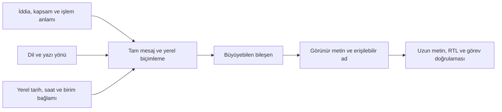
```mermaid
flowchart LR
    I["İddia, kapsam ve işlem anlamı"] --> M["Tam mesaj ve yerel biçimleme"]
    L["Dil ve yazı yönü"] --> M
    Z["Yerel tarih, saat ve birim bağlamı"] --> M
    M --> B["Büyüyebilen bileşen"]
    B --> A["Görünür metin ve erişilebilir ad"]
    A --> T["Uzun metin, RTL ve görev doğrulaması"]
```

## 59. Localization

Localization, hazır yapının belirli kültür ve kullanım bağlamında doğru anlaşılmasıdır. İlk kullanıcı dili doğru Türkçedir. Kullanıcı metninde Şamandıra, Akıllı Rota, Gezeceğim Yerler, Gezdiğim Yerler, Kaydettiklerin ve Bir İz adları ortak dil belgeleriyle tutarlıdır. Teknik ASCII adlandırma bu metinlere taşınmaz.

| Konu | Yerelleştirme kararı |
| --- | --- |
| Yer adı ve adres | Resmî/yerel kimlik korunur; şube, ilçe ve şehir ayrımı kaybolmaz |
| Türkçe arama | İ/ı ve i/İ farklılıkları, aksanlı yazım ve yaygın yazım biçimleri kullanıcıyı cezalandırmaz; kimlik birleştirmeyi UI yapmaz |
| Para | TL/₺ veya başka para birimi bağlamıyla; kişi başı/toplam ve tahmin/olgu ayrımı |
| Saat | Ziyaret yerinin yerel saati esaslı plan; farklı saat dilimi varsa açık açıklama |
| Tarih | Göreli “bugün” yalnız gerçekten biliniyorsa; belirsiz ziyaret tarihi bugüne yazılmaz |
| Birimler | Yürüme mesafesi, süre ve fiyat kapsamı korunur; yuvarlama zorunlu sınırı aşmayı saklamaz |
| Erişim ve kültür | Simgeler, dinlenme/oturma varsayımları ve aile anlatımı yerel araştırmayla sınanır |
| Çeviri | Kritik koşul, mahremiyet ve paylaşım dilinde insan incelemesi; AI'nin akıcı çevirisi doğruluk kanıtı değildir |

Dil seçimi uygulamadaki görev durumunu sıfırlamaz. Kullanıcının anlamadığı bir dildeki önemli sınır için uygun çeviri yoksa olumlu iddianın kapsamı daraltılır veya değerlendirme sınırlı anlatılır; çeviri boşluğu gizlenmez. Yerel adetler varsayımsal kullanıcı profiline dönüştürülmez; kişinin açık ihtiyacı bölge genellemesinden önce gelir.

## 60. On yıl boyunca büyüyebilecek Component Strategy

On yıllık dayanıklılık bütün bileşenleri şimdiden yapmakla sağlanmaz. Değişmesi yavaş **anlam ve haklar**, değişmesi daha olası **görsel değer ve kanal davranışı** ayrılır. Çekirdek küçük tutulur; gerçek tekrar ve farklı kullanım kanıtlandıkça yeni bileşen çıkarılır. Görünüş benzerliği tek başına birleştirme gerekçesi değildir.

### 60.1. Karar ve sahiplik

Her kararlı bileşenin tek hesap verebilir sahibi vardır; katkı farklı ekiplerden gelebilir. Temellerden tasarım sistemi sorumlusu, içerik anlamından ürün/ortak dil sorumlusu, iddia ve yayın sunumundan bilgi sorumlusu, erişilebilirlikten ilgili uzman ve uygulama ekibi birlikte sorumludur. Küçük ekipte aynı kişi birden fazla rol üstlenebilir; kritik hak değişikliğinin denetimi yine açık kaydedilir. Ticari ekip renk veya varyant değişimiyle sıralama, doğrulama ve ücretsiz kontrolü değiştiremez.

| Değişiklik | Karar süreci | Gereken kanıt |
| --- | --- | --- |
| Yazım düzeltmesi, anlam değişmiyor | Bileşen sahibi incelemesi | İlgili metin ve çeviri kontrolü |
| Boşluk, font veya renk eşleşmesi | Tasarım + erişilebilirlik incelemesi | Etkilenen durum/tema/dil örnekleri |
| Yeni varyant veya alan bileşeni | Gerçek görev ve mevcut alternatif karşılaştırması | Tekrar ihtiyacı, yedi başlık, durum matrisi |
| Odak, geri alma, paylaşım davranışı | Ürün/UX + erişilebilirlik + ilgili hak sahibi | Tam görev ve kesinti senaryosu |
| Uygunluk, ücretsiz hak veya yayın yetkisi | İlgili kabul edilmiş referans için ayrı açık karar | Bu DS içinde sessizce yapılamaz |

### 60.2. Yaşam döngüsü ve sürümleme

Bileşen durumları **öneri → sınırlı deneme → kararlı → kullanımdan kaldırılıyor → kaldırılmış**tır. Deneme etiketi yayınlanmış üründe kalite düşürme izni değildir; riskli hak ve erişilebilirlik açıklarıyla deneme yapılmaz. Tek yerdeki geçici çözüm kararlı küresel tokena erken yükseltilmez.

Sürüm kaydı anlamı değiştiren kırılmayı, geriye uyumlu eklemeyi ve anlam değiştirmeyen düzeltmeyi ayırır. Kırılan davranış yalnız renk farkı değildir: odak sırasının, kayıt teyidinin veya paylaşım kapsamının değişmesi de kırıcı olabilir. Eski ad için geçici eşleme, yeni karşılık, etkilenen kanallar, geçiş sahibi ve son tarih birlikte belirlenir. Normal kaldırmada en az iki planlı sürüm boyunca geçiş yolu başlangıç politikasıdır; güvenlik/mahremiyet veya kritik doğruluk açığında acil düzeltme bu beklemeye bağlı değildir.

### 60.3. Varyant ve uyarlama sınırı

Varyant eksenleri amaç, boyut/yoğunluk, durum ve gerektiğinde yerleşimdir. Tema global anlamsal eşlemedir; her kartta ayrı açık/koyu seçeneği olarak çoğaltılmaz. İçeriğe göre yeni kart türleri açılırken ortak durum sözleşmesi korunur. “Her şeyi yapan tek bileşen” de her platformda birbirinden bağımsız kütüphaneler de seçilmez.

Web, mobil ve tablet aynı anlam sözleşmesini farklı yerel kontrollerle karşılayabilir. Erişilebilir yerleşik seçiciyi kullanmak marka ihlali değildir. Admin, ortak buton/giriş/katman temellerini paylaşır; yetkili inceleme içerikleri ayrı alan bileşenidir. Premium işlerin gerçekten varlığı ve kapsamı ürün kararıyla belirlenir; DS kataloğunda isim bulunması lansman değildir.

### 60.4. Sağlık ve başarısızlık ölçütleri

Başarı yalnız yeniden kullanılan bileşen sayısı değildir. Kullanıcı görev başarısı, anlam hataları, geri dönüş maliyeti, erişilebilirlik açıkları, çözümsüz istisnalar, desteklenmeyen varyantlar ve bir değişikliğin kanallara yayılma süresi birlikte izlenir. Ham özel ihtiyaç ve konum verisi ölçüm uğruna toplanmaz.

Her yeni iş mevcut örüntüyle başlar. Uymuyorsa somut fark kaydedilir; tekil istisnanın sahibi ve sona erme koşulu bulunur. Deneme başarısızsa varyant geri çekilir. On yıl boyunca aynı fontu kullanma sözü verilmez; on yıl boyunca kullanıcı hakkını eski tasarım borcuna kaybetmeme yükümlülüğü korunur.

### Diyagram 18 — Component Strategy yaşam döngüsü

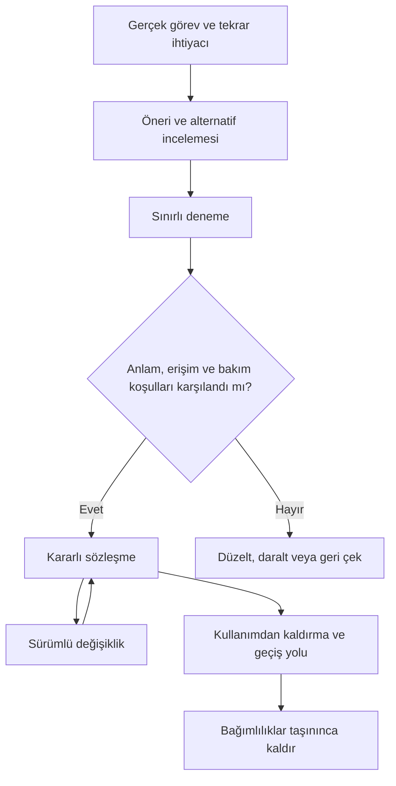
```mermaid
flowchart TD
    I["Gerçek görev ve tekrar ihtiyacı"] --> O["Öneri ve alternatif incelemesi"]
    O --> D["Sınırlı deneme"]
    D --> K{"Anlam, erişim ve bakım koşulları karşılandı mı?"}
    K -->|"Evet"| S["Kararlı sözleşme"]
    K -->|"Hayır"| R["Düzelt, daralt veya geri çek"]
    S --> V["Sürümlü değişiklik"]
    V --> S
    S --> E["Kullanımdan kaldırma ve geçiş yolu"]
    E --> X["Bağımlılıklar taşınınca kaldır"]
```

## 61. Ürün görevlerini tamamlayan bileşen sözleşmeleri

Bu bölüm yeni sayfa ailesi veya ürün özelliği açmaz. 00–09'da tanımlanan görevlerin, temel bileşenlerle nasıl tutarlı davranacağını tamamlar. Aşağıdaki her alan bileşeni §40–45 durumlarını, §55–56 erişilebilirlik yükümlülüklerini ve §60 sürüm kurallarını devralır. Burada belirtilen farklar o ortak kuralları daraltamaz.

### B35 — Navigasyon ve görev başlığı

#### Amacı

Kullanıcının nerede olduğunu, mevcut işin ne olduğunu ve nasıl geri dönebileceğini belirtmek.

#### Ne zaman kullanılmalı

Tüm sayfa ailelerinde ve bağımsız görev yüzeylerinde. Ana navigasyon Şamandıra ana sayfa bağlantısı, Keşfet, Neden Şamandıra? ve Ara eylemi çerçevesini korur. Yer, şehir ve ilçe bağlantıları içerik ilişkisiyle sunulur.

#### Ne zaman kullanılmamalı

Rota, AI, Premium ve Kaydettiklerin için kendiliğinden yeni ana portallar açmak veya bütün kullanıcıları şehir seçiminden başlatmak için. İç admin navigasyonu tüketiciye taşınmaz.

#### Avantajları

Doğrudan giriş ve geri dönüşü anlaşılır kılar. Farklı ekranlarda aynı işin izini sürdürür.

#### Riskleri

Marka alanı görevi aşağı itebilir; geri düğmesi tarayıcı geçmişi ile karışabilir. Dar menüde önemli çıkış veya yardım saklanabilir.

#### UX gerekçesi

Ana içerik ve gezinme bölgeleri adlandırılır; içeriğe geçiş yolu vardır. Etkin konum yalnız renkle gösterilmez. Tarayıcı/işletim sistemi geri davranışı önce etkin geçici alt görevi kapatır, sonra önceki bağlama döner; veri kaybı varsa somut kayıp açıklanır. Başka siteden doğrudan Yer sayfasına gelen kişi için “Keşfet” açık hedeftir; hayalî önceki sayfa üretilmez.

#### Alternatifleri

Basit görevde yalnız başlık ve geri/çıkış; gerçek üst–alt ilişkide kısa kırıntı yolu. Ana sayfada büyük tanıtım başlığı, bütün iç sayfalarda tekrarlanan hero olmak zorunda değildir.

**Sayfa ailesi sınırı:** Ana sayfa, Keşfet, Yer, Şehir, İlçe, Neden Şamandıra? ve Bir yeri nasıl anlıyoruz? kabul edilmiş ailelerdir. İletişim, Gizlilik ve Kullanım Koşulları destekleyici erişimde bulunur. Şehir ve ilçe sayfaları yalnız özgün, desteklenen karar bilgisiyle anlamlıdır; boş SEO şablonları bu sistemin üretim hedefi değildir.

### B36 — Sekme ve görünüm seçimi

#### Amacı

Aynı görev içindeki eş düzey içerik bölümleri veya görünüm seçenekleri arasında geçiş sağlamak.

#### Ne zaman kullanılmalı

Kaydettiklerin içindeki Rotalar, Gezeceğim Yerler ve Gezdiğim Yerler gibi mevcut ayrımlarda. Liste/harita seçimi de aynı sonucun görünüm kontrolüdür; görsel benzerlik semantik olarak mutlaka sekme yapılmasını gerektirmez.

#### Ne zaman kullanılmamalı

Sıralı form adımlarını gizlemek, farklı ana sayfaları tek panel gibi göstermek veya kritik koşulu görünmeyen sekmeye taşımak için.

#### Avantajları

Birbirine yakın işler arasında bağlamı korur. İçerik türlerinin ayrımını görünür tutar.

#### Riskleri

Gizli panelde değişen durum fark edilmeyebilir; fazla sekme yatay taşar. Sekme değiştirmek kaydetme veya uygulama sanılabilir.

#### UX gerekçesi

Etkin sekme, panel ilişkisi ve klavye gezinmesi açıktır. İçerik gecikiyorsa odak gezintisi otomatik ağır iş başlatmaz; etkinleştirme ayrı olabilir. Önceki panelin taslağı ve konumu korunur. Dar alanda seçilebilir açık listeye dönüşebilir; adlar kesilmez.

#### Alternatifleri

Az içerikte başlıklı bölümler; gerçek navigasyonda bağlantılar; uzun seçenek kümesinde seçici. Aynı işi çözmeyen içerik tek sekme grubuna zorlanmaz.

### B37 — Açılır ayrıntı / Accordion

#### Amacı

İkincil ayrıntının görünürlüğünü kullanıcı kontrolüne bırakırken temel kararı yerinde tutmak.

#### Ne zaman kullanılmalı

Yöntem ayrıntısı, kapsamlı pratik açıklama veya kayıt geçmişindeki yardımcı bilgilerde. Başlık kapalıyken içeriğin konusunu yeterince anlatır.

#### Ne zaman kullanılmamalı

Kapanma, zorunlu koşul ihlali, önemli bilinmeyen, paylaşım riski veya form hatasının tek yeri olarak. Kullanıcı kararı için gereken bilgi “detay” diye saklanmaz.

#### Avantajları

İkincil metnin ilk okumayı ağırlaştırmasını azaltır. Yeni sayfa veya modal açmadan ayrıntı verir.

#### Riskleri

Açılır alan sayısı keşif yükü yaratır; başlıklar belirsizse bilgi bulunmaz. Tek açık panel zorlaması karşılaştırmayı engelleyebilir.

#### UX gerekçesi

Açık/kapalı durum erişilebilir biçimde bildirilir; başlık eylemi klavyeyle çalışır. Birden fazla alanın açık kalması göreve göre mümkündür. Bağlantıyla gidilen veya hata içeren gerekli bölüm açılır ve anlamlı odak sağlanır; kullanıcı yazısı kendiliğinden kapanmaz.

#### Alternatifleri

Kısa metni doğrudan göstermek, bölüm bağlantısı veya kapsamlı yöntem sayfası. Önce metin sadeleştirilir, sonra gizleme değerlendirilir.

### B38 — Tooltip

#### Amacı

Tanıdık bir kontrolün kısa, ikincil açıklamasını sağlamak. Tooltip bilgi eksikliğinin temel çözümü değildir.

#### Ne zaman kullanılmalı

İkonun metin eşdeğerini ek destek olarak göstermek veya masaüstü klavye kısayolunu açıklamak için. Aynı eylemin erişilebilir adı ve dokunmada anlaşılır karşılığı zaten vardır.

#### Ne zaman kullanılmamalı

Kritik sınırlama, hata çözümü, işlem onayı, uzun metin veya içinde bağlantı/eylem taşıyan içerikte. Yalnız hover kullanıcılarına bilgi hakkı verilemez.

#### Avantajları

Yerleşimi büyütmeden kısa ek açıklama sağlar. Öğrenilmiş eylemleri destekleyebilir.

#### Riskleri

Dokunmada bulunamayabilir, içeriği örtebilir veya klavye odağında erken kapanabilir. Gerekli metnin saklanmasına mazeret olabilir.

#### UX gerekçesi

Hover ve odakla ulaşılabilir, Escape ile kapatılabilir; kullanıcı açıklamaya işaretçi taşıdığında hemen kaybolmaz. Eylem almaz ve yeni odak tuzağı oluşturmaz. Hareket ve gecikme tercihi açıklamanın anlamını değiştirmez.

#### Alternatifleri

Görünür etiket, alan yardımı veya B37 açılır açıklama. Etkileşimli ek içerik gerekiyorsa uygun panel/katman seçilir ve tooltip adı kullanılmaz.

### B39 — İddia, gerekçe ve bilgi sınırı

#### Amacı

Bir bilginin ne söylediğini, hangi yer/zaman/alan için geçerli olduğunu ve karardaki sınırını aynı sunum biriminde korumak.

#### Ne zaman kullanılmalı

Yer gerekçeleri, fiziksel koşullar, rota varsayımları, kritik güncelleme ve yetkili admin değerlendirmesinde. Bilgi türü, geçerlilik ve uygunluk ayrı anlamlar olarak korunur.

#### Ne zaman kullanılmamalı

Kaynak yorumunu aynen veya yeniden yazılmış biçimde yayımlamak, bütün yere güven puanı atamak, ham iç skor veya model düşünce zinciri göstermek için.

#### Avantajları

Olumlu cümlenin dayanağından kopmasını önler. Dar ekran, paylaşım ve erişilebilir anlatımda aynı sınırı koruyabilir.

#### Riskleri

Ayrıntı fazlalığı karar yükünü artırır; her iddiada aynı uyarı tekrarı duyarsızlaştırabilir. Çok teknik durum adları tüketicinin anlayışını zorlaştırabilir.

#### UX gerekçesi

Asgari sunum: desteklenen bilgi veya çıkarım, ilgili kapsam, kararı değiştiren sınır ve gerekiyorsa güncellik. Bilinmiyor, bulunamadı, doğrulanamadı, çelişkili, eski ve uygulanamaz durumları birbirinin yerine geçmez. Sert koşul için bilinmeyen olumlu eşleşme değildir. İddia tipi olgu/gözlem/çıkarım/tahmin olarak içeride ayrılır; kullanıcıda gereken somut dil kullanılır. Rota süre tahmini kesin ölçüm, geçmiş kalabalık bilgisi canlı durum değildir.

#### Alternatifleri

Kimlik bilgisi için sade tanım satırı; uzun yöntem için ilgili açıklama sayfası. Veri yetmiyorsa değerlendirmeyi sınırlamak geçerli çözümdür; biçimsel badge ile boşluk kapatılmaz.

**Atomik sunum:** Olumlu iddia ve karar değiştiren sınırı aynı sürümde gösterilir. Kritik düzeltme kart, ayrıntı, rota ve açılan canlı paylaşımda ilgili eski olumlu anlamı geçersiz kılar. Kullanıcıya iç sürüm numarası gösterme zorunluluğu yoktur; tutarlılık zorunludur. Lisansın gerektirdiği kaynak/servis atfı korunur; yasaklanan yorum gösterimiyle karıştırılmaz. İç admin yalnız görev ve hak kapsamında gereken asgari kanıtı görebilir.

### Diyagram 19 — İddia düzeltmesinin yüzeylere yayılması

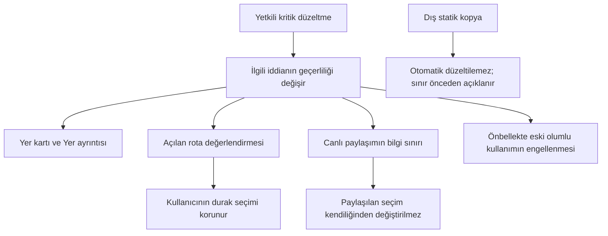
```mermaid
flowchart TD
    K["Yetkili kritik düzeltme"] --> I["İlgili iddianın geçerliliği değişir"]
    I --> Y["Yer kartı ve Yer ayrıntısı"]
    I --> R["Açılan rota değerlendirmesi"]
    I --> P["Canlı paylaşımın bilgi sınırı"]
    I --> O["Önbellekte eski olumlu kullanımın engellenmesi"]
    R --> S["Kullanıcının durak seçimi korunur"]
    P --> D["Paylaşılan seçim kendiliğinden değiştirilmez"]
    X["Dış statik kopya"] --> N["Otomatik düzeltilemez; sınır önceden açıklanır"]
```

### B40 — Rota düzenleyici

#### Amacı

Kullanıcının günlük planına doğrudan müdahale etmesini ve değişikliğin zaman/koşul etkisini anlamasını sağlamak.

#### Ne zaman kullanılmalı

Durak ekleme, kaldırma, sıralama, süre/başlangıç değiştirme veya açık sabitleme seçimlerinde. Boş taslak, serbest metin, seçilmiş yerler, ihtiyaç ve koleksiyon girişleri aynı günlük görevde birleşir.

#### Ne zaman kullanılmamalı

Tüm planı kullanıcı yerine kilitlemek, çok günlük rezervasyon yönetmek veya her değişiklikte bütün ihtiyaçları yeniden sormak için. “Optimize et” adıyla zorunlu durak veya koşul kaldırılmaz.

#### Avantajları

Kişisel tercih ve motor değerlendirmesi arasındaki ilişki görünür olur. Geri dönüş ve alternatif deneme kolaylaşır.

#### Riskleri

Yer/saat/sıra sabitlemeleri karışabilir; sürükleme erişilemeyebilir; sürekli yeniden hesaplama kullanıcının işini bölebilir.

#### UX gerekçesi

B04 Rota Kartı, B05 Liste, B48 Tarih/Saat, B11 eylemler ve B39 sınır sunumunu kullanır. Seçili yer otomatik zorunlu değildir. Yeni taslak ve yeniden değerlendirme birbirinden ayrılır; düzenleme korunur. İlk ulaşım, ziyaret, bekleme, geçiş, istenmiş dönüş ve ortak riskler kapsamına uygun gösterilir. Kullanıcının boş bıraktığı zaman tahmini gecikme tamponu değildir; keyfî güven payı “kesin” plan gibi sunulmaz.

#### Alternatifleri

Sadece yer toplamak için koleksiyon; tek değişiklik için satır eylemi; planı değiştirmeden görmek için Rota Kartı. Aynı ihtiyaç tek durakla çözülüyorsa rota karmaşıklaştırılmaz.

**Geri alma:** Son kişisel düzenleme geri alınabilir; kişisel değişiklik geçmişinin temel geri dönüşü ücretli ileri arşivle karıştırılmaz. Yeni kanıt eskiye döndürülmez. İşlem sonuçlanmadan başka değişiklik yapılırsa en yeni taslak esas alınır. Önerilen değişiklik kullanıcının başka bir açık sınırını gevşetiyorsa fark ve sonuç önce hazırlanır, sonra kullanıcıya seçtirilir.

### B41 — Kişisel kayıt ve koleksiyon

#### Amacı

Kullanıcının niyetini, açıkça bildirdiği ziyaret geçmişini ve günlük planlarını sosyal baskı üretmeden saklamasını sağlamak.

#### Ne zaman kullanılmalı

Gezeceğim Yerler, Gezdiğim Yerler, Rotalar ve temel kişisel gruplama görevlerinde. Misafir için gerçekten desteklenen cihaz kaydı, hesap için teyit edilmiş hesap kaydı ayrı anlatılır.

#### Ne zaman kullanılmamalı

Kaydetmeyi beğeni veya ziyaret saymak, otomatik ziyaret geçmişi üretmek, tamamlama yüzdesi, seri, liderlik tablosu ya da takipçi sistemi kurmak için.

#### Avantajları

Kişisel emek tekrar kullanılabilir ve kullanıcı daha sonra aynı kararı yeniden değerlendirebilir. Koleksiyon basit niyet gruplamasını sağlar.

#### Riskleri

Kayıt birikimi yapılacaklar borcu yaratabilir; koleksiyon silmek içindeki bütün kayıtları silmek sanılabilir. Cihaz verisi hesapta veya bulutta sanılabilir.

#### UX gerekçesi

Kaydetme, ziyaret ve katkı ayrı eylemdir. Bir yer hem gelecekte gitme niyeti hem geçmiş ziyaret taşıyabilir. Ziyaret tarihi bilinmiyorsa bugüne yazılmaz. Liste kaydını kaldırmak rotadaki durağı veya başka koleksiyondaki kaydı silmez. Koleksiyon silme grubu kaldırır; kapsam farklıysa sonuç somut biçimde gösterilir. Ziyaret kaydını silmek gözlemi kendiliğinden geri çekmez; kullanıcı ikisini de kaldırmak isterse anlaşılır birleşik kapsam sunulur.

#### Alternatifleri

Tek seferlik karar için kayıt zorunlu değildir. Sıralı günlük plan için Rota; kamusal bir bilgi düzeltmesi için Bir İz. Hesap açma temel keşfin önkoşulu olmaz; gerçek hesap verisine erişimde doğrulama korunur.

**Kişisel veri kontrolü:** Cihazdan hesaba aktarma açık kapsamla yapılır; var olan düzenlemeler sessizce ezilmez. Çıkışta hesap özel içeriği kapanır; kullanıcı seçmedikçe görünür yerel kopya bırakılmaz. Cihaz verisi silinmesi ve yönetim erişiminin kaybı dürüst anlatılır; sınırsız saklama veya her koşulda kurtarma sözü verilmez.

### B42 — Bir İz katkısı

#### Amacı

Gerçek ziyaret bağlamında isteğe bağlı, somut ve kısa bir gözlem almak; bunu kamusal yorum veya puana dönüştürmemek.

#### Ne zaman kullanılmalı

Ziyaret bağlamı kullanıcı tarafından açıkça biliniyorsa ve katkı için uygun bir anda. Yaklaşık beş saniyelik kolaylık hedefi araştırma varsayımıdır; süre sayacı veya tamamlama baskısı değildir.

#### Ne zaman kullanılmamalı

Keşfi, kayıt hakkını veya rota düzenlemeyi açmak için; reddedilmiş aynı ziyaret katkısını tekrar tekrar istemek için; kullanıcıyı mevcut olumlu iddiayı doğrulamaya yönlendirmek için.

#### Avantajları

Sınırlı çabayla somut bilgi adayları sağlayabilir. Uzun yorum ve sosyal statü yükünü azaltır.

#### Riskleri

Bağlam eksikliği gözlemi yanlış genellemeye dönüştürebilir. Önceki iddianın gösterilmesi cevabı yanlılaştırabilir. “Alındı” ifadesi yayın ve doğrulama sanılabilir.

#### UX gerekçesi

Ziyaret açık değilse önce “Bugün / Başka bir zaman / Gitmedim” gibi nötr bağlam seçimi yapılır; bilinen beyan tekrar sorulmaz. Ardından tek somut gözlem: örneğin konuşurken sesi yükseltme gereği ve “konuşmadım” seçeneği. Kullanıcı tamamladıktan sonra isteğe bağlı saat/alan ayrıntısı ekleyebilir. Gözlem alındı teyidi doğrulandı veya yayımlandı demek değildir. Katkıdan vazgeçme ve geri çekme yolu anlaşılır ve ücretsizdir.

#### Alternatifleri

Katkı vermeden devam etmek; farklı sorun için uygun düzeltme akışı. Yorum metni, yıldız ve genel memnuniyet puanı bu sistemin alternatifi değildir.

**Mahremiyet:** Gözlem kamuya kişinin adıyla yayımlanmaz; bu, içeride hiç veri işlenmediği anlamına gelmez. Katkıyı yönetme erişimi misafir cihazına bağlıysa kayıp sınırı açıklanır. İzinli gözlemin türevlerden geri çekilmesi yetkili bilgi sürecine bağlıdır; yalnız kullanıcının ekranındaki satırın kaybolması yeterli tamamlanma değildir.

### B43 — Paylaşım önizlemesi ve erişim kontrolü

#### Amacı

Kullanıcının özel içeriğinin hangi kısmını, hangi anlam ve erişim sınırıyla paylaşacağını yayımlamadan önce görmesini sağlamak.

#### Ne zaman kullanılmalı

Yer veya günlük rota için açık paylaşım isteğinde; bağlantıyı güncelleme, kapatma veya bağımsız kopyalama görevlerinde. Her paylaşım kullanıcı seçimiyle başlar.

#### Ne zaman kullanılmamalı

Kaydetmeyi otomatik kamusal yayına dönüştürmek, mesaj uygulamasını açmayı “gönderildi” saymak veya özel düzenlemeleri sessizce canlı paylaşıma aktarmak için.

#### Avantajları

Mahremiyet kapsamı somutlaşır. Alıcı aynı temel kararı ve sınırı anlayabilir; kayıtlı kullanıcının özel çalışma alanı korunur.

#### Riskleri

Bağlantı yalnız arkadaşlara açık sanılabilir; QR ayrı gizlilik garantisi gibi algılanabilir. Statik görselin geri çekilemediği unutulabilir; sınır silinince olumlu öneri aşırı genelleşebilir.

#### UX gerekçesi

Üç varlık açık ayrılır: özel taslak, açıkça yayımlanmış seçim ve alıcının bağımsız kopyası. Önizleme nötr başlık, yer/şehir, seçilmiş kapsam ve gerekli bilgi sınırlarını içerir. Ev/otel başlangıcı, gerçek zaman konumu, kişi adı, sağlık notu, özel bütçe ve rezervasyon ayrıntısı varsayılan olarak çıkarılır. Özel sebep çıkarılırken olumlu iddianın zorunlu sınırı kayboluyorsa olumlu iddia da daraltılır veya kaldırılır.

#### Alternatifleri

Hiç paylaşmamak, yalnız tek yeri paylaşmak veya bağlantıyı kullanıcının kendisinin kopyalaması. İşbirlikli düzenleme ihtiyaç kanıtı ve ayrı ürün kararı olmadan açılmaz.

**Yaşam döngüsü:** Bağlantıyı bilen başkasına iletebilir; hesap gerektirmeyen okuma arkadaş doğrulaması değildir. Yönetim erişimi okuma bağlantısından ayrıdır. Kapatma ve varsa sona erme denetimi ücretsizdir; teyide kadar kapandı denmez. QR aynı bağlantıya erişim aracıdır; metin bağlantısı ve aynı cihazda açma yolu bulunur. Bağımsız kopya özel taslağı izlemez. Kritik bilgi düzeltmesi mevcut canlı iddiayı sınırlar, seçilmiş durakları kendiliğinden değiştirmez.

**Statik paylaşım:** Story veya ekran görüntüsü dışarıda otomatik güncellenemez/geri alınamaz. Gerekli kapsam ve sınır görselde ilgili olumlu cümlenin yanında kalır; sığmıyorsa metin sadeleşir, olumlu iddia azalır veya ek karta bölünür. Küçük okunmaz dipnot çözüm değildir. Mesaj hazırlama, kopyalama, uygulama açma, gönderme ve alıcı okuması farklı sonuçlardır.

### Diyagram 20 — Özel taslak ve paylaşım mimarisi

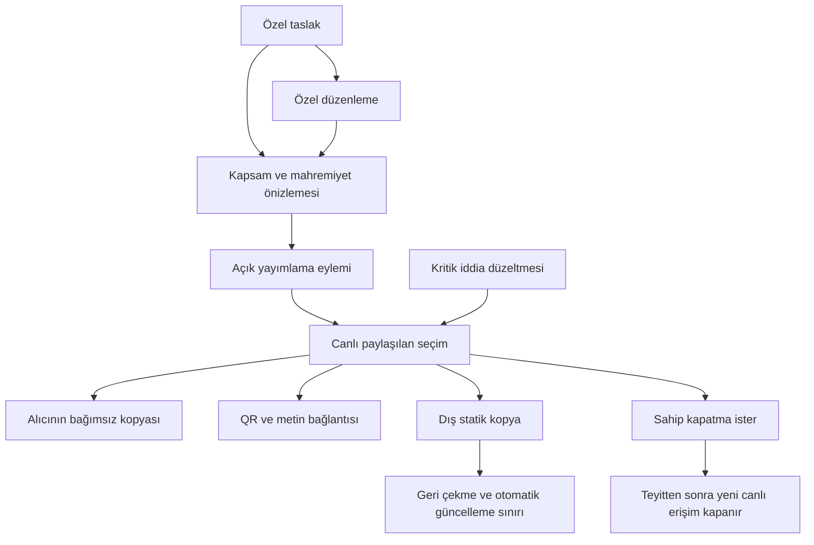
```mermaid
flowchart TD
    T["Özel taslak"] --> P["Kapsam ve mahremiyet önizlemesi"]
    P --> U["Açık yayımlama eylemi"]
    U --> L["Canlı paylaşılan seçim"]
    T --> E["Özel düzenleme"]
    E --> P
    L --> K["Alıcının bağımsız kopyası"]
    L --> Q["QR ve metin bağlantısı"]
    L --> S["Dış statik kopya"]
    L --> C["Sahip kapatma ister"]
    C --> D["Teyitten sonra yeni canlı erişim kapanır"]
    S --> X["Geri çekme ve otomatik güncelleme sınırı"]
    I["Kritik iddia düzeltmesi"] --> L
```

### B44 — AI açıklaması ve netleştirme

#### Amacı

Kullanıcının ihtiyacını anlamaya ve yetkili bilgi/karar sonucunu anlaşılır dile çevirmeye yardımcı olmak.

#### Ne zaman kullanılmalı

Doğal ifade belirsizliğini sınırlı soruyla gidermek, anlaşılan koşulları düzenlenebilir göstermek veya desteklenen karar gerekçesini açıklamak için.

#### Ne zaman kullanılmamalı

Yeni kaynak uydurmak, uygunluğu kendisi belirlemek, bilinmeyeni olumlu tamamlamak, yayın onayı vermek veya her kullanıcıyı uzun sohbet oturumuna sokmak için.

#### Avantajları

Serbest dil ile yapılandırılmış koşullar arasında köprü kurar. Kullanıcının aynı ihtiyacı tekrar tekrar yazmasını azaltabilir.

#### Riskleri

Akıcı dil yanlış kesinlik verir; parıltı ve özel avatar otorite yanılsaması yaratabilir. Sohbet geçmişi gerekli görevi ve mahremiyet sınırını aşabilir.

#### UX gerekçesi

“Şunu anladım” özeti ile gerçek bilgi ayrılır. Netleştirme yalnız kararı değiştiren eksik soruya yönelir; vazgeçme ve manuel düzenleme vardır. Yanıt güncel bağlama bağlıdır; eski cevap yeni ihtiyacı ezmez. Gerekçe ve kritik sınır tamamlanmış anlam birimi olarak gösterilir; olumlu cümle önce tek başına akıtılmaz. AI arızasında mümkün olan manuel keşif/kayıt görevi sürer.

#### Alternatifleri

Basit form, açık filtre, sabit yardım metni veya kullanıcının doğrudan Yer seçimi. AI kullanmadan aynı işi çözmek daha anlaşılırsa bu yol seçilir.

**Görsel kimlik:** AI aynı tipografi, yüzey ve durum ailesini kullanır. “AI onaylı” badge'i, olasılık yüzdesi ve düşünüyormuş gibi sahte aşamalar yoktur. İç denetim kaydı ile kullanıcı gerekçesi ayrıdır; model düşünce zinciri tüketiciye sunulmaz. Düşük güvenli çıktı süslenmek yerine sınırlanır.

### B45 — Premium kapsam açıklaması

#### Amacı

Gerçekten mevcut ve kullanıcı tarafından seçilmiş ek kolaylığın kapsamını, maliyetini ve sona erme etkisini anlaşılır biçimde açıklamak.

#### Ne zaman kullanılmalı

Kullanıcı ilgili ek kolaylığı bilinçli olarak istediğinde ve ürün/hizmet gerçekten mevcutsa. Bu belge fiyat, paket, kota veya özellik lansmanı belirlemez.

#### Ne zaman kullanılmamalı

Hata, çevrimdışı durum, sonuçsuzluk, aktif günlük plan, çıkış veya verilmiş emek sonrasında baskı kurmak için. Daha doğru yer, kritik bilgi, temel düzenleme, paylaşım kapatma veya erişilebilirlik satılamaz.

#### Avantajları

Ücretin hangi ek işi kolaylaştırdığı anlaşılır olur. Ücretsiz kullanımın hak sınırı görünür korunur.

#### Riskleri

Parlak özel tema ücretli güven izlenimi yaratabilir; iptal temel kayıtları kaybetme korkusu doğurabilir. Henüz planlanan kolaylık mevcutmuş gibi sunulabilir.

#### UX gerekçesi

Aynı karar bileşenleri ve iddia kalitesi kullanılır. Temel keşif, tüm zorunlu koşullar, gerekçe, alternatif, rota düzenleme/kayıt, temel koleksiyon, paylaşım ve düzeltme ücretsizdir. Ek senaryo, tekrar düzenleme veya ileri arşiv gibi adaylar ancak 09'un kabul kapılarıyla gerçek ürün kararı haline gelir. Kapsam ve toplam maliyet varsa eylem öncesinde görünür; reddetme kolaydır ve aynı bağlamda tekrar baskı yapılmaz.

#### Alternatifleri

Mevcut ücretsiz görevle devam; ek kolaylığı kullanmama; yalnız talep araştırması. Araştırma, ücretli işlev varmış gibi sahte düğme veya ödeme beklentisi yaratmaz.

**İptal:** İleri kolaylık sona erdiğinde temel kayıt ve kontrol hakları rehin alınmaz. Kullanıcı verisini okumak, temel düzenlemek veya paylaşımı kapatmak Premium'a bağlanmaz. Premium etiketi Yer kartının güven durumuna eklenmez; ticari açıklama karar sonucunu yeniden sıralamaz.

### Diyagram 21 — Ücretsiz ve Premium ortak çekirdeği

```mermaid
flowchart TD
    F["Ücretsiz kullanıcı"] --> C["Ortak bilgi, karar ve erişilebilirlik"]
    P["Premium kullanıcı"] --> C
    C --> B["Aynı temel bileşenler ve kontrol hakları"]
    P --> E["Gerçekten mevcut ek kolaylık"]
    E --> I["İptal veya sona erme"]
    I --> B
    T["Ticari öneri"] --> G{"Karar, güven veya temel hakkı etkiliyor mu?"}
    G -->|"Evet"| R["Reddet"]
    G -->|"Hayır"| V["Kapsam ve kullanıcı yararını değerlendir"]
```

### B46 — Admin inceleme tablosu ve karar paneli

#### Amacı

Yetkili kişinin kanıtı, iddia kapsamını, çelişkiyi ve yayın etkisini inceleyerek gerekçeli karar vermesini sağlamak.

#### Ne zaman kullanılmalı

İç bilgi bakım kuyruğu, kimlik ayrımı, çelişki incelemesi, düzeltme ve hak geri çekme işlerinde. Yetki göreve bağlıdır; tabloyu görebilmek bütün kaynakları görme hakkı değildir.

#### Ne zaman kullanılmamalı

İşletmeye puan/yorum/sıra yönetimi satmak, tek tıkla bütün AI önerilerini yayımlamak veya ham kişisel bilgiyi kolaylık adına herkese açmak için.

#### Avantajları

İlgili alanlar karşılaştırılabilir ve kararın etkilediği yayın kapsamı görülebilir. Toplu işlerde tutarlı durum kontrolü sağlar.

#### Riskleri

Yoğunluk bağlamı gizler, otomasyon yanlılığı yaratır ve toplu eylem hasarını büyütür. Görsel sıralama editörün kararını ticari önceliğe çekebilir.

#### UX gerekçesi

Kanıt ve kapsam AI önerisinden önce/bağımsız okunabilir. Yayın kararı, kişisel kayıt ve gözlem alımı farklı eylemlerdir. Sütun başlıkları, satır kimliği, sıralama ve seçim kapsamı erişilebilir biçimde tanımlanır; her veri tablosu etkileşimli grid olmak zorunda değildir. Başlangıç yardımcı hücre metni 14/20; kritik iddia ve karar açıklaması 16/24 kalır. Küçük hedef alt sınırı 44 birimdir; daha sıkı görünüm özel erişim gereksinimini aşamaz.

#### Alternatifleri

Az öğede inceleme listesi; dar alanda alan etiketleri korunmuş kayıt görünümü; karmaşık tek iddia için tam inceleme görevi. Sayfaya tüm veriyi yüklemek karşılaştırma gerekliliği değildir.

**İşlem güvenliği:** Toplu seçim görünür sayfa mı filtreli tüm küme mi açık söyler. Yayımlama/silme öncesi gerçek etki kapsamı hazırlanır; karşılanmayan yetki veya çelişki gizlenmez. Kısmi başarıda her öğenin durumu korunur; bütün işlem yeşil başarıya dönmez. Kritik kapsam, kimlik birleştirme ve geniş erişim etkisi 05'teki ek incelemeye tabidir. Onay zaman aşımı otomatik yayın olmaz. İnceleme sürerken başka yetkili kişi iddiayı değiştirmişse eski önizleme güncelmiş gibi onaylanmaz.

### Diyagram 22 — Admin karar ve yayın ayrımı

```mermaid
flowchart TD
    Q["Yetkili inceleme kuyruğu"] --> E["Kanıt, kapsam ve çelişki"]
    A["AI destek önerisi"] --> E
    E --> D["İnsan değerlendirmesi ve gerekçe"]
    D --> R{"Ek inceleme gerekiyor mu?"}
    R -->|"Evet"| S["Yetkili ikinci inceleme"]
    R -->|"Hayır"| P["Güncel etki önizlemesi"]
    S --> P
    P --> U["Yetkili açık yayın veya geri çekme eylemi"]
    U --> T["İddia ve bağımlı türevlere sonuç"]
    C["Eşzamanlı değişiklik"] --> P
```

### B47 — Sayfalama ve kontrollü yükleme

#### Amacı

Uzun kayıt veya inceleme kümelerinde kullanıcının konumunu ve yükleme kontrolünü korumak.

#### Ne zaman kullanılmalı

Kişisel kayıt arşivi ve admin kuyruğu gibi ilk küçük karar kümesinden daha uzun listelerde. Toplam biliniyorsa belirtilir; bilinmiyorsa uydurulmaz.

#### Ne zaman kullanılmamalı

Keşfet'i sonsuz dikkat akışına dönüştürmek, sonuç yokken yeni öneri varmış izlenimi vermek veya her sayfada filtreleri sıfırlamak için.

#### Avantajları

Yük, konum ve sonraki adım öngörülebilir olur. Alt bilgi ve çıkışa erişim korunur.

#### Riskleri

Geri dönüşte konum kaybolabilir; daha fazla yükleme odağı yanlış yere taşıyabilir. Toplu seçimin kapsamı görünmeyen sayfalara genişleyebilir.

#### UX gerekçesi

“Sonrakileri göster” eylemi yeni öğeleri ve biliniyorsa sayısını açıklar. Yeni içerik duyurulur; kullanıcı istemeden ilk öğeye atılmaz. Geri dönüşte filtre, sayfa ve konum korunur. Toplu seçimde kapsam B46 ile aynı anlamdadır; sadece yüklenen öğelerin sessizce tüm sonuçlar sanılması engellenir.

#### Alternatifleri

Küçük kümede tam liste; belirli kaydı bulmak için arama; gerçekten tablosal kümelerde açık sayfa seçimi. Teknik performans zorunluluğu kullanıcı konumunu kaybetme izni değildir.

### B48 — Tarih, saat ve süre seçimi

#### Amacı

Günlük plan veya açık ziyaret beyanı için gerekli zaman bilgisini doğru kapsam ve birimle almak.

#### Ne zaman kullanılmalı

Rota günü, başlangıç/bitiş, ziyaret süresi veya isteğe bağlı geçmiş ziyaret zamanında. Tarih bilinmiyorsa taslak veya bilinmeyen durum korunur.

#### Ne zaman kullanılmamalı

Kullanıcının gitmeyi düşündüğü günü gerçekleşmiş ziyaret tarihine çevirmek, kesin olmayan süreyi dakika garantisi yapmak veya kaydetmek için gereksiz tarih zorunluluğu koymak için.

#### Avantajları

Rota zaman ilişkileri açıklaşır ve yanlış gün/saat bağlamı azaltılabilir. Elle giriş uygun yerel seçiciyi tamamlar.

#### Riskleri

Takvim klavyeyle kullanılamayabilir; gün/ay sırası karışabilir; gece yarısı ve yaz saati geçişleri yanlış toplam üretebilir.

#### UX gerekçesi

Alan etiketi günün ve saatin hangi yere ait olduğunu açıklar. Takvim tek yol değildir; uygun metin girişi ve platform seçicisi bulunur. Girilen biçim için örnek/yardım sunulur. İmkânsız veya belirsiz yerel saat kullanıcıya açıklanır, otomatik tahminle geçilmez. Süre ile saat ayrı alan anlamıdır; süre aralığı ve bilinmeyen değer tek sabit sayıya sıkıştırılmaz.

#### Alternatifleri

Açık “Bugün / Başka gün / Tarihsiz taslak” seçimi, ziyaret için “Tarihini bilmiyorum” veya yalnız süre aralığı. Gerekli olmayan zaman bilgisi alınmaz.

### 61.1. Bileşen kataloğu ve ortak kabul kapsamı

| Aile | Kayıtlar | Ayrıntı yeri |
| --- | --- | --- |
| İçerik ve karar | B01 Ayırıcı; B02 Kart; B03 Yer; B04 Rota; B05 Liste | §21–25 |
| Arama ve sınıflandırma | B06 Filtre; B07 Arama; B08 Chip; B09 Badge; B10 Tag | §26–30 |
| Eylem ve giriş | B11 Buton; B12 Bağlantı; B13 Metin alanı; B14 Checkbox; B15 Radio; B16 Switch; B17 Seçici; B18 Menü | §31–33 |
| Katmanlar | B19 Bottom Sheet; B20 Modal; B21 Drawer | §34–36 |
| Bildirim ve durum | B22 Toast; B23 Snackbar; B24 Notification; B25 Loading; B26 Skeleton; B27 Empty; B28 Error; B29 Offline; B30 Success | §37–45 |
| Görsel yardımcılar | B31 Harita; B32 Fotoğraf; B33 İkon; B34 İllüstrasyon | §50–54 |
| Navigasyon ve açıklama | B35 Navigasyon; B36 Sekme; B37 Açılır ayrıntı; B38 Tooltip; B39 İddia | §61 |
| Ürüne özgü görevler | B40 Rota düzenleyici; B41 Kayıt/koleksiyon; B42 Bir İz; B43 Paylaşım; B44 AI; B45 Premium; B46 Admin; B47 Sayfalama; B48 Tarih/saat | §61 |

Başlık, body, caption, yüzey ve grid bu sürümde ayrı davranışlı component değil temel tasarım rolleridir; ilgili §5–20 kuralları onları kullanan bütün bileşenlerde geçerlidir. Fotoğraf galerisi B32'nin, harita kontrolleri B11/B31'in, silme onayı B20'nin varyantıdır; aynı davranış için ikinci gizli katalog oluşturulmaz. Yeni bağımsız davranış gerektiğinde §60 süreciyle yeni kayıt açılır.

### 61.2. Bütün bileşenlere uygulanan durum ve içerik matrisi

| Eksen | Asgari inceleme | Kabul edilmez |
| --- | --- | --- |
| Etkileşim | Normal, odak, basılı, seçili; yalnız anlamlı olanlar | Etkileşimsiz tag'e sahte buton durumu |
| İşlem | Bekleme, teyit, kesin hata, sonucu belirsiz, iptal kapsamı | “Yanıt yok” durumunu başarı veya kesin başarısızlık saymak |
| Veri | Tam, eksik, bilinmeyen, eski, çelişkili, geri çekilmiş | Boş değeri olumlu koşul veya sıfır saymak |
| İçerik | En kısa/en uzun gerçek ad; fotoğrafsız; çok satırlı sınır | Mutlu durumdaki kısa örnekle yetinmek |
| Kanal | Dar/geniş kabı, klavye, dokunma, yardımcı teknoloji | Aynı görünümü sağlayıp anlamı kaybetmek |
| Tema/dil | Açık, koyu, yüksek kontrast, RTL, büyütme | Tema değişiminde seçimin veya eylemin kaybolması |
| Hak | Misafir, hesap, Premium ve yetkili admin kapsamı | Görsel varyantın yetki veya doğruluk üretmesi |

Her bileşen bütün durumlara zorla sahip olmaz: divider için gönderim durumu anlamsızdır. Ancak bir bileşen uzak işlem yapıyorsa belirsiz sonuç, içerik gösteriyorsa ilgili veri sınırı sözleşmesi zorunludur. Uygulanamaz durum gerekçesi kaydedilir; eksik durum sessizce “kapsam dışı” sayılmaz.

## 62. Sistem kabul senaryoları ve değerlendirme yöntemi

Aşağıdaki senaryolar sonraki tasarım ve uygulama çalışmasının kabul koşullarıdır. Bu dokümantasyon görevi sırasında gerçek ekranlar üretilmiş veya kullanıcılarla sınanmış değildir. Sayısal başlangıç değerleri, bu görevler başarılı olmadan kendiliğinden doğrulanmış sayılmaz.

| No | Senaryo | Beklenen gözlenebilir sonuç |
| --- | --- | --- |
| K01 | Kullanıcı basamaksız erişimi zorunlu belirtir; yalnız giriş rampası bilinir | Kart tam erişilebilirlik iddiası kurmaz; eksik zincir görünür ve uygun öneri gibi sayılmaz |
| K02 | Aynı yer adıyla iki şube bulunur | Kimlik ve konum ayrılır; fotoğraf veya iddia yanlış şubeye taşınmaz |
| K03 | Sonuçlar için yalnız iki uygun aday vardır | Beş kartı doldurmak için zayıf/uygunsuz aday eklenmez |
| K04 | Çok çekici fotoğraftaki yerin o gün kapalı olduğu bilinir | Kapanma ilk karar okumasında görünür; olumlu gerekçe onu gizlemez |
| K05 | Filtre sheet'inde değişiklik yapılıp vazgeçilir | Uygulanan koşullar korunur; kapatmak yeni koşulları uygulamaz |
| K06 | Arama A'dan B'ye değişir, A yanıtı geç gelir | B bağlamı ve sonucu korunur; odak çalınmaz |
| K07 | Rota durağı sürüklemeden klavyeyle taşınır | Aynı düzenleme yapılır, odak durakta kalır, yeni sıra duyurulur |
| K08 | Durak kaldırmak başka zorunlu koşulu gevşetmeyi gerektirmez | Açık işlem gereksiz onaysız yapılır; kalıcı geri alma karşılığı bulunur |
| K09 | Önerilen değişiklik açık bütçe sınırını aşar | Somut fark görünür; sınır sessizce gevşetilmez |
| K10 | Son durak kaldırılır | Boş taslak kalır; rota hata sayılmaz veya otomatik doldurulmaz |
| K11 | Yeni rota düzenlenirken eski hesap gelir | Eski toplam güncel taslağa yazılmaz; kullanıcı seçimi korunur |
| K12 | Kaydetme gönderilir, yanıt kaybolur | “Kaydedildi” denmez; tekrar çoğaltmadan mevcut sonuç kontrol edilir |
| K13 | Sadece cihaz kaydı başarılıdır | “Bu cihazda kaydedildi” anlamı verilir; hesap kaydı iddia edilmez |
| K14 | Çevrimdışı paylaşımı kapatma isteği yapılır | Teyide kadar bağlantının açılabileceği söylenir; yanlış kapandı başarısı yoktur |
| K15 | İki cihazda aynı özel rota farklı düzenlenir | İki çalışma korunur; kullanıcı anlamlı fark ve çözüm yolu görür |
| K16 | Kaydedilen yer daha sonra yayından kalkar | İzinli kişisel kimlik kalabilir; eski olumlu iddia güncelmiş gibi kalmaz |
| K17 | Kullanıcı ziyaret tarihi belirtmeden Gezdiğim kaydı oluşturur | Tarih bugüne uydurulmaz; ziyaret Bir İz katkısına otomatik dönüşmez |
| K18 | Kullanıcı Bir İz'i reddeder | Aynı ziyaret için tekrar baskı yoktur; keşif ve kayıt sürer |
| K19 | Gözlem alınır, henüz incelenmemiştir | Teyit yalnız alındı anlamını taşır; doğrulandı/yayımlandı denmez |
| K20 | Özel rota paylaşım önizlemesine girer | Ev/otel, kişi adı ve özel ihtiyaçlar varsayılan olarak çıkartılır; kritik sınır korunur |
| K21 | Özel taslak yayımdan sonra düzenlenir | Canlı seçim sessizce güncellenmez; yeni paylaşım açık önizlemeye döner |
| K22 | Paylaşılan iddia kritik düzeltme alır | Canlı olumlu kullanım sınırlandırılır; kişinin seçilmiş durakları kendiliğinden değişmez |
| K23 | Statik paylaşım dar alana sığmaz | Kritik sınır küçük dipnota atılmaz; olumlu metin azalır veya içerik bölünür |
| K24 | Premium sona erer | Temel okuma, düzenleme, kayıt ve paylaşımı kapatma hakkı korunur |
| K25 | Harita yüklenmez veya konum izni reddedilir | Listeyle aynı temel karar ve elle konum seçimi yapılabilir |
| K26 | %200 metin ve dar pencere birlikte kullanılır | Başlık, koşul, etiket ve eylem kesilmez; kolonlar azalır |
| K27 | Koyu tema ve yüksek kontrast açılır | Kontrol, durum ve odak yalnız gölge/renk sayesinde anlaşılır olmaktan çıkar |
| K28 | Modal açıkken klavye gelir veya yön değişir | Taslak ve odak korunur; vazgeçme ve ana eylem örtülmez |
| K29 | Azaltılmış hareket görev ortasında açılır | Konum/seçim korunur; büyük kayma ve harita uçuşu durur |
| K30 | Admin önizlemesinden sonra kanıt başka yetkili kişi tarafından değişir | Eski önizlemeyle sessiz yayın yapılmaz; etki yeniden gösterilir |
| K31 | Admin toplu işlemi kısmen başarılı olur | Başarılı/başarısız/belirsiz öğeler ayrı görünür; bütün küme başarılı ilan edilmez |
| K32 | AI yanıtı verilemez | Desteklenen manuel arama ve kayıt sürer; kanıtsız olumlu metin üretilmez |

**İnceleme yöntemi:** Her senaryo ilgili bileşen ve görev örüntüsüyle eşleştirilir. Önce içerik/anlam incelemesi, sonra dar/geniş ve durum matrisi, ardından gerçek giriş ve yardımcı teknolojiyle görev yapılabilirliği değerlendirilir. Katılımcının kendi cümlesiyle “Neyi biliyorum, ne belirsiz, neyi değiştirdim?” sorularını cevaplayabilmesi incelenir. Sadece tıklama sayısı veya tercih anketi yeterli değildir.

**Yayın engeli:** Kritik koşulun saklanması, yanlış başarı, özel içeriğin açık paylaşılması, klavye ile temel görevin tamamlanamaması, kullanıcı taslağının kaybı veya ücretli güven ayrımı varsa etkilenen görev hazır sayılmaz. Önce sınırlı kapsamla düzeltme yapılır. Estetik bir iyileştirmenin başarısı bu kusurları telafi edemez. Yüksek önemde bulgu sürüyorsa daha dar kapsam veya geri çekme gerçek seçenektir.

## 63. Öz eleştiri — 60 madde

Bu değerlendirme sistemi övmek için değil, kararların nerede kırılabileceğini görünür kılmak içindir. Her maddede yanılma olasılığı ve tasarımın hangi koşulda değişmesi gerektiği bulunur. Henüz araştırma yapılmamıştır; aşağıdaki riskler gözlenmiş sonuç diye sunulmaz.

| No | Öz eleştiri | Yanlışlanma işareti ve düzeltme |
| --- | --- | --- |
| 1 | Belge çok uzun; ekip günlük kararda kullanamayabilir. | Aynı kurallar tekrar soruluyorsa kısa görev rehberi ve indeks hazırlanır; bağlayıcı anlam bu metinde korunur. |
| 2 | Kırk sekiz kayıt küçük ekip için erken bir katalog olabilir. | Kullanılmayan bileşenler uygulamaya zorlanmaz; kayıtlar sözleşme olarak kalır, gerçek ihtiyaç sırası belirlenir. |
| 3 | Sakinlik hedefi düşük görünürlükle karıştırılabilir. | Kullanıcı eylemi bulamıyorsa kontrast, etiket ve vurgu artırılır; sakinlik gerekçesiyle keşfedilebilirlik feda edilmez. |
| 4 | Yeşil marka vurgusu uygunluk/güven çağrışımı yaratabilir. | Kullanıcı yeşil kartı “güvenli” okuyorsa renk kullanımı daraltılır; durum metni ve farklı biçim güçlendirilir. |
| 5 | Sistem fontu özgün marka hissini zayıflatabilir. | Kimlik araştırması sorun gösterirse lisanslı aday font denenir; erişim ve yükleme bütçesi korunur. |
| 6 | Tek font ailesi bütün alfabelerde aynı kaliteyi sağlamayabilir. | Glif, satır veya ağırlık sorunu görülen dil için uyumlu aile eşlemesi yapılır; tek dosya ısrarı bırakılır. |
| 7 | 16/24 gövde değeri her kullanıcı için yeterli olmayabilir. | Anlama veya okuma sorunu varsa varsayılan ölçek büyür; kişisel büyütme yalnız telafi aracı sayılmaz. |
| 8 | 13 tb caption dışarıda ve yaşlı kullanıcıda küçük kalabilir. | Metadata okunamıyorsa caption rolü büyütülür veya gövdeye taşınır; kritik bilgi caption'a indirilmez. |
| 9 | 60–70 karakter hedefi mobil ve farklı alfabelere tam uymayabilir. | Gerçek okuma görevinde satır takibi zorlaşırsa dil ve alan bazlı sınır güncellenir. |
| 10 | 4 birim boşluk tabanı aşırı mekanik görünüm yaratabilir. | Optik ilişki bozuluyorsa gerekçeli istisna eklenir; her istisna yeni ölçek üretmez. |
| 11 | 48 birim hedefler yoğun admin işini yavaşlatabilir. | Yoğunluk sınamasında iş maliyeti artarsa düzen ve eylem gruplama değişir; hedefler keyfî küçültülmez. |
| 12 | 44 birim alt sınır farklı yerel birimlerde aynı fiziksel erişimi vermeyebilir. | Platform ölçümleri yetersizlik gösterirse yerel hedef büyür; sayısal eşleme kanıt sayılmaz. |
| 13 | 600/1024/1440 eşikleri gerçek içerik kırılmalarını yakalamayabilir. | Eşik arasında taşma varsa kullanılabilir kap genişliği kuralı güçlendirilir veya eşik değiştirilir. |
| 14 | 1280 görev kabı bazı karşılaştırmalarda dar kalabilir. | Yan yana okuma görevi zorlaşıyorsa kabın ilgili örüntü sınırı genişler; uzun metin satırı uzatılmaz. |
| 15 | İki kolon Yer kartı okuma sırasını bozabilir. | Gerekçe/sınır atlanıyorsa tek kolon korunur; geniş ekran tek başına iki kolon gerekçesi olmaz. |
| 16 | Kartlarda sabit yükseklik olmaması görsel düzensizlik yaratabilir. | Karşılaştırma zorlaşıyorsa içerik düzeni/hizalama iyileştirilir; kritik metin kesilmez. |
| 17 | Kimlik ve sınırın birlikte görünmesi kartları uzatabilir. | Kullanıcı temel farkı bulamıyorsa dil sadeleşir ve ilgili olmayan bilgi azalır; engel gizlenmez. |
| 18 | İlk 3–5 aday her ihtiyaçta yeterli olmayabilir. | Kullanıcı gerekçeli olarak kapsam genişletmek isterse kontrollü devam tasarlanır; ilk sayı mutlak içerik tavanı sayılmaz. |
| 19 | Genel güven rozeti olmaması hızlı taramayı zorlaştırabilir. | İddia sınırları anlaşılmıyorsa kısa somut özet geliştirilir; yere tek güven skoru verilmez. |
| 20 | Bilinmeyen, çelişkili ve eski durumları kullanıcı ayıramayabilir. | Durumları kendi cümlesiyle ayıramıyorsa teknik sınıf yerine karar etkisi anlatılır. |
| 21 | Çok belirsizlik göstermek kullanıcının kararsızlığını artırabilir. | İlgisiz belirsizlikler ilk okumadan çıkarılır; kararı değiştiren eksikler yine görünür kalır. |
| 22 | Arama doğal dili yanlış yapılandırabilir. | Kullanıcı koşulu düzeltmekte zorlanıyorsa anlaşılmış ihtiyaç özeti daha açık ve düzenlenebilir yapılır. |
| 23 | Görünür filtre özeti çok sayıda chip'e dönüşebilir. | Aktif koşullar taranamıyorsa gruplanmış metin ve düzenleme yolu denenir; kritik koşullar saklanmaz. |
| 24 | Anlık filtre ile uygula modeli arasında öğrenme maliyeti olabilir. | Kullanıcı kapanışı uygulama sanıyorsa örüntüler sadeleştirilir ve aynı görevde tek model kullanılır. |
| 25 | Sekmeler kişisel kayıt türlerini görünmez kılabilir. | Kullanıcı ziyaret ve niyet kaydını karıştırıyorsa adlandırma ve bölüm düzeni değiştirilir. |
| 26 | Sheet yüksekliği ve klavye ilişkisi cihazlar arasında değişebilir. | Eylem veya etiket örtülüyorsa tam görev görünümüne geçilir; sheet estetiği korunmaya çalışılmaz. |
| 27 | Tek modal kuralı karmaşık admin kararlarını zorlayabilir. | Gerçek alt iş uzun sürüyorsa bağımsız modal eklemek yerine tam inceleme adımı açılır. |
| 28 | Az gölge koyu temada katman sınırını zayıflatabilir. | Kullanıcı açık katmanı ayıramıyorsa yüzey ve sınır güçlendirilir; yalnız daha koyu gölgeye dayanılmaz. |
| 29 | Radius ölçeği bazı küçük kontrol ve yerel seçicilerle uyuşmayabilir. | Kontrol tanınırlığı etkilenirse platform eşlemesi güncellenir; görsel özdeşlik zorlanmaz. |
| 30 | Hover'a dayanmama ilkesi masaüstü yardımını gereğinden fazla sadeleştirebilir. | Ek yardım yararlıysa tooltip eklenebilir; temel bilgi ve eylem görünür kalır. |
| 31 | Toast süresi çeviri ve okuma hızında yetersiz kalabilir. | Mesaj kaçırılıyorsa kalıcı yerinde durum tercih edilir; zamanlayıcı hak taşımaz. |
| 32 | Snackbar'ın kalıcı geri alma karşılığı bulunamayabilir. | Görevde tekrar ulaşma başarısızsa geri alma görünür bir yere taşınır; kaybolan mesaj yeterli sayılmaz. |
| 33 | İptal ile beklemeyi bırakma ayrımı fazla teknik gelebilir. | Kullanıcı gönderilmiş işlemin durduğunu sanıyorsa etiket ve sonuç açıklaması somutlaştırılır. |
| 34 | Sonucu belirsiz işlem kontrolü yavaş ve yorucu olabilir. | Tekrarlı kayıtlar veya vazgeçme artıyorsa durum akışı sadeleşir; teyitsiz başarı verilmez. |
| 35 | Statik skeleton gerçek içeriğin uzunluğunu yanlış düşündürebilir. | İskelet kaldırılırken ciddi sıçrama oluyorsa yapı veya bekleme bileşeni değiştirilir. |
| 36 | Hareket süreleri bütün cihazlarda aynı algıyı yaratmayabilir. | Geçiş yavaş veya ani hissediliyorsa role ait süre ayarlanır; iş tamamlanması geciktirilmez. |
| 37 | Çok az hareket konum değişikliğini anlaşılmaz kılabilir. | Kullanıcı durak taşımanın sonucunu izleyemiyorsa kısa konum açıklaması ve görünür işaret artırılır. |
| 38 | Harita/listenin eşdeğerliği geliştirme ve bakım yükünü artırır. | İki görünüm tutarsızlaşıyorsa harita kapsamı daraltılır; erişilebilir liste hakkı kaldırılmaz. |
| 39 | “Bu alanda ara” ek eylem maliyeti yaratabilir. | Kullanıcı harita kapsamını anlayamıyorsa çağrı konumu ve dil düzeltilir; pan sessiz sorguya dönüşmez. |
| 40 | Fotoğrafsız kart düşük değerli yer izlenimi verebilir. | Araştırma bu yanlılığı gösterirse metin ve kimlik sunumu güçlendirilir; sahte fotoğraf üretilmez. |
| 41 | 4:3 kırpma bazı yerlerde önemli ayrıntıyı dışarıda bırakabilir. | Fiziksel koşul kayboluyorsa doğal oran veya başka gerçek fotoğraf seçilir. |
| 42 | AI görsel yasağı soyut anlatımda gereğinden geniş yorumlanabilir. | Öğretici soyut görsel yararlıysa açık sınırlarla kullanılabilir; gerçek mekân kanıtı yasağı sürer. |
| 43 | İllüstrasyonun seyrekliği açıklamaları kuru hale getirebilir. | Soyut ilişki anlaşılmıyorsa görsel anlatım sınanır; dekor eklemek otomatik çözüm değildir. |
| 44 | WCAG kontrol listesi gerçek erişilebilirlik yerine geçebilir. | Otomatik kontrol geçip görev başarısızsa gerçek kullanıcı/yardımcı teknoloji bulgusu öncelenir. |
| 45 | Çok sayıda canlı durum duyurusu ekran okuyucuyu yorabilir. | Duyurular görevi kesiyorsa birleştirme ve öncelik kuralı daraltılır; kritik bilgi kalıcı kalır. |
| 46 | RTL uyarlaması karma yönlü adres ve sayılarda yetersiz kalabilir. | Gerçek dil testinde sıra karışıyorsa yerel mesaj ve alan düzeni yeniden ele alınır. |
| 47 | Çeviride %40 genişleme hedefi bazı diller için yetersizdir. | Daha uzun metin taşarsa düzen büyür; oran mutlak sınır olarak uygulanmaz. |
| 48 | Tarih/saat arayüzü günlük planı gereksiz karmaşıklaştırabilir. | Taslak kurma zorlaşıyorsa gerekmeyen alanlar ertelenir; uygulanabilirlik iddiasının veri ihtiyacı korunur. |
| 49 | Ziyaret, niyet ve katkı ayrımı kullanıcı için zihinsel yük olabilir. | Kullanıcı işlem sonucunu ayıramıyorsa daha somut adlar ve sonuç metinleri denenir; kayıtlar sessiz birleştirilmez. |
| 50 | Bir İz'in kısa olması yararlı bağlamı azaltabilir. | Gözlemler değerlendirilemiyorsa soru/kapsam değişir veya toplama daralır; formu herkese uzatmak ilk çözüm olmaz. |
| 51 | Özel taslak ve paylaşılan seçim ayrımı zor öğrenilebilir. | Kullanıcı yayımlanan sürümü tanıyamıyorsa önizleme ve güncelleme modeli sadeleşir; otomatik yayın açılmaz. |
| 52 | Statik paylaşım geri çekme sınırı kullanıcı beklentisini karşılamayabilir. | Sınır anlaşılmıyorsa statik paylaşım ertelenir veya kaldırılır; yalnız canlı bağlantı yeterli olabilir. |
| 53 | Ücretsiz temel haklar ticari arayüz alanını daraltır. | Kolaylık geliri yetersizse ürün kapsamı değerlendirilir; bilgi ve kontrol ücretli duvara taşınmaz. |
| 54 | Admin yoğunluğu editörün kanıtı hızla onaylamasına neden olabilir. | Gerekçesiz onay artarsa önizleme, iş bölümü ve karar adımı güçlendirilir; AI yetkisi artırılmaz. |
| 55 | Toplu işlemlerde kapsam metni yine de gözden kaçabilir. | Yanlış seçim varsa toplu işlem daraltılır; daha çok onay kutusu tek başına çözüm sayılmaz. |
| 56 | Üç katmanlı token mimarisi gereksiz dolaylılık yaratabilir. | Aynı rol üç kez adlandırılıyorsa bileşen katmanı sadeleştirilir; anlamsal ayrım korunur. |
| 57 | Merkezî sahiplik değişiklikleri yavaşlatabilir. | Rutin değişiklikler bekliyorsa yerel katkı yetkisi artırılır; çekirdek anlamın onayı açık kalır. |
| 58 | İki sürümlük geçiş süresi tüm kanallar için yeterli olmayabilir. | Gerçek sürüm takvimi uymuyorsa tarih ve destek kapsamı yeniden belirlenir; eski kullanıcılar sessiz kırılmaz. |
| 59 | Performans hedefleri veri bakım maliyetini görünmez bırakabilir. | Hızlı ekran yanlış/eski bilgi üretiyorsa kalite kapısı önce gelir; medya azaltmak tek çözüm değildir. |
| 60 | On yıllık sistem söylemi değişmezlik yanılsaması yaratabilir. | Bakım kapasitesi veya görev değişiyorsa kapsam ve mimari güncellenir; çekirdek hak değişimi açık yeni kabul gerektirir. |

Öz eleştiriden çıkan düzeltmeler ana kurallara işlenmiştir: sabit kart yüksekliği yoktur; caption'a kritik bilgi bırakılmaz; breakpoint içerik kapasitesine bağlıdır; tokenın bileşen katmanı zorunlu kopya değildir; hareket ve harita sınırlanabilir; doğrudan geri alınabilir işlemler gereksiz onay istemez. Araştırmada bu karşılıkların yetersiz kaldığı gösterilirse karar yeniden açılır.

## 64. Diğer tasarım sistemleriyle farklar ve öğrenme sınırı

Dış sistemler kabul edilmiş Şamandıra belgelerinin yerine geçmez. Aşağıdaki kaynaklar **14 Eylül 2026** tarihinde kontrol edilmiştir. Karşılaştırma, erişilebilen resmî ilkeler ve yayınlarla sınırlıdır; şirketlerin bütün özel kütüphanelerinin incelendiği iddia edilmez. “Şamandıra farkı” sütunları bu belgenin tasarım değerlendirmesidir; diğer ürünlerin güvene veya erişilebilirliğe önem vermediği iddiası değildir.

### 64.1. Material Design

Material Web'in resmî tema dokümantasyonu somut referans değerleri, sistem rolleri ve bileşen tokenları arasındaki ilişkiyi tanımlar. Buradan alınan ders, görsel değer ile kullanım rolünü ayırmaktır. Şamandıra'nın üç katmanı bu genel yöntemden öğrenir; Material adları, hazır ölçekleri veya bileşen görünüşü doğrudan kopyalanmaz. [Material Web — Theming](https://material-web.dev/theming/material-theming/).

| Boyut | Şamandıra kararı ve farkı |
| --- | --- |
| Amaç | Genel arayüz dili yerine kişi–ihtiyaç–iddia–günlük karar sözleşmesi merkezdedir |
| Token | Kendi anlamsal adları; yalnız gerektiğinde bileşen katmanı; Premium ayrı güven teması değildir |
| Yüzey | Kartlar çoğunlukla E0; gölge ve tonal fark yalnız ilişkiyi anlatacak kadar |
| Bileşen | Yer, iddia sınırı, Bir İz ve özel/canlı paylaşım birinci sınıf alan sözleşmeleridir |
| Hareket | Kısa, kesilebilir ve gerektiğinde tamamen statik; marka hareketi zorunlu değildir |
| Bedel | Hazır sistemin hız avantajından daha az yararlanılır; kendi davranış kataloğunun bakımı gerekir |

Bu farklar Material'ın bu ihtiyaçları karşılayamayacağı anlamına gelmez. Hazır bir sistemin varsayılanlarını uyarlamadan kullanmak, Şamandıra'nın bilgi ve hak sözleşmesini kendiliğinden sağlamaz. Genel form ve erişilebilir seçim örüntülerinden öğrenmek geçerlidir; ürün kararının otoritesi devredilmez.

### 64.2. Apple ve Human Interface Guidelines

Apple ayrı bir şirket yaklaşımı, HIG ise onun platform rehberidir; iki bağımsız tasarım sistemi gibi sayılmaz. Resmî tasarım ilkelerindeki tutarlılık, insanların yeni etkileşimlerin davranışını öğrenmesini kolaylaştırma amacı taşır. Şamandıra platformun geri, metin büyütme ve erişilebilir kontrol beklentilerini korur. [Apple — Design principles](https://developer.apple.com/design/human-interface-guidelines/design-principles).

| Boyut | Şamandıra kararı ve farkı |
| --- | --- |
| Kanal | Apple platformları yanında web, diğer mobil platformlar ve admin aynı anlamı taşır |
| Kimlik | Güncel işletim sistemi yüzey estetiği ürün kimliğinin zorunlu temeli değildir |
| Yerel davranış | Uygun yerleşik seçici ve yardımcı teknoloji kullanımı serbest; piksel özdeşliği şart değil |
| Bilgi | Karar değiştiren belirsizlik ilk okumada kalır; minimal görünüm uğruna ayrıntıya itilmez |
| Katman | Opak okunabilir zemin temel seçenektir; saydamlık hareketli arka plana bağımlı okunma yaratamaz |
| Bedel | Platformlar arasında anlam eşitliği için ek doğrulama gerekir; her yerel kontrol aynı görünmez |

Apple'dan ayrışmak için kullanıcıya yabancı geri hareketi veya özel klavye kuralı icat edilmez. Şamandıra'nın farkı tanıdık etkileşimi reddetmesi değil, bütün kanallarda aynı kanıt ve kontrol yükümlülüğünü taşımasıdır.

### 64.3. Airbnb yaklaşımı

Airbnb Design'ın DLS anlatısı, ortak temellerden ve yeniden kullanılabilir bileşenlerden başlayan, farklı platformlarda tutarlı bir görsel dil oluşturma deneyimini açıklar. Bu tarihsel yayın bugünkü bütün Airbnb ürününün özellik envanteri değildir. Şamandıra'nın aldığı ders parçaları gerçek akış içinde birlikte değerlendirmek ve ortak dil kurmaktır. [Airbnb Design — Building a Visual Language](https://medium.com/airbnb-design/building-a-visual-language-behind-the-scenes-of-our-airbnb-design-system-224748775e4e).

| Boyut | Şamandıra kararı ve farkı |
| --- | --- |
| Yer sunumu | Fotoğraf, kimlik ve gerçek koşulu destekler; seçimin çekicilik vitrini olması hedeflenmez |
| Karar | Yer satışı/rezervasyon işlemi yerine günlük ihtiyaca uygunluk ve vazgeçme hakkı |
| Güven anlatımı | Yıldız, yorum hacmi ve sosyal kanıt yerine iddiaya bağlı kapsam ve sınır |
| Kişisel alan | Kaydetme niyet/hafızadır; sosyal statü veya tamamlanması gereken gezi listesi değildir |
| Bileşen dili | Marka fontu, renk ve fotoğraf düzeni kopyalanmaz; kendi gerekçe–sınır kompozisyonu kullanılır |
| Bedel | Güçlü fotoğraf ve sosyal kanıt kestirmeleri kullanılmadığından kısa açıklamanın kalitesi daha kritik olur |

Bu, Airbnb'nin bilgi açıklığı olmadığına ilişkin bir hüküm değildir. Şamandıra kendi görevi gereği fotoğrafın ikna gücünü ve puan kültürünü uygunluk otoritesinin önüne koymaz. DLS'nin ortak dil ve disiplin dersini alır; tüketim ve karar bağlamını devralmaz.

### 64.4. Linear'ın sistemi

Linear'ın 12 Mart 2026 tarihli arayüz yenileme yazısı, yoğun bilgiyle çalışırken gereksiz ikon, sınır ve navigasyon vurgusunu azaltmayı; eylemleri tutarlı konumlara yerleştirmeyi anlatır. Şamandıra bu tutarlılık ve görsel gürültüyü azaltma dersini alır. [Linear — A calmer interface for a product in motion](https://linear.app/now/behind-the-latest-design-refresh).

| Boyut | Şamandıra kararı ve farkı |
| --- | --- |
| Kullanım bağlamı | Sürekli uzman masaüstü işi varsayılmaz; seyrek kullanım, dış ortam ve tek elle giriş önemlidir |
| Yoğunluk | Tüketicide daha geniş hedef ve açık metin; admin yoğunluğu ayrı ve sınırlı |
| Kısayol | Klavye kısayolu yardımcıdır; kritik eylemin tek keşif yolu değildir |
| Navigasyon | Her zaman görünen geniş çalışma kabuğu yerine mevcut sayfa ve tek görev bağlamı |
| Sakinlik | İkincil dekor geri çekilir; gerekli kontrol sınırı ve caption kontrastı düşük bırakılmaz |
| Bedel | Uzman kullanıcı için daha az öğe aynı anda görünür; karşılığında daha geniş kullanım koşulları desteklenir |

Linear görünümünü koyu zemin, küçük metin ve ince çizgilerle taklit etmek bu sistemin hedefi değildir. Onun kendi yoğunluk bağlamından alınan ilke, Şamandıra'nın gerçek yer ve günlük karar bağlamında yeniden sınanır.

### 64.5. Stripe'tan alınan ders

Stripe'ın erişilebilir renk sistemi yazısı, paleti tek tek çekici tonlar olarak değil okunabilir eşleşmeler olarak ele almanın değerini gösterir. Şamandıra bundan renk/zemin çiftlerini doğrulama ve anlamsal rol disiplini öğrenir. [Stripe — Designing accessible color systems](https://stripe.com/blog/accessible-color-systems).

Şamandıra'nın farkı işlem başarısını yer uygunluğundan ayırmasıdır: kaydın başarı rengi, iyi mekân veya güvenli rota demek değildir. Stripe'ın görsel paleti, pazarlama gradient'i veya panel yoğunluğu kopyalanmaz. Kendi opak yüzeyleri ve sınırlı rol paleti kullanılır. Bedeli, daha az dekoratif esneklik ve bütün durum çiftlerini kendi katalogunda denetleme yüküdür.

### 64.6. Notion'dan alınan ders

Notion'ın resmî yardım sayfası içerik görünümünü font, genişlik ve benzeri tercihlerle düzenleme imkânlarını açıklar. Bu, onun özel tasarım sistemi mimarisinin tamamını belgelemez. Şamandıra'nın çıkardığı ders, içerik yapısını görünümden ayırmak ve okunabilir düzeni kullanıcı işine göre uyarlamaktır. [Notion — Style and customise your content](https://www.notion.com/en-gb/help/customize-and-style-your-content).

Şamandıra serbest sayfa editörü değildir. Yer gerekçesiyle sınırın yerini kullanıcı veya ticari ekip keyfî blok düzenlemesiyle ayıramaz. Kullanıcının rota sırasını değiştirmesi, kanıt ve uyarı sırasını değiştirme yetkisi vermez. Kayıt ve koleksiyonlar sade kişisel düzenleme sunabilir; sınırsız blok ve veritabanı ürünü haline gelmez. Bu sınır esnekliği azaltır, fakat karar anlamının kanallar arasında korunmasını kolaylaştırır.

### 64.7. Özgünlük için ortak değerlendirme

Hiçbir dış sistemin tüm iyi uygulamaları reddedilmez. Ortak button, form, klavye ve token yöntemleri Şamandıra'yı kopya yapmaz. Kopyaya dönüşme; başka ürünün amaç, bilgi hiyerarşisi, yoğunluk ve ikna alışkanlığının gerekçesiz taşınmasıyla olur. Şamandıra'nın kendine ait sistemi şu birlikteliktir: ihtiyaçla ilişkili gerekçe, aynı birimde bilgi sınırı, küçük anlamlı seçenek kümesi, geri alınabilir kişisel kontrol, açık paylaşım kapsamı ve üyelikten bağımsız güven.

## 65. Gelecekte değişmesi en muhtemel kararlar

| Karar | Değişim olasılığı | Yeniden karar için gereken kanıt | Değişirken korunacak sınır |
| --- | --- | --- | --- |
| Sistem fontu / olası marka fontu | Yüksek | Dil kapsamı, okunabilirlik, lisans, yükleme ve kimlik araştırması | Metin erişimi ve görevin font indirmeye bağlı olmaması |
| Renk tonları | Yüksek | Gerçek ekran, dış ışık, renk algısı ve marka çalışması | Anlamsal roller ve izinli kontrast çiftleri |
| Kart fotoğraf oranı | Yüksek | Farklı yer türlerinde gerçek görüntü ve kırpma sınaması | Fiziksel koşulun çarpıtılmaması |
| Boşluk ve radius değerleri | Orta–yüksek | Görev gruplama ve kontrol tanınma araştırması | Hedef erişimi ve iddia–sınır yakınlığı |
| Breakpoint ve kap genişlikleri | Yüksek | Yeni pencere biçimleri, uzun dil ve metin büyütme bulguları | Aynı anlam ve kullanıcı durumunun korunması |
| Sheet / tam görünüm seçimi | Yüksek | Klavye, yön, metin ve tek elle kullanım görevleri | Kapanış, taslak ve odak sözleşmesi |
| Motion süreleri | Orta | Gerçek cihaz ve hareket hassasiyeti bulguları | Azaltılmış hareket ve anında kritik düzeltme |
| İlk okuma ayrıntı miktarı | Orta | Gerekçe/sınır anlama ve karar süresi birlikte | Önemli engel ve bilinmeyenin saklanmaması |
| Admin yoğunluğu | Yüksek | İnceleme doğruluğu, yorgunluk ve toplu hata örnekleri | Yetki, kanıt, açıklama ve yeterli hedef |
| Bileşen sınırları ve sayısı | Yüksek | Tekrarlanan görev, bağımsız değişim nedeni ve bakım yükü | Ortak durum ve hak sözleşmesi |
| Token adları ve araç biçimi | Orta | Yeni kanal ve bakım gereksinimi | Sürümlü geçiş, anlamsal eşleme ve döngüsüzlük |
| Performans bütçeleri | Yüksek | İlan edilmiş gerçek cihaz/ağ ölçümleri | Hız uğruna yanlış olumlu bilgi üretmeme |
| Öğretici illüstrasyon | Orta | Metinle karşılaştırılmış anlama bulgusu | Gerçek yer kanıtıyla karışmama |
| Premium ek kolaylığının sunumu | Yüksek | Gerçek ürün kapsamı, değer ve adalet araştırması | Temel ücretsiz haklar ve aynı karar kalitesi |

Düşük değişim olasılığı taşıyanlar görsel moda değildir: zorunlu koşulu korumak, bilgi yokluğunu olumlu saymamak, iddia sınırını yakın tutmak, kullanıcının emeğini korumak ve ticari etkiyi uygunluktan ayırmak kabul edilmiş çekirdektir. Bunlar “yeni tasarım trendi” gerekçesiyle güncellenemez; ilgili ürün referansında açık karar gerektirir.

## 66. Alternatif Design System mimarileri

| Alternatif | Avantajı | Riski / bedeli | Şamandıra kararı |
| --- | --- | --- | --- |
| Katı Atomic Design klasör modeli | Ortak terimler ve düzenli parça hiyerarşisi | Alan anlamı atom/molekül sınıflaması altında kaybolabilir | Düşünme yöntemi alınır; sahiplik yapısı yapılmaz |
| Hazır Material tabanını temalamak | Başlangıç hızı ve geniş temel bileşen kapsamı | Varsayılan davranışların ürün kararına uygunsuz taşınması | Gelecekte uygulama aracı olarak incelenebilir; anayasa yerine geçemez |
| Her platformun tamamen ayrı yerel sistemi | Yerel davranış ve araçlarla hızlı uyum | Anlam, durum ve hakların zamanla ayrışması | Ortak sözleşmesiz bağımsızlık reddedilir |
| Tek evrensel bileşen uygulaması | Tek değişim noktası ve yüksek tekrar kullanım | Yerel erişilebilirliği ve farklı görevleri tek araca sıkıştırabilir | Tek uygulama zorunlu değildir; ortak davranış zorunludur |
| Yalnız token ve stil rehberi | Küçük ve kolay başlangıç | Kayıt, paylaşım, belirsizlik ve odak davranışını tanımlamaz | Tek başına yetersiz |
| Tam davranışsız görsel bileşenler | Farklı iş mantıklarıyla birleşebilir | Her ekip kritik durumları yeniden icat eder | Görünümden bağımsız davranış sözleşmesi ayrıca zorunludur |
| Ürün ekiplerinin bağımsız alan kütüphaneleri | Yerel hız ve alan sahipliği | Token, erişim ve dil çatallanması | Ortak çekirdek ve kontrollü katkıyla sınırlı federasyon seçilir |
| Bütün kararların merkezî komiteden geçmesi | Sıkı tutarlılık | Küçük düzeltmeler bile yavaşlar; ekip istisna üretir | Risk düzeyine göre inceleme; rutin iş bileşen sahibinde |
| Her ekran için özel tasarım | Tek göreve yüksek yerel uyum | Tekrar, bakım ve kullanıcı öğrenme maliyeti büyür | Gerekçeli kısa deneme dışında seçilmez |
| AI'nin anlık arayüz üretmesi | İhtiyaca göre uyum olasılığı | Kritik metin sırası, odak ve haklar öngörülemez hale gelebilir | Denetimsiz üretim reddedilir; ancak onaylı örüntü ve sözleşme sınırında gelecek araştırması olabilir |
| Yalnız metin ve yerel kontroller | Düşük görsel yük, hızlı ve sağlam çekirdek | Coğrafi ve görsel kimlik ilişkileri sınırlanabilir | Erişilebilir geri çekilme ve düşük kapasite seçeneği olarak geçerli |
| Ortak anlam çekirdeği + anlamsal token + alan sözleşmesi + kanal uyarlaması | Ürün anlamı korunurken görünüm ve platform değişebilir | Sözleşme bakımı ve görevler arası doğrulama disiplini gerektirir | Bu belgenin seçtiği mimari |

Seçimin gerekçesi en fazla bileşeni üretmek değildir. Bilgi otoritesini sunumdan, kişinin kararını ticari yönlendirmeden ve platform davranışını ürün anlamından ayırır. Bileşen sayısı azalabilir, araç değişebilir ve bazı yardımcı görseller kaldırılabilir. Aynı kişinin aynı koşullarla farklı kanallarda çelişkili karar görmesi kabul edilemez.

## 67. Belge ilişkileri ve sonraki okuma

### Bu dokümanın bağlı olduğu belgeler

- [00 — Ürün Felsefesi](../00-product/00-urun-felsefesi.md): değişmez amaç ve kullanıcı yararı.
- [01 — Bilgi Mimarisi](../00-product/01-bilgi-mimarisi.md): sayfa aileleri ve içerik sırası.
- [02 — Product Language](../00-product/02-product-language.md): ortak kavramlar ve belirsizlik dili.
- [03 — Karar Motoru](../00-product/03-karar-motoru.md): uygunluk yetkisi ve zorunlu koşullar.
- [04 — Sistem Mimarisi](../00-product/04-sistem-mimarisi.md): sorumluluk, güncellik ve koordinasyon.
- [05 — AI Bilgi Motoru](../04-ai/05-ai-bilgi-motoru.md): iddia, kaynak, AI, katkı ve yayın sınırı.
- [06 — Akıllı Rota Motoru](../00-product/06-akilli-rota-motoru.md): günlük plan ve yeniden değerlendirme.
- [07 — UX Karar Akışları](../02-ux/07-ux-karar-akislari.md): görev, kayıt, paylaşım ve kesinti davranışı.
- [08 — Tasarım İlkeleri](./08-tasarim-ilkeleri.md): karar açıklığı, kontrol ve erişilebilirlik.
- [09 — Ürün Ekosistemi](../09-business/09-urun-ekosistemi.md): yaşam döngüsü, ücretsiz hak ve ticari bağımsızlık.
- [Proje README](../../README.md) ve [dokümantasyon dizini](../README.md): depo bağlamı ve güncel okuma/kabul kaydı.

00–09'un içerikleri değiştirilmemiştir. Tarihsel kabul ifadeleri kaynaklarda korunur; bu görevdeki açık kullanıcı kabulü esas alınır. Bu yeni 10 belgesinin tamamlanması, kullanıcı tarafından ayrıca kabul edildiği veya tasarımın uygulandığı anlamına gelmez.

### Bu dokümanın etkilediği belgeler

Aşağıdakiler **planlanan** çalışmalardır; bu görevde ayrı dosya oluşturulmamış ve olmayan dosyalara bağlantı verilmemiştir.

- UX kullanıcı doğrulama planı: §62 senaryoları, anlama, geri dönüş ve baskısız karar ölçümü.
- Bileşen kataloğu ve token yönetişim kaydı: sahiplik, durum matrisi, izinli eşleşme, istisna ve sürüm geçişleri.
- Web/mobil/tablet kanal davranış sözleşmeleri: aynı anlamın yerel kontrol, pencere, klavye ve yardımcı teknolojilerle karşılığı.
- Admin inceleme ve erişim tasarımı: kanıt, etki önizlemesi, eşzamanlı değişiklik ve toplu işlem durumu.
- Erişilebilirlik doğrulama planı: WCAG kapsamı, gerçek yardımcı teknoloji ve görev sonuçları.
- Kanıt, güncellik ve yayın politikası çalışması: 05 ile aynı dosya değildir; iddia durumlarının sunum ve düzeltme ilişkisini ayrıntılandırır.
- İş modeli ve şehir kapasitesi doğrulaması: 09'un önceki planlı bağımlılığı sürer; DS bir fiyat veya lansman kararı vermez.

### Bundan sonra okunması gereken belge

Bu belge uygulanmadan önce [07 — UX Karar Akışları](../02-ux/07-ux-karar-akislari.md) ile ilgili görev ve [08 — Tasarım İlkeleri](./08-tasarim-ilkeleri.md) ile karar sınırı birlikte okunmalıdır. Bilgi/rota yüzeylerinde [05 — AI Bilgi Motoru](../04-ai/05-ai-bilgi-motoru.md) ve [06 — Akıllı Rota Motoru](../00-product/06-akilli-rota-motoru.md) ilgili otoritedir. Sonraki yeni çalışma **planlanan UX ve erişilebilirlik doğrulama planı** olmalıdır; ardından gerçek ihtiyaç sırasıyla bileşen kataloğu ayrıntılandırılabilir. Bu sıralama kod veya ekran üretimi talimatı değildir.

## Nihai Design System İlkeleri

Aşağıdaki kararlar bu anayasanın bağlayıcı hükümleridir. Kabul edilmiş ürün referanslarının yetkisi üsttedir; bu belgenin sistem kararları gerekçeli sürüm süreciyle değişebilir.

1. Şamandıra, insanlara en iyi yeri göstermeye çalışmaz; kendileri için doğru olan yeri en kısa yoldan bulmalarını sağlar.
2. En kısa yol, anlama, kıyaslama, bekleme ve yanlış seçimden dönme çabasının toplamını azaltır; kritik bilgi saklanarak kısaltılamaz.
3. Kullanıcının güncel açık ihtiyacı, çıkarılan geçmiş tercihinden ve ticari hedeften önce gelir.
4. Uygunluğu yetkili karar süreci belirler; bileşen, renk, AI veya fotoğraf ikinci karar motoru olamaz.
5. Zorunlu koşul ihlali başka avantajla telafi edilemez; bilinmeyen zorunlu koşul olumlu eşleşme sayılmaz.
6. İddia, kapsam ve kararı değiştiren sınır aynı okuma biriminde ve aynı güncel anlamla sunulur.
7. Bilinmeyen, çelişkili, eski, uygulanamaz, başarısız ve sonucu belirsiz durumlar birbirinin yerine kullanılamaz.
8. Genel yer güven rozeti, yıldız, yorum hacmi, sosyal kanıt ve uygunluk yüzdesi tüketici karar diline giremez.
9. Kabul edilmiş sayfa aileleri korunur; arama, harita, rota ve kişisel kayıtlar izinsiz yeni portallara dönüşmez.
10. İlk seçenek kümesi küçük ve anlamlıdır; sayı doldurmak için uygunsuz veya kaynaksız aday eklenmez.
11. Bileşen; içerik, etkileşim, durum, erişilebilirlik, mahremiyet ve geri dönüş sözleşmesidir.
12. Ortak anlam çekirdeği, anlamsal tokenlar, alan bileşenleri ve kanal uyarlamaları seçilen mimaridir.
13. Atomic Design düşünme aracıdır; alan sorumluluklarını örten zorunlu sınıflama değildir.
14. Tokenlar ilkel değerden anlamsal role, gerektiğinde bileşen rolüne akar; döngü ve gerekçesiz kopya oluşturulamaz.
15. Sayısal stil değerleri bu sürümün başlangıç kararlarıdır; araştırma yapılmış gibi sunulamaz ve anlamı bozmadan değiştirilebilir.
16. Responsive uyarlama önce anlamı korur; alan yetmediğinde kolon, dekor ve yardımcı panel azalır, kritik bilgi azalmaz.
17. Tipografi ve kontroller kullanıcı metin ölçeğiyle büyür; sabit yükseklik ve üç nokta kritik bilgiyi kesemez.
18. Renk tek anlam kanalı değildir; metin, kontrol, durum ve odak izinli kontrast eşleşmeleriyle doğrulanır.
19. Açık, koyu ve erişilebilir yüksek kontrast davranışı aynı bilgi ve hakları sunar; tema ücretli güven katmanı olamaz.
20. Yüzey ve elevation görev ilişkisini anlatır; gölge, radius ve vurgu yer kalitesini veya ticari önceliği göstermez.
21. Bir etkin görevde baskın eylem açıktır; reddetme, düzeltme ve çıkış yolları görünür kalır.
22. Geri alınabilir açık kullanıcı işlemi gereksiz onay istemez; başka hak/koşulu etkileyen sonuç somut önizleme ve uygun kullanıcı kararı gerektirir.
23. Uzak işlem teyit edilmeden başarı denmez; belirsiz sonuçta tekrar çoğaltmadan mevcut durum kontrol edilir.
24. Geçici bildirim kritik bilginin veya geri alma hakkının tek taşıyıcısı olamaz.
25. Modal yalnız gerekli görevde kullanılır; odak, kapanış, geri dönüş ve klavye görünürlüğü korunur.
26. Hareket açıklayıcı, kısa ve kesilebilirdir; azaltılmış hareket tercihinde aynı işlev statik biçimde sürer.
27. Temel iş yalnız gesture, hover, renk, ses veya harita ile yapılamaz; erişilebilir eşdeğeri vardır.
28. Harita aynı sonuçların yardımcı görünümüdür; pan açık eylem olmadan arama kapsamını değiştirmez.
29. Fotoğraf gerçek kimliği ve koşulu çarpıtamaz; AI görseli gerçek yer kanıtı yerine geçemez.
30. Dijital erişilebilirlik ücretsiz temel haktır; web hedefi WCAG 2.2 AA'dır ve gerçek görev sınaması olmadan uygunluk iddiası kurulamaz.
31. Performans doğru içeriğe erişim ve kullanıcı kontrolüdür; erken yanlış bilgi veya eski olumlu önbellek başarı sayılmaz.
32. Dil, yön, birim ve zaman uyarlaması karar kapsamını korur; çeviri kritik sınırı ortadan kaldıramaz.
33. Rota günlük kişisel plandır; tek durak, boş taslak, mola ve erken bitiş geçerli sonuçlardır.
34. Kullanıcı düzenlemesi korunur; eski yanıt yeni taslağı ezemez, yeni kanıt eski bilgiye geri alınamaz.
35. Kaydetmek, ziyaret etmek, katkı vermek ve paylaşmak ayrı işlemlerdir; biri diğerinden otomatik çıkarılamaz.
36. Bir İz gönüllü ve somut gözlemdir; alındı teyidi doğrulama/yayın değildir, katkı sosyal statü üretmez.
37. Özel taslak, paylaşılan seçim ve bağımsız kopya ayrı haklara sahiptir; özel düzenleme açık eylem olmadan yayımlanamaz.
38. Paylaşım önizlemesi mahrem içeriği en aza indirir ve gerekli sınırı korur; dış statik kopyanın geri çekilememesi önceden anlaşılır.
39. Kritik düzeltme canlı iddia kullanımına yayılır; kullanıcının kişisel durak seçimi sessizce değiştirilmez.
40. Premium yalnız gerçek ek kolaylık sunabilir; doğruluk, temel kontrol, kayıt emeği, erişilebilirlik ve paylaşımı kapatma hakkı satılamaz.
41. Admin aynı temelleri kullanır, farklı yetkili alan sözleşmesi taşır; AI ve ticari ekip yayın otoritesi kazanamaz.
42. Her bileşenin sahibi, yedi değerlendirme başlığı, anlamlı durum matrisi ve değişiklik geçmişi bulunur.
43. Yeni varyant gerçek kullanıcı işiyle gerekçelendirilir; istisnanın sahibi ve sona erme koşulu vardır.
44. Sürüm geçişi kullanıcı emeğini ve kanal tutarlılığını korur; araç değişimi sessiz anlam kırılması yaratamaz.
45. Şamandıra başka sistemlerden yöntem öğrenir; kendi karar, kanıt, kontrol ve hak sözleşmesiyle tasarlanır.
46. Bakım kapasitesi yetmezse yardımcı kapsam daraltılır; çekirdeğin dürüstlük ve kullanıcı iradesi yükümlülüğü azaltılmaz.
