# Şamandıra — Ekran Mimarisi

> Şamandıra, insanlara en iyi yeri göstermeye çalışmaz.
>
> Kendileri için doğru olan yeri en kısa yoldan bulmalarını sağlar.

Bu belge ekranların görünüşünü değil; sorumluluğunu, bilgi sahipliğini, ilişkilerini, giriş ve çıkışlarını, durumlarını ve kullanıcı kararını tanımlar. “En kısa yol”, anlama, kıyaslama, bekleme ve yanlış seçimden dönme çabasının toplamını azaltır. Kullanıcının sonuç seçmemesi, planı yarım bırakması veya uygulamadan ayrılması geçerli sonuçtur.

**Kapsam:** Yalnız proje deposunda Markdown dokümantasyonu. Kod, UI tasarımı, wireframe, Figma, Flutter, HTML veya CSS üretilmez. Mermaid blokları ekran ilişkileri ve davranış diyagramlarıdır; görsel yerleşim tarifi değildir. Bu belge bir özellik lansmanı, ödeme sistemi seçimi veya tamamlanmış kullanıcı araştırması değildir.

**Referans otoritesi:** Kullanıcının bu görevdeki açık beyanıyla 00–10'un tamamı ve proje README'si kabul edilmiş referanstır; tamamı okunmuştur. Kaynak dosyaların tarihsel öneri/kabul etiketleri yeniden yazılmaz. 11'in hazırlanması onun ayrıca kabul edildiği anlamına gelmez. Mevcut uygulama davranışının bu hedefle aynı olduğu varsayılmaz.

**Okuma haritası:** §0 sınır ve envanteri; §1–30 her ekranın on beş başlıklı sözleşmesini; §31–45 ortak davranışları; §46 kayıtlar arası ilişkileri; §47 önemli karar gerekçelerini; §48 senaryoları; §49 öz eleştiriyi; §50–54 alternatif ve gelecek kararlarını; §55 doğrulama koşullarını; §56 belge ilişkilerini içerir. Son bölüm bağlayıcı ilkeleri toplar. E01–E30 ekran kimlikleri kararlıdır; görünen isim veya adres değişse de izlenebilirlik için korunur.

## 0. Ekran sınırı, sorumluluk ve envanter

### 0.1. Otuz sözleşme, tek ürün çekirdeği

“Ekran”, kullanıcının belirli bir karar verdiği adreslenebilir görev ya da ortak durum sözleşmesidir. Her ekran bağımsız ana sayfa ailesi veya menü maddesi değildir. Ayrı amaç, veri sahipliği, yetki veya geri dönüş gereksinimi varsa ayrı sözleşme gerekir; yalnız genişlik veya renk farkı yeni ekran yaratmaz.

01 Bilgi Mimarisi ve 10 Design System B35 uyarınca kamusal sayfa aileleri Ana Sayfa, Keşfet, Yer, Şehir, İlçe, Neden Şamandıra? ve Bir Yeri Nasıl Anlıyoruz? olarak korunur. Ana navigasyon **Şamandıra, Keşfet, Neden Şamandıra? ve Ara eylemi** çerçevesindedir. Arama Keşfet'in durumudur. Harita yardımcı görünüm, bölge coğrafi kapsam seçimidir; bunlar yeni portal değildir.

Kaydettiklerin, Keşfet içinde Rotalar, Gezeceğim Yerler ve Gezdiğim Yerler ayrımını taşır. Akıllı Rota ve düzenleyicisi bu görev bağlamından veya Yer üzerinden açılır. Profil yalnız kişinin kendi kayıt ve hesap kontrolüne erişimidir; herkese açık kişi sayfası değildir. Hesap, destek ve abonelik görevlerinin doğrudan adresi olabilir; bu adres yeni ana navigasyon kararı sayılmaz.

### 0.2. Referansların mimariye etkisi

| Referans | Ekranlara taşıdığı sorumluluk |
| --- | --- |
| 00 Ürün Felsefesi | Her çıkışta anlamlı karar veya dürüst çekimserlik; etkileşim süresi hedefi yok |
| 01 Bilgi Mimarisi | Sayfa aileleri, Keşfet merkezli görevler, coğrafya ve Yer bilgi sırası |
| 02 Product Language | Amaç, tercih, zorunlu koşul ve bağlam ayrımı; somut ve baskısız dil |
| 03 Karar Motoru | Uygunluk yetkisi; bilinmeyen sert koşulun olumlu eşleşme sayılmaması |
| 04 Sistem Mimarisi | Sunumun bilgi, karar ve koordinasyonun yerine geçmemesi |
| 05 AI Bilgi Motoru | İddia, izinli kanıt, katkı, yayın ve düzeltme yaşamı |
| 06 Akıllı Rota Motoru | Günlük plan; sıra, zaman, kilit ve güncel değerlendirme |
| 07 UX Karar Akışları | Misafir, geri dönüş, taslak, katkı ve paylaşım sözleşmeleri |
| 08 Tasarım İlkeleri | Kritik bilginin erişimi, kullanıcı iradesi, sakinlik ve eşitlik |
| 09 Ürün Ekosistemi | Kişisel hafıza, ücretsiz temel haklar ve ticari bağımsızlık |
| 10 Design System | Ortak durumlar, erişilebilir görev, tek etkin katman ve kanal eşdeğerliği |
| Proje README | Depo ve okuma bağlamı; tarihsel teknik uygulama notları ürün otoritesi değildir |

### 0.3. Ekran türleri ve kapsam kapıları

| Kimlik | Ekran | Mimari tür / ebeveyn | Yetki |
| --- | --- | --- | --- |
| E01 | Ana Sayfa | Kamusal sayfa ailesi | Herkes |
| E02 | Keşfet | Kamusal sayfa ailesi, keşif ve kişisel görev bağlamı | Herkes; özel veride sahiplik |
| E03 | Arama | Keşfet durumu | Herkes |
| E04 | Yer Detay | Kamusal Yer ailesi | İzinli yayın herkese |
| E05 | Şehir | Kanıt yeterliyse özgün coğrafi sayfa | Herkes |
| E06 | İlçe | Özgün karar farkı varsa coğrafi sayfa | Herkes |
| E07 | Akıllı Rota | Keşfet/Yer bağlantılı günlük görev | Misafir veya sahibi |
| E08 | Rota Düzenleme | Akıllı Rota alt görevi | Taslağın sahibi |
| E09 | Gezeceğim Yerler | Keşfet → Kaydettiklerin | Cihaz kaydı veya hesap sahibi |
| E10 | Gezdiğim Yerler | Keşfet → Kaydettiklerin | Cihaz kaydı veya hesap sahibi |
| E11 | Bir İz bırak | Yer/ziyaret bağlamlı katkı görevi | Misafir dahil gönüllü katkı |
| E12 | Profil | Kendi kayıt/hesap kontrolü görevi | Misafir cihaz kapsamı veya hesap sahibi |
| E13 | Premium | Koşullu hizmet açıklaması ve varsa abonelik görevi | Bilgi herkese; yönetim sahibine |
| E14 | Bildirimler | Görevle ilişkili olaylara dönüş | Kişinin kendi olayları |
| E15 | Ayarlar | Tercih ve veri kontrolü | Cihaz/hesap kapsamına göre |
| E16 | Giriş | İstenen hesap işine bağlı doğrulama görevi | Herkes |
| E17 | Kayıt | İsteğe bağlı hesap oluşturma görevi | Herkes |
| E18 | Şifre | Kurtarma veya doğrulanmış değiştirme alt akışı | İlgili kimlik doğrulaması |
| E19 | Onboarding | Atlanabilir, görev bağlamlı tanışma | Herkes |
| E20 | Neden Şamandıra? | Kamusal yöntem/amaç ailesi | Herkes |
| E21 | Bir Yeri Nasıl Anlıyoruz? | Kamusal yöntem ailesi | Herkes |
| E22 | Yardım | Destek görevi | Herkes |
| E23 | İletişim | Destekleyici kamusal erişim | Herkes |
| E24 | Hata Sayfaları | Ortak durum; gerekirse tam görev | Etkilenen görevin yetkisi |
| E25 | Boş Durumlar | Ortak durum; ebeveyn içinde | Etkilenen görevin yetkisi |
| E26 | Offline | Ortak bağlantı ve yerel çalışma durumu | Yerelde izinli kapsam |
| E27 | Admin Paneli | Ayrı iç operasyon kabuğu | Atanmış operasyon rolü |
| E28 | Editör Paneli | İç inceleme görev alanı | Atanmış editör kapsamı |
| E29 | İçerik Yönetimi | İç yayın ve yaşam döngüsü görevi | İçerik/yayın işlem yetkisi |
| E30 | Premium Yönetimi | İç ticari hizmet operasyonu | Sınırlı ticari işlem yetkisi |

E13 ve E30'un tarif edilmesi fiyat, paket, kota, ödeme sağlayıcısı veya Premium kolaylığının kabulü değildir. 09'daki araştırma ve işletim kapısı geçilmeden satış eylemi açılmaz. Aynı şekilde hesap servisinin, bildirim dağıtımının veya mobil uygulamanın bugün çalıştığı iddia edilmez. İlgili yetenek açıldığında bu sözleşme geçerlidir; yoksa sahte işlev gösterilmez.

### 0.4. Bütün ekranların devraldığı kurallar

Kritik engel ve belirsizlik, olumlu iddiayla aynı anlam biriminde bulunur. İç puanlar, yıldızlar, popülerlik, ham veya yeniden yazılmış yorumlar, yorumcu kimlikleri, model düşünce zinciri ve ticari sıralama tüketici ekranlarında yer alamaz. İç operasyonda kanıt erişimi yalnız hak ve görev kapsamındadır; bu istisna tüketiciye veya ticari role taşınmaz. Gerekli lisans atıfları korunur.

Loading, empty, error ve offline ayrı nedenlerdir. Başarı yalnız teyit edilmiş hedef ve kapsam için söylenir. “Bu cihazda kaydedildi”, “Hesabına kaydedildi”, “Gözlemin alındı” ve “Bağlantı hazır” birbirinin yerine geçmez. Sonucu bilinmeyen uzak işlem önce kontrol edilir; kör tekrar yapılmaz.

Her bağımsız görevin adı, anlamlı çıkışı ve geri dönüş noktası vardır. Kritik bilgi sadece harita, renk, hover, sürükleme, geçici mesaj veya gizli ayrıntıyla taşınamaz. Yerel geri alınabilir işlem gereksiz onay istemez; veri kaybı, başka zorunlu koşulun gevşemesi veya dış yayın gibi gerçek etki önce somutlaştırılır.

### Diyagram 01 — Ekran sorumluluk katmanları

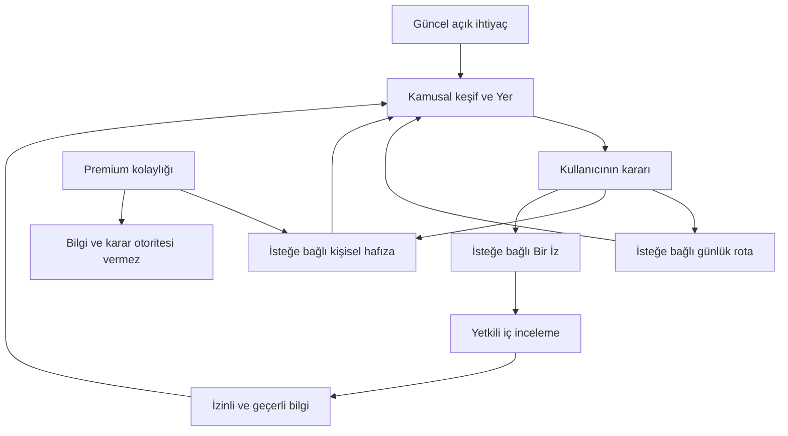
```mermaid
flowchart TD
    I["Güncel açık ihtiyaç"] --> K["Kamusal keşif ve Yer"]
    K --> D["Kullanıcının kararı"]
    D --> R["İsteğe bağlı günlük rota"]
    D --> H["İsteğe bağlı kişisel hafıza"]
    H --> K
    R --> K
    D --> Z["İsteğe bağlı Bir İz"]
    Z --> O["Yetkili iç inceleme"]
    O --> B["İzinli ve geçerli bilgi"]
    B --> K
    T["Premium kolaylığı"] --> H
    T --> S["Bilgi ve karar otoritesi vermez"]
```

## 1. E01 — Ana Sayfa

### Amacı

Ürünün vaadini kısa biçimde açıklamak ve kişiyi doğrudan kendi ihtiyacını ifade etmeye götürmek. Tanıtımı okumak keşfin önkoşulu değildir.

### Kullanıcının bu ekrana neden geldiği

İlk kez ürünü anlamak, bilinen başlangıç noktasından yer bulmak veya önceki görevine dönmek ister. Hesaplı ve misafir kullanıcı aynı çekirdeğe ulaşır.

### Çıkarken hangi kararı vermiş olmalı

İhtiyacını arayacak, Keşfet'e gidecek, yöntemi okuyacak ya da ürünün kendisine uygun olmadığına karar verecektir. Rota veya hesap oluşturması gerekmez.

### Giriş noktaları

Kök adres, Şamandıra bağlantısı, doğrudan açılış ve doğrulanmış görev bulunmayan yeni oturum. Geçerli deep link Ana Sayfa üzerinden dolaştırılmaz.

### Çıkış noktaları

E03 arama durumu, E02 Keşfet, E20 amaç açıklaması, E21 yöntem; destek bağlantıları. Gerçekten geri yüklenebilir kişisel görev varsa kullanıcı seçimiyle o göreve dönüş.

### Ana bileşenleri

Ürün amacı, ihtiyaç giriş yolu, keşfe giriş, yöntem erişimi ve kapsam bilgisi. Bunlar bilgi rolleri olup yerleşim veya bileşen çizimi değildir.

### Zorunlu bilgiler

Kimin hangi işi için var olduğu; aramanın nasıl başlatılacağı; coğrafi kapsam gerektiğinde mevcut sınırı. Konum izni olmadan başlanabileceği ilgili işlemde anlaşılır olur.

### İkincil bilgiler

Kısa kullanım örnekleri ve önceki işe dönüş. Örnek şehir/yere ait desteklenmeyen gerçek uygunluk iddiası kurulmaz.

### Asla bulunmaması gereken bilgiler

“En iyi yerler”, trend akışı, yıldızlar, şehir tamamlama sayacı, zorunlu giriş veya başlangıçta Premium teklifi. Hesap özel kayıtları ortak cihazda doğrulamasız gösterilemez.

### Loading durumu

Temel ürün açıklaması ve gezinme, harita veya AI yanıtını beklemez. Kişisel devam alanı yüklenemiyorsa Ana Sayfa kullanılabilir kalır.

### Empty durumu

İlk kullanım normal durumdur; “hesabın boş” hata anlatısı yoktur. Önceki görev bulunmuyorsa dönüş alanı gerekmez.

### Error durumu

Arama hizmetindeki sorun ilgili eylem yanında açıklanır; yöntem ve mevcut izinli içerik erişimi sürer. Kullanıcı girdisi kaybolmaz.

### Offline davranışı

Gerçekten yerelde bulunan açıklama ve görev erişimi kullanılabilir; olmayan şehir/yer içeriği varmış gibi gösterilmez. Son kaydın cihaz kapsamı belirtilir.

### Premium etkisi

Ana Sayfa'nın bilgi kalitesi ve keşfe giriş hakkı değişmez. Ücretli olmak farklı “daha doğru” başlangıç üretmez.

### AI etkisi

İhtiyaç ifadesini anlamaya yardımcı olabilir; Ana Sayfa bir AI sohbet kapısına dönüşmez. Manuel arama ve kategori girişleri bağımsızdır.

## 2. E02 — Keşfet

### Amacı

Güncel açık ihtiyacı, coğrafi kapsamı ve zorunlu koşulları az sayıda anlamlı yer seçeneğine bağlamak. Kaydettiklerin ve günlük plan görevlerine aynı bağlamdan erişim sağlar.

### Kullanıcının bu ekrana neden geldiği

Ne aradığını kabaca bilir, seçenekleri karşılaştırmak ister veya kaydettiği yere/rotaya dönüyordur. Belirli bir yer adına sahip olması gerekmez.

### Çıkarken hangi kararı vermiş olmalı

Bir yeri incelemek, belirli koşulu değiştirmek, uygun sonuç bulunmadığını kabul etmek, kaydına dönmek veya günlük rota kurmak. Her arama seçime zorlanmaz.

### Giriş noktaları

Ana navigasyon; E01, E05, E06 kapsamlı girişleri; E04'ten alternatif arama; doğrudan Keşfet bağlantısı; kayıt işleminden Kaydettiklerin'e dönüş.

### Çıkış noktaları

E04 Yer Detay, E03 arama, E07 rota, E09/E10 ve Rotalar kaydı; ilgili coğrafi sayfa; destek. Harita açma ekran ailesinden çıkış değildir.

### Ana bileşenleri

Anlaşılan ihtiyaç özeti, uygulanan koşullar, düzenlenebilir filtre taslağı, sonuç kümesi ve gerekçeleri, isteğe bağlı harita, Kaydettiklerin görev seçimi.

### Zorunlu bilgiler

Aktif coğrafya ve koşullar; sonucun öneri mi kimlik eşleşmesi mi olduğu; her önerinin gerekçesi ve karar değiştiren sınırı; değerlendirilemeyen ihtiyaç. İlk kümede 3–5 anlamlı aday hedeflenir, sayı doldurulmaz.

### İkincil bilgiler

Gerçek fotoğraf, ikincil koşullar, kullanıcının talep ettiği daha fazla sonuç ve haritadaki ilişki. Kişisel kayıt sayısı yalnız biliniyorsa verilir.

### Asla bulunmaması gereken bilgiler

Sonsuz dikkat akışı, sponsor sıralaması, filtre olarak tempo/enerji/puan, geçmiş davranıştan sessiz sert ihtiyaç çıkarımı. Harita kaydırması otomatik yeni arama olamaz.

### Loading durumu

Yalnız güncel sorgu sonuçları beklenir; sorgu ve koşullar düzenlenebilir kalır. Eski küme görünüyorsa önceki bağlama ait olduğu açıktır; yeni öneri gibi kullanılamaz.

### Empty durumu

Eşleşen yer yok, zorunlu koşul için kanıt yok ve kapsam henüz desteklenmiyor ayrılır. Değiştirilebilecek koşul adlandırılır; kullanıcının yerine gevşetilmez.

### Error durumu

Harita arızası listeyi durdurmaz. Karar yanıtı alınamazsa mevcut kimlik bilgileri uygunluk iddiasından ayrılır; tekrar aynı bağlamda yapılır.

### Offline davranışı

Yerel sonuçlar saklanmış bağlam ve tarih sınırıyla okunabilir. Canlı uygunluk veya geniş kapsamlı çevrimdışı arama vaat edilmez; yerel kayıt araması ayrı adlandırılır.

### Premium etkisi

Aynı ihtiyaç ve kanıtta aynı sonuç, gerekçe, alternatif ve filtre hakkı. Gelecekte bir tercih şablonu kolaylığı açılsa bile elle aynı koşulları girmek ücretsizdir.

### AI etkisi

Serbest ifadeyi yapılandırır ve gerçek karar gerekçesini açıklayabilir. Kullanıcı özeti düzeltebilir; AI uygunluk sırasını belirlemez, eksik kanıtı doldurmaz.

## 3. E03 — Arama

### Amacı

Yer adı, coğrafya veya ihtiyaç cümlesini Keşfet'in tutarlı sorgu durumuna dönüştürmek. Ayrı sonuç dizini oluşturmaz.

### Kullanıcının bu ekrana neden geldiği

Bilinen yeri hızlı bulmak, yeni ihtiyacını söylemek veya önceki sorguyu düzeltmek ister. “Ara” eylemi açık kullanıcı niyetidir.

### Çıkarken hangi kararı vermiş olmalı

Doğru kimliği açmak, sonuçlara geçmek, tek belirsizliği netleştirmek ya da aramayı iptal etmek. Metni yazmak tek başına koşulları uygulamak değildir.

### Giriş noktaları

Ana Ara eylemi, E01 ihtiyaç girişi, E02 sorgu düzenleme, Yer'den başka yer bulma. Özel liste içi arama kendi kapsamını taşır ve genel aramayla karışmaz.

### Çıkış noktaları

Aynı E02'nin güncel sonuç durumu veya açık seçilen E04/E05/E06. İptal önceki uygulanmış sorguya ve odak noktasına döner.

### Ana bileşenleri

Sorgu alanı, gönder/temizle, bağlamlı kimlik önerileri, gerekli netleştirme, isteğe bağlı yerel geçmiş. Klavye öneri seçimi ile sorgu gönderimi ayırt edilir.

### Zorunlu bilgiler

Yazılan metin ve aktif kapsam; aynı adlı yerlerde şube/ilçe/şehir; hangi ifadenin sistem tarafından koşul olarak anlaşıldığı. Kullanıcı düzeltmeden yeni kimlik birleştirmesi yapılmaz.

### İkincil bilgiler

Yakın geçmişten kullanıcı tarafından tutulmuş sorgular, yaygın yazım karşılıkları ve kısa giriş örneği. Tamamlanmamış karakter birleşimi sorgu diye gönderilmez.

### Asla bulunmaması gereken bilgiler

Trend aramalar, ticari otomatik tamamlama, özel geçmişten kamusal öneriler, gizli sağlık/konum profili. Yazılan sözcük habersiz başka yerle değiştirilemez.

### Loading durumu

Öneri ve kesin sonuç beklemeleri ayrıdır. Geç gelen eski sorgu yanıtı son sorguyu ezemez; her yanıt kendi bağlamına aittir.

### Empty durumu

Boş alan giriş durumudur; arama başarısızlığı değildir. Sonuç yoksa yazım, kimlik veya kapsamı gözden geçirme yolu verilir; “burada yer yok” genellemesi yapılmaz.

### Error durumu

Sorgu korunur; öneri servisi arızasında kullanıcı açık gönderimle desteklenen aramayı sürdürebilir. Tüm yollar kullanılamıyorsa mevcut kayıtlar ve çıkış kalır.

### Offline davranışı

Yerelde aranabilen kayıt kümesi açıkça adlandırılır. İnternette yeni yer arandığı veya güncel saat kontrol edildiği izlenimi verilmez.

### Premium etkisi

Doğrudan ad arama, doğal ihtiyaç ifade etme ve düzeltme temel haktır. Sonuçsuzluk Premium gerekçesi değildir.

### AI etkisi

Ad ve niyeti ayırmaya yardım eder; yalnız önemli belirsizlikte kısa soru sorar. AI yoksa ad/tür/konum ve manuel koşul yolları sürer.

### Diyagram 02 — Arama ve Keşfet ortak akışı

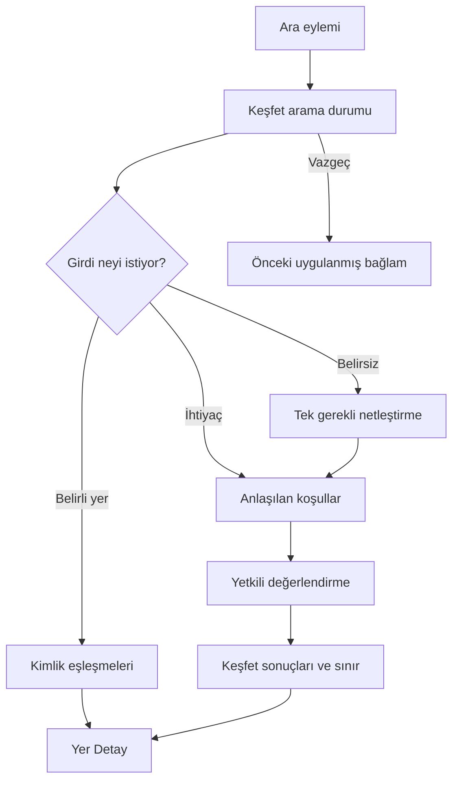
```mermaid
flowchart TD
    A["Ara eylemi"] --> B["Keşfet arama durumu"]
    B --> C{"Girdi neyi istiyor?"}
    C -->|"Belirli yer"| D["Kimlik eşleşmeleri"]
    C -->|"İhtiyaç"| E["Anlaşılan koşullar"]
    C -->|"Belirsiz"| F["Tek gerekli netleştirme"]
    F --> E
    E --> G["Yetkili değerlendirme"]
    G --> H["Keşfet sonuçları ve sınır"]
    D --> Y["Yer Detay"]
    H --> Y
    B -->|"Vazgeç"| O["Önceki uygulanmış bağlam"]
```

## 4. E04 — Yer Detay

### Amacı

Kullanıcının belirli yerin kendi ihtiyacına uyup uymadığını anlamasını ve seçimini uygulamasını sağlamak. Yer kaydı bulunması önerilmiş olduğu anlamına gelmez.

### Kullanıcının bu ekrana neden geldiği

Sonucu incelemek, adla bulduğu yeri doğrulamak, pratik ulaşım bilgisine bakmak, kayıtlı niyetini yeniden değerlendirmek veya paylaşılan yeri açmak ister.

### Çıkarken hangi kararı vermiş olmalı

Gitmek, gitmemek, sonra değerlendirmek, rota taslağına almak ya da belirli eksik bilgiyi ayrıca kontrol etmek. Bilinmeyen zorunlu koşulda “uygun” sonucu verilemez.

### Giriş noktaları

Keşfet, arama, Şehir/İlçe, rota durağı, kişisel kayıt, izinli bildirim ve doğrudan kamusal bağlantı.

### Çıkış noktaları

Açan liste/rota bağlamı, yol tarifi dış hedefi, Gezeceğim kaydı, açık ziyaret beyanı, Bir İz, en fazla üç anlamlı alternatif ve ilgili yöntem açıklaması.

### Ana bileşenleri

Kimlik; erken kritik engel; neden uyabilir/neden uymayabilir; somut deneyim; karar değiştiren koşullar; pratik adres/ulaşım; iddiaya bağlı güncellik; kayıt ve katkı yolları.

### Zorunlu bilgiler

Gerçek ad, tür, ilçe/şehir, doğru şube; kapanma veya ziyaret engeli; ihtiyaçla bağlantılı gerekçe ve sınır; bilinmeyen maliyet/erişim/zaman; pratik bilginin kapsamı. Adres ve yol tarifine ulaşmak bütün açıklamaları okumayı gerektirmez.

### İkincil bilgiler

İzinli gerçek fotoğraf, ikincil deneyim ayrıntısı, yöntem ve atıf, gerçek fark taşıyan alternatifler. Genel tek “son güncelleme” tüm iddiaların aynı anda doğrulandığı anlamına gelemez.

### Asla bulunmaması gereken bilgiler

Yıldız, yorum metni/özeti, yorumcu profili, genel güven yüzdesi, “AI onaylı”, desteklenmeyen “güvenli/aile dostu”, fotoğraftan türetilmiş tam erişim garantisi.

### Loading durumu

Kimlik ve izinli statik bilgi açılabilir; kişiye uygunluk değerlendirmesi ayrı bekler. Olumlu gerekçe sınırından önce tek başına akıtılmaz; fotoğraf çekirdek metni bekletmez.

### Empty durumu

Fotoğraf yokluğu fotoğrafsız içerikle karşılanır. Kimlik var ama karar kanıtı yetersizse sınırlı Yer kaydı açılır; olmayan açıklama üretilmez. Kimlik bulunamaması E24'tür.

### Error durumu

Bir alanın güncellenememesi tüm kaydı silmez. Kritik iddia geçersizse eski olumlu metin kullanımdan çıkarılır; düzeltme yolu korunur.

### Offline davranışı

İzinli yerel kimlik ve bilgiler alınma kapsamıyla okunur. Güncel açık olma, kalabalık veya ulaşım doğrulanmış sayılmaz. Dış yol tarifinin kendi bağlantı gereksinimi açıklanır.

### Premium etkisi

Bilgi, önemli bilinmeyen, alternatif, kayıt ve düzeltme yolları aynıdır. İşletme veya kullanıcı ödemesi görünürlüğü değiştiremez.

### AI etkisi

Kaynaklı bilgiyi ve motor gerekçesini açıklayabilir; yer için yeni özellik veya popülerlik hükmü oluşturamaz. Gerçek yer fotoğrafı yerine üretilmiş görsel kullanılamaz.

## 5. E05 — Şehir

### Amacı

Şehri karar alanlarına ayırmak; kullanıcının nereden başlamasının ihtiyacına uyacağını açıklamak. Turistik ansiklopedi veya şehir bitirme listesi değildir.

### Kullanıcının bu ekrana neden geldiği

Şehri tanımıyordur, farklı alanları karşılaştırmak veya desteklenen kapsamı anlamak istiyordur. Şehir seçimi otomatik seyahat planı değildir.

### Çıkarken hangi kararı vermiş olmalı

İlgili bölge/ilçe, doğrudan yer veya şehir kapsamlı Keşfet seçilecektir; yetersiz kapsamda başka arama veya çıkış mümkündür.

### Giriş noktaları

Coğrafya seçimi, arama, Yer'in şehir ilişkisi ve doğrudan şehir bağlantısı. Ana navigasyona şehirlerin tamamı eklenmez.

### Çıkış noktaları

E06 anlamlı İlçe, şehir filtreli E02, E04 başlangıç yerleri ve kullanıcı isterse şehir bağlamlı E07. Başka şehir seçimi ayrı kapsam kararıdır.

### Ana bileşenleri

Şehir kimliği, alanlar arasındaki somut farklar, kapsam sınırı, 3–5 anlamlı başlangıç yeri hedefi, ihtiyaçla keşfe devam.

### Zorunlu bilgiler

Hangi şehir olduğu; içerikteki coğrafi ve zamansal kapsam; gerçekten desteklenen ihtiyaçlar; alan farklarının dayanağı. Şehir geneli hakkında bütün mahallelere yayılan koşul iddiası yoktur.

### İkincil bilgiler

Ulaşım ilişkileri, yerel bağlam ve gerçek fotoğraf; yalnız karar işine hizmet ettiği ölçüde. Bölge bir filtre olabilir; bağımsız bölge sayfası yaratılmaz.

### Asla bulunmaması gereken bilgiler

Genel “en güzel şehir”, uzun ilgisiz tarihçe, ziyaret edilmesi gereken kota, eksik veriyi gizleyen sayılar, sponsor başlangıç yeri.

### Loading durumu

Kimlik ve kapsam okunurken başlangıç yerleri ayrı yüklenebilir. Henüz gelmeyen içerik mevcutmuş gibi sayılmaz.

### Empty durumu

Özgün şehir anlatısı için kanıt yoksa sahte sayfa doldurulmaz; açık kapsam açıklamasıyla filtreli Keşfet'e geçiş sağlanır. Yalnız alanın kendisi var diye içerik var sayılmaz.

### Error durumu

Yer listesi yenilenemiyorsa şehir bilgisinin geçerli kısmı sürer. Kapsamın kapanması servis hatası değil yayın/kapsam değişimidir.

### Offline davranışı

Önceden alınmış şehir özeti okunabilir; yeni keşif ve rota uygulanabilirliği için güncel veri gerektiği belirtilir.

### Premium etkisi

Şehir kapsamı ve bilgi kalitesi ortaktır. Ödeme, daha fazla doğrulanmış mahalle veya daha güncel şehir açmaz.

### AI etkisi

Desteklenen alan farklarını özetleyebilir; şehir stereotipi, hayali kapsama veya hazır çok günlük gezi üretmez.

## 6. E06 — İlçe

### Amacı

Şehir sayfasından farklı, yerel ve kanıtlı karar bilgisi varsa ilçeyi anlaşılır kılmak. Her idari birime otomatik sayfa üretme yükümlülüğü yoktur.

### Kullanıcının bu ekrana neden geldiği

Belirli ilçede neyin değiştiğini, hangi alt alanın ihtiyacına uyduğunu veya bilinen bir yerin çevresini anlamak ister.

### Çıkarken hangi kararı vermiş olmalı

İlçe kapsamlı keşif, belirli yer veya şehirde başka alan seçimi. Sadece metin okumak yerine somut karar alanına geçebilmelidir.

### Giriş noktaları

E05, E04 ilçe ilişkisi, coğrafi arama ve geçerli doğrudan bağlantı. İlçe adı aynıysa şehir kimliği beraber taşınır.

### Çıkış noktaları

Filtreli E02, E04, üst E05 ve açık istekle E07. Üst coğrafyaya gitmek tarayıcı geri eylemiyle aynı değildir.

### Ana bileşenleri

İlçe ve şehir kimliği, özgün alan farkı, ilgili koşullar, sınırlı yer başlangıçları ve desteklenen kapsam.

### Zorunlu bilgiler

İlçenin ayırt edici bağlamı; hangi iddiaların hangi alana ait olduğu; önemli erişim/zaman sınırları. Tek sokak gözlemi ilçenin tamamına yayılmaz.

### İkincil bilgiler

Karara yardım eden yakın alan ilişkileri ve gerçek pratik bilgiler. Şehir metninin isim değişmiş kopyası olmaz.

### Asla bulunmaması gereken bilgiler

Boş SEO metni, yer sayısına göre kalite veya olgunluk rozeti, genel güvenlik puanı, sponsor alan sırası.

### Loading durumu

Kimlik ve üst şehir ilişkisi korunur; yer seçenekleri ayrı bekler. İlçe metni eksikse AI yükleniyor görünümüyle sonsuza kadar tutulmaz.

### Empty durumu

Özgün fark ve kanıt bulunmuyorsa bağımsız içerik açılmaz; aynı ilçe filtresiyle Keşfet erişimi sağlanır. Kullanıcının coğrafya seçimi kaybolmaz.

### Error durumu

Geçersiz veya birleşmiş kimlik E24 kurallarıyla ele alınır. Başka ilçeye sessiz aktarım yapılmaz.

### Offline davranışı

Yerel kapsam kadar okunur; yeni adayların veya güncel yer durumlarının kontrol edildiği söylenmez.

### Premium etkisi

Aynı ilçe ve iddia sınırlarına eşit erişim. Coğrafi doğrulama ödeme katmanı değildir.

### AI etkisi

Yerel farkları kanıt kapsamıyla anlatır; veri azlığını genelleyici mahalle karakteri veya atmosfer etiketiyle doldurmaz.

### Diyagram 03 — Coğrafi sayfanın açılma koşulu

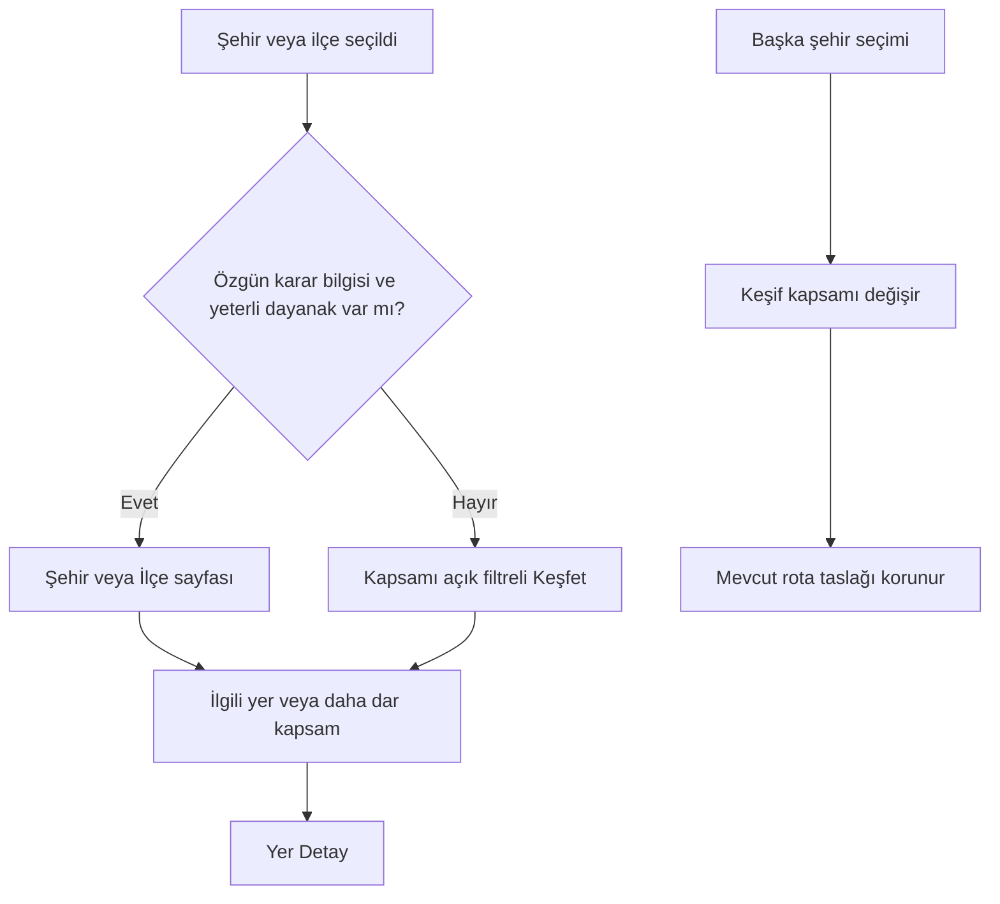
```mermaid
flowchart TD
    S["Şehir veya ilçe seçildi"] --> K{"Özgün karar bilgisi ve yeterli dayanak var mı?"}
    K -->|"Evet"| P["Şehir veya İlçe sayfası"]
    K -->|"Hayır"| F["Kapsamı açık filtreli Keşfet"]
    P --> A["İlgili yer veya daha dar kapsam"]
    F --> A
    A --> Y["Yer Detay"]
    D["Başka şehir seçimi"] --> B["Keşif kapsamı değişir"]
    B --> R["Mevcut rota taslağı korunur"]
```

## 7. E07 — Akıllı Rota

### Amacı

Seçilmiş ihtiyaç ve koşullarla bir günlük planı anlamlandırmak. Yer uygunluğu ile durakların zaman/ulaşım ilişkisini birleştirir; seyahat organizatörü değildir.

### Kullanıcının bu ekrana neden geldiği

Birden fazla yeri gününe sığdırmak, tek yerle plan yapmak, seçilmiş yerlerini sıraya koymak, kayıtlı rotayı yeniden kullanmak veya paylaşılan planı kendine uyarlamak ister.

### Çıkarken hangi kararı vermiş olmalı

Önerilen planı seçmek, düzenlemek, eksik bağlamı tamamlamak, çelişkili/tarihsiz haliyle taslak saklamak veya rota oluşturmamak. Kaydetmek uygulanabilirliği onaylamak değildir.

### Giriş noktaları

Keşfet'te açık rota isteği; Yer'de rotaya ekle; Kaydettiklerin → Rotalar; Gezeceğim'den seçili yerler; paylaşımda bağımsız kopya. Boş taslakla başlamak mümkündür.

### Çıkış noktaları

E08 düzenleyici, durak E04'ü, Rotalar kaydı, paylaşım önizlemesi, Keşfet'te yer ekleme ve açık kullanıcı seçimiyle dış yol tarifi. Gününü erken bitirme geçerli çıkıştır.

### Ana bileşenleri

Günlük amaç ve koşullar, seçilen duraklar, sıra, yer/saat/sıra sabitlemeleri, ulaşım bağlamı, süre aralıkları, maliyet kapsamı ve güncel değerlendirme. Bir ana öneri; istenirse en fazla iki anlamlı alternatif.

### Zorunlu bilgiler

Tarih veya tarihsiz taslak durumu; hangi yerin yerel saatinin kullanıldığı; bilinen başlangıç/bitiş; ziyaret, bekleme, geçiş ve açıkça istenmiş dönüş kapsamı; önemli çelişki ve bilinmeyenler. Başlangıç bilinmiyorsa ilk durağa ulaşım hesaba katılmış gibi gösterilmez.

### İkincil bilgiler

İsteğe bağlı ad, gerçek harita ilişkisi ve özel not. Ad otomatik editoryal onay kazanmaz. Tek durak ve boşluklar geçerlidir; gün doldurulmaz.

### Asla bulunmaması gereken bilgiler

“Kusursuz gün”, kuş uçuşundan kesin ulaşım, maliyeti bilinmeyeni sıfır sayma, seçili yeri otomatik zorunlu yapma, çok günlük otel/rezervasyon yönetimi, seri tamamlama baskısı.

### Loading durumu

Taslak ve kullanıcı kontrolü kalır; güncel değerlendirme beklenir. Eski toplamlar önceki değerlendirme diye ayrılır veya kaldırılır. Beklerken yeni düzenleme en güncel çalışma olur.

### Empty durumu

Boş günlük taslak kaydedilebilir. Son durak kaldırıldığında hata veya otomatik yeni öneri oluşmaz; istenirse yer ekleme veya çıkış vardır.

### Error durumu

Ulaşım hesabı, yer bilgisi ve kayıt hatası ayrı ele alınır. Zaman çelişkisi sistem arızası değildir. Başarısız değerlendirme kullanıcının seçtiği sırayı silmez.

### Offline davranışı

Yerel taslak ve saklanmış sıra okunup düzenlenebilir; güncel uygulanabilirlik ileri sürülmez. Daha önce alınan sürelerin tarihi ve kapsamı korunur; yeniden bağlanınca değerlendirme yenilenir.

### Premium etkisi

Temel üretim, düzenleme, adlandırma, kayıt, yeniden değerlendirme ve paylaşım ücretsizdir. İleri senaryo saklama gibi aday kolaylıklar aynı karar çekirdeğini kullanır; bu belge onları satışa açmaz.

### AI etkisi

İhtiyacı ve gerçek plan farklarını açıklayabilir. Uygunluk Karar Motoru'nun; günlük plan ilişkileri Akıllı Rota Motoru'nun sorumluluğudur. AI sessiz durak ekleyemez veya kilit gevşetemez.

## 8. E08 — Rota Düzenleme

### Amacı

Kullanıcının planına müdahalesini ve bu müdahalenin bütün gün üzerindeki etkisini aynı görevde takip etmek. Ayrı rota kopyası ancak açık kopyalama isteğiyle oluşur.

### Kullanıcının bu ekrana neden geldiği

Durak eklemek/çıkarmak, sıra veya süre değiştirmek, başlangıç belirlemek, zorunlu durağı ya da saati sabitlemek veya güncel bir engeli çözmek ister.

### Çıkarken hangi kararı vermiş olmalı

Yeni seçimini korumak/kaydetmek, önceki kişisel düzenlemeyi geri almak veya çözülmemiş farkı taslak olarak bırakmak. Başka sert koşulun değişmesine dair kararı sistem veremez.

### Giriş noktaları

E07'de açık düzenle; rota durağındaki işlem; ilgili bildirimden değişikliği incele; kayıtlı taslağa devam. Bildirim tıklaması kendiliğinden düzenleme değildir.

### Çıkış noktaları

Aynı E07 özeti, yer eklemek için aynı bağlamlı E02/E03, E04 incelemesi, kaydetme sonucu ve paylaşım için güncel önizleme.

### Ana bileşenleri

Düzenlenebilir durak sırası, görünür taşıma eylemleri, ayrı sabitleme seçimleri, zaman/koşul düzenlemesi, değişiklik etkisi ve geri alma.

### Zorunlu bilgiler

Değişen durak/sıra/alan, korunmuş zorunlu koşullar, yeniden değerlendirme durumu, günün bilinen zaman ve maliyet etkisi, hesabın hangi taslağa ait olduğu. Sürüklemenin eşdeğer taşıma yolu bulunur.

### İkincil bilgiler

Önceki kişisel seçimle kısa fark karşılaştırması ve anlamlı alternatif. Uzun kişisel sürüm arşivi temel geri alma ile aynı hak değildir.

### Asla bulunmaması gereken bilgiler

Sessiz “optimizasyon”, süre sığdırmak için görünmez ziyaret kısaltma, kullanıcı isteği olmadan dönüş ekleme, mevcut ziyareti yeniden yazma ve para ödemeden düzeltilemeyen çelişki.

### Loading durumu

Sıra hemen kullanıcının açık seçimini yansıtır; uygunluk sonucu bekler. Geç gelen yanıt yalnız ait olduğu taslağa uygulanabilir; yeni düzenlemeyi ezemez.

### Empty durumu

Son durak çıkarılınca boş taslak korunur. Yer ekleme önerisi yardımcıdır; devam zorunluluğu değildir.

### Error durumu

Kaydetme hatasında çalışma korunur. Çakışma olduğunda iki sürüm karşılaştırılır; diğer cihazın düzenlemesi sessizce kaybolmaz. “Beklemeyi bırak” gönderilmiş kaydı iptal etmiş sayılmaz.

### Offline davranışı

Yerel düzenleme açık cihaz kapsamıyla sürer. Güncel yol, saat veya uygunluk hesabı yapılamıyorsa belirtilir; önceki toplam yeni sıraya aitmiş gibi kalmaz.

### Premium etkisi

Taşıma, ekleme, çıkarma, temel geri alma ve güncel düzeltme ücretsizdir. Premium bitişi açık düzenleme görevini kesmez.

### AI etkisi

Değişen etkiyi açıklayabilir ve kullanıcının istediği alternatif üzerinde yardımcı olabilir. Taslağı kendi başına yayımlayamaz veya ihtiyaç sahibinin yerine ödün kabul edemez.

### Diyagram 04 — Günlük rota ve düzenleme döngüsü

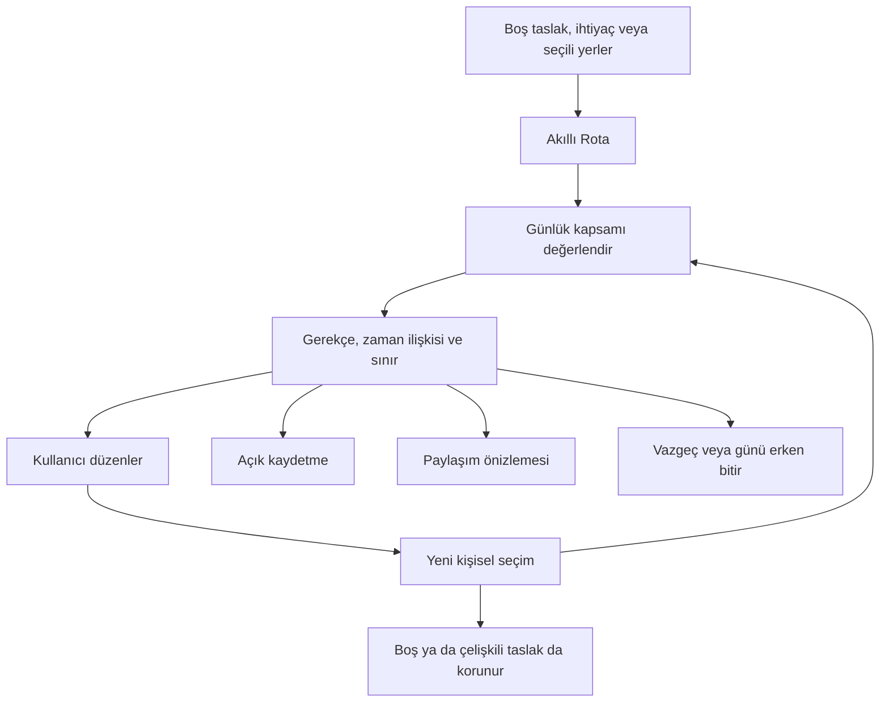
```mermaid
flowchart TD
    A["Boş taslak, ihtiyaç veya seçili yerler"] --> R["Akıllı Rota"]
    R --> D["Günlük kapsamı değerlendir"]
    D --> K["Gerekçe, zaman ilişkisi ve sınır"]
    K --> E["Kullanıcı düzenler"]
    E --> N["Yeni kişisel seçim"]
    N --> D
    K --> S["Açık kaydetme"]
    K --> P["Paylaşım önizlemesi"]
    K --> X["Vazgeç veya günü erken bitir"]
    N --> B["Boş ya da çelişkili taslak da korunur"]
```

### Diyagram 05 — Düzenleme ile değerlendirme durumları

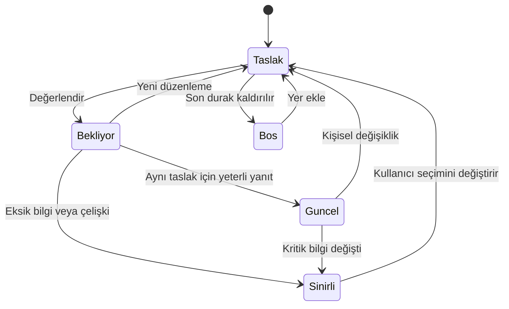
```mermaid
stateDiagram-v2
    [*] --> Taslak
    Taslak --> Bekliyor: Değerlendir
    Bekliyor --> Guncel: Aynı taslak için yeterli yanıt
    Bekliyor --> Sinirli: Eksik bilgi veya çelişki
    Bekliyor --> Taslak: Yeni düzenleme
    Guncel --> Taslak: Kişisel değişiklik
    Guncel --> Sinirli: Kritik bilgi değişti
    Sinirli --> Taslak: Kullanıcı seçimini değiştirir
    Taslak --> Bos: Son durak kaldırılır
    Bos --> Taslak: Yer ekle
```

## 9. E09 — Gezeceğim Yerler

### Amacı

İleride değerlendirilmek istenen yerleri özel bir niyet havuzunda tutmak. Başlıktaki gelecek ifade taahhüt veya son tarih değildir.

### Kullanıcının bu ekrana neden geldiği

Kaydettiğini bulmak, niyetini düzenlemek, yerin güncel durumuna bakmak veya seçtiği yerlerle günlük plan başlatmak ister.

### Çıkarken hangi kararı vermiş olmalı

Yer ayrıntısını açmak, niyeti korumak/kaldırmak, temel koleksiyona ayırmak veya belirli yerleri rotaya taşımak. Hepsini gezmek hedef değildir.

### Giriş noktaları

Keşfet → Kaydettiklerin → Gezeceğim Yerler; kayıt teyidinden ilgili listeye dönüş; Profil'den aynı kayıt bağlamına geçiş; kapsamı geçerli özel bağlantı.

### Çıkış noktaları

E04, seçili yerlerle E07, Kaydettiklerin'in diğer türleri, temel koleksiyon düzenlemesi ve E02. Yer eklemek varsayılan olarak ziyaret veya Bir İz oluşturmaz.

### Ana bileşenleri

Niyet kayıtları, kapsamlı liste içi arama/filtre, isteğe bağlı koleksiyonlar, kaldırma/geri alma, seçili yerlerle rota başlatma ve kayıt hedefi durumu.

### Zorunlu bilgiler

Yer kimliği; cihaz/hesap sahipliği; niyet olduğu; varsa yayından kalkma/kapanma sınırı; kayıt işleminin gerçek durumu. Filtreli boşluk ile bütün listenin boşluğu ayrılır.

### İkincil bilgiler

İsteğe bağlı not, kayıt zamanı biliniyorsa zaman, kullanıcı seçtiği gruplama. Kayıt zamanı ziyaret tarihi değildir.

### Asla bulunmaması gereken bilgiler

Tamamlama yüzdesi, kaçırılan gezi bildirimi, zorunlu tarih, sosyal beğeni veya kaydedilen yere güncel uygunluk garantisi.

### Loading durumu

Mevcut yerel kayıtlar varsa okunur; uzak eşitleme ayrı bekler. Yüklenmeyen hesap arşivi boş liste diye gösterilmez.

### Empty durumu

“Henüz kaydettiğin yer yok” ile “Bu filtrede kayıt yok” ayrılır. Keşfe dönüş veya filtreyi değiştir yeterlidir; hesap/Premium baskısı kurulmaz.

### Error durumu

Kayıt kaldırma teyitsizse sonucu belirsiz anlatılır. Yanlış yer kimliği diğer şubeye sessiz taşınmaz; asgari kimlik ve düzeltme yolu korunur.

### Offline davranışı

Yerel niyetler okunur/düzenlenir; uzak kayda geçiş bekleyen durumdadır. Yeni yer bilgisinin doğrulandığı söylenmez.

### Premium etkisi

Temel kayıt, kişisel gruplama, kaldırma ve tekrar açma ücretsizdir. Sınırsızlık/kota uydurulmaz; ileri toplu düzenleme ancak ayrı kabul ile açılır.

### AI etkisi

Açık istekle niyetleri bulmaya veya gruplamaya yardım edebilir. Kullanıcının yerine niyet silmez, rota zorunluluğu veya davranış profili üretmez.

## 10. E10 — Gezdiğim Yerler

### Amacı

Kişinin açıkça bildirdiği geçmiş ziyaretleri özel hafıza olarak tutmak. Ziyaret doğrulama, memnuniyet veya kamusal kanıt sistemi değildir.

### Kullanıcının bu ekrana neden geldiği

Bir ziyareti kaydetmek/düzeltmek, daha önce gittiği yeri bulmak, tekrar gitme niyeti eklemek veya isterse somut gözlem vermek ister.

### Çıkarken hangi kararı vermiş olmalı

Ziyaret beyanını saklamak/düzeltmek/kaldırmak, aynı yeri yeniden değerlendirmek veya katkıdan bağımsız devam etmek.

### Giriş noktaları

Kaydettiklerin → Gezdiğim Yerler; Yer'de açık “Buradaydım” beyanı; belirli rota durağı için ziyaret işareti; Profil'den kayıt erişimi.

### Çıkış noktaları

E04, E11 isteğe bağlı Bir İz, E09'a ayrı tekrar niyeti, Kaydettiklerin ve ilgili rotanın belirli durağı. Genel geçmiş beyanı bugünkü rota durağını kendiliğinden tamamlamaz.

### Ana bileşenleri

Ziyaret kayıtları, gerçek yer kimliği, biliniyorsa tarih/zaman, düzeltme/kaldırma, tekrar niyeti ve isteğe bağlı katkı erişimi.

### Zorunlu bilgiler

Kullanıcının ziyaret beyanı olduğu; doğru yer; tarih bilinmiyorsa bilinmediği; tekrar ziyaretlerin ayrı olay olabilmesi. Aynı işleme tekrar basmak yeni ziyaret üretmez.

### İkincil bilgiler

Kişisel not ve isteğe bağlı koleksiyon. Geçmiş ziyaretin koşulları bugünkü bilgiyle sessizce yeniden yazılmaz.

### Asla bulunmaması gereken bilgiler

Konumdan otomatik ziyaret, yol tarifini açmayı ziyaret sayma, “gezdiyse beğendi” çıkarımı, şehir bitirme rozeti, kamuya ziyaret haritası.

### Loading durumu

Yüklü geçmiş korunur; yeni sayfa veya hesap kaydı ayrı bekler. Eski bir yerin güncel bilgisi gelene kadar ziyaret hafızası yokmuş gibi davranılmaz.

### Empty durumu

Hiç ziyaret kaydı tutmamak geçerli kullanımdır. Kullanıcı isterse açık beyan ekler; konum izni veya hesap oluşturma zorlanmaz.

### Error durumu

Kaydın yanlış kimliğe bağlanması ve gönderim hatası ayrılır. Kaldırma sırasında Bir İz'in ayrıca geri çekilmesi istenirse kapsam birlikte açıklanır.

### Offline davranışı

Yerel ziyaret beyanı girilebilir; bilinmeyen tarih otomatik bugüne atanmaz. Uzak kaydın tamamlandığı teyitsiz söylenmez.

### Premium etkisi

Temel geçmiş tutma, düzeltme, silme ve erişim ücretsizdir. Premium sona ermesi geçmişi saklayamaz veya katkı vermeyi zorlayamaz.

### AI etkisi

Kullanıcı isterse kendi kayıtlarını aramayı kolaylaştırabilir. GPS, fotoğraf veya davranıştan ziyaret yaratamaz; geçmişten sert ihtiyaç varsayamaz.

## 11. E11 — Bir İz bırak

### Amacı

Gönüllü, somut ve sınırlı bir gözlemi bilgi incelemesine katkı olarak almak. Ürün içindeki ziyaret hafızasından ayrı sorumluluktur.

### Kullanıcının bu ekrana neden geldiği

Gerçek ziyaretinden belirli bir koşulu aktarmak veya uygun bir katkı davetini kabul etmek ister. Katkı reddi aynı ziyaret için tekrar baskıya dönüşmez.

### Çıkarken hangi kararı vermiş olmalı

Gözlemi göndermek, vermemek veya gönderilmiş katkısını geri çekmek. Gönderim yalnız alınma teyididir; doğruluk/yayın kararı değildir.

### Giriş noktaları

E04, açık ziyaret sonrası E10 ve belirli rota durağı. Ziyaret beyanı zaten biliniyorsa yeniden sorulmaz; yalnız kayıt niyeti varsa ziyaret varsayılmaz.

### Çıkış noktaları

Açan Yer/ziyaret/rota bağlamı; isteğe bağlı zaman/alan ayrıntısı; katkı yönetim erişimi ve gerekirse Yardım.

### Ana bileşenleri

Gerekliyse “Bugün / Başka bir zaman / Gitmedim” bağlamı; tek nötr gözlem sorusu; gözlemlemedim seçeneği; gönder/vazgeç; alındı ve geri çekme durumu.

### Zorunlu bilgiler

Hangi yere ve koşula katkı verildiği; gerekli ziyaret bağlamı; gönüllülük; kamusal yorum olmadığı; gönderim ve yönetim kapsamı. “Gitmedim” bu ziyaret gözlemini göndermez, uygun düzeltme/destek yolu ayrı açılabilir.

### İkincil bilgiler

İsteğe bağlı saat, alan ve açıklayıcı ayrıntı. Yaklaşık iki seçim/beş saniye hedefi 07–09'daki araştırma varsayımıdır; sayaç veya garanti değildir.

### Asla bulunmaması gereken bilgiler

Yıldız, genel memnuniyet, yayınlanacak yorum kutusu, diğer kişilerin cevapları, olumlu iddiayı onaylatan yönlendirme, katkı sayısına statü/ödül.

### Loading durumu

Soru/bağlam korunur; gönderim beklerken aynı gözlem çoğaltılmaz. İnceleme sonucu bekleme ekranında tutulmaz; alındıktan sonra kullanıcı ayrılabilir.

### Empty durumu

Uygun soru yoksa uydurulmaz. Katkı vermemek veya gözlemlememiş olmak boşluğu doldurması gereken bir kusur değildir.

### Error durumu

Yanıt kaybolduysa önce mevcut gönderim kontrol edilir. Geri çekmenin türevlerdeki etkisi tamamlanmadan bütünüyle silindi denmez; kayıt ile inceleme sonucu ayrılır.

### Offline davranışı

Açıkça istenmiş gönderim yerelde bekleyebilir; bekleyen kapsam ve iptal yolu vardır. Yeniden bağlantıda iptal edilmemiş yetkili gönderim sürdürülebilir; kapatılmış taslak sessizce yeniden gönderilmez.

### Premium etkisi

Katkı, vazgeçme, yönetme ve geri çekme ücretsizdir. Ücretli katkı daha güçlü kanıt veya daha hızlı doğrulama kazanmaz.

### AI etkisi

İzinli gözlemi inceleme için yapılandırabilir; gerçek beyanı genişletemez veya yayınlayamaz. AI desteği olmasa da insan inceleme sorumluluğu sürer.

### Diyagram 06 — Niyet, ziyaret ve katkı ayrımı

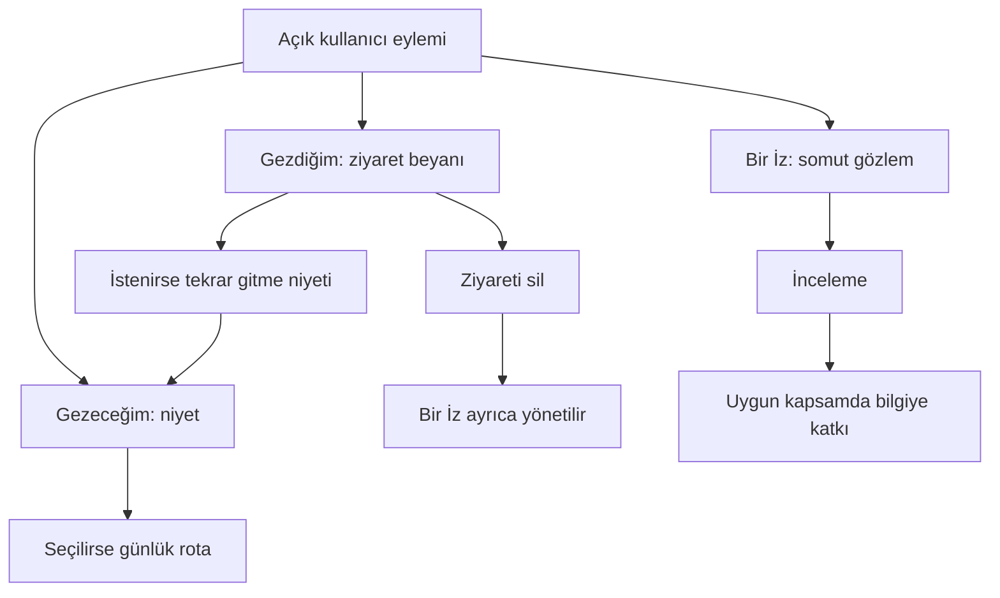
```mermaid
flowchart TD
    U["Açık kullanıcı eylemi"] --> N["Gezeceğim: niyet"]
    U --> V["Gezdiğim: ziyaret beyanı"]
    U --> Z["Bir İz: somut gözlem"]
    N --> R["Seçilirse günlük rota"]
    V --> T["İstenirse tekrar gitme niyeti"]
    T --> N
    Z --> I["İnceleme"]
    I --> B["Uygun kapsamda bilgiye katkı"]
    V --> S["Ziyareti sil"]
    S --> A["Bir İz ayrıca yönetilir"]
```

### Diyagram 07 — Bir İz akışı

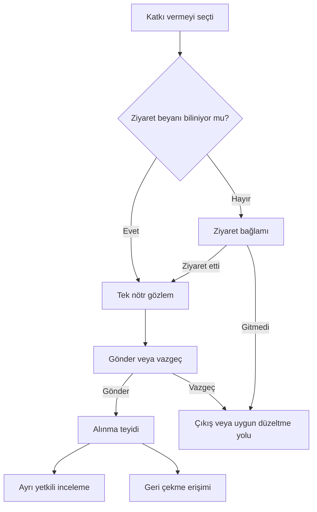
```mermaid
flowchart TD
    A["Katkı vermeyi seçti"] --> B{"Ziyaret beyanı biliniyor mu?"}
    B -->|"Evet"| D["Tek nötr gözlem"]
    B -->|"Hayır"| C["Ziyaret bağlamı"]
    C -->|"Ziyaret etti"| D
    C -->|"Gitmedi"| X["Çıkış veya uygun düzeltme yolu"]
    D --> E["Gönder veya vazgeç"]
    E -->|"Gönder"| F["Alınma teyidi"]
    F --> I["Ayrı yetkili inceleme"]
    F --> G["Geri çekme erişimi"]
    E -->|"Vazgeç"| X
```

## 12. E12 — Profil

### Amacı

Kişinin kendi kayıtlarına, hesap durumuna ve kontrol haklarına anlaşılır erişim sağlamak. Kişiyi başkalarına tanıtan sosyal profil değildir.

### Kullanıcının bu ekrana neden geldiği

Kayıtlarının nerede saklandığını öğrenmek, hesabını yönetmek, paylaşım/katkı kontrolüne dönmek veya isteğe bağlı hizmet durumunu görmek ister.

### Çıkarken hangi kararı vermiş olmalı

İlgili kişisel göreve girmek, cihaz kaydıyla devam etmek, hesabına giriş yapmak ya da veri kontrolü/çıkış işlemini seçmek.

### Giriş noktaları

Kaydettiklerin'deki hesap/kayıt kontrolü, kullanıcı tarafından açılan hesap erişimi ve özel profil adresi. Yeni bir ana menü portalı oluşturmaz.

### Çıkış noktaları

Kaydettiklerin'in üç türü; E15 Ayarlar; E16/E17; E13 varsa abonelik; kendi paylaşımları ve Bir İz yönetimi; E22.

### Ana bileşenleri

Cihaz/hesap durum özeti, kişisel kayıt erişimleri, paylaşım ve katkı yönetimine bağlantılar, tercih/hesap işlemleri. Burada kayıtların ikinci kopyası oluşturulmaz.

### Zorunlu bilgiler

Hangi hesabın/cihazın kapsamının açık olduğu, saklama sınırı, oturum durumu ve temel veri haklarına erişim. Misafirde boş “kullanıcı adı” profili uydurulmaz.

### İkincil bilgiler

İsteğe bağlı hesap adı ve gerçek abonelik durumu. Fotoğraf, biyografi ve kamusal kullanıcı adı bu mimari için gerekli değildir.

### Asla bulunmaması gereken bilgiler

Takipçi, rozet, gezi sıralaması, paylaşılmış ziyaret haritası, katkı güven puanı, başka kullanıcıya görünür sağlık/ihtiyaç profili.

### Loading durumu

Hesap kapsamı doğrulanırken özel kayıtlar açılmaz; kamusal keşif sürer. Cihaz kayıtları hesap verisiymiş gibi gösterilmez.

### Empty durumu

Misafirlik normal durumdur. Kayıt yoksa ilgili boş görev açıklanır; profil doldurma veya üyelik ilerleme göstergesi yoktur.

### Error durumu

Hesap durumu alınamıyorsa abonelik veya kayıt yok sayılmaz. Yeniden doğrulama yalnız özel erişim için istenir; önceki görev korunur.

### Offline davranışı

İzinli cihaz kayıtları ve yerel tercihler erişilebilir. Hesap özel önbelleği yalnız mevcut erişim koşullarıyla açılır; çıkış sonrası tekrar görünmez.

### Premium etkisi

Varsa mevcut hizmet bilgisi ve yönetim bağlantısı yer alır. Temel veri kontrolü ve kullanıcı değeri ücretle derecelendirilmez.

### AI etkisi

Profil üretmez, kişilik veya gezi tipi atamaz. Açık istekle kişisel kaydı bulmaya yardım etmesi hesabın tamamını işlemesine izin vermez.

## 13. E13 — Premium

### Amacı

Gerçekten kabul edilip açılmış ek kolaylığı, maliyetini ve sona erme etkisini kullanıcı seçimiyle açıklamak. Karar kalitesi satılmaz.

### Kullanıcının bu ekrana neden geldiği

Belirli bir ek kolaylığı merak eder, kapsamını karşılaştırır veya varsa kendi aboneliğini yönetmek ister. Sonuçsuz arama buraya zorunlu giriş değildir.

### Çıkarken hangi kararı vermiş olmalı

Mevcut ücretsiz görevle devam etmek, gerçekten sunulan kolaylığı seçmek veya mevcut hizmetini yönetmek/iptal etmek. Paket henüz yoksa yalnız durum anlaşılır.

### Giriş noktaları

Kullanıcının açık hizmet bilgisi isteği; Profil'deki mevcut abonelik; yalnız gerçek ek kolaylık seçildiğinde bağlamlı açıklama.

### Çıkış noktaları

Açan ücretsiz görev, varsa kapsamı doğrulanmış satın alma alt akışı, abonelik yönetimi, Yardım. Satın alma için gerekli doğrulama sonrası aynı somut kapsam geri açılır.

### Ana bileşenleri

Ücretsiz temel haklar, yalnız mevcut ek kolaylıklar, toplam maliyet/dönem/yenileme koşulları varsa bunlar, iptal ve mevcut kayıtlara etkisi. Teklif yoksa satış eylemi yoktur.

### Zorunlu bilgiler

Ücretin hangi tekrar işini azalttığı; bilginin/kararın aynı kaldığı; satın alma öncesi gerçek toplam ve kapsam; mevcut hizmetin doğrulanmış durumu; iptal yolu. Bu belge fiyat, kota ve sağlayıcı uydurmaz.

### İkincil bilgiler

Kullanıcı işine dayalı örnek ve ücretsiz alternatifle somut kolaylık farkı. Araştırılan özellikler sunulan hak gibi listelenmez.

### Asla bulunmaması gereken bilgiler

Daha doğru AI, gizli iyi yerler, ücretli zorunlu filtre, kritik güncellik önceliği, yapay geri sayım, emeği kaybetme tehdidi veya gerçekte olmayan indirim.

### Loading durumu

Teklif ve hesap hakkı doğrulanmadan eski fiyatla işlem başlatılmaz. Ödeme sonucu beklerken tek işlem durumu korunur.

### Empty durumu

Hizmet satışa açılmadıysa bu açıklanır; sahte paket ya da ödeme eylemi yoktur. Aboneliği olmayan kullanıcı eksik statüde değildir.

### Error durumu

Ödeme sonucu belirsizse tekrar ödeme yerine mevcut sonuç kontrol edilir. Hizmet durumu hatası temel keşfi veya kayıt kontrolünü engellemez.

### Offline davranışı

Saklanmış kapsam açıklaması tarih sınırıyla okunabilir; yeni ödeme veya iptal tamamlanmış sayılmaz. Uzaktan işlem teyidi gerektiren eylem bağlantı bekler.

### Premium etkisi

Bu ekran yalnız ek hizmetin sınırını yönetir. Sona ermede temel kayıt okuma, düzenleme, yeniden değerlendirme, dışa alma ve paylaşımı kapatma korunur.

### AI etkisi

İstenirse gerçek kapsam farkını sadeleştirir; kişisel kırılganlığa göre satış, fiyat belirleme, hak verme veya iptali zorlaştırma yapamaz.

## 14. E14 — Bildirimler

### Amacı

Kararı değiştiren anlamlı olaylara ve kullanıcının açıkça istediği hatırlatmalara dönmek. Etkileşim artırma akışı değildir.

### Kullanıcının bu ekrana neden geldiği

Aktif plandaki bilgide ne değiştiğini, tamamlanmamış işlemini veya seçtiği hatırlatmayı incelemek ister.

### Çıkarken hangi kararı vermiş olmalı

Değişikliği anlamak, ilgili görevi düzeltmek, ertelemek veya bildirim tercihini değiştirmek. Okumak durak sırasını değiştirmeye onay değildir.

### Giriş noktaları

İzinli sistem bildirimi, ilgili görevde olay erişimi ve kendi bildirimler bağlantısı. İzin isteği açılışta değil kişi ilgili bildirim işini seçince yapılır.

### Çıkış noktaları

İlgili Yer, rotanın etkilenen durağı, kayıt/işlem durumu ve E15 bildirim tercihleri. Hedef kaldırıldıysa olayın özel bilgi sızdırmayan açıklaması ve anlamlı çıkış.

### Ana bileşenleri

Olayın nedeni, gerçekleşme zamanı biliniyorsa zaman, ilgili kayıt, okunma durumu, çözülme durumu ve tercih erişimi.

### Zorunlu bilgiler

Ne değiştiği, hangi kararı etkilediği, önemli sınır ve ilgili eylem. Teslim/okunma/çözülme birbirinden ayrıdır; bildirim gelmemesi planın güncellik garantisi değildir.

### İkincil bilgiler

Aynı değişiklik grubundaki önceki olayların kısa bağlamı. Tek olay tekrarlı bildirimlerle çoğaltılmaz.

### Asla bulunmaması gereken bilgiler

Trend, ziyaret serisi, kaçırma korkusu, Premium satış bildirimi, kilit ekranında ev/otel başlangıcı veya özel sağlık/grup ihtiyacı.

### Loading durumu

Mevcut olaylar okunur; yeniler ayrı yüklenir. Sayaç bilinmiyorsa sıfır yazılmaz; yeni olay odağı çalmaz.

### Empty durumu

Bildirim yokluğu olumlu güven değerlendirmesi değildir. Boşluğu kampanya veya öneriyle doldurmak gerekmez.

### Error durumu

Olay servisi arızası ilgili Yer/rota üzerindeki kritik bilgi açıklamasını engellemez. Okunma kaydı başarısızsa çözülmüş sayılmaz.

### Offline davranışı

Yerel olaylar okunur; hedefin güncel durumu bağlantıda yeniden kontrol edilir. Okundu işareti yerel olabilir, uzak teyit ayrı kalır.

### Premium etkisi

Kritik düzeltme ve temel hak olayları eşittir. Ücretli kullanıcı daha erken doğruluk uyarısı satın alamaz.

### AI etkisi

Gerçek değişikliğin nedenini kısaltabilir; olay icat edemez, kullanıcı yerine rota çözümü uygulayamaz veya bildirimden profil üretemez.

## 15. E15 — Ayarlar

### Amacı

Cihaz tercihi, hesap erişimi, veri ve paylaşım kontrolünü ilgili kapsamıyla yönetmek. Karar motorunu ticari veya gizli tercihlerle değiştirme alanı değildir.

### Kullanıcının bu ekrana neden geldiği

Dil/tema gibi tercihleri, bildirim izinlerini, geçmiş saklamayı, oturumlarını veya kişisel veri haklarını düzenlemek ister.

### Çıkarken hangi kararı vermiş olmalı

Hangi ayarın hangi cihaz/hesap üzerinde değiştiğini anlamış, değişikliği uygulamış veya vazgeçmiş olmalıdır. Hesaptan çıkmak ve hesap silmek ayrı kararlardır.

### Giriş noktaları

Profil, bildirim tercihi bağlantısı, arama geçmişi yönetimi ve ilgili görevde doğrudan ayar erişimi.

### Çıkış noktaları

Açan görev; E18 şifre; oturum yönetimi; kişisel veri dışa alma/silme alt görevleri; E22/E23 ve mevcut Gizlilik/Kullanım Koşulları destek belgeleri.

### Ana bileşenleri

Cihaz tercihleri, hesap tercihleri, geçmiş yönetimi, oturumlar, izin durumu ve veri kontrolü. Bir İz ile canlı paylaşım yönetimine anlamlı erişim bulunur.

### Zorunlu bilgiler

Ayarın kapsamı, gerçek uygulanma durumu, işlemin geri dönüşü ve silmede etkilenen kişisel kayıt/katkı/paylaşım. Saklama süreleri kabul edilmeden kesin süre vaat edilmez.

### İkincil bilgiler

Son başarılı eşitleme bilgisi varsa kapsamıyla; yardım açıklaması ve dışa alma durumu. Teknik altyapı adları kullanıcı kararına hizmet etmiyorsa yer almaz.

### Asla bulunmaması gereken bilgiler

Varsayılan açık pazarlama izni, gizlenmiş iptal/silme, ödeme karşılığı erişilebilirlik, bütün kişisel veriye gereksiz otomatik onay.

### Loading durumu

Yerel tercih değişimi uzak hesap yanıtını gereksiz beklemez. Uzak ayarda bekleme ve teyit ayrılır; alanlar kontrolsüz kapanmaz.

### Empty durumu

Hesap olmayan misafir için cihaz tercihleri vardır. Yönetilecek oturum veya veri yoksa yalnız ilgili durum açıklanır.

### Error durumu

Başarısız ayar mevcut doğrulanmış durumuyla kalır veya açık geri dönüş gösterir. Hesap silme isteğinin yalnız ilk aşaması tamamlandıysa bütün silme tamamlandı denmez.

### Offline davranışı

Yerel tercihler uygulanır. Uzak oturum kapatma ve hesap silme teyitsiz tamamlanamaz; bekleyen istek ve iptal/sonuç kontrol yolu ayrıdır.

### Premium etkisi

Tercih, mahremiyet, erişim kapatma ve kişisel veri kontrolü ücretsizdir. Sona erme bu yolların kapsamını daraltmaz.

### AI etkisi

Ayarları kullanıcı adına değiştirmez. Gereken yardım yalnız gerçek işlem etkisini açıklar; özel veri silme kararının otoritesi değildir.

## 16. E16 — Giriş

### Amacı

Kullanıcının açıkça istediği hesap kapsamına erişimini doğrulamak ve kesilen göreve dönmesini sağlamak. Kamusal keşfin kapısı değildir.

### Kullanıcının bu ekrana neden geldiği

Hesap kayıtlarını açmak, hesapta saklamak, yetkili iç göreve erişmek veya süresi biten özel erişimini yeniden doğrulamak ister.

### Çıkarken hangi kararı vermiş olmalı

Doğru hesapla devam etmek, kayıt akışına geçmek, şifre kurtarmak ya da misafir olarak önceki işe dönmek. Giriş yapmak yerel veriyi otomatik hesaba aktarmaz.

### Giriş noktaları

Profil'deki açık giriş; hesap kaydı talebi; özel deep link; oturum süresi biten hesap işlemi; yetkili iç operasyon girişi.

### Çıkış noktaları

Yetkisi doğrulanmış asıl hedef, E17, E18 veya güvenli önceki misafir bağlamı. Dönüş hedefi yalnız izinli uygulama hedefidir; dışarıdan gelen keyfî yönlendirme çalıştırılmaz.

### Ana bileşenleri

Giriş nedeni, desteklenen kimlik yöntemi, gerekli doğrulama, şifre/kayıt bağlantısı, vazgeçme ve korunmuş görev özeti. Sağlayıcı adları seçilmeden varsayılmaz.

### Zorunlu bilgiler

Hangi hesap işinin açılacağı; desteklenen gerekli alanlar; gerçek işlem durumu; yanlış hesap riskinde ayırt edici hesap kimliği. Özel deep link içeriği giriş öncesi gösterilmez.

### İkincil bilgiler

İlgili Yardım ve oturumun cihaz kapsamı. Parola yöneticisi, yapıştırma ve erişilebilir otomatik doldurma engellenmez.

### Asla bulunmaması gereken bilgiler

Zorunlu Premium seçimi, gezi tercihi anketi, pazarlama onayı, başka hesabın varlığını ifşa eden hata ayrıntısı veya açık parola.

### Loading durumu

Tek doğrulama isteği takip edilir; parola veya doğrulama sırrı durum mesajına yazılmaz. Beklemeyi bırakma uzaktaki işlemi iptal ettiğini iddia etmez.

### Empty durumu

Boş giriş formu normaldir. Hesap bulunamadığına dair kişi ifşa eden sonuç yerine uygun nötr yardım ve kurtarma yolu korunur.

### Error durumu

Alan hatası ile erişim/servis sorunu ayrılır. Başarısız giriş rota taslağını kaybettirmez; sınırlanmış denemelerde gerçek bekleme koşulu varsa açıklanır, uydurulmaz.

### Offline davranışı

Yeni uzak oturum doğrulanamaz. İzinli yerel misafir çalışma sürer; özel hesabın erişimi çevrimdışı gerekçesiyle aşılmaz.

### Premium etkisi

Giriş ücretsizdir; Premium hesap doğrulamasını atlatmaz veya rol vermez.

### AI etkisi

Kimlik, parola veya yetki kararı vermez. Giriş formu AI sohbeti gerektirmez; sırlar model bağlamına taşınmaz.

## 17. E17 — Kayıt

### Amacı

Kullanıcı gerçekten hesap istediğinde asgari veriyle hesap oluşturmak. İlk yer kararından önce zorunlu adım değildir.

### Kullanıcının bu ekrana neden geldiği

Kendi kayıtlarına hesap üzerinden erişmek veya gerçekten mevcut hesap hizmetini kullanmak ister. Misafir yerel kaydının kalıcılık sınırını görmüş olabilir.

### Çıkarken hangi kararı vermiş olmalı

Hesap oluşturmak ve gerekli doğrulamayı tamamlamak, mevcut hesabına girmek ya da misafir devam etmek. Yerel veriyi aktarma ayrı kapsam seçimidir.

### Giriş noktaları

E16'daki kayıt yolu, Profil ve kullanıcının seçtiği hesapta saklama işi. Kayıt istemeyen kişi çekirdek göreve dönebilir.

### Çıkış noktaları

Gerekliyse hesap doğrulama alt durumu, yerel kayıt aktarım incelemesi, asıl görev, E16 veya misafir çalışma.

### Ana bileşenleri

Hesabın yararı/sınırı, yalnız gerekli kimlik alanları, seçilmiş yöntemin doğrulaması, zorunlu hizmet koşulları ve ayrı isteğe bağlı izinler.

### Zorunlu bilgiler

Hesap açma amacı; gerekli ve isteğe bağlı alan ayrımı; kişisel veri kapsamına erişim; gerçek oluşturma/doğrulama durumu. Bu belge yeni sözleşme veya hukuki uygunluk iddiası üretmez.

### İkincil bilgiler

İsteğe bağlı ad ve ilgili yardım. İlgi alanı, fotoğraf, doğum tarihi veya arkadaş bulma bu hesap işinin gereği değildir.

### Asla bulunmaması gereken bilgiler

Önceden seçilmiş ticari izin, zorunlu kişi rehberi/konum, profil tamamlama puanı, temel kayıt için ödeme talebi.

### Loading durumu

Hesap oluşturma ve doğrulama gönderimi ayrı durumdur. Yanıt kaybında ikinci hesap açmaya yöneltmeden sonuç kontrol edilir.

### Empty durumu

Alanların ilk boşluğu normaldir. Kullanıcı veri aktarmak istemiyorsa hesap boş kalabilir; zorla keşif kaydı eklenmez.

### Error durumu

Doğru alanlar ve asıl görev korunur; sırrın uygunsuz kalıcılığına izin verilmez. Doğrulama bağlantısı süresi bitmişse güvenli yeniden gönderim yolu vardır.

### Offline davranışı

Yeni hesap oluşturuldu denmez; yerel keşif/taslak sürer. Parola çevrimdışı aktarım kuyruğunda süresiz tutulmaz.

### Premium etkisi

Hesap ve temel kontrol için zorunlu paket seçilmez. Cihazlar arası kolaylığın ticari kapsamı 09'a göre ayrı araştırma konusudur.

### AI etkisi

Formu dolduracak profil tahmini yapmaz, izinleri seçmez, kimlik doğrulamaz. Sabit açık yardım yeterlidir.

## 18. E18 — Şifre

### Amacı

Şifre kullanan hesaplarda erişim kurtarma veya doğrulanmış değiştirme görevini tamamlamak. Desteklenen yöntem şifre kullanmıyorsa sahte şifre akışı açılmaz.

### Kullanıcının bu ekrana neden geldiği

Şifresini hatırlamıyordur, değiştirmek istiyordur veya geçerli kurtarma bağlantısı açmıştır.

### Çıkarken hangi kararı vermiş olmalı

Kurtarma talebini başlatmak, doğrulanmış yetkiyle yeni şifreyi belirlemek veya Yardım'a dönmek. Talep alındı mesajı hesap erişiminin açıldığı anlamına gelmez.

### Giriş noktaları

E16, E15 güvenlik görevi ve doğrulanabilir kurtarma bağlantısı. Kurtarma sırrı sıradan paylaşım veya arama geçmişi değildir.

### Çıkış noktaları

Gerekli kimlik doğrulaması, E16, Ayarlar'daki oturum kontrolü veya E22. Önceki görev bağlamı yetkiyle ve sır içermeden döndürülür.

### Ana bileşenleri

Kurtarma talebi, nötr gönderim sonucu, bağlantı geçerliliği, yeni şifre girişi ve işlem sonucu. Değiştirme ile kurtarma ayrı alt durumlardır.

### Zorunlu bilgiler

Hangi işlem yapıldığı, gereken doğrulama ve geçerlilik durumu; değişim sonrası diğer oturumların etkisi gerçek hesap politikasıyla açıklanır. Desteklenmeyen otomatik oturum kapatma sözü yoktur.

### İkincil bilgiler

Parola yöneticisiyle uyumlu yardım ve erişim sorunu desteği. Kesin şifre kuralları kimlik politikası belirlenmeden uydurulmaz.

### Asla bulunmaması gereken bilgiler

Mevcut şifreyi gösterme/mesajla gönderme, kimlik kontrolünü atlatma, kurtarma sırrını günlük/geçmişe kaydetme, hesap varlığını ifşa etme.

### Loading durumu

Talep, doğrulama ve değiştirme ayrı izlenir. Belirsiz değiştirme sonucunda kullanıcı tekrar tekrar yeni şifre göndermeye zorlanmaz.

### Empty durumu

Eksik bağlantı bilgisi boş başarı değildir; güvenli yeni kurtarma başlangıcı sunulur.

### Error durumu

Geçersiz, kullanılmış veya süresi bitmiş bağlantı yeni talebe götürür; eski sır yeniden etkinleştirilmez. Hata hesabın özel kayıtlarını açmaz.

### Offline davranışı

Uzak geçerlilik kontrolü ve şifre değişimi tamamlanamaz. Bağlantı tekrar çevrimiçi doğrulanır; yerel hesap sırrı üretip kabul edilmiş sayılmaz.

### Premium etkisi

Kurtarma ve güvenli hesap kontrolü ücretsizdir; ücretli ayrıcalık doğrulama sınırını aşamaz.

### AI etkisi

Şifre, kurtarma kodu veya oturum sırrı AI'ye verilmez. AI kimlik kurtarma otoritesi değildir.

### Diyagram 08 — Kimlik doğrulama ve göreve dönüş

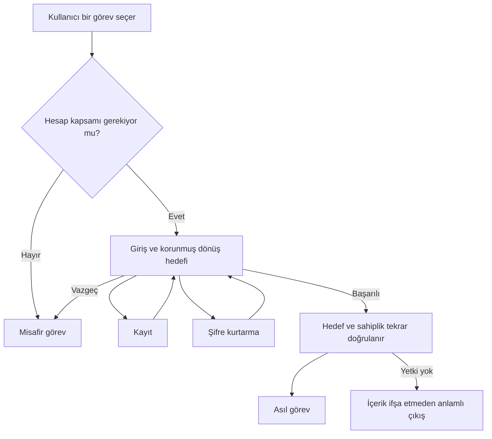
```mermaid
flowchart TD
    A["Kullanıcı bir görev seçer"] --> K{"Hesap kapsamı gerekiyor mu?"}
    K -->|"Hayır"| M["Misafir görev"]
    K -->|"Evet"| G["Giriş ve korunmuş dönüş hedefi"]
    G --> R["Kayıt"]
    G --> S["Şifre kurtarma"]
    R --> G
    S --> G
    G -->|"Başarılı"| Y["Hedef ve sahiplik tekrar doğrulanır"]
    Y --> D["Asıl görev"]
    G -->|"Vazgeç"| M
    Y -->|"Yetki yok"| H["İçerik ifşa etmeden anlamlı çıkış"]
```

## 19. E19 — Onboarding

### Amacı

Kullanıcı ihtiyaç duyduğunda ürünün kısa yolunu ve alışılmadık kayıt/katkı ayrımlarını öğretmek. Zorunlu başlangıç tüneli değildir.

### Kullanıcının bu ekrana neden geldiği

İlk kullanımda temel yaklaşımı anlamak veya seçtiği yeni görevin nasıl çalıştığını öğrenmek ister. Doğrudan Yer bağlantısını açan kişi tanıtım bitirmeye zorlanmaz.

### Çıkarken hangi kararı vermiş olmalı

Aramaya başlamak, mevcut görevi sürdürmek, ilgili yöntemi okumak veya açıklamayı atlamak. Tercih profili doldurmak gerekmez.

### Giriş noktaları

İsteğe bağlı ilk tanışma; ilgili görevin kısa açıklaması; Yardım'dan yeniden açma. Daha önce reddedilen tanışma tekrar zorlanmaz.

### Çıkış noktaları

Asıl E02/E04/E07 görevi, E20/E21 ve doğrudan atlama. Hesap/izin ekranı zorunlu son adım değildir.

### Ana bileşenleri

Ürün amacı, seçilen görevin bir somut örneği, bilinmeyen bilgi ve kullanıcı kontrolü açıklaması, devam/atla. Çok sayıda sayfa gezdiren eğitim serisi gerekmez.

### Zorunlu bilgiler

Kullanıcının burada ne öğrendiği ve nasıl çıkacağı. Misafir kaydı veya paylaşım öğretiliyorsa gerçek kalıcılık/erişim sınırı örneğin parçasıdır.

### İkincil bilgiler

İlgili yöntem bağlantısı ve gerekirse kısa terim açıklaması. Öğretim metni gerçek yer için desteklenmeyen öneri kurmaz.

### Asla bulunmaması gereken bilgiler

Zorunlu ilgi anketi, bütün izinleri toplama, Premium deneme baskısı, tamamlanma ödülü veya keşfe geçişi kapatan eğitim.

### Loading durumu

Temel açıklama AI/medya beklemez; kullanıcının asıl göreve erişimi sürer.

### Empty durumu

Öğretecek yeni görev yoksa tanışma gösterilmez. Bu, eksik içerik doldurma ihtiyacı değildir.

### Error durumu

Öğretici içerik arızası çekirdek görevi engellemez. Atla ve ilgili yardım kalır.

### Offline davranışı

Yerel açıklama varsa okunur; örneklerin canlı sonuç olduğu sanılmaz. Görev devamı yerel veri sınırına bağlıdır.

### Premium etkisi

Aynı temel öğrenme hakkı. Ek kolaylık gerçekten açılırsa yalnız o işin isteğe bağlı açıklaması olabilir.

### AI etkisi

Zorunlu değildir; serbest üretilmiş öğretim ürün kurallarını değiştiremez veya kullanıcı hakkında profil varsayamaz.

## 20. E20 — Neden Şamandıra?

### Amacı

Ürünün kişiye uygun karar, belirsizlik ve ticari bağımsızlık yaklaşımını anlaşılır biçimde açıklamak.

### Kullanıcının bu ekrana neden geldiği

Yıldız veya yorum görmemesinin nedenini, ürünün kime hizmet ettiğini ve kendi kullanımına uygun olup olmadığını anlamak ister.

### Çıkarken hangi kararı vermiş olmalı

Ürünü kullanmak, yöntemin ayrıntısına geçmek veya beklentisinin farklı olduğunu kabul ederek ayrılmak. Güven metni satış onayı değildir.

### Giriş noktaları

Ana navigasyon, E01, Yardım ve doğrudan kamusal adres. Tanıtımın okunması hiçbir yer kararında zorunlu değildir.

### Çıkış noktaları

E02/E03, E21, E22/E23; geldiği Yer veya rota bağlamına geri dönüş.

### Ana bileşenleri

Temel ilke, neyi kolaylaştırdığı, en iyi/popüler ile uygun arasındaki fark, kullanıcı iradesi ve ticari sınırların kısa açıklaması.

### Zorunlu bilgiler

Uygunluğun kişinin açık ihtiyacına bağlılığı; bilgi eksikliğinin saklanmadığı; ücretsiz/Premium karar eşitliği; AI'nin yardımcı rolü.

### İkincil bilgiler

Somut temsili karar örneği ve daha ayrıntılı yöntem. Kurumsal tarihçe karar amacının önüne geçmez.

### Asla bulunmaması gereken bilgiler

Kusursuz doğruluk garantisi, rakipleri kanıtsız kötüleme, sosyal kanıt sayıları, “en akıllı rehber” veya kapalı ticari ilişkiyi güven cümlesiyle örtme.

### Loading durumu

Yöntem metni bağımsız okunur; dekoratif medya yüklenmese de içerik tamamdır.

### Empty durumu

Tamamen boş yöntem sayfası geçerli yayın değildir. İkincil örnek yoksa ana açıklama yeterlidir.

### Error durumu

İçerik alınamazsa kısa doğru amaç ve Keşfet/yardım yolu korunur; eski politikayı güncelmiş gibi sunma kabul edilmez.

### Offline davranışı

Yerel metin varsa sürümü/kapsamı korunarak okunur; güncel hizmet koşullarının doğrulandığı iddiası yoktur.

### Premium etkisi

Gelirin ek kolaylıktan aranabileceği, bunun doğruluk satın alma olmadığı açıklanır. Sayfa abonelik hunisine dönüşmez.

### AI etkisi

Ürünün mevcut yaklaşımını açıklayabilir; kabul edilmiş ilkeleri yeniden yorumlayarak garanti veya yeni hak üretmez.

## 21. E21 — Bir Yeri Nasıl Anlıyoruz?

### Amacı

Bir yere ilişkin bilginin hangi sınırlarla karara dönüştüğünü açıklamak ve kullanıcının belirli bilinmeyeni anlamasına yardım etmek.

### Kullanıcının bu ekrana neden geldiği

Yer gerekçesinin dayanağını, “doğrulayamadık” ifadesini, Bir İz'in rolünü veya AI'nin ne yapabildiğini merak eder.

### Çıkarken hangi kararı vermiş olmalı

İlgili bilgi sınırını anlayarak Yer'e dönmek, uygun düzeltme/katkı yolunu seçmek veya karar vermemek. İç skor okumak görevin amacı değildir.

### Giriş noktaları

Yer'deki yöntem/bilinmeyen açıklaması, E20, E11 bağlamı, Yardım ve kamusal yöntem bağlantısı.

### Çıkış noktaları

İlgili E04'ün aynı iddia bağlamı, E11 uygun gözlem, E23 düzeltme/hak sorunu ve E02.

### Ana bileşenleri

Kimlik ile iddia ayrımı, olgu/gözlem/çıkarım/tahmin farkı, zaman/alan kapsamı, çelişki ve güncellik, insan yetkisi ve geri çekme yolu.

### Zorunlu bilgiler

Bilginin hangi koşulda sınırlandığı; AI'nin kanıt/yayın/uygunluk otoritesi olmadığı; kullanıcı gözleminin incelenmeden gerçek sayılmadığı; yöntemden belirli yere doğruluk garantisi çıkmadığı.

### İkincil bilgiler

İzinli kaynak türleri ve gerekli atıflar; iddia düzeltmesinin canlı çıktılara etkisine somut örnek. Kaynağın ham içeriğiyle yöntem şeffaflığı karıştırılmaz.

### Asla bulunmaması gereken bilgiler

Ham yorum/veri dökümü, yorumcu kimliği, gizli güven yüzdesi, düşünce zinciri, tüm yere tek güven sınıfı, lisans dışı kaynak içeriği.

### Loading durumu

Temel yöntem okunur; bağlamlı iddia açıklaması ayrı bekleyebilir. Pozitif iddia sınır açıklamasından bağımsız yüklenmez.

### Empty durumu

Belirli yer için açıklama üretilemiyorsa genel yöntem ile o yere ait eksik bilgi ayrılır. Sahte kaynak veya sahte inceleme tarihi yoktur.

### Error durumu

Bağlamlı bağlantı çözülemiyorsa genel yöntem açık kalabilir; ilgili yerin güven sınırı kaldırılmaz.

### Offline davranışı

Yerel yöntem okunabilir; güncel iddia doğrulaması yapılamıyorsa kapsam açık tutulur.

### Premium etkisi

Yöntem, önemli gerekçe ve düzeltme yolu herkese aynıdır. Şeffaflık ücretli ayrıntı olamaz.

### AI etkisi

Kendi sınırlı rolünü ve yetkili sonucu açıklayabilir. Açıklama üretmiş olması daha güçlü kanıt değildir.

### Diyagram 09 — Yöntemden karara geri dönüş

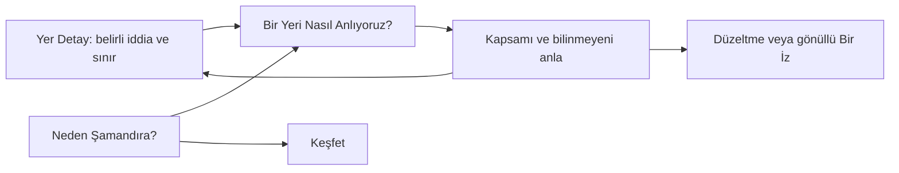
```mermaid
flowchart LR
    Y["Yer Detay: belirli iddia ve sınır"] --> M["Bir Yeri Nasıl Anlıyoruz?"]
    M --> A["Kapsamı ve bilinmeyeni anla"]
    A --> Y
    A --> D["Düzeltme veya gönüllü Bir İz"]
    N["Neden Şamandıra?"] --> M
    N --> K["Keşfet"]
```

## 22. E22 — Yardım

### Amacı

Kullanıcının mevcut görevindeki sorunu en az tekrar anlatımla çözmesini sağlamak. Ürünün ana kullanımının yerine geçen kapsamlı eğitim portalı değildir.

### Kullanıcının bu ekrana neden geldiği

Kaydını bulamıyordur, paylaşımı kapatmak, katkısını geri çekmek, hesabını kurtarmak veya bir bilgi sınırını anlamak istiyordur.

### Çıkarken hangi kararı vermiş olmalı

İlgili işlemi kendisi tamamlamak, yeterli yanıtı almak veya somut destek konusuyla iletişime geçmek. Otomatik sohbeti bitirmek zorunlu değildir.

### Giriş noktaları

Hata/durum açıklamaları, Ayarlar, Profil, paylaşım/katkı yönetimi ve destekleyici gezinme.

### Çıkış noktaları

Asıl görevde ilgili işlem, E18, E21, E23 ve veri/erişim kontrolü. Yardım'dan geri dönüş kullanıcı girdisini korur.

### Ana bileşenleri

Göreve göre konu seçimi, sınırlı yardım araması, kısa çözüm adımları, çözülmediyse iletişim ve geldiği işe dönüş.

### Zorunlu bilgiler

Çözümün hangi soruna ait olduğu, gerekli yetki, etki ve gerçek sınır. Misafir yönetim erişimi kaybolduysa garanti kurtarma yerine mevcut destek yolu açıklanır.

### İkincil bilgiler

İlgili yöntem veya ayrıntılı açıklama; gerekli ve kişisel veri içermeyen destek referansı.

### Asla bulunmaması gereken bilgiler

Parola/ödeme sırrı isteme, çözüm için Premium, uydurma destek süresi, sınırsız AI sohbeti veya alakasız popüler yer önerileri.

### Loading durumu

Mevcut yardım içeriği okunur; arama beklemesi ayrı kalır. Yüklenme kullanıcıyı asıl görevden çıkarmak zorunda değildir.

### Empty durumu

Yanıt yoksa bu kabul edilir ve iletişim yolu verilir. Boş arama yanlış çözümle doldurulmaz.

### Error durumu

Yardım servisi arızası mevcut güvenilir statik yönlendirmeyi engellemez. Destek kanalının da kapalı olması dürüstçe belirtilir.

### Offline davranışı

Önceden alınmış yardım ve veri kontrol açıklamaları okunur; destek mesajının gönderildiği söylenmez.

### Premium etkisi

Temel kullanım, mahremiyet, erişim ve iptal yardımı ücretsizdir. Ek hizmet desteği olsa bile temel çözüm kasıtlı zorlaştırılamaz.

### AI etkisi

Onaylı yardım içeriğiyle sınırlı yanıt verebilir; hesap işlemi yaptığını veya destek kaydı açtığını teyitsiz söyleyemez. Doğrudan insan/destek kanalına erişim korunur.

## 23. E23 — İletişim

### Amacı

Kullanıcının çözemediği ürün, kayıt, bilgi düzeltme veya hak sorununu doğru sorumluya iletmesini sağlamak.

### Kullanıcının bu ekrana neden geldiği

Yardım yetmemiştir, yanlış yer kimliği görmüştür, katkı/paylaşım erişimini yönetemiyordur veya ürünle ilgili açık bir talebi vardır.

### Çıkarken hangi kararı vermiş olmalı

Talebini açıkça göndermek, daha uygun kendi kendine çözüm yolunu seçmek veya vazgeçmek. Gönderim inceleme/çözüm tamamlandı demek değildir.

### Giriş noktaları

Yardım, yöntem sayfaları, hata durumları, ilgili Yer düzeltmesi ve destekleyici kamusal gezinme.

### Çıkış noktaları

Gönderim durumunun izlenebilir sonucu, asıl Yer/kayıt görevi, Yardım ve yöntem. Harici e-posta uygulamasının açılması gönderildi sonucu değildir.

### Ana bileşenleri

Konu/amaç, yalnız gerekli açıklama ve dönüş bilgisi, kullanıcı görüp seçerse ilgili kayıt bağlamı, gönder/vazgeç ve gerçek alınma sonucu.

### Zorunlu bilgiler

Ne iletileceği, hangi destek kapsamına girdiği, hangi kişisel bilginin eklendiği ve teyit durumu. Hesap gerekmeyen genel iletişim hesabı zorunlu kılmaz; özel işlem ayrıca yetki ister.

### İkincil bilgiler

Kullanıcının seçtiği yer/işlem referansı. Otomatik bütün rota, ziyaret geçmişi veya ham log eklenmez.

### Asla bulunmaması gereken bilgiler

Parola, kurtarma kodu, tam ödeme sırrı, gereksiz kesin konum, satılabilir işletme doğrulama paketi veya başka kişilerin katkıları.

### Loading durumu

Gönderilen kapsam sabit ve görülebilir kalır; aynı talep çoğaltılmaz. Talep alındıktan sonra destek yanıtı için ekranda bekletilmez.

### Empty durumu

Yeni talep normal boş formdur; seçilmiş konuda açıklama gerekip gerekmediği anlaşılırdır. Kullanıcıya gereksiz alan doldurtulmaz.

### Error durumu

Yanıt kaybında önce talebin alınıp alınmadığı kontrol edilir. Girdi korunur; gönderim kesin başarısızsa tekrar veya mevcut alternatif kanal sunulur.

### Offline davranışı

Yerel metin taslağı korunabilir; dış iletişim bağlantı geldi diye sessiz gönderilmez. Güncel kapsamla açık gönderim eylemine dönülür.

### Premium etkisi

Temel düzeltme, hak ve erişim talepleri ödeme ile öncelik satın alamaz. Ticari hizmet desteği editoryal doğrulama yetkisi değildir.

### AI etkisi

Açık kullanıcı seçimiyle talebi sınıflandırmaya yardım edebilir; anlamını genişletemez, kullanıcı yerine mesaj gönderemez, yayın veya hesap hakkı kararı veremez.

## 24. E24 — Hata Sayfaları

### Amacı

Görevin neden sürdürülemediğini, hangi emeğin korunduğunu ve mümkün düzeltmeyi anlatmak. Çözülebilir yerel sorunları gereksiz tam sayfa kesintisine dönüştürmez.

### Kullanıcının bu ekrana neden geldiği

Geçersiz bağlantı, kaldırılmış kayıt, yetki reddi, servis sorunu, form hatası veya sonucu doğrulanamayan işlemle karşılaşmıştır.

### Çıkarken hangi kararı vermiş olmalı

Girdiyi düzeltmek, sonucu kontrol etmek, yeniden doğrulamak, uygun kapsamda tekrar denemek veya güvenli çıkış yapmak. Sıradan bilgi eksikliği kullanıcı hatası değildir.

### Giriş noktaları

Bütün ekranların başarısız alt işlemleri ve doğrudan geçersiz adresler. Ebeveyn çalışabiliyorsa hata aynı görev içinde kalır.

### Çıkış noktaları

Asıl görev, bağlamı koruyan tekrar/sonuç kontrolü, E16, E22/E23 veya açık Keşfet hedefi. Dış girişte hayalî tarayıcı geçmişi oluşturulmaz.

### Ana bileşenleri

Anlaşılır neden, etki, korunmuş veri, işe yarayan onarım, vazgeçme ve gerekiyorsa kişisel veri içermeyen destek referansı.

### Zorunlu bilgiler

“Gerçekleşmedi” ile “sonucunu doğrulayamadık” ayrımı; yetki sınırı; kaybolan/kalan çalışmanın gerçek durumu. Kaldırılmış özel kaydın varlığı yetkisiz kişiye açıklanmaz.

### İkincil bilgiler

Destek için sınırlı olay referansı ve bilinen geçici kesinti bilgisi. Kesin dönüş süresi kanıt yoksa verilmez.

### Asla bulunmaması gereken bilgiler

Ham sunucu hatası, gizli kayıt kimliği/içerik, kullanıcıyı suçlama, Premium çözüm teklifi, işlevsiz sonsuz tekrar veya teyitsiz başarı.

### Loading durumu

Onarım beklerken önceki hata ve görev bağlamı kaybolmaz. Sonuç kontrolü başka bir yazma işlemiymiş gibi tekrarlanmaz.

### Empty durumu

Kurtarılabilir hedef yoksa dürüst açıklama ve Keşfet/yardım yeterlidir. Hata boş içerik diye yeniden adlandırılmaz.

### Error durumu

Hata açıklaması da yüklenemiyorsa sade yerel temel açıklama ve güvenli çıkış kalır. Yönlendirme döngüsü kurulmaz.

### Offline davranışı

Tek başarısız istek offline kanıtı değildir. Bağlantı yokluğu anlaşılmışsa E26 devreye girer; kullanıcının taslağı korunur.

### Premium etkisi

Temel onarım ve hak erişimi eşittir. Arıza satış fırsatı veya ücretli öncelikli doğruluk alanı değildir.

### AI etkisi

Bilinen hatayı sadeleştirebilir; neden, çözüm süresi veya işlem başarısı uyduramaz. Temel hata açıklaması AI olmadan çalışmalıdır.

## 25. E25 — Boş Durumlar

### Amacı

İçeriğin neden bulunmadığını doğru kapsamla anlatmak ve gerekiyorsa anlamlı bir sonraki seçim sunmak. Bağımsız içerik portalı değildir.

### Kullanıcının bu ekrana neden geldiği

İlk kullanım, filtreli boş liste, uygun sonuç yokluğu, yetersiz kanıt veya boş rota gibi farklı nedenlerden biri gerçekleşmiştir.

### Çıkarken hangi kararı vermiş olmalı

Kayıtsız devam etmek, belirli filtreyi değiştirmek, yer eklemek, kapsamı anlamak veya ayrılmak. Her boşluk doldurulması gereken eksiklik değildir.

### Giriş noktaları

E02/E03 sonuçları, E07/E08 boş taslak, E09/E10 kayıtlar, E14 olaylar ve iç operasyon kuyrukları.

### Çıkış noktaları

Aynı görevin ilgili giriş/düzenleme yolu, Keşfet veya çıkış. Uygun eylem yoksa yeni eylem icat edilmez.

### Ana bileşenleri

Boşluğun nedeni, kapsam özeti, korunmuş koşullar ve gerekliyse bir baskın ilgili eylem. Bunlar görsel illüstrasyon zorunluluğu yaratmaz.

### Zorunlu bilgiler

Sıfır kayıt ile bilinmeyen kayıt; uygun sonuç yok ile kanıt yok; bütün liste ile filtreli alt küme ayrımı.

### İkincil bilgiler

Yalnız işi anlatan kısa örnek. Kişisel arşiv boşken kamuya açık trend içerik doldurulmaz.

### Asla bulunmaması gereken bilgiler

Suçluluk, kayıt tamamlama baskısı, Premium'a geçince sonuç var vaadi, otomatik koşul gevşetme veya hizmet hatasını boşluk diye gizleme.

### Loading durumu

İçerik henüz alınmadıysa boş durum ilan edilmez. Yeni kapsam seçilince önceki boşluğun hangi sorguya ait olduğu ayrılır.

### Empty durumu

İlk kayıt, filtreli boşluk, aday yokluğu, kanıt yetersizliği, boş rota ve iş kuyruğunda görev yok ayrı sözleşmelerdir. E24 ve E26 ile birlikte doğru neden ayrımı korunur.

### Error durumu

Boşluk eylemi başarısızsa E24 ilgili alt göreve uygulanır. Önceki kapsam ve kullanıcı niyeti korunur.

### Offline davranışı

Yerelde kayıt bulunmaması sunucuda kayıt olmadığı anlamına gelmez. Uzak kapsam kontrol edilemiyorsa bunu boş arşiv diye sunmaz.

### Premium etkisi

Boşluğun açıklaması ve temel devam yolları ortaktır. Kayıt sayısı veya uygun yer kıtlığı ticari baskı üretmez.

### AI etkisi

Boşluğu doldurmak için aday, kayıt veya bilgi üretemez. Kanıt yetersizliğini doğru anlatmaya yardım edebilir.

## 26. E26 — Offline

### Amacı

Bağlantısız çalışma sırasında kullanılabilir içerik, yerel niyet ve uzakta tamamlanması gereken işlemleri ayırmak. Yeni bağımsız keşif evreni değildir.

### Kullanıcının bu ekrana neden geldiği

Bağlantı kesilmiştir; kayıtlı yer/rotaya bakmak, taslağını sürdürmek veya bekleyen işlemin durumunu anlamak ister.

### Çıkarken hangi kararı vermiş olmalı

Yerel içerikle sınırını bilerek devam etmek, bekleyen isteği iptal etmek, bağlantıda tekrar değerlendirmek veya çıkmak.

### Giriş noktaları

Her görevin doğrulanmış bağlantı kaybı; çevrimdışı doğrudan adres; yerel kayda erişim ve bekleyen işlem ayrıntısı.

### Çıkış noktaları

Aynı görevin yerel durumu, bekleyen işlem yönetimi, bağlantı sonrası güncellik/çakışma çözümü ve E22.

### Ana bileşenleri

Bağlantı durumu, kullanılabilir yerel kapsam, alınma zamanı varsa zaman, bekleyen işlemler ve iptal/yeniden kontrol yolları.

### Zorunlu bilgiler

Neyin cihazda olduğu; hangi bilginin güncel doğrulanamadığı; neyin yalnız yerel kaydedildiği; paylaşım kapatma teyit edilene kadar bağlantının açılabileceği.

### İkincil bilgiler

Son başarılı uzak kayıt zamanı varsa kapsamı. İçeriğin alınma zamanı her iddianın doğrulanma zamanı değildir.

### Asla bulunmaması gereken bilgiler

Canlı açıklık/kalabalık garantisi, yerelde olmayan verinin erişilebilir vaadi, teyitsiz kapatıldı/silindi, bağlantıda sessiz dış yayın.

### Loading durumu

Offline durumda sonsuz ağ beklemesi yoktur. Yeniden bağlantı anlaşılınca görev bazlı kontrol başlar; kullanıcının tüm ekranı sıfırlanmaz.

### Empty durumu

Yerel içerik yoksa bunun yalnız cihaz kapsamı olduğu açıklanır. Kayıtları sunucuda varmış/yokmuş gibi kesinleştirme yapılmaz.

### Error durumu

Yerel depolama da başarısızsa “cihaza kaydedildi” denmez; eldeki çalışma ve gerçek kurtarma seçenekleri açıklanır. Sessiz veri kaybı kabul edilmez.

### Offline davranışı

Taslak değişimi yerel kalır; açık yetkili kayıt/katkı kuyruğu iptal edilebilir. Yeni paylaşım/yayın ve iletişim güncel önizleme/gönderim kararına döner. Bağlantı kapatma isteği teyide kadar bekler; erişim kapanmış sayılmaz.

### Premium etkisi

Bağlantı kesintisi ek ödeme sebebi değildir. Çevrimdışı paket gibi kabul edilmemiş bir hizmet bu belgeyle ilan edilmez.

### AI etkisi

Yerel model veya çevrimdışı AI varsayılmaz. AI olmadan izinli kayıt okuma/düzenleme sürer; güncel kanıt uydurulmaz.

### Diyagram 10 — Hata, boşluk ve offline ayrımı

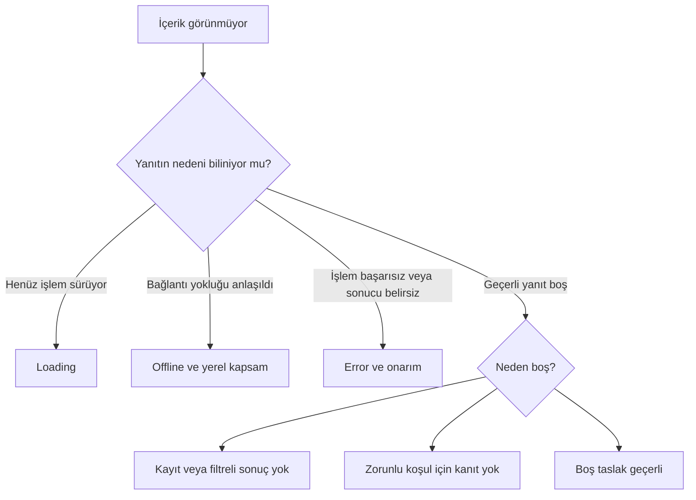
```mermaid
flowchart TD
    A["İçerik görünmüyor"] --> B{"Yanıtın nedeni biliniyor mu?"}
    B -->|"Henüz işlem sürüyor"| L["Loading"]
    B -->|"Bağlantı yokluğu anlaşıldı"| O["Offline ve yerel kapsam"]
    B -->|"İşlem başarısız veya sonucu belirsiz"| E["Error ve onarım"]
    B -->|"Geçerli yanıt boş"| K{"Neden boş?"}
    K --> N["Kayıt veya filtreli sonuç yok"]
    K --> Y["Zorunlu koşul için kanıt yok"]
    K --> T["Boş taslak geçerli"]
```

### Diyagram 11 — Offline işlemin yeniden bağlanması

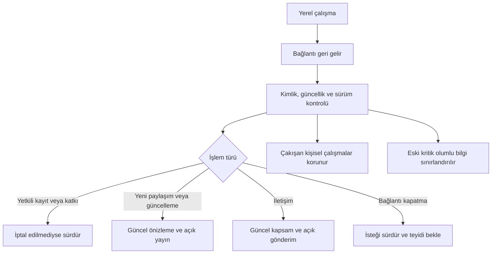
```mermaid
flowchart TD
    A["Yerel çalışma"] --> B["Bağlantı geri gelir"]
    B --> C["Kimlik, güncellik ve sürüm kontrolü"]
    C --> D{"İşlem türü"}
    D -->|"Yetkili kayıt veya katkı"| E["İptal edilmediyse sürdür"]
    D -->|"Yeni paylaşım veya güncelleme"| P["Güncel önizleme ve açık yayın"]
    D -->|"İletişim"| M["Güncel kapsam ve açık gönderim"]
    D -->|"Bağlantı kapatma"| K["İsteği sürdür ve teyidi bekle"]
    C --> X["Çakışan kişisel çalışmalar korunur"]
    C --> Y["Eski kritik olumlu bilgi sınırlandırılır"]
```

## 27. E27 — Admin Paneli

### Amacı

İç operasyonun kapsamını, görev dağılımını, erişim yetkilerini ve kritik bilgi bakımını yönetmek. Tüketici profili veya işletme portalı değildir.

### Kullanıcının bu ekrana neden geldiği

Yetkili operasyon sorumlusu görev atamak, kritik yayın/hak sorununu takip etmek, rol kapsamını düzenlemek veya bir operasyonun sonucunu denetlemek ister.

### Çıkarken hangi kararı vermiş olmalı

Sorumluluk ve işlem kapsamını belirlemek, ilgili incelemeye geçmek, gerekli erişimi kapatmak veya eksik dayanak nedeniyle işi durdurmak.

### Giriş noktaları

Ayrı iç operasyon adresi, yetkili oturum ve izinli görev bağlantısı. Tüketici navigasyonunda yönetim verisi görünmez; adresi bilmek yetki değildir.

### Çıkış noktaları

E28 Editör, E29 İçerik, yetkisi varsa E30 ticari operasyon, kapsamlı erişim/denetim alt görevleri ve güvenli çıkış.

### Ana bileşenleri

Risk ve sorumluluğa göre görev kuyruğu, görev sahibi, yetki kapsamı, kritik düzeltme/hak geri çekme durumu ve sınırlı denetim izi.

### Zorunlu bilgiler

Etkin rol ve kapsam, etkilenen kayıt/iddia, işlemin dayanağı, güncel etki, gerekli ikinci inceleme ve gerçek sonuç. Yetki değişimi geçmişi gerekçeli ve erişimi sınırlı tutulur.

### İkincil bilgiler

Bakım kapasitesi ve işlem yükü gibi görev ölçümleri; kişisel ham veriyi açmadan darboğaz bilgisi. Hız tek başına editoryal başarı değildir.

### Asla bulunmaması gereken bilgiler

İşletmeye sıralama satışı, toplu AI onayı, görev dışı katkı/hesap içeriği, ayrı yetkisi olmadan ödeme sırları veya herkese açık iç panel.

### Loading durumu

Kuyruk ve tek işlem beklemesi ayrıdır. Yetki çözülmeden özel veri gösterilmez; eski kapsamla işlemler açık bırakılmaz.

### Empty durumu

Atanmış görev yoksa bu açıklanır. Görmeye yetkisi olmayan görevler “sıfır sorun var” gibi gösterilmez; kapsam görünür kalır.

### Error durumu

Kısmi toplu sonuç satır/görev bazında ayrılır. Yetki reddi veya eski önizleme yayına zorlanamaz; geniş etkide yeniden inceleme gerekir.

### Offline davranışı

Sunucuda yetki veya yayın değişimi yapılamaz. Önceden erişilen hassas kanıt varsayılan çevrimdışı arşive dönüşmez; izinli sınırlı notun kapsamı ayrıca belirlenir.

### Premium etkisi

Ticari gelir görev risk sırasını, kaynak araştırmasını, doğrulamayı veya kritik düzeltmeyi etkileyemez. Premium hesabı operasyon rolü vermez.

### AI etkisi

Kuyruk özetleme ve çelişki adayını bulma desteği olabilir; rol verme, hak kararı veya yayın yetkisi yoktur. Destekli özet bağımsız kanıt incelemesini engellemez.

## 28. E28 — Editör Paneli

### Amacı

İzinli kanıtı ve karşı kanıtı inceleyerek iddiayı, kapsamını ve geçerlilik önerisini gerekçelendirmek. Metin düzeltmek ile bilgiye yetki vermek ayrıdır.

### Kullanıcının bu ekrana neden geldiği

Atanmış yer kimliği, somut gözlem, çelişki, güncellik kaybı veya hak sorunu için değerlendirme yapması gerekir.

### Çıkarken hangi kararı vermiş olmalı

Kanıt yeterliliğini ve kapsamını belirtmek, eksik araştırmayı istemek, çelişkiyi açık bırakmak veya kendi yetkisinde sonraki incelemeye iletmek. Her işi olumlu bitirmek zorunlu değildir.

### Giriş noktaları

E27 görev kuyruğu, yetkili görev bağlantısı, E29'dan içerik dayanağının incelenmesi ve kapsamlı Bir İz inceleme görevi.

### Çıkış noktaları

Görev kuyruğu, ilgili iddia/kimlik incelemesi, ikinci yetkili değerlendirme ve E29 yayın etki incelemesi. Gerekçesiz doğrudan tüketici yayını yoktur.

### Ana bileşenleri

Görev sorusu, kaynak hakkı, kanıt/karşı kanıt, zaman/alan kapsamı, kimlik ayrımı, bağımsız editör gerekçesi ve açık inceleme sonucu.

### Zorunlu bilgiler

Kaynak kullanım yetkisi, hangi iddianın incelendiği, kanıtın kapsamı ve zamanı, çelişkiler, karar gerekçesi ve sonraki sorumlu. Ham kanıt yalnız görev için gereken erişimle açılır.

### İkincil bilgiler

Önceki izinli incelemeler, kaynak ilişkileri ve AI önerisi. AI metni kanıttan önce zorunlu yorum çerçevesi değildir.

### Asla bulunmaması gereken bilgiler

Ticari müşteri için doğrulama önceliği, kullanıcıya ait gereksiz özel rota/not, topluluk oylamasıyla gerçek kabulü ve otomatik “hepsini onayla”.

### Loading durumu

Kaynak/kanıt yüklenmesi ayrı takip edilir. Karşı kanıt eksikken görünür ilk olumlu parça tam inceleme sayılmaz.

### Empty durumu

Kanıt yoksa “yetersiz/araştırma gerekli” sonucu geçerlidir. AI metniyle boş kaynak doldurulmaz; görev kapanışı doğruluk onayı değildir.

### Error durumu

Kaynak erişim sorunu, hak sorunu ve eski inceleme sürümü ayrılır. Başka editör değişikliği varsa iki gerekçe korunur ve güncel kapsamla yeniden karar verilir.

### Offline davranışı

Yeni kanıt geçerliliği ve yayın kararı verilemez. İzinli çalışma notu varsa taslak olarak kalır; hassas kaynaklar kendiliğinden cihaza indirilmez.

### Premium etkisi

Katkı sahibinin veya işletmenin ödeme durumu kanıt ağırlığını ve kuyruk sırasını değiştiremez.

### AI etkisi

İzinli metinden aday iddia çıkarabilir ve çelişki gösterebilir. Editörün bağımsız kararı ve gerekli ikinci inceleme yerine geçmez; otomasyon yanlılığı ayrıca değerlendirilir.

## 29. E29 — İçerik Yönetimi

### Amacı

Yer ve coğrafi içeriklerin taslak, yayın, düzeltme ve kaldırma yaşamını yetkili iddialara bağlı yönetmek. Serbest metinle bilgi otoritesini aşan CMS değildir.

### Kullanıcının bu ekrana neden geldiği

Onaylı kapsamı yayına hazırlamak, kimlik/yayın durumunu düzenlemek, kritik düzeltmeyi yaymak veya hak nedeniyle içeriği geri çekmek gerekir.

### Çıkarken hangi kararı vermiş olmalı

Güncel etki kapsamını inceleyip yetkili yayın/geri çekme yapmak, ikinci incelemeye göndermek veya taslakta bırakmak.

### Giriş noktaları

E27, E28'in tamamlanmış incelemesi ve yetkili içerik bağlantısı. Kaynağı görmek yayın yapma yetkisi değildir.

### Çıkış noktaları

İddia incelemesi, yayın önizlemesi, etkilenen türev durumları, işlem denetimi ve ilgili görev kuyruğu. Kamusal sonuç önizlemesi özel kanıt sızdırmaz.

### Ana bileşenleri

Kanonik kimlik, yayın durumu, iddiaya bağlı içerik, izinli medya/atıf, taslak-yayın farkı, etki önizlemesi, yetkili eylem ve yayılım sonucu.

### Zorunlu bilgiler

Yer kimliği, yayın ile ziyaret edilebilirlik ayrımı, kullanılan geçerli iddialar, hak durumu, kimlik birleştirme etkisi, kritik düzeltmenin Yer/rota/paylaşım türevleri ve ikinci inceleme ihtiyacı.

### İkincil bilgiler

İzinli tarihsel sürümler, yerelleştirme durumu ve görev notları. Eski yayının okunması yeniden yayın yetkisi değildir.

### Asla bulunmaması gereken bilgiler

Kanıtsız “uygun” metni, genel yer güven rozeti, ticari sponsor önceliği, ham yorumu yeniden yazıp yayınlama, erişim kontrolünü atlayan toplu onay.

### Loading durumu

Önizleme hangi sürüme ait olduğunu korur; değişmiş kanıtla eski etki üzerinden yayın yapılmaz. Türev yayılımı bitmediyse tamamlandı denmez.

### Empty durumu

Yer kimliği var ama yeterli yayın içeriği yoksa sınırlı/taslak durumu geçerlidir. İlçe veya şehir sayfası salt şablon doldurmak için açılamaz.

### Error durumu

Kısmi yayın/geri çekme görünür kalır; başarısız türevler takip edilir. Kritik iddia eski olumlu kullanımda bırakılarak “yayın başarılı” sonucu verilmez.

### Offline davranışı

Yayın, kimlik birleştirme ve geri çekme uzak teyit olmadan gerçekleşmez. Yerel metin varsa yalnız taslaktır; bağlantıda güncel kanıt ve etki yeniden açılır.

### Premium etkisi

İçerik ve düzeltme kalitesi üyelikten bağımsızdır. Ticari ekip doğrudan veya kaynak/fotoğraf araştırma sırasını değiştirerek ayrıcalık satın alamaz.

### AI etkisi

Desteklenen açıklama/çeviri taslağı önerebilir; kaynak hakkını, iddia geçerliliğini ve yayını onaylayamaz. Gerçek yer fotoğrafı üretemez.

## 30. E30 — Premium Yönetimi

### Amacı

Varsa kabul edilmiş ek hizmetin teklif, hak, abonelik ve işlem sorunlarını iç operasyon kapsamında yönetmek. E13 kullanıcının kendi hizmeti; E30 yetkili çalışanın sınırlı operasyonudur.

### Kullanıcının bu ekrana neden geldiği

Bir hizmet hakkı uyuşmazlığını çözmek, kabul edilmiş teklifin durumunu yönetmek veya iptal/işlem sonucunu kontrol etmek gerekir.

### Çıkarken hangi kararı vermiş olmalı

Yetkili somut hizmet işlemini yapmak, sorunu doğru sorumluya iletmek veya doğrulanmayan sonucu bekletmek. Kamuya bilgi ayrıcalığı verilemez.

### Giriş noktaları

E27'de yalnız ticari yetki kapsamı, izinli destek görevi ve özel yönetim bağlantısı. Satışa açık hizmet yoksa aktif abonelik operasyonu varmış gibi gösterilmez.

### Çıkış noktaları

İlgili ticari görev, yetkili işlem etki incelemesi, sınırlı denetim ve destek. Editoryal yayın yetkisine geçiş ayrı rol doğrulaması gerektirir.

### Ana bileşenleri

Onaylı hizmet kapsamı, teklif sürümü, gerekli asgari hesap referansı, hak durumu, işlem kaydı, etki ve gerekçeli düzeltme.

### Zorunlu bilgiler

Gerçek hizmet ve süre/kapsam, işlem yetkisi, önceki ve önerilen hak farkı, teyit durumu, iptalde korunacak temel haklar. Finansal/hukuki politika burada icat edilmez.

### İkincil bilgiler

Hizmetin toplam operasyon yükü ve kişisel veri içermeyen istatistik. Ham keşif/ziyaret/katkı kayıtları müşteri analizine eklenmez.

### Asla bulunmaması gereken bilgiler

Yer doğrulama seviyesi satışı, editör kuyruğu satın alma, ham ödeme sırrı, görev dışı kişisel geçmiş, örtülü rol artırma ve sınırsız hizmet vaadi.

### Loading durumu

Hak ve işlem kontrolü bitmeden değişiklik kesinleşmiş gibi görünmez. Teklif önizlemesinden sonra kapsam değişirse önizleme yenilenir.

### Empty durumu

Hizmet henüz açılmadıysa yapı yalnız koşullu sözleşmedir. Görev yokluğu ödeme/hak verisinin sıfır olduğu iddiasına dönüşmez.

### Error durumu

Belirsiz ödeme/hak sonucu önce kontrol edilir; ikinci işlem otomatik üretilmez. Kısmi düzeltme tüm hesabı başarıyla onarıldı sayılmaz.

### Offline davranışı

Hizmet hakkı, ödeme veya iptal sunucuda değiştirilmiş sayılamaz. Yetkili taslak not varsa bağlantıda kapsam ve yetki yeniden kontrol edilir.

### Premium etkisi

Yönetilen alan yalnız gerçek ek kolaylıktır. Süre bitişi ve operasyon hatası ücretsiz bilgi, kişisel emek ve erişim kapatma haklarını aşındıramaz.

### AI etkisi

Yetkili işlem farkını özetleyebilir; fiyat, abonelik, geri ödeme, rol veya editoryal ayrıcalık kararı veremez. Ödeme ve kimlik sırları işlenmez.

### Diyagram 12 — İç operasyon sorumluluk ağacı

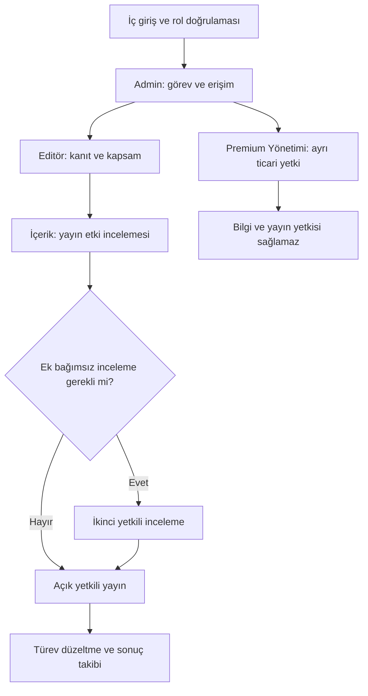
```mermaid
flowchart TD
    G["İç giriş ve rol doğrulaması"] --> A["Admin: görev ve erişim"]
    A --> E["Editör: kanıt ve kapsam"]
    E --> I["İçerik: yayın etki incelemesi"]
    I --> K{"Ek bağımsız inceleme gerekli mi?"}
    K -->|"Evet"| D["İkinci yetkili inceleme"]
    K -->|"Hayır"| Y["Açık yetkili yayın"]
    D --> Y
    Y --> T["Türev düzeltme ve sonuç takibi"]
    A --> P["Premium Yönetimi: ayrı ticari yetki"]
    P --> S["Bilgi ve yayın yetkisi sağlamaz"]
```

### Diyagram 13 — Kritik bilginin ekranlara etkisi

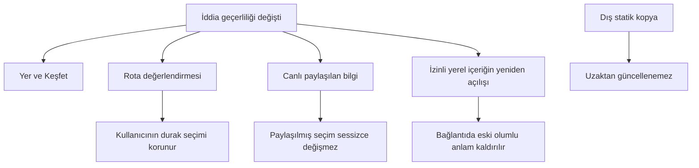
```mermaid
flowchart TD
    I["İddia geçerliliği değişti"] --> Y["Yer ve Keşfet"]
    I --> R["Rota değerlendirmesi"]
    I --> P["Canlı paylaşılan bilgi"]
    I --> K["İzinli yerel içeriğin yeniden açılışı"]
    R --> D["Kullanıcının durak seçimi korunur"]
    P --> S["Paylaşılmış seçim sessizce değişmez"]
    K --> G["Bağlantıda eski olumlu anlam kaldırılır"]
    X["Dış statik kopya"] --> N["Uzaktan güncellenemez"]
```

## 31. Navigation mimarisi

### 31.1. Ana yapı ve bağlamsal görevler

Ana navigasyon Şamandıra → Ana Sayfa, Keşfet, Neden Şamandıra? ve Ara eyleminden oluşur. Ara, Keşfet'in sorgu durumunu açar; ayrı sonuç merkezi değildir. Şehir/İlçe/Yer bağlantıları içerik ilişkileridir. Bir Yeri Nasıl Anlıyoruz? yöntem erişimi ve destek bağlantıları gerektiği yerde bulunur.

Keşfet'in içinde **keşif bağlamı** ile **Kaydettiklerin görevi** ayırt edilir. Kaydettiklerin'in üç eş düzey türü Rotalar, Gezeceğim Yerler ve Gezdiğim Yerler'dir. Son kullanılan tür ve o türün liste konumu hatırlanır. Yeni kaydın ardından doğrudan ilgili türü açma yolu vardır; kişi kaydettiğini bulmak için Profil'den dolaştırılmaz.

Akıllı Rota'ya boş taslak, seçili yerler, doğal ihtiyaç, Yer eylemi veya kayıtlı rota üzerinden girilebilir. Rota Düzenleme aynı özel planın alt görevidir. Kaydettiklerin'deki Rotalar arşivdir; Akıllı Rota çalışma görevidir. İsim benzerliği iki ayrı kayıt sistemi kurmaz.

Profil, Ayarlar ve Bildirimler bağlamsal kişisel kontrol alanlarıdır. Üst düzey kamusal “profil keşfi”, “rota keşfi” veya “AI merkezi” açılmaz. Giriş/Kayıt/Şifre ihtiyaca bağlı alt akış; Onboarding atlanabilir yardımcı görev; hata/boş/offline ebeveyn durumlarıdır. Yönetim alanının kabuğu, menüsü, yetkisi ve çıkışı tüketici alanından ayrıdır.

### 31.2. Alt görev açma sözleşmesi

Kısa alt iş bağlamı koruyan görev olarak; uzun okuma/düzenleme kendi başlığı ve geri dönüşü olan tam görev olarak açılır. Bu belge sheet, panel veya başka bir görsel yerleşim çizmez. 10'daki tek etkin modal ve odak kuralları geçerlidir. Boyut değişimi yeni görev yaratmaz.

Yer ayrıntısını rotadan açan kişi aynı durağa döner. Oradan yöntem açılırsa dönüş önce Yer'e, sonra rotaya olur. İç içe bağımsız modal biriktirilmez. Dışarıdan doğrudan girilmiş Yer'de açık “Keşfet” hedefi vardır; bu bağlantı “Geri” gibi sunulmaz.

### Diyagram 14 — Navigation Tree

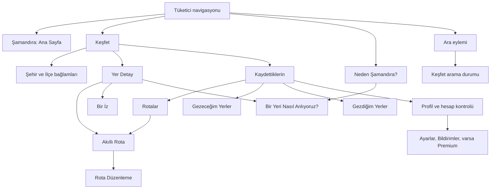
```mermaid
flowchart TD
    N["Tüketici navigasyonu"] --> H["Şamandıra: Ana Sayfa"]
    N --> K["Keşfet"]
    N --> W["Neden Şamandıra?"]
    N --> A["Ara eylemi"]
    A --> S["Keşfet arama durumu"]
    K --> C["Şehir ve İlçe bağlamları"]
    K --> Y["Yer Detay"]
    K --> B["Kaydettiklerin"]
    B --> R["Rotalar"]
    B --> G["Gezeceğim Yerler"]
    B --> V["Gezdiğim Yerler"]
    R --> T["Akıllı Rota"]
    Y --> T
    T --> E["Rota Düzenleme"]
    Y --> Z["Bir İz"]
    Y --> M["Bir Yeri Nasıl Anlıyoruz?"]
    B --> P["Profil ve hesap kontrolü"]
    P --> O["Ayarlar, Bildirimler, varsa Premium"]
    W --> M
```

### Diyagram 15 — Destek, kimlik ve ortak durum yerleşimi

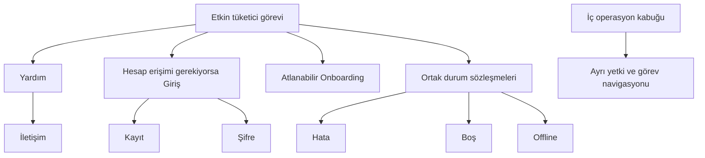
```mermaid
flowchart TD
    G["Etkin tüketici görevi"] --> H["Yardım"]
    H --> I["İletişim"]
    G --> K["Hesap erişimi gerekiyorsa Giriş"]
    K --> R["Kayıt"]
    K --> S["Şifre"]
    G --> O["Atlanabilir Onboarding"]
    G --> D["Ortak durum sözleşmeleri"]
    D --> E["Hata"]
    D --> B["Boş"]
    D --> F["Offline"]
    A["İç operasyon kabuğu"] --> Y["Ayrı yetki ve görev navigasyonu"]
```

## 32. Deep Link yapısı

Deep link, belirli nesneye veya göreve doğrudan erişim sözleşmesidir; ekranı körlemesine açma talimatı değildir. Girişte hedef türü, kimlik, yayın/erişim durumu, gerekli oturum, nesne sahipliği ve kanal desteği değerlendirilir. Açmak hiçbir kayıt, ziyaret, paylaşım veya ödeme işlemini otomatik tamamlamaz.

| Hedef türü | Taşınan bağlam | Açılış ve sınır |
| --- | --- | --- |
| Kamusal Yer | Kararlı yer kimliği; varsa kamuya açık alt konu | Doğru şube açılır, güncel yayın ve iddia sınırı alınır |
| Şehir/İlçe | Kararlı coğrafya kimliği | Özgün içerik varsa sayfa; yoksa aynı kapsamlı Keşfet |
| Keşfet | İzinli kamusal sorgu ve filtreler | Taşınan kapsam anlaşılır; taşınmayan kişisel koşullar uygulanmış sayılmaz |
| Kişisel rota/kayıt | Nesne kimliği; gerekli dönüş konusu | Sahiplik doğrulanır; misafir cihaz nesnesi başka cihazda kendiliğinden açılmaz |
| Paylaşılan rota | Salt okunur paylaşım erişimi | Hesapsız okunur; özel taslağa/yönetim yetkisine erişim vermez |
| Bir İz yönetimi | Sahip hesap veya ayrı yönetim erişimi | Okuma/paylaşım erişiminden ayrı; kayıp erişimde destek yolu |
| Bildirim hedefi | Olay ve ilgili kayıt bağlamı | Önce yetki, sonra etkilenen değişiklik; okundu ile çözüldü ayrılır |
| Giriş/kurtarma | Güvenli görev dönüşü; ayrı doğrulama amacı | Sır işlendikten sonra olağan geçmişe taşınmaz; geçersizse yeni güvenli başlangıç |
| İç görev | Görev/iddia kimliği ve işlem konusu | İç rol ile kayıt/işlem kapsamı yeniden doğrulanır |

Bağlantı bekleyen taslak varken açılırsa mevcut çalışma korunur. Aynı görev ise ilgili bağlam açılır; farklı görev ise kullanıcı iki çalışmadan hangisine devam edeceğini anlayabilir. Var olan taslağı başka deep link'le değiştirmek yoktur. Bir bağlantının tekrar açılması ikinci ziyaret veya ikinci satın alma yaratmaz.

Yanlış/eskimiş okunur ad, kararlı kimlik doğruysa güncel kanonik hedefe yönelir. Birleşmiş yer yalnız yetkili kimlik ilişkisi varsa açıklamalı doğru hedefe taşınır. Kapanan işletme eski ziyareti yok etmez; farklı işletmeye sessiz bağlanmaz. Kaldırılmış paylaşımın özel başlığı veya sahibinin kimliği yetkisiz hata metnine sızmaz.

### Diyagram 16 — Deep Link çözümleme

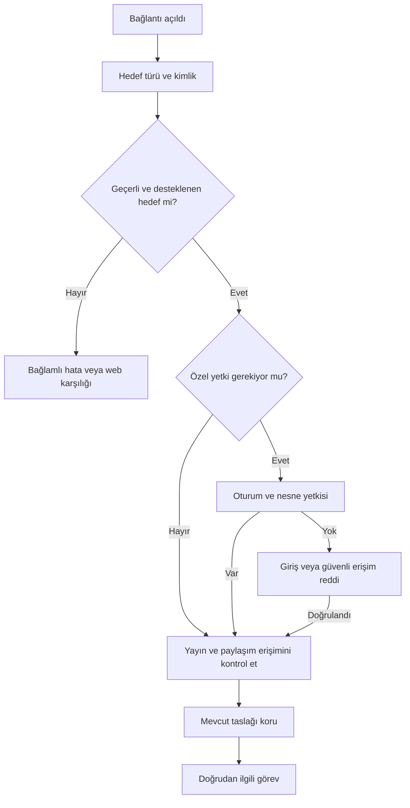
```mermaid
flowchart TD
    A["Bağlantı açıldı"] --> T["Hedef türü ve kimlik"]
    T --> V{"Geçerli ve desteklenen hedef mi?"}
    V -->|"Hayır"| E["Bağlamlı hata veya web karşılığı"]
    V -->|"Evet"| K{"Özel yetki gerekiyor mu?"}
    K -->|"Hayır"| P["Yayın ve paylaşım erişimini kontrol et"]
    K -->|"Evet"| G["Oturum ve nesne yetkisi"]
    G -->|"Yok"| L["Giriş veya güvenli erişim reddi"]
    G -->|"Var"| P
    P --> B["Mevcut taslağı koru"]
    B --> D["Doğrudan ilgili görev"]
    L -->|"Doğrulandı"| P
```

## 33. URL stratejisi

### 33.1. Kanonik adres ve önerilen yol sözleşmeleri

Depoda belirtilen kanonik alan **https://şamandıra.com**'dur. Aşağıdaki yollar yeni ekran mimarisinin önerisidir; çalışan endpoint/router veya uygulanmış yönlendirme iddiası değildir. Yol adları teknik ASCII, görünen başlıklar doğru Türkçedir. Süslü parantezli ifadeler insan tarafından okunur yer tutuculardır; program kodu değildir.

| Ekran/görev | Önerilen yol | İndeks ve erişim |
| --- | --- | --- |
| E01 | / | Kamusal |
| E02/E03 | /kesfet | Arama ve filtre durumları aynı aile; kişisel sonuç indekslenmez |
| E04 | /yer/{yer-kimligi}/{okunur-ad} | İzinli kamusal yayın; kararlı kimlik esastır |
| E05 | /sehir/{sehir-kimligi}/{okunur-ad} | Yalnız özgün yayımlanmış karar içeriği |
| E06 | /ilce/{ilce-kimligi}/{okunur-ad} | Üst şehir içerikte açık; kimlik tekildir |
| E07 yeni | /kesfet/rota/yeni | Özel görev başlangıcı; ziyaret/plan kaydı otomatik oluşmaz |
| E07 kayıtlı | /kesfet/kaydettiklerin/rotalar/{rota-kimligi} | Sahiplik veya aynı misafir cihazı |
| E08 | /kesfet/kaydettiklerin/rotalar/{rota-kimligi}/duzenle | Aynı özel nesnenin düzenleme görevi |
| Rotalar | /kesfet/kaydettiklerin/rotalar | Özel arşiv |
| E09 | /kesfet/kaydettiklerin/gezecegim | Özel niyet havuzu |
| E10 | /kesfet/kaydettiklerin/gezdigim | Özel ziyaret hafızası |
| E11 yeni | /yer/{yer-kimligi}/{okunur-ad}/bir-iz | Bağlamlı katkı; işlem yapmaz, indekslenmez |
| E11 yönetim | /hesap/katkilar/{katki-kimligi} | Hesap veya ayrı misafir yönetim yetkisi |
| E12 | /hesap | Yalnız kendi kapsamı; kamusal kullanıcı profili yok |
| E13 | /premium | Gerçek hizmet varsa kamusal kapsam; özel abonelik alt görevi ayrı |
| E14 | /hesap/bildirimler | Özel olaylar |
| E15 | /ayarlar | Cihaz tercihleri; özel hesap alt görevinde doğrulama |
| E16/E17 | /giris ve /kayit | Kimlik görevi; kişisel içerik indekslenmez |
| E18 | /sifre | Kurtarma/değiştirme alt durumları; sırlar kalıcı adres durumu değildir |
| E19 | /baslangic | İsteğe bağlı öğretim; ilk değer için zorunlu yönlendirme yok |
| E20 | /neden-samandira | Kamusal |
| E21 | /bir-yeri-nasil-anliyoruz | Kamusal |
| E22/E23 | /yardim ve /iletisim | Destek; kişisel talepler indekslenmez |
| E24/E25/E26 | Ebeveyn adresi korunur | Hata/boş/offline için içerik dizini açılmaz |
| E27 | /yonetim | İç operasyon; oturum ve rol |
| E28 | /yonetim/editor | İç inceleme kapsamı |
| E29 | /yonetim/icerik | İç yayın kapsamı |
| E30 | /yonetim/premium | Ayrı ticari işlem kapsamı |
| Salt okunur rota | /paylasim/rota/{okuma-kodu} | Bağlantıyı bilen erişir; indeksleme/keşif yok |
| Mevcut destek belgeleri | /gizlilik ve /kullanim-kosullari | Destek içerik rolleri; bu görev metinlerini oluşturmaz |

Yeni taslak henüz kaydedilmemişse düzenleyici /kesfet/rota/yeni görev durumunda kalabilir; sunucuda var olmayan rota kimliği üretilip kayıtlı gibi anlatılmaz. Kalıcılaştırılan nesneye geçişte önceki taslak ve odak korunur. URL değişmesi “hesaba kaydedildi” teyidi değildir.

### 33.2. Adres ile özel çalışma ayrımı

Şehir, ilçe, tür ve kullanıcı açıkça seçtiyse hassas olmayan ad araması gibi kamusal durumlar sırasıyla sehir, ilce, tur ve q parametreleriyle ifade edilebilir. Liste/harita görünümü gorunum tercihi olabilir. Parametre seti kapalı ve anlamlı tutulur; geçersiz değer sessiz yeni koşul yaratmaz. Özel serbest ihtiyaç cümlesi varsayılan olarak URL'ye yazılmaz.

Ev/otel başlangıcı, hassas gereksinim, özel bütçe, kişi adları, rezervasyon, ziyaret geçmişi, katkı metni ve oturum/yönetim sırları olağan query, okunur yol, sayfa başlığı veya analiz etiketi olamaz. Kişisel taslak uygulama durumunda kalır. Adresi kopyalamak bütün özel çalışma durumunu paylaşmaz; kişi gerçekten planını aktarmak istiyorsa paylaşım önizlemesi kullanır.

Kamusal kapsam bağlantısından özel koşullar çıkarılırsa bunlara dayalı olumlu kişisel uygunluk hükmü taşınmaz. Alıcıya kendi koşullarını belirtme yolu verilir. Teknik kurtarma veya misafir yönetim erişiminin nasıl güvenle taşınacağı sonraki kimlik/kanal sözleşmesinde belirlenir; burada sırların log, geçmiş, referrer ve kamuya açık bağlantılara sızmaması bağlayıcıdır.

### 33.3. Eski adresler, indeks ve kaldırma

Kamusal kimlikte tek kanonik adres vardır. Okunur ad değişebilir; kararlı kimlik değişmez. Yalnız isim benzerliği yönlendirme gerekçesi olamaz. Eski Hakkımızda adresi varsa E20'ye, ayrı eski arama adresi varsa aynı kapsamı koruyarak Keşfet'e yönelir. Gerçek mevcut adres envanteri ve göç listesi sonraki uygulama öncesi çıkarılmalıdır; bu görev mevcut router'ı değiştirmez.

Bulunamayan kamusal adres 404; kalıcı kaldırmanın açıklanabildiği kamusal içerik uygun kaldırılma yanıtı; servis kesintisi geçici hata anlamını taşır. Bunlar SEO içerik sayfası değildir. Özel hedefte “yok” ile “yetkisiz” ayrımı nesne varlığını sızdırmayacak biçimde karşılanır. İndeks dışı tutmak erişim kontrolü yerine geçmez.

### Diyagram 17 — URL'de taşınan ve taşınmayan durum

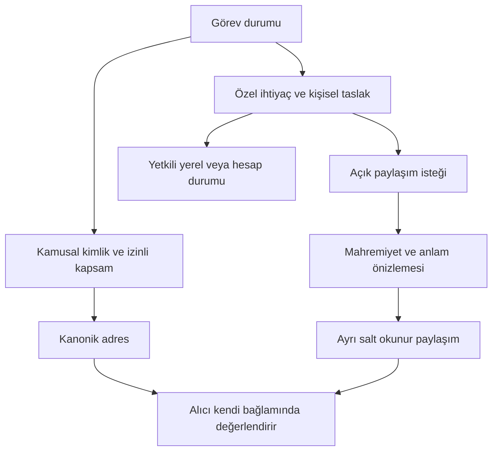
```mermaid
flowchart TD
    D["Görev durumu"] --> K["Kamusal kimlik ve izinli kapsam"]
    D --> O["Özel ihtiyaç ve kişisel taslak"]
    K --> U["Kanonik adres"]
    O --> L["Yetkili yerel veya hesap durumu"]
    O --> P["Açık paylaşım isteği"]
    P --> M["Mahremiyet ve anlam önizlemesi"]
    M --> S["Ayrı salt okunur paylaşım"]
    U --> A["Alıcı kendi bağlamında değerlendirir"]
    S --> A
```

## 34. Web ↔ Mobil davranışı

Aynı kimlik, açık ihtiyaç ve bilgi sürümü aynı karar anlamını taşır. Web ve mobilde kullanılan kontrol/katman farklılaşabilir; kritik bilgi, kayıt sahipliği ve işlem sonucu farklılaşamaz. Web'de hesap açmadan çalışan kamusal Yer ve salt okunur paylaşım mobil web'de de açıktır.

Mobil uygulama kurulmuş ve hedefi destekliyorsa kullanıcı tercihiyle doğrulanmış aynı bağlantı ilgili göreve açılabilir. Kurulu değilse web karşılığı çalışır; uygulama mağazası zorunlu kapı değildir. Eski uygulama hedefi desteklemiyorsa bağlamı koruyan web erişimi verilir; özel taslak için yeni kanalın yetkisi yine doğrulanır. Bu belge platform link entegrasyonu uygulamaz.

Dış yol tarifi, mesajlaşma ve paylaşım uygulamasına geçiş açık kullanıcı eylemidir. Geri dönünce özgün rota, durak, sorgu ve konum kalır; dış uygulamanın açılması gezi/mesaj/ödeme tamamlandı sayılmaz. Otomatik dış gönderim yoktur.

Web'deki misafir yerel kaydı mobil uygulamada otomatik mevcut değildir. Hesaplı devam gerçekten destekleniyorsa oturum ve veri aktarım yetkisiyle açılır. Alternatif olarak kullanıcı salt okunur paylaşım veya izinli kişisel dışa alma seçebilir; bu işlemler arka planda otomatik hesap birleştirmesi değildir.

| Ortak durum | Web karşılığı | Mobil karşılığı | Değişmeyen anlam |
| --- | --- | --- | --- |
| İlk sorgu | Açık arama görevi | Kullanıcı isteğiyle klavye | Yazmadan önce hesap/konum şart değil |
| Yer inceleme | Adreslenebilir içerik | Aynı kimlikte görev | Engel ve gerekçe birlikte |
| Filtre | Uygulanan/taslak ayrı | Aynı ayrım | Kapatmak uygulamak değil |
| Boş sonuç | Kapsama göre neden | Aynı neden | Veri yokluğu sistem hatası değil |
| Rota düzenleme | Aynı özel taslak | Aynı sahiplikte taslak | Eski hesap yeni sırayı doğrulamaz |
| Dış paylaşım | Önizleme ve kullanıcı gönderimi | Platform paylaşımına açık geçiş | Açıldı, hazırlandı ve gönderildi ayrı |
| Çıkış | Özel görünüm kapanır | Özel görünüm kapanır | Ortak cihazda hesap sızıntısı yok |

### Diyagram 18 — Web ve mobil link davranışı

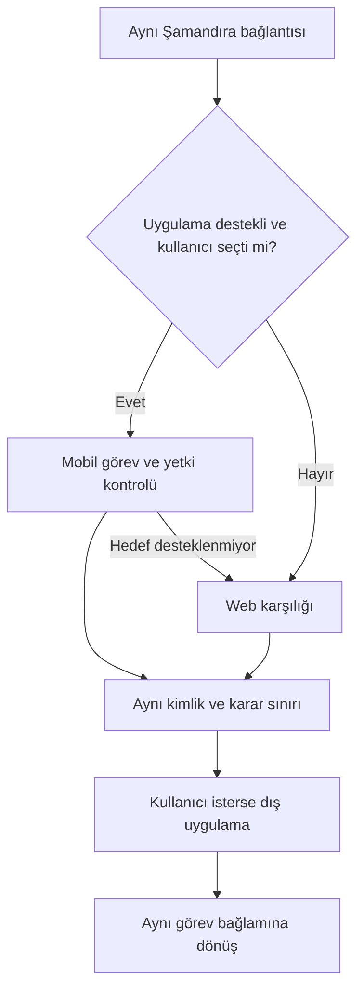
```mermaid
flowchart TD
    L["Aynı Şamandıra bağlantısı"] --> U{"Uygulama destekli ve kullanıcı seçti mi?"}
    U -->|"Evet"| A["Mobil görev ve yetki kontrolü"]
    U -->|"Hayır"| W["Web karşılığı"]
    A --> D["Aynı kimlik ve karar sınırı"]
    W --> D
    A -->|"Hedef desteklenmiyor"| W
    D --> X["Kullanıcı isterse dış uygulama"]
    X --> R["Aynı görev bağlamına dönüş"]
```

## 35. Tablet davranışı

Tablet üçüncü ürün değildir; pencere alanı, metin ölçeği ve giriş yöntemine göre aynı görev mimarisini taşır. Dikey kullanımda tek etkin görev; yeterli alanda ana iş ile ilişkili yardımcı bağlam birlikte erişilebilir olabilir. İki görevin aynı anda görünmesi iki bağımsız kaydetme otoritesi yaratmaz.

Keşfet ile seçili Yer, rota ile etki incelemesi veya editör kanıtı ile gerekçesi ilişkilendirilebilir. Ana içerik okunamaz hale geliyorsa yardımcı bağlam ayrı adıma döner. Bölünmüş ekran, ekran klavyesi, yön değişimi ve büyük metin kullanılabilir alanı daraltır; cihaz adı geniş düzen dayatmaz.

Klavye/fare bağlamak tüketiciye iç rol vermez. Dokunma, kalem ve klavye aynı taşıma/silme görevlerini yapabilmelidir; yalnız sürükleme ve hover yolu yoktur. İç yönetimde geniş karşılaştırma daha verimli olabilir; dar alanda kanıt ve karşı kanıt kaybolmadan adımlar halinde incelenemiyorsa işlem taslakta kalır, ikinci inceleme atlanmaz.

### Diyagram 19 — Tablet görev sürekliliği

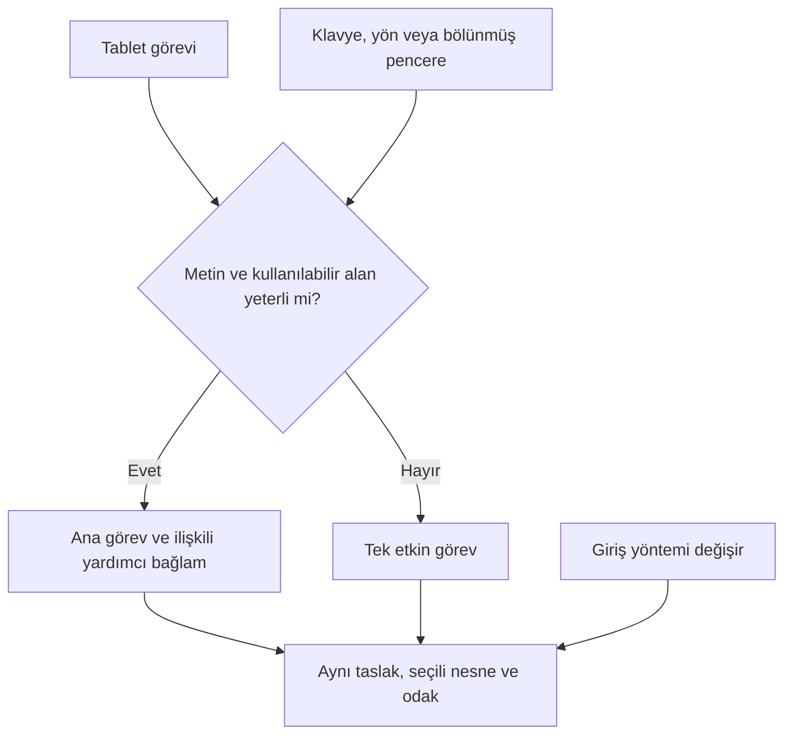
```mermaid
flowchart TD
    T["Tablet görevi"] --> A{"Metin ve kullanılabilir alan yeterli mi?"}
    A -->|"Evet"| P["Ana görev ve ilişkili yardımcı bağlam"]
    A -->|"Hayır"| S["Tek etkin görev"]
    K["Klavye, yön veya bölünmüş pencere"] --> A
    P --> D["Aynı taslak, seçili nesne ve odak"]
    S --> D
    G["Giriş yöntemi değişir"] --> D
```

## 36. Responsive kuralları

Bu bölüm piksel, kolon veya görünüm üretmez. 10 Design System §7–8'in alan ve içerik temelli eşikleri referanstır; burada ekran sorumluluğuna etkisi tanımlanır. Kullanılabilir alan yetmezse sırasıyla yardımcı görünüm ayrılır, içerik yeniden akar, ilişkili alt iş tek göreve dönüşür. Kritik engel, belirsizlik, kimlik veya temel kontrol kaldırılmaz.

| Ekran grubu | Dar alanda korunacak görev | Geniş alanda izinli kolaylık | Yasak anlam değişimi |
| --- | --- | --- | --- |
| Keşfet/Arama | Sorgu, koşul ve anlamlı küçük sonuç kümesi | Aynı küme için yardımcı harita | Geniş ekrana daha iyi/fazla zorunlu öneri |
| Yer/Şehir/İlçe | Kimlik, karar farkı ve kapsam | Pratik bilgiye paralel erişim | Mobilde bilinmeyeni gizleme |
| Akıllı Rota/Düzenleme | Tek taslak ve görünür düzenleme etkisi | Plan ile etkiyi beraber inceleme | Dar ekranda kilit/çelişki kaybı |
| Kişisel kayıt | Tür, filtre ve kayıt hedefi | Uzun arşivi daha rahat tarama | İki kanalın farklı sahiplik anlamı |
| Kimlik/destek | Alan, hata ve geri dönüş | İlişkili yardımın birlikte okunması | Dar ekranda onay/iptal gizleme |
| İç operasyon | Kanıt, gerekçe, yetki, etki | Karşı kanıtı yan yana karşılaştırma | Mobilde toplu işlemi incelemesiz geçirme |

Metin büyütme, uzun Türkçe ad ve çeviri genişlemesi gerçek ekran daralması gibi ele alınır. Başlık kimliği, aktif sert koşul ve hata yalnız kısaltmayla saklanmaz. Aynı ekranın iki paneli daralıp tek göreve dönünce taslak uygulanmaz, katman kendiliğinden kapanmaz, kullanıcı sayfa başına atılmaz.

### Diyagram 20 — Responsive Flow

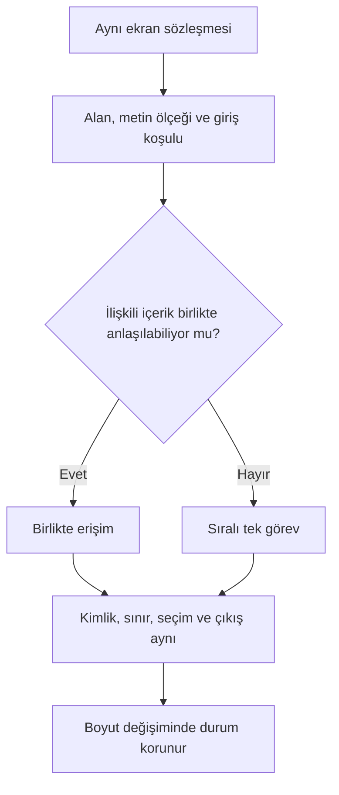
```mermaid
flowchart TD
    I["Aynı ekran sözleşmesi"] --> A["Alan, metin ölçeği ve giriş koşulu"]
    A --> Y{"İlişkili içerik birlikte anlaşılabiliyor mu?"}
    Y -->|"Evet"| B["Birlikte erişim"]
    Y -->|"Hayır"| S["Sıralı tek görev"]
    B --> K["Kimlik, sınır, seçim ve çıkış aynı"]
    S --> K
    K --> D["Boyut değişiminde durum korunur"]
```

## 37. Scroll stratejisi

Her ana görevin bir baskın dikey okuma akışı vardır. Yardımcı panelin bağımsız kaydırması ancak farklı bir içerik kümesini incelemek için gerekliyse kullanılabilir; hangi alanın etkin olduğu anlaşılır. İç içe kaydırma, harita hareketi veya sabit görev alanı kullanıcının çıkışını kilitlemez.

Yer'e geçişte geri dönüş kaydı sadece piksel değil; kaynak ekran, sorgu/filtre bağlamı, görünür öğenin kararlı kimliği, yüklenmiş aralık ve uygun konumsal ofset içerir. Böylece kart boyu, dil veya metin ölçeği değişse de kullanıcı aynı anlamlı yere döner. Kayıt kaldırılmışsa yakın mantıksal öğe ve kısa değişiklik açıklaması kullanılır.

Yeni sorgu kullanıcı tarafından gönderilmişse yeni sonuç bağlamı başlar; sonuç başlığına erişilebilir geçiş yapılabilir. Arka planda güncelleme ise odağı/okuma konumunu çalmaz. Kritik bilgi düzeltilirken metin güncellenir; sırf kaydırma sabit kalsın diye yanlış olumlu anlam korunmaz.

Uzun kişisel arşiv ve iç kuyruk kontrollü sayfalama/“sonrakileri göster” ile ilerler. Yeni öğeler anlaşılır biçimde duyurulur; mevcut odaklı öğe kaybolmaz. Keşfet sonsuz akışa dönüşmez. Rota taşıma sonrası odak taşınan durakta; silme sonrası mantıksal komşuda veya durak ekleme eyleminde kalır. Gizlenen bölümdeki bir hataya doğrudan gidiliyorsa ilgili bölüm açılır.

### Diyagram 21 — Listeye dönüş ve scroll

```mermaid
flowchart LR
    L["Liste: sorgu, filtre, görünür öğe"] --> Y["Yer Detay"]
    Y --> M["Yöntem ayrıntısı"]
    M --> Y
    Y --> G["Geri"]
    G --> K{"Öğe hâlâ var mı?"}
    K -->|"Evet"| A["Aynı bağlam ve anlamlı konum"]
    K -->|"Hayır"| B["Yakın konum ve değişiklik açıklaması"]
```

## 38. Geri dönüş davranışı

Geri eylemi önce etkin geçici alt görevi kapatır, sonra gerçekten önceki görev bağlamına döner. Üst coğrafyaya gitme, Ana Sayfa'yı açma ve “Keşfet” bağlantısı ayrı navigasyon eylemleridir. Tarayıcı/işletim sistemi geri beklentisi yeniden icat edilmez.

| Durum | Geri veya kapat sonucu |
| --- | --- |
| Arama önerileri açık | Önce öneriler kapanır; yazılan sorgu silinmez |
| Çok alanlı filtre taslağı açık | Uygulanmamış değişiklik bırakılır; uygulanmış koşullar sürer |
| Yer, listeden açılmış | Aynı liste, filtre, sorgu ve anlamlı konum |
| Yer, rota durağından açılmış | Aynı taslak ve durak |
| Düzenleme gerçekten yerelde korunmuş | Fazladan onay olmadan önceki görev; kayıt hedefi dürüst kalır |
| Yerelde de korunamayan anlamlı çalışma var | Somut kayıp açıklaması; kalma veya vazgeçme kararı |
| Girişten vazgeçildi | Önceki misafir görevi; özel hesap verisi açılmaz |
| Paylaşım önizlemesi kapatıldı | Özel taslak; yayın yapılmaz |
| Gönderilmiş işlem beklerken geri | Beklemeyi bırakabilir; işlem ayrıca sonuçlanabilir |
| Dış siteden doğrudan giriş | Geri gerçek tarayıcı geçmişine; açık Keşfet ayrı hedef |
| İç görevde yetki kaldırıldı | Özel içerik kapanır; yetkisiz önceki görünüm geriyle açılmaz |

Geri alma, gezinme gerisi değildir. Durak kaldırmayı geri almak kişisel seçimi geri getirir; yeni kapanmayı, silinmiş kaynağı, iptal edilmiş paylaşımı veya sona ermiş yetkiyi geri alamaz. Kullanıcı “günü bitir” dediğinde tamamlanmamış duraklar ziyaret edilmiş sayılmaz.

### Diyagram 22 — Geri ve veri kaybı kararı

```mermaid
flowchart TD
    B["Geri veya kapat"] --> A{"Etkin alt görev var mı?"}
    A -->|"Evet"| K["Alt görevin kapanış sözleşmesi"]
    A -->|"Hayır"| P["Gerçek önceki bağlam"]
    K --> D{"Korunmayan anlamlı çalışma kaybolacak mı?"}
    D -->|"Hayır"| C["Kapat ve odağı döndür"]
    D -->|"Evet"| S["Somut kayıp ve kullanıcı seçimi"]
    S -->|"Kal"| K
    S -->|"Vazgeç"| C
    P --> Y["Yetkiyi ve kayıt geçerliliğini yeniden kontrol et"]
```

## 39. Arama geçmişi

Arama geçmişi, kullanıcının sorguyu tekrar girmesini azaltan özel kolaylıktır; öneri motorunun gizli kullanıcı profili değildir. Varsayılan sözleşme: etkin sorgu oturum içinde korunur; kalıcı geçmiş tutma kullanıcının açık tercihiyle ve açıklanmış cihaz/hesap kapsamıyla açılır. Hesap olması geçmiş eşitleme izni sayılmaz.

| Geçmiş türü | Saklama/erişim mantığı | Silme ve kullanım sınırı |
| --- | --- | --- |
| Etkin sorgu | Görevi geri getirmek için oturumda | Yeni sorgu geçmişi güncelleyebilir; özel kayıt değildir |
| İsteğe bağlı cihaz geçmişi | Bu cihazda; gerçekten yazılabildiği sürece | Tek kayıt veya tüm geçmiş silinebilir; otomatik hesap aktarımı yok |
| İsteğe bağlı hesap geçmişi | Ancak bu hizmet ve açık izin varsa | Çoklu cihaz silme etkisi açıklanır; kesin saklama süresi ayrı politikada |
| Liste içi arama | İlgili kişisel kayıt görevinin durumu | Genel keşif geçmişine karışmaz |
| Hassas serbest ihtiyaç | Varsayılan kalıcı geçmişe alınmaz | Sağlık/özel konum cümlesi ortak cihaz önerisinde görünmez |
| İç operasyon araması | Rol ve iş kapsamına bağlı | Tüketici geçmişi veya ticari analizle birleşmez |

Kişi geçmişten sorgu seçince koşulların ne olduğu görülür; geçmiş sorgu bugünkü zorunlu ihtiyaç olarak sessiz uygulanmaz. “Aynı sorgu” açık seçimle tekrar kullanılır ve güncel kanıtla değerlendirilir. Ziyaret ve kaydetme geçmişi, arama geçmişinden farklı veri türüdür.

“Tüm geçmişi temizle” arama kayıtlarını kapsar; Gezeceğim, Gezdiğim, Rotalar ve Bir İz'i silmez. Hesaptan çıkış o hesap geçmişini sonraki kullanıcıdan kapatır. Silinmiş geçmiş, geç bağlanan cihazdan yeniden doğamaz. Saklama süresi, kapasite ve otomatik temizleme politikası belirlenmeden “her zaman hatırlar” vaadi verilmez.

## 40. Filtre korunması

Uygulanan filtre ile düzenleme taslağı farklıdır. Bu mimari, çok alanlı filtre işinde tutarlı **taslak → uygula / vazgeç** modelini seçer. Tek ve açık görünüm seçimi anlık olabilir; aynı eylem bazen taslak bazen uygulanmış gibi davranamaz.

| Geçiş | Korunan | Yeniden ele alınan |
| --- | --- | --- |
| Keşfet → Yer → geri | Sorgu, uygulanan filtre, sonuç bağlamı, konum | Kritik yeni bilgi |
| Liste ↔ harita | Aynı küme, seçili yer ve koşullar | Yalnız görünüm |
| Filtreyi kapat/vazgeç | Önceki uygulanmış koşullar | Uygulanmamış taslak bırakılır |
| Filtre uygula | Seçilmiş yeni koşullar | Sonuç ve uygunluk değerlendirmesi |
| “Filtreleri temizle” | Sorgu ve kişisel kayıtlar | Hangi koşulların kaldırılacağı açıkça belirtilir |
| Şehir değiştir | Genel amaç ve açık zorunlu ihtiyaçlar görünür kalır | İlçe/alan/geçerli yerel kapsam kaldırılır veya yeniden seçilir |
| Başka şehirde yeni rota | Eski rota korunur | Kullanıcının seçtiği amaç/koşullar taşınır; durak/başlangıç otomatik taşınmaz |
| Hesaba giriş | Etkin misafir keşif bağlamı | Hesaplı özel veri erişimi ve isteğe bağlı aktarım |
| Paylaşım bağlantısı aç | Paylaşılmış izinli kapsam | Alıcının kendi ihtiyacı; sahibin özel filtreleri taşınmaz |

Şehir değişimi uygulanmadan önce başka şehirle ilişkili ilçe/alan seçimlerinin bırakılacağı anlaşılır olur. Basamaksız erişim gibi genel zorunlu ihtiyaç kendiliğinden silinmez; yeni şehirde kanıt bulunamazsa sınırlı/sonuçsuz durum gösterilir. Mevcut rota başka şehir arandığı için taşınmaz veya yeniden sıralanmaz.

Arama metni değişince önceki koşullarla çelişen yeni ihtiyaç kısa ve düzenlenebilir biçimde görünür olur. Açık yeni kullanıcı tercihi eski geçmiş şablonundan üstündür. İki zorunlu ifade çatışıyorsa gizli öncelik vermek yerine ilgili fark kullanıcıya gösterilir. İşaretlenmiş coğrafyanın dışında sonuç getirmek ancak kapsamı açıkça değiştiren eylemdir.

### Diyagram 23 — Filtre taslağı ve şehir değişimi

```mermaid
flowchart TD
    U["Uygulanan koşullar"] --> T["Filtre taslağı"]
    T -->|"Vazgeç"| U
    T -->|"Uygula"| R["Yeni sonuç bağlamı"]
    U --> S["Şehir değiştir"]
    S --> C["Yerel kapsam farkını açıkla"]
    C --> G["Genel açık ihtiyaçlar korunur"]
    G --> R
    S --> K["Mevcut kişisel rota korunur"]
    R --> B["Kanıt yoksa koşul sessiz gevşetilmez"]
```

## 41. State Management mantığı

Bu bölüm kavramsal durum sahipliğidir. Framework, store kütüphanesi, veri tabanı, API veya kod seçmez. Temel kural: **aynı nesnenin yetkili durumu ile ekrandaki geçici çalışma birbirinden ayrılır; hangi bilginin kime ait olduğu görünür sonuçlarda korunur.**

### 41.1. Durum alanları

| Durum alanı | Sahip/sorumluluk | Kalıcılık ve paylaşım |
| --- | --- | --- |
| Kamusal kimlik/yayın | Yetkili bilgi ve yayın süreci | İzinli sürüm ve güncellik sınırıyla kanallara gider |
| Bağlamsal uygunluk | Karar Motoru'nun belirli ihtiyaç/kanıt sonucu | Sadece ait olduğu bağlamda geçerli; üyelik belirlemez |
| Günlük plan değerlendirmesi | Rota ve koordinasyon süreci | Taslak seçimi, gün ve ulaşım bağlamına bağlı |
| Uygulanan keşif koşulları | Kullanıcının etkin keşif görevi | Geri dönüşte korunur; kamusal kısmı adrese yansıyabilir |
| Filtre/arama alt taslağı | Etkin alt görev | Uygulama/vazgeçme ayrımı |
| Kişisel rota seçimi | Kullanıcı; cihaz veya hesap sahipliği | Boş/çelişkili de saklanabilir; yayından ayrı |
| Gezeceğim/Gezdiğim/koleksiyon | Kullanıcının bağımsız kişisel kayıtları | Eylemler birbirini otomatik üretmez |
| Bir İz gönderimi | Kullanıcı beyanı ve gönderim durumu | İnceleme/yayın sonucu ayrı yetki alanı |
| Paylaşılmış seçim | Kullanıcının açık yayın kapsamı | Özel taslağın canlı aynası değildir |
| İşlem durumu | İlgili işlem ve yetkili teyit | Hazır/bekliyor/teyitli/başarısız/belirsiz |
| Gezinme/odak/scroll | Kanalda etkin görev | Kişisel veri eşitlemesi değildir |
| Oturum/rol/hizmet hakkı | Kimlik ve yetkili hizmet durumu | Birbirinden ayrı; istemci görünümü yetki yaratmaz |

### 41.2. Birlikte değişmesi gereken anlam

Gerekçe, önemli bilinmeyen ve ilgili değerlendirme aynı bağlamda görünür. Bir kart yeni gerekçeyi eski uyarıyla; rota yeni sırayı eski toplamla sunamaz. Ekran, son gelen yanıtı “en doğru” kabul etmez: yanıtın sorgu, taslak, gün ve kanıt bağlamı mevcut görevle eşleşmelidir.

Kullanıcının basit yerel değişimi hemen çalışma durumuna yansır. Uzak kaydın teyidi ayrı gelir. Otomatik yerel taslak koruma ile açık hesap kaydetme karışmaz. Gezinme durumu saklanamamışsa rota kaydı başarısız denmez; tersine yalnız ekranın açık kalması verinin kaydedildiği anlamına gelmez.

Silme, geri çekme, erişim kapatma ve kritik geçersizlik geç bağlanan eski kopya tarafından geri alınamaz. Kişisel seçim geri alınabilir; dış gerçeklik ve hak kararı eskiye dönmez. Birleştirme politikası anlam kaybı yaratıyorsa iki kopya korunur.

### 41.3. İşlem sınıfları

| İşlem | Hemen gösterilebilen sonuç | Teyit gerektiren sonuç | Yeniden bağlantı |
| --- | --- | --- | --- |
| Rota sırasını değiştir | Yeni yerel seçim | Uzak kaydetme ve güncel değerlendirme | Son seçim korunur, yeniden değerlendirilir |
| Cihaza kayıt | Başarılı gerçek yerel yazma | Hesapta varlığı ayrı | Otomatik hesap aktarımı yok |
| Hesaba kayıt | Bekleyen istek | Hesaba kaydedildi | İptal/çakışma/yetki kontrolüyle sürdür |
| Bir İz gönder | Gönderim bekliyor | Alındı; inceleme ayrı | İptal edilmemiş açık istek sürdürülür |
| Paylaşımı yayımla/güncelle | Önizleme | Canlı bağlantı/yeni yayın | Güncel önizleme ve açık eylem |
| Paylaşımı kapat | Kapatma bekliyor | Erişim kapandı | Açık istek sürdürülür, teyit beklenir |
| İletişim gönder | Taslak veya gönderim bekliyor | Talep alındı | Sessiz dış gönderim yerine açık gönderime dönüş |
| Premium işlemi | Gerçek teklif ve bekleme | Yetkili işlem/hak sonucu | Önce mevcut sonuç kontrolü |
| İç yayın | Hazır etki önizlemesi | Yayın ve türev sonucu | Güncel yetki/kanıt/etkiyle yeniden inceleme |

### Diyagram 24 — Durum sahipliği

```mermaid
flowchart TD
    B["Yetkili bilgi ve yayın"] --> D["Bağlamsal karar sonucu"]
    U["Kullanıcının açık koşulları"] --> D
    D --> R["Günlük plan değerlendirmesi"]
    T["Kişisel rota seçimi"] --> R
    T --> K["Cihaz veya hesap kaydı"]
    T --> P["Açık paylaşım önizlemesi"]
    P --> Y["Paylaşılmış seçim"]
    G["Gezinme, odak ve scroll"] --> E["Etkin ekran"]
    D --> E
    R --> E
    K --> E
    Y --> S["Salt okunur alıcı görünümü"]
```

### Diyagram 25 — Uzak işlem ve belirsiz sonuç

```mermaid
stateDiagram-v2
    [*] --> Hazir
    Hazir --> Bekliyor: Açık işlem
    Bekliyor --> Teyitli: Yetkili başarı
    Bekliyor --> Basarisiz: Gerçekleşmediği biliniyor
    Bekliyor --> Belirsiz: Yanıt kayboldu
    Belirsiz --> Kontrol: Mevcut sonucu incele
    Kontrol --> Teyitli: İşlem bulundu
    Kontrol --> Basarisiz: Gerçekleşmediği doğrulandı
    Kontrol --> Belirsiz: Sonuç hâlâ bilinmiyor
    Basarisiz --> Hazir: Düzelt veya açık tekrar
```

## 42. Oturum davranışı

Misafir oturum, hesap oturumu ve iç operasyon oturumu farklı kapsamlar taşır. Hesaplı olmak her cihazda bütün içeriğe otomatik erişim değildir; Premium olmak rol değildir. Misafir keşif, temel günlük plan, cihazda gerçekten desteklenen kayıt ve gönüllü katkıyla devam edebilir.

Hesap girişi, mevcut misafir işini kaybettirmez. Yerel kayıtları hesaba aktarma istenirse nelerin taşınacağı, mevcut hesap kayıtlarıyla olası farklar ve aktarılmayacak özel içerik gösterilir. Kullanıcı kapsamı seçer; iki farklı rota sessiz birleştirilmez. Hiç aktarmadan hesap açmak da geçerlidir.

Oturum süresi bittiğinde özel sunucu işlemi durur, kamusal keşif sürer. Korunabilecek yerel taslak korunur; tekrar giriş yalnız hesap işine devam içindir. Uzak iş zaten gönderilmişse yeniden girişten sonra önce sonuç kontrol edilir. Tamamlanmış işlemi tekrar göndermek yoktur.

Çıkışta hesap özel görünümü ve erişilebilir özel önbelleği kapanır. Kullanıcı açıkça seçmedikçe hesap kayıtları misafir görünümüne kopyalanmaz. Önceden var olan misafir verileri hesap verisiyle karıştırılmaz. Başka hesapla girişte diğer hesabın özel kaydı, geçmişi veya bildirim özeti sızmaz. Tarayıcı geri veya uygulama son kullanılan görünümü erişim sınırını aşamaz.

Diğer cihazlardaki oturumları kapatma ve hesabı silme ayrı işlerdir. Uzaktaki oturum iptali çevrimdışı cihazdaki statik görüntünün anında yok edildiği garantisi değildir; bağlantı/yeniden erişimde yetki kontrolü geçerlidir. Hesap silmenin kişisel kayıt, katkı, canlı paylaşım ve sınırlı operasyon izine etkisi birlikte açıklanır; dış statik kopyalar geri alınmış sayılmaz.

## 43. Çoklu cihaz davranışı

Cihazlar arası devam gerçek bir hizmet olarak desteklenirse aşağıdaki sözleşme uygulanır. Bunun ücretsiz mi ileri kolaylık mı olduğu 09'da araştırmaya açıktır; bu belge ticari karar vermez. Her durumda kalıcılık sınırı, temel sahiplik, dışa alma ve ayrılma hakkı dürüst kalır.

- Aynı hesaptaki kalıcı kayıtlar eşitlenebilir; klavye odağı, açık modal ve scroll gibi anlık kanal durumu diğer cihazı yönetmez.
- Açık “bu işe diğer cihazda devam et” seçimi ilgili nesne ve kayıtlı sürüme gider. Gönderilmemiş özel yerel taslağın taşındığı söylenmez.
- Farklı alanlara yapılmış değişiklikler ancak anlam ve sert koşul çatışması yaratmıyorsa birleştirilebilir; sonucun ne olduğu anlaşılır. Aksi durumda iki çalışma korunur.
- Aynı rota sırası, kilit, zaman veya zorunlu ihtiyaç üzerindeki çatışmada son yazan otomatik kazanmaz. Kullanıcı anlamlı farkı görür; birini seçebilir veya bağımsız kopya olarak sürdürebilir.
- Bir cihazda silinen kayıt diğerinin eski eşitlemesiyle dirilemez. Açık silme isteği ve bağımlı erişim sınırı öne alınır; “geri al” ayrı yetkili kullanıcı kararıdır.
- Kritik yer bilgisi güncellemesi kişisel sürüm seçimine tabi değildir. Kullanıcı eski plan sırasını seçebilir, geçersiz eski doğruluk iddiasını seçemez.
- Farklı saat dilimindeki cihaz aynı planın ziyaret yerinin yerel zamanını korur. “Bugün” ifadesi cihaz tarihi değişti diye kayıtlı rota gününü kaydırmaz.

### Diyagram 26 — Çoklu cihaz çakışması

```mermaid
flowchart TD
    A["Cihaz A: kayıtlı rota"] --> X["A düzenlemesi"]
    A --> B["Cihaz B: aynı başlangıç sürümü"]
    B --> Y["B düzenlemesi"]
    X --> C["Eşitlemede fark kontrolü"]
    Y --> C
    C --> K{"Anlam kaybı veya koşul çatışması var mı?"}
    K -->|"Hayır"| M["Anlaşılır birleşik sonuç"]
    K -->|"Evet"| I["İki çalışma korunur"]
    I --> U["Kullanıcı seçim veya bağımsız kopya"]
    S["Silme veya kritik geçersizlik"] --> G["Eski kopya geri canlandıramaz"]
    G --> C
```

## 44. Çoklu sekme davranışı

Aynı tarayıcıdaki iki sekme ortak hesap erişimini kullanabilir, fakat ayrı keşif görevlerine sahiptir. Bir sekmede şehir/sorgu değişince diğer sekmenin görünümü değişmez. Sekmeler arasında paylaşılan kalıcı kayıt ve hesap durumu güncellenebilir; yerel gezinme ve uygulanmamış filtre taşınmaz.

Aynı rotayı iki sekmede düzenlemek çoklu cihazla aynı çakışma sınıfıdır. Sekme A'nın kaydı, B'nin kaydedilmemiş çalışmasını silmez; B güncel farkı görür. Arka plandaki yanıt öndeki sekmenin yeni taslağını ezemez. Bir sekmede paylaşım önizlemesinden sonra diğerinde taslak değişirse eski önizleme açıkça eski kapsamdır; yayın öncesi güncel kapsam yeniden incelenir.

Hesaptan çıkış veya rol iptali diğer açık sekmelerde özel görünümü kapatır ve uzaktaki işlemleri yeniden yetki kontrolüne tabi tutar. Bu, tüm sekmelerin kamusal Keşfet konumunu sıfırlamak değildir. Aynı işlem için iki sekmeden gelen tekrar, kullanıcıya çift kayıt/çift ücret olarak yansımamalı; belirsiz sonuç ortak işlem durumu üzerinden çözülmelidir.

Yeni sekmede kamusal Yer açma tarayıcı beklentisini korur. Özel nesne yeni sekmede açıldığında oturum ve sahiplik yeniden kontrol edilir; sadece URL'nin kopyalanmış olması veri aktarma izni değildir.

### Diyagram 27 — Çoklu sekmede ortak ve ayrı durum

```mermaid
flowchart TD
    A["Sekme A keşif ve taslak"] --> K["Ortak kalıcı kayıt ve oturum"]
    B["Sekme B keşif ve taslak"] --> K
    K --> C["Aynı nesnede sürüm farkı"]
    C --> U["Kaydedilmemiş çalışma korunur"]
    K --> S["Çıkış veya rol iptali"]
    S --> X["Her sekmede özel erişim kapanır"]
    A --> O["A sorgusu B sorgusunu değiştirmez"]
    B --> O
```

## 45. Yetkilendirme akışları

Yetkilendirme ekranı gizlemekten ibaret değildir. Her özel okuma, kayıt, paylaşım yönetimi, rol ve yayın işleminde kişi, nesne, eylem ve güncel kapsam birlikte kontrol edilir. Başlık veya bağlantı bilgisinin kendisi de özel olabilir; erişim reddinden önce sızdırılmaz.

### 45.1. Yetki matrisi

| İşlem | Misafir | Hesap sahibi | Premium sahibi | Editör / yayın rolü | Ticari yönetim rolü |
| --- | --- | --- | --- | --- | --- |
| Kamusal keşif/Yer/yöntem | Evet | Evet | Aynı hak | Tüketiciyle aynı yayın | Tüketiciyle aynı yayın |
| Cihaz kişisel kaydı | Desteklenen yerel kapsam | Ayrı cihaz kapsamı | Aynı temel hak | Rol ek hak vermez | Rol ek hak vermez |
| Hesap özel kaydı | Hayır | Yalnız kendi kayıtları | Aynı sahiplik | Görev dışı erişim yok | Görev dışı erişim yok |
| Bir İz katkı | Gönüllü | Gönüllü | Aynı kanıt değeri | İnceleme ayrı yetki | Ham katkı erişimi yok |
| Katkı geri çekme | Yönetim erişimiyle | Kendi katkısı | Aynı hak | Yetkili süreç etkisini işler | Yetki vermez |
| Salt okunur paylaşım | Geçerli okuma erişimi | Aynı | Aynı | Yönetim erişimi sayılmaz | Yönetim erişimi sayılmaz |
| Paylaşım güncelle/kapat | Ayrı sahip yönetim erişimi | Kendi yayını | Aynı temel hak | Görev dışı yönetim yok | Görev dışı yönetim yok |
| İddia inceleme | Hayır | Hayır | Hayır | Atanmış görev ve kaynak hakkıyla | Hayır |
| İçerik yayın/kimlik birleştirme | Hayır | Hayır | Hayır | İlgili eylem yetkisi; gerekirse ikinci inceleme | Hayır |
| Premium hak işlemi | Hayır | Yalnız kendi kullanıcı yönetimi | Yalnız kendi kullanıcı yönetimi | Ticari rol ayrıca gerek | Asgari yetkili hizmet kapsamı |
| Rol/erişim atama | Hayır | Hayır | Hayır | Editör olmak yetmez | Ticari rol olmak yetmez; ayrı admin yetkisi |

Tablodaki hesap sahibi bir işletme sahibi olsa bile kamusal bilgi ve sıralama hakkı satın alamaz. Küçük ekipte aynı kişi farklı rolleri taşıyabilir; etkin rol, gerekçe ve gerekli bağımsız inceleme ayrımı kaybolmaz. İkinci inceleme gereken işte kişinin başka rolüne geçmesi bağımsız inceleme yerine geçmez.

### 45.2. Yetki kaybı ve hassas işlemler

Önizleme sırasında yetki kaybolursa işlem durur ve içerik erişimi daraltılır. Kimlik birleştirme, geniş yayın, hak geri çekme veya hesap silme etkisi somutlaştırılır. Onay zaman aşımı kabul/yayın değildir. Gerekli yeniden kimlik doğrulama kullanıcıya neden bu özel işlem için gerektiğini söyler; aynı görevde gereksiz tekrar sorulmaz.

Misafir okuma bağlantısı ile sahip yönetim erişimi ayrı tutulur. Bir okuma kodunu bilen herkesin planı iletebilmesi, özel taslağı düzenleme veya bağlantıyı kapatma hakkı vermez. Yönetim erişimi kaybında doğrulanabilir alternatif yoksa yetki uydurulmaz; asgari veriyle destek incelemesi yapılır, kurtarma garantisi verilmez.

### Diyagram 28 — İşlem yetkilendirme kapısı

```mermaid
flowchart TD
    I["Özel işlem isteği"] --> K["Kişi ve oturum"]
    K --> N["Nesne sahipliği veya görev kapsamı"]
    N --> E["Eylem yetkisi"]
    E --> G["Güncel kayıt, kanıt ve etki"]
    G --> S{"Bağımsız ek inceleme gerekli mi?"}
    S -->|"Evet"| D["Yetkili ikinci inceleme"]
    S -->|"Hayır"| U["Açık somut işlem"]
    D --> U
    U --> T["Gerçek sonuç ve denetim"]
    K -->|"Yetersiz"| R["Özel veri ifşa etmeden durdur"]
    N -->|"Yetersiz"| R
    E -->|"Yetersiz"| R
```

## 46. Gezeceğim, Gezdiğim, Akıllı Rotalar, Bir İz ve Premium ilişkisi

### 46.1. Beş ayrı sorumluluk

| Kavram | Yanıtladığı soru | Temel nesne | Karar açısından anlamı |
| --- | --- | --- | --- |
| Gezeceğim Yerler | Daha sonra nereyi değerlendirmek istiyorum? | Kişisel niyet kaydı | Gitme sözü, beğeni veya günlük plan değildir |
| Gezdiğim Yerler | Nerede bulunduğumu ben beyan ettim? | Bir ziyaret olayı | Bugünkü uygunluk veya memnuniyet kanıtı değildir |
| Akıllı Rotalar | Seçtiğim yerleri belirli günlük bağlamda nasıl planlıyorum? | Kişisel günlük taslak ve ayrı değerlendirme | Kaydedilmiş olması uygulanabilirliğini kanıtlamaz |
| Bir İz | Gerçek ziyaretimde hangi somut koşulu gözlemledim? | Gönüllü katkı ve ayrı inceleme süreci | Alınması, doğru/yayımlanmış olduğu anlamına gelmez |
| Premium | Hangi ek tekrar işini ücretli kolaylık azaltıyor? | Gerçek hizmet hakkı | Bilgi, uygunluk veya kullanıcı statüsü değildir |

Bir yer aynı anda niyet havuzunda, birden fazla günlük taslakta ve birden fazla geçmiş ziyaret olayında bulunabilir. Aynı kişiye ait birden fazla gözlem varsa her birinin bağlamı ve geri çekme kapsamı ayrı izlenir. Kişisel koleksiyon bu kayıtları düzenler; yeni gezi doğrulama veya şehir tamamlama nesnesi değildir.

Ekran sorumlulukları bu ayrımı korur: E09 gelecekteki niyeti; E10 geçmiş beyanı; E07/E08 günlük seçimi ve etkisini; E11 gözlem gönderimini; E13 hizmet kapsamını taşır. Profil bunların özeti/erişimidir; bütün veriyi bir “benim seyahat skorum” nesnesinde birleştiremez.

### 46.2. İşlem etkileri matrisi

| Açık işlem | Değişen | Kendiliğinden değişmeyen | Kullanıcıya gösterilecek sonuç |
| --- | --- | --- | --- |
| Yeri Gezeceğim'e ekle | O niyet kaydı | Ziyaret, rota, Bir İz | Cihaz/hesap hedefiyle niyet kaydı |
| Yeri rotaya ekle | Seçilmiş rota durağı | Gezeceğim listesi ve ziyaret | Yeni taslak; güncel değerlendirme bekleyebilir |
| Gezeceğim'den seçerek rota kur | Yeni/seçilmiş günlük taslak | Niyet kayıtları | Kopyalanan seçim ve günlük kapsam |
| “Buradaydım” beyanı | Belirli ziyaret kaydı | Bir İz ve tekrar niyeti | Ziyaret beyanı; tarih varsa gerçek tarih |
| Rotadaki belirli ziyareti işaretle | O durak olayı ve açık ziyaret kaydı | Başka günlük rota/başka tarih | Hangi ziyaretin işaretlendiği |
| Genel geçmiş kaydı ekle | Genel ziyaret hafızası | Bugünkü aktif rotanın tamamlanması | Geçmiş beyanı |
| Bir İz gönder | Katkı gönderim durumu | Yayın, beğeni, niyet | Gözlemin alındı/bekliyor durumu |
| Niyet kaydını kaldır | Yalnız o niyet ilişkisi | Rotadaki durak, geçmiş ziyaret, katkı | Kapsamlı kaldırma ve temel geri alma |
| Ziyareti kaldır | İlgili ziyaret beyanı | Katkı, diğer ziyaret, niyet | Katkının ayrı yönetildiği ilgili açıklama |
| Katkıyı geri çek | Katkı kullanımı ve bağımlı iddiaların incelemesi | Bağımsız kanıt, kişisel ziyaret | Geri çekme aşaması; gerçek tamamlanma |
| Rotayı sil | Sahip olunan o özel plan | Niyet, geçmiş, başka kişinin bağımsız kopyası | Canlı paylaşım etkisi ayrıca somutlaştırılır |
| Koleksiyonu sil | Grup ve üyelik ilişkileri | Yer, ziyaret, rota nesnesi, başka koleksiyon | Grubun kaldırıldığı; içerik silme ayrı kapsam |
| Premium iptali | Gerçek ek hizmetin gelecek kapsamı | Temel kayıt/kontrol ve karar kalitesi | Süre/etki gerçek hizmet koşuluyla |
| Hesabı sil | Açıklanmış hesap ve bağlı veri kapsamı | Geri alınamaz dış kopyalar | Kayıt/katkı/canlı paylaşım/operasyon etkisi birlikte |

Rotayı silme sırasında ona bağlı aktif canlı paylaşımlar varsa kullanıcı bunların etkisini görür. Bu mimarinin varsayılanı, sahibi tarafından kalıcı silinen özel rotanın bağlı canlı yayınlarının da kapatılmasını aynı açık işlem kapsamına almaktır; kullanıcıya işlem öncesi somut olarak belirtilir. Başka kişinin bağımsız kopyası ve dış statik içerik silinemez. Uzak kapatma teyidi yoksa yalnız taslak silindi diye canlı erişim kapandı denmez.

Birleştirilmiş silme isteği kullanıcıya beş farklı bürokratik işlem yaptırmaz. “Bu ziyaret ve buna ait katkımı kaldır” gibi açık kapsam birlikte ele alınabilir; sonuçlar ayrı yetkili aşamalarda izlenir. Kavramsal ayrım kullanıcıya gereksiz iş yükleme gerekçesi değildir.

### 46.3. Günlük planın yeniden kullanılması

Kaydedilmiş rota açılınca kullanıcının seçtiği yerler ve sıra korunur. Tarih, ulaşım, başlangıç ve koşul değişmişse güncel değerlendirme yapılır. “Bu planı bugün kullan” açık eylemi yeni günlük kullanım bağlamı açar; eski ziyaretler bugüne taşınmaz. Tarihsiz taslak daha sonra tarihlendirilebilir; bu işlem geçmiş beyan üretmez.

Seçilmiş durak zorunlu durak değildir. Yer, saat ve göreli sıra sabitlemesi üç ayrı kullanıcı niyetidir. Düzenlemede biri değişince diğerleri kendiliğinden çözülmez. Bir yer artık uygun değilse neden anlatılır; kullanıcı kendi taslağında tutabilir fakat uygun öneri/uygulanabilir plan gibi gösterilemez.

### 46.4. Paylaşımın yaşamı ve ekran sorumluluğu

Paylaşım için E07/E08'e bağlı **önizleme ve erişim yönetimi alt görevi** vardır. Otuz ekran dışında yeni sosyal portal değildir. Üç nesne ayrılır: özel taslak, kullanıcının yayımlamayı seçtiği kapsam ve alıcının bağımsız kopyası.

Önizleme; nötr başlık, şehir, seçilmiş duraklar, sıra, gerekli zaman/süre kapsamı, bilginin önemli sınırı ve yayın tarihi/kapsamını gösterir. Ev/otel başlangıcı, özel bütçe, sağlık/grup bilgisi, kişi adları, özel notlar, geçmiş ziyaretler, katkılar, rezervasyon ve gerçek zaman konumu varsayılan dışarıda kalır. Özel koşul çıkarılınca olumlu iddia aşırı genelleşecekse iddia da daraltılır veya kaldırılır.

Kullanıcı yayınlamayı açıkça seçer. Bağlantıyı bilenin iletebileceği açıklanır; “yalnız arkadaşların” vaadi verilmez. Alıcı hesap veya uygulama kurmadan okur. Özel taslak daha sonra değişirse canlı seçim ancak yeni önizleme ve yayın eylemiyle değişir. Kritik bilgi düzeltmesi canlı iddianın yanlış anlamını beklemeden sınırlar; kullanıcının seçilmiş duraklarını sessizce yeniden düzenlemez.

Sahip bağlantıyı kapatabilir; varsa süre sonunu kontrol edebilir. Bunlar ücretsizdir. Offline kapatma “kapatma bekliyor; bağlantı hâlâ açılabilir” durumudur. Statik Story, mesaj, ekran görüntüsü veya bağımsız kopya uzaktan geri alınamaz. QR yalnız aynı okuma bağlantısının erişim aracıdır; metin bağlantısı ve aynı cihazda açma yolu bulunur. QR ve statik hazırlama ayrı kabul/uygulama kapısına bağlıdır; bu görev görsel üretmez.

Alıcının “kendi günüme uyarlayayım” eylemi bağımsız taslak açar. Sahibin özel koşulları kopyalanmaz; paylaşılmış gerekli plan sınırı ise kaybolmaz. Alıcı kendi koşullarını seçer ve yeniden değerlendirme alır. İlk sahibin sonra yaptığı düzenleme alıcının taslağına otomatik işlemez; aynı kamuya açık iddiaların kritik düzeltmeleri yeni kullanımda geçerlidir.

### Diyagram 29 — Paylaşımın üç nesnesi

```mermaid
flowchart TD
    T["Özel rota taslağı"] --> P["Seçilmiş kapsam ve mahremiyet önizlemesi"]
    P --> U["Açık yayın"]
    U --> L["Canlı salt okunur seçim"]
    T --> E["Özel düzenleme"]
    E --> P
    L --> A["Alıcı okur"]
    A --> K["Kendi bağlamında bağımsız taslak"]
    I["Kritik bilgi düzeltmesi"] --> L
    L --> S["Sahip kapatma ister"]
    S --> C["Teyitle canlı erişim kapanır"]
    L --> D["Dış statik kopya"]
    D --> X["Uzaktan geri alınamaz"]
```

### 46.5. Premium'un ortak çekirdeğe bağımlılığı

Premium adayları ancak gerçek tekrar işini azalttığı, maliyeti taşınabildiği ve ücretsiz hakkı zedelemediği gösterilirse açılır. İleri kişisel sürüm karşılaştırması, açık tercih şablonu veya davetli ortak düzenleme örneği gelecekte incelenebilir; aday listesi lansman değildir. Temel koleksiyon, kayıt, adlandırma, düzenleme, geri alma, güncel değerlendirme ve salt okunur paylaşım ücretli kıtlığa dönüştürülmez.

Premium, Karar Motoru'na “daha iyi sonuç üret” bayrağı gönderilen ürün anlamına gelemez. Aynı açık ihtiyaç ve kanıtta uygunluk, gerekçe, önemli bilinmeyen ve kritik güncelleme aynıdır. Ücretli kullanıcıya daha güncel kaynak, daha dikkatli editör veya öncelikli iddia doğrulaması vermek de bu sınırı ihlal eder.

Sona eren hizmet yeni ileri kolaylığı durdurabilir; mevcut rota gününü, temel düzenlemeyi, kayıt erişimini, paylaşımı kapatmayı ve izinli kişisel dışa almayı kapatamaz. Aktif günlük planda sürpriz ödeme geçidi olmaz. Kullanıcı ek kolaylığı reddettiğinde aynı bağlamda yeniden teklif yağmuru yapılmaz.

### Diyagram 30 — Premium yaşamı ve temel haklar

```mermaid
flowchart TD
    U["Ücretsiz kullanım"] --> C["Ortak bilgi ve karar"]
    P["Premium kullanım"] --> C
    P --> E["Gerçek ek kolaylık"]
    E --> I["İptal veya süre sonu"]
    I --> B["Temel kayıt ve kontrol sürer"]
    U --> B
    B --> R["Oku, düzenle, değerlendir, paylaşımı kapat"]
    C --> R
    T["Yeni ticari öneri"] --> K{"Karar kalitesini veya temel hakkı değiştiriyor mu?"}
    K -->|"Evet"| X["Reddet"]
    K -->|"Hayır"| D["Gerçek değer ve işletim araştırması"]
```

## 47. Önemli mimari kararların gerekçesi

| Karar | Neden seçildi? | Bedeli | Değişiklik hangi sınırda olabilir? |
| --- | --- | --- | --- |
| Gezeceğim ve Gezdiğim ayrı | Gelecek niyet ile geçmiş beyanın farklı zamanı ve silme anlamı vardır; aynı yer ikisinde de olabilir | Kullanıcı iki kavram öğrenir | Erişim ve anlatım sadeleşebilir; veri anlamları birleşemez |
| Akıllı Rota ayrı görev | Günlük sıra, varış, süre, ulaşım ve kilitler tek yer/listeden farklı sorumluluktur | Bir görev daha öğrenilir | Tek durakta sadeleşir; çok günlük organizatöre sessiz genişlemez |
| Bir İz yorum değildir | Somut gözlem kaynaklı inceleme girdisidir; memnuniyet/sosyal kanıt farklı üründür | Hacimli görünür içerik ve sosyal büyüme araçları kullanılmaz | Soru ve bağlam değişebilir; yıldız/yorum yayınına dönüşüm bu mimarinin değişikliği değildir |
| Premium karar kalitesini değiştiremez | Temel vaat ödeme yerine kişinin açık ihtiyacına dayanır | Gelir seçenekleri daralır | Tekrar işi kolaylığı araştırılabilir; doğruluk/güncellik/temel kontrol satılamaz |
| Arama ayrı portal değildir | Aynı sorgu, koşul ve sonuç iki yerde yönetilirse bağlam çatallanır | Arama görünümünün ebeveyni açık anlatılmalı | Açılış biçimi değişebilir; sonuç otoritesi tek kalır |
| Kaydettiklerin Keşfet içinde | Yeni kişisel portal açmadan niyete/rotaya dönmeyi sağlar | Arşive erişimin bulunabilirliği sınanmalı | Aynı sözleşmede görünür erişim güçlenebilir; ana menü değişimi referans kararı ister |
| Profil özel kontrol alanıdır | Kayıtlar kişinin iradesi ve mahremiyetidir | Sosyal profil beklentisi karşılanmaz | Hesap işleri gelişebilir; kamusal ziyaret/follower modeli ayrı ürün kararıdır |
| Şehir ve İlçe koşullu sayfa | Coğrafi kimlik tek başına özgün karar bilgisi sağlamaz | Bazı alanlarda yalnız filtreli keşif bulunur | Kanıt ve özgün fark gelişirse sayfa açılır |
| Harita yardımcıdır | Coğrafi görselleştirme erişilebilirlik veya uygunluk kanıtı değildir | İki görünümün tutarlılığı bakılır | Harita daraltılabilir; eşdeğer liste korunur |
| Özel taslak ve canlı paylaşım ayrı | Çalışma değişikliği otomatik mahremiyet/yayın kararı olamaz | Yeni yayını bilerek güncellemek gerekir | Önizleme sadeleşebilir; açık yayın iradesi kaldırılamaz |
| Sistem durumları ebeveynde | Hatanın/boşluğun anlamı iş bağlamıyla anlaşılır | Ortak sözleşme her görevde doğru uyarlanmalı | Tam görev engelinde tam hata; bağımsız içerik portalı yok |
| İç roller tüketiciden ayrı | Kanıt, yayın ve ticari işlem farklı yetkidir | Küçük ekipte rol yönetim yükü | Aynı kişi sınırlı roller taşıyabilir; denetim ve bağımsız inceleme erimez |

Bu kararların ortak ölçütü daha az menü veya daha az tıklama değildir. Kullanıcı “neyi seçtim, neyi biliyorum, ne kaydedildi ve şimdi ne yapabilirim?” sorularını doğru cevaplayabilmelidir. Ayrı sözleşme bunu kolaylaştırmıyorsa yüzey sadeleştirilir; veri ve yetki anlamı sessiz birleştirilmez.

## 48. Kullanıcı senaryoları

Aşağıdaki senaryolar yapılmış araştırma sonuçları değil, ekran mimarisinin gözlenebilir kabul görevleridir. Örnek yerler gerçek uygunluk iddiası değildir. Kullanıcı hiçbir senaryoda hesap, katkı veya Premium zincirini tamamlamak zorunda değildir.

### S01 — İlk kez gelen kullanıcı

**Başlangıç:** Ana Sayfa'yı açar, ürünü tanımaz ve belirli bir yer bilmez. **Akış:** E01'de amacı anlar; Onboarding'i atlayabilir; E03'e kendi ihtiyacını yazar; E02'de anlaşılan koşulları görüp gerekirse düzeltir; az sayıda anlamlı seçenekten E04'e geçer. **Karar:** Gitmek, başka seçenek veya çekimserlik. **Kesinti:** AI yanıtı yoksa manuel koşul/ad araması sürer. **Kabul:** İlk değer hesap, konum izni, eğitim veya ödeme gerektirmez; kullanıcı önerinin nedenini ve önemli bilinmeyeni söyleyebilir.

### S02 — Belirli yer arayan kullanıcı

**Başlangıç:** Adını bildiği yerin doğru şubesini bulmak ister. **Akış:** Ara → E03 kimlik eşleşmeleri → ilçe/şehir ayrımı → E04. Kapalı veya ihtiyacına uymayan yer kimlik olarak bulunabilir. **Karar:** Kimliği doğrulamak, gitmemek veya pratik bilgiyle devam etmek. **Kesinti:** Yazım farkı başka şubeye sessiz atlatmaz; sonuç yoksa sorgu korunur. **Kabul:** Adla bulunmuş yer önerilmiş yer gibi sunulmaz; gereksiz rota oluşturma istenmez.

### S03 — Akıllı rota oluşturan kullanıcı

**Başlangıç:** Birkaç yeri günlük zaman aralığında değerlendirmek ister. **Akış:** E02/E09'dan seçilen yerler → E07 → yalnız gerekli tarih/başlangıç/ulaşım bağlamı → bir ana plan → E08'de bir durak çıkarma → yeniden değerlendirme. **Karar:** Kaydetmek, düzenlemek veya çelişkiyi taslak bırakmak. **Kesinti:** Ulaşım bilgisi yoksa kuş uçuşundan kesin toplam üretilmez. **Kabul:** Çıkarılan yer otomatik başka durakla doldurulmaz; eski toplam yeni sıraya ait görünmez.

### S04 — Premium kullanıcı

**Başlangıç:** Varsa kabul edilmiş bir tekrar kolaylığını kullanır; aynı koşullarla ücretsiz kullanıcı da arama yapabilir. **Akış:** E13'te gerçek kapsamı görür, ek işini seçer, E07/E08 ortak karar görevine döner. **Karar:** Kolaylığı kullanmak veya ücretsiz yolla devam etmek. **Kesinti:** Premium süresi aktif plan sırasında biter. **Kabul:** Mevcut rota açılır, temel düzenleme ve güncel sınırlar sürer; iki kullanıcının bilgi ve uygunluk değerlendirmesi eşittir. Henüz hizmet yoksa senaryo lansman olmuş gibi yürütülmez.

### S05 — Misafir kullanıcı

**Başlangıç:** Hesap açmak istemez. **Akış:** E02 → E04 → Gezeceğim'e ekle → cihazda gerçek kayıt teyidi → Kaydettiklerin'de aynı kayıt. İsterse E07 taslağı oluşturur. **Karar:** Cihazda devam etmek veya daha sonra açık hesap isteği. **Kesinti:** Tarayıcı verisi silinir/başka cihaz açılır. **Kabul:** Cihaz kaydı bulut kaydı gibi anlatılmaz; kurtarılamayan veri için yanlış vaat verilmez. Misafirlik temel keşif/rota/katkı hakkını azaltmaz.

### S06 — Şehir değiştiren kullanıcı

**Başlangıç:** Bir şehirde kayıtlı rotası varken başka şehirde arama yapmak ister. **Akış:** E02 coğrafyayı değiştirir; eski ilçe/alan kapsamının değişeceğini görür; genel zorunlu ihtiyacı kalır; yeni E05/E02'ye gider. Yeni rota isterse E07'de ayrı taslak açar. **Karar:** Yeni şehrin kapsamını değerlendirmek. **Kesinti:** Yeni şehirde zorunlu erişim koşulu kanıtlanamaz. **Kabul:** Koşul silinmez, eski rota taşınmaz, yeni uygunluk uydurulmaz; hangi amaç/koşulların yeni taslağa taşınacağını kullanıcı belirler.

### S07 — Rotasını paylaşan kullanıcı

**Başlangıç:** Ev/otel başlangıcı ve özel notu olan bir günlük planı paylaşmak ister. **Akış:** E07 → paylaşım önizlemesi → çıkarılmış özel alanları ve kalan sınırı inceleme → açık yayın → bağlantıyı kullanıcının seçtiği kanalda aktarma. **Karar:** Seçilmiş kapsamı yayımlamak veya vazgeçmek. **Kesinti:** Daha sonra özel taslak düzenlenir ya da bağlantı kapatılır. **Kabul:** Düzenleme canlı yayına sessiz geçmez; kapatma teyitli anlatılır; dış statik kopyanın geri alınamadığı paylaşım öncesinde anlaşılır.

### S08 — Gezdiği yerleri işaretleyen kullanıcı

**Başlangıç:** Geçmişte gittiği yeri hatırlar, tarihini bilmez. **Akış:** E04 → açık ziyaret beyanı → E10; tarih bilinmiyor kalır; isterse tekrar niyeti E09'a ayrıca ekler. Bir İz isteğe bağlıdır. **Karar:** Kişisel hafızasını tutmak. **Kesinti:** Yanlışlıkla aynı eyleme iki kez basar. **Kabul:** Aynı ziyaret çoğalmaz; rota günü veya bugünün tarihi otomatik atanmaz; ziyaret beğeni, katkı veya bugünkü rota tamamlanması sayılmaz.

### S09 — Paylaşılan rotayı açan misafir alıcı

**Başlangıç:** Mesajdaki bağlantıyı telefonda açar; uygulama ve hesap yoktur. **Akış:** Salt okunur web görünümü → seçilmiş duraklar ve sınırlar → isterse kendi günüme uyarla → bağımsız E07 taslağı. **Karar:** Yalnız okumak veya kendi planını kurmak. **Kesinti:** Sahip bağlantıyı kapatmış olabilir. **Kabul:** Kapalı bağlantı özel içeriği sızdırmaz; geçerli bağlantı uygulama mağazasına zorlamaz; alıcının kopyası sahibinin özel taslağını izlemez.

### S10 — Katkı verip geri çeken kullanıcı

**Başlangıç:** Gerçek ziyareti zaten açıkça bildirilmiştir. **Akış:** E11 tek nötr gözlem → alındı teyidi → mevcut göreve dönüş → daha sonra katkı yönetiminden geri çekme. **Karar:** Gözlemi vermek veya geri çekmek. **Kesinti:** İşlem çevrimdışı bekleyebilir. **Kabul:** Ziyaret tekrar sorulmaz, alındı yayımlandı sayılmaz; geri çekme katkıya dayalı türevleri incelemeye taşır; kişisel ziyaret kaydı otomatik silinmez.

### S11 — Zorunlu koşul için kanıt bulamayan kullanıcı

**Başlangıç:** Basamaksız erişimi açık zorunlu koşul belirtir; yalnız giriş rampası bilgisi vardır. **Akış:** E03 → E02 koşul özeti → kanıt yetersizliği → isterse E21 yöntemi → koşulu değiştirmeden başka kapsam. **Karar:** Doğrulanmayan seçeneği uygun saymadan devam etmek veya vazgeçmek. **Kabul:** Başka avantajlar erişim eksikliğini telafi etmez; sonuçsuzluk Premium teklifi doğurmaz.

### S12 — Offline rota düzenleyen kullanıcı

**Başlangıç:** Cihazında kayıtlı planla dışarıdadır; bağlantı kesilir. **Akış:** E26 sınırı → E08'de durak çıkarma → gerçek yerel kayıt → bağlantıda güncel değerlendirme ve varsa diğer cihaz farkı. **Karar:** Yerel seçimi korumak veya değişiklikleri karşılaştırmak. **Kesinti:** Paylaşımı kapatma isteği bekler. **Kabul:** Bağlantı teyidinden önce kapandı denmez; yeni sıra için eski süre uygunluk kanıtı olmaz.

### S13 — İki cihazda aynı rotayı düzenleyen kullanıcı

**Başlangıç:** Bilgisayarda süreyi, telefonda durak sırasını değiştirmiştir. **Akış:** Uzak kayıtta fark algılanır → iki değişiklik ve koşul etkisi gösterilir → kullanıcı anlaşılır birleşim veya ayrı kopyayı seçer. **Karar:** Hangi kişisel planla devam edeceği. **Kesinti:** Bir cihazda rota silinmiştir. **Kabul:** Son yazan sessiz kazanmaz; silinmiş kayıt eski cihazdan otomatik dirilmez; kritik bilgi düzeltmesi kişisel sürüm seçimine bağlı kalmaz.

### S14 — Hesap girişi sırasında vazgeçen kullanıcı

**Başlangıç:** Misafir taslağını hesapta saklamak ister, girişe gider ve vazgeçer. **Akış:** E07 → E16 → vazgeç → aynı E07 taslağı. Sonra kayıt isterse E17 ve ayrı yerel aktarım kapsamını inceler. **Karar:** Misafir devam veya hesap hizmeti. **Kabul:** Taslak kaybolmaz, zorunlu Premium seçilmez; giriş başarıyla bitse bile tüm cihaz geçmişi otomatik hesaba taşınmaz.

### S15 — Bildirimle kritik değişikliğe dönen kullanıcı

**Başlangıç:** Aktif plandaki bir durağın beklenen varış saatinde kapalı olduğu bilgisi değişmiştir; ilgili bildirim izni vardır. **Akış:** Mahremiyet koruyan olay → E07 ilgili durak → değişiklik ve seçenekler → E08 yalnız kullanıcı seçerse düzenleme. **Karar:** Planı değiştirmek veya bilinen sınırla taslakta bırakmak. **Kabul:** Okundu durumu sorunu çözmez; durak otomatik silinmez; bildirim izni kapalı olsa da uygulamadaki kritik sınır görünürdür.

### S16 — Editörün çelişkili katkıyı incelemesi

**Başlangıç:** İki izinli gözlem farklı zaman/alan bilgisi taşır. **Akış:** E28'de hak ve kapsam → kanıt/karşı kanıt → gerekçeli sınırlı veya yetersiz değerlendirme → gerekliyse ikinci inceleme → E29'da etki. **Karar:** Kapsamı daraltmak veya yayını bekletmek. **Kabul:** Katkı sayısı çoğunluk doğrusu yaratmaz; AI veya ticari hesap bilgisi karar otoritesi değildir.

### S17 — Uzun metin ve klavyeyle tablet kullanımı

**Başlangıç:** Büyük metin açık, tablet bölünmüş pencerededir. **Akış:** E02 filtreyi açar → E04 inceler → E07/E08'de görünür taşıma eylemiyle sıra değiştirir → geri döner. **Karar:** Aynı günlük seçimi erişilebilir biçimde düzenlemek. **Kabul:** Kritik koşul ve eylem kesilmez; sürükleme gerekmez; panelin tek göreve dönüşmesi taslağı uygulamaz/kaybettirmez.

### S18 — Yanıtı kaybolan hizmet işlemi

**Başlangıç:** Gerçekten açık bir Premium hizmetinde işlem başlatılmış, yanıt alınamamıştır. **Akış:** E13 belirsiz sonuç → mevcut işlem kontrolü → teyit varsa gerçek hak sonucu; yokluğu doğrulanırsa açık tekrar. Gerekiyorsa sınırlı E30 destek incelemesi. **Karar:** Sonucu öğrenmek veya uygun destek. **Kabul:** Çift ödeme/hak değişikliği üretilmez; ticari operasyon sorunu keşif ve kayıt hakkını kesmez. Bu senaryo gerçek hizmet açılışına koşulludur.

### Diyagram 31 — İlk değer kullanıcı yolculuğu

```mermaid
flowchart LR
    A["İlk ziyaret"] --> I["İhtiyacını ifade et"]
    I --> K["Koşulları anla ve düzelt"]
    K --> Y["Az sayıda anlamlı seçenek"]
    Y --> D["Yer kararı"]
    D --> G["Git veya vazgeç"]
    D --> S["İsteğe bağlı kayıt"]
    D --> R["İsteğe bağlı günlük plan"]
    D --> M["Gerekirse yöntem"]
    M --> D
```

### Diyagram 32 — Şehir değiştirirken planı koruma

```mermaid
flowchart TD
    A["Eski şehirde kişisel rota"] --> K["Keşif için başka şehir seç"]
    K --> E["Eski rota değişmeden kalır"]
    K --> Y["Yeni şehir kapsamı ve korunmuş genel ihtiyaç"]
    Y --> R["Yeni rota isteği"]
    R --> S["Taşınacak amaç ve koşulları seç"]
    S --> B["Ayrı günlük taslak"]
    B --> D["Yeni şehirde yeniden değerlendirme"]
```

### Diyagram 33 — Ziyaret kaydı ile bugün arasındaki sınır

```mermaid
flowchart TD
    B["Buradaydım açık beyanı"] --> G{"Belirli aktif rota ziyareti mi?"}
    G -->|"Evet"| R["O durak ziyaretini kaydet"]
    G -->|"Hayır"| H["Genel geçmiş ziyaret"]
    R --> T["Gerçek tarih veya bilinmeyen zaman"]
    H --> T
    T --> K["Gezdiğim Yerler"]
    K --> N["İstenirse ayrı tekrar niyeti"]
    K --> Z["İstenirse Bir İz"]
    H --> X["Bugünkü rota kendiliğinden tamamlanmaz"]
```

### Diyagram 34 — Bildirimden kullanıcı kararına

```mermaid
flowchart TD
    K["Karar değiştiren gerçek olay"] --> N["İzinli ve mahrem bildirim"]
    K --> I["İlgili görevde kalıcı sınır"]
    N --> A["Yetkili hedefi aç"]
    A --> I
    I --> D["Kullanıcı değişikliği anlar"]
    D --> E["İsterse düzenler"]
    D --> V["Erteler veya vazgeçer"]
    E --> R["Yeniden değerlendirme"]
    A --> O["Okundu; çözüm onayı değildir"]
```

## 49. Öz eleştiri — 70 madde

Bu bölüm mimarinin doğru olduğunu tekrar etmek için değildir. Her madde yanılma ihtimalini, gözlenebilir sınama işaretini ve karar değişikliği yönünü içerir. Aşağıdaki karşılıklar araştırılmış sonuç değil, inceleme sorumluluğudur. “Ölçülür” ifadesi tek başına çözüm sayılmaz; başarısız görev sadeleştirilir, daraltılır veya açılmaz.

| No | Öz eleştiri / risk | Yanlışlanma işareti ve karşılık |
| --- | --- | --- |
| 1 | Otuz sözleşmeli uzun belge günlük işte kullanılamayabilir. | Aynı görev için çelişkili yorumlar çıkarsa E kimlikleriyle kısa görev indeksleri hazırlanır; bağlayıcı anlam bu belgede kalır. |
| 2 | Ekran ile sayfa ailesi ayrımı ekipte anlaşılmayabilir. | Otuz ana menü maddesi önerilirse §0 envanteri karar kapısı olarak kullanılır; adreslenebilir alt görev örnekleriyle açıklama güçlendirilir. |
| 3 | Kaydettiklerin'in Keşfet içinde olması bulunabilirliği azaltabilir. | Kullanıcı kaydettiğini geri bulamıyorsa kayıt teyidinden ve Keşfet'ten erişim güçlendirilir; başarısızlık yalnız kullanıcıya yüklenmez. |
| 4 | Rotalar arşivi ile Akıllı Rota görevi aynı şey sanılabilir. | Kullanıcı “yeni plan” ile “eski planı aç”ı karıştırıyorsa eylem adları ve görev başlıkları somutlaştırılır; ikinci arşiv açılmaz. |
| 5 | Gezeceğim ifadesi niyet yerine zorunluluk gibi algılanabilir. | Kullanıcı birikimi borç olarak anlatıyorsa zaman baskısı kaldırılır ve niyet anlamını güçlendiren dil sınanır; tamamlanma ölçümü eklenmez. |
| 6 | Gezdiğim Yerler sosyal statü talebi doğurabilir. | Gezi sayısının kıyas için istendiği görülürse özel hafıza amacı yeniden açıklanır; talep tek başına takipçi modeli açmaz. |
| 7 | Aynı yerin iki listede bulunması hata sanılabilir. | Tekrar niyeti olan kişi bir kaydı silmeye çalışıyorsa iki zaman anlamı görünürleştirilir; biri diğerinden otomatik çıkarılmaz. |
| 8 | Birden fazla ziyaret olayı gereksiz ayrıntı olabilir. | Kullanıcı tek ziyaret hafızasıyla işini çözüyorsa ileri tarih ayrıntısı isteğe bırakılır; gerçek tekrarlar birleştirilip kaybolmaz. |
| 9 | Tarihsiz ziyaret güvenilmez kayıt sanılabilir. | Kullanıcı mecburen rastgele tarih seçiyorsa bilinmeyen tarih yolunun görünürlüğü artırılır; tarih uydurmak kabul edilmez. |
| 10 | Bir İz ile ziyaretin ayrı olması gereksiz tekrar doğurabilir. | Aynı ziyaret iki kez soruluyorsa bağlam devri düzeltilir; bir kayıt diğerinin otomatik oluşturulmasıyla çözülmez. |
| 11 | Bir İz'in kısa sorusu inceleme için yetersiz kalabilir. | Gözlemler kapsamlandırılamıyorsa soru/alan seçimi daraltılır veya toplama ertelenir; bütün kullanıcılara uzun form yüklenmez. |
| 12 | “Alındı” ile “yayımlandı” ayrımı hâlâ karışabilir. | Kullanıcı katkısının herkese göründüğünü sanıyorsa teyit ve yönetim açıklaması düzeltilir; görünür kamu katkı sayacı eklenmez. |
| 13 | Misafir katkı yönetimi erişimi kolay kaybolabilir. | Kullanıcı geri çekemiyorsa açık yönetim erişimi ve destek yolu iyileştirilir; doğrulanmamış kişiye hak verilmez. |
| 14 | Katkı ile ziyaretin ayrı silinmesi bürokrasi yaratabilir. | Birleşik silme niyeti çok adım gerektiriyorsa tek somut kapsam incelemesi sunulur; sonuçların ayrı yetkisi içeride korunur. |
| 15 | Profil görev alanı fazla soyut olabilir. | Kullanıcı burada neden hesabını gördüğünü anlayamıyorsa “hesap ve kayıt kontrolü” amacı daha somut anlatılır; sosyal profil üretilmez. |
| 16 | Ana Sayfa'nın kısa olması ürün farkını gizleyebilir. | İlk kullanıcı ürünü puanlı rehber sanıyorsa bir somut karar örneği güçlendirilir; keşif yine tanıtıma bağlanmaz. |
| 17 | Onboarding'i atlamak önemli hak sınırlarının öğrenilmemesine yol açabilir. | Paylaşım/cihaz kaydı yanlış anlaşılıyorsa açıklama ilgili işlem anına taşınır; zorunlu eğitim tüneli açılmaz. |
| 18 | Arama ve Keşfet'in tek aile olması doğrudan aramayı bulmayı zorlaştırabilir. | Kullanıcı nereden yazacağını bulamıyorsa Ara erişimi güçlendirilir; ayrı sonuç otoritesi kurulmaz. |
| 19 | Doğal dilin yapılandırılması kullanıcıya ek düzeltme işi çıkarabilir. | Anlaşılan koşullar sık yanlışsa manuel yol öne alınır ve AI netleştirmesi daraltılır; hatalı akıcılık korunmaz. |
| 20 | İsim aramasında uygunsuz yerin bulunması öneri sanılabilir. | Kullanıcı kimlik eşleşmesini tavsiye diye okuyorsa gösterim nedeni açıklanır; kapalı kaydı aramadan saklamak tek çözüm değildir. |
| 21 | İlk 3–5 seçenek her kararda yeterli olmayabilir. | Kullanıcı gerçek fark arıyorsa açık devam yolu sağlanır; sayı kesin tavan veya doldurulacak kota yapılmaz. |
| 22 | Az seçenek, kapsam yetersizliğini saklıyor sanılabilir. | Kullanıcı tüm şehir incelendiğini varsayıyorsa değerlendirme kapsamı açıklaştırılır; kayıt sayısı kalite ispatı olmaz. |
| 23 | Çok önemli bilinmeyen aynı anda karar yorgunluğu yaratabilir. | İlgisiz sınırlar temel kararı gömüyorsa ihtiyaca göre önceliklendirilir; kritik bilinmeyen gizlenmez. |
| 24 | Yer'in pratik bilgisine erken erişim gerekçeyi atlatabilir. | Kullanıcı kapanma bilgisini görmeden yol tarifine gidiyorsa engel eylem bağlamında da korunur; tüm metni okuma şartı konmaz. |
| 25 | Şehir ve İlçe sayfası kapısı fazla muhafazakâr olabilir. | Faydalı yerel farklar sırf az kayıt yüzünden saklanıyorsa kanıt/özgünlük ölçütü uygulanır; sayısal kota aranmaz. |
| 26 | Şehir sayfası olmayınca ürün eksik algılanabilir. | Filtreli Keşfet'in kapsamı anlaşılmıyorsa geçiş ve açıklama iyileştirilir; yapay coğrafya metni üretilmez. |
| 27 | Şehir değişiminde genel zorunlu ihtiyaç korunması beklenmedik olabilir. | Kullanıcı yeni işi bütünüyle farklı sanıyorsa taşınan koşullar görünürce teyit edilebilir; sessiz silme yapılmaz. |
| 28 | Haritanın yardımcı olması coğrafi düşünen kullanıcıyı yavaşlatabilir. | Harita isteyen kişi onu bulamıyorsa erişim güçlenir; liste hakkı veya açık kapsam değişimi kaldırılmaz. |
| 29 | “Bu alanda ara” ek eylemi unutulabilir. | Kullanıcı pan sonrası yeni sonuç geldiğini sanıyorsa uygulanmamış alan durumu daha açık anlatılır; pan sessiz sorgu olmaz. |
| 30 | Günlük rota bile fazla karmaşık sorumluluk taşıyabilir. | Tarih/ulaşım soruları tek yer kararı için gereksizse E04'te kalınır; her seçim rotaya zorlanmaz. |
| 31 | Tarihsiz ve çelişkili taslağı kaydetmek yanlış güven üretebilir. | Kullanıcı kaydı uygulanabilir plan sanıyorsa kayıt teyidi ile değerlendirme durumu daha açık ayrılır. |
| 32 | Yer, saat ve sıra kilitleri anlaşılmayabilir. | Kullanıcı birini seçip hepsini sabit sanıyorsa yalnız ilgili kilit sorulur ve etkisi somutlaştırılır; kavramlar tek kilitte gizlenmez. |
| 33 | Düzenleme sırasında sürekli yeniden değerlendirme dikkat dağıtabilir. | Kullanıcı değişiklik yapamaz hale geliyorsa durum duyurusu birleştirilir; eski toplam yeni sıraya ait gösterilmez. |
| 34 | Erken bitiş özgürlüğü rota değerini düşük gösterebilir. | Ürün başarı ölçümü sadece tamamlanma sayısına dayanıyorsa değiştirilir; kullanıcının doğru vazgeçmesi başarılı karar sayılır. |
| 35 | Geri alma ile geri gezinme karışabilir. | Kullanıcı Geri'nin kaydını sildiğini sanıyorsa ayrı eylem sonuçları güçlendirilir; sıradan gezinmede gizli geri alma olmaz. |
| 36 | Süresiz kalıcı geri alma beklentisi oluşabilir. | Kullanıcı her tarihsel değişikliğin geri alınabildiğini sanıyorsa temel geri dönüş kapsamı açıklanır; ileri arşivle hak ayrımı netleşir. |
| 37 | Scroll'u öğe kimliğine bağlamak her listede tam konum sağlayamayabilir. | Silinen/değişen öğede kullanıcı kayboluyorsa yakın mantıksal konum ve neden gösterilir; sahte kesin geri dönüş sözü verilmez. |
| 38 | Tek etkin görev ilkesi uzman masaüstü işini yavaşlatabilir. | Gerçek karşılaştırma işinde çok geçiş gerekiyorsa ilişkili bağlamlar birlikte erişilebilir kılınır; bağımsız modal yığını kurulmaz. |
| 39 | Tablet genişliği bütün kullanıcılar için yeterli karşılaştırma sunmayabilir. | Büyük metinde kanıt kayboluyorsa tek göreve dönüş zorunlu olur; cihaz sınıfı görünüm dayatmaz. |
| 40 | Aynı anlamı farklı platform kontrolleriyle vermek öğrenme yükü yaratabilir. | Kullanıcı platform değişince kaydetme/geri sonucunu karıştırıyorsa anlam ve etiket tutarlılığı gözden geçirilir; piksel özdeşliği şart koşulmaz. |
| 41 | Özel sorguyu URL dışında tutmak bağlantıyla devamı eksiltebilir. | Alıcı aynı sonuçları bekliyorsa taşınan kapsam açık anlatılır ve gerçek paylaşım yolu verilir; özel koşullar URL'ye dökülmez. |
| 42 | Kararlı kimlikli uzun adresler okunabilirliği azaltabilir. | Kullanıcı bağlantıyı tanıyamıyorsa okunur ad ve paylaşım açıklaması iyileştirilir; kimlik güvenilirliği isim eşleştirmesine bırakılmaz. |
| 43 | Eski adres göçü bilinmeyen tarihsel yolları kaçırabilir. | Gerçek uygulama öncesi adres envanterinde fark çıkarsa göç listesi genişletilir; bu belgedeki yollar çalışan sistem gibi duyurulmaz. |
| 44 | Paylaşımın bağlantıyı bilen herkese açık olması fazla geniş gelebilir. | Kullanıcının ihtiyacı bu kapsama uymuyorsa paylaşmama veya tek yer paylaşma önerisi değerlendirilir; sahte arkadaş gizliliği verilmez. |
| 45 | Özel taslak ve yayın ayrımı öğrenilmesi zor olabilir. | Kişi hangi seçimi yayımladığını ayıramıyorsa önizleme ve sürüm farkı sadeleşir; sessiz otomatik yayın çözüm değildir. |
| 46 | Kritik iddia güncellemesi paylaşılan plan değiştirilmiş gibi algılanabilir. | Kullanıcı seçili durakların da değiştiğini sanıyorsa bilgi düzeltmesi ile kişisel seçim farkı açık anlatılır. |
| 47 | Rotayı silerken bağlı canlı yayını kapatma beklentiye uymayabilir. | Kullanıcı yayını ayrı tutmak istiyorsa silme kapsamı araştırılır; hiçbir durumda aktif bağlantı gizlice sahipsiz bırakılmaz. |
| 48 | Statik paylaşımın geri alınamaması kullanıcı hakkı beklentisini karşılamayabilir. | Bu sınır anlaşılmıyorsa statik hazırlama açılmaz veya kaldırılır; canlı bağlantı yeterli olabilir. |
| 49 | QR aynı cihazda kullanılamayan bir engel olabilir. | Kullanıcı planı açamıyorsa açık metin bağlantısı korunur; QR tek erişim yolu olmaz. |
| 50 | Misafir kayıt kapsamı zayıf kalıcılık izlenimi verebilir. | Kullanıcı cihaz kaybından habersizse kayıt anındaki açıklama düzeltilir; temel kullanım hesapla rehin alınmaz. |
| 51 | Yerel-hesap aktarım önizlemesi uzun ve yorucu olabilir. | Kullanıcı kayıtlarını ayıramıyorsa tür ve çakışma bazlı sade kapsam sunulur; otomatik tüm veri aktarımı yapılmaz. |
| 52 | Çoklu cihazda iki sürümü korumak arşivi çoğaltabilir. | Kullanıcı gereksiz kopyalarda kayboluyorsa yalnız gerçek çatışmada kopya önerilir; sessiz veri ezme dönmez. |
| 53 | Alan bazında otomatik birleşim örtülü zaman çatışması üretebilir. | Değişen alanlar ayrı olsa da rota etkisi çatışıyorsa kullanıcı kararı gerekir; yalnız teknik alan ayrılığı yeterli değildir. |
| 54 | Çoklu sekme durumları destek yükünü artırabilir. | Kullanıcı hangi sekmenin kaydı olduğunu bilmiyorsa nesne ve işlem farkı açıklanır; diğer sekmenin taslağı silinmez. |
| 55 | Çıkış sonrası özel önbelleğin kapanması yerel emek kaybı korkusu yaratabilir. | Kullanıcı kayıtlarının silindiğini sanıyorsa erişimin kapandığı ile uzak kaydın varlığı ayrılır; misafir kopyası açık seçime bağlıdır. |
| 56 | Offline bekleyen katkı kullanıcı tarafından unutulabilir. | Sonradan gönderim şaşırtıyorsa bekleyen durum/iptal yolu güçlendirilir ve kullanım kapsamı daraltılır; kapatılmış taslak gönderilmez. |
| 57 | İletişimde yeniden açık gönderim beklemek destek sürecini uzatabilir. | Kullanıcı isteği tamamlandı sanıyorsa gerçek gönderim durumu görünürleştirilir; dış mesaj sessiz gönderilmez. |
| 58 | Belirsiz işlem sonucu kontrolü sabırsız kullanıcıyı zorlayabilir. | Kör tekrar artıyorsa tek durum takibi ve onarım dili sadeleşir; teyitsiz başarı veya çift işlem kabul edilmez. |
| 59 | Bildirimleri daraltmak kritik değişikliğin görülmesini azaltabilir. | Kullanıcı önemli farkı kaçırıyorsa aktif görevde kalıcı sınır ve yeniden açılış özeti iyileştirilir; pazarlama bildirimi eklenmez. |
| 60 | Bildirim yokluğunun güven anlamı taşımaması zor anlaşılabilir. | Kullanıcı izlenmeyen planı canlı takipte sanıyorsa hizmet kapsamı açıklaştırılır; olmayan takip yeteneği vaat edilmez. |
| 61 | Premium adaylarının koşullu olması belgenin somutluğunu azaltabilir. | Ekip fiyat/özellik uydurarak boşluğu dolduruyorsa 09'un açılış kapısı uygulanır; mimari sözleşme satış kararı yerine geçmez. |
| 62 | Geniş ücretsiz haklar işletim maliyetini karşılamayabilir. | Bakım maliyeti taşınamıyorsa şehir/ek kolaylık kapsamı daralır; mevcut emeğin geri alınması veya doğruluk satışı alternatif olmaz. |
| 63 | Ayrı iç roller küçük ekip için ağır olabilir. | Rutin iş bekliyorsa görev kapsamı sadeleştirilir; kritik bağımsız inceleme kişinin ikinci şapkasıyla taklit edilmez. |
| 64 | Editörün kanıtı AI'den bağımsız okuması daha yavaş olabilir. | Hız baskısı yanlış onayı artırıyorsa iş kapasitesi/önceliği daralır; AI yayın yetkisi almaz. |
| 65 | İçerik yönetiminde türev takibi tamamlanamayabilir. | Canlı paylaşımda eski yanlış iddia kalıyorsa yayın/düzeltme hazır sayılmaz; desteklenmeyen dağıtım kapsamı kapatılır. |
| 66 | Ticari rolün veriye erişimini kısıtlamak destek çözümünü zorlaştırabilir. | Gerçek destek işi çözülemiyorsa yalnız gerekli kayıt ve amaç için kapsamlı yetki yolu tasarlanır; bütün ziyaret geçmişi açılmaz. |
| 67 | Yöntem sayfaları uzun ve soyut kalabilir. | Kullanıcı belirli bilinmeyene cevap bulamıyorsa doğrudan ilgili iddiaya bağlı kısa açıklama artırılır; ham veri dökümü çözüm olmaz. |
| 68 | Erişilebilirlik ilkeleri belgeden uygulamaya taşınmayabilir. | Klavyeyle/yardımcı teknolojiyle gerçek görev tamamlanamıyorsa mimari tamamlanmış uygulama sayılmaz; görsel tutarlılık bulguyu telafi etmez. |
| 69 | Gizlilik kısıtları araştırma ölçümünü zorlaştırabilir. | Görev hatası anlamak için fazla kişisel veri isteniyorsa gönüllü ve asgari görev araştırması seçilir; ham ihtiyaç/konum toplamak varsayılan değildir. |
| 70 | Gelecek ekran listesi kapsam büyümesinin bahanesi olabilir. | Planlı başlıklar araştırmasız uygulama görevine dönüşüyorsa açılış kapısı işletilir; listedeki her ekranın yapılması gerekmez. |

Bu risklere verilen karşılıklar ana sözleşmelere işlenmiştir: doğrudan kayda dönüş, ayrı veri anlamları, tek sonuç otoritesi, alan temelli kanal uyarlaması, açık aktarım/paylaşım kapsamı, teyitli uzak işlem ve ticari/editoryal yetki ayrımı. Araştırma bu karşılıkları yetersiz bulursa bağlayıcı çekirdeği ihlal etmeyen daha sade çözüm seçilir.

## 50. Alternatif ekran mimarileri

| Alternatif | Güçlü tarafı | Somut bedeli | Değerlendirme |
| --- | --- | --- | --- |
| Tek arama kutusu ve yalnız Yer sayfası | Çok düşük başlangıç öğrenmesi | Kayıt, günlük düzenleme ve hak kontrolü görünmez kalır | Dar ilk kullanım için iyi; tüm istenen görevlerin mimarisi olarak yetersiz |
| Harita merkezli ürün | Coğrafi ilişki ilk anda anlaşılabilir | Konum/harita becerisi ve yükleme bağımlılığı; fiziksel erişim yanılsaması | Yardımcı görünüm olarak korunur; ana otorite yapılmaz |
| AI sohbeti merkezli ürün | Serbest anlatım ve takip sorusu kolaylığı | Kalıcı seçim, geri dönüş, kanıt ve yayın sınırları konuşmada kaybolur | Destekli giriş olarak kullanılabilir; bütün ürün kabuğu değildir |
| Beş bağımsız merkez: Keşfet, Rota, Kayıtlar, Topluluk, Profil | Özellik başlıkları kolay sayılır | Çift kayıt/arama, sosyal büyüme ve ana navigasyon genişlemesi | Mevcut 01/10 sınırını aşar; bu belge içinde seçilmez |
| Coğrafi katalog: bölge → şehir → ilçe → yer | Düzenli taksonomi | Adını bilen kullanıcıyı gereksiz basamaklara zorlar; boş sayfa üretir | Coğrafya içerik ilişkisi olur; zorunlu giriş tüneli değildir |
| Sosyal rota akışı ve herkese açık profiller | Paylaşım yoluyla görünür büyüme | Popülerlik, yorum, takipçi ve mahremiyet odağı kişisel uygunluğu bastırır | Reddedilir; salt okunur kişisel paylaşım korunur |
| Her işi tek dev çalışma ekranında toplamak | Uzman kullanıcıda az sayfa geçişi | Dar alan, odak, birden çok taslak ve yetki karmaşası | Sınırlı ilişkili bağlamlar birlikte olabilir; tek dev ekran seçilmez |
| Her platforma ayrı ekran ağacı | Yerel alışkanlığa hızlı uyum | Aynı kaydın farklı anlamı, geri dönüş ve hak çatallanması | Ortak sözleşme zorunlu; yerel kontrol serbest |
| Tamamen ayrı kişisel kayıt uygulaması | Arşiv kullanımına odak | Keşiften kayda ve kayıtlı yerden güncel karara kopuş | Başlangıçta reddedilir; Keşfet içindeki görev yeterliliği araştırılır |
| Ortak sayfa aileleri + bağlamsal görevler + ayrı iç operasyon | Az ana yön, açık veri/yetki sınırı, doğrudan görev erişimi | Bulunabilirlik ve sözleşme bakımına sürekli dikkat gerekir | Seçilen mimari; bu maliyet kabul edilir |

Seçim en küçük sayfa sayısını elde etmek için yapılmamıştır. Kullanıcının kararının, kişisel emeğinin ve bilgi otoritesinin farklı ama bağlantılı kalmasını sağlar. Örneğin iki ziyaret listesi korunurken iki ayrı arama merkezi reddedilir: ilk ayrım anlam kaybını önler; ikincisi aynı anlamı gereksiz çoğaltır.

Seçilen mimari araştırmayla değişebilir. Kaydettiklerin erişimi yetersiz çıkarsa önce aynı sayfa ailesindeki bulunabilirlik ve doğrudan kayıt dönüşü iyileştirilir. Bunlar yetmezse ana navigasyon için 01 ve 10'u etkileyen açık yeni ürün kararı gerekir; yeni dosyada sessizce menü değiştirilmez.

## 51. Mobil-first ve desktop-first karşılaştırması

| Boyut | Mobil-first yaklaşımı | Desktop-first yaklaşımı | Şamandıra kararı |
| --- | --- | --- | --- |
| İlk keşif | Kısa dikkat, dış ortam ve tek elle girişe odaklanır | Daha çok bağlam birlikte okunabilir | Tüketici çekirdeğinde dar alan ve kesinti sınaması önce |
| Yer kararı | Kritik bilgiyi önceliklendirmeye zorlar | Gerekçe, pratik bilgi ve yöntem birlikte erişilebilir | Bilgi önceliği ortak; genişlik yardımcı okuma sağlar |
| Rota düzenleme | Tek etkin değişiklik ve görünür geri dönüş | Günün etkisini karşılaştırmak daha kolay | Aynı taslak ve kilitler; kanalda farklı erişim düzeni |
| Arşiv | Listeyi sade ve görev odaklı tutar | Çok kayıt tarama/düzenleme kolaylığı | Temel haklar aynı; geniş alan daha iyi karar satmaz |
| İç inceleme | Kanıt/karşı kanıt sıralı okunabilir | Eşzamanlı karşılaştırma ve etki incelemesi güçlü | İç operasyonun karmaşık işleri geniş alanla da erken sınanır |
| Risk | Karmaşık işlevler gereksiz gizlenebilir | Dar alanda kritik bilgi “ikincil” diye kaybolabilir | İki uçtaki görevler ilk sürümden birlikte tanımlanır |
| Erişilebilirlik | Büyük metin/klavye alanı sınırlarını erken gösterir | Klavye ve yoğun görev akışını erken gösterir | Giriş yöntemi cihaz adına bağlanmaz |

Seçilen yaklaşım **tüketici kararında mobil-first doğrulama, bütün kanallarda ortak anlam sözleşmesi**dir. Bu, yalnız mobil uygulama geliştirmek veya masaüstünü sonradan küçültmek anlamına gelmez. E02/E04/E07/E11 görevleri dar alan, uzun metin ve kesintiyle erken sınanır. E28/E29 gibi yoğun kanıt işlerinde geniş alan karşılaştırması aynı aşamada değerlendirilir.

Desktop-first'in yararlı yanı kanıt karşılaştırması ve uzun çalışma sürekliliğidir. Riski, birden çok alanın aynı anda görünmesini gerekli kullanıcı kapasitesi saymasıdır. Mobil-first'in yararlı yanı bilgi önceliğini sertçe sınamasıdır. Riski, gizlenmiş alanları “sadeleşme” sanmasıdır. İki yaklaşımın da tek başına bütün ürüne uygulanması seçilmez; ekranın işi belirleyicidir.

## 52. Süper uygulama yaklaşımı

Şamandıra'nın arama, kişisel kayıt, günlük rota, katkı ve hizmet kontrolü içermesi onu süper uygulama yapmaz. Bu işler tek çekirdeğe, kişinin uygun yer kararına geri bağlanır. Yeni modül yalnız “aynı kullanıcı seyahat ederken bunu da ister” gerekçesiyle eklenmez.

Süper uygulama yaklaşımı ulaşım satın alma, rezervasyon, cüzdan, mesajlaşma, sosyal yayın, konaklama, çok günlük gezi ve işletme pazaryerini aynı ana kabuğa taşıyabilir. Tek hesap ve tanıdık gezinme kısa vadede yararlı görünebilir. Buna karşılık işlem desteği, ticari sıralama, izin kapsamı, hesap güvenliği ve çoklu günlük bağımlılıklar büyür; arama yapan kişi kendi kararına gitmeden ilgisiz modüllerle karşılaşır.

Bu sürümde süper uygulama yaklaşımı seçilmez. Dış yol tarifi veya kullanıcının seçtiği mesajlaşma kanalına geçiş, o hizmetleri ürünün içine almayı gerektirmez. Affiliate gibi koşullu ticari alanlar varsa bile karar sonrası, açık ve bağımsız olmalıdır; ekran mimarisinden örtülü lansman çıkmaz.

Yeni modül için dört temel soru vardır: gerçek karar/tekrar işini azaltıyor mu; mevcut görevde çözülebilir mi; yeni veri/yetki/ticari sorumluluk taşıyor mu; kapanırsa mevcut kişisel emek ve temel karar korunuyor mu? Kanıt yoksa modül açılmaz. Gelir veya kullanım süresi potansiyeli bu soruların yerine geçmez.

### Diyagram 35 — Yeni ekran veya modül açma kapısı

```mermaid
flowchart TD
    A["Yeni ekran önerisi"] --> I{"Somut kullanıcı işi var mı?"}
    I -->|"Hayır"| X["Ertele veya reddet"]
    I -->|"Evet"| M{"Mevcut görev sözleşmesiyle çözülür mü?"}
    M -->|"Evet"| G["Mevcut görevi geliştir"]
    M -->|"Hayır"| K["Veri, yetki, geri dönüş ve kapanış etkisi"]
    K --> R{"Kabul edilmiş çekirdeği koruyor mu?"}
    R -->|"Hayır"| X
    R -->|"Evet"| D["Bağımsız ekran gerekçesi ve doğrulama"]
    D --> Y["Kanıt ve kapasite varsa açık kabul"]
```

## 53. Gelecekte eklenebilecek ekranlar

Aşağıdakiler **planlanan araştırma alanlarıdır**; var olan ekran, verilmiş ürün sözü veya bu görevde oluşturulmuş ek belge değildir. Bağımsız ekran ancak farklı amaç, uzun görev, sahiplik veya yetki gereksinimi gösterilirse açılır. Mevcut görevin alt adımı yeterliyse yeni aile kurulmaz.

| Aday ekran/alt görev | Çözeceği olası iş | Açılma koşulu | Korunacak sınır |
| --- | --- | --- | --- |
| Ayrıntılı kişisel veri dışa alma takibi | Uzun süren kişisel kayıt teslimini izlemek | Gerçek işlem karmaşıklığı basit Ayarlar alt görevini aşıyorsa | İzinli kişisel kayıt; kaynak lisansı; ücretsiz sahiplik |
| Hesap silme durum takibi | Birden fazla bağlı alandaki sonucu anlamak | Silme tek teyitle tamamlanamıyorsa | Katkı/canlı paylaşım ve dış kopya ayrımı; sahte tamamlanma yok |
| Paylaşım erişimleri listesi | Çok sayıda canlı bağlantıyı yönetmek | Tek rota içi yönetim gerçek işi karşılamıyorsa | Okuma/yönetim yetkisi ayrı; kapatma ücretsiz |
| Geniş kişisel sürüm karşılaştırması | Uzun düzenleme geçmişini karşılaştırmak | Tek plan ve temel geri alma yetersizliği kanıtlanırsa | Eski yanlış bilgi geri yüklenmez; temel geri alma ücretli olmaz |
| Açık tercih şablonları | Aynı koşulları tekrar girmeyi azaltmak | Gerçek tekrar görevi ve talep varsa | Aynı manuel filtreler ücretsiz; yeni açık ihtiyaç üstte |
| Davetli ortak düzenleme | Sınırlı grupla gerçekten aynı günlük planı düzenlemek | Salt okunur bağlantı ve bağımsız kopya yetersizse; çatışma/ayrılma işletimi hazırsa | Okuma/önerme/düzenleme ayrı; kişinin sert ihtiyacı sessiz gevşemez |
| Ortak ihtiyaç uyuşmazlığı çözümü | Birden çok kişinin zorunlu koşulunu açıkça ele almak | Ortak düzenleme ayrıca kabul edilmişse | Son yazan kazanmaz; çözümsüzlük gizlenmez |
| Koleksiyonlar arasında ileri düzenleme | Çok kayıtlı kişisel arşivde tekrar işi azaltmak | Temel ücretsiz gruplama yetmiyorsa | Şehir bitirme veya çok günlük uygulanabilirlik garantisi yok |
| Çevrimdışı içerik kapsamı yönetimi | İzinli kayıtların cihazda ne kadarının bulunduğunu anlamak | Kaynak hakkı, geçerlilik ve gerçek kapasite hizmeti kabul edilmişse | Canlı bilgi garantisi yok; ücretsiz temel kontrol korunur |
| Destek talebi durum ekranı | Uzun süren gerçek destek işine dönmek | Güvenli kimlik ve işletim kapasitesi varsa | Talep alındı/çözüldü ayrımı; gereksiz kişisel içerik yok |
| Editoryal kimlik uyuşmazlığı çalışma alanı | Çok şubeli karmaşık kimlikleri karşılaştırmak | E28 alt görevi yetersizse | Yetkili kanıt, ikinci inceleme ve kişisel geçmişin korunması |
| İç kaynak hakkı ve geri çekme takibi | Çok sayıda türevin etkisini izlemek | Gerçek dağıtım yükü bağımsız görev gerektirirse | Hak erişimi sınırlı; kritik düzeltme geciktirilmez |
| Şehir kapsamı ve bakım kapasitesi incelemesi | Hangi ihtiyaçların desteklendiğini iç operasyonda değerlendirmek | Birden fazla şehir ve sorumlu kapasitesi varsa | Kayıt sayısı kalite değildir; ticari şehir önceliği yok |
| Yerelleştirme inceleme görevi | Kritik anlamın yeni dilde korunmasını denetlemek | Yeni dil ayrı kabul edilmişse | Dil/kanal yeni doğruluk katmanı yaratmaz |

Çok günlük seyahat organizasyonu, rezervasyon pazaryeri, cüzdan, işletme puan yönetimi, influencer rota keşfi ve kamusal ziyaret profili bu sürümün “sıradaki ekranları” değildir. Ayrı ürün/kapsam değerlendirmesi gerektirir; çoğu mevcut çekirdekle çatışır. Gelecekte düşünülebilmeleri bugün menü veya boş sayfa açma gerekçesi değildir.

## 54. Değişmesi en zor kararlar

Zor değişen kararlar en çok pikseli etkileyenler değil; mevcut kayıtların anlamını, bağlantıların erişimini ve kullanıcı beklentisini etkileyenlerdir. Değişimden önce etkilenen veri, hak, kanal, dış kopya ve geri dönüş yolu birlikte değerlendirilir.

| Karar | Neden zor? | Olası değişimde gerekli geçiş |
| --- | --- | --- |
| Yer ve coğrafya kimliği | Eski ziyaretler, URL'ler ve rotalar kimliğe bağlıdır | Gerekçeli kimlik ilişkisi; geçmişi yanlış işletmeye taşımayan inceleme |
| Niyet/ziyaret/katkı ayrımı | Kişi neyi kaydettiğini ve neyi geri çektiğini buna göre anlar | Ayrı anlamların korunması; açık kapsam ve eski kayıtların doğru eşlenmesi |
| Rota seçimi ile değerlendirme ayrımı | Kaydedilmiş emek ve güncel bilgi farklı ömre sahiptir | Eski planı korurken geçersiz iddiayı geri getirmeyen yeniden değerlendirme |
| Özel taslak ile paylaşılmış seçim | Dış erişim ve mahremiyet beklentisi bağlanmıştır | Yeni kapsam için açık yayın; mevcut bağlantıların erişim sözleşmesi korunur |
| Okuma ve yönetim erişimi | Bağlantı iletilebilir; yönetim ayrı yetkidir | Erişim kodu değişimi/iptali ve sahip kontrolü; okuma bağlantısına gizli yetki eklenmez |
| Misafir cihaz kaydının kapsamı | Kullanıcı hangi cihazda hangi emeğinin kaldığına güvenir | Açık aktarım; çift kopya ve kayıp yönetimi; otomatik hesap birleştirme yok |
| Ücretsiz temel haklar | Kullanıcı mevcut emeği ve ayrılma hakkı için ödeme beklemez | Geçmiş kayda erişim/temel kontrol korunur; ticari model değişimi açık ürün kararıdır |
| Uygunluk ve yayın yetkisi | Her ekranın doğru bilgi iddiası bu sınıra dayanır | AI/ticari otoriteye sessiz devir yok; ilgili kabul edilmiş referans için ayrı karar |
| Günlük rota sınırı | Zaman, ulaşım, konaklama ve destek sorumluluğunu belirler | Çok günlük ürüne geçiş ayrı araştırma/kabul; eski günlük kayıtlar bozulmaz |
| Keşfet merkezli navigasyon | Kayıt, arama ve geri dönüş öğrenilmiş konuma bağlıdır | Görev bulunabilirliği kanıtı; eski adres/bağlam yönlendirmesi ve hak eşitliği |
| İç rol ve bağımsız inceleme | Geçmiş yayın ve erişim sorumluluklarını belirler | Gerekçeli yetki göçü, görev kapsamı ve denetim; rol birleştirme otomatik yetki artışı değildir |
| Silme ve kritik geçersizlik önceliği | Eski cihaz/yedek kopya yanlış bilgiyi yeniden doğurabilir | Bütün yeniden açma/eşitleme yollarında kaldırılma anlamını koruma |

Metin uzunluğu, yardımcı panelin açılış biçimi, sayfalama boyutu veya adresteki okunur ad daha kolay değişebilir. Bunlar bile odak, görev başlığı, geri dönüş ve kayıt teyidini değiştiriyorsa anlam değişikliği olarak incelenir. “Küçük görünüm güncellemesi” adı hak kırılmasını gizleyemez.

## 55. Doğrulama ve uygulamaya geçiş koşulları

### 55.1. Bu belgenin doğrulanabilir kapsamı

Doküman denetimi; otuz ekranın on beş başlığını, ortak davranışların tamamını, diyagramların ilişki tutarlılığını, senaryoları, kaynak bağlantılarını ve öz eleştiri kapsamını kontrol eder. Bu görevde gerçek ekran, kullanıcı testi, uygulama erişilebilirlik taraması veya çalışan URL doğrulaması yapılmış sayılmaz.

Sonraki çalışma bu belgeyi doğrudan kod görevleri listesi olarak kabul etmemelidir. Önce ilgili ekranın ihtiyacı, bilgi kapsamı, hata/boş/offline davranışı ve yetki şartı açıklanır; sonra araştırma ve uygulama kabulü hazırlanır. Görsel kararlar 08/10'dan gelir; bu belge onları yeniden çizmez.

### 55.2. Ekranlar arası kabul matrisi

| Kabul konusu | İlgili ekran/konu | Gözlenebilir koşul |
| --- | --- | --- |
| İlk değer | E01–E04, E19; S01/S05 | Hesap, izin, eğitim veya Premium olmadan anlamlı karar |
| Ad ve öneri ayrımı | E03/E04; S02 | Yanlış şube yok; bulunmuş kapalı yer uygun tavsiye sayılmaz |
| Sert ihtiyaç | E02/E04/E07; S11 | Bilinmeyen koşul olumlu eşleşmeye dönüşmez |
| Koşul korunması | §39–40; S06 | Şehir değişiminde kapsam açık, genel sert ihtiyaç görünür |
| Rota düzenleme | E07/E08; S03/S12 | Yeni taslak korunur, eski toplam yeni sıraya bağlanmaz |
| Kişisel kayıt | E09/E10; S08 | Niyet, ziyaret ve Bir İz farklı gerçek sonuçlar üretir |
| Katkı geri çekme | E11/E28/E29; S10/S16 | Alındı/yayın/geri çekme aşamaları doğru, türev etkisi takipli |
| Paylaşım mahremiyeti | §46; S07/S09 | Özel başlangıç ve not çıkmaz; kalan iddia sınırı anlamını korur |
| Paylaşım sona ermesi | E26, §46 | Teyitsiz kapatma başarısı yok; dış kopya sınırı anlaşılır |
| Kimlik ve geri dönüş | E16–E18, §38/42; S14 | İptal taslağı kaybettirmez; giriş otomatik veri aktarmaz |
| Çoklu cihaz/sekme | §43–44; S13 | Kişisel taslak ezilmez; silinen kayıt yeniden doğmaz |
| Yetki kaybı | E27–E30, §45 | Eski önizleme/URL ile özel veri veya işlem yetkisi açılmaz |
| Premium eşitliği | E13/E30, §46; S04/S18 | Aynı ihtiyaç/kanıtta aynı karar; temel haklar sona ermez |
| Bildirim | E14; S15 | Mahremiyet korunur; okundu çözüldü değildir |
| Responsive ve erişim | §34–37; S17 | Büyük metin ve klavyeyle aynı görev; harita/sürükleme zorunlu değil |
| Belirsiz sonuç | E24/E26, §41; S18 | Gerçek sonuç kontrol edilir, tekrar işlem çoğaltılmaz |
| İç yayın | E28/E29; S16 | Kaynak hakkı, karşı kanıt, etki ve gerekli ikinci inceleme korunur |

### 55.3. Araştırma soruları ve durdurma koşulları

Kullanıcıdan kendi cümlesiyle şu ayrımları açıklaması istenir: bu yer neden gösterildi; ne bilinmiyor; hangi koşul zorunlu; ne kaydedildi ve nerede; ziyaret mi niyet mi; hangi seçim paylaşıldı; geri çekme neyi kaldırdı; hangi işlem henüz bitmedi? Ölçüm yalnız tıklama sayısı, kayıt hacmi veya ekranda geçirilen süre değildir. Gereksiz yeniden anlatım, yanlış kapsam, veri kaybı korkusu ve geri dönüşte kaybolma da incelenir.

Kritik bilgi saklanıyorsa, özel veri açığa çıkıyorsa, yetki URL ile aşılabiliyorsa, kullanıcı taslağı kayboluyorsa, ücretli/ücretsiz karar ayrışıyorsa veya temel görev erişilebilir biçimde tamamlanamıyorsa ilgili akış hazır sayılmaz. Önce görev daraltılır/düzeltilir. Görsel beğeni, hız veya ticari ilgi bu kusurları telafi etmez.

Bu belgedeki süre/aday sayısı gibi referans hedefleri ölçülmüş sonuç değildir. Destek kapsamı, hesap politikası, fiyat, saklama süresi ve cihazlar arası hizmet maliyeti için tamamlanmış karar yoksa sözleşmedeki koşullu kapı korunur. “Mimaride adı var” ifadesi yayına hazır olma kanıtı değildir.

## 56. Belge ilişkileri ve sonraki okuma

### Bu dokümanın bağlı olduğu belgeler

- [00 — Ürün Felsefesi](../00-product/00-urun-felsefesi.md): amaç, doğru karar ve kullanıcı iradesi.
- [01 — Bilgi Mimarisi](../00-product/01-bilgi-mimarisi.md): kamusal sayfa aileleri, Keşfet, coğrafya ve Yer bilgi sırası.
- [02 — Product Language](../00-product/02-product-language.md): amaç/tercih/zorunlu koşul/bağlam ve ortak ürün dili.
- [03 — Karar Motoru](../00-product/03-karar-motoru.md): uygunluk yetkisi ve sert ihtiyaç sınırı.
- [04 — Sistem Mimarisi](../00-product/04-sistem-mimarisi.md): sunum, koordinasyon, bilgi ve karar sorumluluğu.
- [05 — AI Bilgi Motoru](../04-ai/05-ai-bilgi-motoru.md): izinli kanıt, iddia, katkı ve yayın yaşamı.
- [06 — Akıllı Rota Motoru](../00-product/06-akilli-rota-motoru.md): günlük plan ve güncel değerlendirme.
- [07 — UX Karar Akışları](../02-ux/07-ux-karar-akislari.md): kullanıcı görevleri, kayıt, paylaşım ve kesintiler.
- [08 — Tasarım İlkeleri](./08-tasarim-ilkeleri.md): karar bilgisi, erişilebilirlik ve kontrol.
- [09 — Ürün Ekosistemi](../09-business/09-urun-ekosistemi.md): kişisel hafıza, ücretsiz haklar ve ticari sürdürülebilirlik sınırı.
- [10 — Design System](./10-design-system.md): ortak durum, bileşen davranışı ve kanal uyarlaması.
- [Proje README](../../README.md) ve [dokümantasyon dizini](../README.md): depo bağlamı ve okuma/kabul kaydı.

Kaynak içerikler değiştirilmemiştir. README'deki tarihsel mevcut uygulama anlatımı; yorum, çok günlük rota veya eski görünümler açısından yeni ekran mimarisinin hedefi sayılmaz. Açık kullanıcı kabulüyle 00–10 referanslarının ilgili yetki alanları esas alınır; yeni 11 belgesinin kabulü ayrıca değerlendirilir.

### Bu dokümanın etkilediği belgeler

Aşağıdakiler **planlanan** çalışmalardır; bu görevde ayrı dosya oluşturulmamış ve olmayan dosyalara bağlantı verilmemiştir.

- UX ve erişilebilirlik doğrulama planı: S01–S18 ve §55 görevlerinin kullanıcıyla ve gerçek giriş yöntemleriyle sınanması.
- Web/mobil/tablet kanal sözleşmesi: kanonik hedef, deep link, odak, geri dönüş ve paylaşım geçişleri.
- Kimlik, oturum ve kişisel kayıt sürekliliği sözleşmesi: misafir erişimi, açık aktarım, çoklu cihaz/sekme ve silme.
- İç operasyon görev/yetki prosedürleri: editör, yayın, ikinci inceleme, kritik düzeltme ve ticari ayrım.
- Kaynak hakkı, güncellik ve yayın politikası: ilgili iddiaların ekran ve canlı paylaşım türevlerine etkisi.
- Premium değer ve işletim doğrulaması: gerçek ek kolaylık, ücretsiz alternatif, iptal, maliyet ve hizmet açılış kapısı.
- Adres göçü ve kanal kabul envanteri: mevcut uygulamadaki gerçek adreslerle önerilen hedef sözleşmesinin eşlenmesi.

### Bundan sonra okunması gereken belge

İlgili ekran için önce [07 — UX Karar Akışları](../02-ux/07-ux-karar-akislari.md) ve [10 — Design System](./10-design-system.md) birlikte okunmalıdır. Yer/katkı/yayın işinde [05 — AI Bilgi Motoru](../04-ai/05-ai-bilgi-motoru.md), rota işinde [06 — Akıllı Rota Motoru](../00-product/06-akilli-rota-motoru.md), hizmet işinde [09 — Ürün Ekosistemi](../09-business/09-urun-ekosistemi.md) ilgili otoritedir.

Sonraki yeni belge **planlanan UX ve erişilebilirlik doğrulama planı** olmalıdır. Ardından doğrulanmış ihtiyaca göre kanal, kimlik/süreklilik ve iç operasyon sözleşmeleri ayrıntılandırılabilir. Bu okuma sırası kod, UI, wireframe veya lansman talimatı değildir.

## Nihai Ekran Mimarisi İlkeleri

Aşağıdaki hükümler bu ekran mimarisinin bağlayıcı kararlarıdır. Kabul edilmiş referansların yetkisi üsttedir. Ekran sözleşmesinin sistem kararları gerekçeli sürümle değişebilir; çekirdek hak veya ürün kapsamı sessizce değiştirilemez.

1. Şamandıra, insanlara en iyi yeri göstermeye çalışmaz; kendileri için doğru olan yeri en kısa yoldan bulmalarını sağlar.
2. Her ekran anlamlı kullanıcı kararı, düzeltme veya dürüst çekimserlik üretir; etkileşim süresini uzatmak amaç değildir.
3. En kısa yol, anlama ve yanlış seçimden dönme çabasını da kapsar; kritik bilgi saklanarak kısaltılamaz.
4. Otuz ekran sözleşmesi otuz ana menü maddesi değildir; kabul edilmiş sayfa aileleri korunur.
5. Ana navigasyon Şamandıra, Keşfet, Neden Şamandıra? ve Ara eylemi çerçevesindedir.
6. Arama Keşfet'in durumudur; ikinci sonuç ve filtre otoritesi oluşturulamaz.
7. Harita yardımcı görünüm, bölge coğrafi kapsamdır; eşdeğer liste ve açık kapsam değişimi korunur.
8. Şehir/İlçe sayfası özgün karar bilgisi ve dayanakla açılır; idari kimlik boş içerik üretme gerekçesi değildir.
9. Kaydettiklerin Keşfet bağlamında Rotalar, Gezeceğim Yerler ve Gezdiğim Yerler ayrımını korur.
10. Kullanıcı kaydından doğrudan ilgili kayıt türüne dönebilir; Profil zorunlu geçiş değildir.
11. Profil yalnız kişinin kendi kayıt ve hesap kontrolüdür; kamusal sosyal profil değildir.
12. Kullanıcının bugünkü açık ihtiyacı geçmiş çıkarımından ve ticari hedeften önce gelir.
13. Amaç, tercih, zorunlu koşul ve bağlam farklıdır; ekran bunları sessizce birbirine dönüştüremez.
14. Uygunluk yetkisi Karar Motoru'ndadır; AI, ekran, fotoğraf veya ticari hizmet ikinci motor olamaz.
15. Bilinmeyen zorunlu koşul olumlu eşleşme değildir; başka avantajla telafi edilemez.
16. Kimlik, gerekçe, kapsam ve kararı değiştiren sınır tutarlı bağlamda sunulur.
17. İlk seçenekler küçük ve anlamlıdır; sayı doldurmak için uygunsuz ya da kanıtsız aday eklenmez.
18. Adla bulunan yer öneri statüsü kazanmaz; doğru şube, yayın ve ziyaret sınırı korunur.
19. Akıllı Rota günlük kişisel plandır; tek durak, boş taslak, mola ve erken bitiş geçerli durumlardır.
20. Yer, saat ve sıra sabitlemeleri ayrıdır; seçili yer otomatik zorunlu değildir.
21. Her anlamlı düzenleme güncel değerlendirmeyi gerektirir; eski yanıt yeni taslağı ezemez.
22. Kaydetmek uygulanabilirlik onayı değildir; özel seçim ve güncel değerlendirme ayrı yaşar.
23. Gezeceğim niyet, Gezdiğim ziyaret beyanıdır; aynı yer ikisinde de bulunabilir.
24. Ziyaret açık beyanla oluşur; GPS, yol tarifi, kayıt veya plan tarihi ziyaret sayılmaz.
25. Bilinmeyen ziyaret tarihi bugüne atanmaz; genel geçmiş ziyareti bugünkü rotayı tamamlamaz.
26. Bir İz gönüllü somut gözlemdir; yorum, puan, beğeni veya sosyal statü değildir.
27. Katkının alınması, doğrulanması, yayını ve geri çekilmesi ayrı aşamalardır.
28. Niyet, ziyaret, rota ve katkı silme anlamları ayrıdır; birleşik kullanıcı isteği somut kapsamla kolaylaştırılır.
29. Özel taslak, paylaşılmış seçim ve bağımsız kopya ayrı nesne ve haklardır.
30. Paylaşım açık kapsam önizlemesi ve kullanıcı yayın eylemi gerektirir; özel değişiklik sessiz yayımlanamaz.
31. Okuma bağlantısı yönetim yetkisi vermez; alıcı hesabı veya uygulaması olmadan izinli kapsamı okuyabilir.
32. Özel bilgi çıkarılırken olumlu iddianın gerekli sınırı kaybolamaz; gerekirse iddia daraltılır veya kaldırılır.
33. Kritik bilgi düzeltmesi canlı iddialara yayılır; kişisel durak seçimi kendiliğinden değişmez.
34. Canlı erişim kapatma teyit edilmeden tamamlandı denmez; dış statik kopyalar geri alınmış sayılamaz.
35. Premium yalnız kabul edilmiş gerçek ek kolaylık sunabilir; karar kalitesi, güncellik ve doğrulama önceliği satılamaz.
36. Temel kayıt, düzenleme, yeniden değerlendirme, katkı kontrolü, paylaşımı kapatma ve kişisel veri hakları Premium'a bağlanamaz.
37. Hizmetin sona ermesi mevcut emeği rehin alamaz veya aktif günlük görevi ödeme geçidine dönüştüremez.
38. Hesap isteğe bağlıdır; özel hesap verisine erişim gerektiğinde kimlik ve nesne yetkisi korunur.
39. Giriş yerel kayıtları otomatik hesaba taşımaz; aktarım ve çakışma kapsamı kullanıcı seçimine bağlıdır.
40. Her işlem yalnız gerçek hedefi ve teyidi kadar başarılıdır; belirsiz sonuçta önce mevcut işlem kontrol edilir.
41. Loading, boşluk, hata, eski bilgi ve offline ayrı durumlardır; birbirinin yerine kullanılamaz.
42. Offline çalışma yalnız gerçek yerel kapsamı kullanır; güncel uygunluk veya teyitsiz uzak işlem iddiası kuramaz.
43. Çoklu cihaz ve sekmede kişisel çalışmalar sessiz ezilemez; silme ve kritik geçersizlik eski kopyadan diriltilemez.
44. Geri dönüş görev, koşul, seçili nesne ve anlamlı konumu korur; geri alma yeni dış gerçekliği geri alamaz.
45. Arama geçmişi özel ve kapsamlı kullanıcı kontrolüdür; hassas ihtiyaç varsayılan kalıcı geçmiş/URL/analiz verisi değildir.
46. Responsive uyarlama alanı ve erişim düzenini değiştirir; kritik bilgiyi, yetkiyi ve temel hakkı azaltamaz.
47. Temel görev yalnız harita, renk, hover, gesture, ses veya sürüklemeyle tamamlanabilir olamaz.
48. Bildirim gerçek ve anlamlı olaya bağlıdır; okunması işlem onayı veya sorunun çözümü değildir.
49. İç operasyon, editör, yayın ve ticari hizmet yetkileri ayrı kapsamla doğrulanır; Premium rol vermez.
50. Kritik yayında gerekli bağımsız inceleme ve güncel etki kontrolü atlanamaz; AI veya zaman aşımı onay değildir.
51. Yöntem ve yardım gerçek sınırı açıklar; ham yorum, gizli skor veya düşünce zinciri şeffaflık adına tüketiciye taşınmaz.
52. Yeni ekran gerçek kullanıcı işi, mevcut alternatif, yetki/veri yükü ve kapanış sorumluluğuyla gerekçelendirilir.
53. Gelecek ekran adayları, fiyatlar, hizmetler ve kanallar araştırılmadan varmış gibi gösterilemez.
54. Süper uygulama, sosyal ağ ve çok günlük seyahat organizasyonu bu mimarinin örtülü genişleme hedefi değildir.
55. Gerçek kullanıcı ve erişilebilirlik doğrulaması yapılmadan ekranlar uygulanmış veya doğrulanmış sayılmaz.
56. Kapasite yetmezse yardımcı özellik veya coğrafi kapsam daraltılır; dürüst bilgi ve kullanıcı iradesi azaltılmaz.

