# Şamandıra — Bileşen ve Etkileşim Sözleşmeleri

> Bir bileşen hangi durumda nasıl davranmalıdır?

Bu metin kabul edilmiş kararların davranış karşılığıdır. Tasarım dosyası, kod, UI, Figma, mockup veya yeni ürün önerisi değildir. Mermaid blokları yalnız davranış ilişkilerini anlatır. Belgenin hazır olması, bileşenlerin uygulandığı veya kullanıcı testlerinin geçtiği anlamına gelmez. Yeni sözleşmenin kabul yetkisi proje sahibindedir.

Okuma düzeni: §1–48 istenen başlıklardır; §49 mevcut bileşenlerin ve otuz ekranın kapsama eşlemesidir; §50 kurmaca kabul senaryolarıdır; §51 öz eleştiridir; §52 nihai Interaction Contract'tır. Toplam 52 numaralı ana bölüm vardır. Her ana bölüm aynı beş alt başlığı taşır. “Zorunludur”, “korunur” ve “yapılmaz” bağlayıcı davranışı; “yalnız destekleniyorsa” mevcut yetenek kapısını belirtir. Bu ifade yeni özellik açma izni değildir.

Bölüm atıflarında 00–12 kaynak belgelerin numarası, B01–B48 Design System bileşen kimliği, E01–E30 Ekran Mimarisi ekran kimliği, V1–V73 Görsel Tasarım Dili bölüm kimliğidir. D kimlikleri bu belgenin diyagramları, S kimlikleri senaryoları, Ö kimlikleri öz eleştiri maddeleridir.

## 1. Bu belgenin amacı

### Amaç

Tetikleyici, önkoşul, görünür karşılık, kalıcılık, hata, iptal ve geri dönüşü aynı sözleşmede buluşturmak. Tasarım ve uygulama ekiplerinin aynı kullanıcı eylemine farklı anlam vermesini önlemek.

### Kullanıcı beklentisi

“Ne yaptığımı, neyin değiştiğini, neyin henüz tamamlanmadığını ve nasıl geri dönebileceğimi anlayabilirim.”

### Davranış kuralları

- Bu görevde referans gösterilen kabul edilmiş 00–12 kümesi esas alınır. Kaynakların tarihsel öneri etiketleri değiştirilmez; yeni metin kendisini ayrıca kabul edilmiş ilan etmez.
- Ürün amacı ve kavramlarda 00–03; sistem yetkisinde 04–05; günlük planda 06; akışlarda 07; tasarım ilkelerinde 08; haklarda 09; bileşenlerde 10; ekran sorumluluklarında 11; görsel ifadenin anlamında 12 korunur. Son dosya önceki bütün kararları geçersiz kılmaz.
- Her etkileşim yalnız açıkça adlandırılmış nesneyi ve kapsamı değiştirir. Bir eylemin yan etkisi varsa işlemden önce anlaşılır olur; sıradan geri alınabilir eylem gereksiz onaya bağlanmaz.
- Her uzak işlem §4 durum sözleşmesini; her içerik §47 bilgi sınırını; her etkileşim §37–42 eşdeğer erişimi devralır. Davranışsız dekor için uzak işlem gibi anlamsız durumlar üretilmez.
- İstisna, hangi kuralın hangi nedenle uygulanamadığını belirtir. Ürün hakkı, kanıt, mahremiyet veya yetki sınırını kaldıran istisna tanımlanamaz.

| Kaynak | Bu sözleşmede korunan karar | Başlıca karşılık |
| --- | --- | --- |
| 00 Ürün Felsefesi | Karar yükünü azalt; güven ve özerklik | §2, §46–48 |
| 01 Bilgi Mimarisi | Arama Keşfet durumudur; harita yardımcıdır | §9, §13–14, §49 |
| 02 Product Language | Niyet, ziyaret, tercih, zorunlu koşul ve bilgi ayrı | §4, §16–17, §28–29 |
| 03 Karar Motoru | Uygunluk yetkisi; kritik bilinmeyen olumlu eşleşme olmaz | §9–15, §47 |
| 04 Sistem Mimarisi | Sunum ikinci karar otoritesi değildir | §4, §32–34 |
| 05 AI Bilgi Motoru | Kanıt, katkı, yayın ve geri çekme ayrı | §8, §34, §49 |
| 06 Akıllı Rota Motoru | Günlük taslak, düzenleme, kayıt, paylaşım | §15–18, §29–31 |
| 07 UX Karar Akışları | Misafir başlangıcı, süreklilik, baskısız çıkış | §2, §20–27, §37–45 |
| 08 Tasarım İlkeleri | Kritik anlam, sade yardım, kullanıcı iradesi | §2–3, §12–14, §46–48 |
| 09 Ürün Ekosistemi | Ücretsiz temel haklar, özel hafıza, ticari ayrım | §16–20, §28–31 |
| 10 Design System | B01–B48 davranışı ve ortak durumlar | §5–45, §49 |
| 11 Ekran Mimarisi | E01–E30, geri dönüş, oturum ve çoklu çalışma | §9–20, §32–42, §49 |
| 12 Görsel Tasarım Dili | Seçim/başarı/uygunluk ayrımı; hareketin sınırı | §3–8, §21–25, §35–44 |
| Kök README ve docs/README | Depo bağlamı, belge yeri ve ilişkileri | Bu bölüm ve §52 |

**Korunan kapsam gerilimleri:** Tarihsel README'deki uygulama notları hedef davranışın üstünde değildir. Tempo/enerji ayrı puan veya filtre olmaz. 11'de bir hesap/Premium/admin ekranının tanımlanmış olması servisin çalıştığı anlamına gelmez. 12'deki FAB, etkinlik ve otel varyantları yeni özellik açmaz. “Favori” için ayrı beğeni nesnesi kabul edilmemiştir; §28 bu sınırı korur. Dialog, B20'nin karar varyantıdır; ikinci modal ailesi değildir.

### İstisnalar

Henüz uygulanmamış yeteneğin sözleşmesi koşullu olarak okunur. Yetenek yoksa sahte etkin kontrol gösterilmez; mevcut görevde desteklenen alternatif kullanılır. Açık kalan teknik saklama süreleri, hizmet kotaları ve cihaz desteği bu belgeyle icat edilmez.

### Kabul kriterleri

- Bir B kimliği için §49'dan davranış, erişim, durum ve senaryo karşılığı bulunabilir.
- Yeni sözleşmedeki hiçbir kural kaynakların yasakladığı ürün hakkını veya yeni portalı açmaz. Çelişki görsel tercih gerekçesiyle aşılmaz.

## 2. Interaction Philosophy

Dayanak: 00 §5–9; 07 §0, §27–30; 08 §1–6, §10.

### Amaç

Her eylemi kullanıcının kararına hizmet eden, öngörülebilir ve geri dönüşü anlaşılır bir değişim yapmak.

### Kullanıcı beklentisi

“Ürün beni yönlendirmeden seçimimi uyguluyor; vazgeçmem de geçerli.”

### Davranış kuralları

- Eylem etiketi gerçek sonucu belirtir: bağlantı açmak, kaydetmek, yayımlamak ve silmek aynı “Devam” etiketi altında belirsizleşmez.
- Açık, yerel, geri alınabilir değişiklik hemen taslağa yansır. Uzak sonuç için ayrıca yetkili teyit beklenir.
- Kullanıcının bugünkü ihtiyacı geçmiş tercihinden üstündür. Reddi aynı bağlamda korunur; gerekçe yazması istenmez. Geri alınan ret ilgili adayı yeniden değerlendirmeye açar, mutlaka ilk sıraya getirmez.
- Bir görevde tek baskın devam bulunur; düzeltme, geri ve vazgeçme erişilebilir kalır. Tek yer, boş taslak ve erken bitiş yeni görev üretmez.
- Dış uygulamaya geçiş açık eylemle olur; dönüşte mevcut taslak ve seçili öğe korunur.

### İstisnalar

Başka bir zorunlu koşulun gevşetilmesi veya geri alınamayan dış etkinin oluşması gerekiyorsa somut fark önce gösterilir. Bu, her yerel eylem için genel onay isteme gerekçesi değildir.

### Kabul kriterleri

- S01'de yer arayan misafir hesap, konum ve rota kurma zorlaması yaşamaz.
- S02'de öneriyi reddetmek yalnız ilgili karar bağlamını değiştirir; yeni bir açıklamayla aynı öneri dayatılmaz.

#### D01 — Açık eylem ve etki

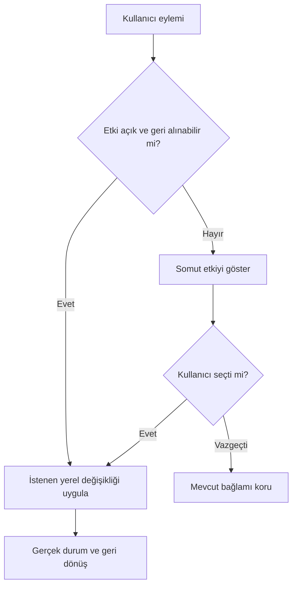
```mermaid
flowchart TD
 A["Kullanıcı eylemi"] --> B{"Etki açık ve geri alınabilir mi?"}
 B -->|Evet| C["İstenen yerel değişikliği uygula"]
 B -->|Hayır| D["Somut etkiyi göster"]
 D --> E{"Kullanıcı seçti mi?"}
 E -->|Evet| C
 E -->|Vazgeçti| F["Mevcut bağlamı koru"]
 C --> G["Gerçek durum ve geri dönüş"]
```

## 3. Motion Philosophy

Dayanak: 08 §21; 10 §46–47; 12 V62–V64.

### Amaç

Hareketi yalnız durum, konum ve katman ilişkisini açıklamak için kullanmak.

### Kullanıcı beklentisi

“Hareketi izlemesem de ne değiştiğini anlayabilirim.”

### Davranış kuralları

- Her hareketin açıklanabilir bir görevi ve tam statik karşılığı bulunur. Seçili durum, yeni sıra ve işlem sonucu hareket bittiğinde de okunur.
- Azaltılmış hareket tercihi ilk gösterimden itibaren uygulanır; görev ortasında değişirse taslak ve odak korunur.
- Kullanıcı girdisi animasyon sonunu beklemez. Ardışık seçimde son niyet görünür olur; önceki hareket yeni eylemi kuyruğa hapsetmez.
- Kritik iddia geçersizliği doğrudan yansır; eski olumlu metin çıkış animasyonu boyunca tutulmaz.
- Hareket süreleri §36'daki mevcut rollerden gelir; yeni süre veya gösteri türü açılmaz.

### İstisnalar

Doğrudan sürükleme işaretçiyi izleyebilir. Bu, kullanıcıya zorunlu hareket izletme veya sürüklemeyi tek yol yapma izni değildir; aynı iş görünür taşıma kontrolüyle yapılabilir.

### Kabul kriterleri

- S03'te hareket kapalıyken yeni durak sırası ve odak eksiksiz anlaşılır.
- Yeni kullanıcı seçimi önceki 240 ms katman geçişini beklemek zorunda kalmaz.

#### D02 — Hareket kararı

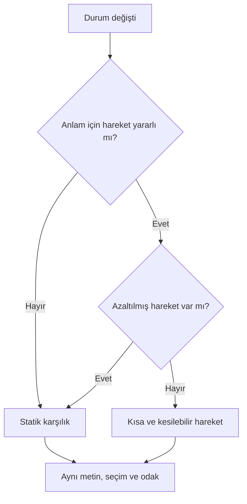
```mermaid
flowchart TD
 A["Durum değişti"] --> B{"Anlam için hareket yararlı mı?"}
 B -->|Hayır| C["Statik karşılık"]
 B -->|Evet| D{"Azaltılmış hareket var mı?"}
 D -->|Evet| C
 D -->|Hayır| E["Kısa ve kesilebilir hareket"]
 C --> F["Aynı metin, seçim ve odak"]
 E --> F
```

## 4. State Philosophy

Dayanak: 02 §8–10; 10 §61.2; 11 §41–45; 12 V58–V61.

### Amaç

Kullanıcı seçimini, uzak işlemi, veri geçerliliğini ve erişim hakkını tek bir “aktif/başarılı” durumuna indirmemek.

### Kullanıcı beklentisi

“Taslağımın görünmesi, kaydedilmesi ve bugün uygulanabilir olması arasındaki farkı biliyorum.”

### Davranış kuralları

| Eksen | Ayrı tutulacak durumlar | Değiştiren otorite |
| --- | --- | --- |
| Etkileşim | Normal, odaklı, basılı, seçili, salt okunur, devre dışı | Kullanıcı eylemi ve gerçek kontrol yeteneği |
| İşlem | Hazır, işleniyor, teyitli, kesin başarısız, sonucu belirsiz | İlgili işlemin gerçek sonucu |
| İçerik | Var, eksik, bilinmiyor, çelişkili, eski, uygulanamaz, geri çekilmiş | Yetkili bilgi/yayın süreci |
| Kişisel çalışma | Düzenlenmiş taslak, cihaz kaydı, hesap kaydı, paylaşılmış seçim | Kullanıcının açık kapsamı ve gerçek kayıt |
| Uygunluk | Desteklenen, koşula bağlı, uyuşmayan, değerlendirilemeyen | Karar Motoru; zorunlu kullanıcı rozeti değildir |
| Erişim | Misafir, hesap sahibi, rol yetkisi, hizmet hakkı, erişim kaybı | Güncel kimlik ve nesne/eylem yetkisi |

- Birden çok eksen birlikte bulunabilir: hesap kaydı tamamlanmış bir rota güncel koşullarda değerlendirilemeyebilir. Her eksen için ayrı görünür sonuç korunur.
- Yanıt yalnız ait olduğu sorgu, taslak, gün ve yetki kapsamında uygulanır. En son ulaşan yanıt, en yeni kullanıcı niyeti değildir.
- Gerekçe ile kritik sınırı aynı değerlendirmeye aittir. Yeni sıra eski toplamla, yeni filtre eski olumlu sonuçla güncelmiş gibi gösterilmez.
- Kaydetme, silme, paylaşım kapatma gibi uzak işlemde yanıt kaybolursa başarı veya kesin hata varsayılmaz. Önce mevcut işlemin sonucu kontrol edilir.
- Yetki kaybı özel görünümü; kritik geri çekme ilgili olumlu iddiayı durdurur. Taslak koruma bu iki sınırı aşamaz. Korunabilen kullanıcı çalışması yetkisiz kişiye açılmadan saklanır.

### İstisnalar

Ayırıcı gibi etkileşimsiz parça için basılı veya gönderiliyor durumu uygulanamazdır. Gerekçesi §49'da belirtilir; uzak işlem yapan kontrol belirsiz sonuç durumundan muaf değildir.

### Kabul kriterleri

- S04'te eski yanıt yeni sırayı ezmez; S05'te kaybolan teyit çift kayıt oluşturmaz.
- S54'te iki sekmenin farklı çalışması korunur; S55'te eski eşitleme silinmiş kaydı kendiliğinden diriltmez.

#### D03 — Uzak işlem durumu

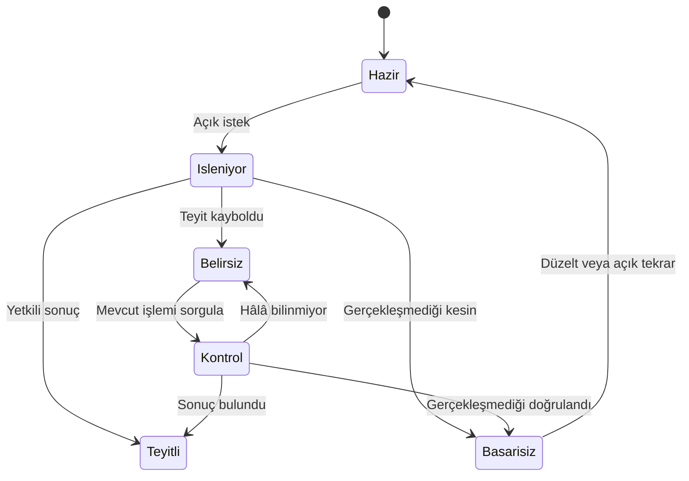
```mermaid
stateDiagram-v2
 [*] --> Hazir
 Hazir --> Isleniyor: Açık istek
 Isleniyor --> Teyitli: Yetkili sonuç
 Isleniyor --> Basarisiz: Gerçekleşmediği kesin
 Isleniyor --> Belirsiz: Teyit kayboldu
 Belirsiz --> Kontrol: Mevcut işlemi sorgula
 Kontrol --> Teyitli: Sonuç bulundu
 Kontrol --> Basarisiz: Gerçekleşmediği doğrulandı
 Kontrol --> Belirsiz: Hâlâ bilinmiyor
 Basarisiz --> Hazir: Düzelt veya açık tekrar
```

## 5. Loading davranışları

Dayanak: 07 §17; 10 B25; 12 V32, V34.

### Amaç

Gerçek beklemeyi, etkilenen işi ve devam yollarını açıklamak.

### Kullanıcı beklentisi

“İsteğim alındı; hangi işin sürdüğünü ve bu sırada yapabileceklerimi görüyorum.”

### Davranış kuralları

- Basışa hemen algılanabilir karşılık verilir. 10'daki yaklaşık 300 ms görsel gösterge başlangıcı ilk karşılığı veya işlemi geciktirmez.
- Bekleme yalnız ilgili bölgeye uygulanır. Arama sürerken metin; rota değerlendirilirken kullanıcı taslağı korunur. Bağımsız işler kilitlenmez.
- İlerleme yüzdesi yalnız gerçek ve kapsamı bilinen ilerleme varsa gösterilir. Sahte AI aşaması, süre dolunca tamamlanma ve yapay minimum bekleme yoktur.
- Yaklaşık 10 saniyede açıklama ve devam seçenekleri yeniden değerlendirilir. Bu değer zaman aşımı, başarı veya ağ garantisi değildir. Uzun işte beklemeyi bırakma yolu baştan vardır.
- Aynı uzak işlem tekrar gönderilmez. Kullanıcı değişiklik yaparsa yeni niyet ayrı tutulur; eski yanıtı bekleyen gösterge yeni işi yanlış adlandırmaz.
- İş bittiğinde ilgili sonuç/boş/hata/belirsiz durumuna geçilir; tamamlanmış işi skeleton altında bekletme yoktur.

### İstisnalar

Desteklenen gerçek iptal “İşlemi iptal et” olabilir. Yalnız sonucu izlemeyi bırakmak mümkünse “Beklemeyi durdur” denir; uzak işlem iptal edilmiş sayılmaz.

### Kabul kriterleri

- S06'da yavaş işlem taslağı silmez ve sahte yüzde göstermez.
- S07'de beklemeyi bırakıp dönüldüğünde uzak sonuç kontrol edilir; tamamlandı/iptal edildi uydurulmaz.

#### D04 — Bekleme yüzeyinin seçimi

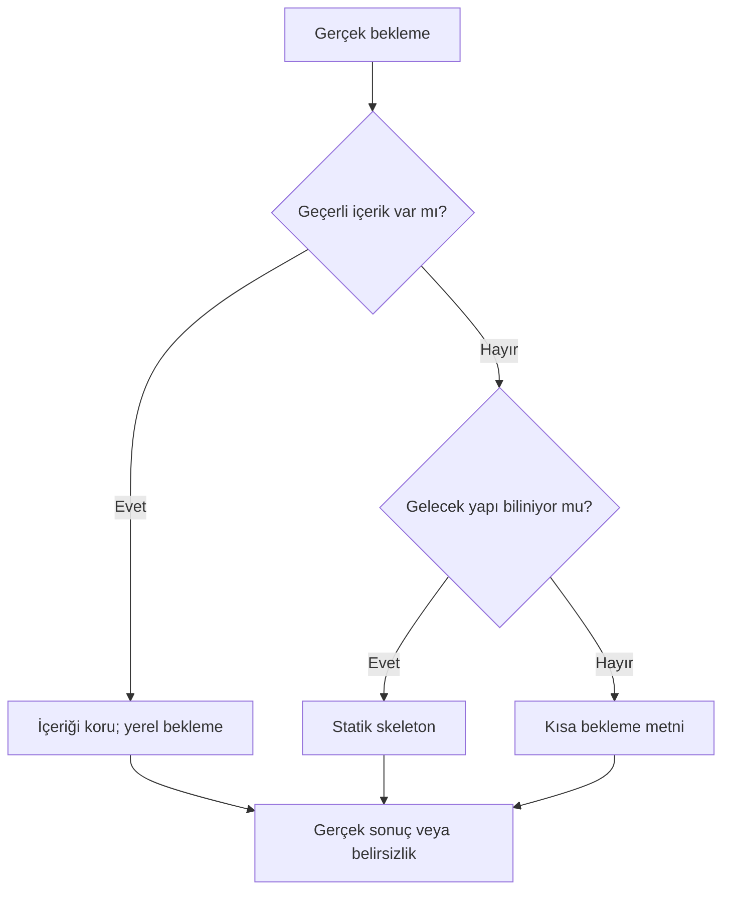
```mermaid
flowchart TD
 A["Gerçek bekleme"] --> B{"Geçerli içerik var mı?"}
 B -->|Evet| C["İçeriği koru; yerel bekleme"]
 B -->|Hayır| D{"Gelecek yapı biliniyor mu?"}
 D -->|Evet| E["Statik skeleton"]
 D -->|Hayır| F["Kısa bekleme metni"]
 C --> G["Gerçek sonuç veya belirsizlik"]
 E --> G
 F --> G
```

## 6. Empty State

Dayanak: 07 §15; 10 B27; 11 E25; 12 V31.

### Amaç

İçerik yokluğunun gerçek nedenini söylemek; kullanıcıya yapılacaklar borcu üretmemek.

### Kullanıcı beklentisi

“Boşluğun ilk kullanım, arama kapsamı veya bilgi eksiği olduğunu ayırt edebilirim.”

### Davranış kuralları

- İlk kayıt için “Henüz kaydettiğin yer yok”; filtrelenen kayıtlar için “Bu filtrelere uyan kaydın yok”; bilgi yetersizliğinde ilgili koşulu doğrulayamadığımız açıklanır.
- Sonuçsuzluk dünya hakkında “böyle yer yok” hükmü değildir. Aranan coğrafya ve koşullar görünür kalır.
- Boş rota geçerli taslaktır; son durak silinince otomatik yenisi eklenmez.
- Yalnız ilgili devam sunulur: belirli filtreyi düzenleme, yer ekleme veya çıkma. Koşullar otomatik gevşetilmez; Premium ve giriş daveti çözüm sayılmaz.
- Veri gelmemesi, yetki reddi ve ağ hatası boş sonuç diye sunulmaz. Boş sayıyı bildirmek için kapsamın tamamlandığı bilinmelidir.

### İstisnalar

Kullanıcının yapması gereken başka iş yoksa eylem düğmesi zorunlu değildir. Çevrimdışı yerel veri yokluğu §32 kapsamında ayrıca açıklanır.

### Kabul kriterleri

- S08'de sıfır sonuçla filtreler korunur; S09'da son durak kaldırılınca boş taslak kalır.
- S36'da yerel önbellek yokluğu “bu şehirde yer yok” olarak görünmez.

## 7. Error State

Dayanak: 07 §16; 10 B28; 11 E24; 12 V59.

### Amaç

Sorunu, korunan çalışmayı ve gerçek onarım yolunu birlikte göstermek.

### Kullanıcı beklentisi

“Ne olmadığını biliyorum; doğru girdiğim alanları yeniden doldurmuyorum.”

### Davranış kuralları

- Alan hatası ilgili alanda; görev hatası ilgili görevde kalır. Çok alanlı gönderimde odaklanabilir hata özeti ve sorunlu alana geçiş bulunur.
- Girdiler ve geçerli bağımsız içerik korunur. Tüm sayfayı yenileme genel çözüm değildir.
- Kesin başarısızlıkta düzeltme/yeniden deneme; sonucu belirsiz işlemde önce sonuç kontrolü verilir. Aynı etiket iki farklı davranışı saklamaz.
- Kısmi işlemin başarılı, başarısız ve belirsiz öğeleri ayrı gösterilir. Başarılı öğeler topluca yeniden gönderilmez.
- Erişim hatası özel kayıt adı veya sahibini ifşa etmez. Oturum süresi bitmesi temel Keşfet'i kapatmaz; özel işlem için §20 uygulanır.
- Teknik ayrıntı ve hassas giriş hata metnine dökülmez. Kullanıcı suçlanmaz; destek ancak gerçek mevcut yoluyla sunulur.

### İstisnalar

Tüm görev gerçekten kullanılamıyorsa görev düzeyinde hata gösterilir. Bilinen kritik iddia geçersizliği yalnız “servis sorunu” diye yumuşatılmaz; ilgili güvence hemen kaldırılır.

### Kabul kriterleri

- S10'da tek alan hatası diğer alanları silmez.
- S51'de kısmi toplu işlem tek yeşil başarıya dönüşmez; S05'te belirsiz işlem kör tekrar edilmez.

#### D05 — Hata ayrımı

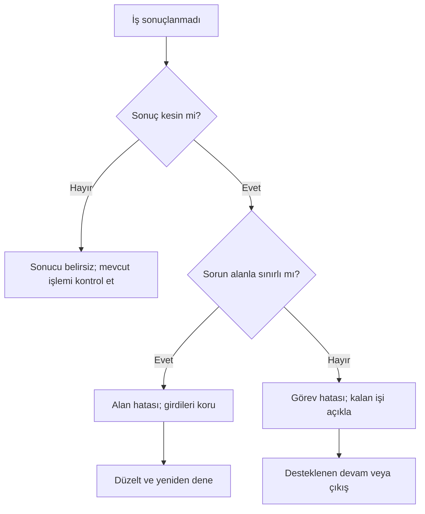
```mermaid
flowchart TD
 A["İş sonuçlanmadı"] --> B{"Sonuç kesin mi?"}
 B -->|Hayır| C["Sonucu belirsiz; mevcut işlemi kontrol et"]
 B -->|Evet| D{"Sorun alanla sınırlı mı?"}
 D -->|Evet| E["Alan hatası; girdileri koru"]
 D -->|Hayır| F["Görev hatası; kalan işi açıkla"]
 E --> G["Düzelt ve yeniden dene"]
 F --> H["Desteklenen devam veya çıkış"]
```

## 8. Success State

Dayanak: 07 §27; 10 B30; 12 V58, V64.

### Amaç

Yalnız gerçekten tamamlanan sonucu doğru kapsamla teyit etmek.

### Kullanıcı beklentisi

“Bu cihazda mı, hesabımda mı, yoksa yalnız hazırlanmış bir çıktı olarak mı tamamlandığını biliyorum.”

### Davranış kuralları

- “Bu cihazda kaydedildi”, “Hesabına kaydedildi”, “Gözlemin alındı”, “Bağlantı kopyalandı” ve “Bağlantı kapatıldı” birbirinin yerine geçmez.
- Başarı ilgili nesnede kalıcı durumla anlaşılır; toast yalnız yardımcıdır. Kullanıcının odağı kutlama ekranına taşınmaz.
- Katkının alınması incelendi/yayımlandı; taslağın kaydı rota yapılabilir; dış uygulamanın açılması mesaj gönderildi sayılmaz.
- Tamamlanma anında yeni görev, Premium daveti, puan veya seri üretilemez. Kullanıcı işi bitirip çıkabilir.
- Gerçek yerel başarı yanında uzak eşitleme bekliyorsa her ikisi açık kalır. Genel onay işareti uzak sonucu gizlemez.

### İstisnalar

Kopyalama gibi düşük etkili, tekrar doğrulanabilir sonuç yalnız kısa mesajla desteklenebilir. Kritik erişim kapatma ve hesap kaydı yalnız geçici mesaja bırakılmaz.

### Kabul kriterleri

- S11'de Bir İz teyidi yalnız alındığını söyler; yer yayını değişmiş gibi görünmez.
- S12'de cihaz kaydı hesap kalıcılığı izlenimi vermez; bekleyen eşitleme ayrı kalır.

## 9. Search davranışı

Dayanak: 01 §6; 03 §1, §9; 10 B07; 11 E03, §39–40; 12 V44.

### Amaç

Yer adı, coğrafya veya ihtiyaç ifadesini aynı Keşfet bağlamında doğru sonuca taşımak.

### Kullanıcı beklentisi

“Yazdığım şey kaybolmaz; bulunan yerin bana önerilen yer olup olmadığını anlarım.”

### Davranış kuralları

- Yazılan metin, öneride odaklanan seçenek ve gönderilmiş sorgu ayrı tutulur. Otomatik tamamlama kullanıcının metnini seçimi olmadan değiştirmez.
- Ok tuşları önerilerde gezinir; Enter açıkça seçili öneriyi etkinleştirir, seçim yoksa sorguyu gönderir. Escape önce önerileri kapatır; sorguyu silmez. Metin birleştirme tamamlanmadan Enter arama başlatmaz.
- Arama temizleme yalnız metni/öneriyi temizler. Önceden uygulanmış filtre, kişisel kayıt ve mevcut rota etkilenmez; boş metin gönderimi açık keşif bağlamı olarak anlaşılır olur.
- Sonuç yalnız en yeni gönderilmiş bağlama aittir. Yazım devam ederken eski sonuç kullanılacaksa önceki sorguya ait olduğu anlaşılır; yeni sorguya uygun sonuç diye sunulmaz.
- Adla bulunan uyumsuz yer kimliğiyle açılabilir; uygun öneri grubuna katılmaz. Aynı ad için şehir/ilçe/şube ayrımı korunur.
- Gereken tek belirsizlik sorulur; anlaşılmayan ifade sessiz atılmaz. Hesap ve konum zorunlu değildir; AI çalışmazsa desteklenen ad araması ve elle koşul düzenleme sürer.
- Geçmiş sorgunun yeniden kullanımı açık seçimdir. Hassas ihtiyaç varsayılan olarak URL, ortak öneri, sayfa başlığı veya analiz metni olmaz. Geçmiş temizliği kayıtlı yerleri silmez.

### İstisnalar

Aranabilir yerel kayıtlar varsa çevrimdışı arama “Bu cihazdaki kayıtlarında ara” kapsamını taşır. Genel kataloğun arandığı iddia edilmez. Desteklenmeyen geçmiş saklama yeteneği vaat edilmez.

### Kabul kriterleri

- S13'te iki sorgunun yanıtı ters sırada geldiğinde yalnız güncel gönderilmiş sorgu sonuçları görünür.
- S14'te aynı adlı şubeler ayırt edilir; S15'te karakter birleştirme yanlış arama göndermez.

#### D06 — Sorgu ve yanıt

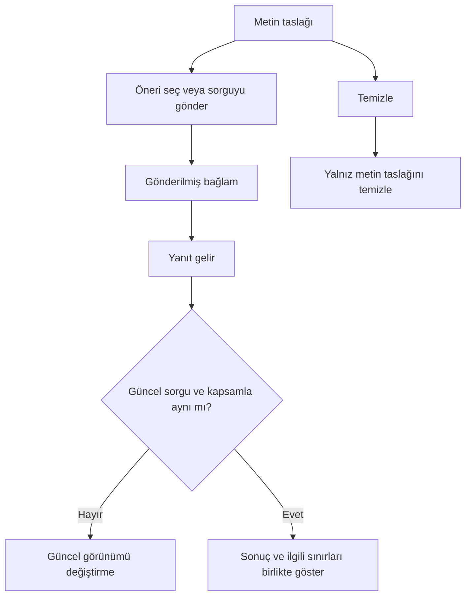
```mermaid
flowchart TD
 A["Metin taslağı"] --> B["Öneri seç veya sorguyu gönder"]
 B --> C["Gönderilmiş bağlam"]
 C --> D["Yanıt gelir"]
 D --> E{"Güncel sorgu ve kapsamla aynı mı?"}
 E -->|Hayır| F["Güncel görünümü değiştirme"]
 E -->|Evet| G["Sonuç ve ilgili sınırları birlikte göster"]
 A --> H["Temizle"]
 H --> I["Yalnız metin taslağını temizle"]
```

## 10. Filter davranışı

Dayanak: 10 B06, B08; 11 §40; 02 §3–6.

### Amaç

Uygulanan koşulları düzenlenebilir tutmak ve taslak seçimleri uygulanmış gibi göstermemek.

### Kullanıcı beklentisi

“Uygula ve Vazgeç'in ne yaptığını bilirim; koşullarım sonuç uğruna değiştirilmez.”

### Davranış kuralları

- Çok alanlı filtrede açılış uygulanmış koşulların taslağını oluşturur. Uygula yeni bağlamı gönderir; Vazgeç, Escape, dışarı tıklama ve desteklenen kapatma jesti uygulanmamış filtre taslağını bırakır.
- Tek, bağımsız ve açık anlık filtre değişimi mümkündür; taslak modeliyle belirsiz karıştırılmaz. Ekran boyutu değişince uygulama modeli değişmez.
- Uygulama sonrası seçilen koşullar görünür kalır; sonuç başarısızsa önceki koşullara sessiz dönülmez. Eski sonuç yeni filtreye aitmiş gibi kullanılmaz.
- Temizleme kapsamı görünürdür: sorgu, ziyaretler ve rotalar silinmez. Zorunlu koşul kaldırılıyorsa hangi koşulun kaldırıldığı açık etiketle anlaşılır.
- Şehir değişince eski şehre ait ilçe/alan kapsamının bırakılacağı anlaşılır olur. Genel zorunlu ihtiyaçlar korunur; mevcut rota başka şehre taşınmaz.
- Sonuç yokluğu otomatik yarıçap genişletme, bütçe artırma veya erişim koşulunu tercihe çevirme gerekçesi değildir.

### İstisnalar

Geçersiz/eski bir filtre değeri desteklenmiyorsa uygulanmış gibi gösterilmez; ilgili değer ve sonuç üzerindeki sınır açıklanır. Yerel kapsamın düşmesi genel ihtiyacın silinmesi değildir.

### Kabul kriterleri

- S16'da filtreyi kapatmak eski uygulanmış kümenin korunmasını sağlar.
- S17'de şehir değişimi basamaksız erişim koşulunu veya açık rota seçimlerini silmez.

#### D07 — Filtre işlemi

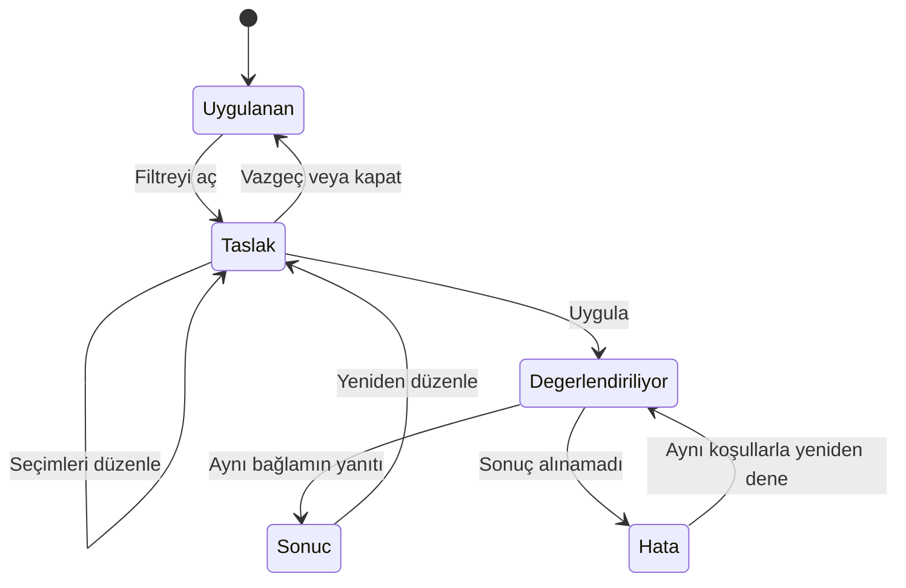
```mermaid
stateDiagram-v2
 [*] --> Uygulanan
 Uygulanan --> Taslak: Filtreyi aç
 Taslak --> Taslak: Seçimleri düzenle
 Taslak --> Uygulanan: Vazgeç veya kapat
 Taslak --> Degerlendiriliyor: Uygula
 Degerlendiriliyor --> Sonuc: Aynı bağlamın yanıtı
 Degerlendiriliyor --> Hata: Sonuç alınamadı
 Hata --> Degerlendiriliyor: Aynı koşullarla yeniden dene
 Sonuc --> Taslak: Yeniden düzenle
```

## 11. Sort davranışı

Dayanak: 03 §2; 10 B05; 11 E02, E09–E10, E27–E29.

### Amaç

Sonuç sırasının hangi ölçüte ait olduğunu açıklamak; sıralamayı gizli uygunluk kararı yapmamak.

### Kullanıcı beklentisi

“Neye göre baktığımı bilirim; sıralama değiştirmek filtrelerimi değiştirmez.”

### Davranış kuralları

- Keşfet varsayılan sırası yetkili Karar Motorundan gelir. Kart yüksekliği, fotoğraf, sponsor veya Premium kullanıcı durumu bu sırayı değiştirmez.
- Yalnız kaynakların ve mevcut verinin desteklediği açık sıralama sunulur. Mesafe seçimi varsa başlangıç ve mesafe türü açıklanır; yakınlık uygunluk veya yürüme süresi sayılmaz.
- Kişisel kayıtta kayıt zamanı ile ziyaret zamanı farklı ölçüttür. Bilinmeyen tarih bugüne veya sıfıra dönüştürülmez; tarihli kayıtlarla karışmayacak biçimde belirtilir.
- Seçilen ölçüt ve varsa yön görünürdür. Yenilemede filtre ve öğe kimliği korunur; yeni veri nedeniyle yer değişirse kullanıcı odağı kaybolmaz.
- Eşit değerlerde kararlı sıra korunur; eşitlik rastgele titreşen sıra üretmez. Eksik değerin sıralama içindeki kapsamı anlaşılır; olumlu en küçük değer sayılmaz.
- Rota sırası sort menüsüyle kendiliğinden değiştirilmez. Kullanıcı rota düzenlemesini açıkça başlatır; §15 uygulanır.

### İstisnalar

Gerekli başlangıç veya ölçüm yoksa ilgili sıralama kullanılamaz ve nedeni açıklanır. Hayalî puan, yıldız, popülerlik veya yeni fiyat sıralama özelliği oluşturulmaz.

### Kabul kriterleri

- S18'de mesafe sıralaması seçilince sorgu/koşullar korunur; uygunluk iddiası değişmez.
- Tarihi bilinmeyen ziyaret en yeni ziyaretmiş gibi görünmez; eşit değerler yenilemede rastgele yer değiştirmez.

## 12. Kart davranışları

Dayanak: 10 B02–B04, B39; 12 V10, V49–V53.

### Amaç

Tek karar biriminin kimliğini, gerekçesini, sınırını ve bağımsız eylemlerini birlikte taşımak.

### Kullanıcı beklentisi

“Karta bakarak açma, kaydetme ve seçme eylemlerini ayırabilirim.”

### Davranış kuralları

- Kart tek hedefliyse bütünü bağlantı olabilir. Kaydet gibi bağımsız kontrol varsa başlık bağlantısı ile diğer kontroller ayrı hedeflerdir; kaydetme kartı açmaz.
- Seçili kart uygunluk onayı değildir. Odak, basılı, seçili ve kaydedilmiş durumlar yalnız doluluk/renkle birbirine karıştırılmaz.
- Bilinen engel kimlikle erken görünür; gerekçe ile önemli bilinmeyen birlikte sunulur. Metin kotası kritik sınırı kesemez.
- Fotoğraf hatasında gerçek metin ve eylemler çalışır. Sahte mekân görüntüsü, sonsuz medya yüklenmesi veya sırayı düşürme yoktur.
- Karttan ayrıntıya gidip dönünce filtre, seçili öğe ve liste konumu korunur. Öğe kaldırılmışsa en yakın mantıksal öğe ve açıklama kullanılır.
- Restoran, etkinlik ve otel aynı davranışı devralır; yalnız kabul edilmiş ve mevcut veri kapsamındaki farklar gösterilir. Etkinlikte tarih, otelde oda/fiyat kapsamı uydurulmaz; kart rezervasyon yaratmaz.

### İstisnalar

Yayın dışı kalan yerde izinli asgari kimlik kişisel kayıtta korunabilir. Geri çekilmiş olumlu iddialar kart kararlılığı adına tutulamaz. Etkileşimsiz kart sahte hover/basılma karşılığı almaz.

### Kabul kriterleri

- S19'da kaydetme yalnız kayıt yapar; S20'de fotoğraf yüklenmemesi karar metnini engellemez.
- Klavyeyle kartın her bağımsız eylemi bir kez ve bağlamlı adla erişilebilir; iç içe çakışan hedef bulunmaz.

#### D08 — Kart eylemlerinin ayrımı

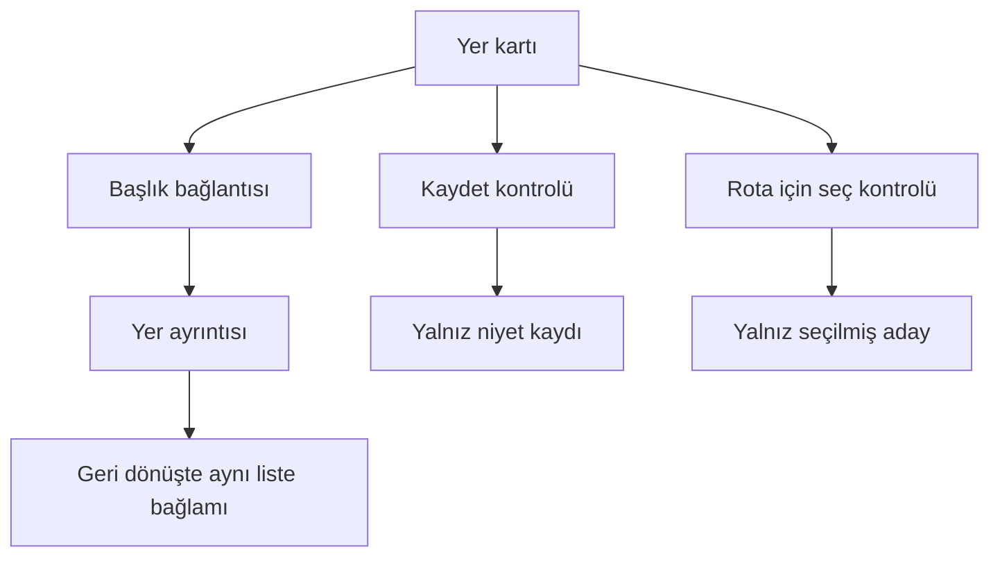
```mermaid
flowchart TD
 A["Yer kartı"] --> B["Başlık bağlantısı"]
 A --> C["Kaydet kontrolü"]
 A --> D["Rota için seç kontrolü"]
 B --> E["Yer ayrıntısı"]
 C --> F["Yalnız niyet kaydı"]
 D --> G["Yalnız seçilmiş aday"]
 E --> H["Geri dönüşte aynı liste bağlamı"]
```

## 13. Liste davranışları

Dayanak: 01 §6; 10 B05, B47; 11 §37–38.

### Amaç

Taramayı, öğe takibini ve kontrollü devamı kolaylaştırmak.

### Kullanıcı beklentisi

“Hangi kümede olduğumu ve döndüğümde nerede kaldığımı bilirim.”

### Davranış kuralları

- İlk Keşfet kümesi 3–5 anlamlı adayı hedefler; kota doldurulmaz. Yer ayrıntısında en fazla 3 alternatif; rota için bir ana ve en fazla 2 anlamlı ek seçenek kaynak kapsamıyla korunur.
- Uzun kişisel arşiv ve inceleme listesi açık sayfalama veya “Sonrakileri göster” ile ilerler. Sonsuz dikkat akışı varsayılan değildir.
- Yeni sayfa yüklenirken mevcut öğeler kalır. Hata yalnız ek yükleme bölgesini etkiler; tekrar mevcut listeyi baştan getirmez. Aynı öğe iki kez eklenmez.
- Sayı yalnız biliniyorsa gösterilir; yüklenen sayı toplam gibi anlatılmaz. Liste sonu ile veri getirilememesi ayrı durumdur.
- Odağı bulunan öğe performans gerekçesiyle kaldırılmaz. Silme sonrası sonraki, yoksa önceki öğeye; liste boşsa ilgili ekleme/başlık noktasına mantıksal dönüş yapılır.
- Toplu seçim görünür sayfa mı, seçilen kayıtlar mı, filtreli küme mi açıkça söyler. Filtre değişimi seçimi görünmeyen tüm kayıtlara genişletmez.

### İstisnalar

Kritik yayın değişikliği öğenin olumlu sunumunu durdurabilir; listeyi hiç oynatmama hedefi yanlış bilgiyi tutamaz. Uzun kümede desteklenmeyen performans yaklaşımı yerine açık sayfalama kullanılır.

### Kabul kriterleri

- S21'de ek sayfa hatası ilk sayfayı silmez ve yeniden deneme mükerrer öğe üretmez.
- S22'de silinen odaklı satırın ardından odak boşluğa veya sayfa başına düşmez.

## 14. Harita davranışları

Dayanak: 01 §6; 10 B11/B31; 11 §34–37; 12 V45–V48.

### Amaç

Aynı seçeneklerin konum ilişkisini karar anlamını değiştirmeden göstermek.

### Kullanıcı beklentisi

“Harita kullanmadan da aynı yerlere ve işlemlere ulaşabilirim.”

### Davranış kuralları

- Liste ve harita aynı sonuç kimliklerini, filtreleri ve seçili yeri paylaşır. Marker seçimi kısa yer önizlemesi açabilir; yerin kaydedilmesi, ziyareti veya rotaya eklenmesi sayılmaz.
- Pan ve zoom yalnız görünür alanı değiştirir. Arama coğrafyası açık “Bu alanda ara” eylemiyle değişir; mevcut rota coğrafyası etkilenmez.
- Küme seçimi içindeki yerlere erişim sağlar; adet popülerlik/kalite değildir. Koordinatı bulunmayan yer listede kalabilir; sahte marker üretilmez ve haritanın eksik kapsamı açıklanır.
- Yakınlaştır/uzaklaştır, listeye dön ve varsa konumuma git görünür eylemlerdir. Konum izni yalnız ilgili istek anında alınır; ret sonrası elle başlangıç/alan seçimi sürer.
- Sayfa kaydırması haritada hapsedilmez. Klavye çıkışı ve liste alternatifi vardır. Seçili yeri görünür kılma en az gerekli hareketle; azaltılmış harekette doğrudan olur.
- Rota çizgisi geçişin doğrulanmış yürünebilir/erişilebilir olduğunu kendi başına söylemez. Numara ziyaret sırasıdır; kalite puanı değildir. Sağlayıcı atıfları kontrollerle örtülmez.

### İstisnalar

Harita veya konum servisi yüklenemiyorsa metinli yer/rota görevi sürer. Saklı adres haritanın ya da dış yol tarifinin çevrimdışı çalışacağı vaadi değildir.

### Kabul kriterleri

- S23'te pan sonuçları değiştirmez; S24'te izin reddi görevden çıkışa zorlamaz.
- S25'te harita arızasında aynı yerler listeden açılır; marker olmayan kayıt yanlış koordinatla tamamlanmaz.

#### D09 — Harita ve arama kapsamı

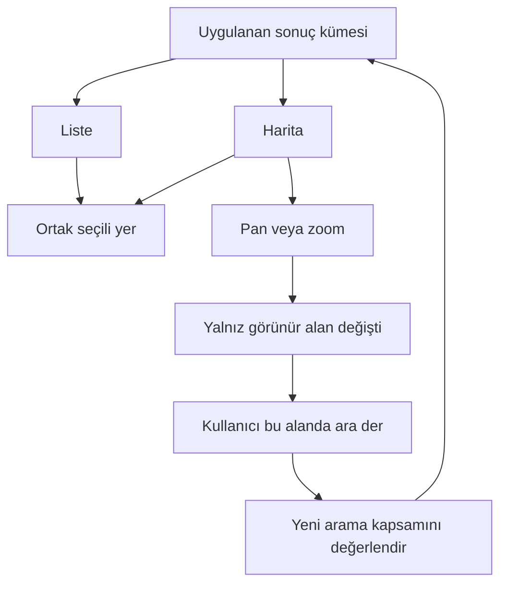
```mermaid
flowchart TD
 A["Uygulanan sonuç kümesi"] --> L["Liste"]
 A --> M["Harita"]
 L --> S["Ortak seçili yer"]
 M --> S
 M --> P["Pan veya zoom"]
 P --> V["Yalnız görünür alan değişti"]
 V --> B["Kullanıcı bu alanda ara der"]
 B --> N["Yeni arama kapsamını değerlendir"]
 N --> A
```

## 15. Akıllı Rota davranışları

Dayanak: 06 §1–16; 10 B04/B40/B48; 11 E07–E08, §46.

### Amaç

Kullanıcının bir günlük karar dilimini düzenlemesini ve her değişikliğin gerçek etkisini anlamasını sağlamak.

### Kullanıcı beklentisi

“Benim sıram ve sınırlarım korunur; hesaplama benim adıma seçim yapmaz.”

### Davranış kuralları

- Doğal dil, seçilmiş yerler, ihtiyaç, hazır koleksiyon ve boş taslak aynı göreve girer. Başlamak/kaydetmek zorunlu profil veya tarih gerektirmez; yapılabilirlik iddiası gerekli bağlam olmadan kurulmaz.
- Seçilmiş yer, zorunlu yer, sabit saat ve sabit göreli sıra ayrı seçimdir. Birini değiştirmek diğerini çözmez.
- Ekleme, çıkarma ve taşıma kullanıcının taslağına hemen yansır. İlgili toplam ve uygunluk yeniden değerlendirme bekler; eski olumlu hesap yeni sıranın altında tutulmaz.
- Yer ekleme niyet havuzuna otomatik kayıt oluşturmaz; çıkarma boşluğu yeniden doldurmaz. Son durak çıkınca kaydedilebilir boş taslak kalır.
- İlk ulaşım, geçiş, bekleme, ziyaret, mola ve istenen dönüş kapsamı açıklanır. Bilinmeyen zorunlu ücret sıfır; kuş uçuşu mesafe yürüyüş süresi olmaz.
- Kullanıcı uyuşmazlıklı planını saklayabilir; “Yine de tut” koşulu gevşetme veya uygunluk onayı değildir. Değişiklik başka açık koşulu gerektiriyorsa etkisi gösterilir ve kullanıcı o koşulu ayrıca değiştirir.
- Gün başladıktan sonra tamamlanmış ziyaretler yeniden yazılmaz; kalan bölüm değerlendirilir. “Bugün bu kadar” geçerli çıkıştır.
- Başka şehirde gezinme rotayı değiştirmez. Başka şehir için planlama eski taslağı koruyan yeni bağlamdır; eski yer, rezervasyon ve başlangıç kendiliğinden taşınmaz.

### İstisnalar

Kimliği doğrulanmayan yer özel not olarak kalabilir; resmî kart/marker yapılmaz. Çok günlük, şehirler arası veya rezervasyon organizasyonu bu sözleşmeyle açılmaz.

### Kabul kriterleri

- S26'da durak taşınırken eski toplam güncelmiş gibi görünmez; S27'de sabit saat kendiliğinden açılmaz.
- S28'de erken bitiş ziyaret edilmemiş durağı otomatik olumsuz beyana dönüştürmez.

#### D10 — Rota düzenleme

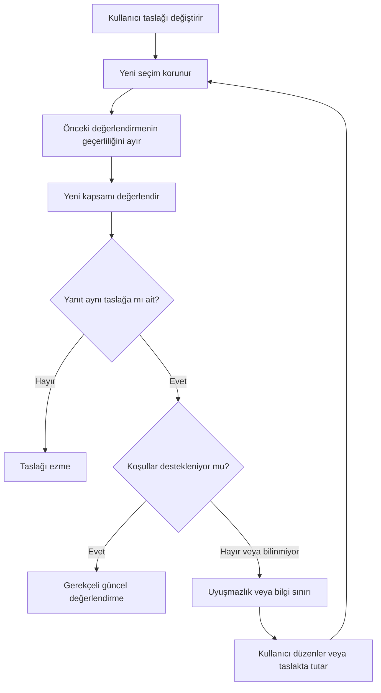
```mermaid
flowchart TD
 A["Kullanıcı taslağı değiştirir"] --> B["Yeni seçim korunur"]
 B --> C["Önceki değerlendirmenin geçerliliğini ayır"]
 C --> D["Yeni kapsamı değerlendir"]
 D --> E{"Yanıt aynı taslağa mı ait?"}
 E -->|Hayır| F["Taslağı ezme"]
 E -->|Evet| G{"Koşullar destekleniyor mu?"}
 G -->|Evet| H["Gerekçeli güncel değerlendirme"]
 G -->|Hayır veya bilinmiyor| I["Uyuşmazlık veya bilgi sınırı"]
 I --> J["Kullanıcı düzenler veya taslakta tutar"]
 J --> B
```

## 16. Gezeceğim Yerler davranışları

Dayanak: 06 §16; 09 §20, §31; 10 B41; 11 E09.

### Amaç

Daha sonra değerlendirme niyetini saklamak.

### Kullanıcı beklentisi

“Bir yeri saklamak gitme sözü veya bugünkü rota değildir.”

### Davranış kuralları

- Gerçek kayıttan sonra “Gezeceğim Yerler'de” ve cihaz/hesap kapsamı anlaşılır olur. Aynı yere tekrarlı ekleme mükerrer niyet yaratmaz.
- Niyet tarihsiz ve şehirler arası olabilir. Ziyaret edildiğinde kendiliğinden silinmez; aynı yer tekrar gitme niyeti taşıyabilir.
- Listeden birkaç yerle rota başlatmak yalnız seçilen yerleri günlük değerlendirmeye taşır; hepsini zorunlu durak yapmaz.
- Niyeti kaldırmak rota durağını, geçmiş ziyareti, katkıyı veya başka koleksiyonu otomatik silmez. §30–31 geri alma uygulanır.
- Kapanan yerin izinli kimliği korunabilir; güncel engel yanında görünür. Sistem benzer adla başka yeri yerine koymaz.
- Bekleyen yer sayısı, süre veya şehir tamamlama yüzdesiyle baskı kurulmaz; kendiliğinden hatırlatma oluşturulmaz.

### İstisnalar

Yerel kayıt kullanılamıyorsa geçici seçim kalıcı niyet diye anlatılmaz. Kayıt kimliği birleşmişse yalnız yetkili kimlik ilişkisiyle ve açıklamayla güncellenir.

### Kabul kriterleri

- S29'da aynı yere ikinci ekleme tek niyet bırakır.
- S30'da niyet kaldırılması aynı yerin rota ve ziyaret kayıtlarını korur.

#### D11 — Niyet kaydı

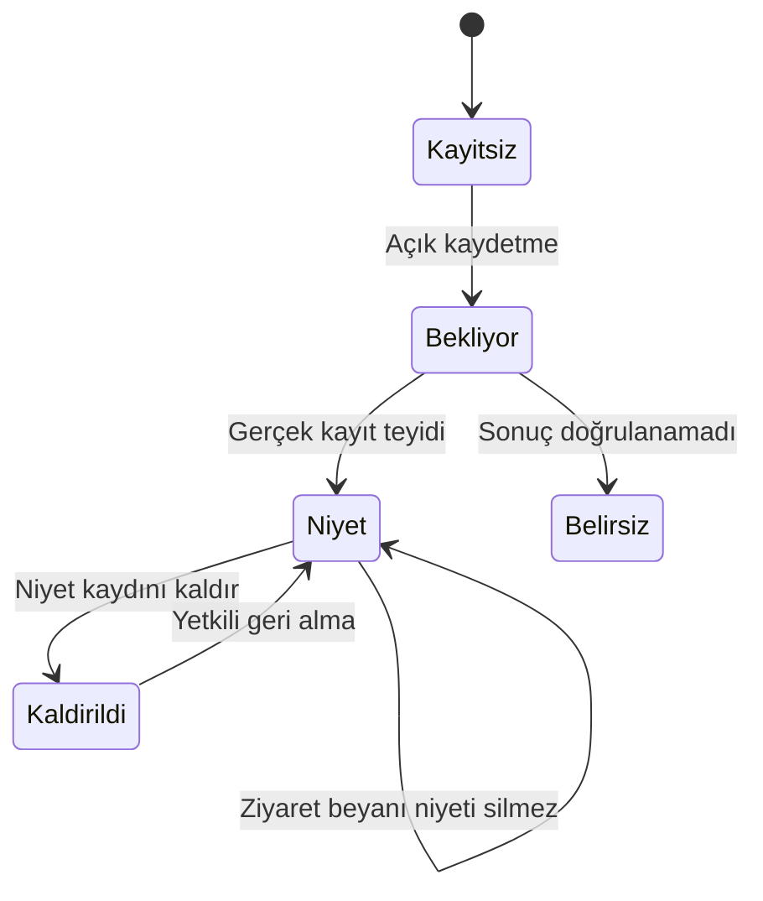
```mermaid
stateDiagram-v2
 [*] --> Kayitsiz
 Kayitsiz --> Bekliyor: Açık kaydetme
 Bekliyor --> Niyet: Gerçek kayıt teyidi
 Bekliyor --> Belirsiz: Sonuç doğrulanamadı
 Niyet --> Kaldirildi: Niyet kaydını kaldır
 Kaldirildi --> Niyet: Yetkili geri alma
 Niyet --> Niyet: Ziyaret beyanı niyeti silmez
```

## 17. Gezdiğim Yerler davranışları

Dayanak: 03 §11; 07 §11; 10 B41; 11 E10, §46.

### Amaç

Kullanıcının açık ziyaret beyanını özel hafıza olarak tutmak.

### Kullanıcı beklentisi

“Gittiğimi yalnız ben belirtirim; tarihini bilmediğim ziyarete tarih uydurulmaz.”

### Davranış kuralları

- Yer açma, yol tarifi, konum yakınlığı, rota bitişi ve kaydetme ziyaret oluşturmaz. “Buradaydım” açık beyanı gerekir.
- Bilinmeyen tarih bilinmeyen kalır; bugüne yazılmaz. Yeni ziyaret ile mevcut ziyaretin tarihini düzeltme ayrı eylemdir.
- Aynı yerde farklı ziyaretler bulunabilir. Aynı gönderimin tekrarı ikinci olay yaratmaz; kullanıcı yeni ziyaret eklediğinde eskiyi ezmez.
- Genel geçmiş beyanı bugünkü rota durağını tamamlamaz. Rotadaki belirli ziyaretin açık işaretlenmesi yalnız o olayla ilişkilendirilir.
- Ziyaret beğeni, memnuniyet veya Bir İz katkısı değildir. Niyet aynı anda korunabilir. Kamuya açık geçmiş ve puan yaratılmaz.
- Ziyareti kaldırmak katkıyı kendiliğinden geri çekmez. Kullanıcı ikisini birlikte kaldırmayı açıkça seçebilir; ayrı sonuç aşamaları görünür olur.

### İstisnalar

Geçmiş mekân kapanmış olsa da ziyaret hafızası izinli kimlikle kalabilir. Bugünkü ziyaret uygunluğu eski anıdan türetilmez.

### Kabul kriterleri

- S31'de yol tarifi açmak ziyaret yaratmaz.
- S32'de tarihi bilinmeyen beyan tarih uydurulmadan kaydolur; geçmişi düzeltmek bugün için yeni ziyaret üretmez.

## 18. Paylaşım davranışları

Dayanak: 06 §19–20; 09 §20, §31; 10 B43; 11 §46.4.

### Amaç

Seçilen karar bilgisini açık kapsam ve kullanıcı iradesiyle aktarabilmek.

### Kullanıcı beklentisi

“Ne paylaştığımı, kimlerin açabileceğini ve neyi geri çekemeyeceğimi görüyorum.”

### Davranış kuralları

- Özel taslak varsayılan özeldir. Paylaş eylemi içerik ve erişim önizlemesini açar; dış yayını/gönderimi kendiliğinden yapmaz.
- Ev/otel başlangıcı, canlı konum, kişi adları, sağlık gerekçesi, özel bütçe, not, ziyaret geçmişi ve rezervasyon varsayılan paylaşım dışında kalır. Başlık da aynı kontrolden geçer.
- Kritik koşul kişisel nedeni açıklamadan taşınır. Taşınamıyorsa ona bağlı olumlu uygunluk iddiası daraltılır/kaldırılır; gizlilik adına yanlış güvence kalmaz.
- Özel taslak, açıkça yayımlanan seçim ve alıcının bağımsız kopyası ayrı kalır. Özel düzenleme paylaşılan seçimi güncellemez; yeni önizleme ve açık yayın gerekir.
- Link varsayılan salt okunurdur; linki bilenin iletebileceği açıklanır. Okuma linki yönetim hakkı değildir. Alıcı hesap açmadan okur; kendi günü için kopya oluşturursa kendi bağlamıyla yeniden değerlendirilir.
- Kopyalandı, hazırlandı, uygulama açıldı, gönderildi ve okundu ayrı sonuçlardır. Platformdan gerçek teyit yoksa gönderim/teslim ilan edilmez. Doğrudan aktarım yoksa seçilebilir metin/link veya desteklenen çıktı yolu sunulur.
- QR aynı okuma linkine gider; yanında metin bağlantısı bulunur. Story/metin sabit kopyadır, tarih/kapsam ve önemli sınırı taşır; uzaktan düzeltilemez/geri alınamaz.
- Bağlantı kapatma ücretsizdir. Teyit yokken “Kapatma bekliyor; bağlantı hâlâ açılabilir” anlamı görünür kalır. Rota silme bağlı canlı paylaşımların kapanma etkisini §30 kapsamında içerir.
- Kritik bilgi düzeltmesi canlı olumlu iddiayı sınırlar; paylaşılan durak seçimini otomatik değiştirmez.

### İstisnalar

Story/QR veya davetli ortak çalışma ancak kabul edilmiş hizmet kapsamı ve gerçek yetenek varsa açılır; bu belge lansman kararı vermez. Kapalı paylaşımda özel başlık/sahip ifşa edilmez; login kapalı linki açmanın yolu sayılmaz.

### Kabul kriterleri

- S33'te özel taslak düzenlemesi canlı paylaşıma sızmaz; S34'te dış uygulama açılışı gönderildi sayılmaz.
- S35'te çevrimdışı kapatma tamamlandı gösterilmez; S58'de geri alınan silme kapalı linki açmaz.

#### D12 — Paylaşımın üç varlığı

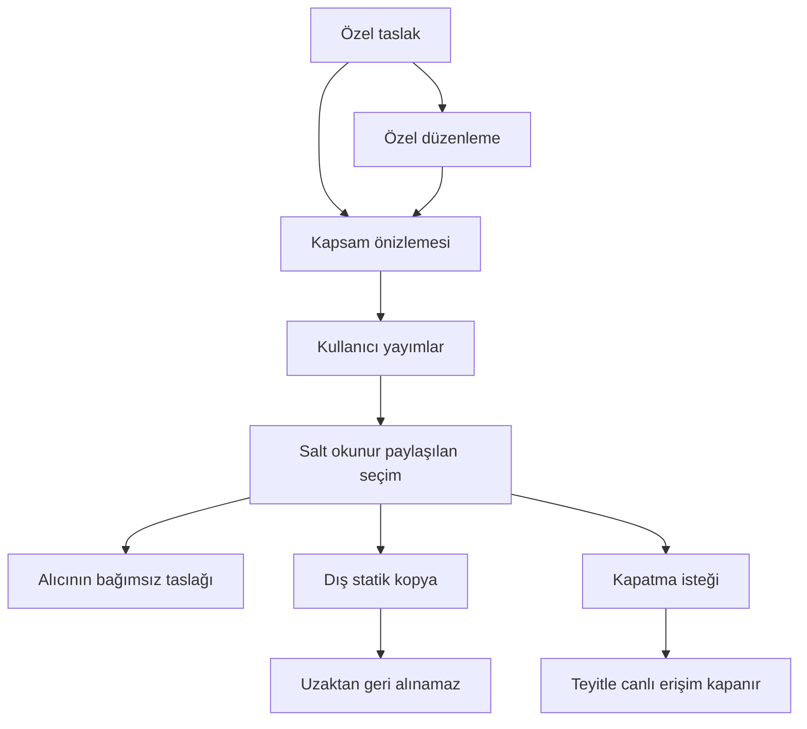
```mermaid
flowchart TD
 T["Özel taslak"] --> P["Kapsam önizlemesi"]
 P --> U["Kullanıcı yayımlar"]
 U --> L["Salt okunur paylaşılan seçim"]
 T --> E["Özel düzenleme"]
 E --> P
 L --> K["Alıcının bağımsız taslağı"]
 L --> S["Dış statik kopya"]
 L --> C["Kapatma isteği"]
 C --> V["Teyitle canlı erişim kapanır"]
 S --> X["Uzaktan geri alınamaz"]
```

## 19. Premium özellik davranışları

Dayanak: 09 §20–21; 10 B45; 11 E13/E30, §46.5.

### Amaç

Gerçek ek kolaylığı anlatırken temel karar ve kontrol haklarını korumak.

### Kullanıcı beklentisi

“Ücretin hangi ek işi azalttığını anlarım; reddedersem temel işim devam eder.”

### Davranış kuralları

- Yalnız gerçekten açılmış ek hizmet kullanıcı ilgili kolaylığı istediğinde gösterilir. Aday özellik etkin satış kontrolü veya uydurulmuş fiyat/kota olarak sunulmaz.
- Gerçek hizmet kapsamı, maliyeti ve bitiş etkisi eylem öncesinde okunabilir olur. Hesap açmak ücretli hizmeti kabul etmek değildir.
- Temel arama, filtre, rota oluşturma/düzenleme/kayıt, geri alma, önemli bilgi, katkı kontrolü ve paylaşımı kapatma ücretli değildir. Aynı bağlam aynı doğruluk ve güncellik anlamını taşır.
- Hata, boş sonuç, offline, etkin günlük plan ve çıkış anı satış fırsatı yapılmaz. Reddedilen teklif aynı bağlamda yeniden dayatılmaz.
- Abonelik sona erince ileri hizmetin yeni kullanımı gerçek kapsamına göre durabilir; mevcut kayıt okunur, temel düzenlenir, paylaşılır, silinir ve yeniden değerlendirilir.
- Ödeme/hak işlemi varsa bekleme, teyit, kesin hata ve belirsiz sonuç ayrı tutulur. Belirsiz işlemde tekrar satın alma yerine mevcut sonuç kontrol edilir; dış ödeme ekranından dönüş başarı kanıtı değildir.

### İstisnalar

Cihazlar arası devam, ileri geçmiş ve ortak çalışma adaylarının ücretsiz/ücretli paket kararı bu belgede verilmez. Yalnız mevcut hizmet hakkı uygulanır; rol yetkisi Premium'dan türetilmez.

### Kabul kriterleri

- S39'da hizmet bitişi temel düzenlemeyi ve paylaşım kapatmayı engellemez.
- S40'ta reddetme kullanıcıyı aynı taslağa döndürür; S57'de belirsiz ödeme yeniden tahsilata yol açmaz.

#### D13 — Premium ve temel hak

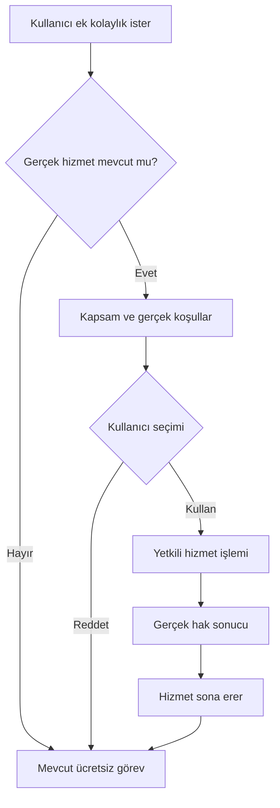
```mermaid
flowchart TD
 A["Kullanıcı ek kolaylık ister"] --> B{"Gerçek hizmet mevcut mu?"}
 B -->|Hayır| C["Mevcut ücretsiz görev"]
 B -->|Evet| D["Kapsam ve gerçek koşullar"]
 D --> E{"Kullanıcı seçimi"}
 E -->|Reddet| C
 E -->|Kullan| F["Yetkili hizmet işlemi"]
 F --> G["Gerçek hak sonucu"]
 G --> H["Hizmet sona erer"]
 H --> C
```

## 20. Login gerektiren davranışlar

Dayanak: 07 §13; 11 E12/E15–E18, §42, §45.

### Amaç

Özel erişimi korumak; keşif ve temel kararın önüne hesap duvarı koymamak.

### Kullanıcı beklentisi

“Neden giriş gerektiğini anlarım; girişten döndüğümde işim yerinde durur.”

### Davranış kuralları

| İşlem | Giriş/erişim davranışı |
| --- | --- |
| Kamusal Yer, Keşfet, yöntem ve geçerli salt okunur paylaşım | Giriş gerekmez |
| Gerçek cihaz kaydı ve temel günlük taslak | Hesap zorunlu değildir; cihaz sınırı açıklanır |
| Kendi hesap kaydını okuma/değiştirme | Hesap ve nesne sahipliği doğrulanır |
| Bir İz ve bilgi düzeltme | Yeni üyelik duvarı yok; yönetimde mevcut sahiplik kapsamı gerekir |
| Misafir paylaşımını yönetme | Ayrı yönetim erişimi; okuma linki yeterli değildir |
| İç inceleme/yayın veya ticari yönetim | İlgili güncel rol, nesne ve eylem yetkisi |

- Giriş yalnız gereken özel işlemi keser; misafir sorgu ve izinli yerel taslak korunur. Giriş sonrası aynı nesneye dönülür.
- Önceden gönderilmiş işlem varsa giriş sonrasında önce sonucu kontrol edilir. Gönderilmemiş özel kayda devam niyeti korunabilir; paylaşım, ödeme ve yıkıcı işlemlerde güncel somut kapsam tekrar geçerli olmalıdır.
- Girişten vazgeçmek bekleyen özel eylemi gerçekleştirmez; kullanıcı izinli mevcut bağlama döner.
- Yerel kaydı hesaba aktarmak ayrı, kapsamı açık seçimdir; mevcut hesap sürümleri sessiz ezilmez. Çıkışta özel hesap görünümü kapanır, misafir kopyası otomatik oluşturulmaz.
- Parola yöneticisi, yapıştırma ve uygun otomatik doldurma engellenmez. Kurtarma/başarısız giriş metni hesap varlığını veya özel içeriği gereksiz açıklamaz.

### İstisnalar

Oturum açık olsa da nesne/rol yetkisi yoksa tekrar giriş sonsuz çözüm diye sunulmaz. Hassas eylemde gerçekten gerekli yeniden doğrulama nedenini söyler; bütün temel işleri tekrar girişe bağlamaz.

### Kabul kriterleri

- S41'de oturum bitince kamusal keşif sürer ve özel işlem sonucu kontrol edilerek devam eder.
- S42'de girişten vazgeçmek taslağı kaybettirmez; S56'da başka hesap öncekinin özel verisini göremez.

#### D14 — Giriş ve görev dönüşü

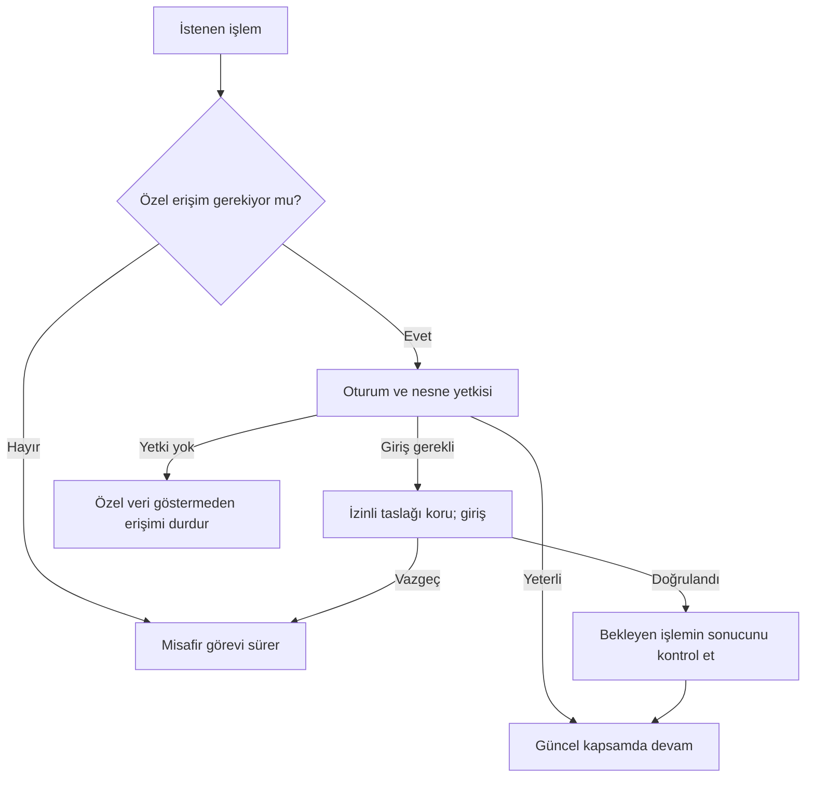
```mermaid
flowchart TD
 A["İstenen işlem"] --> B{"Özel erişim gerekiyor mu?"}
 B -->|Hayır| C["Misafir görevi sürer"]
 B -->|Evet| D["Oturum ve nesne yetkisi"]
 D -->|Yeterli| E["Güncel kapsamda devam"]
 D -->|Giriş gerekli| F["İzinli taslağı koru; giriş"]
 F -->|Vazgeç| C
 F -->|Doğrulandı| G["Bekleyen işlemin sonucunu kontrol et"]
 G --> E
 D -->|Yetki yok| H["Özel veri göstermeden erişimi durdur"]
```

## 21. Bottom Sheet davranışları

Dayanak: 10 B19; 11 §31.2; 12 V38.

### Amaç

Dar alanda mevcut işe bağlı kısa alt görevi yönetmek.

### Kullanıcı beklentisi

“Panelin ne işe yaradığını, kapanınca hangi seçimimin kalacağını bilirim.”

### Davranış kuralları

- Sheet'in modal olup olmadığı görevle belirlenir. Modal sheet arka görevi etkileşime kapatır; modal olmayan harita önizlemesi odak hapsetmez.
- Başlık ve görünür kapat/vazgeç bulunur; aşağı sürükleme tek kapanma yolu değildir. Kapanma §22–23'teki aynı görev kurallarını devralır.
- Çok alanlı filtre sheet'i kapatmak uygulanmamış filtreyi bırakır. Rota gibi korunmuş kişisel taslakta kapatmak taslağı silmez. Her sheet açılışında bu fark etiket/eylemlerden anlaşılır.
- İçerik, büyük metin veya ekran klavyesi alanı daraltırsa sheet kullanılabilir görev alanına genişler; eylem ve hata klavye altında kalmaz.
- Pencere büyüyüp drawer'a geçse de aynı seçim, uygulama modeli ve odak korunur. Arka alan modal statüsü değişirse erişilebilirlik durumu da aynı anda güncellenir.

### İstisnalar

Uzun okuma veya karmaşık düzenleme aynı akışta tam göreve dönüşebilir. Ara yüksekliğin bilgi saklaması kabul edilmez. Gerçek kayıp yoksa her kapatmada dialog açılmaz.

### Kabul kriterleri

- S43'te klavye açıkken Uygula ve Vazgeç erişilebilir kalır.
- S44'te sürüklemeden kapatmak mümkündür; filtre uygulanmaz ve odak tetikleyiciye döner.

#### D15 — Sheet türü ve odak

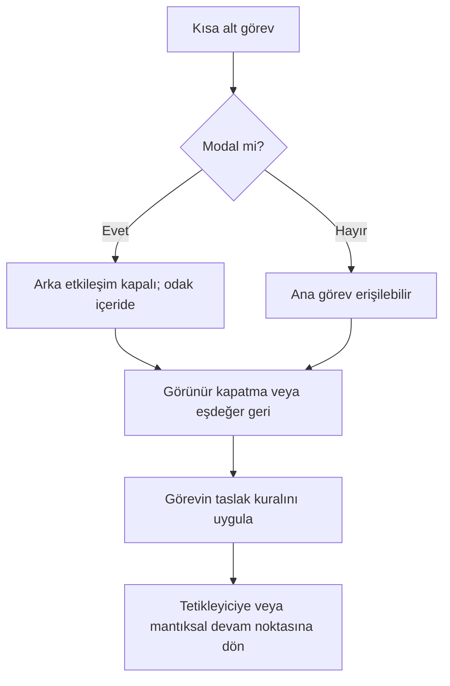
```mermaid
flowchart TD
 A["Kısa alt görev"] --> B{"Modal mi?"}
 B -->|Evet| C["Arka etkileşim kapalı; odak içeride"]
 B -->|Hayır| D["Ana görev erişilebilir"]
 C --> E["Görünür kapatma veya eşdeğer geri"]
 D --> E
 E --> F["Görevin taslak kuralını uygula"]
 F --> G["Tetikleyiciye veya mantıksal devam noktasına dön"]
```

## 22. Modal davranışları

Dayanak: 10 B20/B21; 11 §31.2; 12 V39.

### Amaç

Gerçekten odaklanılmış inceleme gereken işi tek geçici katmanda yürütmek.

### Kullanıcı beklentisi

“Neyi onayladığımı okur, vazgeçer ve geldiğim yere dönebilirim.”

### Davranış kuralları

- Aynı anda tek bağımsız modal görev vardır. Göreve ait seçici bunun alt kontrolüdür; ikinci bağımsız modal yığını açılmaz.
- Başlık, somut kapsam, açık işlem ve vazgeçme bulunur. İlk odak içerik/risk gereğine göre başlık veya güvenli kontrole gider; yıkıcı onaya otomatik odaklanmaz.
- Modal açıkken klavye odağı ve yardımcı teknoloji etkin görevde kalır. Arka kontroller yanlışlıkla etkinleştirilemez.
- Escape görünür vazgeçmeyle aynı anlamdadır. Varsa dışarı tıklama ve geri hareketi de aynı kapanma politikasını izler; dolaylı kaydetme/onay üretmez.
- Kapanışta açan kontrol, o yoksa mantıksal devam öğesi odaklanır. Sayfa başına varsayılan sıçrama yapılmaz.
- Gönderilmiş uzak işlem sırasında görünümü kapatmak işlemi geri almaz. Kalıcı görev durumu daha sonra erişilir; gerçek iptal ayrı teyit gerektirir.

### İstisnalar

Gerçek veri kaybında §23 karar varyantı aynı görev içinde gösterilir; bağımsız modal üstüne modal kurulmaz. Sıradan kaydetme, hoş geldin, Premium reklamı veya her uyarı için modal kullanılmaz.

### Kabul kriterleri

- S45'te Tab/Shift+Tab modal dışına kaçmaz; kapanınca mantıksal odak geri gelir.
- S46'da modalı kapatmak gönderilmiş işlemi “iptal edildi”ye dönüştürmez.

## 23. Dialog davranışları

Dayanak: 10 B20; 11 §45–46; 12 V40.

### Amaç

Sınırlı ve sonucu açık bir kullanıcı kararını almak; ezber “Emin misin?” onayını önlemek.

### Kullanıcı beklentisi

“Hangi kaydın, paylaşımın veya çalışmanın etkileneceğini onaydan önce görürüm.”

### Davranış kuralları

- Dialog B20 modalının karar varyantıdır; yeni ürün akışı veya katman ailesi değildir. Aynı odak ve kapatma kuralları geçerlidir.
- Onay öncesi gerçek nesne, kapsam ve geri dönüş sınırı hazırlanır. “Rotayı ve bağlı canlı paylaşımlarını kaldır” gibi somut fiil kullanılır.
- Salt yerel, geri alınabilir niyet kaldırma için rutin dialog gerekmez; geri alma sunulur. Aktif paylaşımı da etkileyen veya geri alınamayan silme açık kapsam gerektirir.
- Gerçek kayıp varsa “Kaydet ve çık / Kaydetmeden çık / Geri dön” anlamları ayrılır. Kaydet başarısızsa çıkış kayıp gizlenerek tamamlanmaz; kullanıcı açıkça kaydetmeden çıkabilir.
- Önizleme sonrası veri veya yetki değişirse eski kapsamla onay geçmez. Yeni fark incelenir; zaman aşımı onay değildir.

### İstisnalar

Tarayıcı/işletim sistemi yerel çıkış uyarısının metni ürün tarafından denetlenemeyebilir. Ürün eldeki taslağın korunma sınırını dürüst anlatır; her platformda kurtarma garantisi vermez.

### Kabul kriterleri

- S47'de paylaşımlı rotanın silme etkisi onaydan önce görülebilir.
- S52'de onaydan önce değişen iç yayın kapsamı yeniden incelenir; eski onay uygulanmaz.

#### D16 — Somut karar dialog'u

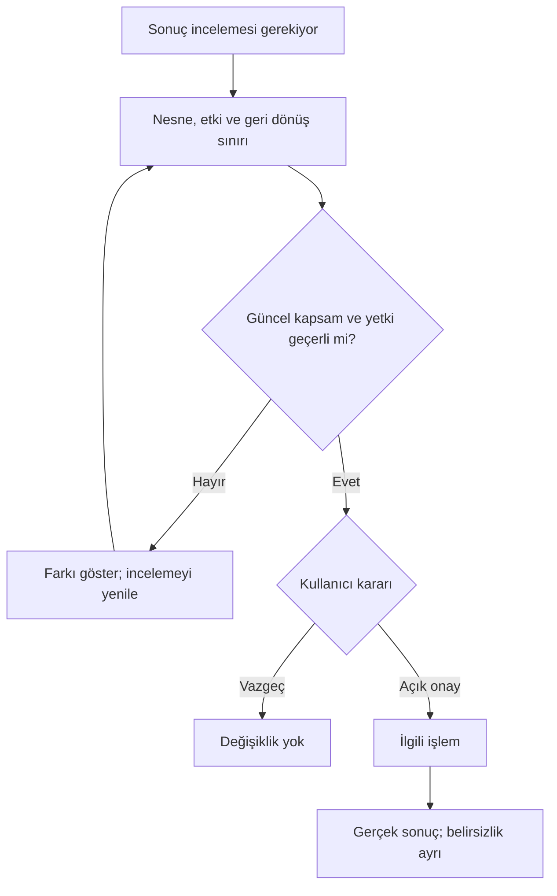
```mermaid
flowchart TD
 A["Sonuç incelemesi gerekiyor"] --> B["Nesne, etki ve geri dönüş sınırı"]
 B --> C{"Güncel kapsam ve yetki geçerli mi?"}
 C -->|Hayır| D["Farkı göster; incelemeyi yenile"]
 D --> B
 C -->|Evet| E{"Kullanıcı kararı"}
 E -->|Vazgeç| F["Değişiklik yok"]
 E -->|Açık onay| G["İlgili işlem"]
 G --> H["Gerçek sonuç; belirsizlik ayrı"]
```

## 24. Toast davranışları

Dayanak: 10 B22/B23; 12 V36–V37.

### Amaç

Kaçırıldığında hak veya önemli durum kaybı yaratmayan kısa geri bildirim vermek.

### Kullanıcı beklentisi

“Mesajı okumayı kaçırırsam yaptığım iş belirsizleşmez.”

### Davranış kuralları

- Toast düşük etkili ve gerçek yerel sonucu söyler; odak almaz, zorunlu eylem içermez. Kritik hata, kayıt hedefi ve paylaşım kapatma sonucu yalnız toast olmaz.
- 10 B22'deki yaklaşık 5 saniye görünme başlangıcı korunur; hak süresi değildir. Aynı olayın mesajları birleştirilir, ekran okuyucu konuşması rutin mesaj yağmuruyla kesilmez.
- Eylem gerekiyorsa snackbar veya kalıcı görev mesajı kullanılır. Snackbar'ın yaklaşık 10 saniyelik başlangıcı odak/işaretçi içerideyken dolmaz; erişilebilir zaman tercihi korunur.
- Geri almanın zamanlayıcı dışında ilgili görevde kalıcı yolu vardır. Mesajın kapanması hak kaybı sayılmaz.
- Bildirim etkin katmanın kapanışını, alan hatasını veya ana kontrolünü örtmez; eski görevin toast'ı yeni görevin sonucu gibi görünmez.

### İstisnalar

Kopyalama başarısızlığında “Kopyalandı” toast'ı gösterilmez; seçilebilir metin ve açık alternatif sunulur. Mesaj süresi cihaz tercihiyle uzayabilir; yeni zorunlu bekleme olmaz.

### Kabul kriterleri

- S48'de snackbar kaybolduktan sonra son kaldırmayı geri alma yolu bulunur.
- Başarısız pano işleminde başarı duyurusu yoktur; odak kullanıcının kontrolünde kalır.

## 25. Tooltip davranışları

Dayanak: 10 B38; 08 §19; 12 V28.

### Amaç

Zaten anlaşılır bir kontrole kısa ve ikincil yardım eklemek.

### Kullanıcı beklentisi

“Yardımı fare veya klavyeyle alabilirim; dokunmada kritik bilgi kaybolmaz.”

### Davranış kuralları

- Kontrolün erişilebilir adı ve gerekli görünür etiketi tooltip'ten bağımsızdır. Tooltip kritik engel, hata çözümü veya tek kullanım talimatı olmaz.
- Hover ve odakla açılır; Escape ile kapanır. İşaretçi açıklamaya taşındığında hemen kaybolmaz. Tetikleyici/yardım bağlamı korunurken okunabilir kalır; açıkça kapatılırsa odak değişmeden tekrar dayatılmaz.
- Tooltip odağı üzerine almaz ve etkileşimli öğe taşımaz. Bağlantı veya uzun açıklama gerekiyorsa açılır ayrıntı/panel davranışı kullanılır.
- Dokunmada aynı temel görev görünür adla yapılır; uzun basma zorunlu değildir. Yeni tooltip gecikmesi veya platform kısayolu bu belgeyle icat edilmez.

### İstisnalar

Salt ikonun kısa adı tooltip ile yinelenebilir; ekran okuyucu aynı etiketi gereksiz iki kez okumaz. Devre dışı kontrolün nedenini yalnız tooltip'e koymak istisna değildir.

### Kabul kriterleri

- S49'da yalnız klavyeyle yardım okunup Escape ile kapanabilir.
- Tooltip kapalıyken kaydetme, silme veya kritik koşulun anlamı eksilmez.

## 26. Form davranışları

Dayanak: 10 B11/B13–B18/B48; 11 E11/E16–E18/E23.

### Amaç

Gerekli bilgiyi minimum tekrar ve veri kaybıyla almak.

### Kullanıcı beklentisi

“Hangi alanın gerektiğini, hatayı ve göndermenin sonucunu bilirim.”

### Davranış kuralları

- Form tek görev kapsamı taşır; zorunlu ve isteğe bağlı alanlar açıklanır. Boş rota kaydına ad/tarih/profil zorunluluğu eklenmez.
- Gönderim öncesi yerel doğrulama ilgili alanlarda yapılır. Kullanıcı yazmaya başlamadan hata yığını gösterilmez; ilk gönderimde hata özeti sorunlu alanlara bağlanır.
- Düzeltilen hata yerinde güncellenir; diğer alanlar ve odak korunur. Sunucu hatası veri kaybettirmez.
- Gönderim tek işlemdir. Beklerken yalnız aynı gönderimin tekrarı engellenir; bağımsız düzenleme korunur. Sonradan değişen taslak eski gönderim sonucu tarafından ezilmez.
- İzin/onay kutuları açık kapsamlıdır ve farklı hakları tek gizli onayda birleştirmez. Pazarlama veya paylaşım önceden seçilmez.
- İletişimde gönderim gerçekten alındıysa bildirilir; cevap süresi uydurulmaz. Offline iletişim taslağı yeniden bağlantıda sessiz gönderilmez; açık gönderime dönülür.

### İstisnalar

Bir İz'in tek gözlem seçimi kaynak akışında gönderimi başlatabilir; bunun alındı ve geri çekme anlamı açık kalır. Bu istisna her radio seçiminin otomatik form göndermesine genellenmez.

### Kabul kriterleri

- S10'da alan düzeltme kalan veriyi korur; S50'de çift gönderim tek işlem olarak karşılanır.
- S59'da iletişim taslağı bağlantı geri geldiğinde otomatik gönderilmez.

#### D17 — Form ve değişen taslak

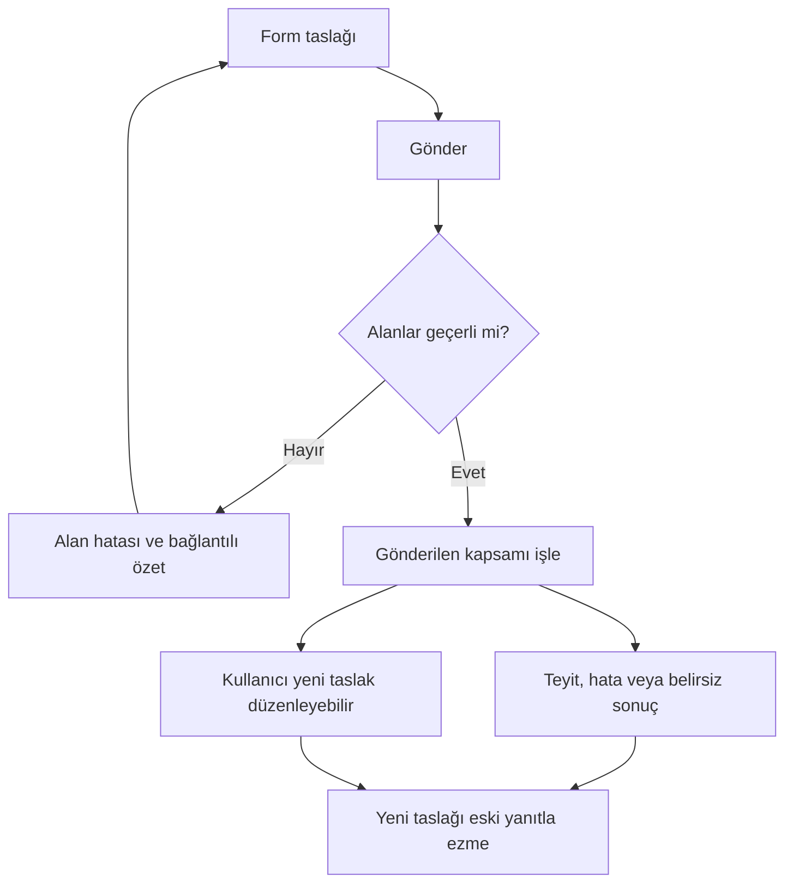
```mermaid
flowchart TD
 A["Form taslağı"] --> B["Gönder"]
 B --> C{"Alanlar geçerli mi?"}
 C -->|Hayır| D["Alan hatası ve bağlantılı özet"]
 D --> A
 C -->|Evet| E["Gönderilen kapsamı işle"]
 E --> F["Teyit, hata veya belirsiz sonuç"]
 E --> G["Kullanıcı yeni taslak düzenleyebilir"]
 F --> H["Yeni taslağı eski yanıtla ezme"]
 G --> H
```

## 27. Input davranışları

Dayanak: 10 B13–B18/B48; 02 §3–6; 12 V26.

### Amaç

Girdiyi, birimini, seçimini ve doğrulama durumunu açık tutmak.

### Kullanıcı beklentisi

“Alan ne istediğini söyler; yazdığım değer sessizce başka anlama çevrilmez.”

### Davranış kuralları

- Kalıcı etiket vardır; placeholder etiketin yerini almaz. Yardım, birim ve hata alanla ilişkilidir. Salt okunur değer okunur/kopyalanır; devre dışı kontrolün nedeni yakındadır.
- Türkçe karakterler, yerel sayı/tarih biçimleri, yapıştırma ve uygun otomatik doldurma desteklenir. Anlam değiştiren düzeltme sessiz uygulanmaz.
- Checkbox bağımsız seçim; radio birbirini dışlayan seçim; switch hemen uygulanan ikili ayardır. Switch satın alma, paylaşım yayımlama veya kapsamlı onay değildir.
- Dropdown değeri ile yazılan arama metni ayrılır. Eylem menüsü değer seçici değildir. Escape geçici listeyi kapatır, daha önce geçerli alan değerini kendiliğinden silmez.
- Kesin sayısal değer için yalnız sürüklenen slider yeterli değildir; mevcut işte gerekliyse yazılabilir/tek adımlı alternatif korunur. Bilinmeyen ücret/süre sıfır yapılmaz.
- Tarih, saat ve süre ayrı anlam taşır. Ziyaret yerinin zaman bağlamı korunur; gece yarısını geçen aynı günlük dilim tarih bilgisiyle anlaşılır. İmkânsız/belirsiz saat tahminle düzeltilmez.

### İstisnalar

Birim dönüştürme gösterimi kolaylaştırabilir ancak kişi başı/toplam, mesafe/süre veya saat dilimi anlamını değiştiremez. İsteğe bağlı bilinmeyen değer geçersiz giriş değildir.

### Kabul kriterleri

- S15'te metin birleştirme korunur; S32'de bilinmeyen tarih sıfır/bugün olmaz.
- S60'ta gece yarısı ve cihaz saat dilimi değişimi kayıtlı ziyaret gününü kaydırmaz.

## 28. Favori davranışı

Dayanak: 00 §6–9; 02 §13; 09 §31; 10 B33/B41; 11 §46.

### Amaç

“Favori” sözcüğünün yeni beğeni, puan veya sosyal sıralama nesnesi üretmesini önlemek.

### Kullanıcı beklentisi

“Bir yeri saklamanın yalnız bana ait niyet olduğunu bilirim.”

### Davranış kuralları

- Kabul edilmiş katalogda bağımsız “Favoriler” ürünü yoktur. Bu başlık yeni kalp/yıldız kontrolü, beğeni sayısı, ayrı liste veya öğrenme sinyali açmaz.
- Kişisel saklama ihtiyacı mevcut “Gezeceğim Yerler'e kaydet” davranışıyla karşılanır. Etiket sonucu söyler; dolu işaret beğeni/ziyaret anlamına gelmez.
- Eski bir yüzeyde favori sözcüğü varsa anlamı doğrulanmadan veri otomatik niyete veya ziyarete göçürülmez. Uygulama değişikliği bu belgenin çıktısı değildir; sonraki uyum incelemesinde kapsam farkı olarak kaydedilir.
- Kullanıcının kaydı motor sırasına gizli bonus vermez. Editörün “favorim” demesi organik uygunluk veya kanıt değildir.
- Kaldırma yalnız ilgili niyet kaydını etkiler; §16, §29–31 uygulanır.

### İstisnalar

Kullanıcı özel koleksiyonuna “Favorilerim” adını verebilir. Bu kişisel ad yeni sistem sınıfı, kamusal üstünlük veya puanlama olmaz.

### Kabul kriterleri

- Katalogda ikinci favori deposu/eylemi tanımlanmamıştır; §49 B41 aynı niyet sözleşmesine bağlanır.
- S29–S30'da kaydetme/kaldırma ziyaret, beğeni ve sıra etkisi üretmez.

## 29. Kaydet davranışı

Dayanak: 06 §15–16; 10 B11/B41; 11 §41–43.

### Amaç

Kullanıcının emeğini gerçek kalıcılık hedefiyle saklamak.

### Kullanıcı beklentisi

“Ne kaydedildiğini ve hangi cihaz veya hesapta yeniden bulacağımı bilirim.”

### Davranış kuralları

- Kaydet etiketi nesneyi belirtir: yer niyeti, ziyaret beyanı veya rota taslağı. Birini kaydetmek diğerlerini yaratmaz.
- Gerçek yerel yazma tamamlanmadan “Bu cihazda kaydedildi”; uzak teyit olmadan “Hesabına kaydedildi” denmez. Ekranın açık kalması kalıcılık değildir.
- Boş/tarihsiz/uyuşmazlıklı rota kaydedilebilir; kaydetme yapılabilirlik değerlendirmesini temizlemez.
- Aynı işlemin art arda tetiklenmesi mükerrer kayıt üretmez. Sonuç belirsizse mevcut kayıt kontrol edilir; yeni kopya oluşturma açık ayrı eylemdir.
- Otomatik taslak koruma gerçekten varsa kapsamıyla anlatılır; açık hesap kaydı veya kamusal yayınla eşitlenmez. Yerel depolama yok/doluysa taslak görünür kalır ve kalıcılaşmadığı söylenir.
- Cihazdan hesaba aktarım seçimi, sürüm farkı ve gerçek sonuç ayrı görünür. Eski hesap yanıtı yeni yerel değişikliği silmez.

### İstisnalar

Cihaz verisi silinmesi, farklı tarayıcı/cihaz veya kayıp yönetim erişimi için kurtarma garantisi verilmez. Kullanıcı kaydetmeden devam edebilir; yalnız gerçek kayıp riski §23'e tabidir.

### Kabul kriterleri

- S12'de cihaz/hesap sonucu doğru ayrılır; S05'te teyit kaybı çift kayıt yapmaz.
- S53'te depolama doluyken başarı gösterilmez ve kullanıcı taslağı görünür kalır.

#### D18 — Kayıt hedefi

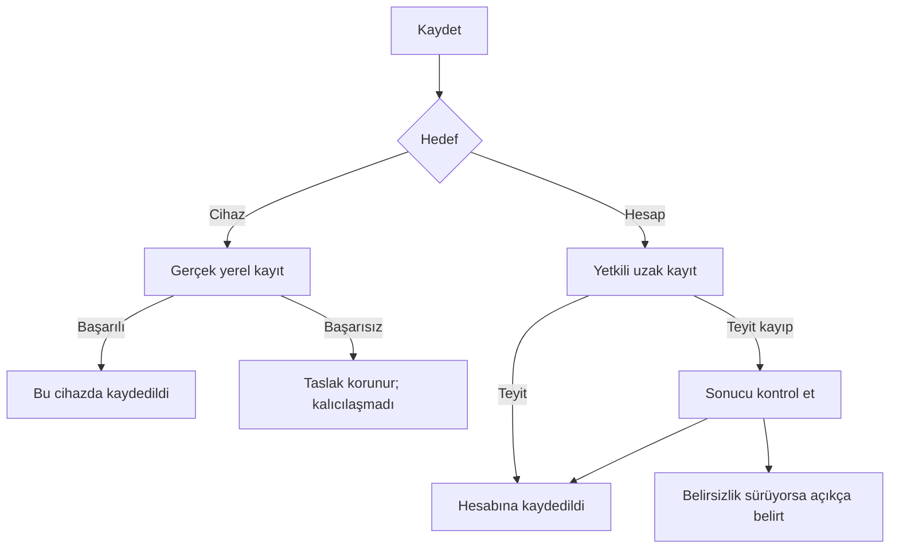
```mermaid
flowchart TD
 A["Kaydet"] --> B{"Hedef"}
 B -->|Cihaz| C["Gerçek yerel kayıt"]
 B -->|Hesap| D["Yetkili uzak kayıt"]
 C -->|Başarılı| E["Bu cihazda kaydedildi"]
 C -->|Başarısız| F["Taslak korunur; kalıcılaşmadı"]
 D -->|Teyit| G["Hesabına kaydedildi"]
 D -->|Teyit kayıp| H["Sonucu kontrol et"]
 H --> G
 H --> I["Belirsizlik sürüyorsa açıkça belirt"]
```

## 30. Silme davranışı

Dayanak: 06 §15; 10 B20/B41; 11 §43, §46.2.

### Amaç

Yalnız seçilmiş kapsamı kaldırmak; görünür kaybolmayı gerçek uzak silmeyle karıştırmamak.

### Kullanıcı beklentisi

“Hangi kayıtların ve erişimlerin etkileneceğini bilirim.”

### Davranış kuralları

| Eylem | Etkilenen | Kendiliğinden silinmeyen |
| --- | --- | --- |
| Gezeceğim'den kaldır | İlgili niyet ilişkisi | Ziyaret, rota durağı, Bir İz |
| Rotadan durak çıkar | O günlük taslakta durak | Niyet, diğer günlük rota, geçmiş |
| Ziyareti kaldır | Belirtilen ziyaret olayı | Başka ziyaret, niyet, katkı |
| Koleksiyonu sil | Grup ve üyelik ilişkileri | İçindeki bağımsız yer/rota/ziyaret kayıtları |
| Rotayı sil | O özel plan ve açıklanmış bağlı canlı paylaşım kapatma | Alıcı kopyası, dış görsel/metin, başka kayıtlar |
| Katkıyı geri çek | Katkının kullanımı; bağımlı bilgi için ayrı inceleme | Bağımsız kanıtlar, kişisel ziyaret |
| Hesabı sil | Önceden açıklanmış hesap ve bağlı veri kapsamı | Uzaktan silinemeyen dış kopyalar |

- Basit geri alınabilir kaldırma hemen yapılabilir; §31 geri alma bulunur. Dış etki veya geri alınamazlık varsa gerçek kapsam §23 ile gösterilir.
- Uzak silme teyitsizken sonuç kesinleşmez. Yerelde kaldırılan rota ile uzakta kapanmayı bekleyen link ayrı anlatılır.
- Silinen kaydın eski cihaz/sekme kopyası otomatik geri gelmez. Geri alma ayrı yetkili kullanıcı kararıdır.
- Hesap silme; kayıt, katkı, canlı paylaşım ve varsa sınırlı operasyon izinin farklı etkilerini açıklar. Bu belge yeni saklama süresi veya bütün dış kopyaları yok etme vaadi vermez.
- Toplu silmede kapsam, adet biliniyorsa adet ve öğe sonuçları açıktır. Kısmi başarısızlıkta başarılı öğeler yeniden silmeye gönderilmez.

### İstisnalar

Kullanıcı ziyaret ve katkıyı birlikte kaldırmayı seçebilir; gereksiz ayrı form zorunluluğu yaratılmaz. Kavramsal ayrım korunur ve her işlemin teyidi ayrı izlenir.

### Kabul kriterleri

- S30'da kapsam dışı kayıtlar korunur; S47'de canlı paylaşım etkisi önceden açıklanır.
- S55'te eski eşitleme silmeyi geri almaz; S51'de kısmi durumlar doğru gösterilir.

#### D19 — Silme ve dış etki

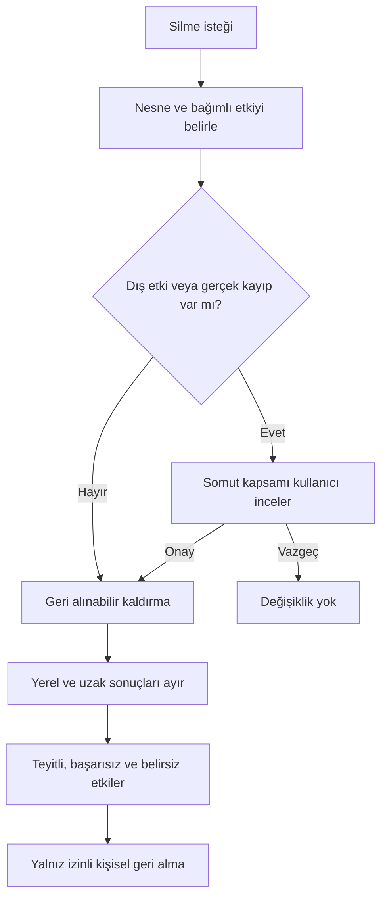
```mermaid
flowchart TD
 A["Silme isteği"] --> B["Nesne ve bağımlı etkiyi belirle"]
 B --> C{"Dış etki veya gerçek kayıp var mı?"}
 C -->|Evet| D["Somut kapsamı kullanıcı inceler"]
 C -->|Hayır| E["Geri alınabilir kaldırma"]
 D -->|Onay| E
 D -->|Vazgeç| F["Değişiklik yok"]
 E --> G["Yerel ve uzak sonuçları ayır"]
 G --> H["Teyitli, başarısız ve belirsiz etkiler"]
 H --> I["Yalnız izinli kişisel geri alma"]
```

## 31. Undo mantığı

Dayanak: 06 §15; 10 B23/B40/B41; 11 §41–46; 12 V64.3.

### Amaç

Kullanıcı hatasını düşük maliyetle düzeltmek; güncel gerçeği eskiye döndürmemek.

### Kullanıcı beklentisi

“Geri almanın hangi değişikliği geri çevireceğini bilirim; mesajı kaçırmak hakkımı bitirmez.”

### Davranış kuralları

- Geri alma kişisel değişikliğin nesnesine ve adımına bağlıdır. Seri işlemlerde “Son kaldırılan durak” gibi kapsam görünürdür; ilgisiz son işlem geri alınmaz.
- Snackbar'a ek, etkin görevde zamanlayıcı dışında kalıcı yol bulunur. Temel geri alma ileri ücretli geçmişe bağlı değildir.
- Geri alınan sıra/niyet/taslak güncel kanıtla yeniden değerlendirilir. Eski kapanma bilgisi, geri çekilmiş iddia, yetki kaybı veya silme kararı dışarıdan geri alınmaz.
- Rotayı geri almak kapatılmış canlı paylaşımı açmaz. Yeniden paylaşım yeni önizleme ve açık yayın gerektirir; dış statik kopya geri çekilmez.
- Bekleyen işlemi kuyruğa gönderilmeden durdurmak iptaldir. Uzakta tamamlanmış işi geri çevirmek yeni yetkili işlemdir; bunun da teyit/hata/belirsiz sonucu vardır.
- Eşzamanlı değişiklik varsa geri alma daha yeni ilgisiz çalışmayı ezmez. İlgili fark gösterilir, korunabilen iki çalışma korunur.

### İstisnalar

Kalıcı silme ve veri temizliği gibi geri alınamayacak sonuçlar önceden açıklanır. Temel geri alma sınırsız/süresiz arşiv vaadi değildir; görev dışı saklama süresi kaynaklarda kesinleşmediğinden uydurulmaz. Böyle bir sınır uygulanacaksa kullanıcıya işlemden önce açıklanması ve ilgili kayıt politikasında belirlenmesi gerekir.

### Kabul kriterleri

- S48'de mesaj süresi sona erse de etkin görevde geri alma yapılabilir.
- S58'de geri dönen rota güncel engeli korur ve paylaşımı kapalı bırakır.

#### D20 — Geri almanın sınırı

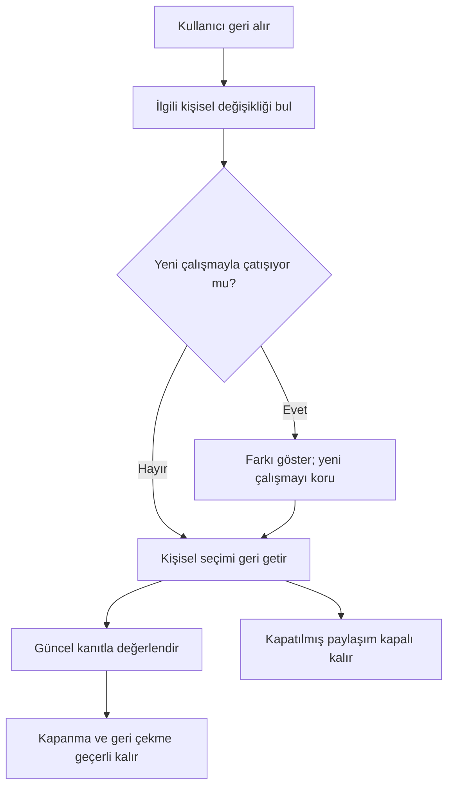
```mermaid
flowchart TD
 A["Kullanıcı geri alır"] --> B["İlgili kişisel değişikliği bul"]
 B --> C{"Yeni çalışmayla çatışıyor mu?"}
 C -->|Evet| D["Farkı göster; yeni çalışmayı koru"]
 C -->|Hayır| E["Kişisel seçimi geri getir"]
 D --> E
 E --> F["Güncel kanıtla değerlendir"]
 F --> G["Kapanma ve geri çekme geçerli kalır"]
 E --> H["Kapatılmış paylaşım kapalı kalır"]
```

## 32. Offline davranışları

Dayanak: 04 §4, §26; 07 §18; 10 B29; 11 E26, §41.

### Amaç

Bağlantı yokken gerçek yerel kapasiteyle çalışmayı sürdürmek ve güncellik sınırını açıklamak.

### Kullanıcı beklentisi

“Cihazımda ne var, neyi değiştirebilirim ve neyi doğrulayamıyorum biliyorum.”

### Davranış kuralları

- Tek isteğin hatası offline kanıtı değildir. Bağlantı yokluğu anlaşılmışsa ilgili durum açıkça gösterilir; servis arızasıyla karıştırılmaz.
- Yalnız izinli ve gerçekten yerelde bulunan içerik açılır. Son alınma zamanı, bütün iddiaların doğrulanma zamanı değildir. Yeni canlı açıklık/yoğunluk ve kişisel uygunluk üretilmez.
- Yerel taslak düzenleme ve gerçek cihaz kaydı sürebilir. Yerel veri yoksa “Bu cihazda çevrimdışı açılabilen kayıt yok” anlamı kullanılır.
- Bekleyen uzak işlem varsa nesne, hedef, durum ve iptal yolu görünürdür. Kuyruğa alınabilme gerçek destek gerektirir; genel çevrimdışı çalışma sözü verilmez.
- Yeniden bağlantıda yetki, sürüm farkı, kullanıcı iptali ve güncellik kontrol edilir. Açıkça yetkilendirilmiş hesap kaydı/Bir İz devam edebilir; paylaşım yayımlama/güncelleme güncel önizlemeye döner.
- Açık kapatma isteği sürdürülebilir; teyide kadar linkin hâlâ erişilebilir olduğu belirtilir. İletişim gönderimi, ödeme ve iç yayın için §33 matrisi geçerlidir.

### İstisnalar

Önceden kaydedilmemiş harita veya dış hizmet çevrimdışı çalışacak diye anlatılmaz. Ulaşılmayan cihaza güncel geri çekmenin anında iletildiği iddia edilmez; bağlantı döndüğünde eski olumlu kullanım sürdürülmez.

### Kabul kriterleri

- S36'da yerel veri yokluğu doğru açıklanır; S35'te uzak kapatma tamamlandı sayılmaz.
- S37'de yeniden bağlantı eski taslağı ve yeni kanıtı birbirine karıştırmaz.

#### D21 — Çevrimdışı çalışma

```mermaid
flowchart TD
 A["Bağlantı yok"] --> B{"İzinli yerel içerik var mı?"}
 B -->|Hayır| C["Yerel kapsam yokluğunu açıkla"]
 B -->|Evet| D["Tarihli içerik ve yerel taslak"]
 D --> E["Desteklenen yerel düzenleme"]
 E --> F["Varsa açık yetkili uzak işlem bekler"]
 F --> G["Bağlantı geri gelir"]
 G --> H["İptal, yetki, sürüm ve güncellik kontrolü"]
 H --> I["İşlem türüne göre devam"]
```

## 33. Network kesildiğinde davranış

Dayanak: 10 B25/B28/B29; 11 §41.3, §43–44.

### Amaç

Devam eden işin hangi aşamada kesildiğini anlamlı sonuca çevirmek.

### Kullanıcı beklentisi

“Bağlantı koptu diye gönderilmiş işin olmadığını varsaymam; yeniden deneme güvenli olur.”

### Davranış kuralları

| Kesilen iş | Kesinti anı | Yeniden bağlantı |
| --- | --- | --- |
| Salt okuma/arama | Mevcut geçerli içerik ve sorgu korunur | Güncel bağlam için tekrar getirilebilir; eski yanıt uygulanmaz |
| Hesap kaydı/Bir İz | Gönderilmemiş bekleme ile gönderilmiş belirsizlik ayrılır | Önce mevcut sonuç; sonra iptal edilmemiş yetkili istek |
| Paylaşım yayımlama/güncelleme | Canlı sonuç uydurulmaz | Önce varsa gönderilmiş işlemi kontrol et; yeni yayın için güncel önizleme/açık eylem |
| Paylaşım kapatma | Kapatma bekliyor; erişim açık kalabilir | Açık kapatma niyeti sürer; gerçek teyit beklenir |
| İletişim | Taslak veya teyidi belirsiz gönderim | Gönderilmiş sonucu kontrol et; gönderilmemiş için açık gönderim |
| Ödeme/hak işlemi | Sonuç bilinmiyorsa yeni satın alma açılmaz | Yetkili işlem ve hak sonucu kontrol edilir |
| İç yayın/geri çekme | Gerçekleşen kapsam belirsizse açık kalır | Önce sonuç; yeni işte güncel yetki, kanıt ve etki incelemesi |

- Kullanıcı çalışması mümkün olan izinli kapsamda korunur. Sonsuz spinner yerine kesinti/belirsiz sonuç ve gerçek devam yolu görünürdür.
- Yeniden bağlantı başarı değildir; teyitli, başarısız ve bekleyen işler ayrı kalır. Aynı işlem iki kez uygulanmaz.
- Eski bağlantıdan gelen yanıt yeni sorguyu veya kullanıcı düzeltmesini ezmez. Oturum değişmişse özel yanıt yeni hesaba gösterilmez.
- Çoklu cihaz çatışmasında son yazan sessiz kazanmaz. İki çalışma korunur; silme ve kritik bilgi geri çekmesi eski kopyayla dirilmez.

### İstisnalar

Güvenle tekrarlanabilir salt okumalar uygun biçimde yeniden denenebilir. Bu, dış etkili bütün işlemleri otomatik yeniden gönderme kuralına dönüşmez; yeni sayısal deneme/geri çekilme süresi burada belirlenmez.

### Kabul kriterleri

- S05, S35 ve S57'de belirsiz kayıt, kapatma ve ödeme başarıya/hataya zorlanmaz.
- S54–S56'da kesinti sonrası eski sekme başka çalışma veya hesap verisini ezemez.

#### D22 — Kesinti sonrası karar

```mermaid
flowchart TD
 A["Bağlantı kesildi"] --> B{"İşlem gönderilmiş miydi?"}
 B -->|Hayır| C["Taslak veya açık bekleyen istek"]
 B -->|Evet| D["Teyit yoksa sonuç belirsiz"]
 D --> E["Mevcut işlemi kontrol et"]
 E -->|Bulundu| F["Gerçek sonucu göster"]
 E -->|Gerçekleşmediği kesin| G["Türüne göre yeniden devam"]
 E -->|Bilinmiyor| D
 C --> G
 G --> H["Yetki, güncellik ve kullanıcı niyeti korunur"]
```

## 34. AI cevap üretirken davranış

Dayanak: 03 §1, §6–8; 05 §33–35; 10 B44; 11 E03/E07.

### Amaç

AI yardımını gerçek bilgi, karar otoritesi ve mevcut kullanıcı bağlamıyla sınırlamak.

### Kullanıcı beklentisi

“Ne anlaşıldığını ve neyin bilinmediğini görürüm; akıcı metni kanıt sanmam.”

### Davranış kuralları

- Kullanıcının girdisi korunur. “Şunu anladım” özeti düzenlenebilir; sistemin yorumladığı koşullar kullanıcı beyanı gibi gizlice kesinleştirilmez.
- Üretim sürerken gerçek işe uygun bekleme metni vardır; düşünce zinciri, sahte tarama aşaması, uygunluk yüzdesi veya AI onay rozeti gösterilmez.
- Olumlu gerekçe ve kritik sınır tamamlanmış anlam birimi olarak birlikte sunulur. Parçalı aktarım varsa bağımsız tamamlanmış birimlerle sınırlıdır; uyarısı henüz gelmemiş olumlu cümle yayımlanmaz.
- Yeni kullanıcı girdisi önceki cevabın sonuç alanını geçersiz kılar. Eski cevap yeniden yazmayı, yeni filtreyi veya rota sırasını ezmez.
- Netleştirme yalnız kararı değiştiren eksik için sorulur; vazgeçme ve elle düzenleme mümkündür. Bilinmeyen koşul tahminle doldurulmaz.
- AI arızasında desteklenen ad araması, filtre, yerel kayıt ve yayımlanabilir temel bilgi devam eder. Yeni gerekçe üretilemiyorsa bu sınır açıklanır; eski kişisel öneri yeni bağlamda kullanılmaz.

### İstisnalar

Üretimi durdurmak beklemeyi bırakma olabilir; gerçek iptal yeteneği yoksa hesaplama iptal edildi denmez. İç editör AI taslağını görev yetkisiyle görebilir; kamusal yayın ve onay yetkisi yine ayrı kalır.

### Kabul kriterleri

- S38'de kritik bilinmeyen olumlu cümlenin arkasından gecikmeli gelmez.
- S13 ve S04'te eski AI sonucu güncel sorgu veya taslak üzerine yazılmaz.

#### D23 — AI yanıtının görünürlük kapısı

```mermaid
flowchart TD
 A["Güncel kullanıcı bağlamı"] --> B["Yetkili bilgi ve karar"]
 B --> C["AI açıklaması hazırlanır"]
 C --> D{"Anlam birimi ve kritik sınır tamam mı?"}
 D -->|Hayır| E["Olumlu iddiayı gösterme"]
 D -->|Evet| F{"Hâlâ güncel bağlama mı ait?"}
 F -->|Hayır| G["Eski yanıtı uygulama"]
 F -->|Evet| H["Gerekçe ve sınır birlikte"]
 E --> I["Sade desteklenen bilgi veya açık eksiklik"]
```

## 35. Skeleton kuralları

Dayanak: 10 B26; 12 V33.

### Amaç

Gerçekten gelecek içeriğin ilk yüklenmesinde yerleşim sürekliliğini sağlamak.

### Kullanıcı beklentisi

“Bu alanın yüklendiğini bilirim; şekilleri gerçek sonuç sanmam.”

### Davranış kuralları

- Yalnız beklenen yapı biliniyorsa kullanılır; görünür kapsam kadar yer ayrılır. Sonuç adedi bilinmiyorsa iskelet sayısı gerçek toplam gibi duyurulmaz.
- Varsayılan statiktir. Parlama, dalga ve sürekli shimmer yüklenmenin kanıtı değildir.
- Dekoratif parçalar odak almaz veya tek tek okunmaz. Bölgenin yüklenme durumu uygun tek duyuruyla anlaşılır.
- Boş sonuç, hata, yetki reddi ve bilinmeyen bilgi skeleton'a hapsedilmez. Bekleme bittiğinde gerçek duruma geçilir.
- Mevcut geçerli içeriğin yenilenmesi tüm ekranı skeleton'a çevirmez. Gerekçe ve sınır birlikte hazır olur; fotoğrafın gelmemesi metni bekletmez.

### İstisnalar

Yapı bilinmiyorsa sade yüklenme metni kullanılır. Gerçek görsel yüklenemiyorsa anlamlı fotoğrafsız son durum gösterilir; boş kutu sonsuza dek tutulmaz.

### Kabul kriterleri

- S20 ve S06'da medya arızası sonsuz skeleton üretmez.
- Ekran okuyucu her iskelet parçasında durmaz; sonuç geldiğinde eski iskelet odağı kalmaz.

## 36. Animasyon kuralları

Dayanak: 10 §47; 12 V62–V63.

### Amaç

Mevcut hareket rollerini bileşen davranışını geciktirmeden uygulamak.

### Kullanıcı beklentisi

“Aynı değişiklik benzer karşılık verir; hareketi kapatınca işlev kaybolmaz.”

### Davranış kuralları

| Kaynak rol | Süre | İzinli anlam |
| --- | --- | --- |
| Anlık | 0 ms | Kritik düzeltme ve doğrudan durum |
| Kısa | 120 ms | Küçük durum karşılığı |
| Geçiş | 180 ms | Aynı görevde düzen ilişkisi |
| Katman | 240 ms | Sheet/drawer ilişkisinin açıklanması |
| Azaltılmış hareket | 0 ms | Aynı son durum ve odak |

- Süreler 10 ve 12'den devralınan başlangıç rolleridir; performans garantisi veya zorunlu bekleme değildir.
- Yaylanma, geri sekme, parallax, manyetik kontrol, dönen kart, otomatik harita uçuşu ve sürekli yüzen öğe kullanılmaz.
- Yeni girdi geçişi kesebilir. Görsel ara durum hiçbir zaman eski kullanıcı seçimini nihai durum yapmaz.
- Kritik bilgi hareket sırasına alınmaz. Hata/başarı metni animasyonu izlemeye bağlı kalmaz.
- Sonradan gelen fotoğraf, font veya sonuç işaretçinin altına başka eylem yerleştirmez; odak görünürlüğü korunur.

### İstisnalar

Doğrudan sürükleme sabit süreye bağlanmaz, girdiyi izler. Bu davranış motor değerlendirmesi veya uzak kayıt teyidi değildir.

### Kabul kriterleri

- S03'te aynı görev 0 ms karşılığıyla tamamlanır.
- Ardışık aç/kapat/seç eylemleri son durumu doğru bırakır; animasyon bitişi iş başlatmanın önkoşulu değildir.

## 37. Accessibility davranışları

Dayanak: 07 §23–25; 10 §55–56; 11 §34–36; 12 V68.

### Amaç

Aynı karar ve kontrol hakkını farklı algı/giriş biçimlerinde korumak.

### Kullanıcı beklentisi

“Görsel, hareket, ses veya harita kullanmadan da temel görevleri bitirebilirim.”

### Davranış kuralları

- 10'daki web için WCAG 2.2 AA hedefi devralınır; belge uygunluk belgesi değildir. Uygulamadaki bütün ilgili süreçler ayrıca sınanır.
- Görünür etiket erişilebilir adın içinde bulunur. Başlık, alan, liste, sekme, tablo ve durum ilişkileri yalnız görünüşle verilmez.
- Kritik bilgi hover, renk, ikon, tooltip, ses veya haptikte tek başına kalmaz. Rutin sonuç nazik duyurulur; önemli değişiklik gerekirse öncelikli duyurulur, fakat kalıcı bağlamı da vardır.
- Odağın tamamı görünür tutulur; yapışkan başlık, alt çubuk, sheet ve klavye kontrolü örtmez. Atla/içeriğe geç yolu temel gezinmeyi kolaylaştırır.
- Kaynak ürün hedefi dokunma/karma girişte en az 48 × 48, küçük kontrolde 44 × 44 mantıksal birimdir; bu ölçüler WCAG'nin sayısal minimumu diye sunulmaz. Hedefler çakışmaz.
- Metin büyütme ve yeniden akış kritik sınırı kesmez. 10'daki %200 metin ve 320 CSS pikseline eşdeğer dar alan hedefi korunur; harita geometrisinin istisnası çevresindeki kontrollere yayılmaz.
- Yardımcı teknolojide özel içerik görselden gizlense bile erişilebilir ağaçta kalmaz. Yetki/mahremiyet bütün sunum kanallarında aynıdır.

### İstisnalar

Yerel uygulama platform erişilebilirlik olanaklarıyla aynı sonucu sağlar; web uygunluk iddiası ona otomatik aktarılmaz. Dekoratif ikon/görsel ayrı okunmayabilir; anlamlı bilgi dekor diye gizlenemez.

### Kabul kriterleri

- S45, S49 ve S62'de klavye/ekran okuyucu ile katman, yardım ve bilgi sınırı anlaşılır.
- S61'de büyütme sırasında kritik bilgi, hata ve çıkış kontrolleri kaybolmaz.

#### D24 — Eşdeğer erişim

```mermaid
flowchart TD
 A["Karar bilgisi ve eylem"] --> B["Anlamsal yapı ve ad"]
 B --> C["Klavye ve alternatif giriş"]
 B --> D["Dokunma ve görünür kontrol"]
 C --> E["Aynı durum, sınır ve sonuç"]
 D --> E
 E --> F["Büyütme ve azaltılmış hareket"]
 F --> G["Gerçek yardımcı teknolojiyle görev kabulü"]
```

## 38. Keyboard Navigation

Dayanak: 10 B07/B14–B20/B36–B38, §55; 11 §38.

### Amaç

Fare ve jest olmadan bütün temel işleri öngörülebilir sırayla tamamlatmak.

### Kullanıcı beklentisi

“Odağımın nerede olduğunu ve bir tuşun hangi işi yapacağını bilirim.”

### Davranış kuralları

| Bağlam | Beklenen klavye davranışı |
| --- | --- |
| Genel gezinme | Tab/Shift+Tab mantıksal kontrol sırası; görünür odak |
| Buton/bağlantı | Platformun yerleşik etkinleştirme davranışı; bağlantıda yeni sekme/kopyalama korunur |
| Arama önerisi | Oklarla gezin, Enter seç/gönder, Escape öneriyi kapat; metin korunur |
| Checkbox/radio | Bağımsız işaretleme veya grup içi yerleşik seçim; seçim kendiliğinden formu göndermez |
| Sekme | Etkin panel açık; gecikmeli içerikte odak gezintisi ağır işi zorunlu başlatmaz |
| Eylem menüsü/seçici | İç öğelerde öngörülebilir gezinme; Escape açan kontrole dönüş |
| Modal/dialog | Odak etkin görevde; Escape güvenli vazgeçme; kapanınca mantıksal dönüş |
| Rota taşıma | Görünür taşıma kontrolleriyle sıra değişir; odak taşınan durakta |
| Metin alanı | Düzenleme ve yerleşik geri alma tuşları metni yönetir; rota geri almasına çalınmaz |

- Global tek harfli gizli kısayol icat edilmez. Ürün tarayıcı/işletim sistemi komutlarını ele geçirmez.
- Yeni sonuç, toast veya arka plan güncellemesi odağı çalmaz. Silinen tetikleyici yerine mantıksal komşu seçilir.
- Escape önce en iç geçici kontrolü kapatır; bir basışla seçici, modal ve ana görev birlikte kapanmaz.

### İstisnalar

Yerel kontrolün platform davranışı farklı olabilir; aynı amaç, durum ve çıkış korunur. Modal olmayan panel için odak tuzağı kurulmaz.

### Kabul kriterleri

- S45'te modal odak dönüşü, S49'da tooltip kapanışı, S63'te rota taşıma yalnız klavyeyle tamamlanır.
- Metin içindeki geri alma yalnız metin düzenlemesini etkiler; kullanıcının rota geçmişi beklenmedik değişmez.

#### D25 — Escape önceliği

```mermaid
flowchart TD
 A["Escape"] --> B{"İç seçici veya yardım açık mı?"}
 B -->|Evet| C["Yalnız onu kapat"]
 B -->|Hayır| D{"Modal görev açık mı?"}
 D -->|Evet| E["Görevin vazgeçme kuralı"]
 D -->|Hayır| F["Mevcut kontrolün tanımlı davranışı"]
 E --> G["Gerekli taslak koruma ve odak dönüşü"]
```

## 39. Mobil Gesture kuralları

Dayanak: 10 §48–50; 12 V65.

### Amaç

Jestleri görünür işlemlerin isteğe bağlı kolaylaştırıcısı yapmak.

### Kullanıcı beklentisi

“Yanlış kaydırma veri kaybettirmez; her işlemin görünür alternatifi vardır.”

### Davranış kuralları

- Taşıma için görünür öne/arkaya taşı; kaldırma için adlandırılmış satır eylemi; sheet için kapat; pinch için yakınlaştırma kontrolleri bulunur.
- Uzun basma tek menü yolu değildir. Çok parmak, cihaz sallama veya gizli jest temel eylem şartı olmaz.
- Basma mümkün olduğunca bırakmayla kesinleşir; hedef dışına çıkış vazgeçmeye izin verir. Sürükleme sırasında yanlışlıkla kart açma/kaydetme tetiklenmez.
- Sistem kenar geri hareketi ürün jestiyle yarışmaz. Harita pan'i sayfanın kaydırma/çıkışını ele geçirmez.
- Jestle taşıma yalnız kullanıcı sırasını değiştirir; yeniden değerlendirme ayrı sürer. Salt okunur paylaşımda taşıma ipucu gösterilmez.

### İstisnalar

Jest desteklenmeyen cihazda görünür kontrol aynı sonucu sağlar. Jest kullanımı bağımsız yeni yetki veya ürün özelliği değildir.

### Kabul kriterleri

- S64'te hedef dışına bırakma yanlış eylem yapmaz.
- S63'te jest kullanılmadan aynı sıra değişir; S44'te sheet kapatılabilir.

## 40. Desktop davranışları

Dayanak: 07 §22; 10 §7, §48–50; 11 §34, §44.

### Amaç

Geniş alan ve çoklu girişin aynı işi daha rahat yaptırmasını sağlamak.

### Kullanıcı beklentisi

“Fare, klavye ve yeni sekmeyle çalışırken bağlamım ve yetkim değişmez.”

### Davranış kuralları

- Yeterli alanda liste ve yardımcı harita/drawer birlikte bulunabilir; aynı seçili öğe ve taslak kullanılır. İki bağımsız kayıt otoritesi oluşmaz.
- Hover yardımcıdır, temel bilgi değildir. Dokunmatik dizüstünde fare var diye hedefler küçültülmez.
- Bağlantının yeni sekmede açılması ve tarayıcı geri davranışı korunur. Özel nesne yeni sekmede de sahiplik kontrolü ister.
- Sekmeler keşif sorgusunu ve odağı birbirine taşımaz. Aynı kalıcı nesnedeki değişiklik farkı görünür olur; kaydedilmemiş taslak ezilmez.
- Geniş ekran ek öneri kotası, yoğun reklam veya yeni portal gerekçesi değildir. Okunabilir ana görev daralırsa yardımcı panel ayrılır.

### İstisnalar

Yoğun iç operasyon karşılaştırması geniş alan isteyebilir. Bu gereksinim kritik kanıtı gizleme veya dar ekranda incelemeyi atlama hakkı vermez.

### Kabul kriterleri

- S54'te iki sekmenin farklı rota düzenlemeleri korunur.
- Fare olmadan aynı görev tamamlanır; yeni sekmeden dönüldüğünde özgün sorgu değişmez.

## 41. Tablet davranışları

Dayanak: 11 §35–36; 10 §7–8, §48.

### Amaç

Yön, pencere ve giriş yöntemi değişiminde aynı görevi sürdürmek.

### Kullanıcı beklentisi

“Tableti çevirmek veya klavye bağlamak çalışmamı yeniden başlatmaz.”

### Davranış kuralları

- Düzen cihaz adına göre değil kullanılabilir alan ve metin ölçeğine göre tek/ilişkili çok alanlı olur.
- Bölünmüş ekran, ekran klavyesi ve yön değişimi aynı taslağı, seçili öğeyi, uygulanan filtreyi ve odak ilişkisini korur.
- Panel sheet/tam görev olduğunda filtre kendiliğinden uygulanmaz; taslak silinmez. Çift görünüm tek görünümün farklı kaydı değildir.
- Dokunma, kalem, fare ve klavye aynı işlem kapsamına ulaşır. Klavye takmak admin yetkisi yaratmaz.
- Kanıt karşılaştırması dar alanda adımlara bölünebilir; karşı kanıt, gerekçe ve gerekli ikinci inceleme kaybolamaz.

### İstisnalar

Kullanılabilir alan incelemeye yetmiyorsa ilgili iş taslakta kalır veya desteklenen tam göreve geçer. Kullanıcıya tamamlanmamış inceleme bitmiş diye sunulmaz.

### Kabul kriterleri

- S65'te yön/bölünmüş ekran değişince filtre taslağı aynı kalır ve gönderilmez.
- Ekran klavyesi açıkken odaklı alan ve çıkış yolu görünürdür.

## 42. Responsive kuralları

Dayanak: 10 §7–8, §55–56; 11 §36–38; 12 V6–V9.

### Amaç

Yerleşim değişirken bilgi, işlem ve hak anlamını sabit tutmak.

### Kullanıcı beklentisi

“Dar ekranda daha az doğruluk veya kontrol almam.”

### Davranış kuralları

- Yeni breakpoint veya ölçü sistemi icat edilmez; mevcut 10 düzen eşikleri kullanılır. Alan yetmeyince yardımcı görünüm ayrılır, içerik yeniden akar, alt iş tam göreve dönüşür.
- Kritik engel, bilinmeyen, kimlik, etkin zorunlu koşul, hata ve çıkış kaldırılmaz; olumlu tekrar/ikincil içerik önce sadeleşir.
- Aynı görevin geniş ve dar kopyaları aynı anda erişilebilir ağaçta iki kez bulunmaz. Etkin kontrol değişirse odak eşdeğer kontrole aktarılır.
- Pencere boyutu değişimi kayıt, uygulama, yayın veya otomatik sorgu sıfırlama tetiklemez. Sayfa konumu mantıksal öğeye bağlı korunur.
- Uzun Türkçe ad, çeviri, büyük metin ve ekran klavyesi gerçek daralma sayılır. Sabit başlık/alt çubuk gerektiğinde sabitliğini bırakır.

### İstisnalar

Harita ve gerçek veri tablosunun iki boyutlu içeriği uygun özel görünüm gerektirebilir. Çevresindeki form, uyarı ve eylemler yeniden akar; alternatif liste/inceleme erişimi korunur.

### Kabul kriterleri

- S61 ve S65'te metin/yön değişikliği hiçbir kritik koşulu kesmez veya uygulamaz.
- Aynı anda iki Uygula/kapat kontrolü ekran okuyucuya yinelenmez; etkin taslak korunur.

#### D26 — Alan değişiminde süreklilik

```mermaid
flowchart TD
 A["Alan veya metin ölçeği değişti"] --> B{"İlişkili paneller okunabilir mi?"}
 B -->|Evet| C["Mevcut düzen sürer"]
 B -->|Hayır| D["Yardımcı alanı ayır; tek göreve geç"]
 C --> E["Aynı nesne, taslak ve seçim"]
 D --> E
 E --> F["Eşdeğer odak ve aynı uygulama modeli"]
```

## 43. Haptic kullanımı

Dayanak: 10 §46; 12 V66.

### Amaç

Gerçek etkileşime isteğe bağlı dokunsal destek vermek.

### Kullanıcı beklentisi

“Titreşim olmasa da sonucu anlarım; tercihime saygı duyulur.”

### Davranış kuralları

- Yalnız cihaz desteği ve kullanıcı/platform tercihi kapsamında kullanılır. Yeni titreşim dizisi veya zorunlu cihaz özelliği tanımlanmaz.
- Basış karşılığı ile tamamlanma farklıdır; başarı haptiki varsa gerçek teyitten önce verilmez.
- Hata, seçim ve başarı metin/görünür durumla da anlaşılır. Bekleme, harita gezinme ve sıradan tekrarlar titreşim yağmuru üretmez.
- Premium daha güçlü titreşim veya özel ödül hissi sağlamaz. Katkı ve gezi bitişi statü kutlaması değildir.

### İstisnalar

Desteklenmeyen cihazda haptik bulunmaz; hata sayılmaz. Platformlar arasında aynı fiziksel his garanti edilmez; işlem anlamı aynı kalır.

### Kabul kriterleri

- S66'da haptik kapalıyken kayıt hedefi ve sonuç anlaşılır.
- Belirsiz uzak işte başarı titreşimi oluşmaz; arka arkaya bekleme titreşimi kullanılmaz.

## 44. Ses kullanımı

Dayanak: 07 §27; 10 §46; 12 V66.

### Amaç

Sesin istemsiz dikkat ve mahremiyet yükü yaratmasını önlemek.

### Kullanıcı beklentisi

“Ürün beklenmedik ses çıkarmaz; sessizken bütün bilgiye ulaşırım.”

### Davranış kuralları

- Ürün sesi varsayılan değildir. Kullanıcının/platformun açık tercihine bağlı mevcut işlev yoksa ses çalınmaz; yeni sesli asistan veya navigasyon yeteneği açılmaz.
- Başarı/hata yalnız sesle anlatılmaz. Ses varsa gerçek durumla aynı kapsamı taşır; bekleme başarı gibi duyulmaz.
- Ekran okuyucu ürünün dekoratif sesi değildir; kapatma tercihi yardımcı teknoloji duyurularını engellemez.
- Otomatik medya oynatma, reklam sesi, tekrar eden AI bekleme sesi ve Premium kutlaması yoktur. Özel not/konum sesli ortama kendiliğinden taşınmaz.

### İstisnalar

Kullanıcının başlattığı dış yol tarifi uygulamasının sesi o uygulamanın denetimindedir; Şamandıra bunun sessizliğini veya tamamlanmasını garanti etmez.

### Kabul kriterleri

- S66'da sessiz kullanım tüm sonuçları erişilebilir kılar.
- Sayfa veya paylaşım açılışı kendiliğinden ürün sesi/medya başlatmaz; ekran okuyucu bilgiye erişmeye devam eder.

## 45. Bildirim kullanımı

Dayanak: 07 §29; 10 B24; 11 E14/E15; 12 V35.

### Amaç

Yalnız anlamlı karar değişikliğini veya açıkça istenmiş hatırlatmayı bildirmek.

### Kullanıcı beklentisi

“Neden bildirildiğini anlar, ilgili değişikliğe ulaşır ve bildirimleri kapatabilirim.”

### Davranış kuralları

- İlk açılışta bildirim izni istenmez. İlgili etkin gün uyarısı veya hatırlatma kullanıcı tarafından seçilince kanal ve kapsam açıklanır.
- Kritik değişiklik ilgili durakta kalıcıdır. Dış kanal yalnız izinli kapsamda çalışır; izin reddi uygulama içi bilgiyi saklamaz.
- Bildirim aynı olay için birleştirilir; okunmuş sıradan tekrarlar yeniden çalmaz. Sessiz saat ve kanal tercihi korunur; teslim/canlı takip garantisi verilmez.
- Kilit ekranı metni özel başlangıç, sağlık, kişi veya ayrıntılı plan açıklamaz. Açılış önce yetkiyi kontrol eder, sonra ilgili değişikliğe gider.
- Okundu, kapatıldı ve çözüldü ayrıdır. Bildirimi kapatmak zorunlu koşulu veya alttaki uyarıyı kaldırmaz; önerilen değişikliği otomatik kabul etmez.
- Premium/promosyon, şehir tamamlama, niyet listesinde bekleyen yer ve bitmiş günün sıradan değişikliği bildirim gerekçesi değildir. Bir İz daveti isteğe bağlıdır; aynı ziyaret için ret sonrası yinelenmez.

### İstisnalar

İzinli dağıtım servisi yoksa bildirim teslim edilecek gibi etkin kontrol gösterilmez. Kullanıcı ilgili içeriği yeniden açınca güncel bilgi sınırı görünür; bu canlı izleme değildir.

### Kabul kriterleri

- S67'de bildirim izni reddi kritik bilgiyi gizlemez.
- S68'de bildirimi kapatmak rota değişikliğini onaylamaz ve kilit ekranına özel veri taşımaz.

#### D27 — Bildirim kararı

```mermaid
flowchart TD
 A["Olay"] --> B{"Etkin karara etkisi veya açık hatırlatma isteği var mı?"}
 B -->|Hayır| C["Dış bildirim yok"]
 B -->|Evet| D["İlgili yerde kalıcı bilgi"]
 D --> E{"İzinli ve desteklenen kanal var mı?"}
 E -->|Hayır| D
 E -->|Evet| F["Asgari ve tek olay bildirimi"]
 F --> G["Açılışta yetki ve ilgili değişiklik"]
 G --> H["Kullanıcı inceler; otomatik plan değişmez"]
```

## 46. Kullanıcı güveni

Dayanak: 00 §4–6; 08 §28; 09 §20; 12 V58–V61.

### Amaç

Gerçeğe, kalıcılığa ve kullanıcının kontrolüne ilişkin ölçülü beklenti kurmak.

### Kullanıcı beklentisi

“Ürün bildiği kadar konuşur; yanlışını saklamaz ve kararımı elimden almaz.”

### Davranış kuralları

- Güncellik ilgili iddiaya bağlanır; dosya/kayıt yenilenme tarihi bütün mekân bilgisini doğrulamaz.
- Kaydetme, ziyaret, katkı, paylaşım ve ödeme sonuçları kendi gerçek kapsamıyla teyit edilir. Sessizlik memnuniyet veya onay sayılmaz.
- Yeni kritik bilgi eski olumlu hükmü sınırlar; kullanıcıya neyin değiştiği açıklanır. Sistem taslağı gizlice başka yerlerle düzeltmez.
- Aynı kayıt, mahremiyet ve ayrılma kontrolleri ücretsiz kullanımda da vardır. Ticari ilişki uygunluk ve yayın önceliği satın alamaz.
- Yöntem ve bilgi düzeltme yolu erişilebilirdir; kullanıcı ham yorum, iç skor veya araştırma ödeviyle baş başa bırakılmaz.

### İstisnalar

Kaynak hakları veya özel erişim bazı ayrıntıların gösterimini sınırlayabilir. Bu, bilinmeyeni saklama gerekçesi değildir; kamuya aktarılabilir somut sınır korunur.

### Kabul kriterleri

- S69'da kritik düzeltme kart, yer, rota ve canlı paylaşımın ilgili iddiasına aynı anlamla yansır.
- S12, S34 ve S39'da kalıcılık, dış gönderim ve Premium etkileri doğru açıklanır.

## 47. Yanlış yönlendirmeyi engelleyen kurallar

Dayanak: 02 §8–14; 03 §2, §15, §18; 05 §34–35; 12 V70.

### Amaç

Bilgi, seçim ve görsel durum arasındaki yanlış eşitlikleri engellemek.

### Kullanıcı beklentisi

“Bilinmeyen olumlu cevap gibi sunulmaz; seçtiğim işaret kanıt değildir.”

### Davranış kuralları

- Bilinmiyor, yok, eski, çelişkili, uygulanamaz, bulunamadı ve servis hatası ayrı anlatılır. Kritik bilinmeyen “koşula bağlı” diye olumlu öneriye sokulmaz.
- Uyarıyı kapatmak veya taslakta tutmak zorunlu koşulu kaldırmaz. Bütçe/erişim/varış sınırı yalnız açık kapsamlı kullanıcı değişimiyle değişir.
- Basamaksız giriş tüm erişim zinciri; program saati anlık açık; yakınlık yürünebilirlik; rota çizgisi geçiş garantisi değildir.
- Yer seçimi, kayıt, mavi/yeşil vurgu, onay işareti, fotoğraf veya AI akıcılığı uygunluk/güven kanıtı değildir.
- Ham yorum, yeniden yazılmış yorum, yıldız, yorumcu kimliği, duygu/iç güven/uygunluk yüzdesi ve model muhakemesi kamusal sunuma çıkmaz. Lisansın gerektirdiği atıf ayrı korunur.
- Özel koşul paylaşımda çıkarılıyorsa ona bağlı olumlu hüküm aşırı genelleşemez. Sesli/erişilebilir metin de aynı sınırı taşır.

### İstisnalar

Adla bulunan uyumsuz yer kullanıcıya kimlik olarak açılabilir. Bu, öneri değildir; göstermekle önermek ayrılır. İç yetkili inceleme yalnız görev ve kaynak hakkı kapsamındaki asgari kanıta erişir.

### Kabul kriterleri

- S70'te “uyarıyı kapat” erişim koşulunu çözmez veya sonucu uygun yapmaz.
- S38 ve S69'da olumlu gerekçe kritik sınırdan ayrılmaz; geri çekilmiş güvence korunmaz.

#### D28 — İddia görünürlük sınırı

```mermaid
flowchart TD
 A["Bir iddia gösterilecek"] --> B{"Yetkili ve kapsamı destekli mi?"}
 B -->|Hayır| C["İddiayı kurma; ilgili eksiği belirt"]
 B -->|Evet| D{"Karar değiştiren sınırı var mı?"}
 D -->|Evet| E["İddia ve sınır aynı anlam birimi"]
 D -->|Hayır| F["Desteklenen kapsamla göster"]
 E --> G{"Dar yüzeyde anlam korunuyor mu?"}
 G -->|Hayır| H["Olumlu anlatımı daralt"]
 G -->|Evet| I["Göster"]
 H --> E
```

## 48. Asla yapılmayacak interaction kararları

Dayanak: 00 §6–9; 07 §30; 08 §36/40; 10 nihai ilkeler; 12 V70.

### Amaç

Gösteriş, satış veya etkileşim artışı için kaynakların yasakladığı davranışlara kapı açmamak.

### Kullanıcı beklentisi

“Kararımı verme, düzeltme ve ayrılma hakkım korunur.”

### Davranış kuralları

1. İlk değer önüne hesap, konum, bildirim, zorunlu onboarding veya uygulama kurulum duvarı koymak yoktur.
2. Yeni favori/beğeni, puan, yıldız, takipçi, seri veya şehir tamamlama sistemi yoktur.
3. Kullanıcı koşullarını sonuç üretmek için sessiz gevşetmek yoktur.
4. Kritik sınırı tooltip, gizli panel, ikinci ekran veya ücretli alana saklamak yoktur.
5. Eski yanıtla yeni taslağı, eski kopyayla silmeyi veya geri çekmeyi ezmek yoktur.
6. Kayıt, yol tarifi, paylaşım açılışı ve erken bitişten ziyaret/memnuniyet çıkarmak yoktur.
7. Bilinmeyen uzak sonucu başarı veya kesin başarısızlık ilan etmek; kör tekrar göndermek yoktur.
8. Kaydetmeyi yayın; modal kapatmayı iptal; bildirimi kapatmayı çözüm saymak yoktur.
9. Paylaşım önizlemesini atlamak, özel düzenlemeyi otomatik yayımlamak veya dış mesajı kullanıcı yerine göndermek yoktur.
10. Kapatılmış linki geri almayla açmak veya dış kopyaların geri çekildiğini söylemek yoktur.
11. Hata, offline, boş sonuç ve kullanıcı emeği üzerinden Premium baskısı yoktur.
12. Hover, renk, ses, haptik, sürükleme, QR veya haritayı tek kullanım yolu yapmak yoktur.
13. Odak çalma, bağımsız modal yığını, klavye tuzağı ve yanlış kaydırmada geri alınamaz silme yoktur.
14. Sahte ilerleme, zorunlu animasyon, manyetik kontrol, konfeti ve otomatik harita uçuşu yoktur.
15. Ticari ilişkiyi organik sıra, güncellik veya doğruluk avantajına çevirmek yoktur.
16. Kapsam dışı yeteneği çalışan butonla, sahte veriyle veya koşulsuz vaatle göstermek yoktur.
17. Kişisel/sistem sırlarını URL, önizleme, hata, erişilebilir metin veya bildirimde sızdırmak yoktur.
18. Gerekli ikinci incelemeyi küçük ekran, otomasyon veya rol değiştirme gerekçesiyle atlamak yoktur.
19. Kullanıcıyı çıkışta yeni görev, katkı, anket veya teklif kabulüne zorlamak yoktur.
20. Belgedeki kabul senaryolarını çalıştırılmış test, hazır belgeyi uygulanmış ürün olarak sunmak yoktur.

### İstisnalar

Bu yasakları ticari hedef, estetik tercih veya ölçülen tıklama artışıyla aşan istisna yoktur. Yeni ihtiyaç, ilgili kabul edilmiş kaynağı açıkça değiştiren ayrı karar gerektirir; bu belge böyle karar vermez.

### Kabul kriterleri

- §49'daki bütün bileşenler ve ekranlar bu yasaklarla değerlendirilir; kapsam dışı davranış eşlemeden kaçamaz.
- §51'de kritik ihlal tespit edilirse ilgili davranışın kabulü verilmez; olumlu diğer ölçütler ihlali telafi etmez.

## 49. Bileşen kapsamı ve ortak etkileşim mirası

### Amaç

İstenen başlıkların dışında adı geçen mevcut bileşenleri de sözleşmeye bağlamak; “bütün UI bileşenleri” kapsamını denetlenebilir kılmak.

### Kullanıcı beklentisi

“Aynı işi farklı bir bileşen veya ekranda yaptığımda aynı sonucu alırım.”

### Davranış kuralları

**Miras kuralı:** Aşağıdaki 48 satır 10 Design System'deki B01–B48 kataloğunun tamamıdır. Her satır §4 durum, §37–42 erişim ve §46–48 doğruluk kurallarını devralır. Tablo içindeki davranış o bileşenin özel yükümlülüğüdür; yalnız bölüm bağlantısı değildir. İçeriği olan parça bilgi sınırına; uzak işlem yapan parça teyit/belirsizlik/tekrar denetimine; etkileşimli parça odak ve alternatif girişe tabidir.

| Kimlik ve bileşen | Özel davranış sözleşmesi | Bölüm ve örnek |
| --- | --- | --- |
| B01 Ayırıcı | Etkileşimsizdir; odak/basılı/seçili durum almaz. Gruplama başlık ve yapıdan da anlaşılır. Uzak işlem durumu uygulanamaz. | §4, §37; S62 |
| B02 Temel kart | Tek nesne sınırı taşır; çok eylem varsa bütün kart tek kontrol olmaz. | §12; S19 |
| B03 Yer kartı | Kimlik, gösterim bağlamı, gerekçe ve kritik sınır aynı değerlendirmeye aittir. | §12, §47; S14, S69 |
| B04 Akıllı Rota kartı | Kullanıcı sırası ile değerlendirmenin geçerliliği ayrı; kayıt onay değildir. | §15; S26 |
| B05 Liste | Kararlı öğe kimliği/odak; kontrollü ek yükleme; bilinen toplam kapsamı. | §11, §13; S21–S22 |
| B06 Filtre | Çok alanlı taslak Uygula ile geçer; kapatma uygulamaz; sert koşul silinmez. | §10; S16–S17 |
| B07 Arama | Yazı/öneri/gönderilmiş sorgu ayrı; eski yanıt yeni sorguyu ezmez. | §9; S13–S15 |
| B08 Chip | Seçilebilir/kaldırılabilir durum ve kapsamlı ad; kritik koşul gizli taşma özetine bırakılmaz. | §10, §27; S17, S61 |
| B09 Badge | İşlem/kayıt durumudur, varsayılan etkileşimsizdir; bilinmeyen sayı sıfır, yeşil durum uygunluk olmaz. | §4, §8, §47; S12, S70 |
| B10 Tag | Salt somut sınıflandırmadır; odak/basılma almaz. Filtreye götürüyorsa açık bağlantı/seçim kontrolüdür. | §27, §47; S62, S70 |
| B11 Buton | Etiketi nesne ve sonucu söyler; basış teyit değildir; tekrar aynı uzak işi çoğaltmaz. | §2, §5, §29; S05, S50 |
| B12 Bağlantı | Gezinir; gizli kayıt/silme yapmaz. Dış hedef ve yeni sekme beklentisi korunur. | §2, §38, §40; S31, S34 |
| B13 Metin alanı | Kalıcı etiket, birim, yardım ve hata ilişkisi; yazı/paste/IME korunur. | §26–27; S10, S15 |
| B14 Checkbox | Bağımsız çoklu seçim; toplu kapsam görünür; karma durum genel onay değildir. | §13, §27; S50–S51 |
| B15 Radio | Tek seçim grubu; gizli varsayılan beyan yok; sıradan seçim otomatik göndermez. | §27, §38; S15, S50 |
| B16 Switch | Gerçek ikili ayar hemen değişir; uzak teyit gerekiyorsa bekleme/hata açık. İzin reddinde açık gösterilmez. | §27, §45; S67 |
| B17 Seçici dropdown | Yazılan arama ve geçerli değer ayrı; klavye/Escape değer anlamını korur. | §27–38; S15, S49 |
| B18 Eylem menüsü | Bağlamlı tetikleyici; yıkıcı işlem ayrılır; kapanış odağı geri döner. | §23, §27, §38; S45, S47 |
| B19 Bottom Sheet | Modal türü açık; görünür kapatma; görev taslağı kuralı ve klavye alanı korunur. | §21; S43–S44 |
| B20 Modal | Tek bağımsız görev; somut kapsam, odak sınırı ve dönüş. Dialog bunun karar varyantıdır. | §22–23; S45–S47 |
| B21 Drawer | Modal olmayan tür ana görevi açık bırakır; modal tür B20'yi devralır. Daralmada aynı taslak sürer. | §21–22, §41–42; S65 |
| B22 Toast | Eylemsiz, düşük etkili gerçek bilgi; odak çalmaz; kritik durumun tek kaynağı olmaz. | §24; S34, S48 |
| B23 Snackbar | İlgili tek geri alma eylemi; zamanlayıcı dışında görev karşılığı; odak/işaretçi içindeyken kapanmaz. | §24, §31; S48 |
| B24 Notification | İlgili olay ve izinli kanal; mahrem önizleme; okundu çözülmüş değildir. | §45; S67–S68 |
| B25 Loading | Gerçek iş ve yerel bekleme; sahte yüzde/süresiz belirsizlik yok. | §5; S06–S07 |
| B26 Skeleton | Bilinen ilk yapı; statik ve odaksız; son durumda kaldırılır. | §35; S06, S20 |
| B27 Empty | İlk kullanım, filtre sonucu ve bilgi açığı ayrıdır; yeni görev borcu yaratmaz. | §6; S08–S09 |
| B28 Error | Veri korur; kesin hata ile belirsiz sonucu ayırır; kısmi kapsamı açıklar. | §7; S05, S10, S51 |
| B29 Offline | Gerçek yerel kapsam; uzak teyit yok; yeniden bağlantı işlem türüne göre. | §32–33; S35–S37 |
| B30 Success | Gerçek hedefe ait teyit; katkı alımı yayın değildir; otomatik yeni görev yok. | §8; S11–S12 |
| B31 Harita | Listeyle aynı sonuç/seçim; pan filtre değildir; konum isteğe bağlı. | §14; S23–S25 |
| B32 Fotoğraf/galeri | Gerçek izinli görüntü; hata metni engellemez. Galeri kullanıcıyla açılır, önceki/sonraki/kapat görünür; otomatik ilerleme yok. | §12, §37–38; S20, S71 |
| B33 İkon | Dekor ayrı okunmaz; kontrolse bağlamlı erişilebilir ad. Kalp/yıldız yeni beğeni hakkı yaratmaz. | §27–28, §37; S19, S62 |
| B34 İllüstrasyon | Soyut yardımcı anlatım; metinsel eşdeğer; bekleme veya mekân gerçeği üretmez. Uzak işlem uygulanamaz. | §3, §6, §47; S62 |
| B35 Navigasyon/görev başlığı | Etkin konum/geri yolu açık. Doğrudan girişte “Keşfet” gerçek hedeftir, hayalî geçmiş değildir. | §2, §38–42; S01, S72 |
| B36 Sekme/görünüm seçimi | Aynı görevin panelini değiştirir; taslak ve konum korunur, kaydetme/gönderme yapmaz. Gecikmede etkinleştirme ayrı olabilir. | §4, §38, §42; S65, S73 |
| B37 Açılır ayrıntı | Açık/kapalı durum bildirilir; ikincil içerik içindir. Hata/bağlantı hedefi gereken bölümü açar; kritik engel içeride saklanmaz. | §7, §37–38, §47; S10, S74 |
| B38 Tooltip | Hover/odakla yardım; Escape; etkileşim ve zorunlu bilgi yok. | §25; S49 |
| B39 İddia/gerekçe/sınır | Olumlu cümle, kapsam ve kritik bilinmeyen atomik; geri çekme bütün ilgili canlı yüzeylerde geçerli. | §34, §46–47; S38, S69 |
| B40 Rota düzenleyici | Açık düzenleme, ayrı kilitler, son taslak üstünlüğü, güncel değerlendirme ve temel geri alma. | §15, §31; S26–S28, S63 |
| B41 Kayıt/koleksiyon | Niyet/ziyaret/plan ayrı. Grup silme nesne silmez; cihaz/hesap hedefi açık. | §16–17, §28–31; S29–S32, S75 |
| B42 Bir İz | Gerçek ziyaret bağlamı; nötr tek gözlem; gözlemlemedim/atla; alındı ayrı, geri çekme erişilebilir. | §8, §26, aşağıdaki alan sözleşmesi; S11, S76 |
| B43 Paylaşım önizlemesi | Özel taslak/paylaşılan seçim/kopya ayrı; dış aktarım açık eylem; kapatma teyitli. | §18; S33–S35, S58 |
| B44 AI/netleştirme | Güncel bağlam ve yetkili bilgi; tamamlanmış anlam birimi; manuel devam. | §34; S13, S38 |
| B45 Premium kapsamı | Gerçek ek kolaylık; eşit temel hak; bitişte kayıt rehin alınmaz. | §19; S39–S40, S57 |
| B46 Admin tablosu/karar paneli | Yetki, kanıt, karşı kanıt, kapsam ve gerekli ikinci inceleme; toplu kısmi sonuçlar ayrı. | §7, §20, §23, aşağıdaki alan sözleşmesi; S51–S52, S77 |
| B47 Sayfalama | Açık sonraki yükleme, bilinen toplam, kararlı konum; tekrar mükerrer öğe üretmez. | §13; S21 |
| B48 Tarih/saat/süre | Yerel zaman kapsamı; bilinmeyen tarih; elle giriş; planlanan ile gerçekleşen ayrı. | §15, §17, §27; S32, S60 |

**B42 alan sözleşmesi:** Katkı başlangıcında doğru yer ve “bilgi kontrolünde kullanılacak, yorum olarak yayımlanmaz” açıklaması görünür. Ziyaret bilinmiyorsa nötr ziyaret sorusu; biliniyorsa tekrar yoktur. Gitmedim/gözlemlemedim/atla çıkıştır, olumlu cevap sayılmaz. Tek somut gözlemden önce mevcut olumlu iddia onaylatılmaz. Saat/alan eklemek isteğe bağlıdır; bilinmeyen bağlam uydurulmaz. Alındı teyidi inceleme veya yayın onayı değildir. Gönderilmiş katkının geri çekilmesi, kullanımı durdurma ile bağımlı iddiaların kalan kanıtla incelenmesini ayırır; satırın kaybolması bütün türevlerin düzeldiği anlamına gelmez. Misafir yönetim erişimi kaybında destek bulunur, kurtarma garantisi yoktur. Soruya cevap vermemek temel hizmeti azaltmaz.

**B46 alan sözleşmesi:** İç görünüm yalnız yetkili görev kapsamında açılır; Premium/ticari rol içerik yayın yetkisi değildir. AI önerisi kanıt ve karşı kanıtı örtmez. Satır seçimi karar değildir; görünür sayfa/filtreli küme ayrımı açıktır. Yayımla, geri çek, kimlik birleştir veya geniş kapsamlı işlem öncesinde güncel nesne ve etki hazırlanır. Kaynaklarda gerekli ikinci inceleme, kişinin başka role geçmesiyle tamamlanamaz. Eşzamanlı değişiklik eski önizlemeyi geçersiz kılar. Kısmi sonuç öğe bazındadır; belirsiz öğe tekrar yayımlanmaz. Dar alanda kanıt ve gerekçe adım adım korunamıyorsa ilgili işlem tamamlanmış sayılmaz. İç inceleme kaydı son kullanıcıya ham olarak açılmaz.

**Katalog varyantları:** Dialog B20; snackbar B23; marker/cluster/rota çizgisi B31; harita kontrolleri B11/B31; galeri B32; restoran/etkinlik/otel B03; kişisel günlük seyahat kartı B04; FAB yalnız kaynakta koşullu olan mevcut bir B11 eyleminin sunumudur. FAB yeni görev yaratmaz, ana çıkışı örtmez, aynı baskın eylemi gereksiz çoğaltmaz. Progress B25 kapsamındaki gerçek ölçülebilir ilerlemedir; toplam bilinmiyorsa yüzde göstermez. Başlık/body/caption, grid, surface, divider dışındaki dekoratif temeller yeni işlem nesnesi değildir; anlam ve erişilebilirlik mirası sürer. Bu çalışma yeni bileşen kimliği oluşturmaz.

**Ekran kapsamı:** 11 Ekran Mimarisi'nin otuz ekranı aşağıda korunur. Ekran adı yetenek lansmanı veya yeni ana navigasyon anlamına gelmez. Hata, boş ve offline ebeveyn görevin durumudur; ayrı içerik portalı değildir.

| Ekran | Uygulanacak sözleşme ve sınır |
| --- | --- |
| E01 Ana Sayfa | §2, §9, B35; zorunlu giriş/izin/onboarding yok |
| E02 Keşfet | §9–14; ortak sorgu, filtre ve yetkili sonuç |
| E03 Arama | §9; gönderilmiş sorgu/öneri ayrımı ve mahrem geçmiş |
| E04 Yer Detay | §12, §14, §47, B39; doğru kimlik ve kritik koşul |
| E05 Şehir | §9–10, B35; özgün içerik yoksa aynı kapsamlı Keşfet |
| E06 İlçe | §9–10, B35; üst şehir açık, boş tanıtım sayfası yok |
| E07 Akıllı Rota | §15, §29; boş/tarihsiz taslak ve günlük kapsam |
| E08 Rota Düzenleme | §15, §31; ayrı kilitler ve güncel etki |
| E09 Gezeceğim Yerler | §16; niyet ziyaret değildir |
| E10 Gezdiğim Yerler | §17; yalnız açık beyan |
| E11 Bir İz bırak | B42, §8, §26; alındı/yayın ayrı |
| E12 Profil | §20, B41; kişisel kontrol, sosyal profil yok |
| E13 Premium | §19; yalnız gerçek hizmet, yeni paket yok |
| E14 Bildirimler | §45; kendi olayları, okundu/çözüldü ayrı |
| E15 Ayarlar | §20, §27, §43–45; cihaz ve hesap tercihi kapsamı ayrı |
| E16 Giriş | §20, §26–27; görev dönüşü, özel erişim |
| E17 Kayıt | §20, §26; gereksiz profil ve otomatik aktarım yok |
| E18 Şifre | §20, §26–27; parola yöneticisi, güvenli kurtarma ve sırların korunması |
| E19 Onboarding | §2, §48; atlanabilir yardım, ilk değerin önkoşulu değil |
| E20 Neden Şamandıra? | B35/B37; yöntem/amaç okumasından aynı bağlama dönüş |
| E21 Bir Yeri Nasıl Anlıyoruz? | §46–47, B39; belirli iddia eksiği buraya saklanmaz |
| E22 Yardım | §7, B35/B37; görev bağlamlı yardım ve dönüş |
| E23 İletişim | §26, §33; açık gönderim, gerçek alındı, süre vaadi yok |
| E24 Hata Sayfaları | §7; özel varlık ifşası ve kör tekrar yok |
| E25 Boş Durumlar | §6; kapsam ve neden ayrımı |
| E26 Offline | §32–33; yalnız gerçek yerel içerik |
| E27 Admin Paneli | B46, §20/23; görev/rol yetkisi ve etki |
| E28 Editör Paneli | B46; kanıt/karşı kanıt, AI önerisinden bağımsız inceleme |
| E29 İçerik Yönetimi | B46, §47; yayın/geri çekme ve türev sonucu ayrı |
| E30 Premium Yönetimi | §19–20, B46; ticari hak işlemi, içerik doğruluğu yetkisi değil |

### İstisnalar

Katalog dışı bir görünüm mevcut davranışın varyantıysa ilgili B kimliğine bağlanır. Bağımsız davranış gerekiyorsa bu belgeyi genişletmek yeni ürün kararını kabul etmek değildir; ilgili kaynak süreci işletilir. İşlevsiz dekor için keyfî state sayısı tamamlanmaz.

### Kabul kriterleri

- B01–B48 ve E01–E30 için hiçbir kimlik eşlemesiz kalmaz; dialog/FAB/progress gibi adlar gizli ikinci katalog oluşturmaz.
- S71–S77 ile galeri, doğrudan giriş, sekme, açılır ayrıntı, koleksiyon, Bir İz ve iç rol sınırları ayrıca değerlendirilir.

#### D29 — Bileşen sözleşmesinin uygulanması

```mermaid
flowchart TD
 A["Mevcut B kimliği veya tanımlı varyant"] --> B["Ortak durum ve doğruluk mirası"]
 B --> C["İlgili özel davranış bölümü"]
 C --> D["Ekran bağlamı ve gerçek yetenek"]
 D --> E["Kanal, odak ve kesinti karşılığı"]
 E --> F["İlgili kabul senaryosu"]
 F --> G{"Anlam ve haklar korunuyor mu?"}
 G -->|Hayır| H["İlgili davranış kabul edilmez"]
 G -->|Evet| I["Uygulama doğrulamasına aday"]
```

## 50. Örnek senaryolar ve kabul değerlendirmesi

### Amaç

Kuralları gözlenebilir başlangıç, eylem ve sonuçlarla sınanabilir kılmak.

### Kullanıcı beklentisi

“Normal kullanım kadar kesinti ve yanlış seçimde de sözleşme geçerli kalır.”

### Davranış kuralları

Aşağıdaki 77 örnek kurmacadır; çalıştırılmış test veya kullanıcı araştırması sonucu değildir. Gerçek uygulama değerlendirmesinde her satır için kanal, hesap/rol, başlangıç verisi, gerçekleşen sonuç, bulgu ve tarih ayrı kaydedilir. İlgili özellik henüz yoksa “uygulanmamış” yazılır; geçti sayılmaz. Sayısal örnekler yeni ürün eşiği değildir.

| Kimlik | Başlangıç / önkoşul | Eylem / olay | Beklenen gözlenebilir sonuç |
| --- | --- | --- | --- |
| S01 | Hesapsız kullanıcı bilinen bir yeri arıyor | Aramayı gönderir | Doğru kimliğe ulaşır; hesap/izin/onboarding/rota zorunluluğu yoktur. |
| S02 | Bir öneri aynı ihtiyaç bağlamında görünür | Kullanıcı reddeder, açıklama yazmaz | Öneri aynı bağlamda tekrar dayatılmaz; geri alma vardır. |
| S03 | Rota açık, hareket azaltma etkin | İkinci durağı öne taşır | Yeni sıra ve değerlendirme durumu statik anlaşılır; odak duraktadır. |
| S04 | Rota için değerlendirme A sürüyor | Sıra değişir, B sonucu sonra A gelir | B bağlamı korunur; A yeni taslağı/toplamını ezmez. |
| S05 | Hesaba kayıt gönderildi, yanıt kayboldu | Kullanıcı devam etmek ister | Sonuç belirsiz görünür; önce mevcut kayıt kontrol edilir, ikinci kayıt oluşmaz. |
| S06 | Arama uzun sürüyor | Kullanıcı bekler ve metni düzenler | İşe bağlı bekleme ve devam yolu vardır; sahte yüzde veya taslak kaybı yoktur. |
| S07 | Gönderilmiş işte gerçek iptal desteklenmiyor | Beklemeyi durdurup geri döner | İptal edildi denmez; ilgili işlemin gerçek sonucu bulunabilir. |
| S08 | Zorunlu erişim koşuluyla sonuç bulunmadı | Sonuç alanını açar | Koşul görünür kalır; veri açığı/uyuşmazlık açıklanır, koşul gevşetilmez. |
| S09 | Taslakta tek durak var | Son durağı kaldırır | Boş taslak ve geri alma kalır; otomatik durak eklenmez. |
| S10 | Çok alanlı formda tek yanlış değer var | Gönderir, sonra alanı düzeltir | Hata alanla ilişkili ve özetlenebilir; diğer değerler korunur. |
| S11 | Gerçek ziyaret için Bir İz gönderildi | Alındı teyidi gelir | Yalnız gözlemin alındığı bildirilir; yer doğrulandı/yayımlandı denmez. |
| S12 | Misafir yerel kayıt destekleniyor | Rota kaydeder | Gerçek yazma sonrası cihaz kapsamı belirtilir; hesap garantisi yoktur. |
| S13 | Sorgu A gönderilmiş, ardından B gönderilir | A yanıtı B'den sonra gelir | Sonuçlar B'ye aittir; A önerisi yeni ihtiyacı değiştirmez. |
| S14 | Aynı adlı iki şube bulunur | Kullanıcı birini seçer | Şehir/ilçe/şube açık, doğru kimlik açılır; ad eşliği birleşme sayılmaz. |
| S15 | Metin birleştirme kullanan klavye açık | Karakteri Enter ile tamamlar | Tamamlanmamış metin arama olarak gönderilmez; girdi korunur. |
| S16 | Filtre sheet'inde yeni seçim yapılmış, uygulanmamış | Escape veya kapat seçilir | Önceki uygulanan koşullar ve sonuç bağlamı sürer. |
| S17 | Şehir A'da ilçe ve genel erişim koşulu var | Şehir B'ye geçer | İlçe/alan farkı açıklanır; genel koşul ve A'daki mevcut rota korunur. |
| S18 | Başlangıç ve mesafe türü biliniyor, sıralama destekli | Mesafeye göre sıralar | Ölçüt görünür; filtre aynı, yakınlık uygunluk veya yürüme garantisi değildir. |
| S19 | Kartta başlık bağlantısı ve kaydet kontrolü var | Kaydet'e basar | Yalnız niyet kaydı değişir; ayrıntı açılmaz veya ziyaret oluşmaz. |
| S20 | Yer metni hazır, fotoğraf yüklenemiyor | Kullanıcı kartı inceler | Kimlik/gerekçe/sınır/eylem çalışır; sahte görsel veya sonsuz iskelet yoktur. |
| S21 | İlk kayıt sayfası açık | Sonrakileri yüklerken hata, ardından tekrar | İlk öğeler ve konum kalır; yeni öğeler yinelenmez. |
| S22 | Klavye odağı listedeki satırda | İlgili satırı kaldırır | Sonraki/önceki öğe; boşsa mantıksal ekleme/başlık odağı vardır. |
| S23 | Harita aynı sonuçları gösteriyor | Kullanıcı pan/zoom yapar | Sadece görünür alan değişir; sonuç ancak Bu alanda ara ile yenilenir. |
| S24 | Konumuma git kullanıcı tarafından istendi | Sistem izni reddedilir | Elle konum/başlangıç seçimi sürer; açık izin görüntüsü veya zorunlu çıkış yoktur. |
| S25 | Harita servisi hata veriyor | Kullanıcı listeye devam eder | Aynı sonuçlara metinle ulaşır; harita zorunlu değildir. |
| S26 | Değerlendirilmiş rota toplamı var | Durağı taşır | Yeni sıra hemen görünür; eski toplam önceki değerlendirme diye ayrılır veya kaldırılır. |
| S27 | Yer ve saat ayrı sabitlenmiş | Kullanıcı göreli sırayı değiştirir | Yer/saat kilidi çözülmez; uyuşmazlık görünür, uygunluk uydurulmaz. |
| S28 | Günün bazı durakları ziyaret edilmiş | Bugün bu kadar der | Geçmiş beyanlar korunur; kalanlar otomatik ziyaret/ret veya başarısızlık sayılmaz. |
| S29 | Aynı yer Gezeceğim'de var | Kaydet eylemi tekrar tetiklenir | İkinci niyet kaydı oluşmaz; mevcut hedef durumu anlaşılır. |
| S30 | Aynı yer niyet, rota ve geçmişte var | Niyet kaydını kaldırır | Yalnız niyet etkilenir; rota/geçmiş/Bir İz silinmez. |
| S31 | Kullanıcı yerden dış yol tarifini açıyor | Uygulamaya geri döner | Yer/rota bağlamı korunur; ziyaret beyanı yaratılmaz. |
| S32 | Kullanıcı ziyaret ettiğini biliyor, tarihi bilmiyor | Tarihsiz beyan kaydeder | Bilinmeyen tarih korunur; bugün atanmaz, yeni rota tamamlanmaz. |
| S33 | Rota daha önce belirli kapsamla paylaşılmış | Özel not ve durak düzenler | Canlı seçim aynı kalır; yeni yayın açık önizleme ister. |
| S34 | WhatsApp için paylaşım hazırlanmış | Dış uygulamayı açar veya iptal eder | Hazırlandı/açıldı doğru belirtilir; gönderildi/teslim edildi uydurulmaz. |
| S35 | Canlı link açık, cihaz çevrimdışı | Bağlantıyı kapatır | Kapatma bekliyor ve hâlâ açılabilir sınırı kalır; yalnız uzak teyitle kapanır. |
| S36 | Çevrimdışı cihazda kayıt yok | Kayıtlarını açar | Bu cihazda açılabilir veri olmadığı söylenir; şehir/yer yok hükmü verilmez. |
| S37 | Offline rota düzenlenmiş, uzakta kritik bilgi değişmiş | Yeniden bağlanır | Kullanıcı seçimi korunur; yeni engel uygulanır, eski olumlu iddia sürmez. |
| S38 | AI gerekçenin olumlu parçasını erken üretiyor | Kritik sınır henüz tamamlanmadı | Olumlu birim tek başına gösterilmez; tamamlanmış kapsam veya açık eksiklik sunulur. |
| S39 | Gerçek Premium hizmeti sona erdi | Mevcut rotayı düzenler ve linki kapatır | Temel işlemler sürer; yalnız gerçek ileri hizmet yeni kullanımı daralır. |
| S40 | Kullanıcı açılmış ek kolaylığın teklifinde | Reddeder | Aynı taslak ve ücretsiz yolla devam eder; tekrar teklif baskısı yoktur. |
| S41 | Hesap işlemi sırasında oturum bitti | Giriş yapıp döner | Kamusal iş kapanmamış; özel erişim doğrulanır, eski işlem önce kontrol edilir. |
| S42 | Özel iş için giriş açılmış, misafir taslağı var | Girişten vazgeçer | Özel iş gerçekleşmez; izinli misafir taslağına döner. |
| S43 | Filtre sheet'i ve ekran klavyesi açık | Alt alana yazıp uygular/vazgeçer | Alan, hata ve eylemler görünürdür; klavye örtmez. |
| S44 | Kullanıcı sürükleme yapamıyor | Sheet'in görünür kapatma kontrolünü kullanır | Aynı vazgeçme anlamı; filtre uygulanmaz, mantıksal odak döner. |
| S45 | Modal klavyeyle açılmış | Tab, Shift+Tab ve Escape kullanır | Odak görevde kalır; kapanınca açan veya mantıksal kontrol bulunur. |
| S46 | Modal içinden uzak işlem zaten gönderildi | Modalı kapatır | İşlem iptal edilmiş ilan edilmez; gerçek duruma görevden yeniden ulaşılır. |
| S47 | Silinecek rotanın canlı linki var | Silme kararını inceler | Plan ve bağlı canlı erişim etkisi önceden somut; dış kopya sınırı açık. |
| S48 | Durak kaldırıldı, snackbar süresi doldu | Geri almak ister | İlgili görevde zamanlayıcı dışı geri alma bulunur; doğru durak döner. |
| S49 | İkonun ikincil tooltip yardımı var | Odaklar, okur, Escape yapar | Yardım ulaşılabilir ve kapanabilir; odak çalınmaz, temel ad zaten vardır. |
| S50 | Form geçerli | Gönder düğmesine hızla iki kez basar | Tek gönderilmiş kapsam; ikinci kayıt/katkı veya ücret oluşmaz. |
| S51 | Yetkili toplu işlemde bazı öğeler tamamlandı | Bazıları hata veya belirsizlik verir | Her öğe ayrı sonuç taşır; tümü başarılı veya tümü tekrar gönderilecek sayılmaz. |
| S52 | İç yayın önizlemesi açık | Başka yetkili iddiayı değiştirir | Eski önizlemeyle yayın yapılmaz; güncel fark ve gerekiyorsa inceleme yenilenir. |
| S53 | Yerel depolama kullanılamıyor/dolu | Kullanıcı kaydeder | Kaydedildi denmez; görünür taslak ve gerçek korunma sınırı vardır. |
| S54 | İki sekmede aynı rota farklı düzenlenmiş | İkisi hesaba kaydetmeye çalışır | Sessiz son yazan yok; çalışmalar/fark korunur, kullanıcı seçebilir. |
| S55 | Bir cihaz kayıt sildi, diğeri eski kopyayla offline | Eski cihaz bağlanır | Kayıt otomatik dirilmez; silme ve açık geri alma ayrılır. |
| S56 | Hesap A kapatılmış, aynı cihazda hesap B açıldı | Geri veya eski sekme kullanılır | A'nın özel kayıt/geçmiş/bildirim içeriği görünmez. |
| S57 | Gerçek ödeme işleminin teyidi kayıp | Kullanıcı satın alma akışına döner | Önce mevcut işlem ve hizmet hakkı kontrol edilir; yeni tahsilat otomatik başlatılmaz. |
| S58 | Rota silinmiş, link kapanmış, yeni engel var | Kullanıcı rotayı geri alır | Kişisel seçim döner; engel kalır ve link açılmaz. |
| S59 | İletişim metni offline hazırlanmış, hiç gönderilmemiş | Ağ geri gelir | Taslak korunur; dış destek iletisi açık gönderim olmadan çıkmaz. |
| S60 | Gece yarısını aşan günlük plan kaydedilmiş | Farklı saat dilimli cihazda açılır | Ziyaret yerinin zaman bağlamı ve gün ayrımı kalır; tarih kendiliğinden kaymaz. |
| S61 | Uzun Türkçe ad, kritik sınır ve büyük metin var | Daraltır/yakınlaştırır | Kritik metin kesilmez; kontroller yeniden akar, odak örtülmez. |
| S62 | Ekran okuyucu ile yer kararı okunuyor | Görseller kapalı kullanılır | Kimlik/gerekçe/sınır ilişkisi anlaşılır; dekor ayrı durak yaratmaz. |
| S63 | Rota sürükleme yapılmadan düzenlenecek | Görünür taşıma kontrolü/klavye kullanır | Aynı sıra değişikliği, değerlendirme ve geri alma sonucu alınır. |
| S64 | Parmağı düğmeye değmiş, henüz bırakmamış | Hedef dışına çıkarak bırakır | Desteklenen iptal davranışıyla yanlış eylem kesinleşmez. |
| S65 | Tablette uygulanmamış filtre taslağı açık | Yön, bölünmüş pencere veya klavye değişir | Aynı taslak/seçim/odak korunur; otomatik Uygula yoktur. |
| S66 | Ses ve haptik kapalı | Kayıt/hata/başarı akışını kullanır | Görünür ve erişilebilir sonuç eksiksizdir; teyit belirsizse başarı hissi verilmez. |
| S67 | Kullanıcı dış bildirim iznini reddetmiş | Etkin rotada kritik bilgi değişir | İlgili uygulama içi bilgi kalır; izin tekrarı ve gizli dış gönderim yoktur. |
| S68 | Mahrem plan için izinli olay bildirimi var | Bildirimi açar veya kapatır | Önizleme asgaridir; açılış yetkili değişikliğe gider, kapanış sorunu çözmez. |
| S69 | Bir iddia yetkili olarak geri çekildi | Kart, yer, rota ve canlı paylaşım açılır | İlgili eski olumlu güvence yoktur; kullanıcı seçimi otomatik değiştirilmez. |
| S70 | Taslak zorunlu erişim koşuluyla uyuşmuyor | Uyarıyı kapatır veya taslakta tutar | Koşul korunur; uygundur/yapılabilirdir ilan edilmez. |
| S71 | İzinli galeri açılmış | Önceki/sonraki ve klavyeyle kapatır | Otomatik oynatma yok; doğru görüntü kapsamı ve açan kontrole dönüş korunur. |
| S72 | Dış bağlantıdan doğrudan Yer'e gelmiş | Keşfet'e geçmek ister | Gerçek hedef adlandırılır; uydurulmuş önceki Şamandıra sayfası yoktur. |
| S73 | Kaydettiklerin'de bir türün liste konumu var | Başka sekmeye geçip döner | Türün konumu/taslağı korunur; sekme değişimi kayıt/gönderim sayılmaz. |
| S74 | Form hatası ikincil kapalı bölümde | Hata özetindeki bağlantıyı seçer | Bölüm açılır, ilgili alan odaklanır; kritik hata gizli kalmaz. |
| S75 | Koleksiyon aynı bağımsız kayıtları grupluyor | Koleksiyonu siler | Grup/üyelik kaldırılır; bağımsız yer, ziyaret, rota ve diğer koleksiyonlar kalır. |
| S76 | Kullanıcı Bir İz başlattı, gitmediğini söylüyor | Gitmedim veya gözlemlemedim seçer | Çıkış serbest; olumlu kanıt/ziyaret oluşmaz, temel hizmet değişmez. |
| S77 | Kullanıcıda yalnız ticari yönetim rolü var | İç bilgi yayımlamaya erişmek ister | Yetki verilmez; ticari rol veya Premium kamusal doğruluk yetkisi değildir. |

### İstisnalar

Tek bir senaryo her cihaz/yardımcı teknoloji birleşimini kanıtlamaz. Uygulanamaz senaryo ilgili yetenek ve gerekçeyle işaretlenir; kritik senaryo eksikliği “geçti”ye çevrilemez.

### Kabul kriterleri

- Her senaryo gözlenebilir sonuç içerir; sadece “iyi çalışır” veya görsel beğeni ölçmez.
- Uygulama kabulünde yalnız mutlu yol değil; eski yanıt, kısmi sonuç, yetki kaybı, offline ve alternatif giriş senaryoları da ilgili kapsamda değerlendirilir.

## 51. Öz eleştiri — 50 madde

### Amaç

Sözleşmenin yanlış yorumlanabileceği veya uygulamada yetersiz kalabileceği noktaları görünür kılmak.

### Kullanıcı beklentisi

“Belge kendi sınırlarını bilir; denetlenmemiş davranışı güvence gibi sunmaz.”

### Davranış kuralları

Aşağıdaki 50 itiraz, ana metinde uygulanan açıklık önlemini ve sonraki doğrulama ihtiyacını birlikte gösterir. Bunlar geçmiş test sonuçları değildir. “Önlem” sütunu metinsel risk azaltımıdır; gerçek kullanım başarısının kanıtı değildir. Mahremiyet, yetki, veri kaybı ve yanlış olumlu iddia kritik kabul engelleridir; diğer olumlu ölçütlerle telafi edilemez.

| Kimlik | Öz eleştiri / risk | Bu metindeki önlem | Açık doğrulama |
| --- | --- | --- | --- |
| Ö01 | 52 bölüm gerekli kuralı bulmayı zorlaştırabilir. | §49 bileşen/ekran indeksi ve §52 kısa nihai sözleşme sağlar. | Bir incelemeci B kimliğinden ilgili kabulü bulabiliyor mu? |
| Ö02 | Ortak miras, her bileşene her state uygulanıyor sanılabilir. | §4 ve §49 etkileşimsiz parçalar için uygulanamaz durumları ayırır. | Ayırıcı/tag sahte odak veya loading alıyor mu? |
| Ö03 | Taslak görünürlüğü kalıcı kayıt sanılabilir. | §29 gerçek yazma ve cihaz/hesap hedefini ayırır. | S12/S53'te kullanıcı kaydın yerini doğru söylüyor mu? |
| Ö04 | Belirsiz sonuç kullanıcıyı çıkışsız bekletebilir. | §5/7 sonuç kontrolü ve korunmuş çalışma/çıkış yolu sağlar. | S05/S07'de kişi işi çoğaltmadan devam edebiliyor mu? |
| Ö05 | Beklemeyi durdur etiketi gerçek iptal sanılabilir. | §5 ve §33 gönderim/izleme/iptali ayırır. | Gönderilmiş işin hâlâ sonuçlanabileceği anlaşılıyor mu? |
| Ö06 | 300 ms ve 10 saniye değerleri hizmet garantisine dönüşebilir. | §5 değerleri kaynak başlangıçları olarak açıklar. | Yavaş işte süre dolunca başarı veya kesin hata doğuyor mu? |
| Ö07 | Statik skeleton donma hissi yaratabilir. | §35 bölge yüklenme duyurusu ve gerçek son durum geçişi ister. | Hareket kapalı/düşük cihazda bekleme anlaşılıyor mu? |
| Ö08 | Çok boş durum ayrımı teknik jargon üretebilir. | §6 kullanıcı işi ve kapsam üzerinden örnek dil verir. | Bilgi açığı, filtre sonucu ve servis hatası ayırt ediliyor mu? |
| Ö09 | Atomik anlam sunumu ilk faydayı geciktirebilir. | §34 bağımsız tamamlanmış birimleri ve sade temel bilgiyi korur. | Kritik sınır korunurken gereksiz tüm-cevap beklemesi var mı? |
| Ö10 | AI yardımının sadeleşmesi doğal dil girişini zorlaştırabilir. | §9/34 düzenlenebilir anlaşılan bağlam ve manuel yol bırakır. | S13/S38'de kişi yanlış anlaşılan koşulu düzeltebiliyor mu? |
| Ö11 | Eski yanıtı elemek faydalı içeriği de yok edebilir. | §4/9 yanıtı ait olduğu bağlama bağlar, geçerli eski içeriği koşullu korur. | Kullanıcı önceki sonuçla güncel sonucu karıştırıyor mu? |
| Ö12 | Arama temizleme sonuç/filtre kapsamını belirsiz bırakabilir. | §9 temizlemenin metin taslağına etkisini belirtir. | Temizle sonrası koşullar ve gönderilmiş bağlam anlaşılır mı? |
| Ö13 | Öneri odaklanması seçim sanılabilir. | §9 yazı, odaklanan öneri ve gönderilmiş sorguyu ayırır. | Klavye/IME ile istemsiz arama oluyor mu? |
| Ö14 | Filtre anlık/taslak modelleri kanal değişiminde karışabilir. | §10/21/42 uygulama modelinin ekranla değişmesini yasaklar. | S16/S65'te aynı seçim farklı biçimde uygulanıyor mu? |
| Ö15 | Temizleme sert koşulu kullanıcı fark etmeden kaldırabilir. | §10 açık kapsamlı fiil ve görünür koşul adı ister. | Kullanıcı hangi şartı kaldırdığını anlatabiliyor mu? |
| Ö16 | Şehir değişiminde yerel ve genel koşul ayrımı zor olabilir. | §10 eski ilçe/alan farkını gösterir, genel ihtiyacı korur. | S17'de yeni şehirde aynı gereksinim korunuyor mu? |
| Ö17 | Sort eklemek yeni ürün ekseni sanılabilir. | §11 yalnız mevcut desteklenen ölçütlere izin verir. | Yeni puan/popülerlik/fiyat özelliği sessiz eklenmiş mi? |
| Ö18 | Yakın sıralaması uygunluk sıralaması sanılabilir. | §11 ölçüt/başlangıç/mesafe kapsamını görünür tutar. | S18'de kullanıcı neye göre baktığını biliyor mu? |
| Ö19 | Bütün kartın bağlantı olması iç kontrolleri bozabilir. | §12 tek hedefli ve çok eylemli kartı ayırır. | S19'da kaydet ayrıntıyı açıyor mu? |
| Ö20 | Uzun kritik metin kartı ağırlaştırabilir. | §12/42 olumlu tekrar önce azalır, kritik sınır kesilmez. | S61'de okunurluk ve karşılaştırma korunuyor mu? |
| Ö21 | Fotoğrafsız kayıt görsel olarak değersizleşebilir. | §12 medya hatasını sıradan ve görevden bağımsız tutar. | S20'de yeterli metinli yer aynı eylemlere erişiyor mu? |
| Ö22 | Kontrollü yükleme uzun arşivde fazla tıklama isteyebilir. | §13 mevcut arama ve açık sayfalama karşılığını korur. | Belirli kayda erişimde gereksiz tekrar yükü ölçülmeli. |
| Ö23 | Sanallaştırma odaklı öğeyi silebilir. | §13 odaklı kimlik ve silme sonrası mantıksal dönüşü zorunlu tutar. | S21/S22 gerçek uzun kümede değerlendirilmeli. |
| Ö24 | Harita pan'i sonrası kullanıcı sonuçların değiştiğini sanabilir. | §14 görünür alan ve Bu alanda ara ayrımını yapar. | S23'te uygulanmış coğrafya anlaşılmalı. |
| Ö25 | Harita alternatifi aynı mekânsal kararı taşımayabilir. | §14 listeye somut konum/ulaşım kapsamı yükler. | S25'te haritasız durak ilişkisi anlaşılmalı. |
| Ö26 | Rota taşıma eski hesapla kısa süre bile yanlış güven verebilir. | §15/34 eski olumlu hesabı yeni seçimden ayırır. | S04/S26'da farklı yanıt sıraları denenmeli. |
| Ö27 | Üç kilit çeşidi öğrenme yükü yaratabilir. | §15 yer, saat ve göreli sırayı ayrı açık niyetler olarak tanımlar. | S27'de kullanıcı hangi kilidin değiştiğini söylemeli. |
| Ö28 | Uyuşmaz taslağı saklayabilmek onay gibi anlaşılabilir. | §15/47 kaydetme ve yapılabilirlik ayrımını korur. | S70'te uyarıyı kapatmak uygunluk sanılıyor mu? |
| Ö29 | Niyet/ziyaret/katkı ayrımı fazla işlem yaratabilir. | §17/30 açık birleşik kaldırma kapsamına izin verir. | Kullanıcı bürokrasi olmadan istediği kapsamı kaldırabiliyor mu? |
| Ö30 | Favori başlığının varlığı yeni beğeni ürünü sanılabilir. | §28 ayrı nesne açılmadığını, B41 niyet karşılığını açıklar. | Uygulama kataloğunda ikinci favori deposu oluşmuş mu? |
| Ö31 | Bilinmeyen tarih listede kaybolabilir. | §11/17 tarih yokluğunu açık tutar, sıfır/bugün yapmaz. | S32'de tarihsiz ziyaret bulunabilir olmalı. |
| Ö32 | Paylaşım gizliliği olumlu iddiayı bağlamından koparabilir. | §18/47 koşul taşınamıyorsa olumlu hükmü daraltır. | S33/S38'de önizlemenin anlamı asıldan geniş mi? |
| Ö33 | Özel taslak ve canlı seçim farkı unutulabilir. | §18 açık yayın güncellemesi ve ayrı varlıklar tanımlar. | S33'te kullanıcı hangi sürümün paylaşıldığını biliyor mu? |
| Ö34 | Dış uygulama açılışı gönderim sanılabilir. | §8/18 gerçek sonuç fiillerini ayırır. | S34'te kullanıcı gönderildi varsaymamalı. |
| Ö35 | Kapatma isteği offline ortamda yanlış güven yaratabilir. | §18/32 teyide kadar açık kalabilme sınırını korur. | S35'te hem sahibi hem alıcı tarafı gerçek duruma uymalı. |
| Ö36 | Geri alma, paylaşımın da açıldığını düşündürebilir. | §31 linkin kapalı kaldığını belirtir. | S58'de kişisel geri dönüş ve erişim farkı anlaşılmalı. |
| Ö37 | Kalıcı geri alma ifadesi süresiz saklama sanılabilir. | §31 zamanlı mesaj dışı görev erişimi ile arşiv süresini ayırır. | Uygulama öncesi görev dışı saklama politikası açık olmalı. |
| Ö38 | Premium hizmetin araştırma adayı olması kullanıcıya sahte vaat verebilir. | §19 gerçek hizmet kapısı koyar; fiyat/kota icat etmez. | Gerçek olmayan özellik etkin kontrol olarak görünmemeli. |
| Ö39 | Giriş sonrası otomatik devam eski onay kapsamını aşabilir. | §20/33 mevcut sonuç ve güncel somut kapsamı kontrol eder. | S41/S57'de yayın/ödeme/yıkıcı etki tekrar edilmemeli. |
| Ö40 | Çıkışta taslak koruma mahremiyetle çatışabilir. | §4/20/32 korunabilen çalışmayı özel erişimden ayırır. | S56'da başka hesap ve tarayıcı geri sızıntı yaratmamalı. |
| Ö41 | Modal odak sınırı, modal olmayan panelde tuzağa dönüşebilir. | §21/22 açık modal türü ve ayrı erişim kuralı verir. | S45/S65 iki panel türünde ayrı sınanmalı. |
| Ö42 | Escape farklı katmanları bir anda kapatabilir. | §38 içten dışa tek adım önceliğini tanımlar. | Seçici açıkken ana modal kapanmamalı. |
| Ö43 | Toast ve snackbar ayrımı görsel olarak anlaşılmayabilir. | §24 eylemsiz bilgi/ilgili eylem ayrımı ve kalıcı karşılık sağlar. | S48'de mesajı kaçıran kullanıcı geri almayı bulmalı. |
| Ö44 | Formun yeni taslağı eski teyitle temizlenebilir. | §26 gönderilmiş kapsam ile sonradan düzenlemeyi ayırır. | S50'ye gönderim sürerken düzenleme koşulu eklenmeli. |
| Ö45 | Yerel tarih/sayı dönüştürme kullanıcı niyetini bozabilir. | §27 açık birim ve zaman kapsamı ister. | S60'ta farklı dil/saat dilimiyle aynı anlam korunmalı. |
| Ö46 | Erişilebilirlik maddeleri kontrol listesiyle sınırlı kalabilir. | §37 gerçek görev ve yardımcı teknoloji kabulünü ister. | S61–S63 gerçek NVDA/VoiceOver/TalkBack kapsamıyla belgelenmeli. |
| Ö47 | Sessiz/haptiksiz kullanım sonuç fark edilirliğini azaltabilir. | §43–44 görsel/erişilebilir teyidi bağımsız tutar. | S66'da başarı hedefi doğru anlaşılmalı. |
| Ö48 | Bildirimleri sınırlamak kritik değişikliğin kaçırılmasına yol açabilir. | §45 ilgili kalıcı bilgi ve gerçek izinli kanal kullanır. | S67/S68'de teslim garantisi sanılmamalı; yeniden açılışta bilgi bulunmalı. |
| Ö49 | Admin kapsam matrisi toplu etkiyi yeterince ayrıntılandırmayabilir. | B46 ve §7/23 kısmi sonuç, güncel önizleme ve ikinci incelemeyi bağlar. | S51/S52/S77 gerçek görev ve rol birleşimleriyle sınanmalı. |
| Ö50 | Belgenin tamamlanması uygulama kabulü sanılabilir. | §1/50/52 belge hazır, kabul yetkisi ve uygulanmamış test ayrımını açıklar. | Yayın/teslim metni çalıştırılmamış testleri geçmiş göstermemeli. |

### İstisnalar

Öz eleştiri kaynak kuralları gevşetme listesi değildir. Açık teknik/cihaz doğrulaması yeni ürün fikri veya bu görevde uygulama talimatı oluşturmaz. Metinle giderilmiş belirsizlik ile sahada sınanmamış algı ayrı kalır.

### Kabul kriterleri

- Ö01–Ö50 kesintisiz ve benzersizdir; her itiraz somut önlem ve doğrulama sorusu taşır.
- §52 nihai sözleşmesi bu önlemleri korur; çözülmemiş araştırma sonucunu doğrulanmış ilan etmez.

## 52. Nihai Interaction Contract

### Amaç

Bütün bileşenler için uygulama ve incelemede kullanılacak ortak, nihai davranış yükümlülüklerini sabitlemek.

### Kullanıcı beklentisi

“Her durumda niyetim korunur, gerçek sonuç açıklanır ve kontrol bende kalır.”

### Davranış kuralları

**IC-01 — Açık kapsam.** Her eylem hangi nesneyi hangi sonuçla değiştirdiğini belirtir. Kaydetme, ziyaret, katkı ve paylaşım birbirini otomatik üretmez. Dayanak: §2, §16–18, §28–30.

**IC-02 — Yetkili anlam.** Sunum uygunluk, kanıt ve hizmet hakkı üretmez. Kullanıcı seçimi, motor değerlendirmesi, kayıt teyidi ve yayın durumu ayrı kalır. Dayanak: §4, §15, §19–20, §47.

**IC-03 — Anında karşılık, gerçek teyit.** Basış algılanır; başarı yalnız gerçek hedefte doğrulanınca söylenir. Uzak sonuç belirsizse önce mevcut işlem kontrol edilir; kör tekrar yoktur. Dayanak: §5, §7–8, §29, §33.

**IC-04 — Son kullanıcı niyeti.** Yeni sorgu, filtre ve taslak eski yanıtla ezilmez. Yanıt bağlamı eşleşmeden güncel yüzeye uygulanmaz. Dayanak: §4, §9–10, §15, §34.

**IC-05 — Kritik sınır bütünlüğü.** Gerekçe ve kararı değiştiren kapsam/bilinmeyen birlikte sunulur. Bilinmeyen zorunlu koşul olumlu eşleşme değildir; dar ekran veya paylaşım olumlu hükmü genişletemez. Dayanak: §12, §18, §34, §42, §47.

**IC-06 — Kullanıcı kontrolü.** Koşul gevşetme, farklı şehre plan taşıma, yayın ve dış gönderim açık kullanıcı kapsamına bağlıdır. Ret ve erken bitiş geçerli sonuçtur. Dayanak: §2, §10, §15, §18.

**IC-07 — Taslak ve kalıcılık.** Boş/tarihsiz/uyuşmazlıklı taslak geçerlidir. Cihaz kaydı, hesap kaydı ve açık çalışma farklıdır; korunamayan kalıcılık vaat edilmez. Dayanak: §6, §15, §29, §32.

**IC-08 — İptal ve kapanış.** Görünümü kapatmak gönderilmiş işi iptal etmez. Filtre kapatma uygulamaz; kişisel taslak kapatma silmez. Gerçek veri kaybı somut açıklanır. Dayanak: §5, §10, §21–23.

**IC-09 — Geri alma.** İlgili kişisel değişiklik geri alınabilir; temel yol kısa mesaj süresine veya Premium'a bağlı değildir. Yeni kanıt, erişim kaybı ve kapatılmış paylaşım geri alınmaz. Dayanak: §24, §30–31.

**IC-10 — Odak sürekliliği.** Her açılış, kapanış, silme ve taşıma mantıksal odak bırakır. Rutin arka plan güncellemesi odağı çalmaz. Tek modal görevin erişim sınırı gerçek modal türüne bağlıdır. Dayanak: §13, §21–25, §37–38.

**IC-11 — Eşdeğer giriş.** Klavye, dokunma ve alternatif giriş aynı temel eylemi yapabilir. Harita, gesture, QR, hover, renk, ses ve haptik tek yol değildir. Dayanak: §14, §18, §25, §37–44.

**IC-12 — Hareketin sınırı.** Hareket kısa, kesilebilir ve anlamı açıklayıcıdır; mevcut süre rolleri zorunlu bekleme değildir. Azaltılmış harekette bilgi/işlev tam kalır, kritik düzeltme bekletilmez. Dayanak: §3, §35–36.

**IC-13 — Kesintide dürüst devam.** Yalnız gerçek izinli yerel veri kullanılır. Yeniden bağlantı yetki, iptal, sürüm ve güncellik kontrolü gerektirir; dış etki türüne göre yeniden açık seçim alınır. Dayanak: §32–34.

**IC-14 — Mahrem paylaşım.** Özel taslak, paylaşılan seçim ve alıcı kopyası ayrı kalır. Salt okuma yönetim değildir; özel düzenleme otomatik yayınlanmaz. Dış kopyaların geri çekilmesi vaat edilmez. Dayanak: §18, §30–31.

**IC-15 — Eşit temel hak.** Premium bilgi kalitesi, kritik güncelleme, erişilebilirlik, temel kayıt/düzenleme ve kapatma hakkını değiştiremez. Henüz açılmamış hizmet etkin özellik olarak gösterilemez. Dayanak: §19–20, §37, §49.

**IC-16 — Açık erişim sınırı.** Hesap, nesne ve eylem yetkisi birlikte değerlendirilir. Çıkış/rol kaybı özel içeriği kapatır; eski sekme veya cihaz yetki yaratmaz. Dayanak: §4, §20, §33, §40, B46.

**IC-17 — İşe bağlı bildirim.** Yalnız anlamlı etkin değişiklik veya açık hatırlatma ve izinli kanal vardır. Okundu/kapatıldı çözüldü değildir; kilit ekranı asgari içerik taşır. Dayanak: §45.

**IC-18 — Denetlenebilir kapsam.** B01–B48 ve E01–E30 aynı mirasa bağlıdır. Koşullu varyant yeni özellik veya ikinci katalog yaratmaz. Dayanak: §1, §49.

**IC-19 — Gerçek doğrulama.** Kabul senaryoları gözlenebilir sonuçla değerlendirilir. Uygulanmamış veya sınanmamış davranış geçmiş sayılmaz. Metinsel hazır olma, kullanıcı araştırması veya erişilebilirlik uygunluğu değildir. Dayanak: §37, §50–51.

**IC-20 — İhlal telafi edilmez.** Yanlış olumlu iddia, gizli dış etki, yetki/mahremiyet ihlali, sessiz veri kaybı veya temel erişimin engellenmesi başka olumlu ölçütlerle dengelenemez. İlgili davranış düzeltilmeden kabul edilmez. Dayanak: §46–48, §51.

#### Birleşik olaylarda öncelik

| Aynı anda olan olaylar | Nihai sözleşmenin sonucu |
| --- | --- |
| Taslak korunuyor, oturum kapanıyor | Çalışma yalnız izinli kapsamda korunur; özel içerik sonraki kullanıcıya açık kalmaz. |
| Animasyon sürüyor, kritik iddia geri çekiliyor | Eski olumlu hüküm hemen kaldırılır; animasyon tamamlanması beklenmez. |
| Kullanıcı düzenliyor, eski yanıt geliyor | Son taslak korunur; eski yanıt yeni seçimle eşleştirilmez. |
| Kullanıcı geri alıyor, bilgi güncellenmiş | Kişisel seçim döner; güncel kanıt ve kapalı paylaşım korunur. |
| Bağlantı geri geliyor, kullanıcı bekleyen işi iptal etmiş | İptal edilmiş gönderilmemiş iş yeniden başlatılmaz; gönderilmişse gerçek sonuç kontrol edilir. |
| İki cihaz farklı yazıyor, birinde silme var | Silme eski eşitlemeyle dirilmez; diğer çalışma farkı korunur ve açıkça ele alınır. |
| Görsel alan daralıyor, kritik metin sığmıyor | Önce olumlu tekrar/ikincil sunum daralır; kritik anlam ve kontrol kalır. |
| Premium bitiyor, kullanıcı aktif günü düzenliyor | Temel günlük iş ve kontrol hakları sürer. |
| Yayın önizlemesi açık, yetki/kanıt değişiyor | Eski kapsamla onay yoktur; güncel sonuç/inceleme gerekir. |

Bu öncelikler uygulama mekanizması, API tasarımı veya yeni onay adımı tarif etmez; görünür sonucun hangi anlamı koruyacağını belirler. Mevcut açık ve yeterli kullanıcı eylemi tekrar onaylatılmaz. Yeni/eskimiş kapsam nedeniyle gereken seçim ise somut etkiyle açıklanır.

#### D30 — Nihai kabul kapısı

```mermaid
flowchart TD
 A["Bileşen davranışı"] --> B["Kaynak kapsamı ve gerçek yetenek"]
 B --> C["Açık tetikleyici, nesne ve etki"]
 C --> D["Durum, kesinti, iptal ve geri alma"]
 D --> E["Kritik anlam, mahremiyet ve yetki"]
 E --> F["Kanal ve alternatif giriş eşdeğerliği"]
 F --> G["İlgili senaryolar ve öz eleştiri"]
 G --> H{"Kritik ihlal veya doğrulanmamış gerekli sonuç var mı?"}
 H -->|Evet| I["İlgili uygulama davranışı kabul edilmez"]
 H -->|Hayır| J["Kapsamı kayıtlı uygulama kabulü"]
 I --> C
```

### İstisnalar

Kaynaklarda açık bırakılan cihazlar arası hizmet paketi, görev dışı saklama süresi, kesin teknik yeniden deneme politikası, kaynak güncellik eşikleri ve henüz açılmamış kanal yetenekleri bu metinle kesinleştirilmez. Bunların belirsizliği kullanıcıya koşulsuz garanti vermek için kullanılamaz. Sözleşme davranış açısından tamamdır; ilgili yeteneğin uygulama/yayın kabulü kendi gerçek desteğini ve sınamasını gerektirir.

### Kabul kriterleri

- Dokümantasyon kabulü: istenen 48 başlık ve dört tamamlayıcı bölüm; her birinde Amaç, Kullanıcı beklentisi, Davranış kuralları, İstisnalar ve Kabul kriterleri vardır. 30 Mermaid diyagramı, 77 senaryo, 50 öz eleştiri ve 20 nihai sözleşme maddesi bulunur.
- İzlenebilirlik kabulü: 48 bileşen ve 30 ekran eşlenmiştir; kaynak bağlantıları mevcut belgelere gider. Yeni ürün, UI, kod, Figma veya mockup üretilmez.
- Uygulama kabulü: ilgili yetenek gerçekten mevcut olmalı; durum, son kullanıcı niyeti, kesinti, erişim ve kritik bilgi senaryoları gerçek ortamda doğrulanmalıdır. Bu görev o testleri yapmış sayılmaz.
- **Belge durumu: hazır; davranış sözleşmesi olarak incelemeye sunulabilir.** Yeni sözleşmenin proje sahibi tarafından ayrıca kabul edilmesi ve uygulanması ayrı aşamalardır.

### Bu dokümanın bağlı olduğu belgeler

- [Proje README](../../README.md) ve [Dokümantasyon dizini](../README.md).
- [00 Ürün Felsefesi](../00-product/00-urun-felsefesi.md).
- [01 Bilgi Mimarisi](../00-product/01-bilgi-mimarisi.md).
- [02 Product Language](../00-product/02-product-language.md).
- [03 Karar Motoru](../00-product/03-karar-motoru.md).
- [04 Sistem Mimarisi](../00-product/04-sistem-mimarisi.md).
- [05 AI Bilgi Motoru](../04-ai/05-ai-bilgi-motoru.md).
- [06 Akıllı Rota Motoru](../00-product/06-akilli-rota-motoru.md).
- [07 UX Karar Akışları](../02-ux/07-ux-karar-akislari.md).
- [08 Tasarım İlkeleri](./08-tasarim-ilkeleri.md).
- [09 Ürün Ekosistemi](../09-business/09-urun-ekosistemi.md).
- [10 Design System](./10-design-system.md).
- [11 Ekran Mimarisi](./11-ekran-mimarisi.md).
- [12 Görsel Tasarım Dili](./12-gorsel-tasarim-dili.md).

### Bu dokümanın etkilediği belgeler

Dokümantasyon dizini bu yeni dosyaya bağlanır. Mevcut 00–12 içerikleri değişmez. Sonraki web/mobil kanal davranışı, iç operasyon kabulü ve UX/erişilebilirlik doğrulama belgeleri bu sözleşmenin durum, odak, kesinti ve kullanıcı kontrolü yükümlülüklerini kullanmalıdır. Bunlar planlanan çalışmalardır; bu görevde ayrıca oluşturulmamıştır.

### Bundan sonra okunması gereken belge

İlgili bileşen için önce [10 Design System](./10-design-system.md), ilgili görev için [11 Ekran Mimarisi](./11-ekran-mimarisi.md) ve [07 UX Karar Akışları](../02-ux/07-ux-karar-akislari.md) birlikte okunur. Sonraki yeni çalışma, docs/01-research altında **planlanan UX ve erişilebilirlik doğrulama planıdır**; henüz mevcut bir dosya olarak gösterilmez. Kaynaklarda planlanan **Kanıt, Güncellik ve Yayın Politikası** çalışması da ayrı bağımlılık olarak sürer; bu belge AI Bilgi Motoru'nu o planlanan belgeyle karıştırmaz.
