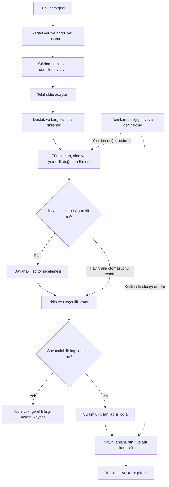
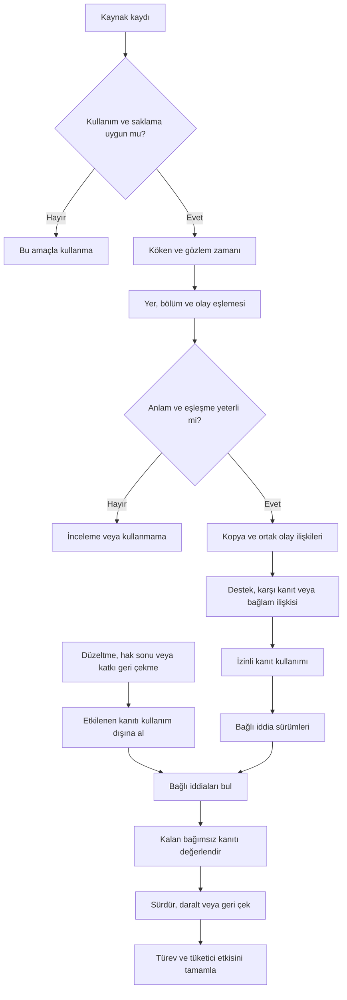
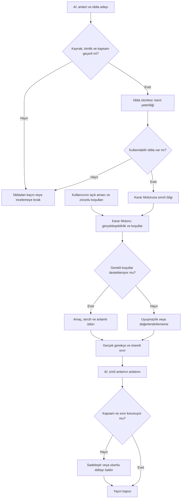
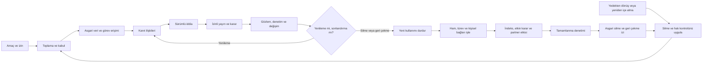
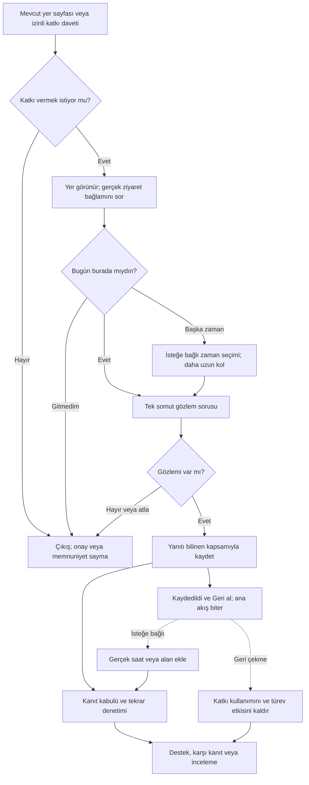
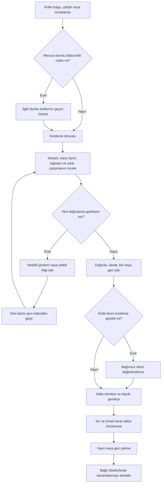
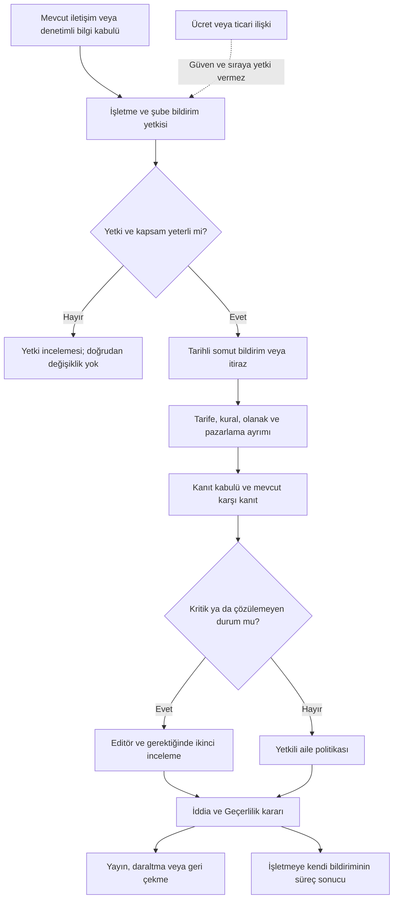
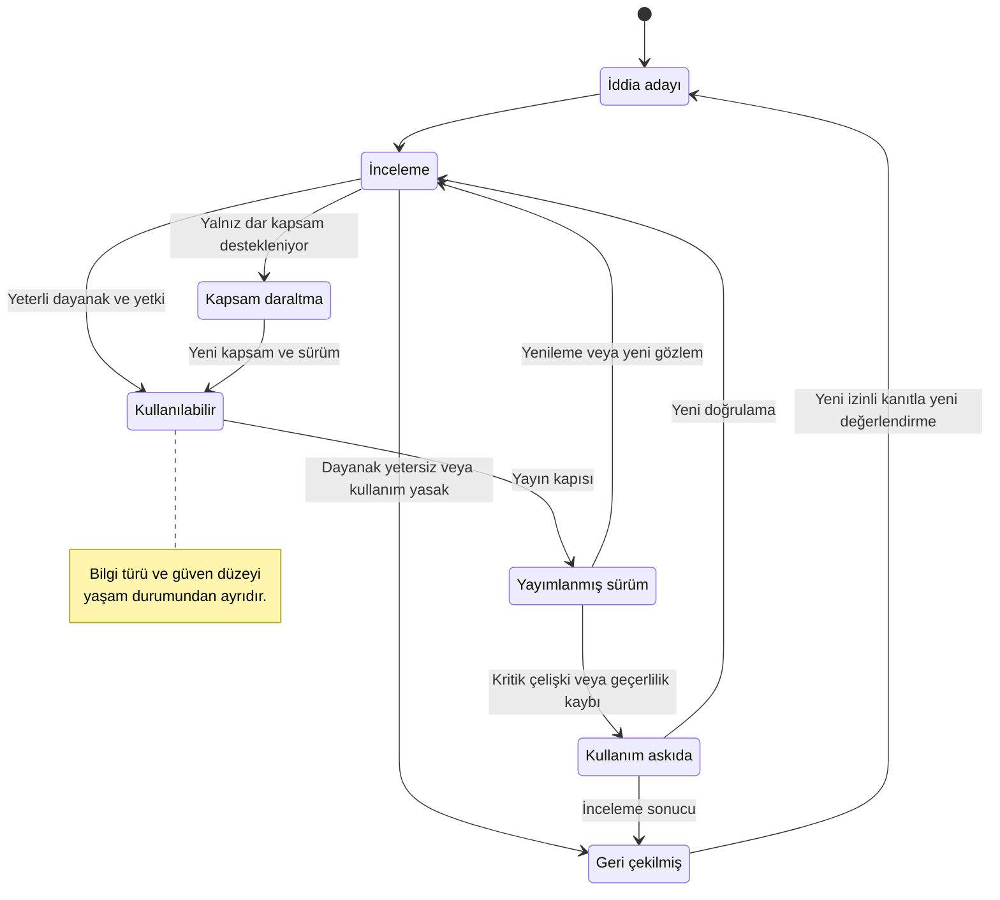
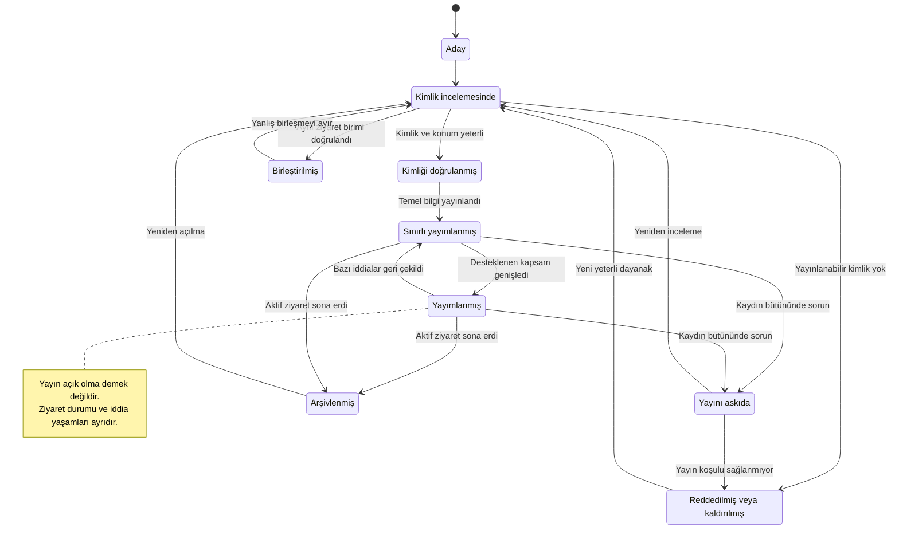

# Şamandıra — AI Bilgi Motoru

> İnsanlara en iyi yeri göstermeye çalışmaz. Kendileri için doğru olan yeri en kısa yoldan bulmalarını sağlar.

**Seçilen ürün mimarisi: Kanıta bağlı, bağlamı sınırlandırılmış ve geri çekilebilir bilgi sistemi.** Sistemin temel varlığı mekân hakkında yazılmış paragraf değil; hangi koşulda söylenebildiği, neden söylenebildiği ve hangi değişiklikte artık söylenemeyeceği bilinen iddiadır.

Bilgi Motoru neyi bildiğimizi yönetir. Karar Motoru bu bilginin kullanıcının açık ihtiyacı açısından anlamını belirler. Yayın, gerekçeyi ve sınırını birlikte taşır. Kullanıcının karşılaştığı gerçek deneyim bu iddiayı yeniden sınar. Böylece ham veri bilgiye, bilgi karara, karar da zaman içinde hak edilmiş güvene dönüşebilir. Son adım otomatik bir garanti değildir.

Bu belge ürün ve bilgi mimarisidir. Kod, prompt, model, framework, fiziksel altyapı veya teknik veri şeması önermez. Örnek mekânlar, gözlemler ve senaryolar kurmacadır. Araştırma yapılmış, eşikler kalibre edilmiş veya sistem uygulanmış gibi sunulmaz. “Beş saniye” katkının tasarım hedefidir; mevcut performans sonucu değildir.

## 0. Referans uyumu ve açık gerilim kaydı

00–04 belgelerinin tamamı okunmuştur. Bu belgelerin kabul durumu kullanıcının açık beyanına dayanır; dosyalarda korunmuş tarihsel “öneri” ifadeleri bu otoriteyi azaltmaz. Beş referansın içeriği değiştirilmez. Yeni metindeki ayrıntılar, önceki kararların uygulanabilir ürün kurallarına açılımıdır; otomatik olarak kabul edilmiş yeni referans sayılmaz.

| Referans | Korunan karar | Bu belgedeki karşılığı |
|---|---|---|
| 00 §2, §5–8 | Uygunluk yükünü azalt; dürüstlük hızdan önce; gereksiz veri isteme | İddia kapsamı, susma, kısa katkı ve geri çekme |
| 01 §2, §6, §9, §12 | Tek Keşfet; ham yorum yok; ilgili belirsizlik iddianın yanında | Yeni yorum, topluluk, profil veya katkı portalı açılmaz |
| 02 §4–10, §13–15 | Somut kavramlar; iddia düzeyinde güven; tek puan yok | Bilgi nesnesi, aile bazlı kanıt ve güven kapıları |
| 03 §1, §5, §10–17 | Tek uygunluk mantığı; zorunlu koşul telafi edilemez; düzeltme türevlere yayılır | Bilgi–karar ayrımı, rota ilişkisi, katkı ve düzeltme döngüleri |
| 04 §1–2, §10–14, §22–26 | Ayrı kaynak/iddia/yayın; tek yazma otoritesi; sürümlü geçerlilik | Bilgi Motoru mevcut sorumlulukların ortak ürün adı olarak kullanılır |

### 0.1. Sessizce çözülemeyecek noktalar

| Gerilim | Çelişki riski | Açık çözüm |
|---|---|---|
| İstekte “ritim”; 01'de “tempo”; 02 §5'te tempo kaldırılmış | Yeni ritim/tempo puanı eski kararı ihlal eder | Ritim yalnız ses, yoğunluk, bekleme, hizmet ve kullanım süresinin zaman içindeki değişimini anlatır. Bağımsız alan veya skor değildir. |
| “Romantik”, “uzun oturmalık”, “çalışmaya uygun” özellikleri | 02 §5–6, romantikliği evrensel nitelik; uygunluğu kalıcı özellik yapmayı reddeder | Somut yer bilgisi çıkarılır; amaçla ilişkiyi Karar Motoru kurar. “Romantik mekân” kalıcı etiketi önerilmez. Bu etiket özellikle istenirse 02 ve 03 için açık değişiklik kararı gerekir. |
| “Mekânın güven seviyesi” | 02 §8 ve 03 §5, güveni iddiaya bağlar | Mekâna güven puanı verilmez. Adres, ses, fiyat ve erişimin ayrı güveni bulunur. Kullanıcının ürüne güveni ayrıca ölçülür. |
| Yeni Bilgi Motoru ile 03'ün bilgi hazırlama işi | İki motor aynı iddiaya veya uygunluğa hükmedebilir | 04 §23 sahipliği korunur: AI aday çıkarır; İddia ve Geçerlilik bilgi kullanımına; Karar Motoru uygunluğa hükmeder. Yeni rakip servis otoritesi kurulmaz. |
| İşletme katkısı ve rota akışları | 01 §12 dışındaki panel/portal kapsamını sessizce açabilir | İşletme mevcut iletişim ve denetimli kabul üzerinden katkı verir. Rota mevcut karar bağlamına bağlı yetenektir. Yeni sayfa ailesi yoktur. |
| Kullanıcı hiçbir zaman ham yorum görmeyecek | Şeffaflık adına alıntı veya yeniden yazılmış pasaj gösterilebilir | Ham yorum son kullanıcıya, işletmeye ve kamusal/partner çıktıya hiç çıkmaz. Yetkili editörün görev gereği sınırlı iç incelemesi 04'teki ayrı admin erişimidir; kamusal yorum özelliği değildir. |
| Kaynak görünmezliği ile atıf | Gerekli atıfların silinmesi veya yorum yayını şartı | Gerekli atıf korunur. Ham yorum gösterimini zorunlu tutan kaynak, o kullanım için kabul edilmez. Belirli bir sağlayıcının sözleşmesi hakkında hüküm kurulmaz. |
| 04 sonunda planlanan “05 Kanıt, Güncellik ve Yayın Politikası” | Yeni belge planlanan politikaymış gibi kabul edilebilir | Bu dosya “05 AI Bilgi Motoru”dur; planlanan politika dosyasını oluşturulmuş veya kalibre edilmiş saymaz. O politika, buradaki aile kurallarının ölçülebilir işletim ayrıntılarını tamamlayacaktır. |

Bu sınırlar altında çözülmeden bırakılmış yeni bir ürün çelişkisi önerilmiyor. Beş saniyelik katkının yararı, otomasyon eşikleri ve sürdürülebilir maliyet ise araştırma gerektiren varsayımlardır; referans çelişkisi değildir.

## 1. AI Bilgi Motoru tam olarak nedir?

AI Bilgi Motoru; izinli kaynaklardan gelen bildirimleri doğru ziyaret birimine bağlayan, gözlemleri iddialara ayıran, destek ve karşı kanıtı değerlendiren, iddianın kapsamını ve kullanım süresini belirleyen, yalnız savunulabilir bilgiyi yayıma hazırlayan ve değiştiğinde etkisini bütün tüketicilerden kaldıran ürün yeteneğidir.

Üç soruyu birlikte yanıtlar: **Ne söyleyebiliriz? Hangi koşulda söyleyebiliriz? Ne değişirse bunu artık söyleyemeyiz?** Üçüncü soruyu cevaplamayan bir metin, tamamlanmış bilgi ürünü değildir.

Sorumlulukları 04'teki Bilgi Kabulü, Yer Kimliği, Kanıt ve Kaynak Hakları, İddia ve Geçerlilik, AI İşleme, İnceleme, Güncellik ve Düzeltme, Değerlendirme ve Yayın arasında kalır. “Bilgi Motoru” bunları anlatan üst ürün adıdır. Tek başına öneri sıralamaz, kullanıcı amacı belirlemez, rezervasyon yapmaz veya kurallarını kendi kendine değiştirmez.

Ayırt edici fikrî varlık dört parçanın birlikteliğidir: bağlamlı iddia sözlüğü, iddiayı çürütebilecek koşullar, karar için en değerli gözlemi seçen katkı politikası ve kaynak değişikliğini son kullanıcıdaki sonuca kadar taşıyan bağımlılık bilgisi. Ham metin hacmi veya akıcı özet tek başına bu varlığı oluşturmaz.

## 2. Ham veri nedir?

Henüz kabul, eşleştirme ve anlam değerlendirmesinden geçmemiş özgün girdidir. Doğru da yanlış da olabilir. Kaynaktan gelişi onu kanıt veya bilgi yapmaz.

| Ham veri ailesi | Taşıyabileceği değer | Kendiliğinden kanıtlamadığı |
|---|---|---|
| İzinli dış yorum | Zamanlı deneyim, somut olay, tercih tepkisi | Yer geneli kalite, doğruluk, bağımsızlık |
| İşletme tarife/kural bildirimi | Kapsamı ve tarihi açık işletim bilgisi | Fiilî uyum, deneyim üstünlüğü |
| Kullanıcının tek gözlemi | Belirli alanda ve anda yaşanan durum | Bütün gün, tüm mekân veya bütün ziyaretçiler |
| Editör ziyareti | Doğrudan kontrol edilmiş dar olgu | Her zaman tekrarlanan deneyim |
| Görsel veya belge | Görünen fiziksel koşul, ilan edilmiş kural | Kadraj dışı erişim, ses, kapasite veya güvenlik |
| Zamanlı dış bağlam | Hava/ulaşım ölçümü veya tahmini | Mekânın otomatik kapanması veya kesin varış |
| Ürün etkileşimi | Gösterim, niyet, ret veya katkı isteğine yanıt | Gerçek ziyaret ve memnuniyet |

Kaynak metni içindeki yönlendirme veri olarak kalır; ürün politikasına dönüşmez. Kullanım, türetme ve saklama hakkı belirlenmemiş içerik bilgi üretimine alınmaz. Ham kullanıcı/yorum verisi proje Git deposuna konulacak doküman içeriği değildir; bu belge yalnız tasarım ve kurmaca örnek içerir.

## 3. Bilgi nedir?

Bilgi, belirli bir iddia hakkında **anlamı, yer ve zaman kapsamı, dayanağı, bilgi türü, güveni ve kullanım izni yönetilmiş sonuçtur**. Yayımlanabilir bilgi bunun yayın kapısını geçmiş alt kümesidir. Bir paragraf birden fazla iddia taşıyabilir; paragrafın tamamına tek güven verilmez.

İçeride her iddianın bilgi kartı şu sorulara yanıt taşır. Bu bir teknik şema değildir.

| Bilgi kartı unsuru | Koruduğu anlam |
|---|---|
| Sabit iddia kimliği ve sürümü | Hangi hükmün hangi değişiklikten önce kullanıldığı |
| Yer, şube, bölüm, giriş ve yer dönemi | İddianın hangi gerçek ziyaret birimine ait olduğu |
| Tek önerme ve somut kavram | “Düşük müzik” ile “az insan”ın ayrılığı |
| Bilgi türü | Doğrulanmış olgu, doğrulanmamış bildirim/gözlem, çıkarım veya tahmin |
| Gözlem zamanı ve geçerlilik kapsamı | Geçmişin bugüne veya bir bölümün bütüne taşınmaması |
| Destek, karşı kanıt ve köken aileleri | Yalnız olumlu dayanak seçilmemesi |
| Çıkarım bağı ve gerekli öncüller | Sonucun hangi bilgiler olmadan savunulamayacağı |
| Güven ve gerekçesi | Sağlam, Sınırlı, Yetersiz ayrımının açıklanması |
| Bilgi durumu | Bilinen, bilinmeyen, çelişkili, eskimiş veya uygulanamaz ayrımı |
| Yayın/kullanım durumu | Aday, incelemede, kullanılabilir, askıda veya geri çekilmiş olması |
| İzinli ifade sınırı | Hangi kapsamda ne söylenebildiği |
| Çürütme/yenileme koşulu | Hangi olayın tekrar değerlendirme gerektirdiği |
| Sorumlu ve politika sürümü | Kararın kimin hangi ölçütüyle verildiği |
| Türev ve geri çekme bağları | Hangi anlatım ve etkin kararların etkilenebileceği |

“Bilgi yok” ayrı bir görünürlük kararı gerektirir: kullanıcının seçimini etkiliyorsa açıklanır; ilgisiz her boş alan ekrana taşınmaz. “Uygulanamaz” ile eksik veri ayrı tutulur.

## 4. Kanıt nedir?

Kanıt, **belirli bir iddiayı belirli kapsamda destekleme veya zayıflatma ilişkisi kurulabilen, kökeni izlenebilir girdidir**. Kanıt mutlak ispat demek değildir. Aynı fotoğraf basamağın varlığına destek olabilir; binanın bütünüyle erişilebilir olduğuna olamaz.

Kanıt üç ilişki taşıyabilir: destekliyor, çelişiyor, yalnız bağlam sağlıyor. Bir menünün tarihi fiyat güncelliğini sınırlar; menüdeki dekor fotoğrafı ses ortamına destek değildir. Bağlam sağlayan malzeme, destek sayısını şişiremez.

Bağımsızlık yalnız platform sayısı değildir. Aynı duyurunun kopyaları tek köken ailesidir. Aynı etkinliği anlatan farklı kişiler ayrı gözlemler olabilir ama farklı günlerde süreklilik kanıtı değildir. Kişi bağımsızlığı, olay bağımsızlığı ve zaman kapsamı ayrı değerlendirilir. Köken bilinmiyorsa bağımsızlık varsayılmaz.

Bir iddiayı destekleyen tek yetkili tarife, bir fiyat bildirimi için yeterli olabilir. Aynı sayıdaki deneyim anlatısı kalıcı ses örüntüsü için yetmeyebilir. Kanıt değeri iddia türüne göre belirlenir.

## 5. Yorum nedir?

Yorum; gözlem, kişisel tepki, beklenti, genelleme ve bazen duyum içeren kişinin anlatısıdır. “Müzik yüksekti, çok eğlendik” iki farklı şey söyler: algılanan müzik düzeyi ve kişinin bundan hoşlanması. İkincisi bütün kullanıcılar için fayda değildir.

Yorum, yalnız izinli iç kaynak olabilir. Alıntı, yorum özeti, yeniden yazılmış pasaj, yorumcu profili, yıldız dağılımı, “ziyaretçiler çoğunlukla…” veya “insanlar şunu dedi” biçiminde yayınlanmaz. Ham yorum gizlenip aynı paragraf başka sözcüklerle gösterilirse ürün ilkesi yine ihlal edilmiş olur.

Anlamlandırılmış bilgi; anlatıcıdan bağımsız bir önerme, izinli kapsam, gerekli belirsizlik ve gerçek karar ilişkisi taşır. Kaynağın heyecanı, övgüsü veya öfkesi ürünün sesi olamaz.

## 6. Çıkarım nedir?

Çıkarım, bir veya daha fazla dayanağın açık bir anlam kuralıyla ilişkilendirilmesinden doğan sonuçtur. Kanıttan daha geniş iddia kurma izni değildir. Yer hakkında çıkarım ile kullanıcıya uygunluk çıkarımı ayrı yetkilere aittir.

Örneğin bağımsız, bağlamlı gözlemler iç salonda hafta içi gündüz konuşmayı zorlaştırmayan müziği destekliyorsa Bilgi Motoru o kapsamda ses örüntüsü hazırlayabilir. Bir saat sohbet için uygunluk ise kalış kuralı, kullanılabilirlik ve kullanıcının zorunlu sınırlarıyla birlikte Karar Motorunun değerlendirmesidir.

Bir çıkarım Sağlam olabilir ama doğrulanmış olguya dönüşmez. Tahmin gelecekteki duruma uzanır; ayrıca zaman ufku ve geçerlilik sınırı ister. AI'ın kendi anlatısını tekrar okuması yeni çıkarıma dış kanıt sağlayamaz.

## 7. AI hangi bilgileri çıkarabilir?

Aşağıdakiler önce adaydır; politika ve yayın denetimi olmadan gerçek veya kullanıcı çıktısı sayılmaz.

| Aile | Üretilebilecek aday | Asgari anlam gereği |
|---|---|---|
| Kimlik | Olası şube eşleşmesi, mükerrerlik işareti | Kalıcı birleştirme insan/kimlik otoritesinde |
| Olanak ve fiziksel ortam | Belirli bölümde masa, gölge, açık/kapalı alan | Görülen ile varsayılanın ayrılması |
| Ses | Kaynak, konuşmaya etkisi, zaman/alan örüntüsü | Düşük müzik ile genel sessizliğin ayrılması |
| Yoğunluk | Yer bulma, sıkışıklık ve kullanım örüntüsü | Olay zamanı ve özel etkinlik ayrımı |
| Kullanım kuralı | Çalışmaya izin, kalış sınırı, rezervasyon gereği | Kuralı söylemeye yetkili kaynak ve geçerlilik |
| Zaman ihtiyacı | Bekleme, hizmet ve ziyaret süresi için ayrı aralıklar | Faaliyet, kapsam ve temsil yeterliliği |
| Maliyet | Tarihli tarifeden kapsamı açık tutar/bildirim | Para birimi, kişi/ürün, ek ücret ve tarih |
| Ziyaret durumu | Program, tarihli bakım veya kapanma bildirimi | Fiilî açık olma ile program ayrımı |
| Belirsizlik | Yanlış şube, eksik saat, çelişki, eskime işareti | Somut gerekçe; yokluğu yanlışlık diye yorumlamama |
| Karar yardımı | Kullanılabilir bilgilerin anlamı ve alternatif farkının anlatımı | Karar Motorunun gerçek sonucunu aşmama |

Risk çıkarımı somut ziyaret koşuluyla sınırlıdır: son girişe yetişememe olasılığı, bilinmeyen erişim, yağışa bağlı kullanılabilirlik veya güncel fiyat eksikliği. “Tehlikeli işletme” veya ziyaretçi grubuna dayanan genel güvenlik sınıfı üretilemez.

## 8. AI hangi bilgileri asla çıkaramaz?

Buradaki “asla”, sistemin bu çıktıları üretmeye yetkili olmaması anlamındadır; hatalı aday oluşamayacağı iddiası değildir. Denetim bunları engellemelidir.

- Kaynakta bulunmayan gerçek yer, şube, koordinat, fiyat, çalışma saati veya rezervasyon sonucu.
- Yorumcu veya ziyaretçiden hassas kimlik, gelir, sosyal sınıf, sağlık durumu ya da ilişki türü.
- “Kaliteli müşteri”, “istenmeyen kitle” gibi insan sınıflandırmaları.
- Şikâyet yokluğundan güvenlik, hijyen veya alerjen güvencesi.
- Aynı ad veya marka nedeniyle şubeler arasında otomatik deneyim aktarımı.
- Fotoğraftan görünmeyen erişim zinciri, ses, olağan kalabalık veya çalışan davranışı.
- Beğeni, ücret, popülerlik veya ticari ilişkiden herkes için üstünlük.
- Kullanıcının sessizliğinden onay, yol tarifinden ziyaret, ziyaretten memnuniyet.
- Söylenmeyen zorunlu koşul, gizli kişilik veya grup üyelerinin varsayılan ihtiyaçları.
- Başka bir yerin veya şehrin örüntüsüyle bu yerin veri boşluğunu dolduran olgu.

Hassas bir koşula ilişkin kullanıcının açık talebi anlaşılabilir; bu talepten kişiye teşhis veya kalıcı kimlik çıkarılmaz. Somut bir resmî kısıtlama uygun kapsamda aktarılabilir; AI kendisi suçlama veya uzmanlık kararı üretmez.

## 9. AI hangi bilgileri kesin ifade edemez?

Gelecekteki yoğunluk, boş masa, hizmet hızı, varışta açıklık, memnuniyet, romantik deneyim ve kesintisiz çalışma garantisi kesin söylenemez. Doğrulanmış bir olgu dahi yalnız kontrol edilen tarih ve kapsamı taşır.

| Riskli ifade | İzinli ifade mantığı |
|---|---|
| “Şu an sessiz.” | Canlı dayanak yoksa “Şu anki ses durumunu bilmiyoruz”; geçmiş örüntü ayrıca |
| “Bütçene kesin uyar.” | Kapsamlı güncel maliyet ve zorunlu üst sınır değerlendirmesi varsa sınırlı sonuç |
| “Herkes rahatça erişebilir.” | Kontrol edilmiş giriş, yol ve kullanılacak alanı ayrı anlat |
| “İki saat sorunsuz çalışırsın.” | Çalışma izni, kalış, gereken olanaklar ve saat için desteklenen koşulları anlat |
| “Burası güvenli.” | İlgili güncel, somut ziyaret kısıtını veya doğrulanamayan koşulu anlat |
| “Romantik bir akşam garanti.” | Kullanıcının aradığı somut ortamı ve önemli ödününü açıkla |

“Olabilir” eklemek kanıt eksiğini kapatmaz. Dar bir bilginin yayını mümkünse daraltılır; hiçbir savunulabilir kapsam yoksa iddia verilmez.

## 10. Bir yorumdan bilgi üretme süreci nasıl işler?

Kurmaca iç girdi: “Salı öğlen içeride müzik azdı, iki saat oturduk; teras çok doluydu. Çok romantikti.” Bu yalnız tasarım örneğidir; ürün ekranında gösterilecek metin değildir.

1. Kullanım hakkı ve saklama amacı kontrol edilir. Gereksiz kişisel ayrıntılar ayrılır.
2. Hangi yer/şube olduğu ve gerçek ziyaret tarihi belirlenir. Yorumun gönderildiği salı, ziyaretin salısı varsayılmaz.
3. “İç salon / düşük müzik”, “tek ziyarette iki saat kalış”, “teras / o anda doluluk” ayrı gözlemlere ayrılır.
4. “Romantikti” kişisel değerlendirme olarak tutulur veya gereksizse elenir; ortam özelliğine otomatik çevrilmez.
5. İki saat oturulması, genel kalış sınırı yoktur hükmüne çevrilmez. Bir kez izin verilmiş olabilir.
6. Kopya ve ortak olay ilişkileri kontrol edilir. Bu metnin başka platformdaki hali ek bağımsız kanıt olmaz.
7. Mevcut aynı kapsamlı ve karşıt gözlemlerle karşılaştırılır. Tek gözlem kalıcı karakter oluşturmaz.
8. Yeterli başka dayanak varsa dar ses örüntüsü adayına bağlanır; yoksa gözlem iç kanıt olarak kalır.
9. İddia ve Geçerlilik güveni, kapsamı, kullanım sonunu ve çürütme tetiklerini belirler. Gerekirse editör inceler.
10. Yayın yalnız onaylı anlamı çıkarır. Karar Motoru gerektiğinde bunu amaç ve zorunlu koşullarla ilişkilendirir.
11. Sonradan yanlış şube olduğu anlaşılırsa bu katkıya dayanan iddialar, metinler ve etkin sonuçlar yeniden değerlendirilir.

Yeterli dayanakla üretilebilecek dar anlatım: “Hafta içi öğlen iç salonda müzik düşük düzeyde; terasın yer bulma koşulları için aynı değerlendirmeyi yapamıyoruz.” “Uzun oturmalık romantik yer” sonucuna atlanmaz. Bilginin değerini artıran, kaç sıfat üretildiği değil hangi yanlış genellemenin önlendiğidir.

## 11. Bir mekânın karakteri nasıl oluşur?

Karakter; somut bilgilerin **zaman, bölüm ve kullanım biçimine bağlı, kanıtlanmış farklarının kısa anlatımıdır**. Yeni bir temel kavram, kişilik veya kalıcı kalite profili değildir. Fiziksel ortam, ses, yoğunluk, kullanım koşulları ve zaman ihtiyacı Product Language anlamlarıyla korunur.

Üç katman vardır: görece kalıcı fiziksel koşullar; gün/saat/mevsime bağlı örüntüler; güncel istisna ve değişiklikler. Güncel istisna önceki örüntüyü geçici olarak kullanılamaz yapabilir. Yeni işletmeci veya tadilat deneyim açısından yeni bir dönem açabilir.

Karakter anlatımı yalnız karar açısından ayırt edici farkları seçer: “İç salon gündüz konuşmaya elveren düşük müzik sunuyor; akşam programında müzik belirginleşiyor. Terasın yoğunluk örüntüsü farklı.” Her parça ayrı dayanağa bağlıdır. Bilinmeyen akşam bilgisi sırf metni tamamlamak için eklenmez.

Bölümler arasında fark desteklenmiyorsa bölünme üretilmez. Sadece iki salı gözlemi varsa bütün hafta içi genellemesi otomatik yapılmaz; kapsanan günlerin temsil ediciliği ayrıca değerlendirilir. Yer karakteri şehir veya ziyaretçi topluluğunun karakterine genişletilmez.

## 12. Sessiz, kalabalık, uzun oturmalık, romantik ve çalışmaya uygun nasıl oluşur?

| Kullanıcı sözü | Bilgi Motorunun somut ayrımı | Karar Motorunun işi | Yasak kısa yol |
|---|---|---|---|
| Sessiz | Ses kaynağı ve konuşma/odaklanmaya etkisi; saat ve alan | Kullanıcının düşük ses ihtiyacına bağlamak | Az insan veya düşük müzikten tam sessizlik çıkarmak |
| Kalabalık | Oturma yeri bulma, hareket sıkışıklığı, alan paylaşımı | Canlılık isteğiyle veya kişisel alan tercihiyle ilişkilendirmek | Yorum hacmi veya ünü yoğunluk saymak |
| Uzun oturmalık | Kalış kuralı, oturma olanağı, süreye bağlı kullanım, yoğunluk | İstenen süre ve faaliyet için değerlendirmek | Birinin uzun kalmasını genel izin saymak |
| Romantik | Kullanıcının kastı varsa loş ışık, masa aralığı, ses gibi karşılıklar | Bu akşam istenen somut ortamla eşleştirmek | Çift görülmesinden romantiklik veya ilişki tipi çıkarmak |
| Çalışmaya uygun | Bilgisayar kullanım kuralı, süre, masa, gereken priz/bağlantı, ses | Kullanıcının gerçek çalışma gereksinimlerini birlikte değerlendirmek | Prizden çalışma uygunluğu; bağlantı varlığından kesintisizlik çıkarmak |

“Çalışmak” her kullanıcı için çevrimiçi toplantı değildir. İnternet gerekmeyen bir çalışmaya bilinmeyen bağlantı otomatik engel olmaz; kullanıcının gereksinimi anlaşılır. Buna karşılık bağlantı zorunluysa iyi masa veya ses koşulu bu eksiği telafi edemez.

“Sessiz” düşük ses talebi olarak zaten anlaşılmışsa yeni soru sorulmaz. “Sakin” ifadesindeki az insan/az ses ayrımı sonuçları değiştirecekse kısa netleştirme yapılır. Bilgi Motoru kullanıcının zevkine göre ses olgusunu değiştirmez.

## 13. Çelişkili bilgiler nasıl yönetilir?

Önce çelişkinin türü bulunur; sonra yayın kararı verilir. Çelişkileri tek ortalamaya çevirmek veya yalnız son kaydı doğru saymak yasaktır.

| Tür | Örnek | İşlem |
|---|---|---|
| Kimlik farkı | Aynı adlı farklı şube | Birleştirmeyi durdur; ilgili kanıtı ayır |
| Alan farkı | Teras sessiz, iç salon yüksek müzikli | Alan bazında iki iddia; bütüne genelleme yok |
| Zaman/olay farkı | Gündüz düşük, etkinlik akşamı yüksek ses | Desteklenen zaman ve etkinlik kapsamlarını ayır |
| Gerçek değişiklik | Yeni bilgisayar kullanımı kuralı | Eski ve yeni geçerlilik dönemlerini ayır |
| Kavram farkı | “Sakin” denmiş ama yalnız az kişi kastediliyor | Ses sonucunu kaldır; anlam yeterliyse yoğunluk gözlemi |
| Algısal fark | Aynı koşulda sesin etkisi farklı yaşanmış | Varyasyonu koru; kişileri yanlış sayma; genişliği sınırla |
| Çözülemeyen maddi çelişki | Aynı giriş için hem basamak var hem yok | Olumlu erişim güvencesini askıya al; hedefli inceleme |

Yeni bir karşı gözlem eski bilgiyi otomatik yanlış yapmaz; ama mevcut güvenin sürdürülmesi için yeniden değerlendirme gerektirir. Birden çok tutarlı kaynağa karşı tek somut ve güncel kritik bulgu, çoğunluğun olumlu güvencesini durdurabilir. İsimsiz ve ayrıntısız bir suçlama ise otomatik yer kapatma aracı olamaz.

Çözüm kaydı; hangi ayrımın kanıtlandığını, hangisinin yalnız hipotez kaldığını ve hangi iddianın ne kapsamda kullanılacağını belirtir. “Belki özel etkinlikti” kanıtsızsa çelişki çözülmüş sayılmaz. Editörün görevi çoğunluğu seçmek değil bu belirsizliği daraltmaktır.

## 14. Az veri varsa ne yapılır?

Az veri düşük kalite demek değildir. Önce azlığın **bu iddia için** sorun olup olmadığı belirlenir. Bir güncel yetkili saat duyurusu ilan edilmiş programı destekleyebilir; tek ziyaret genel yoğunluk örüntüsünü desteklemez.

Kimliği ve temel bilgileri yeterli yer bulunabilir. Somut dayanaklar belirli amacı karşılıyorsa deneyim anlatısı zayıf diye öneriden çıkarılmaz. Ana amacın gerekli bilgisi eksikse geniş uygunluk üretilmez; kritik zorunlu koşul bilinmiyorsa doğrulanmış eşleşmelere girmez.

Yeni veri önceliği; hangi eksik gözlemin savunulabilir bir karar açacağına göre belirlenir. Az kapsanan yer ve zaman dilimlerine ayrıca araştırma kapasitesi ayrılır. Aynı markanın diğer şubesi veya komşu ilçenin örüntüsü doldurma malzemesi değildir.

## 15. Hiç veri yoksa ne yapılır?

Hangi düzeyde veri olmadığı ayrılır. Yer kimliği dahi bilinmiyorsa kamusal kayıt üretilmez. Kimlik var, belirli iddia yoksa yalnız o iddia bilinmez. Şehir kaydı var, karar kapsamı yoksa bütün şehir kapsanmış gibi gösterilmez.

“Burada uygun yer yok” yerine “Bu koşullarda yeterince bildiğimiz bir yer bulamadık” denir. Kapsam yokluğu, koşullara eşleşme yokluğu ve geçici veri hatası ayrı kalır. Yer ekleme bildirimi kabul edilebilir; bildirim otomatik yayın değildir. Kullanıcının bütçesi veya coğrafyası sonuç üretmek için sessizce değiştirilmez.

## 16. Eski bilgiler nasıl yaşlandırılır?

Yaşlandırma, bilginin güveninden her gün rastgele puan düşmek değildir. **İddianın kullanılmak istendiği an ile gerçekten gözlendiği dönem arasındaki uyumun yeniden değerlendirilmesidir.** Yeniden işleme, aynı metni başka kaynaktan alma veya editörün metni düzeltmesi gözlemi yenilemez.

Dört saat korunur: olayın/gözlemin zamanı, bildirimin zamanı, son gerçek doğrulama zamanı ve iddianın geçerli olduğu aralık. Bunlara sıradaki kontrol sorumluluğu eklenir; kontrol takvimi geçerlilik kanıtı değildir.

| Bilgi ailesi | Yaşlandırma mantığı | Süre dolmadan değerlendirmeyi tetikleyen olay | Geçerlilik kaybında çıktı |
|---|---|---|---|
| Anlık doluluk/açıklık | Kaynağın açık canlılık penceresiyle sınırlı | Güncelleme kesintisi veya ters güncel bildirim | Canlı iddia durur; varsa program ayrı kalır |
| Fiyat/menü | İlanın geçerliliği ve ölçülen değişim hızı | Yeni tarife, ek ücret veya kapsam değişikliği | Güncel bütçe eşleşmesine dayanak olamaz |
| Saat/kalış/çalışma kuralı | Dönem ve özel gün istisnaları | İşletme duyurusu, fiilî çelişki, işletmeci değişimi | Kural doğrulanamıyor; yeni olumlu kullanım sözü verilmez |
| Ses/yoğunluk örüntüsü | Aynı mevsim, bölüm, gün ve işletim dönemi | Etkinlik, kullanım değişimi, bağlamlı ters gözlem | Etkilenen kapsam daralır; geçmiş örüntü canlı kalmaz |
| Fiziksel erişim | İlgili güzergâhın sürekliliği | Tadilat, taşınma, giriş/asansör arızası | Etkilenen erişim zinciri yeniden kontrol edilir |
| Kimlik/coğrafya | Görece kalıcı ama değişebilir | Şube/adres/sınır düzeltmesi | İlgili eşleme ve türevler yeniden kurulur |

Her aile için kaynak türü, iddia genişliği, yanlışlığın etkisi ve gözlenen değişim sıklığına dayanan yenileme politikası gerekir. Bu belgede “30 gün sonra eskir” gibi temelsiz ortak süre konmaz. Süreyi ölçebilecek bilgi yoksa otomatik güncellik vaadi verilmez; tarihli dar bildirim ve seçici doğrulamayla başlanır.

Mevsim yeniden geldi diye geçen yılın örüntüsü kendiliğinden güncel olmaz. Karşı kanıt gelmemesi de değişmediğinin kanıtı değildir. Tarihsel bilgi içeride değişimi anlamaya yardım edebilir; güncel kararın gerekli dayanağı yerine geçemez.

## 17. Bilginin güven seviyesi nasıl hesaplanır?

Hesaplama, açıklanabilir bir **yeterlilik kararıdır**; keyfî ağırlıklı yüzde değildir. 02 §8 ve 03 §5'teki Sağlam, Sınırlı, Yetersiz düzeyleri korunur. Bilgi türü, güncellik durumu ve yayın durumu bunlardan ayrı tutulur.

### 17.1. Telafi edilemeyen kapılar

1. Kaynağın bu amaçla kullanımı izinli mi? Değilse güven yüksek görünse bile kullanım yoktur.
2. Doğru ziyaret birimi ve iddianın anlamı yeterince açık mı? Değilse eşleştirme/anlam incelemesi gerekir.
3. Kanıt doğrudan ilgili önermeyi destekliyor mu ve kaynak o konuyu bilebilir mi? Pazarlama övgüsü fiziksel koşul kanıtına dönüşmez.
4. Zaman ve alan kapsamı istenen iddiayı karşılıyor mu? Karşılamıyorsa dar iddia ayrı değerlendirilir.
5. Köken bağımlılığı ve tekrarlar ayrıldı mı? Ayrılamıyorsa çokluk güven artışı sağlamaz.
6. İddia ailesinin gerektirdiği temsil var mı? Tek somut tarife ile deneyim örüntüsünün gereksinimi farklıdır.
7. Önemli karşı kanıt çözüldü mü? Çözülmediyse gerekli öncül olumlu geçmez.
8. Kullanımın hata etkisi için gereken inceleme tamamlandı mı? Kritik olumlu güvence inceleme beklerken açılmaz.

Bunların ortalaması alınmaz. Doğru adres, yanlış erişim eşlemesini telafi edemez. Kaynak hakkı kapısının kapanması “Yetersiz doğruluk” anlamına gelmeyebilir; bilgi doğru olsa da kullanılamaz. Durumların ayrılması bu nedenle gereklidir.

### 17.2. Karar tablosu

| Sonuç | Koşul | İzin |
|---|---|---|
| Sağlam | İddiaya uygun, güncel, kapsamı açık ve gerekli bağımsızlığı/temsili olan dayanak; önemli çelişki çözülmüş | Yalnız kendi bilgi türü ve kapsamıyla kullanılabilir |
| Sınırlı | Anlamlı dayanak var, fakat temsil/kapsam/güncellik sınırı sürüyor | Dar ve sınırı görünür anlatım; kritik zorunlu koşulu doğrulanmış geçirmeye yetmez |
| Yetersiz | Gerekli dayanak yok veya temel belirsizlik çözülemiyor | Olumlu iddia yok; önemliyse eksiklik anlatılır |

Dar kapsam için yeni bir Sağlam iddia oluşturmak, geniş iddianın güvenini yükseltmek değildir. “Salı öğlen salon” ile “hafta içi mekân” farklı kapsamdır. Örüntünün olguya, bildirimin doğrulamaya dönüşmesi salt güven artışıyla yapılamaz.

### 17.3. Birleşik sonuç ve ölçüm

Birleşik sonucun taşıyıcı öncülleri açıkça belirtilir. Sonuç, gerekli öncüllerden birindeki belirsizliği başka avantajla örtemez. Ancak ilgisiz bir olanağın bilinmemesi bütün yerin bilgisini düşürmez. Bu nedenle hem genel ortalama güven hem bütün alanların en düşük güvenini yere yapıştırmak reddedilir.

Sayısal izleme kullanılırsa amacı yayın eşiğini değerlendirmektir. Örneğin “Sağlam” denen iddiaların bağımsız kontrolde desteklenmeme oranı, kapsam taşması, hatalı olumlu koşul ve gereksiz susma ayrı sayılır. Payda kontrol edilmiş iddialardır; bütün yerler veya yorumlar değildir. Örnek seçiminin yanlılığı ve belirsizlik aralığı raporlanır. Küçük örnekten güvenilir yüzde üretilmez.

Kalibrasyon aile × şehir × zaman × bilgi türü × risk bakımından yapılır. Rastgele içerik bölmek yerine aynı kaynak ailesinin ve aynı olayın değerlendirme taraflarına sızması önlenir; mümkün olduğunda sonraki dönemde bağımsız gözlemle sınanır. Kullanıcı katkıları tek doğrulama gerçeği değildir. Eşikler ve otomatik yayın yetkisi bilgi kalitesi ve değerlendirme sorumlularının kayıtlı kararıyla açılır.

## 18. Bilgi hangi durumda yayından kaldırılır?

Yayından kaldırma, önce ilgili iddianın **kullanımının durdurulmasıdır**; her seferinde mekânı veya kaynak kaydını silmek değildir.

| Tetik | Kapsam | İşlem |
|---|---|---|
| Yanlış şube/bölüm eşlemesi | İlgili kimliğe dayanan bütün iddialar | Bağları askıya al; doğru yere yeniden eşleştir |
| Kritik somut karşı kanıt | İlgili olumlu güvence ve bağımlı sonuçlar | Önce kullanım dışına al, sonra incele |
| Geçerlilik bitimi | O zamanlı iddia | Canlı/güncel anlatımı kaldır |
| Kaynağın geri çekilmesi veya kullanım sonu | O kaynağa dayanan türevler | Kalan bağımsız kanıtı yeniden değerlendir; yetersizse kaldır |
| Katkı düzeltme/silme | Katkı ve bağlı türev/kişisel ilişkiler | Silme kapsamına göre temizle ve yeniden değerlendir |
| Kanıtlanmış anlam/çıkarım hatası | Etkilenen iddia ve aynı hatalı politika kapsamı | Tek metin düzeltmesiyle yetinme; benzer etkileri ara |
| Gerçek yer değişikliği | Etkilenen dönem, alan veya kurallar | Yeni dönem aç; eski deneyimi taşımadan incele |
| Yayın metni kapsamı aşıyor | Hatalı anlatım; gerekiyorsa karar | Sade doğru anlatıma dön veya sonucu durdur |

Kritik geri çekme genel indeks yenilenmesini beklemez. Yetkili geçerlilik kontrolüne erişilemiyorsa ilgili olumlu karar verilmez. Kontrol edilmiş başka bilgiler gösterilebilir. Yeni olumlu iddia aynı acil yoldan denetimsiz açılamaz.

Silinen dayanak olmadan bağımsız yeterli kanıtla savunulabilen bir iddia yeni sürümle sürebilir; bu, silinen içeriği başka yerde saklama bahanesi değildir. Silme kararının kapsamı türev kullanımı da yasaklıyorsa ona uyulur. Eski çıktıyı yeniden işleyip silinmiş kanıtı diriltmek yasaktır.

## 19. AI hangi bilgileri mutlaka insana bırakmalıdır?

İnsana bırakılan iş “AI'ın bilmediğini editör tahmin etsin” değildir. İnsan da yeterli kanıt olmadan güvence veremez.

- Belirsiz kalıcı yer birleştirme/ayırma, taşınma ve kimlik sürekliliği kararları.
- Çözülemeyen kritik erişim, kullanım ve ziyaret durumu çelişkileri.
- Geniş erişim güvencesinin kontrol kapsamı ve gerektiğinde bağımsız ikinci doğrulama.
- Şiddet, ayrımcılık, suçlama, kişisel veri ve benzeri hassas bildirimlerin değerlendirme sınırı; gerektiğinde ilgili uzmanlık.
- Kaynak haklarının ürünün yayın sınırıyla çatıştığı durumlar.
- Ticari veya editoryal çıkar çatışması; toplu müdahale ve itiraz kararları.
- Yeni kavramın anlamı, aile bazlı kanıt politikası, otomasyon yetkisi ve hata toleransı.
- Değerlendirme sonuçlarından yeni yayın davranışına geçiş ve gerektiğinde yeteneği durdurma.

Genel sağlık, hijyen, alerjen veya güvenlik güvencesini editörün tek ziyareti de üretemez. Uzmanlık veya güncel resmî kapsam gerektiren bir konu, ürünün bilgi yetkisini aşıyorsa ilgili genel hüküm hiç kurulmaz. Kullanıcının hangi ödünden vazgeçeceği ise editöre değil kullanıcıya aittir.

## 20. Editör hangi durumlarda devreye girmelidir?

Editörün üç rolü vardır: somut gözlem toplamak, mevcut dayanağı incelemek, yayın kararının kapsamını doğrulamak. Bu roller aynı işlem gibi gösterilmez. Otomatik süreçlerin kabul edilmediği ilk ailelerde rutin yayın da insan denetiminden geçer; doğrulanmış düşük riskli ailelerde örnekleme yeterli olabilir.

| Öncelik sınıfı | Örnek | Beklerken davranış |
|---|---|---|
| Kritik olumlu iddiayı bozan bulgu | Kullanılan girişin kapandığına dair doğrudan güncel bildirim | İlgili olumlu iddia askıda; kamuya doğrulanmamış kapanma hükmü yok |
| Kimlik ve hak sorunu | Yanlış şube veya kullanımı bitmiş kaynak | Etkilenen kayıt/kanıt kullanım dışı |
| Kararı açacak önemli eksik | Süre sınırı veya erişim zincirinin tamamlanması | Yeterli olmayan koşul geçmiş sayılmaz |
| Örüntü/temsil sorunu | Aynı saatte tutarsız ses gözlemleri | Kapsam daralır veya değerlendirme verilmez |
| Rutin kalite denetimi | Yeni düşük riskli otomasyon örnekleri | Mevcut geçerli yayın sürer; bulguya göre daralır |

İnceleme dosyası tek soruyu somutlaştırır: “Şu iddiayı şu kapsamda söyleyebilir miyiz?” Destek ve karşı kanıt, tarihler, köken ilişkisi, mevcut çıktı, etkilenen kararlar ve eksik gözlem birlikte sunulur. İlk ekranda yalnız AI'ın önerdiği sonuç gösterilip editör onaya yönlendirilmez.

Kararlar: doğrula, kapsamı daralt, ayrı dönem/alan iddialarına böl, ek kanıt iste, geri çek veya iddiadan kaçın. “Editör onayladı” tek başına gerekçe değildir. Kim, hangi kanıtla, hangi politika sürümünde, ne zamana kadar ve neyin etkilenmesiyle karar verdiği kaydedilir. Kritik birleştirme, geniş erişim ve çıkar çatışmasında ikinci bağımsız inceleme korunur.

Kuyruk dolarsa sorumlusu ve bekleyen işin etkisi görünür olur; zaman aşımı otomatik onay değildir. Bekleyen kritik olumlu yetenek kapalı kalır. Acil işler rutin kapsam geliştirmesini tamamen tüketiyorsa yayın kapsamı kapasiteye göre küçültülür.

## 21. İşletme hangi bilgileri değiştirebilir?

İşletme kendi yetkili bildirimini değiştirebilir; Şamandıra'nın yayımlanmış hükmüne doğrudan yazamaz. Bildirim doğru şube ve zaman aralığına bağlanır.

Ad/iletişim/konum düzeltmesi, olağan ve özel gün saatleri, geçici kapanma, tarihli fiyat ve ek ücretler, rezervasyon/kalış/çalışma kuralları, olanakların hangi alanda ne zaman kullanılabildiği, erişimde somut değişiklik ve işletmeci/tadilat bilgisi sunabilir. Hangi tarihten itibaren geçerli olduğunu bildirebilir; kendi eski duyurusunu geri çekebilir.

Kural ve tarife, işletmenin yetkin olduğu konulardır. Güncel bildirim uygun kontrollerle bilgi olabilir. “Bilgisayar kullanımı artık yasak” gibi olumsuz ama yetkili kullanım bildirimi pazarlama lehine geciktirilmez. “Her masada priz var” ise somut kapsamı ve çelişkisi değerlendirilmeden bütün alan için doğrulanmış olgu olmaz.

Yetki kaybı veya hesap ele geçirilmesi şüphesinde o aktörün yeni bildirim yetkisi durur; geçmiş bildirimlerden etkilenmiş iddialar incelenir. Yeni işletmeci eski yetkili hesabın deneyim iddialarını miras almaz.

## 22. İşletme hangi bilgileri asla değiştiremez?

İşletme güven düzeyini, yayın politikasını, organik sıralamayı, amaç uygunluğunu, kullanıcı katkısını, editörün bağımsız gözlemini, karşı kanıtı veya bağımlılık kaydını doğrudan değiştiremez. Desteklenen olumsuz içgörüyü ücret veya talep karşılığında sildiremez. Rakip hakkındaki iddiasıyla rakibin durumunu belirleyemez.

İtiraz edebilir ve yeni kanıt sunabilir. İtiraz kabul edilirse bilgi değişir; bu işletmeye karar yetkisi verilmesi değildir. İtirazın süreci ve kendi bildiriminin durumu görülebilir; katkı sahibinin kimliği, ham kullanıcı metni ve kötüye kullanım tespit ayrıntıları açılmaz. İşletmeye yalnız incelemeyi karşılayacak somut iddia ve gerekli kapsam aktarılır; nadir zaman/olay ayrıntıları katkı sahibini açığa çıkaracaksa daha da daraltılır.

## 23. Kullanıcı katkıları nasıl çalışmalıdır?

Katkı bir değerlendirme yayını değil, **yer–zaman–alan–gözlem ilişkisine eklenen küçük bir düzeltilebilir kayıt** olmalıdır. Bir kişinin katılımı genel yer hükmüne oy vermez. Gönderim, kabul, kanıta alınma ve yayını değiştirme ayrı durumlardır.

Üyelik, konum izni, metin yazma veya fotoğraf yükleme zorunlu değildir. Kullanıcı tek dokunuşla gözlem bildirebilir, “gözlemlemedim” diyebilir, atlayabilir ve katkı istemlerini kapatabilir. Yer detayındaki mevcut düzeltme yolu her zaman kullanılabilir; yeni katkı sayfa ailesi açılmaz.

Bir katkı belirli iddiaya bağlanır; aynı ziyaretin tekrarı bağımsız kanıtı çoğaltmaz. Katkının kamusal yazarı, takipçisi, yıldızı ve beğenisi olmaz. İşletmeyle kamuya açık tartışma oluşmaz. Katkı öznel ise öznel kalır; yanlış veri sayılmaz ama somut olguyu doğrulamaz.

## 24. Kullanıcı yıldız vermeli mi?

Hayır. Yıldız aynı işaretin içine lezzet, ses, bekleme, ücret, kişisel zevk ve beklenti farkını koyar. Yüksek yıldızın bu ziyaretin amacını neden desteklediği çözülemez. Dış kaynağın yıldızı da uygunluk veya güven girdisi yapılmaz. Yıldız yerine kararı değiştiren gözlem alınır.

## 25. Kullanıcı puan vermeli mi?

Hayır; genel veya konu bazlı puan istenmez. “Sakinlik 8/10” ortak referansı olmayan öznel ölçek üretir. Bunun yerine “Konuşurken sesini yükseltmen gerekti mi?” somut deneyim sorusu sorulur.

Gerçek nicelik puan değildir: “Bekleme yaklaşık ne kadardı?” yanıtındaki süre aralığı gözlemdir. Aralıkların anlamı sabit olmalı, hangi bekleme olduğu belirtilmeli ve kullanıcı bilmiyorsa zorlanmamalıdır. Bu değerler mekân notuna çevrilmez.

## 26. Kullanıcı yorum yazmalı mı?

Varsayılan katkıda hayır. Boş metin kutusu, uzun anlatım ve başlık zorunluluğu yoktur. Somut hata yapılandırılmış seçeneklerle anlatılamıyorsa mevcut “Bilgi hatalı mı?” yolunda isteğe bağlı açıklama kabul edilebilir. Bu özel inceleme girdisidir; kamuya yazı yayımlama daveti değildir.

Serbest açıklamanın ham hali son kullanıcıya veya işletmeye gösterilmez. Kişiler hakkındaki gereksiz ayrıntılar kanıta taşınmaz. Kritik durum uzun açıklama gerektiriyorsa beş saniye akışına sıkıştırılmaz; ayrı isteğe bağlı düzeltme yolu açık kalır.

## 27. Farklı katkı sistemi: “Bir İz”

**Bir İz**, kullanıcının yalnız bir somut gözlem bırakıp çıkabildiği katkı etkileşimidir. Ad bir ürün önerisidir; yeni sayfa veya kavram ailesi değildir. Kullanıcıdan mekânı değerlendirmesi yerine, sistemin belirli bir iddiada bilmediği şeyi gözlemlemesine dayanan tek yanıt istenir.

Ayırt edici mekanizma yalnız tek soruluk form değildir: soru, karar açısından önemli bilgi açığına göre seçilir; mevcut olumlu iddia yanıttan önce kullanıcıya tekrar edilmez; yanıt zaman ve alanla sınırlandırılır; karşı gözlem de aynı değerde işlenir; sonraki bilgi değişikliği bu girdiye kadar izlenebilir. Katkı popülerlik biriktirmez, belirsizlik azaltır.

### 27.1. Yeni kullanıcının beş saniyelik ana akışı

Yer sayfasındaki isteğe bağlı eylem: **“Bir gözlem bırak”**. İlk açıklama tek cümledir: “Yanıtın bilgi kontrolünde kullanılacak; yorum olarak yayımlanmaz.” Bu, uzun aydınlatma metninin yerine geçmez; veri kullanım ayrıntısına isteğe bağlı bağlantı bulunur.

| An | Kullanıcı deneyimi | Sistem anlamı |
|---|---|---|
| Başlangıç | Yer adı görünür; “Bugün burada mıydın?” — Evet / Başka zaman / Gitmedim | Ziyaret varsayımı yapılmaz. Başka zaman seçimi dürüstçe daha uzun kola gider. |
| Tek gözlem | “Konuşurken sesini yükseltmen gerekti mi?” — Gerekmedi / Bazen / Gerekti / Konuşmadım | Dört seçenek olumlu/olumsuz oy değil, davranışa bağlı gözlem veya uygulanamazlık |
| Bitiş | “Kaydedildi” ve Geri al | Gönderim alınmıştır; doğrulandığı veya yayımlandığı iddia edilmez |

Ana yol iki seçimle tamamlanır. Beş saniye hedefi, açıklamanın görünmesinden kayıt geri bildirimine kadar ölçülür; yalnız ikinci dokunuş ölçülüp süre kısa gösterilmez. Okuma, yükleme ve erişilebilir kullanım dahil gerçek süre ayrıca incelenir. Yavaş kullanıcılara geri sayım veya baskı uygulanmaz.

**Bağlamın bedeli gizlenmez:** Kullanıcının planladığı saat gözlem saati değildir. Gerçek saat veya alan bilinmiyorsa iki dokunuşla saatli salon iddiası üretilemez. Bu durumda katkı “bugün, alan/saat bilinmiyor” kapsamıyla kaydolur ve dar örüntüyü doğrulamaz. İsteğe bağlı “Saati/alanı ekle” derinleştirmesi bitişten sonra bulunabilir; ana akışın zorunlu üçüncü adımı değildir. Bilgiye değer katmak için zaman uydurulmaz.

İlgili ziyaret bağlamı kullanıcı tarafından zaten açıkça doğrulanmışsa tekrar sorulmaz. Kullanıcının rotada “Buradaydım” demesi bu kapsamda kullanılabilir; yol tarifine basması veya yakın konum sinyali kullanılamaz. İlk kullanıcı yalnız tek somut olguyu biliyorsa, zaman bağımlılığı daha düşük bir gözlem seçilebilir; örneğin kullandığı girişte basamak bulunması. Bu da bütün erişim yolunu doğrulamaz.

### 27.2. Sorunun seçimi

İçeride sorular şu sırayla değerlendirilir: karar üzerindeki etki, mevcut belirsizlik veya çelişki, kullanıcının gerçekten gözlemleyebileceği şey, yanıttan sonra değişecek bilgi ve yanıt yükü. Bu öncelik, mekanik bir gizli yer puanı değildir.

“Bu yanıt olumlu da olumsuz da gelse neyi değiştirecek?” sorusuna cevap yoksa soru sorulmaz. Aynı belirsizliği tekrar tekrar ölçen veya kullanıcının bilmesini bekleyemeyeceğimiz soru elenir. Kritik erişim kontrolünün tamamı rastgele bir ziyaretçiye devredilmez.

| Bilgi açığı | Kısa soru örneği | Yanıttan üretilemeyen |
|---|---|---|
| Konuşmaya ses etkisi | Konuşurken sesini yükseltmen gerekti mi? | Tam sessizlik, desibel ölçümü |
| Oturma yeri bulma | Oturmak için bekledin mi? | Saatlik kapasite, genel popülerlik |
| Kullanılan giriş | Kullandığın girişte basamak var mıydı? | Bütün mekânda basamaksız erişim |
| Çalışma izninde olası değişim | Bilgisayar kullanımına izin verilmedi mi? | Diğer gün ve alanlara otomatik kural; soru yalnız ilgili deneyimi bilen kişiye |
| İlan edilen fiyatla fark | Ödemede belirtilmeyen zorunlu ücret çıktı mı? | İşletme hakkında dolandırıcılık hükmü |

Olumsuz veya suçlayıcı çağrışımı olan sorular önce anlaşılabilirlik ve yönlendirme bakımından sınanır. Tek bir soru biçimi bütün ailelere zorlanmaz. Fiyat/kural uyuşmazlığı gibi yanıtın kendisi ayrıntı gerektiren durum, genel hüküm yerine inceleme tetikler.

### 27.3. Beklenti farkı ve özgün değer

Kullanıcı mevcut öneri üzerinden gelmişse gösterilen iddianın sürümü içeride bilinir. Yine de “Sessizdi, değil mi?” sorulmaz. Bağımsız somut gözlem alındıktan sonra gösterilen iddia ile karşılaştırılır. Aynı gözlem hem yer bilgisini sınar hem o vaat ile deneyim arasındaki farkı ölçmeye yardım eder. Tek katkı iki bağımsız kanıt diye sayılmaz.

Şamandıra'yı kullanmadan gelen yeni ziyaretçinin katkısı da eşit kabul edilir; onda gösterim bağı yoktur. Böylece sistem yalnız kendi önerilerini onaylayan kişilerden öğrenmeye kapanmaz. Hiç gösterilmemiş yerler için gönüllü katkı ve editoryal kapsam çalışması korunur.

Katkı sayısı, seri tamamlama, liderlik tablosu, sosyal itibar veya olumlu yanıta ödül yoktur. Kullanıcı her ziyareti raporlamakla yükümlü değildir. Katkı sonrasında ürün yeni sorularla çıkışı geciktirmez.

### 27.4. Beş saniye vaadini sınama

Araştırmada yeni kullanıcılar, hesap açmadan ve konum izni vermeden akışı tamamlar. Tamamlanma süresinin ortancası yanında yavaş uçları, soru anlamını doğru açıklama, yanlış yere katkı, geri alma, atlama, erişilebilir kullanım ve verilen gözlemin kullanılabilirliği ölçülür. Toplam yanıt sayısı tek başarı değildir.

Ana akış beş saniyeyi aşarsa önce metin ve soru sayısı azaltılır; bağlam doğruluğu düşürülmez. Hızlı yanıtların çoğu kritik kapsamı taşımıyorsa o soru ailesi iki dokunuş hedefine uygun sayılmaz. Yerine daha dar bir gözlem veya açıkça daha uzun isteğe bağlı kontrol seçilir. “Beş saniyede inanılmaz değer” bir saha hipotezidir, bu tasarımla kanıtlanmış iddia değildir.

## 28. Kullanıcının vereceği en değerli bilgi nedir?

**Bir kararın dayandığı somut koşulun, gerçekten yaşanmış belirli bir bağlamda karşılığının ne olduğudur.** Özellikle güncel ve kapsamı açık bir ters gözlem, eskimiş olumlu anlatımı ortaya çıkarabilir. Ancak yalnız ters gözlemlere değer vermek de yanlılık yaratır; destekleyen ve aykırı sonuç aynı kabul ölçütüne tabidir.

“Bayıldım” yerine “Konuşmak için sesimi yükseltmem gerekti”; “kötüydü” yerine “kullandığım girişte basamak vardı” karar bilgisini değiştirebilir. Katkının değeri kullanıcının itibarı veya görüşün olumlu olması değildir. Hangi belirsizliği giderdiği, hangi yanlış genellemeyi durdurduğu ve hangi kararı savunulabilir hale getirdiğidir.

## 29. Kullanıcıyı yormadan veri nasıl toplanır?

Karar öncesinde katkı istenmez; katkı bilgiye erişim koşulu olmaz. Kullanıcı yer sayfasında kendisi başlatabilir veya izinli ve makul bir dönüş anında tek isteğe bağlı davet görebilir. Otomatik konum takibi, ısrarlı bildirim, uygulama puanı isteği veya her sayfada tekrar yoktur.

Bir katkı isteği yanıtlanmadığında tekrar sormamak varsayılandır. Yeni anlamlı bağlam yoksa aynı ziyaret için yeni davet gösterilmez. İstekleri kapatma kalıcı olarak saygı görür; katkı vermeyen kişinin karar hizmeti zayıflatılmaz. Hesapsız kullanıcıda cihazlar arası bu tercihin korunamadığı sınır dürüstçe belirtilir.

Zaten doğrulanmış yer ve gözlem kapsamı yeniden sorulmaz. Bilinmeyen zaman, giriş ve alan otomatik doldurulmaz. Gereksiz ayrıntı toplamaktansa katkı daha dar kullanımda kalır. Sorular işlevsel gözlemleri sorar; kullanıcıdan işletmenin niyetini, diğer insanların kimliğini veya tıbbi güvenliği değerlendirmesini istemez.

## 30. AI kendini zamanla nasıl geliştirir?

Üç öğrenme döngüsü ayrıdır. **Bilgi yenileme** yeni kanıtla iddiaları düzeltir. **Değerlendirme öğrenmesi** hangi çıkarım ve soru politikasının ne zaman hata yaptığını gösterir. **Kullanıcı kontrollü tercih öğrenmesi** açık izin ve bağlamla sınırlıdır; Bilgi Motoru kişisel zevk deposu olmaz.

Yeni katkı otomatik eğitim izni değildir. Sıradan bilgi güncellemesi üretim politikasını değiştirmez. Bir çıkarım veya soru yaklaşımı değişecekse aynı bağımsız örneklerde mevcut davranışla karşılaştırılır; insan uyuşmazlığı, yanlış kesinlik ve gereksiz susma birlikte ölçülür. Başarılı dar kapsamın sonucu başka şehir ve iddia ailesine otomatik taşınmaz.

İyileştirme örnekleri: “sakin” sözcüğünü ses yerine yoğunluk olarak yanlış ayırma sıklığını azaltmak; aynı olayın tekrarlarını fark etmek; gereksiz soruyu kaldırmak; güncellik kaybını daha erken bulmak. Akıcı metin, daha yüksek tıklama veya daha çok yayın bu iyileştirmelerin yerine geçmez.

Sürüm değişimi önce gölge değerlendirme ve sınırlı yayın kapsamından geçer. Kritik hata veya sistematik kapsam taşması görülen yetenek durdurulur. Önceki davranışa dönüş yeni kapanma/silme bilgilerini geri alamaz. Sistemin kendi çıktısı, onu kopyalayan site veya işletmenin o çıktıyı tekrar göndermesi yeni bağımsız doğrulama değildir.

## 31. Bilgi Motoru ile Karar Motoru ilişkisi nedir?

Bilgi Motoru **“İç salonda salı gündüz düşük müzik örüntüsünü şu kapsamda destekliyoruz”** der. Karar Motoru **“Bu bilgi, kullanıcının bir saat sohbet amacı ve açık sınırları için şu anlama geliyor”** der. Aynı bilgi canlı müzik isteyen kişide farklı karar anlamı taşıyabilir; bilginin kendisi değişmez.

Karar Motoruna ham yorum verilmez. Kullanılabilir iddia, bilgi türü, kapsam, güven sınırı, güncellik, sürüm, karşılanamayan bilgi ihtiyacı ve geri çekme durumu verilir. Uygunluk durumları 03'teki dört anlamla kalır: Uygunluğu desteklenen, Koşula bağlı, İhtiyaçla uyuşmayan, Değerlendirilemeyen.

Karar anında eksik bir iddia varsa Bilgi Motoru bunu o kullanıcıyı memnun edecek şekilde tamamlamaz. Koordinasyon mevcut yetkili bilgiyle açığı kapatabiliyorsa tamamlar; yoksa karar daralır. Toplulaştırılmış bilgi açığı araştırma önceliği sağlayabilir, fakat daha çok talep iddiayı daha doğru yapmaz. Bilgi değerlendirmesi kişisel tercihe ve ticari sisteme bağımlı olmaz.

## 32. Bilgi Motoru ile Akıllı Rota Motoru nasıl konuşur?

04 §14'teki yön korunur: API koordinasyonu, Karar Motorundan desteklenen durak adaylarını alır; Rota Motoru bunlardan deneyim dizisi kurar. Bilgi Motoru güncel yer/iddia kapsamı, ziyaret penceresi, kalış kuralı, maliyet ve durum değişikliklerini ortak yetkili bilgi olarak sağlar. Rota Motoru ham yorum yorumlamaz ve bağımsız yer uygunluğu yaratmaz.

Rota varış saatini değiştirdiğinde koordinasyon o saatteki durak uygunluğunu Karar Motoruna yeniden değerlendirtir. Karar Motoru Rota Motorunu çağırmaz. Ulaşım, bekleme, kalış ve dönüş ayrı tutulur; aynı yürüyüş iki kez sayılmaz. Yer içi erişim bilgisi duraklar arası yolun erişimini kanıtlamaz.

Bir işletmenin kapanması veya ortak alanın kullanılamaması birden fazla durağı etkileyebilir. Kanıt/iddia tarafında ortak olay bağları korunur; Rota Motoru aynı olaya bağlı iki yedeği bağımsız çözüm saymaz. Yeni veri etkin planın yapılabilirliğini bozarsa kalan bölüm yeniden değerlendirilir; tamamlanan ziyaretler yeniden yazılmaz. Bildirim yalnız izinli kanallarda ve ulaşılabilen cihazlarda yapılır.

## 33. Bilgi Motoru API'yi nasıl besler?

API gerçeği üretmez; yetkili sürümlerin anlamını taşır. Hazırlanan bilgi iki tüketim kapsamına ayrılır: karar değerlendirmesi için iç bilgi paketi ve son kullanıcı için yayın paketi. İşletme, admin ve partner erişimleri ayrıca yetkilendirilir.

| Paket | Taşınan anlam | Taşınmayan |
|---|---|---|
| İç bilgi | İddia ve yer sürümü, kapsam, tür, güven, kullanım durumu, gerekli öncüller ve geri çekme | Her isteğe bütün ham havuz veya gereksiz kullanıcı geçmişi |
| Kamusal yer bilgisi | Onaylı somut bilgi, geçerlilik, gerekli belirsizlik, yöntem/düzeltme ve atıf | Ham kanıt, iç güven puanı ve gizli analiz |
| Kamusal karar | Açık bağlam, gerçek gerekçe, ödün/engel, önemli bilinmeyen, alternatif farkı | Sonradan uydurulmuş ikna veya kişisel uygunluk yüzdesi |
| Değişiklik | Hangi iddianın hangi sürümünün kullanımdan çıktığı ve etkilenen kapsam | Kaynak geri çekmesini sıradan metin güncellemesi diye saklamak |

Boş, bilinmeyen, uygulanamaz, çelişkili, eskimiş ve hizmet hatası farklı anlamlardır. Eski bilgi geç geldiğinde yeni doğrulamayı geri alamaz. Aynı güncellemenin tekrar alınması yeni kanıt sayılmaz. Kimlik, iddia, politika ve karar bağlamı sürümleri korunur; geç gelen eski bağlam yanıtı kullanıcı düzeltmesini ezemez.

Partner kritik sınırı gösteremiyor veya geri çekmeyi uygulayamıyorsa ilgili olumlu karar yeteneği verilmez. Tarayıcıya gönderilen “gizli” alanlar kamusal sızıntıdır; ham veri frontend'e hiç ulaşmamalıdır. Önizleme, paylaşım, erişilebilirlik metni ve arama indeksi aynı yayın sınırına tabidir.

## 34. Frontend hangi bilgileri göstermelidir?

01'deki sıra korunur: hangi yer; neden seçilebilir ve seçilmemeli; nasıl bir deneyim; gitme kararını değiştiren koşullar; gitmek için gereken bilgiler; bilgi sınırları; anlamlı alternatifler. Keşfet ilk değerlendirmede üç ila beş hedefler, sayı doldurmaz. Yer detayında en çok üç anlamlı alternatif bulunur.

Her iddianın bütün iç ayrıntıları gösterilmez. Kararı değiştiren zaman/alan, olgu–çıkarım ayrımı, engel ve bilinmeyen ilgili cümlenin yanında kalır. Doğrulama tarihi yalnız kontrol edilen bilgiyi niteler. “Bir yeri nasıl anlıyoruz?” ortak yöntemi açıklar; belirli iddianın eksiği oraya havale edilmez.

“Bir İz” mevcut yer ve karar bağlamında isteğe bağlıdır. Kaydedildi, geri al ve katkı istemlerini kapatma anlaşılır olur. Bilgi eksiği, yer bulunamaması ve hizmet kesintisi farklı görünür. Kullanıcı anlaşılan ihtiyacı ve sınırlarını değiştirebilir; ret geri alınabilir. Kısaltma, çeviri ve sesli sunum karar anlamını değiştiremez.

## 35. Frontend hangi bilgileri asla göstermemelidir?

Ham yorum, alıntı, yeniden yazılmış yorum pasajı, yorumcu kimliği/profili, yorum sayısı veya yıldız dağılımıyla sosyal kanıt, duygu/konu sıklığı skoru, iç güven/uygunluk yüzdesi, teknik ağırlık, ara muhakeme, kaynak platform dökümü, şüpheye dayanan suçlama ve kanıtsız kesin sıfat gösterilmez. Gerekli atıflar bu sınırdan ayrı korunur.

“İnsanlar şunu dedi” yerine “AI böyle dedi” yazmak da yeterli değildir; cümle somut bilgi ve sınır taşımalıdır. Sağlam iç güven bir rozetle “bu mekân güvenilir” biçimine çevrilemez. Önemli engel olumlu karttan sonra yüklenen gizli ayrıntı olamaz. Çevrimdışı eski kayıt tarihli temel bilgi olarak kalabilir; yeni canlı durum veya olumlu kişisel uygunluk üretilmez.

## 36. Bu sistem neden Google Maps'ten farklıdır?

Bu belgenin farklılık iddiası rakibin mevcut özelliklerinin yokluğuna dayanmaz. 00 §3 ve 03 §19 bu sınırı zaten koyar. Burada güncel rakip özellik envanteri veya iç mimari iddiası yapılmıyor.

Şamandıra'nın ürün taahhüdü; kamuya açık yorum/puan biriktirmek yerine kullanılabilir iddia üretmek, genel yer üstünlüğü yerine belirli ziyaretin uygunluğunu açıklamak ve katkıyı anlatı yazdırmak yerine bir bilgi açığını sınayan gözleme bağlamaktır. Harita konumu taşır; kararın otoritesi olmaz. Sohbet biçiminde yanıt verebilmek ürünün kendisini sohbet botuna dönüştürmez.

“Bir İz”in savunulabilir farkı tek dokunuş değildir; **hangi belirsizliği seçtiği, yanıttan hangi iddia dışında sonuç çıkarmadığı ve hatayı bütün kararlardan nasıl geri aldığıdır**. Başka bir ürün benzer etkileşim kurabilir. Özgünlük veya kopyalanamazlık kanıtı yoktur; rekabet gücü bu disiplinin yıllarca doğru işlemesiyle sınanacaktır.

## 37. Sistem neden beş yıl sonra da sürdürülebilir olabilir?

Sürdürülebilirlik garantisi verilemez. Seçilen yapı, değişen kaynaklara ve büyüyen kapsama rağmen aynı ürün anlamını korumaya elverişlidir. Kaynaklar değişebilir; kanıt türü, iddia kapsamı, güven ve düzeltme yükümlülüğü değişmez. Yeni yer türleri mevcut somut kavramların altına eklenir; her yeni kelime ayrı puan sistemi doğurmaz.

Her sorguda bütün kaynak yeniden işlenmez. İddia hazırlanır, gerektiğinde yeniden kullanılır, değişiklik yalnız bağlı kapsamları yeniden değerlendirir. Zaman/alan kombinasyonlarının tümü üretilmez; kanıtı ve karar değeri olan ayrımlar tutulur. Hatalı eski bilgiyi sürekli yeniden üretmek yerine geri çekme birinci sınıf üründür.

Kaynak çeşitliliği, izinli birinci taraf somut katkı, seçici editör doğrulaması ve aile bazlı otomasyon birlikte kullanılır. Yalnız dış yorumlara, yalnız işletmelere veya yalnız editöre bağımlılık azaltılır; hiçbirinin tek başına kusursuz olduğu varsayılmaz. Kamuya içerik miktarı üzerinden gelir baskısı kurulmaması bilgi eşiğinin korunmasını kolaylaştırır; ticari ekip güven ve organik sıraya müdahale edemez.

Büyüme kapısı mekân sayısı değil; karar desteği verilen amaç/coğrafya/zaman kapsamı, yanlış olumlu iddia, gereksiz susma, düzeltmenin tamamlanma süresi ve karar başına insan emeğidir. İnceleme ve kaynak maliyeti taşınamıyorsa ilgili yetenek veya kapsam küçülür. Güveni koruyarak daha dar hizmet vermek, ülke çapında doğrulanmamış vaat vermekten daha sürdürülebilir seçimdir.

## 38. Bilgi yaşam döngüsü — iddiadan geri çekmeye

Bilgi yaşamı metnin yayımlanmasıyla bitmez. Her geçişte yetkili sahip, dayanak, sürüm ve tüketici etkisi belirlenir. Bilgi türü, güven ve yayın durumu birbirine karıştırılmaz; örneğin güçlü kanıtlı ama kullanım hakkı bitmiş bir iddia yayın dışı olabilir.

| Durum/geçiş | Giriş koşulu | Yetkili sorumluluk | Çıkış ve kullanıcı etkisi |
|---|---|---|---|
| İddia adayı | Kaynakta ayrıştırılabilir bir önerme | AI/insan hazırlama; aday üretimi | Kamusal değil; ilgili kanıta bağlanır |
| Anlam ve kapsam incelemesi | Yer, kavram, dönem veya alan belirsiz | Yer Kimliği ve İddia ve Geçerlilik | Belirsizlik çözülür; çözülmezse aday kullanılmaz |
| Dayanak değerlendirmesi | Destek/karşı kanıt ve kökenler ayrılmış | İddia ve Geçerlilik | Güven, bilgi türü ve kapsam kararı |
| Kullanılabilir iddia | Aile kuralları ve gerekli insan incelemesi geçmiş | İddia ve Geçerlilik | Yayın için izinli anlam; henüz her kanalda gösterilmiş değil |
| Yayımlanmış sürüm | Anlam, atıf ve kanal sınırları korunmuş | Yayın | Aynı sürümden yer anlatısı ve karar girdisi |
| Yenileme gerekli | Kontrol dönemi, yeni olay veya kapsam kayması | Güncellik ve Düzeltme | Geçerlilik sürüyorsa dar kullanım devam; bitmişse durur |
| Kapsam daraltılmış | Geniş iddianın bazı bölümleri desteklenmiyor | İddia ve Geçerlilik | Yeni kapsam yeni sürüm; geniş iddia kullanım dışı |
| Çelişki nedeniyle askıda | Çözülemeyen önemli karşı kanıt | İddia ve Geçerlilik; inceleme iş akışı | Etkilenen olumlu iddia ve bağımlı sonuçlar durur |
| Geri çekilmiş | Hata, kaynak/izin kaybı veya yetersiz kalan dayanak | İddia ve Geçerlilik ve ilgili hak/silme sahibi | Yeni kararda kullanılamaz; türev temizliği başlar |
| Yerine yeni sürüm gelmiş | Yeni kanıt veya doğrulanmış kapsam değişimi | Aynı otorite | Eski sürüm tarihsel izinli izde kalabilir; güncelmiş gibi dönmez |
| Silinmiş/arşivlenmiş | Saklama amacı bitmiş veya belirli silme kararı | Hak/izin ve işletim sahipleri | İçerik saklama sınırı uygulanır; geçmiş iz gereksiz kişisel veri tutmaz |

### 38.1. Bilgi kabulü için aile kartları

Her iddia ailesi aşağıdaki başlangıç koşuluyla ele alınır. Bunlar sayısal olarak kalibre edilmiş otomasyon eşikleri değildir; o eşiklerden önce sağlanması gereken anlam ve kanıt ölçütleridir.

| İddia ailesi | Uygun dayanak | Karşı kanıt/eksiklik kontrolü | Başlangıç yayın sınırı |
|---|---|---|---|
| Kimlik ve konum | Doğrudan kimlik/şube bağı, tutarlı konum | Aynı ad, ortak bina, eski adres | Belirsiz kalıcı birleştirme insanda; yanlış bağlı deneyim yok |
| İlan edilmiş saat/tarife/kural | Yetkili, tarihli ve kapsamlı bildirim | Özel gün, ek ücret, fiilî çelişki | Bildirim olarak anlat; fiilî açıklık veya fiyat garantisi ekleme |
| Belirli olanağın varlığı | İlgili alanı gösteren güncel gözlem/bildirim | Kullanılabilirlik ve bölüm farkı | “Var” ile ziyaret sırasında kullanılabilir ayrı |
| Ses ve yoğunluk örüntüsü | Bağlamı ve etkisi açık, bağımsızlığı değerlendirilen gözlemler | Olay kümelenmesi, saat/alan temsili, ters gözlem | Tek deneyimden genel örüntü yok; yeni ailede editör denetimi |
| Kalış ve çalışma | Yetkili kullanım kuralı; fiilî gözlem destekleri | İstisna, bölüm/saat farkı, süre sınırı | İzin ile kesintisiz kullanım ayrılır |
| Fiziksel erişim | Kullanılacak yolun kapsamlı doğrudan kontrolü | Alternatif giriş, kat, tesis, arıza ve tadilat | Geniş güvence için gerekli bağımsız ikinci kontrol; rampa tek başına yetmez |
| Zaman aralığı ve tahmin | Faaliyeti ve koşulları belli süre gözlemleri | Yanlı örnek, özel olay, ortak gecikme | Aralık ve kapsam desteklenmedikçe toplam süre sözü yok |
| Gelecek/canlı durum | Bu ufka uygun güncel kaynak ve doğrulama | Kaynak kesintisi, canlılık sonu, olağan dışı olay | Politika ve ölçüm olmadan canlı/tahmin yeteneği açılmaz |

### 38.2. Karakter üretiminde bilgi sınırı

Bir karakter anlatımının her cümlesi ayrı iddialara bağlanır. İki cümle aynı gözlemden çıkmışsa iki bağımsız dayanak sayılmaz. Metinden zorunlu bir öncül çıkarıldığında sonuç değişiyorsa bu bağ açıkça korunur. Önemsiz süs cümleleri eklenmez.

Olumlu iddia ile gerekli sınır tek yayın birimidir. “Gündüz düşük müzik” yüklenirken “akşam bilinmiyor” daha sonra geliyorsa kullanıcı aradaki sürede yanlış genişlik görebilir; bu yayın kabul edilmez. Metin çevirisi ve kısaltma da aynı bilgiyi taşır.

### 38.3. Tamamlanmış düzeltme ne demektir?

Düzeltme ancak şu sonuçlarla tamamlanır: yetkili iddia değişmiştir; eski sürüm yeni karara giremez; ilgili yer anlatısı ve arama görünümü güncellenmiştir; yeniden kullanılacak karar ve etkin rota yeniden değerlendirilmiştir; yetkili partnerlere değişiklik iletilmiş ve gerekli uygulama sonucu izlenmiştir. Kullanıcı bağlantısı yoksa anında ulaşılmış gibi kaydedilmez.

Kritik kullanım yasağı hızlı uygulanır; bağlı metinleri yeniden üretme işi sonradan tamamlanabilir. Bekleyen işler görünür tutulur. Eski içerik sağlayan tüketici saptanırsa ilgili olumlu yeteneği sınırlandırılır. “Kaynak düzeltildi” metriği, etki temizliği tamamlandı metriğinin yerine geçmez.

## 39. Kanıt yaşam döngüsü — köken, bağımsızlık ve kayıp

Kanıtın iki paralel yaşamı vardır: işlenebilirlik/izin yaşamı ve belirli iddiaya destek olma yaşamı. Bir kaynak işlemeye uygunken belirli iddiaya ilgisiz olabilir; doğruyu anlatırken kullanım hakkı sona erebilir.

| Aşama | Karar | Başarısızlık davranışı |
|---|---|---|
| Kabul öncesi | Kaynak kim, hangi amaçla kullanılabilir, ne kadar saklanabilir? | Hak belirsizse üretim dışı; gereksiz içerik biriktirme yok |
| İzlenebilir kabul | Özgün köken, zaman, düzeltme ilişkisi kayda alınır | Zaman bilinmiyorsa bilinmiyor; işleme tarihiyle doldurulmaz |
| Asgari veri | Gereksiz kişi ayrıntıları ayrılır; görev erişimi sınırlandırılır | Hassas metin kamusal veya işletme paketine sızmaz |
| Yer ve kapsam eşleme | Şube, giriş, alan, olay dönemi belirlenir | Belirsiz kanıt ilgili yerin doğrulamasına katılmaz |
| Köken/olay kümeleri | Kopya, aynı olay, bağımlı anlatı ilişkileri ayrılır | Çokluk bağımsızlık sağlamaz; belirsizlik kaydedilir |
| Destek ilişkisi | Hangi önermeyi destekliyor, zayıflatıyor veya bağlamlıyor? | İlgisiz içerik kanıt ağırlığı oluşturmaz |
| Etkin kullanım | İzinli iddia sürümlerine bağlanır | Ham veri doğrudan yayınlanmaz |
| Zayıflama veya değişim | Gözlem eskir, dönem değişir, çelişki gelir | İlgili destek yeniden değerlendirilir |
| Düzeltme/itiraz | Kaynak kendi kaydını düzeltir veya hata saptanır | Geçmiş olayın iziyle yeni düzeltme ayrılır |
| Geri çekme/silme | İzin/kaynak/katkı yaşamı sona erer | Bütün bağımlı kullanımlar bulunur; kalan kanıt yeniden değerlendirilir |
| Sonlandırma kontrolü | Silme ve türev değişimi tüketicilerde tamam mı? | Eksik işler kapatılmış sayılmaz; geri yükleme eski içeriği diriltemez |

### 39.1. Kaynak, kişi ve olay ayrımı

İki kişinin aynı masadaki gözlemi aynı olayın birden fazla bakışıdır. Farklı kişiler olması önemli olabilir ama örüntünün günler boyunca sürdüğünü göstermez. Farklı günler aynı kişinin katkısı da ayrı zaman gözlemleridir; bağımsız kişi çeşitliliği değildir. Bütün ilişkileri tek “benzersiz kullanıcı” sayısına indirmek reddedilir.

Köken ailesi hakkında kesin bilgi yoksa mutlak sahtelik hükmü verilmez. Şüpheli tekrarın ilave kanıt etkisi sınırlandırılır; önemli ters bulgu ayrıca incelenir. Anonim kullanıcıya kalıcı genel itibar puanı verilmez. Daha önce doğru katkı yapmış olması bugünkü gözlemini tartışmasız yapmaz; çoğunluğa aykırılık da güvenilmezlik değildir.

### 39.2. Kanıtın kaybı halinde üç olasılık

Bir ses çıkarımı üç bağımsız dayanak grubuyla destekleniyorken biri geri çekilsin. Kalan gruplar aynı kapsamı hâlâ yeterince destekliyorsa yeni dayanak setiyle yeni sürüm üretilebilir. Yalnız dar gündüz kapsamını destekliyorsa iddia daralır. Gerekli örüntü artık savunulamıyorsa çıkarım kaldırılır. Üçten ikiye düşmenin sonucu otomatik değildir; nicelik yerine kapsam ve yeterlilik değerlendirilir.

Ham içerik saklama sonuna ulaşmışsa sırf “özet var” diye sonsuza kadar doğrulanabilirlik varsayılmaz. Kaynak koşulları izin veriyorsa yeterli, kişisel veri içermeyen yapılandırılmış kanıt kaydıyla denetim sürdürülebilir. Bu kayıt iddiayı yeniden değerlendirmeye yetmiyorsa veya türetme hakkı bitmişse ilgili kullanım sona erer.

### 39.3. Kanıtın kendini çoğaltmasını önleme

Şamandıra metni, bunu kopyalayan işletme açıklaması ve o açıklamayı taşıyan başka site aynı türev zincirdir. Yeni kaynak adı zinciri bağımsız yapmaz. Kökeni belirlenemeyen dış AI özeti doğrulanmış olguya dönüştürülmez. Denetim, özgün gözleme geri dönülemeyen içeriğin güveni yapay yükseltmesini izler.

## 40. Güven yaşam döngüsü — kanıt yeterliliği ve kullanıcı güveni

**İddia güveni** belirli kapsamda savunulabilirliktir. **Ürüne duyulan güven** kullanıcının beklentiyle deneyimi karşılaştırarak geliştirdiği ilişkidir. İkincisi AI'ın hesapladığı mekân rozeti değildir.

| İddia güveni geçişi | Geçerli gerekçe | Geçersiz gerekçe |
|---|---|---|
| Yetersiz → Sınırlı | Anlamlı doğrudan dayanak geldi; kapsam hâlâ dar/eksik | Aynı kaydın çok kopyası geldi |
| Sınırlı → Sağlam | Gerekli kapsam, temsil ve çelişki çözümü tamamlandı | Metin daha ikna edici yazıldı |
| Sağlam → Sınırlı | Destek artık yalnız daha dar kullanımda yeterli | Mekân daha az tıklandı |
| Sağlam/Sınırlı → Yetersiz | Gerekli dayanak kaybedildi veya kritik sorun çözülemedi | İşletme ödeme yapmadı |
| Her düzey → kullanım askıda | Hak kaybı, kritik geçerlilik veya inceleme sorunu | Kullanım askıda olduğu için mutlaka yanlış denmesi |
| Askıdan dönüş | Yeni doğrulama ve güncel politika kapısı | Bekleme süresi doldu; otomatik affetme |

Her yükselme dayanaklı yeni karardır. Güveni eski düzeye döndürmek için eski iddiayı kopyalamak yeterli değildir. Aykırı gözlem ele alınmadan “Sağlam” korunamaz. Öte yandan tek belirsiz saldırı her iddiayı sürekli askıya düşürmemelidir; somutluk, ilişki ve hata etkisi değerlendirilir.

Kullanıcı güveninin yaşamı: gerekçeyi anlama → bilinen sınırlarla seçim → deneyim karşılığı → gerekiyorsa kolay düzeltme → hatanın etkisinin giderildiğini görme. Ürün hatayı gizlediğinde kısa vadeli seçim artabilir ama bu yaşam bozulur. İlgili hata düzeltildiğinde, ulaşılabilir etkin karar sahibine izinli kapsamda “Bu bilgi değişti” açıklaması sunulur; aşırı özür/bildirim akışı yaratılmaz.

### 40.1. Güvenin kötüye kullanımı

Yüksek güvenli fakat dar bir iddiayı başlığa taşıyıp kapsamı aşağıda bırakmak güven aklamasıdır. Çok güvenilir adresi zayıf ses değerlendirmesine kefil göstermek de aynı sorundur. Editör doğrulamasını her alana yaymak veya işletme kimlik doğrulamasını bilgi doğrulaması saymak engellenir.

Güven kalibrasyonu iyi sonuç verdiğinde bile “kesin memnuniyet” vaadi çıkmaz. Yanlış olumlu sonuç, doğru olumsuz sonuç, gereksiz susma ve anlaşılmayan belirsizlik ayrı değerlendirilir. Hata oranını sıfırlamak için bütün iddiaları kapatmak başarılı ürün sayılmaz.

## 41. Mekân yaşam döngüsü — kimlik, ziyaret durumu, bilgi dönemi

04 §10'daki durumlar aynen korunur: Aday, Kimlik incelemesinde, Kimliği doğrulanmış, Sınırlı yayımlanmış, Yayımlanmış, Yayını askıda, Birleştirilmiş, Arşivlenmiş, Reddedilmiş/yayından kaldırılmış. Bu belge yeni mekân kalite seviyeleri icat etmez.

Üç bağımsız eksen birlikte yönetilir: kaydın/yayının yaşamı; fiilî ziyaret durumu; her iddianın kullanım durumu. Yayımlanmış kayıt açık yer demek değildir. Geçici kapalı yerin adresi doğru kalabilir. Eski fiyat bütün kimliği silmeyi gerektirmez.

| Olay | Kimlik/dönem davranışı | Bilgiye etkisi | Kullanıcıya etkisi |
|---|---|---|---|
| Yeni yer | Asgari kimlik ve temel konum kontrolü | Bildiğimiz kapsamla başla | Adıyla bulunabilir; kanıtsız karakter yok |
| Yeni şube | Ayrı ziyaret birimi | Marka deneyimi otomatik miras alınmaz | Şube açık ayrılır |
| Aynı yerde ad değişimi | Süreklilik doğrulanır; eski ad ilişkisi korunabilir | Fiziksel/deneyim değişimi ayrıca araştırılır | Eski ad doğru kayda ulaşabilir |
| Taşınma | Yeni fiziksel ziyaret birimi; eski işletmeyle ilişki | Ses, erişim, alan koşulları taşınmaz | Eski adresin aktif önerisi durur |
| İşletmeci değişimi | Kimlik sürekliliği ayrıca; deneyim için yeni dönem adayı | Kural, fiyat, hizmet ve örüntü yeniden incelenir | Eski olumlu deneyim kendiliğinden devam etmez |
| Tadilat/alan kapanması | Aynı kimlikte ilgili alan/dönem değişimi | Sadece etkilenen yol/olanak/deneyim askıya alınabilir | Engel ilgili kararın yanında |
| Mevsimsel kapanma | Ziyaret durumu zaman aralığına bağlanır | O dönemde kullanım yok; kimlik sürer | Arama bulunabilirliği aktif öneriden ayrı |
| Kalıcı kapanma | Aktif ziyaret sona erer; arşiv kapsamı değerlendirilir | Aktif öneri durur | Ad aramasında izinli tarihli kapanma bilgisi |
| Yeniden açılma | Kimlik ve işletim dönemi incelemesi | Eski deneyim varsayılmadan yeni dayanak | Doğrulanan kapsamda dönüş |
| Hatalı birleşme | Geri alınabilir ayırma, kökenleri yeniden eşleme | Tüm bağlı iddialar ve kararlar kontrol edilir | Yanlış şube gerekçesi kaldırılır |

Yer dönemi yeni puan veya genel profil değildir; hangi tarihten önceki gözlemin hangi yeni koşula taşınamayacağını açıklayan kapsam ayrımıdır. Her küçük düzeltmede yeni dönem açılmaz; fiilî deneyimi değiştiren olay gerekir.

Mekân tamamen yayın dışına çıkacaksa kimlik/hak sorununun kapsamı açıklanır. İşletmenin olumsuz bir ses çıkarımına itirazı tek başına bütün kaydı sildirmez. Gerçek kapanmanın tersi kanıtlanmadan eski açık durum geri getirilemez.

## 42. Kullanıcı katkısı yaşam döngüsü — seçilme, kayıt, etki, geri alma

Katkının yaşamı kullanıcıya soru gösterilmeden önce başlar. Sorulmayan veya yanıtlanmayan soruların anlamı da sınırlıdır.

| Aşama | Ürün kararı | Kullanıcı kontrolü | İç kayıt sınırı |
|---|---|---|---|
| Bilgi açığı seçimi | Hangi gözlem anlamlı karar farkı yaratır? | Kullanıcıya yük bindirmeyen soru seçilir | Popülerlik ve ödeme öncelik satın alamaz |
| Davete uygunluk | Gerçek gözlem olasılığı ve önceki ret dikkate alınır | Katkı istemlerini kapatabilir | Konumdan kesin ziyaret çıkarılmaz |
| Soru gösterimi | Tek somut soru, tarafsız seçenekler | Atla/gözlemlemedim/gitmedim | Mevcut hükümle onaya yönlendirme yok |
| Yanıt | Yalnız açıkça bildirilen bağlam | Tek eylemle gönderim | Planlanan zaman gözlem zamanı olmaz |
| Alındı | Kabul edilen yanıt için geri bildirim | Geri al | Alındı ≠ doğrulandı ≠ yayınlandı |
| Kabul kontrolü | Yer, anlam, hak ve gereksiz kişisel veri | Gerekirse düzeltme | Sorunlu içerik doğrudan kanıta girmez |
| Köken kontrolü | Tekrar ve olay ilişkisi | Aynı kişinin düzeltmesi mümkün | Kesin kimlik yoksa bağımsızlık kesinliği yok |
| Kanıta alınma | İddia ailesi ve kapsam ilişkisi | Kamusal profil oluşmaz | Genel itibar puanı yok |
| Etki değerlendirmesi | Destek, karşı kanıt, araştırma ihtiyacı veya etkisiz | Yanıtın olumlu olması ödüllendirilmez | Her katkı yayını değiştirmek zorunda değil |
| İnceleme/yayın | Gereken insan veya doğrulanmış otomatik kapı | Gerekli durum bilgisi anlaşılır | Ham metin işletmeye/son kullanıcıya çıkmaz |
| Düzeltme/geri çekme | Katkı veya etkisi kaldırılır | Hesapsız geri çekme kodu/yerel erişim yolu | Kalıcı takip zorunluluğu yok |
| Süre sonu | Amaç ve saklama politikasına göre sonlandır | Kullanıcıya verilen söz korunur | Türev, yedek ve tekrar işleme kapsamı kontrol edilir |

### 42.1. Hesapsız geri alma

Gönderimden sonra kolay geri al ve katkıyı daha sonra bulmaya yarayan sınırlı bir geri çekme yolu tasarlanır. Bu kod katkının içeriğini veya katkı sahibini kamuya açmaz. Kullanıcı kodu veya cihaz kaydını kaybederse katkıyı kesin bulma imkânı sınırlı olabilir; “her durumda kimliksiz geri alabilirsin” vaadi verilmez. Mevcut destek üzerinden yardım yolu bulunur; sırf bu özellik için zorunlu hesap açılmaz.

Geri çekme sadece ekrandaki teşekkür durumunu kaldırmak değildir. Katkı yeni değerlendirmelerde kullanılmaz; bağımlı iddialar kalan kanıtla tekrar incelenir. İşletmeye katkı sahibini açığa çıkaracak geri alma bildirimi gönderilmez.

### 42.2. Yeni kullanıcı ve manipülasyon dengesi

Yeni kullanıcı sırf geçmişi yok diye değersiz sayılmaz; belirli kaydın açıklığı ve kapsamı değerlendirilir. Aynı cihazdan tekrarlar, eşzamanlı benzer bildirimler ve ortak köken işaretleri ek kanıt etkisini sınırlayabilir. Bunlar kişiye “sahtekâr” hükmü vermez. Gerçek bir etkinlikte çok kişinin aynı şeyi yaşaması da mümkündür.

Bir olumsuz katkı mevcut iddiayı çürütebilecek kadar somutsa inceleme açar. Rakibi susturmak için belirsiz seri bildirim gönderilmesi ise aynı etkiyi otomatik üretmez. Bu denge için hedefli inceleme gerekir; beş saniyelik anonim akışla kusursuz saldırı önleme iddia edilmez.

### 42.3. Katkı verimi ve soru yorgunluğu

Katkı verimi yalnız “kaç kişi yanıtladı” değildir. Kullanılabilir bağlam oranı, yeni bilgi katkısı, düzeltme tetikleme, yanlış eşleme, geri alma, bağımlı tekrar ve katkı başına inceleme emeği birlikte izlenir. “Gözlemlemedim” gerçek dünya olgusu değildir; uygun olmayan soruyu azaltmaya yardım eder.

Yanıt verenlerin ziyaretçi evrenini temsil ettiği varsayılmaz. Kısa soru teknolojiyi rahat kullanan veya belirli saatlerde gelen kişilere daha çok ulaşabilir. Eksik kapsam editoryal gözlem ve gönüllü katkıyla tamamlanır; hassas demografik profil çıkarılarak düzeltilmez. İç değerlendirmede soru gösterimi, yanıt yokluğu ve zaman/yer kapsamı mümkün olan en az veriyle ayrılır.

## 43. Veri yaşam döngüsü ve saklama sınırı

Bilgi yaşamı, ham içeriğin ömrü ve kişisel bağların ömrü aynı değildir. İzlenebilirlik için her şeyi süresiz saklamak seçilmez. Her veri sınıfı için amaç, erişim, saklama sonu, silme tetikleri ve türevlere etkisi belirlenmeden düzenli toplama açılamaz. Aşağıdaki ürün ilkeleri bir hukukî saklama süresi beyanı değildir.

| Veri sınıfı | Amaç ve erişim | Saklama/sonlandırma ilkesi | Silme etkisi |
|---|---|---|---|
| Ham dış içerik | İzinli çıkarım ve denetim; sınırlı işleme/inceleme | Kaynak hakkı ve amaç için gereken süre | Kaynağa bağlı türetme ve doğrulama yeterliliği yeniden değerlendirilir |
| Yapılandırılmış gözlem | İddiayı destekleme/çürütme; bilgi kalitesi | Gerekli bağlam tutulur, gereksiz kişi bağı tutulmaz | Bağlı iddia ve örüntüler yeniden hesaplanır |
| Katkı geri çekme bağı | Kullanıcı kontrolü ve sınırlı tekrar denetimi | Amacı/süresi açıklanmış asgari bağ | Katkı yönetimi ve kişisel ilişki temizliği |
| İşletme yetki dayanağı | Doğru şube adına bildirim; yetkilendirme | Yetki ve itiraz ihtiyacıyla sınırlı | Yetki kaldırma; etkilenen bildirim incelemesi |
| İddia/politika sürümü | Kullanılabilirlik ve değişiklik denetimi | İzinli gerekli geçmiş; ham pasaj zorunlu değil | Eski sürüm yeniden yayımlanamaz |
| Kişisel karar bağlamı | Açık kararın kurulması | Oturum varsayılanı; kalıcı tercih ayrı kullanıcı kontrolü | Ortak yer bilgisinden ayrılmış silme |
| Sınırlı karar izi | Gerçek gerekçe ve hata etkisi | Gerekli iddia/politika bağları; tam konum geçmişi değil | Kişisel bağlar silinir; izinli anonim ölçüm ayrıca değerlendirilir |
| Toplulaştırılmış ölçüm | Kalite ve kapsam değerlendirmesi | Yeniden kimliklendirme riski ve amaç değerlendirilir | “Toplu” adı altında kişi verisi korunmaz |
| Silme/geri çekme kaydı | Yeniden doğmayı önlemek | İçeriğin kendisi yerine asgari işlem izi | Yedekten dönüş ve yeniden içe alma öncesi uygulanır |

Toplama → kabul → asgari veri → kanıt → iddia → yayın → karar → düzeltme/geri çekme → sonlandırma zincirinin her adımı ayrı amaç taşır. Bir adımın izni diğerini otomatik kapsamaz. Katkı vermek kişiselleştirme, pazarlama veya sınırsız yeniden kullanım izni değildir.

Yedekten dönüldüğünde silme ve geri çekme kayıtları uygulanmadan eski içerik yayına açılamaz. Yanlış veya izinsiz veri sonraki özet, indeks ve değerlendirme kümesinde saklanarak dolaylı biçimde geri getirilemez. Tarihsel hatayı denetlemek için zorunlu iz, silinmesi gereken ham metnin yerine gerekçe ve referansla tutulur.

## 44. Bütün döngülerin birleştiği örnek

Kurmaca Kıyı Salon'un hafta içi gündüz iç salonda düşük müziği için yeterli bağımsız örüntü, bir saatlik kalışa izin veren güncel kural ve kullanıcının istediği alana doğrulanmış basamaksız giriş olduğunu varsayalım. Karar Motoru bu kapsamda sohbet seçeneği sunabilir. Bu, yer bulma veya akşam sessizliği garantisi değildir.

Yeni bir kullanıcı “bugün” geldiğini, konuşurken sesini yükseltmesi gerektiğini bildirir; saati ve alanı bilinmez. Bu katkı mevcut “gündüz iç salon” iddiasını doğrudan çürütmüş sayılmaz, çünkü kapsam eşleşmemektedir. Ses bilgisi için inceleme/ek gözlem ihtiyacı oluşabilir. Kullanıcı isteğe bağlı olarak gerçek saati ve iç salonu eklerse doğrudan karşı kanıt haline gelebilir.

Editör o gün içeride özel etkinlik olduğunu doğrularsa etkinlik kapsamı ayrılır; olağan örüntünün sürmesi ayrıca değerlendirilir. Etkinlik yalnız varsayımsa çelişki çözülmüş sayılmaz. İşletme artık her öğlen müzik programı yapıldığını yetkili biçimde bildirirse yeni dönem açılır; eski düşük müzik örüntüsü yeni döneme taşınmaz.

İlgili ses iddiasının eski sürümü kullanım dışına alınır. Ona bağlı karakter cümlesi değişir; aynı ses gerekçeli yeni kararlar durur; etkin rota bu durağa sohbet amacıyla bağlıysa koordinasyon yeniden değerlendirme yapar. Adres gibi bağımsız bilgiler kalır. Kullanıcı “müzik benim için sorun değil” diyebilir; bu tercih değişikliği müziğin düşük olduğu bilgisine geri dönüş yaratmaz.

İlk katkı geri çekilirse sistem işletmenin bağımsız yeni kuralını ve editör gözlemini ayrıca değerlendirir. Yeterli dayanak varsa yeni dönem bilgisi kalabilir; geri çekilmiş katkıya dayanan hiçbir özel çıkarım gizlice kullanılmaz. Böylece kanıt, bilgi, güven, mekân dönemi, katkı ve karar farklı yaşamlarla aynı düzeltmeye bağlanır.

## 45. Ölçüm, yayın kapıları ve kabul senaryoları

### 45.1. Başarı ölçüleri

| Ölçü | Doğru değerlendirme birimi | Yanlış teşvikten korunma |
|---|---|---|
| İddia doğruluğu ve kapsam uyumu | Aile/saat/alan bazında bağımsız incelenen iddia | Metin akıcılığı veya genel ülke ortalaması yetmez |
| Kritik yanlış olumlu | Karşılandı denilen zorunlu koşul | Toplam doğru adres sayısıyla hata gizlenmez |
| Gereksiz susma | Yeterli kanıt olan halde değerlendirilemeyen karar | Daha çok susarak “hatasız” görünme engellenir |
| Beklenti–deneyim karşılığı | Gerçek gözlem ve gösterilen iddia sürümü | Ziyaret doğrulanmadıysa başarı sayılmaz |
| Gerekçeyi ve sınırı anlama | Kullanıcının neyi beklediğini açıklayabilmesi | Kartı beğenmesi yeterli değildir |
| Katkı yükü/değeri | Baştan sona süre, atlama, kullanılabilir gözlem ve inceleme yükü | Yalnız katkı adedi optimizasyonu yok |
| Kapsam adaleti | Yer türü, coğrafya, zaman ve ihtiyaç bazında açıklar | Az veri düşük kalite sayılmaz; kanıt eşiği düşmez |
| Düzeltme tamamlanması | İlk somut bulgudan etkilenen son yetkili tüketiciye | Sadece kaynak güncellemesiyle tamamlandı denmez |
| Sürdürülebilir emek | Kullanılabilir iddia/karar başına kaynak ve inceleme yükü | Ucuzlamak kritik hata artışını meşrulaştıramaz |

Sınırlar yayından önce sorumlu ekiplerce ölçüm tasarımına bağlanır. “Sıfır hata hedefi” ifadesi ölçülmüş kusursuzluk değildir. Kritik hatada etkilenen kapsam durur; yayına dönüş kanıtla olur. Bir aile için güvenli sonuç almak bütün aileler için otomasyon izni değildir.

### 45.2. Kademeli açılış

İlk aşama: sınırlı coğrafya ve amaç; temel bilgiler, yapılandırılmış kısa katkı ve insan incelemesi. İkinci aşama: doğru ayrıştırma ve güncellik kanıtı bulunan düşük riskli ailelerde denetimli otomasyon. Üçüncü aşama: yeterli zaman/alan örüntüsü, bağımsız değerlendirme ve geri çekme kontrolüyle daha geniş deneyim çıkarımı. Rota, tek yer kararına ek olarak geçiş ve toplam yük doğrulanınca genişler.

Bunlar takvim veya tamamlanmış uygulama değildir. Bir aşamaya geçiş için sorumlu, aile politikası, değerlendirme örneği, kullanıcıya sınır anlatımı, geri çekme tamamlanma ölçümü ve kapasite bulunmalıdır. İlgili koşullar yoksa yetenek dar kalır; kabul edilmiş temel kurallar gevşetilmez.

### 45.3. Ürün kabul senaryoları

Aşağıdaki senaryolar gelecekteki değerlendirme setinin başlangıcıdır; çalıştırılmış test değildir.

| Senaryo | Beklenen sonuç |
|---|---|
| Bir düşük müzik gözlemi var | Genel sessizlik veya sohbet uygunluğu otomatik oluşmaz |
| Aynı olay farklı platformlarda tekrarlanıyor | Zaman örüntüsü/bağımsız kanıt artışı oluşmaz |
| İç salon ve teras farklı | Bölüm kapsamları ayrılır; ortalama sakinlik yok |
| Ziyaret zamanı bilinmiyor | Gönderim zamanı gözlem zamanı yerine konmaz |
| Salı gündüz örüntüsüyle cuma akşamı aranıyor | Gündüz kanıtı geceye taşınmaz |
| Yeni kullanıcı doğru ve açık gözlem veriyor | Sırf geçmişi yok diye elenmez |
| Kullanıcı katkı yapmadı | Memnuniyet/ret öğrenilmez; hizmeti zayıflatılmaz |
| Yeni yerin erişimi doğrulanmış, yorumu yok | Gerekli diğer dayanaklar yeterliyse amaç için değerlendirilebilir |
| Basamak bilgisi bilinmiyor | Erişim şartı için doğrulanmış eşleşme değil |
| Tadilat bildirimi kritik giriş yolunu etkiliyor | İlgili erişim ve etkin rota yeniden değerlendirilir |
| İşletme “romantik” bildiriyor | Kalıcı romantik etiketi oluşmaz |
| İşletme ücretli, kanıtı aynı | Güven/organik sıra avantajı yok |
| Serbest katkı çalışan adı içeriyor | Gereksiz kişi bilgisi kanıta/çıktıya taşınmaz |
| Üç söylentiye karşı tek kapsamlı doğrudan olgu var | Çoğunluk oylamasıyla olgu bastırılmaz |
| Kritik fakat ayrıntısız seri saldırı geliyor | Otomatik suçlama/kapanma yok; ilgili risk incelemesi |
| Dayanak silindi; sadece eski özet kaldı | Özet bağımsız kanıt sayılmaz; bağlı iddia yeniden değerlendirilir |
| İndeks eski, iddia geri çekilmiş | Yeni olumlu karar eski indeksten geçemez |
| Partner kapsam sınırını atıyor | İlgili olumlu karar yeteneği sınırlandırılır |
| Kullanıcı yanlış seçeneğe dokundu | Geri alma katkıyı ve türev etkisini düzeltir |
| Model davranışı geri alındı | Yeni kaynak silme ve kapanma kayıtları korunur |
| Beş saniye akışı bağlamı kaybediyor | Daha dar gözlem seçilir; bağlam uydurulmaz |
| Bir öneri çok gösterildi | Fiilî doluluk varsayılmaz; ilgili değişim araştırılır |
| Eksiklik çalışma amacı için ilgisiz | Bütün yerin güveni düşürülmez |
| İki yedek aynı olaya bağlı kapanıyor | Rota onları bağımsız yedek saymaz |

## 46. Uçtan uca akışlar — Mermaid diyagramları

Kutular mantıksal ürün sorumluluğudur; ayrı sunucu veya teknoloji kararı değildir. Akış okları bilgi aktarımını gösterir. Çağrı koordinasyonu 04'e bağlıdır; özellikle Karar Motoru Rota Motorunu çağırmaz. “AI karar zinciri” burada denetlenebilir ürün kararlarını gösterir, modelin gizli düşünce zincirini ifade etmez.

### 46.1. Bilgi üretim pipeline'ı



### 46.2. Kanıt pipeline'ı



### 46.3. AI karar zinciri



### 46.4. Veri yaşam döngüsü



### 46.5. Kullanıcı katkı akışı



### 46.6. Editör doğrulama akışı



### 46.7. İşletme katkı akışı



### 46.8. Bilgi → API → Karar Motoru → Frontend akışı

```mermaid
sequenceDiagram
  actor U as Kullanıcı
  participant F as Frontend
  participant A as API ve koordinasyon
  participant S as Arama
  participant B as Bilgi Motoru yetkili iddiaları
  participant K as Karar Motoru
  participant R as Rota Motoru
  participant Y as Yayın
  U->>F: Amaç, açık koşullar ve ziyaret bağlamı
  F->>A: Sürümlü karar isteği
  A->>S: İlgili adayları bul
  S-->>A: Adaylar ve kapsam sınırı
  A->>B: Gerekli iddialar ve güncel geri çekme kontrolü
  B-->>A: İzinli bilgi, tür, kapsam, sürüm ve eksikler
  A->>K: Bilgi ile açık karar bağlamı
  K-->>A: Uygunluk, gerçek gerekçe, ödün ve bilinmeyen
  opt Kullanıcı ziyaret dizisi istiyor
    A->>R: Desteklenen duraklar ve geçiş bilgisi
    R-->>A: Dizi ve varış bağlamları
    A->>K: Varış bağlamında durakları yeniden değerlendir
    K-->>A: Desteklenen koşullar veya uyuşmazlık
    A->>R: Yapılabilirliği yeniden değerlendir
    R-->>A: Desteklenen plan veya kapsam sınırı
  end
  A->>Y: İzinli anlamı kanala hazırla
  Y-->>A: Ham kaynak içermeyen yayın paketi
  A-->>F: Güncel bağlam sürümüyle sonuç
  F-->>U: Gerekçe, sınır, alternatif ve kullanıcı kontrolü
  Note over B,K: Ham yorum karar girdisi değildir
  Note over K,R: Çağrıları koordinasyon yürütür; Karar Motoru Rota Motorunu çağırmaz
  B-->>A: Sonraki kritik değişiklik veya geri çekme
  A->>K: Etkilenen etkin kararı yeniden değerlendir
  K-->>A: Güncel sonuç veya olumlu iddianın durması
  A->>Y: Değişikliği yayın sınırından geçir
  Y-->>A: Güncel izinli paket
  A-->>F: Ulaşılabilir oturumda anlamlı değişiklik
  Note over A,F: Bağlantısız cihaza anında ulaşma garantisi yok
```

### 46.9. İddia yaşamı



### 46.10. Mekân yaşamı



## 47. Kendi önerimin eleştirisi

Bu mimarinin aşağıdaki zayıflıkları sadece kötü uygulama ihtimali değildir; bazıları seçilen ürün yaklaşımının doğrudan maliyetidir. Alternatifler bu maliyeti azaltabilir ama başka sınırları zorlar.

| No | Risk veya zayıflık | Somut kötü sonuç / kötüye kullanım | Alternatif yaklaşım | Nihai tutum ve değişiklik tetiki |
|---|---|---|---|---|
| 1 | Ham yorumların görünmemesi kullanıcı denetimini azaltır | Kullanıcı seçilmiş anlatının neyi elediğini anlayamaz | Ham yorum sekmesi | Referans gereği açılmaz. İddia kapsamı, yöntem, kolay itiraz ve bağımsız inceleme güçlendirilir; açıklama anlaşılamıyorsa olumlu iddia daraltılır. |
| 2 | Beş saniyede bağlam eksik kalabilir | Saat/alan bilinmeden yanlış örüntü doğrulanır | Uzun zorunlu form | Dar gözlem ve isteğe bağlı ayrıntı seçilir. Kullanılabilirlik düşükse ilgili soru hızlı akıştan çıkarılır. |
| 3 | Kısa seçenekler ifade çeşitliliğini bastırır | “Bazen” çok farklı olayları tek işarete toplar | Serbest metin zorunluluğu | Açık gözlem seçenekleri sınanır; gerekli özel durum için isteğe bağlı düzeltme yolu korunur. |
| 4 | Soru seçimi sistemin varsayımını doğrulayabilir | Yalnız düşük ses iddiasını onaylayan sorular sorulur | Herkese aynı soru veya tamamen rastgele soru | Tarafsız gözlem, soru gerekçesi denetimi ve ayrı kapsam örneklemesi birlikte kullanılır. |
| 5 | Anonimlik koordineli saldırıyı kolaylaştırır | Rakip aynı iddiaya yüzlerce yanlış yanıt toplar | Zorunlu kimlik/konum kanıtı | Asgari veri ve köken etkisi sınırı korunur; kusursuz tespit iddiası yok. Somut kritik bulgu seçici inceleme alır. |
| 6 | Güçlü tekrar filtresi gerçek olayı susturabilir | Bir etkinlikte herkes aynı sorunu yaşamıştır | Tekrar kontrolünü kaldırmak | Olay çokluğu ile zaman sürekliliği ayrılır; aynı olayın gerçek varlığı korunur. |
| 7 | Katı eşikler yeni yerleri görünmez kılabilir | Çok bilinen yerler daha da fazla bilgi toplar | Kanıt eşiğini düşürme | Dar yeterli olgularla bulunabilirlik/öneri korunur; eksik kapsama araştırma emeği ayrılır. |
| 8 | Kaynakların aynı kökeni bilinmeyebilir | Bir söylenti bağımsız doğrulama gibi çoğalır | Platform sayısını bağımsızlık saymak | Köken belirsizliğini tut; ilave güveni sınırla. Sağlam deneyim için özgün gözlem kapasitesi geliştir. |
| 9 | Zaman ve alan ayrımları çok çoğalabilir | Her yer için binlerce boş bilgi durumu oluşur | Tek kalıcı mekân profili | Yalnız kanıtlı ve kararı değiştiren ayrımlar tutulur. Bakım yükü faydayı aşarsa ayrıntı azaltılır, genelleme yapılmaz. |
| 10 | Aşırı dar kapsam kullanıcıya faydasız olabilir | “Bir salı saatinde” doğru ama geleceğe yardım etmeyen bilgi | Geniş AI genellemesi | Temsil yeterli değilse zengin anlatım ertelenir; kullanıcıya yalnız karar değeri olan bilgi sunulur. |
| 11 | İnsan incelemesi pahalıdır | Kritik kuyruklar büyür, veri eskir | Tam otomatik yayın | Aile bazlı doğrulanan otomasyon seçilir; kritik inceleme kapasitesi yoksa olumlu yetenek daraltılır. |
| 12 | Editörün zevki gerçeğe dönüşebilir | Favori yerin olumsuz kanıtı hafifletilir | Editörü tamamen kaldırmak | Gözlem–beğeni ayrımı, karşı kanıt, çıkar çatışması ve gerekli ikinci inceleme uygulanır. |
| 13 | İşletme yetkisi ele geçirilebilir | Yanlış kapanma veya fiyat bildirimi yapılır | İşletme katkısını hiç almamak | Şube yetkisi ve hassas değişiklik incelemesi; yetki sorunu ortaya çıkınca bağlı değişiklikler yeniden değerlendirilir. |
| 14 | İşletmeler yayın dilini öğrenip yönlendirebilir | Somut gibi görünen pazarlama ifadeleriyle uygunluk yaratır | Yalnız kullanıcı verisi | Kural yetkisi ile deneyim kanıtı ayrılır; fiilî karşı gözlem bastırılmaz. |
| 15 | Kritik askıya alma saldırı aracı olabilir | Seri belirsiz itirazla rakibin önerileri sürekli durur | Yeni bulguyu doğrulanana kadar yok saymak | Somutluk, kapsam ve hata etkisi birlikte değerlendirilir; genel otomatik kapatma yoktur. |
| 16 | Karşı kanıtın değeri abartılabilir | Her ters deneyim bütün örüntüyü siler | Salt çoğunluk hesabı | Olay, zaman ve algı ayrıştırılır; ne çoğunluk ne tek aykırılık otomatik kazanır. |
| 17 | Güven seviyeleri sahte kesinlik yaratabilir | “Sağlam” etiketi gelecekte garanti gibi anlaşılır | Sayısal güven yüzdesi | Düzey içeride kalır; bilgi türü ve kapsam görünür olur. Anlaşılmayan iddia dili yeniden tasarlanır. |
| 18 | Susma politikası faydayı düşürebilir | Sistem neredeyse hiçbir kararda yardımcı olmaz | Her boşluğu tahminle doldurmak | Gereksiz susma, yanlış olumlu sonuçla birlikte ölçülür; daha dar savunulabilir bilgi aranır. |
| 19 | İddia bağımlılıkları eksik tutulabilir | Silinen kanıt eski metin veya rotada kalır | Sadece son paragrafı saklamak | Bağımlılık ve tamamlanma denetimi çekirdektir; temizlik garanti edilemeyen çıktı daraltılır. |
| 20 | Silme ile denetim ihtiyacı çatışabilir | “Denetim” gerekçesiyle kişisel veri sürekli tutulur | Her şeyi hemen silmek | Asgari iz, amaçlı süre ve türev kontrolü; yeterli kanıt kalmazsa iddia da kullanımdan çıkar. |
| 21 | Yeni kullanıcı geri çekme kodunu kaybedebilir | Katkısını bulup silemez | Zorunlu hesap | Hesapsızlık korunur; kolay yerel kontrol ve destek sağlanır, kayıp sınırı açıklanır. |
| 22 | Katkı sahibinin yeniden tanınması mümkün olabilir | Nadir saat ve giriş bilgisi işletmeye kişiyi gösterir | Bütün bağlamı silmek | İç erişim sınırlanır; işletmeye asgari iddia kapsamı aktarılır. Bağlamın kamusal gereği yoksa paylaşılmaz. |
| 23 | Katkı verenler temsil edici olmayabilir | Gündüz ve belli yer türleri daha iyi bilinir | Hassas demografik profil toplama | Saat/coğrafya/ihtiyaç kapsamı izlenir, eksik gözlem bağımsız araştırmayla tamamlanır. |
| 24 | Başarı ölçümü kendi çıktısıyla kirlenebilir | Sadece Şamandıra'nın yönlendirdiği deneyimler doğrulama sayılır | Yalnız dış platform puanına bakmak | Bağımsız kontrol, gösterimden ayrı gözlem ve köken/olay ayrımı gerekir. |
| 25 | Öneri mekânı değiştirebilir | Düşük yoğunluk önerisi yoğunluğu artırır | Kullanıcıları rastgele dağıtmak | Gösterim fiilî ziyaret sayılmaz; gerçek değişiklikle örüntü yenilenir, uygunluk bozulmadan farklı seçenekler sunulur. |
| 26 | Ticari hedefler dolaylı baskı yapabilir | Ücretli yerler daha hızlı incelenerek bilgi avantajı kazanır | Hiç işletme hizmeti sunmamak | İnceleme önceliği hata/karar/kapsam ihtiyacına bağlanır; ödeme inceleme sırası veya doğruluk avantajı satın alamaz. |
| 27 | Tek bilgi anlamı yerel nüansı kaçırabilir | Bir şehirdeki kullanım farkı yanlış ifade edilir | Her şehir için ayrı sözlük | Somut kavram sabit, yerel kanıt ve kapsam farklı olabilir. Anlam değişimi açık sürümlenir. |
| 28 | Romantik gibi dil talepleri yeterince karşılanmayabilir | Kullanıcı kuru tesis listesi hisseder | Hazır romantik/otantik etiketler | Somut koşullarla kısa deneyim anlatımı korunur; ihtiyaç belirsizliği kararı değiştiriyorsa netleştirilir. |
| 29 | Partner ve kısa ekranlar sınırı düşürebilir | Olumlu cümle kalır, kritik bilinmeyen kaybolur | Serbest metni sınırsız paylaşmak | Aynı anlamın taşınması yetenek şartıdır; uyumsuz kanala olumlu öneri verilmez. |
| 30 | Rota ortak riskleri eksik kalabilir | Aynı yağış veya ortak giriş iki yedeği birlikte bozar | Yerleri sıraya dizmekle yetinmek | Ortak olay/öncül bağı ve toplam yapılabilirlik değerlendirilir; bilinmeyen planı daraltır. |
| 31 | Kaynak hakkı değişimi geniş bilgi kaybı yaratabilir | Birçok iddia aynı anda kullanılamaz | Kökeni karıştırıp kaynağı gizlemek | Kaynak çeşitliliği ve izinli özgün gözlem; hak kaybında kullanım durur, yeni kanıt aranır. |
| 32 | Bütün bağları korumak küçük ekip için ağır olabilir | Ürün keşfi yerine belge/operasyon yükü büyür | Ham girdiden doğrudan serbest AI metni | Küçük coğrafya ve az aileyle başlanır; gerekli izlenebilirlik azaltılmaz, kapsam azaltılır. |

### 47.1. Alternatif bilgi mimarilerinin değerlendirilmesi

| Mimari | Güçlü tarafı | Bu ürün için belirleyici maliyeti | Karar |
|---|---|---|---|
| Her istekte ham veriden serbest AI yanıtı | Hızlı ilk deney; esnek ifade | Aynı iddianın tutarlılığı, kapsamı ve geri çekilmesi zor yönetilir | Çekirdek olarak seçilmedi |
| Konu puanlarıyla yorum özeti | Kolay sayısal karşılaştırma | Gözlem, beğeni, bağlam ve zorunlu koşul tek değerde erir; kabul edilmiş dile aykırı | Seçilmedi |
| Yalnız editoryal yer kataloğu | Doğrudan insan kontrolü | Saat/alan/değişim kapsamı büyüyünce güncellik maliyeti artar | Başlangıç kanıt ve doğrulama yolu; tek başına nihai mimari değil |
| Yalnız işletme beyanı | Güncel kural ve tarife için doğrudan kaynak | Fiilî deneyim ve çıkar çatışması bağımsız sınanamaz | Bir kanıt ailesi olarak korunur |
| Yalnız kullanıcı mikrokatkıları | Düşük katılım yükü; zamanlı gözlem | Başlangıç boşluğu, anonim saldırı ve temsil sorunu | Bir kanıt ailesi; bütün doğruluğun sahibi değil |
| Kanıta bağlı, bağlamlı ve geri çekilebilir iddialar; seçici insan denetimi | Somut bilgi, kaynak değişebilirliği, düzeltme ve ortak anlam birlikte korunur | Disiplinli kapsam, bağımlılık ve değerlendirme emeği gerekir | Nihai seçim |

### 47.2. Gerekçeli nihai AI Bilgi Motoru mimarisi

**Seçim: İzinli ve kökeni izlenebilir kanıt → kapsamlı iddia → aile bazlı yeterlilik ve geçerlilik → sürümlü yayın → tek Karar Motoru → anlamı korunmuş kullanıcı çıktısı; bütün aşamalarda geri çekilebilirlik.**

Bu mimarinin bilgi birimi, kendi kapsamı ve sınırı olan iddiadır. AI aday ayrıştırır ve izinli anlamı anlatır. İddia ve Geçerlilik otoritesi neyin kullanılabileceğini belirler. Karar Motoru kullanıcının bugünkü açık amacı ve telafi edilemeyen sınırlarıyla uygunluğu üretir. Rota Motoru desteklenen durakları gerçek geçiş ve toplam yükle birleştirir. Yayın ve API bütün kanallarda aynı anlamı korur. Bu sahiplik 04'ün sistem mimarisini değiştirmez.

“Bir İz” bu çekirdeğin bilgi toplama yüzüdür: yeni kullanıcının yorum yazmadan tek gözlem bırakmasına izin verir; eksik bağlamı doldurmaz; yanıtı genel puana dönüştürmez. Katkı bağımsız gözlem, editör denetimi ve işletmenin konuya uygun beyanıyla birlikte değerlendirilir. Özgün ürün varlığı sorunun kısalığında değil, gözlemin hangi iddiayı nasıl değiştirebildiğinde birikir.

Tercihin gerekçesi üçtür. Birincisi, uygunluğu yerin popülerliğinden ve kişisel beğeniden ayırır. İkincisi, yanlış olduğunda yalnız cümleyi değil bütün bağlı karar etkisini düzeltebilir. Üçüncüsü, kaynak ve üretim yaklaşımı değişse de Product Language ve kullanıcıya verilen söz sabit kalır. Bunun karşılığı daha fazla kalite emeğidir; bu maliyeti gizlemek yerine kapsamı ölçülerek büyütmek seçilir.

Değişebilir olan soru ifadeleri, aile bazlı ölçülmüş güncellik süreleri, otomasyona açılmış kapsam ve inceleme kapasitesidir. Değişmeyen sınırlar ham yorumun yayımlanmaması, kanıtsız kesinlik üretilmemesi, iddia düzeyinde güven, kullanıcının açık ihtiyacı, ticari bağımsızlık ve düzeltmenin sonuca yayılmasıdır. Bunları ihlal eden bir “iyileştirme” daha fazla kullanım getirse bile kabul edilmez.

**Şamandıra'nın biriktireceği temel varlık, insanlar hakkında daha çok şey bilmek değil; yerler hakkında hangi koşulda ne söyleyebileceğini ve ne zaman susması gerektiğini giderek daha iyi bilmektir.**

### Bağlı olduğu belgeler

- [00 Ürün Felsefesi](../00-product/00-urun-felsefesi.md) — amaç, dürüstlük ve kullanıcı özerkliği.
- [01 Bilgi Mimarisi](../00-product/01-bilgi-mimarisi.md) — mevcut sayfalar, karar sırası ve ham yorum yasağı.
- [02 Product Language](../00-product/02-product-language.md) — kavram, bilgi türü, güven ve uygunluk anlamları.
- [03 Karar Motoru](../00-product/03-karar-motoru.md) — bağlamsal uygunluk, zorunlu koşullar ve rota kuralları.
- [04 Sistem Mimarisi](../00-product/04-sistem-mimarisi.md) — sahiplik, yayın, API ve düzeltme sınırları.

### Etkilediği belgeler

Aşağıdakiler henüz yazılmamış **planlanan** alt belgelerdir; bu metin onların ölçüm veya uygulamasını tamamlamış sayılmaz:

- `04-ai/05-kanit-guncellik-yayin-politikasi.md` — iddia ailelerinin ölçülebilir kabul, yenileme, otomatik yayın ve geri çekme politikası; 04'te planlanan ad korunur.
- `04-ai/` değerlendirme belgesi — bağımsız denetim örnekleri, kalibrasyon, gereksiz susma ve davranış sürümü kabulü.
- `01-research/` katkı araştırması — yeni kullanıcıda beş saniye, gözlem doğruluğu, temsil ve soru yorgunluğu.
- `02-ux/` ve `03-design/` katkı/sınır sunumu — mevcut sayfalarda Bir İz, geri alma ve önemli bilinmeyenin anlaşılması.
- `05-api/` anlam sözleşmesi — bilgi/karar paketleri, sürüm, geri çekme ve partner yükümlülükleri.
- `06-frontend/` kanal davranışı — ham veri sızdırmama, kapsamı koruma ve bağlantı kaybı.
- `07-backend/` bilgi yaşamı — sahiplik, bağımlı etki temizliği, saklama ve geri yükleme.
- `08-admin/` inceleme politikası — öncelik, ikinci kontrol, itiraz ve düzeltme tamamlama.
- `09-business/` işletme politikası — yetkili somut bildirim, ticari bağımsızlık ve itiraz sınırı.

Bu belge kabul edilmiş 00–04 metinlerini değiştirmez. İleride bu belgedeki bir karar onların değişmesini gerektirirse §0'daki çelişki kaydı genişletilir ve ilgili referans için açık değişiklik önerilir.

### Sonraki okunması gereken belge

**05 — Kanıt, Güncellik ve Yayın Politikası**; 04'te planlanan depo konumu `docs/04-ai/05-kanit-guncellik-yayin-politikasi.md`. Henüz mevcut değildir. Bu AI Bilgi Motoru belgesindeki aile ve yaşam döngüsü kurallarını, bağımsız doğrulama sonuçlarıyla ölçülebilir eşiklere ve sorumlu işletim kararlarına dönüştürmelidir. Kalibrasyon verisi yoksa bunu açıkça belirtmeli; keyfî süre, katkı sayısı veya güven yüzdesi icat etmemelidir.
