# Şamandıra — Ürün Ekosistemi

> **Şamandıra, insanlara en iyi yeri göstermeye çalışmaz; kendileri için doğru olan yeri en kısa yoldan bulmalarını sağlar.**

**Seçilen ekosistem: Herkes için aynı güvenilir karar çekirdeği; çevresinde kullanıcı kontrollü kişisel hafıza, isteğe bağlı günlük rota ve paylaşım, denetimli bilgi katkısı, sürdürülebilir şehir işletimi ve yalnız ek kolaylık için ücret alan hizmetler.** Büyümenin birimi kayıt sayısı değil, bakımını sürdürebildiğimiz karar kapsamıdır.

Yaşayan ürün olmak sürekli içerik yayımlamak değildir. Yeni bir koşulu öğrenebilmek, önceki yanlış hükmün etkisini kaldırabilmek, kullanıcının değişen ihtiyacına yeniden cevap verebilmek ve bütün bunların maliyetini temel güveni satmadan karşılayabilmektir. Bir kullanıcı sadece bir yer bulup yıllar sonra dönebilir; ekosistemin diğer parçalarını kullanmamış olması eksik deneyim sayılmaz.

Bu belge yalnız ürün mimarisi ve ekosistem dokümantasyonudur. Kod, migration, endpoint, framework seçimi, UI, wireframe ve ekran tasarımı içermez. Diyagramlar sorumluluk, yaşam ve karar ilişkilerini gösterir. Ticari tercihler ürün önerisidir; gelir tahmini, fiyatlandırma kararı, sözleşme veya uygulanmış özellik beyanı değildir. Kullanıcı talebi, ödeme isteği ve işletim kapasitesi hakkında araştırma yapılmış gibi konuşulmaz. Örnekler kurmacadır.

## 0. Referans otoritesi ve kapsam kararları

İstenen dokuz ürün belgesi ile kök README'nin tamamı okunmuştur. 00–08'in kabulü bu görevin açık kullanıcı beyanına dayanır. Dosyalardaki tarihsel “kabul bekliyor” ifadeleri korunur; yeni kabul beyanı bu belgelerin değiştirilmesini gerektirmez. Bu 09 belgesi kendisini otomatik olarak kabul edilmiş referans ilan etmez.

README kabul edilmiş proje bağlamıdır; mevcut uygulama ve tarihsel plan bilgileri ekosistemin hedef davranışından ayrıdır. Örneğin README'deki mevcut sponsorlu vitrin ölçütü bu belgeye ticari uygunluk yetkisi vermez; kabul edilmiş 00–04 ve README'nin doküman önceliği korunur. Bu görev mevcut uygulamayı veya referansların içeriklerini düzeltmez. README güncellemesi yalnız doküman haritasına ek kayıttır.

| Referans ve ilgili alan | Korunan sınır | Bu belgedeki karşılık |
|---|---|---|
| 00 §2, §5–9 | Açık ihtiyaç, dürüstlük, özerklik ve gerçek hayat faydası | §1–5, §20–30 ve Nihai Ürün Ekosistemi İlkeleri |
| 01 §2–12 | Tek Keşfet; özgün coğrafya bilgisi; sosyal/rota portalı yok | §3, §8, §10, §16, §24 |
| 02 §3–10, §13–15 | Niyet/koşul/olgu ayrımı; güven iddiaya ait; tek yer puanı yok | §2, §6–9, §17–19 |
| 03 §1–17 | Tek uygunluk otoritesi; zorunlu koşul telafi edilemez; düzeltilen etki izlenir | §9, §13–16, §25–30 |
| 04 §10–14, §22–26 | Kimlik, ziyaret ve iddia yaşamları ayrı; yayın sahipliği ve kanal eşitliği | §3, §6, §9, §11–16, §32 |
| 05 §19–30, §38–45 | Bir İz kanıt adayıdır; editör, hak ve geri çekme sınırları | §6, §9–14, §17–19, §24 |
| 06 §14–20, §22–26 | Günlük kapsam, temel ücretsiz kayıt/düzenleme/paylaşım; Premium kolaylık | §7, §16, §20–22, §31 |
| 07 §0, §9–14, §18, §29–34 | Kaydettiklerin mevcut görev alanıdır; hesap isteğe bağlı; ziyaret beyanı | §7, §10, §20–21, §24–25, §31 |
| 08 §4–6, §12–13, §16–18, §27–29, §36–40 | Özen herkese; görünüm kanıttan kesin konuşamaz; baskısız çıkış | §4, §20–25, §31 ve Nihai Ürün Ekosistemi İlkeleri |
| README | Mevcut durum, proje kimliği ve doküman haritası | Uygulanan ile önerilenin ayrılması; yalnız harita eki |

### 0.1. Yeni fikirlere ilişkin açık sınırlar

| İstenen fikir / gerilim | Mimari kararı |
|---|---|
| Taslak → İnceleniyor → AI öğreniyor → Kanıt oluşuyor dizisi | İşin anlatım sırasıdır; 04 ve 05'in kanonik kayıt durumlarının yerine geçmez. Kanıt AI'dan önce de vardır; AI yayın için zorunlu bekleme aşaması değildir. §6 eşlemeyi verir. |
| Kullanıcı yaşamında hesap ve Premium | Zorunlu basamaklar değildir. Hesapsız ilk keşif, kayıt, rota ve Bir İz korunur; yıllarca ücretsiz kalmak tamamlanmış ilişkidir. |
| Rota kaydı, isim ve koleksiyon | 06–08 ile uyumlu kişisel hafıza açılımıdır. Yeni ana menü, profil veya koleksiyon portalı açılmaz. |
| Düzenlenebilir link | Herkese yazma yetkisi veren link reddedilir. Varsayılan salt okunur paylaşım; davetli öneri ve yetkili ortak düzenleme ayrı gelecek adaylarıdır. |
| Çok günlük gezi planları | 06 §0, §14, §22 ve 07 §0.2 kapsamı nedeniyle mevcut mimariye alınmaz. Bağımsız günlük taslakları bir koleksiyonda tutmak alternatifidir; günler arası yapılabilirlik sözü vermez. |
| Sınırsız listeler ve rotalar | Ölçülmemiş sınırsızlık vaadi reddedilir. Temel saklama ücretsiz; kapasite kolaylığı ancak gerçek kullanım ve maliyet araştırmasıyla tanımlanabilir. |
| Yeni ticari modeller | Değerlendirmek satış/ödeme veya yeni sayfa ailesi açmaz. Uygunluk, doğruluk, güncellik ve inceleme önceliği satın alınamaz. |
| Admin ve işletme | İç operasyon sorumluluğu tanımlanır; yeni kamusal işletme paneli veya sponsor başvuru portalı açılmaz. |

## 1. Şamandıra ekosistemi nedir?

Ekosistem, aynı ürün sözünü sürdüren aktörlerin, bilgi varlıklarının, yetkilerin ve karşılıklı değer ilişkilerinin bütünüdür. Kullanıcı karar ister; kaynaklar gözlem ve bildirim sağlar; editör ve bilgi otoritesi ne söylenebileceğini belirler; Karar Motoru ihtiyaca bağlar; kullanıcı isterse kendi gününde kullanır. Deneyimden gelen gönüllü düzeltme bilgiyi geliştirebilir. Ekonomik gelir bu döngünün bakımını finanse eder; hükmünü değiştiremez.

| Aktör | Aldığı değer | Ekosisteme katkısı | Satın alamadığı / üstlenmediği |
|---|---|---|---|
| Misafir ve ücretsiz kullanıcı | Gerekçeli karar, temel kayıt ve kontrol | Kullanmayı seçerse fayda sinyali; isterse gözlem | Katkı borcu veya zorunlu profil yok |
| Premium kullanıcı | Tekrarlanan kişisel düzenleme işinden tasarruf | Bakım maliyetine gelir katkısı | Daha doğru bilgi veya ayrı öneri kalitesi yok |
| Katkı veren | Gözlemini kısa ve düzeltilebilir biçimde iletme | İzinli, kapsamlı kanıt adayı | Kamusal otorite veya itibar sırası yok |
| Editör | Sınırı ve sorumluluğu açık çalışma | Hedefli gözlem, inceleme ve kalite denetimi | Favorisini uygunluk diye yayımlama yok |
| İşletme | Somut bilgiyi düzeltme ve itiraz etme | Yetkili kural, tarife, değişiklik bildirimi | Hüküm silme, puan seçme veya görünürlük satın alma yok |
| Şehir sorumlusu | Ölçülebilir kapsam ve bakım planı | Yerel kanıt, eksik ihtiyaç ve operasyon sahipliği | Şehir hedefi uğruna yayın eşiği düşürme yok |
| Veri sağlayıcısı | İzinli kullanımın karşılığı | Kökenli, zamanlı dış bilgi | Sağlayıcı puanını ürün hükmüne çevirtme yok |
| Kurumsal/partner müşteri | Aynı anlamla sunulan hizmet ve operasyon kolaylığı | Sürdürülebilir hizmet geliri ve izinli dağıtım | Kullanıcı geçmişi veya ayrı doğruluk katmanı yok |

Şamandıra mekân satan pazar yeri, yorum sitesi, blog, influencer platformu veya sosyal ağ olmaz. Kaydedilen içerik veya iş ortaklığı bu sınırı değiştirmez. Ekosistemin sahibi mekânlara müşteri gönderme hakkını değil, karar sözünün yerine getirilmesini yönetir.

## 2. Ürünün çekirdeği nedir?

Çekirdek şu ilişkiyi güvenilir biçimde kurma sorumluluğudur: **izinli kanıt → kapsamı belirli kullanılabilir iddia → kullanıcının açık amacı ve koşulları → gerekçeli seçenek veya dürüstçe değerlendirememe → değişiklikte düzeltme.**

Temel karar birimi belirli ziyaret bağlamındaki uygunluktur. Yer sayfası bu kararı taşıyan temel bilgi birimidir. Tekrarlanabilir varlık iddiadır; dış dünyanın değişmez bir kopyası değildir. Çekirdek yalnız “AI öneri veriyor” yeteneğine indirgenemez; AI kapalıyken de bilinen somut bilgi, açık arama, gerekli sınır ve düzeltme sorumluluğu devam eder.

Üç çekirdek sınaması vardır: Hesapsız biri tek yere karar verebiliyor mu? Aynı kanıt ve açık ihtiyaç ödeme durumundan bağımsız aynı ürün kararını üretiyor mu? Hatalı bir dayanak kaldırıldığında bağlı olumlu sonuçların kullanımı da duruyor mu? Bu üçünden biri çalışmıyorsa daha çok şehir, kayıt veya abonelik eksik çekirdeği tamamlamaz.

## 3. Çekirdeğin etrafındaki sistemler ve sahiplik

04'teki mantıksal servisleri yeniden icat etmek yerine onları ürün sorumlulukları altında bir araya getiriyoruz. Aşağıdaki sistemler ayrı uygulama veya ekran demek değildir.

| Sistem | Sahip olduğu ürün işi | Çekirdekle ilişkisi | Başarısızlıkta sınır |
|---|---|---|---|
| Bilgi ve kanıt işletimi | Kabul, kimlik, köken, iddia, geçerlilik ve yayın | Kullanılabilir bilgi sağlar; çekirdeğin doğruluk sorumluluğunu işletir | İlgili iddia daralır veya durur |
| Keşif ve coğrafya | Aday bulma, yer/şehir/ilçe kapsamı | Motorun değerlendireceği alanı erişilebilir kılar | Kapsam yokluğu hata ile karışmaz |
| Kişisel hafıza | Niyet, ziyaret beyanı, rota taslağı ve seçili tercih | Kullanıcının tekrar işini azaltır | Hafıza arızası kamusal keşfi kilitlemez |
| Akıllı Rota | Gün içindeki ziyaret, geçiş ve toplam yük | Aynı uygunluk sonuçlarını kullanır | Tek yer desteği ve kişisel taslak sürer |
| Paylaşım ve ortak çalışma | Kullanıcı seçiminin kontrollü aktarılması | Karar anlamını ve güncellik sınırını taşır | Özel taslak kamusallaşmaz |
| Bir İz ve düzeltme | Gönüllü gözlem ve hata kabulü | Yeni kanıt adayı ve inceleme tetiki sağlar | Katkı yokluğu karar hizmetini cezalandırmaz |
| Editoryal operasyon ve admin | İş sahipliği, inceleme, itiraz, geri çekme | Kanıt politikasını uygular | Kuyruk gecikmesi otomatik onay olmaz |
| Şehir işletimi | Açılış, bakım, kapsam ve daralma | Yerel sürdürülebilirliği sağlar | Olgunluk kaybedilebilir |
| Hesap, izin ve haklar | Kişisel kayıt erişimi, tercih ve paylaşım yetkisi | İsteğe bağlı devam sağlar | Hesap hatası temel hesapsız yardımı durdurmaz |
| Ticari hizmetler | Ek kolaylığın hakkı, kapsamı ve hizmet yükü | Bakımın finansmanına katkı verir | Ödeme arızası çekirdek güveni kesmez |
| Partner/API ilişkileri | İzinli dağıtım ve tüketici uyumu | Aynı anlamı başka bağlama taşır | Uyumsuz partnerde ilgili yetenek kapanır |
| Değerlendirme ve destek | Fayda, hata, maliyet ve değişiklik kararı | Büyümenin sınırını kanıtla belirler | Ölçüm yoksa başarı/olgunluk ilan edilmez |

Bilgi sahibi ile ticari sahip ayrı yetki taşır. Küçük ekipte aynı insan birkaç işi yapabilir; çıkar çatışmasında kendi ticari kararının yayın denetçisi olamaz. Kamuya dönük karar sözünü değiştiren değişikliklerin sahibi ürün sorumlusudur; iddia yeterliliğinin sahibi bilgi kalitesidir; sonuçları bağımsız değerlendiren rol ayrıca tanımlanır.

## 4. Hiçbir zaman değişmeyecek parçalar

Değişmez olan araç veya isim değil, ürün sözüdür. Kullanıcının bugünkü açık ihtiyacı geçmişinden önce gelir. Zorunlu koşul başka avantajlarla telafi edilemez. Bilinmeyen olumlu sayılmaz. Güven iddiaya aittir. Olgu, gözlem, çıkarım ve tahmin aynı kesinlikte konuşmaz. Bir öneri gerekçesi, önemli ödünü ve gerekli sınırıyla birlikte sunulur.

Temel keşif hesap, konum, katkı ve satın alma şartı istemez. Ham yorum, yıldız, yorumcu profili, genel üstünlük ve ticari uygunluk bonusu ürün çıktısı değildir. Kullanıcı kaydını yönetebilir, öğrenmeyi kapatabilir, katkıyı geri çekebilir, paylaşımı kapatabilir ve üründen ayrılabilir. Kayıt, ziyaret beyanı ve memnuniyet birbirine dönüşmez.

Bir iş modeli bu sözlerle yaşayamazsa sözler sessizce gevşetilmez; model bırakılır veya hizmet kapsamı küçülür. Şirket sahipliği, gelir baskısı ve yeni kanal bu sınırları aşma yetkisi vermez. Bu, on yıllık kârlılık garantisi değil; hangi koşulda büyümemeyi seçeceğimizin açık taahhüdüdür.

## 5. Zamanla büyüyecek parçalar

Şehir ve ihtiyaç kapsamı, iddia aileleri, yerel gözlem kapasitesi, otomasyona izinli alan, kişisel düzenleme kolaylıkları, kontrollü ortak çalışma ve uyumlu dağıtım kanalları büyüyebilir. Hiçbirinin büyümesi diğerinin büyümesini otomatik gerektirmez.

| Genişleme | Giriş için gereken kanıt | Büyütmeme veya küçültme nedeni |
|---|---|---|
| Yeni şehir | Karar ihtiyacı, izinli yerel kanıt ve yenileme sahipliği | Mevcut şehirde bakım kapasitesini tüketiyor |
| Yeni amaç/yer türü | Mevcut sözlükle anlatılabilir fark ve yeterli iddia | Etiket var ama uygunluk dayanağı yok |
| Yeni otomasyon | Aile bazlı bağımsız doğrulama ve geri çekme kontrolü | Kapsam taşması veya kritik yanlış olumlu artıyor |
| Kişisel kolaylık | Tekrarlanan gerçek çaba ve azaltıldığına dair gözlem | Kayıt yönetimi yeni yük oluşturuyor |
| Ortak çalışma | Gerçek grup ihtiyacı, yetki ve çatışma çözümü | Özel koşullar ifşa oluyor veya emek kayboluyor |
| Ticari kanal | Sınırı koruyan fayda, net hizmet katkısı ve çıkış yolu | Gelir sıralama veya güncellik baskısı yaratıyor |

Her genişlemenin sahibi, sınanacak varsayımı, açılma koşulu ve geri dönüş biçimi vardır. Takvimde yer almak yayın hakkı değildir. Yeni üst kavram gerekecekse 02'nin kavram kabul süreci işletilir; yeni sayfa ailesi gerekecekse 01'in kapsamı için açık değişiklik değerlendirmesi gerekir. Bu belge bu değişiklikleri yapmaz.

## 6. Bir mekânın yaşam döngüsü

### 6.1. İstenen aşamaların kabul edilmiş durumlarla eşlenmesi

| İstenen aşama | Referanstaki karşılık ve anlam | Giriş / yetkili sorumlu | Çıkış ve kullanıcı etkisi |
|---|---|---|---|
| Taslak | 04 §10 Aday; henüz kamusal kayıt değil | Kaynak, editör, işletme veya kullanıcı aday bildirir; Bilgi Kabulü alır | Kimlik incelemesi veya gerekçeli ret |
| İnceleniyor | Kimlik incelemesinde; sonra Kimliği doğrulanmış ve yayın incelemesi | Yer Kimliği doğru şube, konum ve ziyaret birimini denetler | Belirsiz birleşme insana kalır; kimlik tek başına yayını açmaz |
| AI öğreniyor | Kayıt durumu değil, kanıtı ayrıştırma ve iddia adayı hazırlama işi | AI İşleme izinli kanıt üzerinde yardımcı olur | İnsan/kuralla işleme mümkün; model eğitildiği veya bilgi doğrulandığı söylenmez |
| Kanıt oluşuyor | Kanıtın kabul edilmesi ve iddia için yeterliliğinin değerlendirilmesi | Kanıt ve Kaynak Hakları ile İddia ve Geçerlilik | Yeni kanıt araştırılır; yeterli somut bilgi varsa deneyim örüntüsü beklenmez |
| Yayın | Sınırlı yayımlanmış veya Yayımlanmış | Yetkili iddia değerlendirmesi ve Yayın | Bilinen kapsamda bulunabilirlik; yalnız dayanaklı amaçlarda öneri |
| Güncelleme | İddia bazlı yenileme, kapsam daraltma veya yeni sürüm | Güncellik/Düzeltme koordinasyonu ve ilgili bilgi sahibi | Gereken iddia değişir; etkisi karar, rota ve paylaşıma taşınır |
| Pasif | Tek bir kanonik durum değildir: yayını askıda, arşivlenmiş veya ziyaret açısından geçici/mevsimsel kapalı olabilir | Sorunun türüne göre kimlik, yayın veya ziyaret durumu sahibi | Aktif öneri ile adla bulunabilirlik ayrılır; her pasiflik silme değildir |
| Silinme | Reddedilmiş/yayından kaldırılmış durumuyla ilişkili ayrı içerik ve hak işlemi | İlgili hak/izin ve işletim sahibi; gerekçeli kapsam | Kullanım durur, türevler temizlenir; izinli asgari işlem izi içerikten ayrılır |

Bu tablo bir zorunlu doğrusal üretim hattı değildir. İlk tarife veya editör gözlemi zaten kanıt adayı olabilir; AI sonradan yardımcı olur. Kimlik incelemesinde aynı yer olduğu doğrulanırsa Birleştirilmiş koluna gidilir. Hatalı birleşme geri alınabilir. Kimliği yeterli ama ses örüntüsü olmayan bir müze, güncel ziyaret kuralı ve gereken diğer olgularla ilgili amaç için değerlendirilebilir.

### 6.2. Üç yaşamı ayrı işletme

Kayıt/yayın durumu, fiilî ziyaret durumu ve her iddianın geçerliliği ayrıdır. Yayımlanmış yer kapalı olabilir. Kalıcı kapanan yerin aktif önerisi durur; izinli ve anlamlı tarihli kayıt ad aramasında bulunabilir. Güncel fiyat bilinmiyorsa bütün mekân silinmez, fakat zorunlu bütçe eşleşmesi verilmez.

Taşınma yeni fiziksel ziyaret birimi incelemesidir; eski ses, erişim ve alan bilgisi taşınmaz. Yeni şube marka puanını miras almaz. Aynı yerde ad değişimi süreklilikle değerlendirilebilir; işletmeci değişimi ilgili deneyim dönemini yeniden inceletir. Mevsimsel yeniden açılış, geçen yılın bütün bilgilerinin tazelenmesi değildir.

### 6.3. Silme ve kişisel hafıza

İşletmenin olumsuz içgörüye itirazı tek taraflı kayıt sildirme hakkı yaratmaz. Hatalı kimlik, kullanım hakkı kaybı veya geçerli kaldırma gereği ayrı ele alınır. Kaldırılan kaydın yeni arama, öneri ve ortak kullanımına erişim durdurulur; ilgili bağlantılar güncellenir. Sadece eski paragrafı silmek yeterli değildir.

Kullanıcının geçmişte bu yere gittiğini beyan etmiş olması kamusal yayının sürmesini gerektirmez. İzin varsa kişisel beyan korunabilir; yasaklanan yer içeriği kişisel kayıtta kopya olarak yaşatılmaz. Kullanıcıya kaydın artık erişilemeyen bir yere bağlı olduğu söylenebilir. Silme kapsamı kişisel bağı da gerektiriyorsa o da kaldırılır. Kullanıcı niyeti ile ürünün yayımlama hakkı ayrı değerlendirilir.

**İşletim ölçüsü:** Taslak sayısı değil, doğru kimliğe bağlanmış ve bakım sahibi atanmış karar kapsamı; kritik askıdan son etki temizliğine kadar tamamlanma; yanlış birleşme ve gereksiz askı oranı izlenir. Hiç incelenmeyen kuyruğa yer eklemek büyüme sayılmaz.

## 7. Bir kullanıcının yaşam döngüsü

Bu yaşam bir dönüşüm hunisi değildir. Hesap ve Premium isteğe bağlı eksenler; keşif, kayıt, rota ve Bir İz birbirinden bağımsız değer anlarıdır. Bir kişi ilk işlemi olarak geçmiş ziyaret beyanı bırakabilir veya doğrudan paylaşılmış rotayı okuyabilir.

| Aşama / ilişki | Kullanıcının işi | Ürünün sorumluluğu | Sonraki olasılık ve yanlış çıkarım sınırı |
|---|---|---|---|
| Misafir | Bir yeri veya ihtiyacını araştırır | Hesapsız başlat; konum ve profil zorunlu değil | Karar verip ayrılabilir; eksik kullanıcı değildir |
| Hesap | Kendi hesabındaki kayda erişmek ister | İlgili erişimi doğrula; yerel kayıt aktarımını açık seçime bağla | Hesap keşif, paylaşım okuma veya Bir İz önkoşulu olmaz |
| İlk keşif | Gerekçeli seçenekle seçim/vazgeçme yapar | Amacı, önemli ödünü ve bilgi sınırını anlaşılır tut | Tıklama fayda veya ziyaret sayılmaz |
| İlk kayıt | Bir niyeti, ziyareti veya taslağı saklar | Gerçek kayıt hedefi ve cihaz kalıcılığı sınırı | Hesapsız kayıt mümkün; kaydetme uygunluk onayı değil |
| İlk rota | Birkaç faaliyetini gün içinde ilişkilendirir | Amaç, toplam yük ve değiştirme hakkı | Daha çok durak veya erken bitişten başarı çıkarılmaz |
| İlk Bir İz | İsterse somut bir gözlem verir | Alındı/yayın ayrımı; atlama ve geri alma | Katkı üyelik, eğitim veya pazarlama izni değil |
| Premium | Açılmış ek kolaylık tekrar işini azaltır | Kapsamını önceden açıkla; çekirdek kaliteyi eşit tut | Abonelik bittiğinde temel kayıt hakları sürer |
| Uzun dönem kullanıcı | Yeni ihtiyacında tekrar güvenilir yardım arar | Eski seçimleri buldur; güncel bilgiyi yeniden değerlendir | Geçmişten değişmez zevk veya kimlik çıkarılmaz |
| Ara veren / ayrılan | Kullanmaz, izinleri kapatır veya hesabını siler | Sessizliğine saygı; verisini yönetme ve çıkış | Tekrar kazanma baskısı, kayıp serisi veya otomatik anket yok |

Misafir → ilk keşif → ayrılış tam bir başarı olasılığıdır. Misafir → kayıt → rota → hesap başka bir yoldur. Hesap açmadan Bir İz bırakmak da geçerlidir. Premium uzun dönem ilişkinin zirvesi değildir; bazı uzun dönem kullanıcılar hiç ödeme yapmayabilir.

Ücretsiz kalma, aboneliği iptal etme, kalıcı öğrenmeyi kapatma ve hesap silme farklı işlemlerdir. İptal mevcut kişisel içeriği kendiliğinden silmez. Hesap silme ise kişisel kayıt, paylaşım yetkileri ve izinli türev etkisi için açık kapsam taşır. Cihazda kopya bırakmak ayrıca kullanıcı seçimidir. Geri dönen kişinin geçmiş ayarları bilinmiyorsa uydurulmaz; yeni başlangıç çalışır.

**Ölçüm:** İlk değer anına ulaşma, tekrar işe dönüşte kayıp, ihtiyaç doğduğunda geri geliş, gerekli sınırı anlama ve gönüllü deneyim karşılığı birlikte değerlendirilir. Her kullanıcının bütün basamaklara geçmesi veya günlük aktif olması hedef değildir.

## 8. Bir şehrin yaşam döngüsü

Şehir bir veri dosyası, idari kayıt veya kampanya değildir; belirli ihtiyaçlarda sürdürülebilir karar desteği verilen coğrafi kapsamdır. İlk şehir Samsun'dur. README'deki yaklaşık kayıt hacmi tek başına şehrin olgun olduğunu göstermez; bu görev saha olgunluğu ölçmemiştir.

### 8.1. Açılış ve geri dönüş durumları

| Aşama | Gerekli iş ve kanıt | Karar sahibi | Çıkış / durdurma |
|---|---|---|---|
| Aday şehir | Hangi karar ihtiyacı, kimin için, mevcut karşılık neden yetersiz? | Ürün ve şehir sorumlusu | Talep kanıtı yoksa araştırmada kalır |
| Hazırlık | İzinli kaynak, kimlik, seçilmiş amaç/alan, bakım maliyeti ve sorumlusu | Şehir, kaynak ve bilgi kalitesi | Kaynak hakkı veya bakım sahibi yoksa açılmaz |
| Sınırlı pilot | Belirtilmiş coğrafya/amaç/zaman içinde bağımsız bilgi ve kullanıcı değerlendirmesi | Bilgi kalitesi + değerlendirme | Kritik hata veya açıklanamayan dışlamada ilgili kapsam durur |
| Sınırlı açık | Desteklenebilen kapsam açıkça anlatılır; düzeltme ve destek çalışır | Ürün ve bilgi kalitesi | Kapsam hedefiyle eksikler saklanmaz |
| Olgun | Açıklanan vaat düzenli yenilenebilir, düzeltilebilir ve taşınabilir maliyetlidir | Aynı sahipler, bağımsız değerlendirme girdisiyle | Yeni sezon, kaynak kaybı veya kuyruk sorunu olgunluğu geri alabilir |
| Daraltılmış / askıda | Artık sürdürülemeyen ihtiyaç veya alan ayrılır | Bilgi kalitesi acil sınırı; ürün kapsamı yönetir | Kanıt ve kapasiteyle pilot/incelemeye dönüş |
| Çekilme | Sürekli bakım sağlanamıyor veya kullanılabilir kaynak kalmamış | Ürün ve işletim | Yeni öneri durur; izinli kişisel kayıt ve tarihli bilgi kapsamı açıklanır |

Şehir açma kararı bütün ilçeler için sayfa üretmez. 01 uyarınca şehir özgün karar bilgisi; ilçe şehirden farklı en az bir dayanaklı karar ayrımı ve yeterli yer bilgisi taşımalıdır. Olgun bir şehirde bile belirli bir ilçe için yalnız daraltılmış Keşfet yeterli olabilir.

### 8.2. Ne zaman yeterince olgun?

Olgunluk şehir × alan × amaç × ziyaret zamanı × gerekli koşullar düzeyinde incelenir. Her boyutun sonsuz kombinasyonu doldurulmaz; açıklanan gerçek kullanım kapsamı tanımlanır. Gündüz yürüyüşü olgun, akşam sohbeti yetersiz olabilir. Tek bir ortalama veya toplam mekân kotası olgunluk belgesi değildir.

Açılış dosyası şu soruları cevaplar: İlan edilen ihtiyaçlarda yeterli farklı seçenek var mı? Kritik koşulların yanlış olumlu oranı ve gereksiz susma hangi bağımsız örneklerle incelendi? Mevsim ve özel gün değişimleri görüldü mü? Düzeltmenin kontrol edilen tüm tüketicilere yayılması denendi mi? Kuyruk yükü, bir sonraki yenileme ihtiyacı ve sorumlu izin/yedek kapasitesi karşılanabilir mi? Eksik bölgeler sistematik görünmezleşiyor mu?

Ölçülebilir eşikler pilot başlamadan ilgili sahiplerce belirlenir; bu belge keyfî yer adedi, gün sayısı veya hata yüzdesi vermez. Eşiği tanımlamak ve ölçmek tamamlanmadıysa “olgun” ilan edilmez. Tek mevsim gözlemiyle yıl boyu kapsam sözü verilmez; kapsam o mevsimle sınırlı açılabilir.

### 8.3. Yeni şehir ne zaman eklenir?

Yeni şehir için anlamlı ihtiyaç kanıtı, izinli kaynak, yerel doğrulama ve bakım bütçesi birlikte bulunmalıdır. Mevcut şehirde yüksek riskli birikmiş işler büyüme nedeniyle ertelenemez. Yeni şehrin kaynak maliyeti ve inceleme yükü pilotta ölçülür; yalnız açılış maliyeti değil devam eden yenileme ve çekilme maliyeti değerlendirilir.

Coğrafi yakınlık tek kriter değildir; ortak kullanıcı ihtiyacı, farklı koşullarda kuralların çalışmasını sınama değeri ve bakım imkânı dikkate alınır. İkinci şehir Samsun'un kopyası olmak zorunda değildir; fakat farklılığın öğrenme maliyeti görünür olmalıdır. Kurumsal sponsorun ilgisi tek başına açılış veya kapsam önceliği vermez.

## 9. Bilginin yaşam döngüsü

API, editör ve Bir İz aynı sıradaki aşamalar değildir; farklı giriş yollarıdır. AI bunları işleme yardımcısıdır. Karar Motoru kullanılabilir bilgiyle bağlamsal karar verir. Yer bilgisinin yayını kullanıcı isteğinden önce olabilir; her bilgi yayını Karar Motorundan geçmek zorunda değildir. Kullanıcıya kişisel uygunluk yayımlanacaksa motorun kararı gerekir.

| İş / aşama | Girdi ve işlem | Yetkili sonuç | Geri dönüş |
|---|---|---|---|
| API / dış kaynak | Hak, köken, yer, gözlem zamanı ve kullanım kapsamı | Taşınmış bildirim; doğruluk onayı değil | Hatalı, eski veya izinsiz kayıt kullanıma girmez |
| Editör | Somut gözlem veya kanıtlı inceleme | İnsan girdisi; kişisel beğeni olgu olmaz | Eksik kanıt için hedefli kontrol |
| Bir İz | Açıkça beyan edilmiş ziyaret/gözlem kapsamı | Gönüllü kanıt adayı; yayın değil | Atla, düzelt, geri çek |
| Kabul ve eşleme | Kimlik, kaynak hakkı, asgari veri ve tekrar ilişkileri | İzinli kanıt bağı | Yanlış şube ayrılır, kopya bağımsız sayılmaz |
| AI | Gözlem, tepki, zaman, alan ve iddia ayrıştırma | Aday ve belirsizlik; nihai hüküm değil | İnsan/kuralla hazırlama; ilgili yetenek kapanabilir |
| İddia ve Geçerlilik | Destek, karşı kanıt, tür ve aile yeterliliği | Kullanılabilir kapsam veya kullanmama | Daralt, ek kanıt iste, askıya al |
| Bilgi yayını | İzinli anlam, sınır ve gerekli atıf | Onaylı yer bilgisi ve sürüm | Yayın hatasını ve türevini düzelt |
| Karar Motoru | Güncel kullanılabilir iddia + açık kullanıcı bağlamı | Gerekçe, ödün, engel/bilinmeyen ve uygunluk | Yeni bağlam veya yeni kanıtta yeniden değerlendir |
| Karar yayını | Aynı anlamın ilgili kanala taşınması | Bağlamsal sonuç; kişisel bilgiyi sınırlayan paylaşım | Olumlu iddia sınırını taşıyamıyorsa daralt |
| Güncelleme | Yeni kanıt, süre sonu, olay, itiraz veya kaynak kaybı | Yeni sürüm ve bağlı kullanımların değişimi | Etki tamamlanmadan iş kapatılmaz |
| Arşiv / silme | İzinli tarihsel iz veya saklama sonu | Geçmiş kanıt ile güncel kararın ayrılması | Eski çıktı bağımsız yeni kanıt olarak dönemez |

Gözlem zamanı, gönderim zamanı, son doğrulama ve geçerlilik aralığı ayrı kalır. Bugün düzenlenen metin geçen yılki fiyatı yenilemez. Kaynakta olmayan alanı API, editör veya AI'nın doldurması için farklı muafiyet yoktur.

**Tamamlanmış düzeltme:** Yetkili iddia değişti; eski sürüm yeni karara giremiyor; yer ve arama görünümü yenilendi; tekrar kullanılan rota ve açık paylaşım eski olumlu hükmü taşımıyor; partner etkisi denetlendi. Bağlantısız kullanıcıya anında ulaşıldığı veya dışarıdaki Story'nin silindiği söylenmez. Kritik kullanım durdurma metin yenilemesini beklemez.

## 10. Bir İz ekosistemde tam olarak nerededir?

Bir İz, kişisel hafıza ile kamusal bilgi arasındaki otomatik köprü değildir; **kullanıcının açıkça seçtiği, kanıt kabulüne açılan kısa gözlem yolu**dur. Gezdiğim Yerler ziyareti beyan eder. Bir İz o ziyaretin belirli koşuluna ilişkin gözlem taşır. Gezeceğim Yerler niyet taşır; rota planlanmış ziyaret dizisidir. Dört varlığın birbiri yerine kullanılması yanlış öğrenme yaratır.

Bir İz'in ekonomik değeri ücretsiz emek toplamak değildir. İlgili bir bilgi açığını düşük kullanıcı yüküyle sınayabiliyorsa araştırma emeğini daha doğru yere yönlendirebilir. Bunun gerçekleşmesi hipotezdir: bağlamı eksik katkı inceleme maliyetini artırabilir. Bu yüzden katkı adedi değil kullanılabilir gözlem, değişen iddia, azalan kötü sürpriz ve katkı başına inceleme yükü birlikte izlenir.

Hiç katkı gelmese de çekirdek izinli dış bilgi, işletmenin yetkili bildirimleri ve editör gözlemiyle çalışabilmelidir. Bir İz özellikle zamanlı deneyim ve karşı gözlemde değerlidir; adres kaydı, fiyat tarifesi veya kapsamlı erişim doğrulamasının tamamını ziyaretçilere devredemez.

Gönderim alındı, kanıta kabul edildi ve yayın değişti farklı sonuçlardır. Geri çekme katkının sonraki kullanımını durdurur; bağımlı iddialar kalan kanıtla yeniden değerlendirilir. Anonimlik kamusal yazarın olmamasıdır; içeride hiç veri tutulmadığı vaadi değildir. Temel katkı ve geri çekme ücretsizdir; Premium katkısına daha yüksek güven verilmez.

## 11. Editörlerin görevi nedir?

Editörler içerik hacmi üreten gezi yazarları veya mekân seçen zevk otoriteleri değildir. Görevleri hangi iddianın hangi koşulda söylenebileceğini sınamaktır. Bir rol doğrudan gözlem yapar; bir rol eldeki kanıtı inceler; bir rol yetkisi dahilinde yayın kararını değerlendirir. Küçük ekipte birleşebilirler, ancak kritik ikinci kontrol ve çıkar çatışması korunur.

Günlük iş sırası önce somut kritik hata ve yanlış kimlik, sonra güncelliği kaybolacak önemli iddia, ardından karar açacak kanıt eksikliği ve bağımsız örnekleme denetimidir. Düşük görünürlüklü coğrafya ve ihtiyaçlar için düzenli kapasite ayrılır. Sürekli acil kuyruk bu kapasiteyi yutuyorsa yeni kapsam açmak durur.

İnceleme çıktısı “beğendim” veya “onaylandı” ile bitmez: iddia, doğru ziyaret birimi, dönem/bölüm, destek ve karşı kanıt, alınan karar, sonraki kontrol ve etkilenmiş kullanım belirtilir. Editör gözlemini ücret karşılığı olumlu yazamaz; davet, hediye, kişisel yakınlık ve ticari ilişki inceleme kapsamını etkileyebilecek çıkar olarak açıklanır. Kritik çıkar çatışmasında bağımsız değerlendirici gerekir.

Editör performansı yayımlanan mekân, olumlu karar veya satış sayısıyla ölçülmez. Kanıt/kapsam doğruluğu, değerlendiriciler arası tutarlılık, kritik düzeltmenin tamamlanması, gereksiz askı ve sürdürülebilir iş yükü izlenir. Metni daha kısa yazmak ancak gerekli sınırı koruyorsa başarıdır.

## 12. Admin panelinin görevi nedir?

Admin, ürün politikasının uygulandığı iç çalışma alanıdır. Yayın dışında ayrı bir gerçeklik veya serbestçe uygunluk yazılan arka kapı değildir. Bu belge panelin görünümünü tasarlamaz; yaptığı işin sorumluluk sınırını belirler.

| İş | Admin'in sağlaması gereken karar imkânı | Yetki sınırı |
|---|---|---|
| İnceleme atama | Bekleyen sorun, etki, sahip ve gerekçeli öncelik | Ticari ödeme kuyruğu öne taşımaz |
| Kimlik yönetimi | Birleştirme/ayırma kanıtı ve bağlı etki | AI önerisi otomatik kalıcı birleşme değil |
| Yayın değerlendirme | Destek/karşı kanıt ve örnek karar etkisi | Serbest olumlu paragraf yayın kapısını atlayamaz |
| Acil geri çekme | Etkilenen olumlu iddiayı kullanımdan çıkarma | İncelenmemiş suçlama veya kapanma ilanı yok |
| Yenileme | Aile, geçerlilik ve eksik gözlem sorumluluğu | İşleme tarihiyle bilgi tazeleme yok |
| Katkı ve itiraz | Alındı, inceleme, karar ve geri çekme takibi | İşletmeye ham katkı/kimlik açılmaz |
| Toplu değişiklik | Sınırlı kapsam değerlendirmesi ve geri alma | Bütün şehri denetimsiz yeniden yayınlama yok |
| Hak ve silme | İçerik, türev ve son tüketici tamamlanması | Silinen bilgi yedek/özetten geri doğamaz |
| Ticari denetim | İlişki kaydı ve karardan ayrı açıklama | Güven, uygunluk veya organik sıra düzenleme yetkisi yok |

Rutin düzeltmede gereksiz komite kurulmaz. Kalıcı kimlik değişimi, geniş erişim güvencesi ve çıkar çatışması daha güçlü inceleme gerektirir. Kuyruk süresinin dolması “otomatik yayımla” sonucunu doğurmaz. Panel çalışmıyorken önceden onaylı ve geçerli bilgi servis edilebilir; kritik geçerlilik kontrolü çalışmıyorsa etkilenen olumlu karar verilemez.

## 13. AI'nin görevi nedir?

AI, izinli malzemeyi daha az emekle anlaşılır ve değerlendirilebilir hale getiren yardımcıdır. Gözlem ile kişisel tepkiyi ayırır; şube/zaman/alan belirsizliğini işaretler; aday iddia ve çelişki özeti hazırlar; açık kullanıcı niyetini ayrıştırır; motorun gerçek kararını anlaşılır anlatır. Kişisel rota başlığı veya kayıtları bulma önerisi de kullanıcı denetimli kolaylık olabilir.

AI neyin doğru sayılacağını, hangi zorunlu koşulun gevşetileceğini ve kimin organik sırada yükseleceğini kendi başına belirleyemez. Bilgi yenileme, model değerlendirmesi ve kullanıcı kontrollü tercih öğrenmesi üç ayrı döngüdür. Yeni katkı geldi diye model eğitim izni veya kendiliğinden değişen yayın politikası oluşmaz.

Yeni AI davranışı aynı kanıt ve bağlam üzerinde önce bağımsız örneklerle değerlendirilir. Akıcılık, hız ve maliyet faydasına karşı kritik yanlış olumlu, kapsam aşımı ve gereksiz susma ölçülür. Başarılı dar kapsam başka şehre otomatik taşınmaz. Model geri alınırsa yeni kapanma ve silme kararları korunur.

AI kesintisinde geçerli temel bilgi ve açık arama sürer; gerektiğinde sade anlatım kullanılır. AI yeteneği satılacaksa isimlendirmesi “daha zeki/doğru öneri” olamaz. Örneğin birçok kayıt arasında kullanıcının belirttiği adı buldurmak düzenleme kolaylığı olabilir; mekân hakkında yeni gerçek üretmek değildir.

## 14. API'nin görevi nedir?

API üç ürün rolü taşır: dış bilgiyi köken ve zamanıyla kabul sınırına getirmek; yetkili bilgi/karar anlamını mevcut kanallara taşımak; ileride uygun partnerlere aynı anlam ve düzeltme yükümlülüğüyle hizmet vermek. Bunlar yeni endpoint veya uygulama tasarımı değildir.

API sağlayıcının özetini doğrulanmış Şamandıra bilgisi yapamaz. Boş alan “yok”, hata “kapalı”, eski yanıt “şu an” olmaz. Doğru yer, kapsam, bilgi türü, gözlem/işleme zamanı, kullanım hakkı, sürüm ve geri çekme ilişkisi korunmalıdır. İki sağlayıcı aynı kaynağı taşıyorsa bağımsız kanıt artmaz.

Kamusal tüketici ham yorum veya gizli kişisel veriyi almaz. Kararın gerekli belirsizliği kısa çıktıdan çıkarılamaz. Partner eski olumlu hükmü geri çekemiyorsa o kapsamda güncel öneri hizmeti alamaz. Bir partnerin kendi sıralaması Şamandıra uygunluğu diye sunulamaz.

B2B API'de ücret, hakları uygun bilgiye hizmet erişimi, kullanım hacmi, entegrasyon kolaylığı ve destek içindir. Aynı yayımlanabilir iddianın daha güncel sürümü para ödeyen partnere saklanmaz. Kamusal kullanıcıyla farklı bağlam sonuçları farklı olabilir; ödeme durumu aynı bağlamdaki sonucu değiştiremez.

## 15. Karar Motorunun görevi nedir?

Karar Motoru tek uygunluk otoritesidir. Bilgi otoritesinin kullanılabilir dediği iddialarla kullanıcının bugünkü amacını, açık tercihlerini ve zorunlu koşullarını ilişkilendirir. Önce gerçekleşebilirlik ve telafi edilemeyen sınırlar; ardından amaç, açık öncelikler, önemli ödünler ve benzer uygunlukta anlamlı farklılık değerlendirilir.

Ürün çıktısı gerekçeli seçim alanıdır. “Uygunluğu desteklenen”, “Koşula bağlı”, “İhtiyaçla uyuşmayan” ve “Değerlendirilemeyen” anlamları korunur; yer veya kişi puanına dönüşmez. Bilinen bir rezervasyon şartı koşula bağlılıktır; rezervasyon gerekip gerekmediğinin bilinmemesi doğrulanmış koşul değildir.

Yer adıyla bulma kişisel öneriden ayrıdır. Kaydedilmiş bir yer sırf kaydedildiği için öneri bonusu almaz. Kullanıcının “bu yer mutlaka olsun” demesi plan koşuludur; o yerin açık veya erişilebilir olduğunu kanıtlamaz. Premium, affiliate, sponsor ve editör tercihi motorun uygunluk dayanağı olamaz.

Motor kendi kararından Rota Motorunu çağırmaz. 04'teki koordinasyon, gerekçeli adayları rota değerlendirmesine taşır ve varış saatleri değiştiğinde ilgili uygunluğu yeniden değerlendirir. Böylece ikinci bir uygunluk dili oluşmaz.

## 16. Akıllı Rota'nın görevi nedir?

Akıllı Rota, kullanıcının isteği varsa desteklenen ziyaretleri anlamlı günlük dizide birleştirir. Her durağın amacı, geçişi, anlamlı kalışı, toplam maliyet/süreye etkisi ve gerekli belirsizliği değerlendirilir. İstenen dönüş dahil edilir; aynı yürüyüş iki kez sayılmaz; ortak olayın etkilediği yedekler bağımsız çözüm sayılmaz.

Ekosistemdeki değeri kayıt çoğaltmak değil, bir koşul değiştiğinde kullanıcının yeniden düşünmesi gereken işi azaltmaktır. Bir müzenin son giriş saati değiştiğinde bütün günün hangi kısmının etkilendiğini anlatabilir. Tek bir kafe aramasında rotaya gerek yoktur. Bir yerde kalmak, boş zaman bırakmak ve erken bitirmek meşru sonuçlardır.

Rota ismi kişisel hafıza işidir; “Samsun Sahil Günü” hiçbir saha iddiası kurmaz. Sıra veya durak değişikliği ise yapılabilirliği değiştirebilir; yeniden değerlendirme gerekir. Kaydedilmiş ve paylaşılan planın seçimi ile güncel bilgi ayrı yaşar. Yeni kapanma haberi alıcıya eski olumlu hükmü sunmayı durdurur; sahibin özel taslağındaki her değişiklik otomatik paylaşılmaz.

06 ve 07'nin tek günlük kapsamı korunur. Çok günlük, konaklamalı veya şehirler arası program bu belgenin mevcut mimarisi değildir. Günlük taslakların aynı kişisel koleksiyonda bulunması yalnız düzenlemedir; günler arası ulaşım, rezervasyon ya da bütün seyahatin yapılabilirliğini kanıtlamaz.

## 17. Kullanıcı katkısı ürünü hangi sınırlar içinde geliştirir?

Katkı, bir olguyu dar kapsamda destekleyebilir, mevcut iddiaya karşı kanıt getirebilir, yanlış eşlemeyi gösterebilir veya yeni kontrol ihtiyacı açabilir. Kullanıcı yayımlanmış hükme doğrudan yazmaz. Yer bildirimi de katkı yolu olabilir; kimlik doğrulaması olmadan resmî yer oluşmaz.

| Katkı | İzinli etkisi | Sınırı |
|---|---|---|
| Zamanlı ses gözlemi | Aynı bölüm/zaman iddiasını sınama | Tek ziyaret genel sakinlik profili olmaz |
| Girişte basamak gözlemi | Belirli erişim öncülünü incelemeye açma | Bütün mekân için erişilebilir/erişilemez hükmü olmaz |
| Tarihli ücret farkı | Tarife/kapsam kontrolü | Tek ödeme bütün ürünlerin fiyatı veya suçlama olmaz |
| “Gittiğimde kapalıydı” | Tarihli ziyaret durumunu inceleme | Kalıcı kapanma otomatik ilan edilmez |
| Yanlış yer işareti | Kimlik incelemesi | Kalıcı birleştirme kullanıcı oylamasıyla yapılmaz |
| Günün amacına zaman kalmadı | Rota faydası araştırması | Sebep belirtilmediyse yanlış yer bilgisi çıkarılmaz |
| Taslak düzenleme/kayıt | Açık niyet ve ürün yükü sinyali | Ziyaret, beğeni veya dış dünya doğrulaması olmaz |

Aynı kişinin tekrarları, aynı olayın anlatıları ve kopyalanmış kaynaklar ayrı değerlendirilir. Çoğunluk doğruyu otomatik belirlemez. Yeni veya aykırı katkı sırf geçmişi yok diye elenmez; belirsiz seri bildirim de rakibi kapatma aracı olamaz. Toplam katkı, olumlu yanıt ve sık ziyaret üzerinden ödül veya liderlik sistemi kurulmaz.

Gönderim, kişiselleştirme, eğitim ve pazarlama ayrı amaçlardır. Kullanıcı katkı vermeden aynı temel faydayı alır. Yer hakkında kritik doğrulama işi “topluluk halleder” diye sahipsiz bırakılamaz.

## 18. Hangi bilgi doğrudan kullanıcıdan yayımlanmayacak?

Kamusal yer ve karar bilgisi hiçbir kullanıcı gönderiminden denetimsiz yayımlanmaz. Aşağıdaki ayrım, özel kayıt ve kullanıcının seçerek paylaştığı kişisel taslakla kamusal bilgi otoritesini karıştırmayı önler.

| Bilgi | Doğrudan kamusal yayın kararı | Kabul edilebilir sonraki yol |
|---|---|---|
| Ham yorum, yeniden yazılmış pasaj, yıldız, puan ve yorumcu kimliği | Hiç yayımlanmaz | İzinli gözlem iç kanıt olarak ayrıştırılabilir |
| Genel “en iyi”, “güvenli”, “aile dostu”, “çok kaliteli” hükmü | Ürün hükmü yapılmaz | Varsa somut unsur ilgili kapsamda değerlendirilir |
| Fiyat, saat, erişim, kapanma ve konum bildirimi | Kullanıcı yazdı diye doğru kabul edilmez | Kimlik, yetkinlik, tarih ve çelişki kontrolüyle iddia hazırlanır |
| Çalışan adı, diğer kişilerin ayrıntıları, özel iletişim veya suçlama | Kamusal kanala çıkmaz | Gerekiyorsa sınırlı insan incelemesi; gereksiz bilgi ayıklanır |
| Fotoğraf/belge | Yüklendi diye kanıt veya kamusal medya olmaz | İzin, kimlik, kapsam ve ifşa kontrolü; görüntüden görünmeyen çıkarılmaz |
| İç güven, manipülasyon işareti, kaynak dökümü | Kullanıcı yayınıyla da ürün çıktısı yapılamaz | Yetkili iç değerlendirme; gerekli atıf ayrıca korunur |

Kullanıcının kendi rotasına verdiği isim ve seçtiği duraklar kişisel içeriktir. Paylaşımı açıkça seçebilir; bunlar Şamandıra'nın uygunluk onayı veya bağımsız kanıtı değildir. Özel notlar varsayılan paylaşılmaz. Başlığın “en iyi yerler” gibi kişisel ifadesi otomatik ürün başlığı, arama kategorisi veya editoryal öneri haline gelmez. Yayın sınırlarını aşan içerik için kişisel paylaşım genel bir kaçış yolu olamaz.

## 19. Hangi bilgi AI tarafından tek başına üretilemez?

Dış dünyaya ilişkin hiçbir yeni olgu, modelin kendi cevabına güvenmesiyle gerçek sayılamaz. Saat, fiyat, koordinat, rezervasyon sonucu, canlı açıklık, boş masa ve tam erişim zinciri dayanak olmadan üretilemez. Şikâyet yokluğundan hijyen/alerjen/güvenlik; kullanıcı davranışından sağlık, gelir veya kimlik profili çıkarılamaz. AI başka şehir, şube veya kendi eski çıktısıyla boşluğu dolduramaz.

Yeterli kanıt olsa bile belirsiz kalıcı kimlik birleştirme, kritik çözülemeyen çelişki, geniş erişim güvencesinin kapsamı, kaynak hakkı çatışması, ticari çıkar çatışması ve yeni yayın politikası insana bırakılır. İnsan da kanıt olmadan bu iddiaları üretemez. Otomatik yayın ancak ölçülmüş iddia ailesi politikası içinde mümkündür; AI'nın tek başına nihai yayın yetkisi değildir.

Kullanıcının adlandırma önerisi, kayıtları gruplama veya motorun gerçek sonucunu kısaltma gibi işler AI ile desteklenebilir. Bunlar yeni gerçek üretmedikleri ve kullanıcı seçimini sessizce değiştirmedikleri sürece farklı bir risk sınıfıdır. Oluşturulan kapak görseli gerçek mekân fotoğrafı veya erişim kanıtı gibi sunulamaz.

## 20. Ücretsiz kullanıcının temel hakları

Ücretsiz kapsam, ürünün temel sözünü tamamlayan uçtan uca yeteneklerdir; Premium'a geçiş için hazırlanmış eksik örnek değildir. 06 §17–18 ve 07 §9–14 korunur.

1. Hesap, konum izni ve kalıcı profil olmadan yer bulma ve gerekçeli karar desteği.
2. Açık amaç, tercih, bütçe, süre, ulaşım ve zorunlu koşulları belirtme/değiştirme.
3. Aynı iddiaların aynı güncellik ve doğruluk politikasıyla değerlendirilmesi.
4. Gerekçe, önemli ödün, engel, bilinmeyen ve anlamlı alternatifleri öğrenme.
5. Günlük rota oluşturma; durak ekleme/çıkarma, sıralama, kalış ve mola düzenleme.
6. Temel yeniden değerlendirme, yeni kritik bilgi ve anlaşılır uyuşmazlık açıklaması.
7. Boş/tarihsiz/uyuşmazlıklı taslak kaydetme, isim verme, yeniden açma, çoğaltma ve silme.
8. Gezeceğim Yerler ve Gezdiğim Yerler'in temel kullanımı; basit kişisel koleksiyon oluşturma ve düzenleme.
9. Temel geri alma, yanlış kayıt/beyan düzeltme ve izinli kişisel içeriğe erişim.
10. Temel link, WhatsApp metni, Story ve QR çıktısını hazırlama; paylaşımı kapatma ve isteğe bağlı süre sonu.
11. Paylaşılan içeriği hesapsız okuma ve kendi bağlamında yeniden değerlendirme.
12. Bilgi hatası bildirme, Bir İz verme/atlama, katkı istemlerini kapatma ve mevcut yönetim kapsamıyla geri çekme.
13. Öğrenilmiş tercihleri görme, düzeltme, unutma ve o oturumda kullanmama.
14. Erişilebilir kullanım, haritasız/metinsel karşılık ve hareket azaltma.
15. İzinli mevcut kaydı okuma, temel dışa aktarım/paylaşım ve silme; abonelik bitişinde de bu kontrollerin sürmesi.
16. Hata, düşük bağlantı ve etkin gezi sırasında ödeme baskısı olmadan kalan temel işi sürdürme.

Hesapsız kayıt cihazda kalabilir; cihaz değişimi veya yerel verinin silinmesi karşısında saklama garantisi yoktur. Hesap açmak ile cihazlar arası devamın ticari kapsamı aynı şey değildir. Bu belge hesapla ilgili her kolaylığın ücretsiz olduğunu veya Premium olduğunu varsaymaz; ilgili aday aşağıda değerlendirilir.

Temel hak, sınırsız kaynak tüketimi sözü değildir. Gerçek maliyet gerektirirse yeni kullanım kapasitesi sınırı önceden açıklanır ve araştırmayla gerekçelendirilir. Mevcut günün okunması, temel düzenlenmesi, kritik yeniden değerlendirmesi veya paylaşımının kapatılması yarıda ödeme duvarına dönüşmez. Kötüye kullanım sınırları plan bazlı daha düşük doğruluğun bahanesi olmaz.

## 21. Premium yalnız hangi ekstra kolaylıkları satabilir?

Premium'un savunulabilir işi **aynı doğru değerlendirmeye ulaşmak için tekrarlanan kişisel düzenleme emeğini azaltmaktır**. Kullanıcının açık koşullarını ücretsiz tek tek belirtmesi ile seçtiği bir profilden getirmesi aynı motor sonucuna ulaşmalıdır. Erişim ihtiyacı veya bütçe filtresinin kendisi Premium değildir; yalnız tekrar kullanımının organizasyonu aday olabilir.

### 21.1. Değer ve kapsam tercihleri

| Aday | Karar | Ücretsiz taban | Premium'a uygun olabilecek ilave | Reddetme/değiştirme nedeni |
|---|---|---|---|---|
| Sınırsız Gezeceğim Yerler | Sınırsızlık vaadi reddedildi | Yer saklama ve basit koleksiyon | Araştırmayla anlamlı çıkarsa geniş kapasite/çoklu düzenleme | Kotayla sıradan kullanımı zorlaştırmak veya belirsiz adil kullanım |
| Sınırsız rota kaydı | Sınırsızlık vaadi reddedildi | Temel rota kaydı, kopya ve tekrar kullanım | Büyük arşiv düzenleme kapasitesi | Sırf yeni kayıt satmak için eskileri rehin tutmak |
| Rotaları klasörleme | Temel gruplama korunur; ileri biçim aday | Basit koleksiyon ve isim | Çok sayıda kayıtta toplu düzenleme ve isteğe bağlı ileri gruplama | Klasör hiyerarşisi kullanıcıya ikinci iş yaratıyorsa kaldır |
| Özel kapak görselleri | Düşük öncelikli aday | Okunabilir temel paylaşım | İsteğe bağlı kişiselleştirme | Karar yükünü azaltması zayıf; medya maliyeti veya yanlış yer algısı |
| Düzenlenebilir bağlantı | Herkese yazma yetkisi reddedildi | Salt okunur link, bağımsız kopya | Kimliği/yetkisi belirli davetli ortak çalışma | Linki alan herkesin planı ve koşulları değiştirmesi |
| Ortak rota düzenleme | Sonraki aşama adayı | Grubun koşullarını belirtme ve temel paylaşma | Öneri toplama, kontrollü birleştirme, ortak değişiklik takibi | Çatışma, grup baskısı ve özel bilgi ifşası çözülmemişse açılmaz |
| Geniş versiyon geçmişi | Güçlü araştırma adayı | Temel geri alma ve mevcut kayıt | Kullanıcı kararlarının uzun geçmişini karşılaştırma | Eski fiyat veya erişimi geri yüklenebilir gerçek sanmak |
| Çok günlük gezi | Mevcut kapsamda reddedildi | Bağımsız günlük taslaklar | Şimdilik ek yetenek yok | 06–07 günlük kapsamını değiştiremez; ayrıca kanıt ve açık referans değerlendirmesi gerekir |
| Gelişmiş filtre profilleri | Açıkça kaydedilen şablon biçiminde aday | Bütün temel filtre/koşullar ve düzeltme | Kullanıcı adlandırdığı birkaç bağlamı tekrar çağırır | Gizli profil veya geçmişin bugünkü ihtiyaca üstün gelmesi |
| Cihazlar arası devam | Araştırma önceliği yüksek aday | Aynı cihazda kayıt ve temel aktarım/paylaşım | İsteğe bağlı devam kolaylığı | Çakışma, paylaşılan cihaz ve sonradan ücret sürprizi |
| Birkaç senaryoyu birlikte saklama | Sonraki aşama adayı | Tek taslakta değişiklik ve yeniden değerlendirme | Kullanıcının seçtiği senaryoları yan yana takip | Ücretsiz alternatifi veya kritik yeniden değerlendirmeyi kilitlemek |

Öncelikli araştırma paketi cihazlar arası devam, açık gün/filtre şablonları ve geniş düzenleme geçmişidir. Bunlar satışa hazır kabul edilmez; gerçek tekrar işi ve ödeme isteği görülmeden paket açılmaz. Ortak çalışma daha yüksek yetki ve destek yükü nedeniyle sonradan değerlendirilir. Kapaklar ilk gelir dayanağı yapılmaz.

### 21.2. Abonelik sona erdiğinde

Mevcut kayıtlar okunur, temel biçimde düzenlenir, güncel koşullarla yeniden değerlendirilir, dışa paylaşılır ve silinir. Temel geri alma devam eder. İleri kolaylıkların yeni kullanımı durabilir; içerik aniden silinmez. Ortak grubun bilgisi yalnız sahibin aboneliği bitti diye kaybolmaz; yetkili erişim ve temel kontroller korunur, ileri çalışma kapsamı açıkça daralır.

Premium değerlendirmesinde yalnız satın alma oranı yetmez. Kullanıcı aynı işi gerçekten daha az çabayla yapıyor mu, destek/çakışma yükü taşınabiliyor mu, iptal sonrası haklarını anlayabiliyor mu ve ücretsiz kullanıcı kendisine eksik doğruluk verildiğini düşünüyor mu? Ücretsiz kullanıcı eksik doğruluk aldığı izlenimine kapılıyorsa paket anlatımı veya kapsamı düzeltilmeden büyütülmez.

## 22. Ticarileştirme: güveni tüketmeden gelir üretmek

Gelir, kararın sonucundan bağımsız bir hizmet karşılığı doğmalıdır. Bir işletmenin ödeme yapması; aday havuzuna kabulünü, görünürlüğünü, doğrulanma hızını, editör araştırmasını, fotoğraf önceliğini, güncellik sırasını veya öneri gerekçesini değiştiremez. Yalnız sıralamaya dokunmamak yeterli bir güvence değildir. Kaynağın seçiminde başlayan ticari etki de sonuçları bozabilir.

### 22.1. Gelir modellerinin sınırları

| Model | Ekosistemde yeri ve karar | Kabul koşulu | Reddedilen biçim |
| --- | --- | --- | --- |
| Premium | Öncelikli gelir hipotezi; kişisel düzenleme ve tekrar işini azaltan kolaylıklar | Aynı ihtiyaç ve kanıtla aynı karar kalitesi; ücretsiz temel hakların korunması; iptal sonrası kayıt sahipliği | Daha doğru, güncel veya güvenilir sonuç; ödeme yapmayanın günlük kararını yarıda kesmek |
| Affiliate | Ancak karar tamamlandıktan sonra, kullanıcının istediği dış işlem için ayrı ve açık ticari ilişki; ilk aşamanın gelir varsayımı değildir | Komisyon organik aday seçimini ve sunumunu etkilemez; alternatif kaynağa erişim korunur; ilişki anlaşılır biçimde açıklanır | Komisyonlu mekanı seçmek, rezervasyonu ürünün amacı yapmak, tıklama için eksik yanıt vermek |
| Kurumsal | Yetkili ekiplerin kendi çalışma alanı, plan koordinasyonu veya araştırma çıktısının kullanım kolaylığı için koşullu aday | Kurumun özel içeriği genel bilgiye otomatik karışmaz; çalışanların kişisel izleri işveren raporuna dönüşmez; bilgi üstünlüğü satılmaz | Belediye/işletme bütçesine göre şehir açmak veya kamusal önerileri yönlendirmek; kişisel hareket verisi satmak |
| B2B API | İzinli yayımlanmış bilginin ve karar yeteneğinin başka ürünlerde kullanım hizmeti; olgunluk sonrasında | Kaynak hakları yeniden kullanıma uygun; bağlam, belirsizlik, güncellik ve geri çekme taşınır; ücret kapasite/entegrasyon kolaylığı karşılığıdır | Daha sağlam bilgi katmanı, kullanıcı katkılarının ham satışı, sıralama satın alma veya kanıtı bağlamından koparan veri toptancılığı |
| Sponsor | İlk ürün ve şehir açılış modeli olarak önerilmez; ancak bağımsız kurumsal destek olarak ileride sınanabilir | Sponsor belirli mekanın, iddianın, şehrin doğrulama önceliğini satın alamaz; ticari etki açık ve denetlenebilir; destek çekilse çekirdek haklar sürer | Sponsorlu öneri, sponsor mekan kartı, ücretli editoryal inceleme, sponsor lehine rota veya kapsam seçimi |
| Reklam | Davranış hedefli ve karar akışına giren reklam reddedilir; genel reklam da mevcut mimarinin gelir dayanağı değildir | Gelecekte tartışılması dahi bağımsız felsefe ve kullanıcı etkisi değerlendirmesi gerektirir | Dikkat süresini artırma, gezinti verisiyle hedefleme, bilgi ile reklamın karışması, reklam veren lehine öneri |

Affiliate bağlantısı yoksa kullanıcının kararı eksik kalmamalıdır. Kaynak atfı ticari bağlantıyla değiştirilmez. Şamandıra'nın içinden dış işlem yapılabilmesi, ürünü mekan satış platformuna dönüştürecek yeni bir varsayıma gerekçe olamaz. Rezervasyon, ödeme ve satış sonrası organizasyon bu belgeyle kapsam içine alınmaz.

Kurumsal müşteriye özel çalışma alanı önerisi yeni bir tüketici menüsü veya ayrı ürünün yapılması kararı değildir. Önce kurumun satın aldığı işin doğruluk ayrıcalığı yaratmadan ayrıştırılabildiği gösterilmelidir. B2B müşterisi belirsizlik etiketlerini kaldırmayı veya geri çekmeleri uygulamamayı şart koşarsa sözleşme fırsatı reddedilir. Aynı iddia aynı anda tüketicide eski, iş ortağında güncel tutulamaz; teknik kesintiler ürünün bilinçli ücret politikası haline getirilemez.

### 22.2. Ticari etkiyi ayıran yönetişim

Ticari ekip paket ve kullanım koşulu önerebilir; iddianın geçerliliğine, uygunluğa veya editör kuyruğuna karar veremez. Bilgi operasyonu talebin ödeme yapan kişiden geldiğini kalite önceliği olarak kullanmaz. Kritik yanlışlıklar etkisine göre ele alınır. Kurumsal müşterinin kendi özel çalışma alanına verilen hizmetin süresi, kamusal bilgi doğrulama kuyruğunda ayrıcalık yaratmaz.

Bir ticari anlaşmadan önce dört iz sorgulanır: hangi kaynakları seçtiriyor, hangi işi öne aldırıyor, hangi adayları görünür kılıyor, hangi kullanıcı davranışını teşvik ediyor? Bu izlerden biri karar kalitesini gelir lehine değiştiriyorsa son aşamadaki sıralama tarafsız olsa bile anlaşma uygun değildir. Kararın sahibi ve gerekçesi kayıt altına alınır; iş ilişkisi olan kişi kendi uyuşmazlığının tek değerlendiricisi olamaz.

### 22.3. Sürdürülebilirliğin ekonomik birimi

Ekonomik birim yalnız kullanıcı veya rota değildir. Bir şehirde bir ihtiyacın güncel kanıtla tekrar karşılanmasının toplam yüküdür: veri hakkı, araştırma, iddia bakımı, AI değerlendirmesi, karar/rota çalışması, paylaşım, destek ve düzeltme yayılımı birlikte değerlendirilir. Bir defa eklenen mekanın sürekli ücretsiz bakım gerektirmediği varsayılmaz.

Dönemsel sürdürülebilirlik, net gelirlerin bilgi bakımı, hizmet kullanımı, destek ve ortak işletim yükünü karşılayıp karşılamadığıyla incelenir. Burada fiyat, kar marjı veya dönüşüm oranı icat edilmez. Pilot ölçümleri; kullanıcı başına ortalama kadar yoğun kullanım, eski kayıtları yaşatma, iptal etmiş üyeler ve dar şehir kapsamının maliyetini de içerir.

Gelir yetersizse ilk seçenek hakları veya kanıt kalitesini satmak değildir: desteklenmeyen kullanım sözünü daraltmak, bakım yapılamayan şehir kapsamını küçültmek, pahalı kolaylığı ertelemek ve gideri azaltmaktır. Bu sınırlar içinde model yaşamıyorsa ürünün sürdürülebilir olduğu iddia edilmez. Ücretsiz hakların dürüst maliyeti ticari karardan önce görünür olmalıdır.

## 23. Büyüme stratejisi: şehir sayısından önce karar yeterliliği

Şamandıra'nın büyüme birimi, yeni bir şehir etiketi değil, belirli bir yerde belirli bir ihtiyaca güvenilir cevap verme kapasitesidir. Samsun başlangıcı referanstaki yönü korur; mevcut mekan sayısı tek başına şehir olgunluğu veya yeni şehir açma gerekçesi değildir.

| Evre | Amaç | İlerlemenin kanıtı | İlerlemeyi durduran durum |
| --- | --- | --- | --- |
| Çekirdeği doğrulama | Aynı günün gerçek kararını düşük belirsizlikle desteklemek | Karar görevleri, doğru çekimserlik, düzeltme yayılımı, kullanıcı tarafından anlaşılan gerekçe | Etkileyici rota var ama gerekli koşullar bilinmiyor |
| İlk şehirde bakım | Başlangıç kapsamını sürdürülebilir kılmak | Güncellik yükü, editör kapasitesi, kritik iddia kapsamı, farklı ihtiyaçlarda tutarlı sonuç | Biriken doğrulama borcu veya açıklanamayan kaynak bağımlılığı |
| Kişisel devam | Kaydetme ve yeniden değerlendirme ile tekrar kullanım | Kullanıcı eski niyetine döndüğünde planın güncel sınırlarını anlayabiliyor | Kaydetme sayısı büyürken kayıtlar yanlış kesinlik taşıyor |
| Kolaylık gelirini sınama | Gerçek tekrar işinin ücretli karşılığı | Ödeme isteği, iş yükünde azalma, iptal sonrası hakların anlaşılması, bakım maliyeti | Ücret yalnız kısıtlamadan kurtulmak için ödeniyor |
| Komşu kapsamı genişletme | Benzer işletim yüküyle yeni ihtiyaç/şehir | Yeni kapsamın bağımsız hazırlığı ve mevcut kapsamı bozmayan kapasite | Sözleşme veya tanıtım takvimi hazır olma ölçütünün önüne geçiyor |
| Seçici ekosistem ortaklığı | Olgun yeteneği başka bağlamlara taşımak | Haklar, düzeltme yükümlülüğü ve tüketici eşitliği korunuyor | Ortak kendi kullanıcılarına farklı doğruluk veya gizli ticari öncelik istiyor |

Keşif yolları; anlamlı yer/şehir içeriğine organik erişim, kişinin kendi isteğiyle paylaştığı rota ve gerçek bir ihtiyacı karşılamış kullanıcının geri dönüşüdür. Arama görünürlüğü için içeriksiz ilçe sayfaları veya AI ile seri gezi metinleri üretilmez. Paylaşım büyümeye yardım edebilir; kişi davet göndermeye, adres defteri açmaya veya çevresini ürüne taşımaya zorlanmaz.

Başarı göstergeleri birlikte okunur: uygun karara ulaşma çabası, karşılanamayan ihtiyacın dürüst açıklanması, kritik yanlışlık, düzeltme gecikmesi, şehir bakım yükü, eski planı güvenle yeniden kullanabilme ve kolaylık gelirinin gerçek maliyeti. Oturum süresi, günlük açılış, rota tamamlama, paylaşım veya Bir İz hacmi tek başına başarı değildir. Seyrek ama doğru kullanım ürünün doğasına uygundur.

## 24. Topluluk: insanlar arasında görünür yarış değil ortak bilgi bakımı

Topluluk, ortak bir yere ilişkin küçük gözlemlerin güvenilir bilgiye dönüşmesine gönüllü katılan insanlar ve bunu sorumlulukla işleyen editörlerden oluşur. Kullanıcıların birbirini takip etmesi gerekmez. Topluluğun değeri, kaç kişinin tanındığından çok, hangi belirsizliğin azaltıldığıdır.

Bir İz sonrasında uygun olduğunda katkının alındığı veya değerlendirildiği anlaşılır biçimde bildirilebilir; diğer kişilerin verileri ve iç inceleme ayrıntıları gösterilmez. Katkı sahibine bilgi üzerinde sahiplik, önerilerde ağırlık veya topluluk rütbesi verilmez. Genel bakım sonuçları, katkı sayısını kişisel rekabete çevirmeden açıklanabilir. Bu da yeni bir akış veya zorunlu bildirim kanalı gerektirmez.

Yerel bilgi sahibi kişilerle gönüllü doğrulama çalışmaları yapılması koşullu bir operasyon fikridir. Sürekli emek gerekiyorsa ücretsiz gönüllülük ekonomik modelin gizli sübvansiyonu olamaz; editörlük işi, sorumluluğu ve karşılığı açıkça tanımlanır. Bir kişinin bölgeyi iyi bilmesi, her iddiada otomatik yetki kazanması değildir. Erişilebilirlik gibi farklı deneyim alanlarında çoğunluk oyu, ilgili kişinin ihtiyacının yerini alamaz.

İşletmeler düzeltme ve belge sağlayabilir; kendi yayın durumunu yönetemez. Katkı kampanyası mekanı görünür kılmaz. Bir İz sayısını artırmak için indirim, sıralama veya puan ödülü verilmez. Geri bildirim ve itiraz kanalı bulunur; her itiraz kabul sözü değil, gerekçeli değerlendirme yükümlülüğüdür.

## 25. Kullanıcı neden yıllar sonra geri döner?

Çünkü Şamandıra geçmiş bir planı saklamanın yanında, o planın bugün ne kadar geçerli olduğunu ayırır. Kullanıcı kendi verdiği isimleri, niyetleri ve kişisel ziyaret kaydını kaybetmeden değişmiş koşulları görebilir. Geçmiş kayıt tarihsel anlamını, yeni karar güncel kanıt sınırını taşır.

Geri dönüş gerekçeleri farklıdır: aynı şehirde değişen bir ihtiyaç, eski bir geziyi yeniden düşünmek, bir arkadaşla günlük plan hazırlamak, uzun süredir duran bir niyete dönmek veya kısa süre içinde uygun bir yer bulmak. Her geri dönüş satın alma ya da katkı üretme fırsatı olarak ele alınmaz.

Kişisel hafıza üç ayrımı korur: kaydetmek gitmek değildir; gitmek beğenmek değildir; bir zamanlar uygun olmak bugün uygun olmak değildir. Yaşam koşulları değiştiğinde geçmişten otomatik tercih dayatılmaz. Kaydedilen plan güncellenirken kişisel sıra sessizce değiştirilmez. Kullanıcıdan sürekli kayıt güncellemesi istenmez; eski plan yeniden kullanılacağı zaman karar açısından gerekli belirsizlik ele alınır.

Uzun dönem bağlılık veriyi içeride tutarak kurulmaz. Anlaşılır biçimde kendi kayıtlarını alabilme ve silebilme, kapanan bir mekanın kişisel hatırasını koruyabilme ve abonelik bitse de geçmişine ulaşabilme temel tasarım yükümlülükleridir. Dışa alınan kişisel kayıt, üçüncü taraf lisanslı içeriklerin sınırsız devri anlamına gelmez. Ürünün yıllarca kullanılacağı garanti edilemez; ayrılabilme hakkı kalma nedenini daha dürüst kılar.

## 26. En büyük riskler ve erken belirtileri

| Risk | Erken belirti | Ekosistem karşılığı |
| --- | --- | --- |
| Bilginin sessizce eskimesi | Kayıt sayısı artarken kritik iddia bakımı gecikir | Kapsam küçültme; eski kararları yeniden değerlendirme; belirsizliği yayımlama |
| Ticari etkinin arka kapıdan girmesi | Ücretli işletmelerin daha çok araştırılması | Kaynak, araştırma ve yayın önceliğini kapsayan çıkar denetimi |
| AI'nin kanıt yerine geçmesi | Kaynaksız kesin ifade veya model değişince hakikatin değişmesi | İddia yetkisini ayırma; desteklenmeyen çıktıyı durdurma; geri alma |
| Şehirlerin erken açılması | Tanıtım yapıldığı için eksik kapsama uygunluk denmesi | İhtiyaç bazlı olgunluk ve küçülme hakkı |
| Ücretsiz çekirdeğin taşınamaması | Temel hakların kullanım maliyetinin hesaba katılmaması | Gerçek yük ölçümü; gelirden önce kapsam ve kolaylık sadeleştirme |
| Kaynak/sağlayıcı bağımlılığı | Hak veya hizmet değişiminde temel bilginin kaybolması | Kaynak çeşitliliği; izinli içerik sınırı; dürüst hizmet daralması |
| Katkı manipülasyonu | Aynı çıkar çevresinden tekrarlanan iddialar | Bağımsız kanıt değerlendirmesi; hacmi doğruluk saymama |
| Mahremiyetin aşınması | Kişisel listelerin konum veya davranış profiline dönüşmesi | Amaçla sınırlı veri; açık paylaşım; yetki ve silme ayrımı |
| Paylaşımın yanlış kesinlik taşıması | Eski Story görselinin güncel tavsiye gibi dolaşması | Tarih ve kapsam; canlı bağlantı; statik kopyaların geri alınamayacağını açıklama |
| Editör kapasitesinin tükenmesi | Kritik itirazların düşük değerli işlerle aynı kuyrukta birikmesi | Etki bazlı kuyruk; kapsama göre kadro; gönüllü emeğe yaslanmama |
| Sosyal ağa kayma | Takipçi, beğeni ve rota tamamlama hedeflerinin gelmesi | Ürün sınırı; özel hafıza; isteğe bağlı paylaşım |
| Karmaşıklık ve yetki borcu | Bir düzeltmenin hangi kaydı etkilediğinin bilinmemesi | Sahiplik, bağımlılık, yaşam döngüsü ve kapanış şartı olmayan yeteneği açmama |
| Eşitsiz bilgi kapsamı | Merkezi bölgeler iyi, diğer ihtiyaçlar sürekli belirsiz | Eksikliği ayrı ölçme; görünürlüğü kanıt kalitesiyle karıştırmama; dürüst kapsam |
| Kurumsal gelir bağımlılığı | Büyük müşteri kaybı temel hizmeti tehdit ediyor | Gelir yoğunlaşmasını izleme; tüketici çekirdeğini sözleşmeyle esir etmeme |

Risk azaltımı yalnız metinde vaat edilirse mimari çalışmaz. Her yeni yeteneğin işletim sorumlusu, bilgi bozulduğunda davranışı ve kapatılma koşulu belirlenmeden genişleme yapılmaz. Kesin eşikler burada uydurulmaz; pilot başlamadan görev bazlı ölçüm planına yazılır ve sonuç görüldükten sonra başarıyı kolaylaştırmak için geriye dönük değiştirilmez.

## 27. En büyük fırsatlar

| Fırsat | Kullanıcı değeri | Değere dönüşmesinin şartı |
| --- | --- | --- |
| Tercih yerine bağlamı merkeze almak | Aynı kişi farklı günlerde kendine uygun karar bulur | Geçmiş davranışın bugünkü açık ihtiyacı bastırmaması |
| Zamanla yaşayan kişisel rota | Eski niyet yeni koşullarla yeniden kullanılabilir | Tarihsel plan ile güncel değerlendirmeyi ayırmak |
| İddia düzeyinde bilgi bakımı | Bir düzeltme ilgili birçok kararı iyileştirir | Kaynak ve bağımlılığın korunması; bütün mekanı puanlamamak |
| Dar ama yeterli şehir kapsamı | Büyük veri yığını yerine işe yarar günlük yardım | Kapsamın sınırını ve eksik ihtiyacı açık göstermek |
| Düşük yükte katkı | Kullanıcı uzun yorum yazmadan fayda sağlayabilir | Gönüllülük; doğrulama maliyetinin katkı hacmine yenilmemesi |
| İşbirliği kolaylığı | Bir grubun planı mesajlar arasında kaybolmaz | Yetki, sürüm ve iptal sonrası erişim yönetiminin taşınması |
| İzinli ortak kullanım | Doğruluk eşitliğini bozmadan hizmet geliri | B2B bağlam ve geri çekme disiplininin tüketici kadar sıkı olması |
| Güvene dayalı seyrek kullanım | Kullanıcı gerektiğinde geri dönmeyi öğrenir | Etkileşim sıklığını ürünün amacı yapmamak |

Bunlar pazar büyüklüğü veya kanıtlanmış talep iddiası değildir. Fırsat sıralaması, felsefeye uyum kadar bakım maliyeti ve kullanıcı görevleriyle doğrulanır. En görünür özellik yerine en fazla belirsizliği sürdürülebilir biçimde azaltan iyileştirme önce gelebilir.

## 28. Bu mimari on yıl sonra da çalışır mı?

Koşullu olarak çalışabilir: sabit olan kullanıcıya verilen söz ve yetki ayrımıdır; kaynak, model, kanal ve ticari paketler değiştirilebilir. On yıllık dayanıklılık bugünkü sağlayıcının, şehir ekonomisinin veya kullanıcı alışkanlığının kalıcı olmasına dayanmaz. Bu belge bir garanti değil değişime dayanma sınamasıdır.

| On yıllık değişim | Korunacak söz | Değişebilecek parça | Başarısızlık sınırı |
| --- | --- | --- | --- |
| Ana veri sağlayıcısı çekilir | Bilinmeyeni uydurmamak | İzinli kaynak bileşimi ve kapsam | Kaynak kaybını AI ile sahte kesinliğe çevirmek |
| AI modeli tamamen değişir | Kanıt ile çıkarımı ayırmak | Çıkarma ve anlatım yöntemi | Yeni modelin kendiliğinden yayın yetkisi alması |
| Şehirlerin fiziki koşulları değişir | Güncel bağlamla yeniden karar | Kapsam ve bakım öncelikleri | Eski rotaları güncel uygunluk garantisi saymak |
| Paylaşım kanalları değişir | Kullanıcının seçtiği kapsamı paylaşmak | Kanal ve sunum biçimi | Bir kanala bağımlı kişisel hafıza |
| Premium talebi düşer | Bilgi eşitliğini korumak | Kolaylık paketi, maliyet, hizmet kapsamı | Daha iyi bilgi satmaya başlamak |
| Kullanıcı on yıl sonra döner | Kendi kaydı ile güncel iddiayı ayırmak | Yeniden değerlendirme yöntemi | Tarihsel ziyareti veya niyeti sessizce yeniden yazmak |
| Ortaklık veya sahiplik değişir | Kaynak hakkı, mahremiyet, ticari bağımsızlık | Organizasyon ve dağıtım | Eski katkılara sınırsız yeni kullanım varsaymak |
| Ürün kapanır | Kullanıcıyı kişisel kayıtlarından mahrum bırakmamak | Kapanış ve izinli kayıt teslimi | Süresiz hizmet sözü verip kayıtları habersiz kaybetmek |

Her büyük genişlemede ve düzenli ürün değerlendirmesinde bu sınamalar tekrar edilir. Yalnız dokümanın güncel görünmesi yetmez; örnek bir eski rota, geri çekilen iddia, iptal edilmiş abonelik ve kapanan şehir üzerinde sonuçlar incelenir. Çekirdeğe aykırı değişiklik sessiz paket güncellemesiyle yapılmaz; kabul edilmiş referansların açık ürün kararı sürecini gerektirir.

## 29. Gelecekte değiştirilmesi en zor kararlar

| Karar | Neden geri dönüşü zor? | Bugünkü tercih |
| --- | --- | --- |
| Mekan kimliği ve birleşme anlamı | Yılların kayıtları ve katkıları aynı yere bağlanır | Kimliği marka, yayın durumu ve iddialardan ayırmak |
| Kayıt ile güncel bilginin ilişkisi | Kullanıcı geçmişinin sessiz değişmesi güveni yıkar | Tarihsel niyeti korumak; güncel iddiayı ayrıca değerlendirmek |
| Ücretsiz hakların sınırı | Sonradan temel kayıt hakkını satmak kayıp yaratır | Temel kişisel işlemleri ücretli kolaylıktan baştan ayırmak |
| Ham katkının kullanım izni | Sonradan yeni amaçlar için kullanımı varsayılamaz | Amaç ve kaynak hakkını baştan izlemek; gereksiz veri toplamamak |
| Paylaşım ve ortak düzenleme sahipliği | Kopya, davet ve bağlantı farklı haklar üretir | Salt okunur paylaşımı temel almak; ortaklığı açık yetkiyle ayırmak |
| AI'nin karar ve yayın yetkisi | Model bağımlılığı ürünü açıklanamaz hale getirebilir | AI'yi bilgi/karar otoritesi yapmamak |
| İşletmeyle ekonomik ilişki | Gelir büyüdükçe çıkar çatışmasını sökmek zorlaşır | Doğrulama ve görünürlük ayrıcalığını hiç satmamak |
| Sosyal kimlik ve itibar sistemi | Takipçi ve puanlar kendi hak beklentisini yaratır | Katkıyı sosyal statüye bağlamamak |
| B2B yeniden dağıtım sözü | Bilgi bir kez dağıldığında düzeltmeyi geri toplamak zorlaşır | Geri çekme, bağlam ve hak şartı olmadan dağıtmamak |
| Şehir açılış vaadi | Kullanıcı kaydı ve tanıtım bakım borcu yaratır | Dar kapsam, olgunluk ve çıkış şartını birlikte açıklamak |

Kapak biçimi, paket adı veya koleksiyon düzenleme kolaylığı daha kolay değişir. Bu fark yatırımı yönlendirir: önce kimlik, haklar, sorumluluk ve yaşam döngüsü; sonra kullanım kolaylıkları. Geri alınabilir bir deney bile kişisel veriyi veya yayılmış ticari vaadi geri alınabilir hale getirmez.

## 30. Bugün makul, gelecekte riskli varsayımlar

| Varsayım | Nasıl yanlış çıkabilir? | Doğrulama ve alternatif |
| --- | --- | --- |
| Kullanıcı hesap açmadan kaydetmek ister | Cihaz kaybı ve devam beklentisi yerel kaydı yetersiz kılabilir | Kalıcılık anlayışını araştır; hesap zorunluluğu yerine açık devam seçeneği |
| Kullanıcı rota saklamak ister | Bir günlük karar sonrasında tekrar açmayabilir | Yeniden kullanım görevlerini izle; gereksiz arşiv yeteneklerini ertele |
| İsim verme değer katar | Kullanıcı için ek iş olabilir | İsteğe bağlı isim ve değiştirilebilir sade varsayılan; zorunlu adlandırma yok |
| Bir İz düşük çabayla kanıt üretir | Kısa cevap yanlış veya bağlamsız olabilir | Çaba kadar işe yarayan iddia ve inceleme yükünü ölç |
| Kaynakların güncelliği yeterlidir | Özellikle saat ve erişim bilgisi hızla eskir | İddia türüne göre geçerlilik; bilinmeyeni koruma; kapsam azaltma |
| AI editör maliyetini düşürür | Hata incelemesi üretimden pahalı olabilir | Toplam bakım yükünü ölç; gerekirse AI kullanımını daralt |
| Kolaylığa ödeme isteği vardır | Temel ihtiyaç seyrek, alternatifler yeterli olabilir | Gerçek tekrar işi ve ödeme araştırması; gelir yoksa ölçeği daralt |
| Ortak rota çok talep görür | Yetki ve çakışma maliyeti talebi aşabilir | Önce salt okunur paylaşım ve bağımsız kopyayı sına |
| Çok şehir büyüme getirir | Bakım borcu ve heterojen kaynaklar kaliteyi düşürebilir | Şehir başına hazırlık; mevcut ihtiyatta derinleşme alternatifi |
| B2B aynı bilgiyi dürüst taşır | Müşteri belirsizliği kaldırmak isteyebilir | Kullanım şartı ve izleme; uygun olmayan müşteriyi almama |
| Sponsor tarafsız kalabilir | Finansman gelecekte içerik gündemini belirleyebilir | Başlangıçta dayanak yapmama; ayrıcalık taleplerinde ilişkiyi durdurma |
| Seyrek kullanım sürdürülebilir gelir getirir | Sürekli bakım, mevsimsel gelirle karşılanamayabilir | Dönem ve yoğun kullanım maliyeti; kapasiteye göre ürün kapsamı |
| Kullanıcı kendi verisinin ayrımlarını anlar | Ziyaret silme ile katkı geri çekmeyi aynı sanabilir | Ayrı sonuçları görevlerle doğrulama; açık ortak silme seçeneğini değerlendirme |
| Erişilebilirlik bilgisi genellenebilir | Giriş, saat ve kişisel ihtiyaç değişebilir | Alan/zaman/koşul kapsamı; tek evrensel uygunluk etiketi vermeme |
| Tarihsel planı yaşatmak ucuzdur | On yıllık paylaşım ve düzeltme yükü büyüyebilir | Saklama ve hizmet kapanış sınırlarını başlangıçtan tanımlama |

Bu varsayımlar ürün kararı olarak dondurulmaz. Yanlışlanan varsayım önce ona bağlı yeteneği veya kapsamı değiştirir; çekirdekteki dürüstlük ilkesini gevşetmek için kullanılmaz.

## 31. Önerilerin karşılaştırmalı kararı ve kişisel hafıza mimarisi

Aşağıdaki matrislerde talep ifadeleri doğrulanmış araştırma sonucu değildir. Her satır için kullanıcı görevi ve maliyet sınaması gerekir. “Ticari değer” doğrudan ücret alınmasını gerektirmez; ücretsiz bir hak geri dönüşü ve güveni destekleyebilir. AI desteği hiçbir satırda kişisel seçimi değiştirme, yeni kanıt yaratma veya yayın yetkisi anlamına gelmez.

### 31.1. Kullanıcının önerdiği temel yetenekler

| Öneri ve karar | Felsefeye uygunluk | Uzun vadeli sürdürülebilirlik | Ticari değer | Kullanıcı gerçekten ister mi? | AI desteği | Premium uygunluğu | Ücretsiz sınırı |
| --- | --- | --- | --- | --- | --- | --- | --- |
| Akıllı Rota kaydetme: kabul | Günlük emeği korur | Niyet ve güncel değerlendirme ayrılırsa | Tekrar kullanım, dolaylı | Tekrar açma göreviyle sınanmalı | Açılışta değişiklikleri açıklama | Temel kayıt için hayır | Kaydetme, açma, silme |
| Rotaya isim verme: kabul, isteğe bağlı | Kullanıcının kendi anlamını korur | Otomatik ad zorunluluğu olmadan düşük yük | Dolaylı, tek başına ödeme gerekçesi zayıf | İsim vermeden de iş bitirebilmeli | İstenirse ad önerisi; gerçek gezi olmuş gibi yazamaz | Hayır | Adlandırma ve yeniden adlandırma |
| Sırayı değiştirme: kabul | Son karar kişidedir | Her değişiklikte etkiler yeniden değerlendirilir | Temel güven ve kontrol | Elle düzenleme görevinde sınanmalı | Zaman etkisini açıklama; sessiz yeniden sıralama yok | Hayır | Değiştirme, geri alma, yeniden değerlendirme |
| Mekan ekleme/çıkarma: kabul | Kişisel ihtiyacı ifade eder | Eklenen yer için bilinmeyenler korunur | Dolaylı | Kısıt değişikliğiyle sınanmalı | Uygunsuzluk/eksik kanıtı açıklama | Hayır | Temel düzenleme ve düzeltme |
| Hazır rotayı bağlantıyla paylaşma: kabul | Açık iradeyle fayda aktarır | Canlı bilgi ve özel taslak ayrımı gerekir | Organik erişim, ücret zorunlu değil | Alıcının hesapsız anlaması sınanmalı | Destekli kısa açıklama | Temel paylaşım için hayır | Bağlantı oluşturma, okuma, kapatma |
| WhatsApp için paylaşım hazırlama: kabul | Kullanıcının seçtiği kanala uyar | Dış kopyalar geri alınamaz | Dolaylı | Günlük grup planı görevinde sınanmalı | Kısa metin, yeni uygunluk iddiası yok | Hayır | Hazırlama; gönderim kişinin eylemi |
| Instagram Story için hazırlama: koşullu, ikincil | Kişisel plan aktarımıysa uygun | Statik görsel tarih ve kapsam taşımalı | Dolaylı; gösteriş döngüsü riski | Gerçek talep olmadan öncelik verilmez | Yalnız doğrulanmış plan özeti | Özel süsleme olabilir | Temel paylaşım; sosyal görünürlük vaadi yok |
| QR paylaşımı: koşullu | Aynı seçilmiş plana erişimi kolaylaştırır | Yeni veri otoritesi değil aynı bağlantıdır | Dolaylı | Fiziksel paylaşım ihtiyacı sınanmalı | Özel AI gerekmez | Hayır | Temel QR ve metin bağlantısı alternatifi |
| Gezdiğim Yerler: kabul, kişisel beyan | Özel hafıza; sosyal kanıt değildir | Yanlış çıkarım yapılmazsa | Uzun dönem devam, dolaylı | Anı tutmak isteyen ile istemeyen ayrılır | İstenirse kişisel kayıt arama; ziyaret çıkaramaz | Temel kayıt için hayır | Ekleme, düzeltme, çıkarma |
| Gezeceğim Yerler: kabul | Niyet saklar, taahhüt üretmez | Eskime yeni kullanım anında ele alınır | Tekrar kullanım, dolaylı | Biriktirme değil niyete geri dönme sınanmalı | İstenirse düzenleme önerisi | Temel liste için hayır | Ekleme, çıkarma, açma |
| Kendi koleksiyonlarını oluşturma: kabul | Kişisel anlam, bitirme baskısı yok | Bir yer birden çok koleksiyonda bulunabilir | Dolaylı; ileri düzenleme aday | Gerçek ayırma ihtiyacı sınanmalı | Açık istekle isim/gruplama önerisi | İleri toplu düzenleme olabilir | Temel koleksiyon ve taşıma |

“Samsun Sahil Günü”, “Ankara Müze Turu” ve “İzmir Arkadaş Gezisi” kişisel ad örnekleridir; bu şehirlerde yeterli kapsam bulunduğu veya adın içeriğin uygunluğunu doğruladığı iddiası değildir. Kullanıcının başlığı resmi editoryal rota veya öneri statüsü kazanmaz. Kişisel isimde “en iyi” sözcüğünün bulunması, Şamandıra'nın bu iddiayı onaylamasına dönüşmez.

### 31.2. Premium örnekleri ve alternatifleri

| Öneri ve karar | Felsefeye uygunluk | Uzun vadeli sürdürülebilirlik | Ticari değer | Kullanıcı gerçekten ister mi? | AI desteği | Premium uygunluğu | Ücretsiz sınırı |
| --- | --- | --- | --- | --- | --- | --- | --- |
| Sınırsız Gezeceğim Yerler: sınırsız vaat reddi | Temel niyet hakkı uygun; kıtlık satışı değil | Süresiz ve sınırsız yük ölçülmeden vaat edilmez | Tek başına zayıf | Gerçek yoğun kullanım bilinmiyor | Özel AI gerekmez | Temel hakkı kilitleyerek hayır | İşlevsel temel kayıt hakkı korunur |
| Sınırsız rota kaydı: aynı eleştiri | Emeği saklama temel | Eski planların bakım yükü de hesaplanır | Yapay engel gelir gerekçesi olamaz | Kayıt sayısı kadar geri dönüş ölçülür | Yeniden değerlendirmeyi anlatır | Yalnız hacim iddiasıyla önerilmez | Temel kaydetme ve tekrar kullanım |
| Rotaları klasörleme: geliştir | Büyük arşivde düzen kolaylığı | Basit koleksiyonla yetinilebilir | Yoğun kullanımda olası | Çok kayıt sahibi görevleriyle sınanmalı | İstenirse gruplama önerisi | İleri toplu düzen için koşullu | Temel kişisel gruplama |
| Özel kapak: düşük öncelik | Kişisel ifade, rekabet değil | İçerik hakkı ve destek yükü var | Olası ama çekirdek gelir değil | Süsleme isteği gerçek ödeme değildir | Yanıltıcı mekan görüntüsü üretmemeli | Koşullu | Okunaklı temel paylaşım |
| Herkese açık düzenlenebilir bağlantı: reddet | İrade ve kayıt bütünlüğü riski | Yetkisiz değişim yükü yüksek | Talep olsa bile sakıncalı biçim | Kullanıcı çoğunlukla kolay katkı istiyor olabilir | Yetki sorununu çözemez | Bu biçimiyle hayır | Salt okunur paylaşım ve bağımsız kopya |
| Davetli ortak düzenleme: alternatif, ertele | Açık yetkiyle uygun | Çakışma, ayrılma ve iptal hakları gerekli | Tekrar koordinasyonda olası | Salt okunur+kopya yetersiz kalmalı | Öneri ve değişiklik özeti | Koşullu güçlü aday | Temel okuma, sahiplik ve erişim kontrolü |
| Akıllı rota sürüm geçmişi: ikiye ayır | Kararın izlenmesini destekler | Kişisel değişim ile kanıt geçmişi ayrılır | Uzun düzenleme işinde olası | Gerçek geri dönme görevi sınanmalı | Farkları açıklama | Geniş kişisel geçmiş için uygun | Temel geri alma, kritik değişikliği bilme |
| Çok günlük gezi: mevcut kapsamda reddet/ertele | Günlük karar sözünü aşar | Konaklama ve günler arası bağımlılık doğurur | Muhtemel ama ispatlanmamış | Ayrı ürün araştırması gerekir | AI kapsam sorununu ortadan kaldırmaz | Bugünkü Premium için hayır | Günlük planlar bağımsız kalır |
| Günlük taslakları koleksiyonda toplama: alternatif | Organizasyon sözü vermeden düzen sağlar | Günler arası uygunluk garantisi yok | İleri düzenleme değeri olabilir | Çok günlük beklentiyi yanlış üretmemeli | Koleksiyon özeti; bütün gezi garantisi yok | İleri kolaylık koşullu | Temel koleksiyon |
| Gelişmiş filtre profilleri: yeniden tanımla | Açık tercih şablonuysa uygun | Eski şablon güncel isteği bastırmaz | Tekrar girişi azaltabilir | Sık tekrarlanan giriş görülmeli | Şablonu açık onayla önerir | Koşullu | Aynı filtreler ve ihtiyaç ifade hakkı |
| Cihazlar arası devam: araştır | Süreklilik sağlar | Hesap, eşitleme ve kayıp desteği gerekir | Olası tekrar kolaylığı | Kullanıcı bunu temel beklenti sayabilir | Özel AI gerekmez | Paket kararı araştırmaya bağlı | Anlaşılır kalıcılık, kayıt sahipliği ve dışa alma |
| Birden çok günlük senaryoyu düzenleme: araştır | Açık alternatif karşılaştırma | Sınırsız hesaplama vaadi verilmez | Yoğun planlamada olası | Tek plan düzenlemek yeterli olabilir | Aynı kanıtla farkları açıklama | Saklama/karşılaştırma kolaylığı koşullu | Doğru temel rota ve elle değişiklik |

Öncelik sırası bu matristen otomatik çıkmaz. Güncel haklar korunarak en az yeni sorumlulukla en çok tekrar işi azaltan aday sınanır. Kullanıcıların temel beklenti saydığı bir kolaylığı sırf uygulanabilir diye ücretli yapmak uygun ticari strateji sayılmaz.

### 31.3. Ticari ve topluluk önerilerinin aynı sınamayla kontrolü

| Öneri | Felsefe | Sürdürülebilirlik | Ticari değer | Talep varsayımı | AI desteği | Premium ilişkisi | Ücretsiz sınır |
| --- | --- | --- | --- | --- | --- | --- | --- |
| Affiliate | Karar sonrasında ve ayrıysa koşullu | Gelir sağlayıcı etkisi izlenmeli | Belirsiz ek gelir | Dış işlem ihtiyacı ayrıca sınanır | Ticari aday seçemez | Premium avantajı değil | Aynı karar ve alternatif erişim |
| Kurumsal kolaylık | Kamusal çekirdeği etkilemezse koşullu | Destek ve yetki maliyeti ayrı | Koşullu hizmet geliri | Kurumun somut koordinasyon işi gerekir | Özet; kişisel iz analitiği değil | Ayrı çalışma hizmeti olabilir | Tüketici bilgi eşitliği |
| B2B API | Hak ve belirsizlik korunursa koşullu | Dağıtım/düzeltme yükü yüksek | Olgunluk sonrası olası | Doğrulanmış ortak ihtiyacı yok | Aynı sınırlar, aynı iddia | Tüketici Premium'u değil | Aynı bilginin kalitesi |
| Sponsor | Etki yoksa bile bağımlılık riski | Başlangıç dayanağı önerilmez | Gelir varlığı uygunluğu kanıtlamaz | Sponsor isteği kullanıcı isteği değildir | Sponsor lehine içerik yok | İlgisiz | Organik karar bağımsızlığı |
| Reklam | Dikkat/karar etkisi nedeniyle reddedilen model | Güven maliyeti yüksek | Brüt gelir tek ölçüt değil | Kullanıcı talebi varsayılmaz | Hedefleme için kişisel iz yok | Reklamsızlık adına çekirdeği bozma yok | Sakin karar deneyimi |
| Gönüllü yerel katkı çalışması | Gönüllü ve sınırlıysa uygun | Sürekli işi ücretsiz emeğe yükleyemez | Doğrudan gelir değil | Katılmama hakkıyla sınanır | İnceleme desteği | Ücretli statü veya katkı ayrıcalığı yok | Katkı, vazgeçme, düzeltme |
| Kayıt dışa alma | Sahiplik ve ayrılabilme | Kaynak lisansı sınırı gerekir | Güven, doğrudan gelir değil | Taşınma/kapanış göreviyle sınanır | Zorunlu değil | Hayır | Kişisel kayıtları anlaşılır alma |

### 31.4. Kayıtların birbirine karışmaması

Rota, belirli bir gün için kullanıcının seçtiği durak ve sıralama niyetini taşır. Gezeceğim Yerler bir niyet havuzudur; rota olmak zorunda değildir. Gezdiğim Yerler kişinin kendi ziyaret beyanıdır; ziyaret doğrulama veya beğeni sistemi değildir. Koleksiyon bunları düzenleme kolaylığıdır; şehir tamamlanma yüzdesi üretmez. Bir yer hem gezilmiş hem tekrar gidilmek istenen olabilir.

Bir koleksiyonu silmek mekan bilgisini, başka koleksiyondaki aynı yeri veya Bir İz katkısını silmez. Kullanıcıya ait rota kopyasını silmek başkasının bağımsız kopyasını silmez. Ziyaret kaydını kaldırmak katkıyı kendiliğinden geri çekmez; ortak silme isteği varsa kapsamı açık biçimde yerine getirilir. Hesabı silme isteği de bu ayrımları kullanıcının omuzlarına bırakacak kadar parçalı olmamalıdır: kişisel kayıt, canlı paylaşım, katkı ve gerekli sınırlı operasyon kaydı üzerindeki sonuçlar birlikte açıklanır.

Mekan kapanınca geçmişte yapılmış ziyaret ortadan kalkmaz. Mekan kimliği yanlışsa düzeltme ilişkisi korunur; kişisel kayıt yanlış yeni mekana sessizce taşınmaz. Kamuya açık içeriğin kaldırılması gerekiyorsa kişisel geçmişte yalnız tutulmasına izin verilen en az tanımlayıcı kalabilir; kaynağın silinmesini engellemek için hatıra gerekçesi kullanılamaz.

Koleksiyonlar görev listesi değildir. Son tarih, zorunlu tamamlanma, kaçırılan gezi bildirimi, seri gün veya şehir bitirme rozeti yoktur. Kullanıcının açık isteğiyle günlük plan tarihi belirlemesi, bütün niyet havuzuna zaman baskısı yüklemez.

### 31.5. Paylaşım sözleşmesi

Paylaşımın üç ayrı nesnesi vardır: özel çalışma taslağı, kişinin yayımlamayı seçtiği rota ve alıcının oluşturduğu bağımsız kopya. Özel taslağın yeni düzenlemeleri paylaşılmış seçime kendiliğinden geçmez; kişi yeniden yayımlamayı seçer. Buna karşılık canlı paylaşımdaki kritik mekan bilgisi düzeltmeleri, eski yanlış iddiayı korumak için bekletilemez. Bu düzeltme kullanıcının seçtiği durakları sessizce yeniden düzenlemez.

Varsayılan bağlantı salt okunurdur. Bağlantıyı bilenin başkasına iletebileceği anlaşılır olmalıdır; bağlantıya erişmek özel taslağı veya yönetim yetkisini vermez. Kişisel notlar, geçmiş ziyaretler ve katkılar otomatik eklenmez. Bağlantıyı kapatma gelecekteki canlı erişimi durdurur; dışarı alınmış görsel, mesaj, ekran görüntüsü veya bağımsız kopyayı geri alamaz. QR ayrı bir izin modeli değildir; aynı erişim kapsamını taşır ve metin bağlantısı alternatifi vardır.

Davetli ortaklık açılırsa okuma, önerme ve düzenleme ayrı yetkilerdir. Katılımcının sert ihtiyacı diğerinin düzenlemesiyle sessizce gevşetilemez. Uyuşmazlıkta son değişenin otomatik haklı olması yerine ilgili ihtiyacın sahibinin onayı gerekir; çözülmeyen çatışma açık kalır. Katılımcı ayrılma ve erişimini kaldırma hakkına sahiptir. Abonelik iptali mevcut grubu bilgiye erişemez hale getiremez. Bu işletim yükü taşınamıyorsa ortak düzenleme açılmaz; salt okunur paylaşım ve bağımsız kopya yeterli alternatiftir.

## 32. İşletim, ölçüm ve genişleme kapıları

### 32.1. Bir yeteneği açmadan önce

Her yeni yetenek için şu cevaplar gerekir: hangi kullanıcı işini azaltıyor; hangi kabul edilmiş ilkeye dayanıyor; hangi iddia ve kişisel veriyi kullanıyor; kim sorumlu; bilgi eksildiğinde ne oluyor; ne ücretli; kullanıcı ayrılırsa ne kalıyor; çalışmazsa nasıl daraltılıyor? Yanıtları olmayan yetenek, ekosistem haritasında bulunabilir ama yayına hazır sayılmaz.

| İnceleme alanı | Aranacak kanıt | Yanlış başarı göstergesi |
| --- | --- | --- |
| Karar yararı | Gerçek görevde uygun karar veya doğru çekimserliğin anlaşılması | Her isteğe sonuç üretmek |
| Bilgi bakımı | Kritik değişikliğin ilgili güncel çıktılara yayılması | Toplam kayıt veya AI metni sayısı |
| Ücretsiz/Premium eşitliği | Aynı ihtiyaç ve kanıtta aynı uygunluk ve belirsizlik | Ücretlinin daha çok öneri beğenmesi |
| Kişisel hafıza | Kullanıcının kaydetme, ziyaret ve katkıyı ayırabilmesi | Çok sayıda kullanılmayan kayıt |
| Ticari değer | Tekrar işindeki azalma ve gerçek ödeme isteği | Yapay sınıra takılıp ödeme yapmak |
| Şehir hazırlığı | Amaç/zaman/ihtiyaç bazlı yeterlilik ve bakım kapasitesi | Haritada çok nokta |
| Katkı | İnceleme dahil faydalı kanıtın toplam yükü | Çok sayıda Bir İz |
| Mahremiyet ve ayrılma | Paylaşım, iptal, geri çekme ve silmenin doğru anlaşılması | Silme isteğinin az olması |

### 32.2. Mimariyi sınayacak kabul senaryoları

Bu senaryolar ürün incelemesi içindir; kod testi veya araştırmanın yapılmış olduğu iddiası değildir.

1. Aynı açık ihtiyaçla gelen misafir ve Premium kullanıcı aynı kanıt sınırında aynı uygunluk değerlendirmesini alır.
2. İşletme ödeme teklif ettiğinde doğrulama kuyruğu ve organik aday kapsamı değişmez.
3. AI devre dışıyken mevcut izinli ve geçerli bilgiyle yapılabilecek karar devam eder; yapılamayan açıklama uydurulmaz.
4. Rota durağının beklenen varış saatinde kapalı olduğu öğrenilince eski rota kesin uygunmuş gibi açılmaz; durak sessizce silinmez.
5. Kullanıcı durak sırasını değiştirince sert koşullar yeniden ele alınır; eski sonucun geçerliliği varsayılmaz.
6. Bir İz geri çekildiğinde ona dayanan türev iddialar değerlendirilir; bağımsız kanıt otomatik silinmez.
7. Kişi ziyaret kaydını silince bunun katkıyı silmediğini anlar ve istiyorsa katkısını da geri çekebilir.
8. Canlı rota bağlantısı kapatılınca yeni erişim durur; daha önce gönderilen Story'nin geri alınamadığı doğru anlatılır.
9. Özel taslak değişikliği yayımlanmadan alıcıya geçmez; kritik iddia düzeltmesi canlı çıktıda geciktirilmez.
10. Premium iptalinde eski kayıt açılır, temel düzenleme ve güncel değerlendirme sürer; yeni ileri kolaylığın sınırı anlaşılır.
11. Olgun şehir bir kaynak kaybettiğinde kapsamı gerileyebilir; önceki olgunluk unvanı kesinlik üretmez.
12. B2B ortağı belirsizlik veya geri çekme yükümlülüğünü taşımıyorsa genişleme durur.
13. On yıl önceki ziyaret kaydı yeni isimli bir işletmeye yanlış bağlanmaz; kimlik değişimi ayırt edilir.
14. Misafir kalıcılık sınırını anlar; hesap açmamak temel keşif/rota hakkını ortadan kaldırmaz.
15. Erişilebilirlik koşulu bilinmiyorsa “uygun” denmez; başka avantajlarla telafi edilmez.
16. Bir kullanıcı katkısız ve ücretsiz yıllarca dönebilir; düşük statü veya başarısız yaşam döngüsü sayılmaz.

### 32.3. Veri ve hizmetin kapanış sorumluluğu

Kişisel veri, kaynak içeriği, yayımlanmış iddia ve operasyon izi aynı saklama gerekçesine sahip değildir. Amaç, erişim, saklama ve geri çekme koşulları veri türü bazında belirlenir. Bu belge dayanağı olmayan kesin süreler veya hukuki uygunluk garantisi vermez. Gereken hak ve saklama değerlendirmesi tamamlanmadan yeni veri amacı açılmaz.

Silme yalnız görünür kaydı kaldırmak değildir. Etkilenen kişisel kayıtlar, canlı bağlantılar, türevler, arama yüzeyleri ve izinli iş ortakları değerlendirilir. Geri yükleme eski silinmiş veya geçersiz bilgiyi yeniden yayına sokmamalıdır. Sınırlı denetim izi tutulması gerekiyorsa amacı ve erişimi ayrıdır; ham katkıyı süresiz tutmanın bahanesi olamaz. Tamamlanamayan dış kopya silmesi tamamlanmış gibi bildirilmez.

Şehir veya özellik kapanışında mevcut kişisel kayıtlar, güncel bilgi sağlanamayan kapsam ve dışa alma imkanı birlikte ele alınır. Bütün hizmetin kapanışı için de kişisel kayıtların izinli biçimde teslimi ve canlı paylaşımın sonlanması düşünülür. Süresiz barındırma vaadi yoktur; sessiz terk de kabul edilmez.

### 32.4. Kesintide öncelik

Önce yanlış kesinliğin yayılması durdurulur; sonra izinli ve geçerli bilgiyle hangi görevlerin sürdürülebileceği belirlenir. Kritik iddia geri çekme, kişisel kayıt erişimi ve erişim kapatma, dekoratif kapak üretiminin arkasında kalmaz. Eksikliği açıklama ücretsiz kullanıcıya da aynı anda ulaşır. Kapasite daralması varsa önce isteğe bağlı kolaylık ve yeni kapsam daralır; eski bir kararı güncelmiş gibi sunarak hizmet varmış görüntüsü korunmaz.

## 33. Ekosistem diyagramları

Bu diyagramlar ürün sorumluluklarını ve yaşam döngülerini gösterir. Uygulama bileşeni, veri şeması, ekran veya teknik akış tasarımı değildir. Oklar aksi belirtilmedikçe bilgi ya da sorumluluk ilişkisini gösterir; her aşamanın zorunlu ve tek sıra olduğu anlamına gelmez.

### 33.1. Diyagram 1 — Çekirdek ve çevresindeki ekosistem

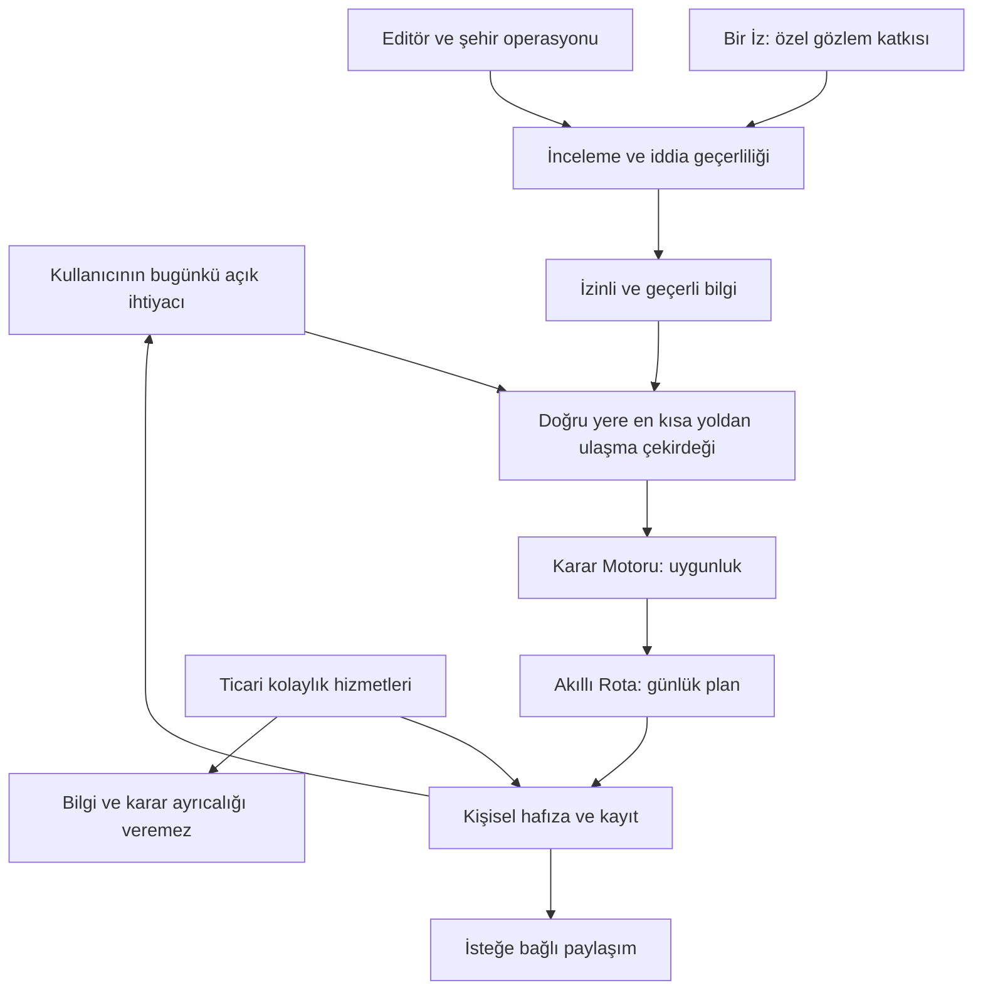

### 33.2. Diyagram 2 — Mekanın kanonik yayın yaşamı

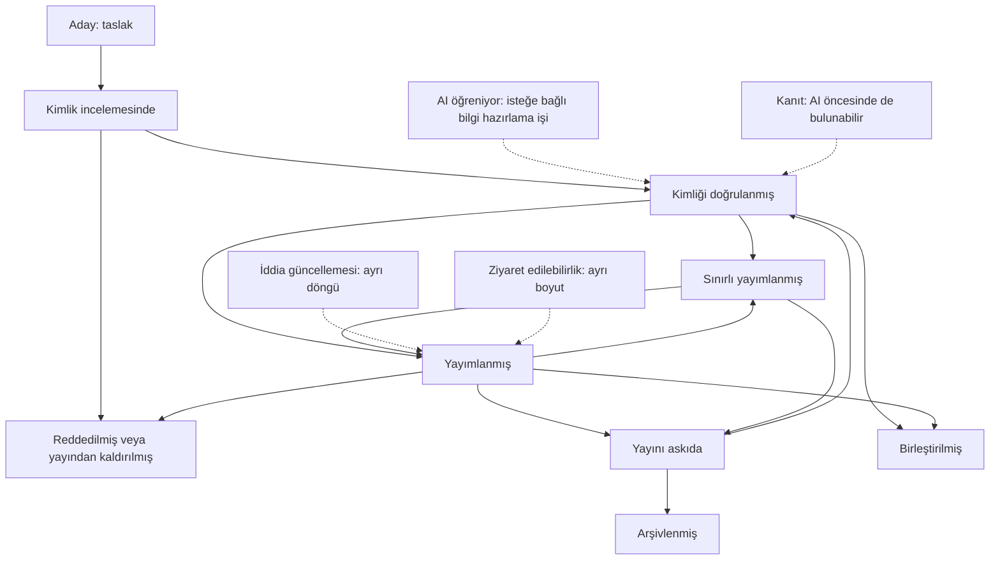

Silinme bir mekanın tarihsel olarak hiç var olmamış olması değildir. Kaldırma, kişisel hafıza ve gerekli sınırlı denetim izinin sonuçları ayrıca ele alınır.

### 33.3. Diyagram 3 — Doğrusal olmayan kullanıcı yaşamı

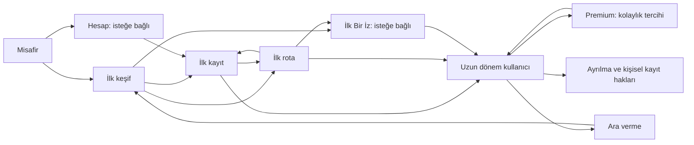

### 33.4. Diyagram 4 — Şehir açılışı ve geri dönüş kapıları

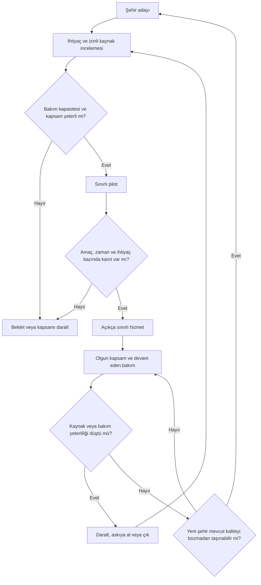

### 33.5. Diyagram 5 — Kaynaktan karara bilgi akışı

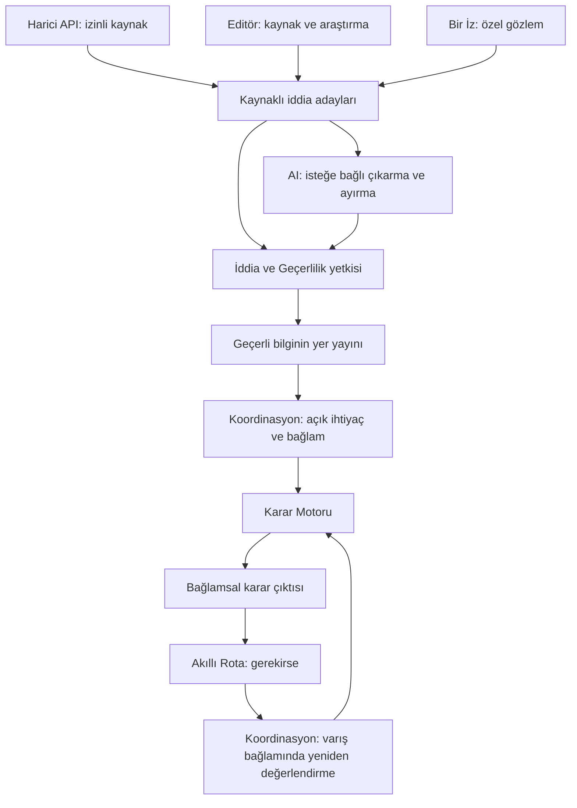

Karar Motoru Akıllı Rota'yı çağırmaz; günlük planlama koordinasyonun uygun karar çıktısını kullanmasıyla başlar. AI olmadan kanıt değerlendirmesine giden yol bilerek korunmuştur.

### 33.6. Diyagram 6 — İddianın güncellenmesi ve arşivlenmesi

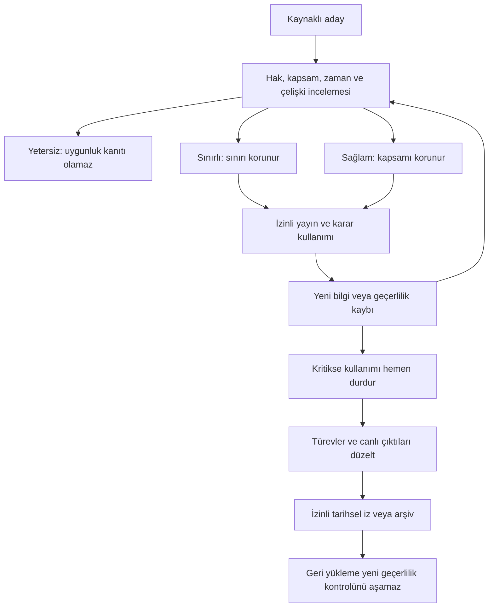

### 33.7. Diyagram 7 — Bir İz, ziyaret ve niyetin ayrılması

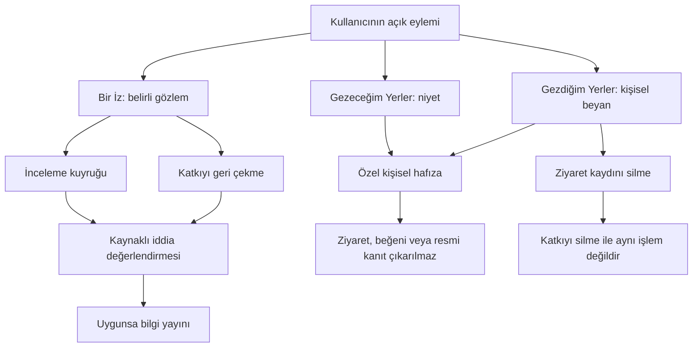

### 33.8. Diyagram 8 — Günlük rotanın kişisel düzenleme döngüsü

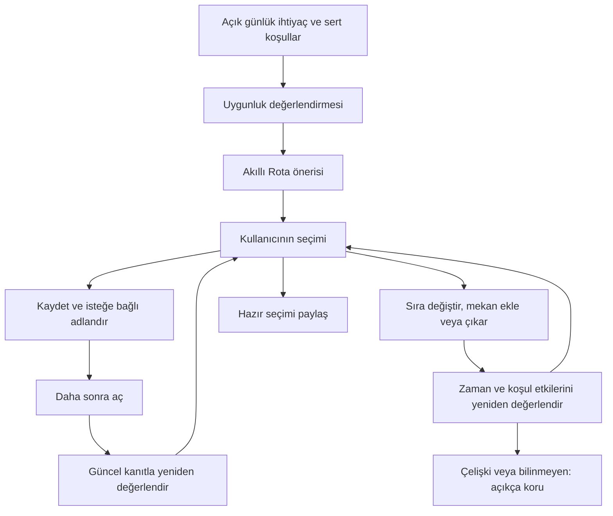

### 33.9. Diyagram 9 — Paylaşımın üç farklı yaşamı

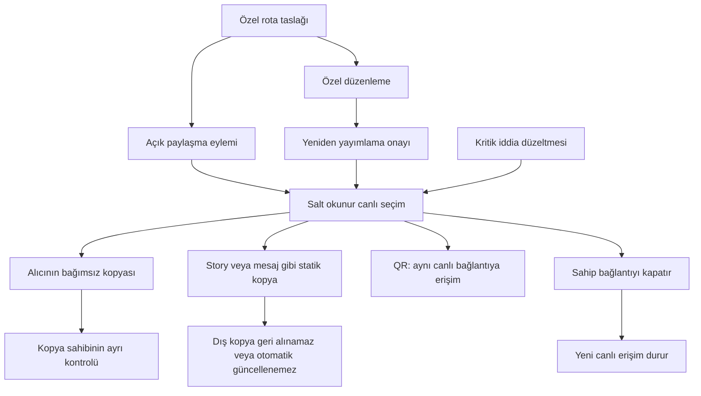

### 33.10. Diyagram 10 — Ücretsiz haklar ve Premium sınırı

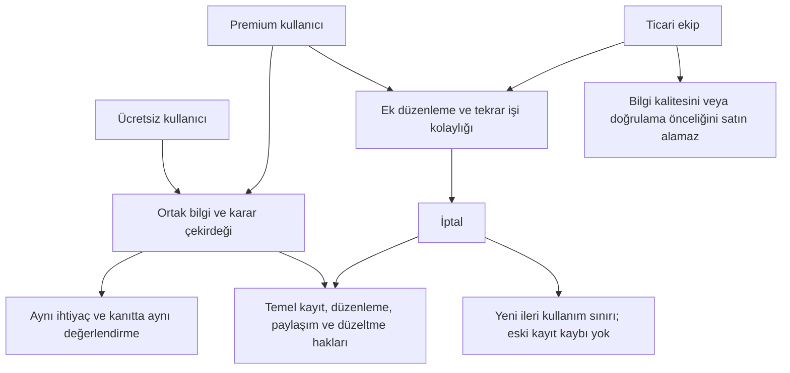

### 33.11. Diyagram 11 — Gelirin uygunluk kapısı

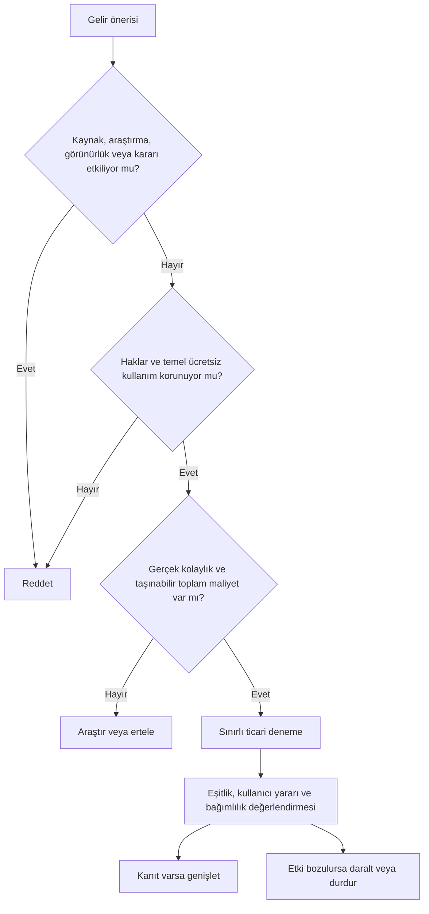

### 33.12. Diyagram 12 — Büyümenin bakım kapasitesine bağlanması

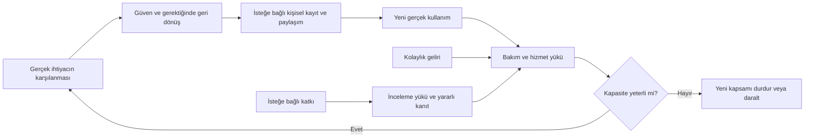

### 33.13. Diyagram 13 — Düzeltme, geri çekme ve silmenin yayılması

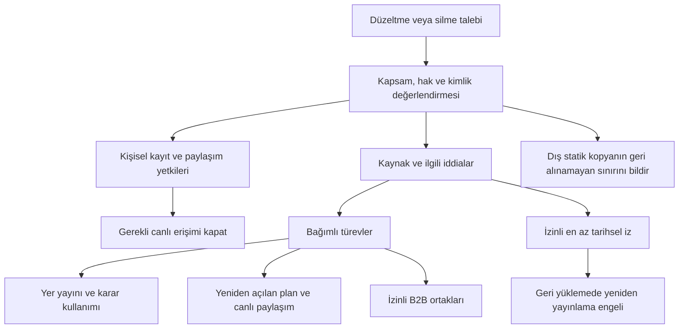

### 33.14. Diyagram 14 — On yıllık değişim yönetişimi

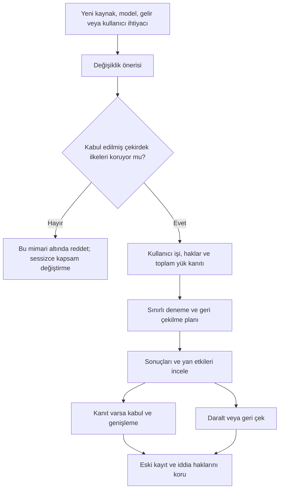

## 34. Öz eleştiri: mimarinin zayıf yerleri ve değişim koşulları

Aşağıdaki 48 madde mimarinin doğru olduğunu tekrar etmez; nerede başarısız olabileceğini ve hangi karşılığın gerektiğini gösterir. “İzlenir” demek tek başına çözüm değildir. İlgili varsayım yanlışlanırsa özellik veya kapsamın daraltılması gerçek bir seçenektir.

| No | Öz eleştiri | Sonuç ve düzeltme / yeniden karar koşulu |
| --- | --- | --- |
| 1 | Kolaylık geliri, sürekli bilgi bakımını karşılamayabilir. | Gerçek dönem maliyeti gelirden yüksekse büyüme durur; doğruluk satışı yerine kapsam küçülür. |
| 2 | Ücretsiz temel haklar geniş tanımlandı; işletim yükü hafife alınmış olabilir. | Yoğun kullanım ve eski kayıt yükü pilotta ölçülür; sınırsız söz verilmez, temel hakları habersiz kesmek çözüm sayılmaz. |
| 3 | Cihazlar arası devam kullanıcı tarafından ücretli ekstra değil temel beklenti sayılabilir. | Ödeme ve adalet araştırması olumsuzsa Premium paketinden çıkarılır; alternatif kolaylık aranır. |
| 4 | Rota kaydı talebi, gerçek tekrar kullanımdan fazla görünebilir. | Birikmiş kayıt değil yeniden açma görevi değerlendirilir; ileri arşiv yatırımı ertelenebilir. |
| 5 | Kullanıcı rota adlandırmayı istemeyebilir. | İsim zorunlu olmaz; varsayılan ad ve hızlı kaydetme yeterli kalabilir. |
| 6 | Koleksiyonlar niyet havuzu olsa da psikolojik borç yaratabilir. | Tamamlama dilinin yokluğu yetmez; kullanıcı baskı hissediyorsa koleksiyon davranışı sadeleştirilir. |
| 7 | Gezdiğim Yerler zamanla sosyal statü talebini doğurabilir. | Takipçi veya tamamlama puanı eklemek yerine kişisel hafıza kapsamı korunur; talep tek başına yön değiştirmez. |
| 8 | Bir İz için kısa cevap hedefi bağlam kaybettirebilir. | İki seçim ve beş saniye hedefi kanıtlanmış başarı değildir; yararlı kanıt üretmiyorsa sorular veya kullanım kapsamı değiştirilir. |
| 9 | Katkı hacmi inceleme kapasitesini aşabilir. | Daha fazla katkı toplama durdurulabilir; değerlendirilmemiş içerik doğrudan yayımlanmaz. |
| 10 | Katkıyı geri çekme türevlerini bulmak zor olabilir. | Bağımlılığı izlenemeyen katkı kullanımını genişletmek yerine kapsamı daraltmak gerekir. |
| 11 | Kişisel ziyaret ve katkı silme ayrımı kullanıcıyı yorabilir. | Ortak silme isteği anlaşılır tek niyetle karşılanabilmeli; kavramsal ayrım kullanıcıya bürokrasi yüklememeli. |
| 12 | Anonim katkı, içeride işlenen verinin fark edilmemesine neden olabilir. | Kamuya görünmezlik ile veri toplamama ayrımı görevlerde anlaşılmıyorsa anlatım ve veri kapsamı düzeltilir. |
| 13 | Editör merkezli bilgi yetkisi yeni darboğaz yaratabilir. | Yetki AI'ye devredilmez; risk bazlı iş bölümü ve daha dar kapsam sınanır. |
| 14 | Editörler arasında değerlendirme farklılığı kalabilir. | Örnek olay incelemesi ve gerekçeli uyuşmazlık çözümü gerekir; tek kişinin sezgisi politika olmaz. |
| 15 | Çıkar çatışması beyanı gizli ticari etkiyi önlemeyebilir. | Kaynak ve kuyruk dağılımı da incelenir; yalnız sözlü tarafsızlık yeterli değildir. |
| 16 | Ücretli doğrulama yasağı önemli bir gelir kapısını kapatır. | Ekonomik güçlüğü kabul etmek gerekir; işletmeye kamusal doğruluk ayrıcalığı satılmaz. |
| 17 | Affiliate karar sonrasında bile kullanıcı algısını bozabilir. | Ayrım anlaşılmıyorsa bağlantı gelir modeli kaldırılır; açıklama metni tek başına savunma değildir. |
| 18 | Sponsor bağımsız kalacağını söylese bile gelecekte baskı kurabilir. | Sponsor başlangıç dayanağı olmaz; gelir yoğunlaşması bağımsızlığı zayıflatıyorsa ilişki büyütülmez. |
| 19 | Kurumsal müşterinin özel isteği genel ürün takvimini ele geçirebilir. | Tüketici bakım kapasitesini azaltan özel işler alınmaz veya ayrı kapasite şartına bağlanır. |
| 20 | B2B ortakları belirsizlik ve düzeltmeyi son kullanıcıya taşımayabilir. | Bu davranış düzeltilemiyorsa dağıtım daraltılır; sözleşme varlığı başarı sayılmaz. |
| 21 | Kaynak lisansları iş modeline uygun olmayabilir. | B2B veya paylaşım hakkı varsayılmaz; yeniden dağıtım yerine izinli daha dar hizmet değerlendirilir. |
| 22 | Ana kaynağın çekilmesi bilgi kapsamını hızla çökertebilir. | Yedek kaynak yoksa ilgili iddialar sınırlanır; AI ile boşluk doldurulmaz. |
| 23 | AI inceleme maliyeti sağladığı hızdan büyük olabilir. | Toplam insan emeği ölçülür; ilgili AI işi azaltılır veya kaldırılır. |
| 24 | AI olmadan devam ilkesi, tüm görevlerin aynı hızda süreceği sanısını yaratabilir. | Devam edebilen görevler açıkça ayrılır; desteklenmeyen görevde çekimser kalınır. |
| 25 | Sağlam/Sınırlı/Yetersiz kullanıcı tarafından mekan puanı sanılabilir. | İddia kapsamıyla anlaşılma sınanır; genel mekan rozeti gibi kullanılmaz. |
| 26 | Sert koşullar için kanıt eksikliği çok fazla sonuçsuzluk yaratabilir. | Belirsizlik dürüst kalır; ilgili kanıt araştırması ve kapsam sınırı geliştirilir, koşul gevşetilmez. |
| 27 | Günlük rota sözü bile ziyaret süresi belirsizliği nedeniyle zor olabilir. | Tahmin ve olgu ayrılır; dar toleranslarda kesin plan vaadi azaltılır. |
| 28 | Kullanıcı elle düzenlerken sık yeniden değerlendirme yorucu olabilir. | Kontrolü engellemeden anlamlı değişikliğin etkisi anlatılır; eski doğruluk izlenimi korunamaz. |
| 29 | Özel taslak ile yayımlanmış seçim ayrımı karmaşık gelebilir. | Kullanıcı hangi sürümü paylaştığını anlamıyorsa paylaşım sadeleştirilir; sessiz otomatik yayın yapılmaz. |
| 30 | Kritik bilgi güncellemesi kullanıcıya planının değiştirildiği hissi verebilir. | Kişisel sıra ile bilgi değişimi ayrıştırılır; güncelleme geçmişi anlaşılır tutulur. |
| 31 | Statik Story eski bilgi yayılmasına açık bir kanaldır. | Talep zayıf veya yanlış anlaşılma yüksekse özellik ertelenir; canlı bağlantı yeterli olabilir. |
| 32 | QR anonim bir nesne gibi görünerek paylaşım kapsamını gizleyebilir. | Aynı bağlantı ve iletilebilirlik koşulu açık kalır; QR yeni mahremiyet vaadi vermez. |
| 33 | Ortak düzenleme, günlük karar ürününü ekip yazılımına dönüştürebilir. | Salt okunur paylaşım ve bağımsız kopya görevi çözüyorsa ortak düzenleme yapılmaz. |
| 34 | Ortak gruptaki sert ihtiyaç çatışmaları çözülemeyebilir. | Uzlaşma varmış gibi rota üretilmez; bağımsız planlar dürüst alternatif olarak kalır. |
| 35 | Abonelik bitiminde geniş hak koruması gelir teşvikini azaltabilir. | Gelir yalnız yeni kolaylığın değerine dayanmalıdır; kayıtları rehin almak alternatif değildir. |
| 36 | Sınırsız vaat reddi pazarlama açısından daha az çekici olabilir. | Taşınamayan vaat yerine anlaşılır kullanım sözü seçilir; satış baskısı kapasite kanıtının yerini alamaz. |
| 37 | Çok günlük geziyi dışarıda bırakmak önemli kullanıcı ihtiyacını kaçırabilir. | Ayrı kapsam kararı araştırılır; bağımsız günlük taslak koleksiyonu toplam organizasyon gibi satılmaz. |
| 38 | İlk şehir başarısı başka şehre taşınmayabilir. | Her şehir bağımsız kaynak ve ihtiyaç hazırlığından geçer; kopyalanabilir başarı varsayılmaz. |
| 39 | Olgunluk kapıları fazla muhafazakar olup büyümeyi durdurabilir. | Dar pilot ve ihtiyaç bazlı yeterlilik kullanılır; tüm şehrin kusursuz olması beklenmez. |
| 40 | Dar kapsam bazı bölgeleri sürekli dışarıda bırakabilir. | Karşılanamayan ihtiyaç dağılımı ayrı incelenir; ticari görünürlük araştırma önceliğinin yerine geçmez. |
| 41 | Seyrek kullanım ölçümü ürünün etkisini anlamayı zorlaştırabilir. | Günlük aktiflik yerine uygun aralıkta gerçek geri dönüş görevleri ve bakım maliyeti birlikte incelenir. |
| 42 | Bildirimleri sınırlamak güncel bilgiye dönüşü azaltabilir. | Yalnız açıkça istenen ve anlamlı değişiklik taşıyan iletişim değerlendirilir; alışkanlık baskısı kurulmaz. |
| 43 | Kişisel geçmişi korumak, kaynak silme hakkıyla çatışabilir. | Yalnız izinli en az kişisel tanımlayıcı korunur; ham kaynak tarihsel hafıza gerekçesiyle tutulmaz. |
| 44 | On yıllık saklama beklentisi gerçekte taşınamayabilir. | Kapanış ve kişisel kayıt teslimi planı gerekir; süresiz barındırma sözü verilmez. |
| 45 | Dış kopyaları geri alamamak kullanıcı silme beklentisini karşılamaz. | Bu sınır paylaşım öncesi anlaşılmalıdır; daha mahrem ihtiyaçta paylaşmamak geçerli seçenek olur. |
| 46 | Çok sayıda ilke ekip için ağır karar yükü yaratabilir. | Yeni yetenek kapıları ve somut örnek olaylarla uygulama sadeleştirilir; ilkeler keyfi yorum listesine bırakılmaz. |
| 47 | Bu belge araştırma yerine geçiyormuş gibi kullanılabilir. | Talep, fiyat, eşik ve kapasite açık varsayımdır; kabul senaryoları gerçekleşmiş sonuç diye sunulmaz. |
| 48 | Kurucu veya sahiplik değişiminde güven ilkeleri aşınabilir. | Ticari ve kapsam kararlarının gerekçesi görünür tutulur; aykırı değişiklik sessizce bu mimarinin devamı ilan edilmez. |

## 35. Alternatif ürün mimarileri ve seçim gerekçesi

| Alternatif | Güçlü tarafı | Temel bedeli | Karar |
| --- | --- | --- | --- |
| Mekan pazaryeri ve rezervasyon merkezi | İşlem başına gelir ve belirgin ticari taraf | Mekan satışı, komisyon ve uygunluk arasında sürekli çatışma; satış sonrası organizasyon kapsamı | Şamandıra'nın amacı olmadığı için reddedilir |
| Yorum ve puan topluluğu | Bol görünür içerik ve katılım sinyali | Popülerliği uygunluk yerine koyar; manipülasyon, yorum yayını ve sosyal statü üretir | Reddedilir; özel gözlemin iddiaya dönüşen sınırlı katkısı korunur |
| Influencer rotaları ve takip ağı | Dağıtım ve kişi merkezli güven | Takipçi ekonomisi, görünürlük satışı ve genel iyi rota iddiası | Reddedilir; kişinin özel rota paylaşması bu modele dönüşmez |
| AI'nin uçtan uca gezi danışmanı olması | Hızlı ve akıcı tek etkileşim | Kanıt, karar ve anlatım aynı otoritede birleşir; kaynaksız kesinlik ve geri çekme sorunu | Reddedilir; AI destek rolünde kalır |
| Yalnız editörlü kapalı rehber | Açık insan sorumluluğu ve seçici içerik | Güncel bağlam ve şehir ölçeğinde bakım pahalı; blog/rehber yayıncılığına kayma | Tam model olarak seçilmez; editör yetkisi korunur, izinli kaynak ve katkıyla desteklenir |
| Ham veri toptancılığı | Tüketici kullanımından bağımsız satış ihtimali | Kullanıcı ihtiyacı ikinci plana düşer; hak, bağlam ve düzeltme kaybı | Ana mimari olarak reddedilir; yalnız izinli bağlamlı B2B hizmeti koşullu kalır |
| Belediye veya yerel işletme ağına göre federasyon | Yerel kaynak ve finansmana erişim | Şehirler arasında farklı doğruluk ve ticari yayın standartları | Yerel kaynak işbirliği olabilir; çekirdek yetki ve haklar devredilmez |
| Her şeyi kapsayan seyahat organizatörü | Çok günlük ve grup ihtiyaçlarının tek yerde toplanması | Konaklama, şehirler arası ulaşım, rezervasyon ve destek yükü; mevcut günlük sözün aşılması | Bugünkü kapsamda reddedilir; ayrı gelecek kararı gerektirir |
| Tek şehirde kalıcı, dar karar ürünü | Düşük koordinasyon ve daha yönetilebilir bakım | Coğrafi erişim ve gelir fırsatı sınırlı | Geçerli geri çekilme seçeneği; çok şehir zorunlu büyüme hedefi değildir |
| Ortak karar çekirdeği, kişisel hafıza ve kapasiteyle büyüyen çevre sistemleri | Aynı güven sözünü koruyarak kullanım kolaylığı ve yeni kapsam ekleyebilir | Yetki, veri yaşamı ve düzeltme disiplinini sürekli işletme zorunluluğu | Bu belge için seçilen mimari |

Seçim “en çok özelliği içerdiği” için yapılmaz. Üç nedenle tercih edilir: kullanıcının güncel ihtiyacı kararın merkezinde kalır; bilgi otoritesi gelir, kişisel kayıt ve AI'den ayrılır; şehir, kanal veya Premium kolaylığı kapanırken çekirdeğin anlamı korunabilir. Kişisel hafıza tekrar kullanım sağlar, fakat yorum veya sosyal ağa dönüşmek zorunda değildir. Gelir kolaylık hizmetlerinden aranır, fakat bu gelirin yeterli olacağı kanıtlanmış sayılmaz.

Bu mimarinin maliyeti açıkça kabul edilir: kayıtların yaşamını izlemek, iddia düzeltmesini yaymak ve ticari fırsatlara hayır demek gerekir. Ekip bu yükü taşıyamıyorsa daha dar şehir/özellik kapsamı seçilir. Bir pazaryerinin daha hızlı büyüyebilmesi, aynı amaca hizmet ettiği anlamına gelmez. AI'nin daha akıcı cevap vermesi de yayın ve uygunluk otoritesini birleştirmeyi haklı kılmaz.

Seçim geri alınamaz ürün boyutu iddiası değildir. Kolaylık, kanal ve kapsam kararları araştırmayla değişebilir. Referansların çekirdeğini değiştirmek ise bu belgenin gizli esnekliği değildir; ayrı, açık kabul kararı gerektirir.

## 36. Belge ilişkileri ve sonraki okuma

### Bu dokümanın bağlı olduğu belgeler

- [00 — Ürün Felsefesi](../00-product/00-urun-felsefesi.md): amaç ve ticari olmayan karar çekirdeği.
- [01 — Bilgi Mimarisi](../00-product/01-bilgi-mimarisi.md): mekan, şehir ve mevcut keşif yapısının sınırları.
- [02 — Product Language](../00-product/02-product-language.md): karar, belirsizlik ve baskısız ürün dili.
- [03 — Karar Motoru](../00-product/03-karar-motoru.md): uygunluk yetkisi ve sert koşullar.
- [04 — Sistem Mimarisi](../00-product/04-sistem-mimarisi.md): bilgi hazırlama, koordinasyon ve sorumluluk ayrımı.
- [05 — AI Bilgi Motoru](../04-ai/05-ai-bilgi-motoru.md): iddia, kanıt, kaynak hakkı, AI sınırı ve Bir İz.
- [06 — Akıllı Rota Motoru](../00-product/06-akilli-rota-motoru.md): günlük rota, zaman ve yeniden değerlendirme.
- [07 — UX Karar Akışları](../02-ux/07-ux-karar-akislari.md): misafir hakları, kayıt, paylaşım ve katkı ayrımları.
- [08 — Tasarım İlkeleri](../03-design/08-tasarim-ilkeleri.md): güven eşitliği, kullanıcı kontrolü ve baskısız kullanım.
- [Proje README](../../README.md) ve [dokümantasyon dizini](../README.md): proje bağlamı ve okuma haritası; tarihsel uygulama notları hedef ürün ilkelerini geçersiz kılmaz.

Bu referansların içerikleri değiştirilmemiştir. Görevdeki açık kabul beyanı esas alınır; kaynak dosyalarda korunmuş tarihsel durum etiketleri bu belge tarafından yeniden yazılmaz. 09 belgesi ise kabul bekleyen yeni öneridir.

### Bu dokümanın etkilediği belgeler

Bu bölüm, mevcut referanslarda değişiklik yapıldığı anlamına gelmez. Aşağıdaki çalışmalar planlıdır; bu görevde ayrı belge oluşturulmamıştır ve var olmayan dosyalara bağlantı verilmemiştir.

- Planlı iş modeli doğrulama çalışması: ücretsiz hak maliyeti, kolaylık talebi, ödeme isteği, iptal ve gelir yoğunlaşması.
- Planlı şehir operasyon ve olgunluk ölçüm çalışması: kapsam, kaynak, bakım kapasitesi, küçülme ve çıkış koşulları.
- Planlı katkı ve bilgi bakım prosedürleri: 05'teki yetki çerçevesinin operasyon sorumlulukları ve düzeltme yükü.
- Planlı kayıt, paylaşım ve haklar araştırması: 07–08 sınırları içinde anlama, silme, kopya ve ortak düzenleme görevleri.
- Planlı ortaklık değerlendirme ölçütleri: kurumsal ve B2B kullanımın kaynak hakkı, eşitlik ve geri çekme yükümlülüğü.

### Bundan sonra okunması gereken belge

Önce [05 — AI Bilgi Motoru](../04-ai/05-ai-bilgi-motoru.md) ile bilgi yetkisi ve kanıt yaşamı, ardından [06 — Akıllı Rota Motoru](../00-product/06-akilli-rota-motoru.md) ve [07 — UX Karar Akışları](../02-ux/07-ux-karar-akislari.md) ile kişisel planın sınırları birlikte okunmalıdır. Sonraki yeni çalışma, **planlı iş modeli ve şehir kapasitesi doğrulaması** olmalıdır; bu öneri kod, ekran veya ticari lansman talimatı değildir.

## Nihai Ürün Ekosistemi İlkeleri

1. Şamandıra en iyi mekanı satmaz; kişinin bugünkü ihtiyacına uygun yeri en kısa yoldan bulmasını sağlar.
2. Çekirdek değer doğruluk gösterisi değil, kanıt sınırları içinde belirsizliği azaltan karardır.
3. Aynı açık ihtiyaç ve kanıt, üyelik ve ödeme durumundan bağımsız aynı uygunluk değerlendirmesine ulaşır.
4. Premium yalnız ek kolaylık satabilir; doğruluk, güncellik, güvenilirlik veya doğrulama önceliği satamaz.
5. Bilgi, kişisel kayıt, uygunluk kararı, günlük rota ve ticari hizmet ayrı sorumluluklara sahiptir.
6. AI kaynaklı adayları işleyebilir ve desteklenen anlamı açıklayabilir; kanıt, yayın ve uygunluk otoritesi olamaz.
7. Karar Motoru uygunluğu belirler; Akıllı Rota uygun adaylarla günlük planı kurar; koordinasyon gerekli yeniden değerlendirmeyi sağlar.
8. Mekan kimliği, yayın durumu, ziyaret edilebilirlik ve iddia geçerliliği birbirinin yerine kullanılamaz.
9. Bilinmeyen bilgi olumlu varsayılmaz; sert koşul başka avantajla telafi edilmez.
10. Bir İz özel ve gönüllü gözlemdir; yorum yayını, puan, görünür statü veya çoğunluk oylaması değildir.
11. Kaydetmek gitmek, gitmek beğenmek, paylaşmak resmi öneri üretmek değildir.
12. Temel kayıt, adlandırma, düzenleme, yeniden değerlendirme ve paylaşım kullanıcının ücretsiz kontrol alanıdır.
13. Kişisel hafıza niyeti ve geçmişi korur; güncel bilgi yeniden ele alınırken geçmiş sessizce yazılmaz.
14. Koleksiyonlar ve ziyaret kayıtları tamamlama baskısı, sosyal kıyas veya sürekli etkileşim görevi üretmez.
15. Paylaşım açık seçimdir; özel taslak, canlı yayın ve bağımsız kopya farklı haklar taşır.
16. Kritik düzeltme canlı bilgiye yayılır; dış statik kopyaların geri alınamadığı dürüstçe açıklanır.
17. Abonelik iptali kişisel emeği rehin alamaz; ileri kolaylığın sona ermesi temel kayıt haklarını sona erdirmez.
18. Şehir ancak desteklediği ihtiyaç ve bakım kapasitesi kadar açıktır; olgunluk geri alınabilir, büyüme zorunlu değildir.
19. İşletme ve ortaklık geliri kaynak seçimini, editör araştırmasını, doğrulamayı, görünürlüğü veya öneriyi satın alamaz.
20. Kaynak hakkı, geri çekme ve düzeltme sorumluluğu tüm türevlere ve izinli ortak kullanıma uzanır.
21. Yeni yetenek, kullanıcı işi ve toplam yüküyle gerekçelendirilir; kapanış ve kullanıcı ayrılma koşulları olmadan açılmaz.
22. Talep, fiyat, kapasite ve on yıllık dayanıklılık varsayımdır; araştırma yapılmış gibi sunulamaz.
23. Sürdürülebilirlik bozulduğunda önce kapsam ve ek kolaylıklar daraltılır; çekirdeğin güven sözü ticarete açılmaz.
24. Ekosistem yıllar içinde büyüyebilir; kullanıcının doğru karara ulaşma hakkı hiçbir büyüme katmanının altında kaybolamaz.
