# Şamandıra — Ürün Özellik Haritası

Bu belge, özellik biriktirmek için değil, kabul edilmiş ürünün hangi bağımlılıklarla ve hangi kanıtlar karşılığında geliştirileceğini belirlemek için hazırlanmıştır. Kod, UI, Figma veya Flutter çıktısı değildir. Takvim tahmini, kullanıcı araştırması sonucu, satışa hazır paket veya uygulama kabulü ilan etmez.

**Nihai yön:** Önce Samsun'da bakımını sürdürebildiğimiz bir karar kapsamı; bunun üzerinde Keşfet ve aynı ana uygun öneri; gerekli geçiş kanıtıyla günlük Akıllı Rota; ardından kişisel devamın derinleşmesi ve kanıtlanmış kolaylık geliri. Yeni şehir ve kurumsal dağıtım kendi kapasite kapılarından geçer. Çok günlük Akıllı Gezi mevcut günlük kapsamdan ayrı bir genişleme kararıdır.

Okuma düzeni: §1–30 istenen kapsam başlıklarıdır. §31 ortak Karar Motorunu, §32 geliştirme sırasını, §33 ticari büyümeyi, §34 yayın kapılarını, §35 kanal ve işletim kapsamını tanımlar. Son bölüm grubu §36'da 30 Mermaid diyagramı, §37'de 40 senaryo, §38'de 60 maddelik öz eleştiri, §39'da kaynak ve çelişki kaydı, §40'ta nihai Ürün Yol Haritasıdır. Toplam **40 numaralı ana bölüm** bulunur.

### Statü anahtarı

| İşaret | Anlam |
| --- | --- |
| K | Kabul edilmiş 00–12 referanslarında bulunan ürün kararı. Uygulanmış olduğu anlamına gelmez. |
| D | 13 Bileşen ve Etkileşim Sözleşmeleri'ndeki davranış ayrıntısı. Depo dizininde ayrıca kabulü kaydedilmemiştir; 00–12 ile uyumlu tamamlayıcı kaynaktır. |
| P | Bu belgenin geliştirme sırası, sürümleme veya sınama planı. Yeni kabul edilmiş özellik gibi sunulmaz. |
| G | Kaynaklarda koşullu bırakılan ya da kullanıcının bu görevde değerlendirilmesini istediği ürün genişlemesi. Ayrı kapsam kararı ve doğrulama gerekir. |
| H | Tarihsel uygulama veya plan kaydı. Hedef ürün otoritesi değildir. |
| X | Mevcut ürün felsefesi altında geliştirilmeyecek biçim. Takvimde bekleyen özellik değildir. |

MVP, v1 ve v2 bu belgenin **P statüsündeki teslim evreleridir**; kaynak dosyaların sürüm numaraları değildir. Ücretsiz hak bir yeteneğin bugünden uygulanmış olduğunu söylemez: henüz açılmamış bir yetenek ertelenebilir, fakat açıldığında temel hakkı Premium'a çevrilemez. Belge 13'ün bulunması veya bu belgede kullanılması onun ayrıca kabul edildiğini ilan etmez.

### Başlangıç durumu

Depo: C:/dev/buyuk_gezi_projesi/gezi_bot. Devam kontrolünde Git çalışma alanı temizdi ve 14 dosyası mevcut değildi; korunması gereken yarım FAZ 14 gövdesi bulunmadı. Önceki incelemenin kaynak bulguları kullanıldı; kaynak belgeler yeniden üretilmedi.

Kök README; veri hattı, PostgreSQL aktarımı, API, rota motoru ve yerel siteyi mevcut olarak kaydeder; hesap, ödeme, admin, ikinci şehir ve site içi haritayı eksik gösterir. Bunlar **README'nin durum beyanıdır**, bu görevde yeniden yapılmış çalıştırma testi değildir. Yaklaşık 1.700 kayıt, 1.700 karar verilebilir veya güncel mekan demek değildir. Tarihsel sponsorlu vitrin, duygu skoru, örnek yorum parçacığı ve çok günlük rota anlatıları kabul edilmiş ürünün davranışına kanıt oluşturmaz.

## 1. Ürünün temel modülleri

Modül, tek bir ürün sorumluluğudur; ayrı ekran, uygulama veya servis kurma zorunluluğu değildir. Modül kimlikleri bu belgedeki kapsam ve bağımlılık takibi içindir.

| Kimlik | Modül | Ayrıntı | İlk teslim kararı |
| --- | --- | --- | --- |
| M01 | Bilgi, kanıt ve güncellik | Bu bölüm | MVP önkoşulu |
| M02 | Karar Motoru | Bu bölüm, §31 | MVP önkoşulu |
| M03 | Mekan detay sistemi | §17 | MVP |
| M04 | Şehir sistemi | §18 | MVP, sınırlı Samsun |
| M05 | İlçe sistemi | §19 | MVP coğrafi seçim; sayfa koşullu |
| M06 | Arama | §26 | MVP |
| M07 | Filtre | §27 | MVP |
| M08 | Keşfet | §15 | MVP |
| M09 | Bugün Ne Yapalım? | §16 | MVP, mevcut keşfin bağlamlı giriş biçimi |
| M10 | Çok günlük Akıllı Gezi | §14 | G; MVP/v1 dışında, v2 değerlendirme kapısı |
| M11 | Günlük Akıllı Rota | §21 | MVP'de dar günlük kapsam |
| M12 | Kullanıcı hesabı ve izinler | §11 | Tüketici hesabı v1; iç yetki MVP |
| M13 | Gezeceğim Yerler | §12 | MVP, cihazda temel kayıt |
| M14 | Gezdiğim Yerler | §13 | v1, ücretsiz kişisel hafıza |
| M15 | Koleksiyon ve kayıt yönetimi | Bu bölüm | MVP temel rota kaydı; koleksiyon v1 |
| M16 | Paylaşım | §22 | MVP salt okunur link ve metin |
| M17 | Bir İz ve topluluk katkısı | §10 | v1; hata bildirimi MVP |
| M18 | Duygu analizi | §20 | İç hazırlamada sınırlı MVP |
| M19 | AI destek işleri | §9 | Denetimli MVP desteği |
| M20 | Admin ve bilgi operasyonu | §8 | MVP önkoşulu |
| M21 | İşletme bilgi kabulü | §7 | MVP denetimli iletişim |
| M22 | Bildirim | §24 | MVP görev içi değişiklik; dış kanal v1 |
| M23 | Offline kullanım | §25 | MVP gerçek yerel kayıt okuma |
| M24 | Premium kolaylık hizmeti | §6, §29 | v1 araştırma; koşullu ticari pilot |
| M25 | Kurumsal çalışma hizmeti | §7 | v2 sonrası koşullu |
| M26 | Partner/B2B API dağıtımı | §30 | Olgunluk sonrası koşullu |
| M27 | Ölçüm ve desteklenen kapsam denetimi | Bu bölüm, §34 | MVP önkoşulu |
| M28 | Yardım, yöntem ve veri kontrolü | Bu bölüm | MVP |
| M29 | Harita ve yol tarifi | Bu bölüm | MVP dış yol tarifi; site içi harita v1 |
| M30 | Kullanıcı kontrollü tercih öğrenme | §9 | v1; açık hatırlama, gizli profil yok |
| M31 | Rozet/başarı | §23 | X: rekabet ve tamamlama yok |
| M32 | Favoriler | §28 | Ayrı modül yok; M13/M15 karşılar |

Öncelikler: **P0**, bir sonraki yayının doğruluk, hak veya temel görev engeli; **P1**, çekirdekten sonra yüksek tekrar değeri; **P2**, bağımlılık ve değer kanıtına bağlı gelişme; **P3**, araştırma dışında teslim taahhüdü olmayan aday; **X**, geliştirilmeyecek biçim. Aynı öncelikte önce bağımlılığı açan iş yapılır; sayısal toplam puanla kritik risk telafi edilmez.

### M01 — Bilgi, kanıt ve güncellik

- **Amacı:** Doğru ziyaret birimine bağlı, kaynak hakkı ve geçerlilik kapsamı belirli iddialar üretmek; yanlış bilginin türev kullanımını durdurmak.
- **Kullanıcıya sağladığı değer:** Güncelliği ve sınırı anlaşılır karar; daha az kötü sürpriz.
- **Bağımlılıkları:** İzinli kaynak, kimlik/coğrafya, M20 inceleme, aile bazlı yayın politikası. M19 yardımcıdır; zorunlu doğruluk otoritesi değildir.
- **MVP'de olup olmayacağı:** Evet, dar iddia ailelerinde. Geri çekme ve yenileme olmadan kamusal öneri açılmaz.
- **Ticari değeri:** Bütün kanallarda tekrar kullanılabilen bilgi ve sürdürülebilir bakım; daha yüksek güven satışı değildir.
- **Geliştirme önceliği:** P0; tüm öneri işlerinden önce.
- **Riskleri:** Yanlış şube, eski bilgiyi tazelemiş sayma, hak kaybı ve görünmeyen türevler. Kritik hatada ilgili iddia durur; tüm yeri gereksiz silmekten kaçınılır.

Dayanak: 02 §7–10, 04 §1/10–12/23, 05 §38–45. Statü K; teslim dilimi P.

### M02 — Karar Motoru

- **Amacı:** Kullanılabilir iddiayı açık amaç, zorunlu koşul, tercih ve ziyaret bağlamına bağlayan tek uygunluk kararı.
- **Kullanıcıya sağladığı değer:** Neden seçebileceğini, vazgeçme nedenini ve bilinmeyeni birlikte anlayabilmek.
- **Bağımlılıkları:** M01, M04–M07; güncel bağlam ve düzeltme bağı. Hesap, ödeme, rota ve canlı AI bağımlılığı yoktur.
- **MVP'de olup olmayacağı:** Evet; sınırlı ama uçtan uca.
- **Ticari değeri:** Ürünün ortak değeri; üç giriş için kural ve bakım tekrarını azaltır.
- **Geliştirme önceliği:** P0; rota geliştirmesinin önündedir.
- **Riskleri:** Zorunlu koşulu skor içinde eritmek, eksik adayı dünyada yok saymak, ticari sızıntı. Karar kaydı gerçek gerekçeye bağlı tutulur.

Dayanak: 03 §1–10, 04 §14/23–24. Statü K.

### M15 — Koleksiyon ve kayıt yönetimi

- **Amacı:** Kullanıcının kendi niyetini, günlük taslağını ve kayıt gruplarını yeniden buldurmak.
- **Kullanıcıya sağladığı değer:** Emeği kaybetmeme; birkaç günlük bağımsız taslağı kendi adıyla düzenleyebilme.
- **Bağımlılıkları:** M03 kimliği, M13/M14/M11 nesne ayrımları, gerçek kalıcılık, geri alma ve silme kapsamı.
- **MVP'de olup olmayacağı:** Rota kaydetme, adlandırma, açma, çoğaltma, silme evet; basit koleksiyon düzeni v1.
- **Ticari değeri:** İhtiyaç anında geri dönüş; büyük arşivde ileri düzenleme ancak ek fayda kanıtıyla ücretli aday.
- **Geliştirme önceliği:** Temel kayıt P0; koleksiyon P1; ileri arşiv P2.
- **Riskleri:** Niyeti görev borcuna çevirmek, koleksiyon silince bağımsız kayıtları kaybetmek, günlük koleksiyonu çok günlük plan sanmak.

Dayanak: 09 §20/31.4, 11 §46. Statü K.

### M27 — Ölçüm ve kapsam denetimi

- **Amacı:** Karar faydası, yanlış olumlu, gereksiz susma, bakım ve hizmet maliyetini aynı kapsamda görmek.
- **Kullanıcıya sağladığı değer:** Sorunlu yeteneklerin erken daralması; daha faydalı iyileştirmeler.
- **Bağımlılıkları:** M01/M02 sürüm ve kapsamları; asgari olay kaydı; bağımsız görev değerlendirmesi.
- **MVP'de olup olmayacağı:** Evet; pilot başlamadan ölçüm tanımları gerekir.
- **Ticari değeri:** Yanlış genişleme ve pahalı değersiz özellik yatırımını önler.
- **Geliştirme önceliği:** P0; analitik arızası kullanıcı kararını kilitlemez ama başarı kanıtını durdurur.
- **Riskleri:** Tıklamayı memnuniyet saymak, ücretsiz kullanımı başarısız görmek, hassas sorgu ve konum biriktirmek.

Dayanak: 04 §26, 05 §45, 09 §32. Statü K; ölçüm planı §34 P.

### M28 — Yardım, yöntem ve veri kontrolü

- **Amacı:** Ürünün sorumluluğunu, bilgi sınırını, düzeltme ve kişisel kontrol yollarını anlaşılır kılmak.
- **Kullanıcıya sağladığı değer:** Yanlış bilgiye itiraz edebilme; kendi kaydını ve paylaşımını yönetebilme.
- **Bağımlılıkları:** M01 yayın yöntemi, M20 sorumlu atama, açılmış kişisel kayıt ve paylaşım kapsamı.
- **MVP'de olup olmayacağı:** Evet; Neden Şamandıra?, yöntem, iletişim ve gerçek veri kullanımını anlatan destek içeriği.
- **Ticari değeri:** Güven, daha az destek tekrarı ve dürüst ayrılma; doğrudan ücret gerekçesi değil.
- **Geliştirme önceliği:** P0; ürün kullanıcının hata bildirimine hazır olmadan büyümez.
- **Riskleri:** Genel yöntemi belirli bilinmeyenin yerine koymak, var olmayan destek süresi ve kurtarma garantisi vermek.

Dayanak: 01 §8–10, 11 E20–E23. Statü K.

### M29 — Harita ve yol tarifi

- **Amacı:** Aynı seçeneklerin konum ilişkisini ve seçilmiş yere ulaşma yolunu açıklamak.
- **Kullanıcıya sağladığı değer:** Konum belirsizliğini azaltma; harita kullanmadan da kararını uygulayabilme.
- **Bağımlılıkları:** M03 doğru kimlik/koordinat; izinli harita verisi ve atıf; M11 için gerçek geçiş bilgisi.
- **MVP'de olup olmayacağı:** Doğrulanabilen adres ve dış yol tarifi evet; site içi yardımcı harita v1.
- **Ticari değeri:** Görev tamamlama; tek başına Premium değeri değildir.
- **Geliştirme önceliği:** Temel ulaşım P0; site içi harita P1.
- **Riskleri:** Kuş uçuşunu yürüme süresi sanmak, pan ile gizlice aramayı değiştirmek, haritayı zorunlu kılmak.

Dayanak: 01 §2/6, 10 B31, 13 §14. Statü K/D.

## 2. Modüller arasındaki ilişkiler

Temel yön **kaynak ve kimlik → kullanılabilir iddia → aday bulma → bağlamsal karar → gerekirse günlük dizi → izinli yayın**dır. Düzeltme ters bir doğruluk otoritesi oluşturmaz; etkilenen sahiplerin yeniden değerlendirmesini tetikler.

| İlişki | Taşınan anlam | Geçilemeyecek sınır |
| --- | --- | --- |
| M20/M21/M17 → M01 | Gözlem, bildirim, karşı kanıt | Alındı, doğru veya yayımlandı demek değildir |
| M19/M18 → M01 | İddia adayı, zaman/alan ayrımı | AI ve duygu olumlu uygunluk yazamaz |
| M01 → M06/M02/M03 | Yetkili bilgi, kapsam, geçerlilik | İndeks veya anlatım yeni gerçek oluşturmaz |
| M06 → M02 | Aday havuzu | Ad eşleşmesi kişisel öneri değildir |
| M08/M09 → M02 | Farklı başlangıçla aynı karar bağlamı | Ayrı gizli ağırlıklar ve ikinci uygunluk yok |
| M02 → M11 | Desteklenen durak adayları | Tek tek uygunluk toplam planı kanıtlamaz |
| M11 → koordinasyon → M02 | Değişmiş varış bağlamı | Karar Motoru Rota Motorunu çağırmaz |
| M13/M14/M15 → plan | Kullanıcının seçtiği niyet/geçmiş | Kayıt beğeni, ziyaret veya zorunlu durak yaratmaz |
| M16 → alıcı | Açıkça paylaşılan sürüm | Özel taslak, yönetim yetkisi ve hassas bağlam taşınmaz |
| M24/M25/M26 → hizmet hakkı | Ek kolaylık/kapasite/özel çalışma | Kamuya sunulan kanıt ve uygunluk kalitesi değişmez |

Kullanıcı hesabı, ortak çalışma ve ticari hizmet çökerse kamusal Keşfet çalışabilmelidir. AI hazırlama kesilince geçerli bilgi kalabilir. Ancak kritik geçerlilik kontrolü çalışmıyorsa olumlu uygunluk sürdürülemez. Bunlar “her hata durumunda her iş çalışır” sözü değildir.

## 3. MVP kapsamı

**P kararı:** Samsun'un açıkça tanımlanmış alan/amaç/zaman kapsamındaki gerçek kararını baştan sona destekleyen ürün. Kullanıcının hesap açmadan bir yer bulması, kararını anlaması ve gerekiyorsa dar günlük planını saklayıp paylaşması yeterlidir. Ülke kapsamı veya bütün kategoriler vaat edilmez.

MVP teslimleri:

1. M01/M20 ile kimlik, hak, iddia geçerliliği, yayın, hata kabulü ve kritik geri çekme.
2. M06/M07/M02 ile ad/tür/coğrafya ve desteklenen ihtiyaç araması; zorunlu koşulları koruyan açıklanabilir değerlendirme.
3. M08/M03 ile 3–5 hedefli ilk seçenek, anlamlı fark, ilgili ödün/bilinmeyen ve yer detayına geri dönüş.
4. M09 ile “şimdi/bu akşam/ayırdığım süre” bağlamı; konum izni yerine elle yer seçimi. Canlı veri yokken canlı öneri iddiası yok.
5. M11 ile yalnız doğrulanabilir geçişleri olan günlük kapsam; başlangıç, bitiş, kalış, bekleme, toplam süre/bütçe ve yeniden değerlendirme. Gerekli kanıt yoksa taslak; hazır rota vaadi yok.
6. M13/M15 ile cihazda niyet ve günlük taslak kaydı, gerçek teyit, açma, temel düzenleme, geri alma ve silme.
7. M16 ile salt okunur link, metin hazırlama ve yönetim erişimi; paylaşım önizlemesi, kapatma ve alıcıda hesapsız okuma.
8. M22/M23/M28 ile görev içinde kritik değişiklik, gerçekten saklı kayıt okuma, kesinti ve destek.
9. M27 ile pilot görevleri, hata kapsamı, düzeltme tamamlanması ve bakım maliyeti ölçümü.
10. Tüketici görevlerinde dar/geniş alan, klavye ve yardımcı teknolojiyle eşdeğer kontrol; görsel özen sonradan ücretli katman olmaz.

**MVP dışında:** Tüketici hesap devamı, geniş koleksiyon düzeni, ziyaret hafızası, Bir İz'in açık katkı toplaması, site içi harita, dış bildirim teslimi, ticari paket/ödeme, davetli ortak çalışma, ikinci şehir, çok günlük ve şehirler arası plan. Bu işler ücretli taban yaratmak için değil, ilk yayın bağımlılıklarını sınırlamak için ertelenir.

MVP'nin günlük rota alt dilimi ancak §34 K4 kapısını geçerse yayımlanır. Geçmezse Keşfet pilotu ilerleyebilir; **rota dahil MVP tamamlandı** denmez. Kısmi pilot ile hedeflenen MVP tamamlanması farklıdır. Kaynaklarda sabit MVP takvimi bulunmadığı için bu seçim geliştirme önerisidir.

## 4. v1 kapsamı

MVP'nin değer ve bakım kanıtını derinleştiren evredir; yeni ticari çekirdek kurmaz.

| Teslim | Önce gereken | Doğrulanan sonuç |
| --- | --- | --- |
| İsteğe bağlı hesap ve açık cihaz aktarımı | Kayıt sahipliği, silme ve yetki | Kayıt kaybetmeden doğru hesapla devam |
| Gezdiğim Yerler ve temel koleksiyon | Niyet/ziyaret/katkı ayrımının anlaşılması | Geçmişi tekrar bulma; otomatik ziyaret yok |
| Bir İz'in dar ailelerde açılması | İnceleme ve geri çekme kapasitesi | Kullanılabilir gözlem, taşınabilir toplam emek |
| Günlük rota düzenleme derinliği | MVP rota kapısı | Değişiklikte amaç ve kilitler korunuyor |
| Yardımcı harita | Aynı sonuç kümesi ve metinsel eşdeğer | Harita arızasında görev sürüyor |
| İzinli dış bildirim | Gerçek dağıtım ve mahremiyet | Anlamlı değişikliğe dönme; teslim garantisi yok |
| İsteğe bağlı tercih hatırlama | İzin ve açık bağlam | Bugünkü ihtiyaç geçmişin önünde |
| Premium değer denemesi | Tekrar işi ve ücretsiz hak tabanı | Ek kolaylık için gerçek ödeme isteği |
| İkinci şehir hazırlık araştırması | Samsun bakım yükü taşınabilir | Yeni şehrin bağımsız açılış dosyası |

v1, çok günlük Akıllı Gezi'yi satışa açmaz. İkinci şehir araştırması otomatik ikinci şehir yayını değildir. Hesabın açılması cihazlar arası hizmetin ücretini belirlemez; §29'un ayrı paket kararı gerekir. Tek cihazlı hesap erişimiyle çok cihazlı eşitleme de aynı teslim değildir.

## 5. v2 kapsamı

**Kapsamı önceden dolu özellik paketi değil, kanıtlı genişleme evresidir.** v1 başarılı diye bütün adaylar birlikte açılmaz.

- Bir sonraki şehir/amaç kapsamı, kendi kaynak ve bakım kanıtıyla genişler.
- Gerçek talep varsa davetli ortak öneri ve düzenleme, kişisel sürüm geçmişi ve çok senaryolu düzenleme kolaylıkları pilotlanır.
- Çok günlük Akıllı Gezi için §14'teki ayrı kapsam değerlendirmesi yapılır. Kabul edilmiş günlük motor değişmeden kalır; günler arası sorumluluk ayrıca tanımlanır.
- Kurumsal kolaylık ve B2B hizmeti, tüketici bakımını aksatmayacak ayrı destek kapasitesiyle değerlendirilir.
- Yeni dil ve yerel uygulama ancak mevcut kanalın çözemediği gözlenmiş görev ihtiyacına dayanır.

**v2'ye dahil edilmesi kesin olmayanlar:** Çok günlük plan, eşzamanlı ortak düzenleme, kurumsal alan, B2B dağıtım. Bunlar G statüsündedir; belge hazırlanması kabul veya açılış değildir. Koşulları geçmeyen aday yerine mevcut şehirde derinleşme seçilir.

## 6. Premium kapsamı

### M24 — Premium kolaylık hizmeti

- **Amacı:** Aynı doğru karara ulaşmak için tekrarlanan kişisel düzenleme ve koordinasyon işini azaltmak.
- **Kullanıcıya sağladığı değer:** Yeniden yazma, önceki seçimi bulma ve alternatif çalışma kaybını azaltma.
- **Bağımlılıkları:** M12/M15; ücretsiz işin tamamlanması; gerçek değer araştırması; hak, iptal ve destek işletimi.
- **MVP'de olup olmayacağı:** Hayır. v1 araştırma; kanıt varsa dar ticari pilot.
- **Ticari değeri:** Öncelikli gelir hipotezi; kârlılık veya abonelik talebi henüz kanıtlanmış değil.
- **Geliştirme önceliği:** Araştırma P1; ücretli hizmet geliştirmesi P2.
- **Riskleri:** Temel beklentiyi satmak, yapay kota, iptalde kayıtları rehin tutmak, seyrek kullanımla sürekli bakımın karşılanmaması.

Dayanak: 06 §17–18, 09 §20–22/31; 13 §19 D. İlk adaylar: açık şablonlar, cihazlar arası devam ve geniş kişisel düzenleme geçmişi. Bunlar paket taahhüdü değildir. Ortak çalışma daha ağır yetki maliyeti nedeniyle sonraki adaydır. Ayrıntılı avantaj değerlendirmesi §29'dadır.

Ücretli yapılmayacaklar: doğru/güncel bilgi, kritik uyarı, bütün temel koşul ve filtreler, temel günlük rota oluşturma/düzenleme, temel kayıt/koleksiyon, geri alma, paylaşım okuma ve kapatma, katkı kontrolü, erişilebilir kullanım. Özel kapak ilk gelir dayanağı değildir; kullanıcı emeğinin azalmasına dair zayıf gerekçesi nedeniyle bekler.

## 7. Kurumsal kapsam

### M25 — Kurumsal çalışma hizmeti

- **Amacı:** Yetkili ekiplerin kendi plan koordinasyonu ve izinli araştırma çıktısını kullanma işini kolaylaştırmak.
- **Kullanıcıya sağladığı değer:** Kurum katılımcılarının hangi sürümle çalıştığını ve kimin hangi yetkiye sahip olduğunu bilmesi.
- **Bağımlılıkları:** M12/M15/M16, kamusal/özel bilgi ayrımı, destek kapasitesi, çıkış ve erişim kapatma.
- **MVP'de olup olmayacağı:** Hayır; v2 sonrası G.
- **Ticari değeri:** Koşullu hizmet geliri; somut satın alınacak iş doğrulanmadan fiyat veya paket yok.
- **Geliştirme önceliği:** P3; tüketici çekirdeğinden ve ortak çalışma kanıtından sonra.
- **Riskleri:** İşverenin kişisel gezi geçmişine erişmesi, tek müşteriye bağımlılık, tüketici takviminin özel işlerle bozulması.

Dayanak: 09 §22/31.3. Kurumun özel içeriği kamusal iddiaya otomatik dönüşmez. Kurumsal müşteri daha doğru veya daha erken güncellenen kamusal bilgi satın alamaz. Kişisel hareket verisi raporu, çalışan puanı ve sponsor lehine rota yoktur.

### M21 — İşletme bilgi kabulü

- **Amacı:** Yetkili işletme/şubeden saat, tarife, kural ve değişiklik bildirimi almak.
- **Kullanıcıya sağladığı değer:** Kaynağı uygun somut bilginin daha hızlı incelenebilmesi.
- **Bağımlılıkları:** Şube yetkisi, M01 kabul/kanıt, M20 inceleme ve itiraz.
- **MVP'de olup olmayacağı:** Evet, mevcut iletişim ve denetimli admin kabulü; kamusal işletme paneli değil.
- **Ticari değeri:** Bilgi bakımının verimi; ücretli doğrulama veya görünürlük satışı yok.
- **Geliştirme önceliği:** P0 bilgi kabulü; bağımsız panel P3/G.
- **Riskleri:** Pazarlama beyanını deneyim kanıtı saymak, olumsuz bilgiyi sildirmek, ödeme ile kuyruk önceliği.

Dayanak: 03 §14, 04 §6, 05 §21–22. Kurumsal hizmet ve işletme bildirim yetkisi farklıdır. Bir işletme müşterisi olmak kendi kamuya açık kaydını yayımlama yetkisi vermez.

## 8. Admin kapsamı

### M20 — Admin ve bilgi operasyonu

- **Amacı:** Kimlik incelemesi, iddia yayını, yenileme, itiraz, geri çekme ve etki temizliğini sahipli işler olarak yönetmek.
- **Kullanıcıya sağladığı değer:** Bildirdiği hatanın kaybolmaması; eski yanlışlığın yeni kararlarda yaşamaması.
- **Bağımlılıkları:** M01 kayıt yaşamları, rol/nesne/eylem yetkisi, kanıt politikası ve M27 ölçümü.
- **MVP'de olup olmayacağı:** Evet. Asgari iç iş akışı, kamusal önerinin önkoşuludur.
- **Ticari değeri:** Kalite ve bakım maliyeti; daha çok metin yayımlamak üzerinden ölçülmez.
- **Geliştirme önceliği:** P0.
- **Riskleri:** Editör zevkinin hükme dönüşmesi, ikinci incelemenin atlanması, toplu değişiklikte gizli etki, kuyrukta sessiz çürüme.

Dayanak: 04 §5/26, 05 §19–20, 09 §11–12. MVP'de atama, karşı kanıt, gerekçeli yayın/daraltma, kritik kullanım durdurma ve bağlı çıktı kontrolü bulunmalıdır. v1 katkı/itiraz hacmi yönetimini; sonraki evreler bağımsız denetim ve çok şehir iş yükünü genişletir. Otomasyon kanıtı oluşmadan kuyruk süresinin dolması yayın kararı vermez. Ticari yönetim rolü bilgi yayın rolü değildir.

## 9. AI destekli modüller

### M19 — AI destek işleri

- **Amacı:** İzinli kanıtta gözlem/tepki ve zaman/alan ayrımı; sorguda niyet adayı; kararda desteklenen açıklama hazırlamak.
- **Kullanıcıya sağladığı değer:** Doğal dilin daha kolay karşılanması ve anlaşılır gerekçe.
- **Bağımlılıkları:** M01 kanıt ve yayın, M02 gerçek karar, bağımsız değerlendirme ve insan incelemesi.
- **MVP'de olup olmayacağı:** Evet, denetimli ve dar işlerde; model zorunlu karar otoritesi değildir.
- **Ticari değeri:** Ancak inceleme dahil toplam maliyeti düşürüyorsa işletim verimi.
- **Geliştirme önceliği:** Dar destek P0/P1; otomatik yayın genişlemesi P2.
- **Riskleri:** Halüsinasyon, kaynak içi talimat, akıcı fakat dayanıksız açıklama, kendi çıktısını kanıt sayma.

### M30 — Kullanıcı kontrollü tercih öğrenme

- **Amacı:** Kullanıcının hatırlanmasını istediği bağlamlı tercihleri tekrar işini azaltmak için kullanmak.
- **Kullanıcıya sağladığı değer:** Aynı koşulu tekrar yazmama; bugün başka tercih yapabilme.
- **Bağımlılıkları:** M12 izin kapsamı, M02 öncelik sırası, düzeltme/silme ve oturumda kullanmama.
- **MVP'de olup olmayacağı:** Kalıcı öğrenme hayır; etkin oturum koşulları korunur. Açık hatırlama v1.
- **Ticari değeri:** Geri dönüş kolaylığı; temel kontrol ücretsiz. Çoklu adlandırılmış şablon §29'da ayrı adaydır.
- **Geliştirme önceliği:** P1.
- **Riskleri:** Ziyareti beğeni sanmak, geçmişi bugüne dayatmak, grup koşullarını hesap sahibine yazmak, hassas kimlik çıkarımı.

Dayanak: 03 §11, 05 §30, 09 §13. AI'nin bilgi hazırlama, niyet anlama, açıklama ve kişisel düzenleme rolleri ayrıdır. Bir İz vermek model eğitimi veya pazarlama izni değildir. Saat, fiyat, koordinat, rezervasyon onayı ve genel güvenlik AI tarafından uydurulamaz. Model geriye alınsa yeni kapanma ve silme bilgisi geri alınmaz.

## 10. Topluluk modülleri

### M17 — Bir İz ve gönüllü bilgi bakımı

- **Amacı:** Belirli yer/zaman/alan için kısa somut gözlemi kanıt incelemesine almak.
- **Kullanıcıya sağladığı değer:** Uzun yorum yazmadan hatayı veya deneyim koşulunu bildirmek; katılmama ve geri çekme.
- **Bağımlılıkları:** M01 kimlik/kanıt, M20 kuyruk ve geri çekme, M28 destek. Ziyaret beyanı katkının yerine geçmez.
- **MVP'de olup olmayacağı:** Bir İz'in açık toplama akışı hayır; temel bilgi hatası bildirimi evet. Bir İz v1'de sınırlı ailelerle.
- **Ticari değeri:** Kullanılabilir gözlem bakım işini iyileştirebilir; ücretsiz emek varsayımıyla büyüme kurulmaz.
- **Geliştirme önceliği:** P1; inceleme ve geri çekme zinciri hazır olduktan sonra.
- **Riskleri:** Tekrar saldırısı, taraflı soru, bağlam kaybı, katkı hacminin inceleme kapasitesini aşması.

Dayanak: 05 §23–29/42, 09 §10/24. Topluluk ayrı sosyal ağ değildir: yıldız, yorumcu profili, takipçi, kamuya açık tartışma veya liderlik tablosu yok. “Alındı”, “kanıta alındı” ve “yayın değişti” ayrı sonuçlardır. İki seçim/beş saniye kaynakta sınanacak hedeftir; kullanılabilir gözlem veya erişilebilirlik pahasına kesin süre yapılmaz.


## 11. Kullanıcı hesabı

### M12 — Hesap, izin ve kişisel erişim

- **Amacı:** Kullanıcı istediğinde kendisine ait kayıt ve hizmete yetkili erişim sağlamak.
- **Kullanıcıya sağladığı değer:** Kalıcılık kapsamını bilmek, hesap kayıtlarına dönmek, izin ve çıkışını yönetmek.
- **Bağımlılıkları:** M15 kayıt sahipliği, aktarım/çakışma ayrımı, kurtarma ve silme; her nesnede yetki.
- **MVP'de olup olmayacağı:** Tüketici hesabı hayır; admin ve paylaşım yönetimi için gereken erişim denetimi evet.
- **Ticari değeri:** Tekrar kullanım ve gelecekteki kolaylık hizmetlerini destekler; hesap açmak başlı başına ücretli değer değildir.
- **Geliştirme önceliği:** İç yetki P0; tüketici hesabı P1/v1.
- **Riskleri:** İlk faydayı üyeliğe bağlamak, yanlış hesapla yerel kayıtları birleştirmek, çıkış sonrası özel veriyi açık bırakmak.

Dayanak: 07 §13, 09 §7/20, 11 E12/E15–E18/42–45. Misafir kullanıcının cihaz kaydıyla devamı tam bir kullanım yoludur. Giriş, yerel veriyi otomatik hesaba taşımaz. Parola kullanılan yöntem seçilirse kurtarma gerekir; bu belge kimlik sağlayıcısı veya teknik doğrulama yöntemi seçmez. Hesap silme, abonelik iptali ve öğrenmeyi kapatma farklı işlemlerdir.

## 12. Gezeceğim Yerler

### M13 — Niyet havuzu

- **Amacı:** Kullanıcının sonra değerlendirmek istediği yerleri saklamak.
- **Kullanıcıya sağladığı değer:** Aklında tutma yükünü azaltır; istediğinde tek yere veya günlük plana döner.
- **Bağımlılıkları:** M03 kimlik, M15 kalıcılık/geri alma, M01 yeniden kullanımda güncellik.
- **MVP'de olup olmayacağı:** Evet; cihazda temel ekleme, çıkarma ve tekrar açma.
- **Ticari değeri:** İhtiyaç doğduğunda geri dönüş; temel niyet kaydı satılmaz.
- **Geliştirme önceliği:** P0; yer kararından sonra.
- **Riskleri:** Kaydı ziyaret/beğeni saymak, mükerrer niyet, otomatik son tarih ve bildirim baskısı.

Dayanak: 06 §16, 09 §31.4, 13 §16 D. Yer gezildi diye niyet kendiliğinden silinmez. Farklı şehirlerde niyet tutulabilir; bu şehirler arası plan değildir. Birkaç yeri rotaya taşımak onları zorunlu durak yapmaz. Niyeti kaldırmak ziyaret, katkı veya rota kopyasını silmez. Kapanan yerin izinli kaydı ve yeni engeli birlikte korunabilir.

## 13. Gezdiğim Yerler

### M14 — Kişisel ziyaret hafızası

- **Amacı:** Kullanıcının ziyaret ettiğini açıkça beyan ettiği yerleri özel geçmiş olarak tutmak.
- **Kullanıcıya sağladığı değer:** Geçmişini bulmak, düzeltmek ve tekrar ziyaret niyeti oluşturmak.
- **Bağımlılıkları:** M03/M15; ziyaret olayı ile niyet ve Bir İz ayrımı; tarihli kimlik sürekliliği.
- **MVP'de olup olmayacağı:** Hayır; v1'de temel ücretsiz kullanım.
- **Ticari değeri:** Uzun dönem devam; ziyaret sayısı başarı veya satış metriği değildir.
- **Geliştirme önceliği:** P1.
- **Riskleri:** Konum/yol tarifinden ziyaret çıkarma, bilinmeyen tarihi bugüne yazma, geçmişi başka şubeye taşıma.

Dayanak: 07 §11, 09 §31.4, 11 E10. Aynı yer için farklı ziyaret olayları olabilir; yinelenen gönderim yeni ziyaret değildir. Bir ziyaretin silinmesi Bir İz'i otomatik geri çekmez; kullanıcı birlikte kaldırmayı seçtiğinde kapsam bütün olarak ele alınır. Kapanmış mekana geçmiş ziyaret, güncel uygunluk kanıtı değildir.

## 14. Akıllı Gezi

### M10 — Çok günlük gezi genişlemesi

- **Amacı:** Kullanıcının birkaç günlük ziyaret niyetini günler arasındaki bağımlılıklarıyla düzenleme ihtiyacını değerlendirmek.
- **Kullanıcıya sağladığı değer:** Gün dağılımını, değişen başlangıçları ve bir günün değişmesinin diğer günlere etkisini tekrar tekrar düşünme yükünün azalması.
- **Bağımlılıkları:** M11 günlük yapılabilirlik; M02 aynı uygunluk otoritesi; M01 tarihli kanıt; günler arası bağlar, toplam bütçe kapsamı, kayıt/sürüm ve açık kapsam kararı.
- **MVP'de olup olmayacağı:** Hayır. v1'de de çok günlük garanti yok; v2'de yalnız G statüsündeki değerlendirme kapısı.
- **Ticari değeri:** Planlama emeği azalabilir; ödeme isteği kanıtlanmamıştır ve çok gün sayısı tek başına Premium gerekçesi değildir.
- **Geliştirme önceliği:** P2 araştırma, P3 koşullu teslim. Günlük ürünün bakım borcundan önce gelemez.
- **Riskleri:** Kaynak kapsamını sessiz genişletmek, günlük uygun planların toplamını uygun seyahat saymak, konaklama ve rezervasyon sorumluluğunu örtmek.

**Bağlayıcı ayrım:** 06 §0/14/22, 07 §0.2 ve 09 §0.1/16/21/31.2 mevcut ürünü günlük karar dilimiyle sınırlar. Kullanıcının bu görevde birkaç günlük Akıllı Gezi'yi değerlendirmemizi istemesi bu ihtiyacı yol haritasına alır; geçmiş belgelerde kabul edilmiş veya bugün çalışan özellik haline getirmez. “Akıllı Gezi” burada istenen giriş senaryosunun çalışma adıdır; mevcut Akıllı Rota adı değiştirilmemiştir.

### Üç günlük örneğin ayrıntılı değerlendirmesi

Kurmaca istek: “Samsun'da üç günüm var; her gün az yürüyerek müze ve sahil görmek istiyorum. İlk gün öğleden sonra varacağım, son gün erken ayrılacağım.”

**Mevcut günlük kapsamda yapılabilen:** Üç bağımsız günlük taslak ayrı ayrı oluşturulur. v1 temel koleksiyonda kullanıcı bunları gruplayabilir. Her gün kendi tarih, saat, ulaşım ve koşullarıyla değerlendirilir. Bu işlem günler arası geçişi, toplam seyahat bütçesini, otel rezervasyonunu veya bütün seyahatin yapılabilirliğini doğrulamaz. Kullanıcıya aynı ayrım açıkça söylenir.

**Gerçek çok günlük genişleme açılırsa ayrıca gerekenler:**

1. Geliş ve ayrılış pencereleri günlük kullanılabilir süreden düşülür; tam gün varsayılmaz.
2. Her günün başlangıç/bitişi ayrı kalır. Kullanıcının söylediği konaklama noktası yalnız bağlamdır; oda veya rezervasyon onayı değildir.
3. Hangi amaçların hangi gün karşılanacağı ve kullanıcının sabitlediği gün/duraklar korunur. Aynı yere tekrar gitmek yasaklanmaz; istemeden tekrar ayrı değerlendirilir.
4. Günler arası geçiş ve yer değişimi için gereken süre/bütçe bilinmiyorsa bütün geziye uygunluk verilemez.
5. Ortak bütçe ile günlük bütçe ve dahil edilen giderler ayrılır. Konaklama/şehirler arası bilet dahil değilse toplam gezi bütçesi denmez.
6. Bir müze günü değişince günlük motor yeni varış saatleriyle tekrar çalışır; sonraki günün sabit etkinliği sessiz kaydırılmaz.
7. Yağış gibi ortak risk birden fazla günü etkileyebilir. “Yarın aynı açık hava planı” bağımsız yedek sayılmaz.
8. Kullanıcı günlük ve toplam değerlendirme sınırlarını ayırt edebilmelidir. Bir gün değerlendirilemediğinde diğer günlerin geçerli bilgisi saklanmaz.
9. Başka şehirdeki kayıtlar otomatik şehirler arası plan açmaz. Bu, çok günlük tek şehir genişlemesinden de ayrı kapsam kararıdır.
10. Kayıt, düzenleme ve paylaşım eski günlük nesnelerin haklarını bozmaz; kapatılan genişleme kişisel günlük kaydı yok etmez.

### Genişleme için karar kapısı

Ürün sorumlusu 06/07/09'daki hangi kapsam maddelerinin değişeceğini açık bir kayıtla belirlemelidir; bilgi ve rota sorumluları günler arası bağımlılık sözünü tanımlamalıdır. Sonra bağımsız günlük taslak alternatifiyle gerçek planlama görevleri karşılaştırılır. Daha az çaba, anlaşılır belirsizlik, kabul edilebilir toplam maliyet ve bakım gösterilemiyorsa genişleme açılmaz. Bu belge ilgili referansları değiştirmez ve rezervasyon/seyahat organizatörlüğünü kapsam içine almaz.

## 15. Keşfet

### M08 — İhtiyaca göre mekan seçimi

- **Amacı:** Kullanıcının belirttiği ihtiyaca uygun seçenekleri anlamlı farklarıyla buldurmak.
- **Kullanıcıya sağladığı değer:** Kataloğu baştan sona taramadan neden seçip neden vazgeçebileceğini görmek.
- **Bağımlılıkları:** M01–M07; M28 açıklama/düzeltme.
- **MVP'de olup olmayacağı:** Evet; ilk dış kullanıcı teslimi.
- **Ticari değeri:** İlk değer ve güven; organik erişimin başlangıcı.
- **Geliştirme önceliği:** P0.
- **Riskleri:** Katalog/sonsuz akışa dönüşme, ticari sıralama, zayıf adaylarla sayıyı tamamlama.

Dayanak: 01 §6–7, 03 §1–9, 07 §4–5.

Kurmaca istek: “Atakum'da iki kişi uzun konuşabileceğimiz kapalı bir yer arıyoruz.” Motor yer türü ile amacı ayırır; “uzun” ifadesinin süreyi gerçekten değiştirip değiştirmediğine bakar. Saat bilinmiyorsa gündüz kanıtını akşama genellemez. Kullanıcının bütçe veya erişim sınırı varsa önce o koşullar değerlendirilir. İlk seçki üç ila beş hedeflidir; iki desteklenen aday varsa iki sunulur.

Her adayın gerçek tercih nedeni, önemli ödünü ve gerekli bilgi sınırı birlikte gelir. Kullanıcı birini reddederse aynı bağlamda farklı gerekçeyle tekrar dayatılmaz. Yer detayından geri dönüşte sorgu/koşul ve konum korunur. Tek yer seçimi ve gitmeme geçerli sonuçtur; günlük plan başlatmak zorunlu değildir.

## 16. Bugün Ne Yapalım?

### M09 — Ana uygun öneri girişi

- **Amacı:** Kullanıcının bulunduğu an, alan ve kullanılabilir süreye göre ihtiyacını netleştirip uygun seçenek üretmek.
- **Kullanıcıya sağladığı değer:** Ne arayacağını tam bilmediğinde küçük bir kararla başlayabilmek.
- **Bağımlılıkları:** M02/M08; kullanıcı seçimiyle zaman/başlangıç ve varsa izinli dış bağlam. Birden çok faaliyet istenirse M11.
- **MVP'de olup olmayacağı:** Evet, Keşfet içindeki sınırlı başlangıç biçimi olarak; ayrı portal veya yeni ana menü değil.
- **Ticari değeri:** Günlük yaşamda tekrar ihtiyaç; bildirimle alışkanlık üretme hedefi yok.
- **Geliştirme önceliği:** P0; Keşfet ile aynı çekirdek üzerinde.
- **Riskleri:** Canlı açıklık/yoğunluk uydurmak, duygu teşhisi yapmak, uzun anket, tek yeri zorunlu rotaya çevirmek.

Statü: Bağlamlı başlangıç yeteneği K (01 §1/6, 03 §1–4); bu görevdeki ad ve MVP dilimi P. Bağımsız navigasyon ilan edilmez.

Kurmaca istek: “Buradayız, iki saatimiz var, yorulmadan bir şey yapalım.” Konum izni verilmemişse kullanıcı alan/başlangıç seçer; kesin adres istenmez. “Yorulmadan” sağlık profiline dönüştürülmez; sonucu değiştiriyorsa yürüme veya yer değiştirme sınırı sorulur. Hava bilinmiyorsa hava bilgisi varmış gibi plan kurulmaz.

Önce farklı amaçlara karşılık gelen destekli başlangıçlar sunulabilir. Kullanıcı kısa yürüyüş ve ardından oturma istediğinde günlük rota yeteneği devreye girer. Tek mekanda kalmak yeterliyse rota üretimi gerekmez. İki saatin ulaşım ve dönüşü kapsayıp kapsamadığı netleştirilmeden “iki saate sığar” denmez.

Keşfet ile farkı **bilgi doğruluğu veya sıralama kuralı değil, başlangıçtaki belirsiz ihtiyacın ve zaman ufkunun ağırlığıdır**. Aynı bağlam açık hale geldiğinde ikisi aynı aday değerlendirmesine ulaşır.

## 17. Mekan detay sistemi

### M03 — Yer karar birimi

- **Amacı:** Belirli mekanın kimliğini, deneyim koşullarını ve o karar için anlamını taşımak.
- **Kullanıcıya sağladığı değer:** Gitme/gitmeme ve sonraya bırakma kararını yeterli bilgiyle verebilmek.
- **Bağımlılıkları:** M01 kimlik/iddia/yayın; bağlam varsa M02; adres ve düzeltme yolu.
- **MVP'de olup olmayacağı:** Evet.
- **Ticari değeri:** İzinli organik erişim ve güvenin temel birimi; mekan görünürlüğü satılmaz.
- **Geliştirme önceliği:** P0.
- **Riskleri:** Ham yorum yayını, bütün mekana güven puanı, fotoğrafla erişim kanıtı, eski fiyatla bütçe sözü.

Dayanak: 01 §2, 02 §11, 11 E04. Sıra: kimlik ve kritik durum → gerekçe/ödün → deneyim → kararı değiştiren koşullar → gitmek için bilgi → yöntem/sınır → varsa en çok üç anlamlı alternatif. Restoran, otel ve etkinlikle ilişkili kayıtlar aynı karar dilini korur; varyant adı bağımsız rezervasyon veya etkinlik ürününü açmaz.

## 18. Şehir sistemi

### M04 — Kapsam ve şehir kararı

- **Amacı:** Şehrin hangi alanlarında hangi ihtiyaçlara yardım edilebildiğini açıklamak.
- **Kullanıcıya sağladığı değer:** Nereden başlayacağını bilmek; ülke çapında sahte kapsamla karşılaşmamak.
- **Bağımlılıkları:** M01/M03, doğrulanmış coğrafya ve şehir bakım sorumlusu; M27 kapsam ölçümü.
- **MVP'de olup olmayacağı:** Evet, Samsun'un desteklenen dilimi.
- **Ticari değeri:** Yeni pazara açılmanın sürdürülebilir birimi.
- **Geliştirme önceliği:** İlk şehir P0; sonraki şehir P2.
- **Riskleri:** Kayıt sayısını olgunluk sanmak, sponsorun şehir seçmesi, tek mevsimle yıl boyu vaat.

Dayanak: 01 §3, 04 §16, 09 §8/23. Şehir sayfası özgün karar bilgisiyle açılır. Üç ila beş başlangıç seçeneği evrensel “en iyiler” değildir. Şehir × alan × amaç × zaman bakımından kapsam ilan edilir; tüm kombinasyonların kusursuzluğu beklenmez. Yeni şehir için talep, izinli kaynak, yerel doğrulama, bakım bütçesi ve mevcut kaliteyi bozmama birlikte gerekir.

## 19. İlçe sistemi

### M05 — İlçe içindeki farklar

- **Amacı:** Seçilmiş alandaki anlamlı yerel farklılıkları ve coğrafi daraltmayı sağlamak.
- **Kullanıcıya sağladığı değer:** Daha az gereksiz ulaşım ve daha doğru arama alanı.
- **Bağımlılıkları:** M04/M03; doğru idari aidiyet ve özgün yerel karar kanıtı.
- **MVP'de olup olmayacağı:** İlçe filtresi evet; bağımsız sayfa yalnız kaynak eşiğini geçerse.
- **Ticari değeri:** Faydalı yerel erişim; içeriksiz SEO sayfası değildir.
- **Geliştirme önceliği:** Coğrafya P0; özgün sayfa P1/koşullu.
- **Riskleri:** Şehir metnini çoğaltmak, yakınlıktan aidiyet çıkarmak, birkaç mekandan ilçe karakteri üretmek.

Dayanak: 01 §4–5, 04 §16. En az bir özgün karar ayrımı ve bunu destekleyen yeterli yer bilgisi yoksa filtrelenmiş Keşfet yeterlidir. Komşu ilçeye genişleme kullanıcı seçimiyle olur. Şehir üstü bölge gruplaması yeni bölge portalı değildir.

## 20. Duygu analizi

### M18 — İç gözlem ayrıştırma desteği

- **Amacı:** Metindeki öznel tepkiyi, somut gözlem ve beklenen deneyim farkından ayırmaya yardımcı olmak.
- **Kullanıcıya sağladığı değer:** Yüzlerce yorumu okumadan kapsamı belirli içgörü alabilmek.
- **Bağımlılıkları:** M01 kaynak hakkı/kimlik; M19 çıkarım değerlendirmesi; M20 karşı kanıt kontrolü.
- **MVP'de olup olmayacağı:** Evet, yalnız iç hazırlamanın sınırlı parçası; kullanıcı puanı olarak hayır.
- **Ticari değeri:** Kanıt hazırlama verimi; bağımsız satılacak olumlu mekan skoru değildir.
- **Geliştirme önceliği:** P1; veri hattı mevcut diye bütün çıktısı doğrudan devralınmaz.
- **Riskleri:** İroni, tek olay genellemesi, kalabalığı olumlu kalite sayma, yorum hacmiyle güven üretme.

Dayanak: 02 §7–13, 03 §3, 05 §10–17. “Kalabalığa bayıldım” yoğunluk gözlemi ile kişinin tepkisi olarak ayrılır; sessizlik isteyen kullanıcı için olumlu uygunluk puanı olmaz. Müşterinin psikolojik durumunu analiz eden modül değildir. Ham yorum, yeniden yazılmış pasaj, yorumcu adı ve duygu yüzdesi yayımlanmaz; gerekli kaynak atıfları korunur.

## 21. Akıllı rota

### M11 — Günlük yapılabilir ziyaret dizisi

- **Amacı:** Bir günlük karar diliminde amaç, duraklar, geçiş ve toplam yükü birlikte değerlendirmek.
- **Kullanıcıya sağladığı değer:** Sıralama ve değişiklikte tekrar planlama çabasını azaltmak.
- **Bağımlılıkları:** M02 desteklenen adaylar, M01 geçerli ziyaret koşulları, gerçek ulaşım/geçiş bilgisi, M15 kayıt.
- **MVP'de olup olmayacağı:** Evet, dar kanıtlı günlük kapsam; yapılabilirlik kanıtı yoksa yalnız taslak.
- **Ticari değeri:** Temel ücretsiz değer; ileri tekrar/koordinasyon kolaylıklarına zemin.
- **Geliştirme önceliği:** P0, tek yer kararından sonra.
- **Riskleri:** Durak puanlarını toplayıp rota sanmak, dönüşü unutmak, ortak riski bağımsız yedek saymak, sabit koşulu sessiz açmak.

Dayanak: 03 §10, 04 §14, 06 bütünü. Gün gece yarısını geçebilir; bu otomatik çok günlük tatil değildir. Oluşturma için tüm bilgilerin zorunlu formda istenmesi gerekmez; yapılabilirlik iddiası için ilgili bilgiler gerekir.

Her durak amaca katkı verir; sırf boş süre kaldı diye eklenmez. Kullanıcı yer/sıra/kalış/mola değiştirebilir. Yeniden değerlendirme beklerken eski toplam yeni planın toplamı gibi gösterilmez. Kişisel geri alma yeni kapanma veya erişim bilgisini geri almaz. Başlamış günde tamamlanan ziyaretler korunur, kalan bölüm değerlendirilir. Erken bitiş başarısız gezi değildir.

## 22. Paylaşım sistemi

### M16 — Kontrollü karar aktarımı

- **Amacı:** Kullanıcının seçtiği yer veya günlük planı açık kapsamla başka kişiye okunabilir biçimde aktarabilmesi.
- **Kullanıcıya sağladığı değer:** Aynı bilgiyi yeniden anlatmama; neyi paylaştığını ve kapatmanın sınırını bilme.
- **Bağımlılıkları:** M15 sürüm/sahiplik, M01 kritik düzeltme, ayrı okuma/yönetim erişimi.
- **MVP'de olup olmayacağı:** Evet, salt okunur link ve seçilebilir metin; Story/QR v1'de talep ve gerçek destekle.
- **Ticari değeri:** Gönüllü organik dağıtım; temel paylaşım ücretli olmaz.
- **Geliştirme önceliği:** Temel P0; ek çıktı P1; davetli ortaklık P2/G.
- **Riskleri:** Özel not/başlangıç ifşası, taslağın otomatik yayını, eski görselin güncel sanılması, linkin yönetim yetkisi taşıması.

Dayanak: 06 §19–20, 09 §31.5, 11 §46.4; 13 §18 D. Özel taslak, yayımlanan seçim ve alıcı kopyası ayrıdır. Taslak değişikliği yeni açık yayın gerektirir; kritik bilgi düzeltmesi eski olumlu iddiayı bekletmeden sınırlar. Link kapatma canlı erişimi durdurur; dış mesaj/görsel/ekran görüntüsünü geri alamaz. QR aynı linktir. Metin hazırlamak veya dış uygulamayı açmak mesajı göndermek değildir.

## 23. Rozet / başarı sistemi

### M31 — Uyum değerlendirmesi

- **Amacı:** İstenen rozet başlığının gerçekten karar faydası olup olmadığını değerlendirmek.
- **Kullanıcıya sağladığı değer:** Ziyaret veya katkı statüsü için kanıtlanmış ek değer yok; gerçek işlem teyidi zaten ortak davranıştır.
- **Bağımlılıkları:** 00'ın tüketim baskısı yasağı, M14/M17 ayrımları ve 10 B09 durum anlamı.
- **MVP'de olup olmayacağı:** Hayır; rekabetçi ve tamamlama biçimleri hiçbir sürüme alınmaz.
- **Ticari değeri:** Kanıtlanmış değer yok; dikkat ve statü üzerinden gelir ürün felsefesine aykırı.
- **Geliştirme önceliği:** X.
- **Riskleri:** Daha çok geziye zorlama, katkı manipülasyonu, şehir bitirme baskısı, puanı doğruluk sanma.

Dayanak: 00 §6/9, 05 §27, 09 §24/31.4. “Taslak”, “Kayıt bekliyor” ve “Link kapalı” gibi gerçek durum ifadeleri başarı rozeti değildir. Özel bir hatıranın saklanması M14/M15'te karşılanır; yeni rozet sistemi için gerekçe oluşturmaz. Bu belgede görünür/gizli rütbe, seri, liderlik veya şehir yüzdesi önerilmez.

## 24. Bildirim sistemi

### M22 — İşe bağlı değişiklik ve hatırlatma

- **Amacı:** Etkin kararı değiştiren bilgiyi veya kullanıcının açıkça istediği hatırlatmayı iletmek.
- **Kullanıcıya sağladığı değer:** Planın etkilenen noktasını zamanında fark etme.
- **Bağımlılıkları:** M01 değişiklik, ilgili kayıt/plan bağı, gerçek kanal desteği, kullanıcı izinleri.
- **MVP'de olup olmayacağı:** Görev içinde kritik bilgi evet; dış bildirim v1.
- **Ticari değeri:** Güven ve yeniden planlama faydası; açılış sıklığı artırma aracı değil.
- **Geliştirme önceliği:** Görev içi P0; dış kanal P1.
- **Riskleri:** Teslim/canlı izleme garantisi, kilit ekranına özel bilgi, tekrar baskısı, promosyon karışması.

Dayanak: 07 §29, 10 B24, 11 E14, 13 §45 D. İzin ilk girişte istenmez. Kanal izni reddedilse ilgili yerdeki kritik bilgi görünür kalır. Okumak/kapatmak çözmek veya rota değişikliğini kabul etmek değildir. Bekleyen niyet sayısı, bitmemiş şehir ve Premium teklifi bildirim gerekçesi değildir.

## 25. Offline kullanım

### M23 — Bağlantısız durumda dürüst devam

- **Amacı:** Gerçekten cihazda saklanmış izinli içerik ve kullanıcı taslağıyla devam etmek.
- **Kullanıcıya sağladığı değer:** Bağlantı kesilince emeğini kaybetmeme; eldeki bilginin sınırını bilme.
- **Bağımlılıkları:** M15 gerçek yerel kalıcılık, bilgi tarihi, işlem türü ve sürüm ayrımı; bağlantıda yetki/güncellik.
- **MVP'de olup olmayacağı:** Evet, saklı kayıt okuma ve korunabilen taslak; kapsamlı offline harita/gezi paketi yok.
- **Ticari değeri:** Temel güvenilirlik; hatadan kurtulma ücretli avantaj olmaz.
- **Geliştirme önceliği:** P0.
- **Riskleri:** Eski bilgiyi canlı sanmak, kapatılmamış linki kapalı göstermek, eski cihazdan silinen kaydı diriltmek.

Dayanak: 07 §18, 11 E26/43, 13 §32–33 D. Offline yeni canlı uygunluk veya doğrulanmış yol tarifi üretilemez. Gönderilmiş fakat teyitsiz işlem önce kontrol edilir. İptal edilmemiş açık kayıt/katkı isteği bağlantıda tamamlanabilir; paylaşım yayını güncel önizlemeye döner, dış mesaj kendiliğinden gönderilmez. Offline kapatma isteğinde bağlantının hâlâ açılabileceği belirtilir.

## 26. Arama sistemi

### M06 — Kimlik ve ihtiyaçtan aday bulma

- **Amacı:** Ad, coğrafya, tür ve ihtiyaç sorgusunu doğru aday/yer bağlamına taşımak.
- **Kullanıcıya sağladığı değer:** Ürünün özel sorgu dilini öğrenmeden aradığını bulmak.
- **Bağımlılıkları:** M01 onaylı indeks, M04/M05 coğrafya, öneri için M02.
- **MVP'de olup olmayacağı:** Evet; sınırlı doğal dil ve açık seçim yedeği.
- **Ticari değeri:** İlk değer, yeniden bulma ve organik giriş.
- **Geliştirme önceliği:** P0.
- **Riskleri:** Türkçe karakter/şube karışıklığı, aday kaçırma, hizmet hatasını sonuçsuzluk sanma.

Dayanak: 01 §7, 04 §15, 11 E03. Ayrı arama portalı yok; Keşfet durumu vardır. “En iyi” sorgusu evrensel sıralama üretmez. Adla bulunan uyumsuz mekan kimliğiyle açılabilir; öneri olarak sunulmaz. Anlaşılmayan zorunlu koşul sessizce düşmez. AI olmadan ad/tür/coğrafya çalışıyorsa sürer; sınırsız doğal dil sözü verilmez.

## 27. Filtre sistemi

### M07 — Açık koşul kontrolü

- **Amacı:** Kullanıcının arama alanını, amacını, tercihini ve vazgeçilmez koşulunu düzenlemek.
- **Kullanıcıya sağladığı değer:** Neden bu sonuçları gördüğünü anlamak ve yanlış anlaşılmayı düzeltmek.
- **Bağımlılıkları:** 02 ortak dil, M01 koşul kanıtı, M02 eleme/sıralama, M06 bağlam.
- **MVP'de olup olmayacağı:** Evet, desteklenen koşul aileleriyle; kritik koşul ifade hakkı ücretli değildir.
- **Ticari değeri:** Daha az yanlış seçim; ileri şablon yeniden kullanım değeri ayrı araştırılır.
- **Geliştirme önceliği:** P0.
- **Riskleri:** Bilinmeyeni hayır/evet saymak, filtre taslağını uygulanmış sanmak, sıfır sonuçta otomatik gevşetme.

Dayanak: 01 §6, 02 §3–6, 11 §40, 13 §10 D. Çok alanlı değişiklikte taslak/uygula/vazgeç ayrımı korunur. Haritayı hareket ettirmek uygulanmış coğrafyayı değiştirmez. Kullanıcının açık bütçe üst sınırı manzara avantajıyla telafi edilmez. “Sakin” ifadesi ses ve insan yoğunluğu bakımından sonucu değiştiriyorsa netleştirilir.

## 28. Favoriler

### M32 — Ayrı ürün açmayan saklama karşılığı

- **Amacı:** Kullanıcının saklama ihtiyacını mevcut niyet ve koleksiyonla karşılamak.
- **Kullanıcıya sağladığı değer:** İki benzer listeyi yönetmeden yerini tekrar bulmak.
- **Bağımlılıkları:** M13/M15; kaydetme ile beğeni/ziyaret ayrımı.
- **MVP'de olup olmayacağı:** Bağımsız Favoriler hayır; Gezeceğim Yerler'e kaydetme evet.
- **Ticari değeri:** Dolaylı geri dönüş; ikinci liste veya kalp sayısı için ödeme gerekçesi yok.
- **Geliştirme önceliği:** Ayrı modül X; mevcut niyet davranışı P0.
- **Riskleri:** Kaydı öğrenme bonusu veya sosyal beğeniye dönüştürmek, eski “favori” verisini yanlış göçürmek.

Dayanak: 00 §6–9, 09 §31, 13 §28 D. “Favorilerim” kullanıcının kendi koleksiyon adı olabilir; sistemsel üstünlük, ayrı nesne veya kamusal puan yaratmaz. Başlığın burada bulunması yeni ürün onayı değildir.

## 29. Premium avantajları

Her avantaj için soru “ücret alınabilir mi?” değil, **“ücretsiz temel işi zaten yapabilen kişi hangi tekrarlı emekten kurtuluyor?”** olmalıdır. Aşağıdaki adayların hepsi 06 §18 ve 09 §21/31.2'den gelir; yeni fikir listesi değildir. M24'ün yedi alanlı değerlendirmesi §6'dadır.

| Aday ve statü | Para vermeye değer olabilecek iş | Ücretsiz karşılık | Bağımlılık / öncelik | Kanıt ve vazgeçme koşulu |
| --- | --- | --- | --- | --- |
| Açık gün/filtre şablonları — G | Tekrarlanan bağlamları yeniden yazmama | Aynı koşulları tek tek ifade etme; temel hatırlama kontrolü | M07/M15/M30; ilk araştırma | Tekrar giriş gerçekten azalmalı; bugünkü koşulu bozarsa düzelt |
| Cihazlar arası devam — G | Aynı işi diğer cihazda yeniden kurmama | Cihazda kayıt, temel paylaşım/dışa alma | M12/M15/M23; ilk araştırma | Temel beklenti sayılıyorsa ücretli paketten çıkar; kayıp/çakışma kabul edilmez |
| Geniş kişisel düzenleme geçmişi — G | Önceki kararları karşılaştırıp yeniden kullanma | Temel geri alma ve kayıt | M15 sürüm; ilk araştırma | Eski kanıtı geri yüklemez; gerçek geri dönme ihtiyacı yoksa yapma |
| Birkaç senaryoyu yan yana saklama — G | “Geç çıkarsak/yağmur olursa” çalışmalarını kaybetmeme | Tek taslağı değiştirip yeniden değerlendirme | M11/M15; sonraki araştırma | Ücretsiz alternatif ve kritik yeniden değerlendirme kilitlenemez |
| Davetli ortak öneri/düzenleme — G | Dağınık mesajlardan koşul ve değişiklik toplama işini azaltma | Salt okunur link ve bağımsız kopya | M12/M16 ve çatışma; sonraki araştırma | Basit paylaşım yeterliyse ertele; kişi koşulunu çoğunluk ezemez |
| İleri toplu arşiv düzenleme — G | Çok sayıda kişisel kaydı tek tek düzenlememe | Temel isim/koleksiyon/taşıma | M15; düşük öncelik | Sıradan kayıt sayısına yapay sınır koyarak değer üretilmez |
| Özel paylaşım kapağı — G, düşük | Kişisel sunum tercihi | Okunaklı temel paylaşım | M16, medya hakları; P3 | Çekirdek karar yükü faydası zayıf; ilk gelir dayanağı yapma |
| Çok günlük gezi — mevcut paket dışında | Ayrı kapsam araştırmasının konusu | Bağımsız günlük planlar | §14 kapsam kapısı | Çok gün sayısını otomatik Premium avantajı sayma |

### Değer doğrulama ve paketleme sırası

Önce mevcut ücretsiz görevde tekrar eden yük gözlenir. Ardından aynı işi aday kolaylıkla ve mevcut alternatifle tamamlama karşılaştırılır. Kullanıcıya hangi kısmın ücretsiz kaldığı açıkça anlatılarak ödeme isteği değerlendirilir. Sözel beğeni satış kanıtı sayılmaz. Gerçek ücretli pilot ancak hizmet, hak/iptal işletimi ve kapsam kabulü hazırsa açılır; bu görev tahsilat başlatmaz.

Araştırmada görev başına tekrar giriş/düzenleme, hatalı değişiklik, toplam çaba, tekrar kullanma ihtiyacı, ödeme nedeni ve iptal sonrası hakların anlaşılması birlikte ölçülür. Ücret yalnız yapay engelden kurtulmak için ödeniyorsa paket reddedilir. Fiyat, kota, “sınırsız” ve kesin dönüşüm oranı burada uydurulmaz.

Abonelik bitince kayıtlar okunabilir, temel düzenlenebilir, güncel bilgiyle yeniden değerlendirilebilir, paylaşılabilir ve silinebilir kalır. Geniş geçmiş/ortak çalışma gibi ileri hizmetin yeni kullanımı daralabilir; mevcut grubun temel bilgisi kaybolmaz. Ödeme sonucu belirsizken ikinci satın alma yaptırmak yerine mevcut sonuç kontrol edilir.

## 30. Gelecekte eklenebilecek modüller

Bu bölüm kabul edilmiş kaynaklardaki adayların bekleme kaydıdır. Tabloda bulunmak teslim veya lansman sözü değildir.

### M26 — Partner/B2B API dağıtımı

- **Amacı:** Olgun bilgi ve karar yeteneğini izinli başka ürünlerde aynı anlamla kullandırmak.
- **Kullanıcıya sağladığı değer:** Kullandığı kanalda aynı gerekçe ve bilgi sınırına ulaşmak.
- **Bağımlılıkları:** M01/M02/M27, yeniden kullanım hakkı, sürüm/geri çekme, tüketici uyum denetimi ve destek.
- **MVP'de olup olmayacağı:** Hayır; olgun kapsam sonrası G.
- **Ticari değeri:** Kapasite, entegrasyon kolaylığı ve destek hizmeti; daha iyi bilgi satışı değil.
- **Geliştirme önceliği:** P3.
- **Riskleri:** Belirsizliğin partnerce kaldırılması, eski olumlu kararın yayılması, hak kapsamının aşılması, özel veri aktarımı.

Dayanak: 04 §25, 09 §14/22/31.3. Partner geri çekmeyi uygulayamıyorsa ilgili olumlu öneri hizmeti daralır veya kapanır.

Diğer bekleyen alanlar ayrı modül icat etmez: M10 çok günlük genişleme; M16 davetli ortak çalışma; M24 ileri arşiv/senaryo kolaylığı; M25 kurumsal çalışma; M29 harita derinliği. Yeni şehir M04'ün kapsam artışıdır. Yerel uygulama ve yeni dil §35'in kanal genişlemesidir.

Affiliate yalnız kullanıcının karar sonrası istediği dış işlem için açık ve ayrı ticari bağlantı olarak kaynaklarda koşulludur; MVP gelir varsayımı değildir. Sponsor başlangıç finansman modeli değildir; mekan, araştırma ve şehir önceliği satın alamaz. Davranış hedefli reklam, puan topluluğu, influencer sıralaması, rezervasyon merkezi, cüzdan ve zorunlu sosyal ağ yol haritasına alınmaz.


## 31. Üç girişin paylaştığı Karar Motoru

### 31.1. Farklı başlangıç, aynı uygunluk otoritesi

| Boyut | Keşfet | Bugün Ne Yapalım? | Çok günlük Akıllı Gezi — G |
| --- | --- | --- | --- |
| Başlangıç ihtiyacı | Kullanıcı amaç/tür/yer arıyor | Amaç belirsiz olabilir; an ve süre belirgin | Birkaç güne dağılacak amaçlar var |
| Karar birimi | Bu ziyarette mekan uygunluğu | Aynı uygunluk; gerekirse günlük dizi | Günlük kararlar ve ayrıca günler arası yapılabilirlik |
| Zaman | Kullanıcı belirtirse ziyaret bağlamı | Bugün/şimdi ifadesinin gerçek tarih/saat kapsamı | Her günün ayrı zamanı; geliş/ayrılış pencereleri |
| Konum | Seçilen şehir/alan | Seçilen başlangıç veya isteğe bağlı konum | Her günün başlangıç/bitişi ve aradaki bağlantı |
| Minimum çıktı | Gerekçeli yer seçenekleri | Amaçları açıklı seçenek veya günlük plan | Mevcutta bağımsız günlük taslaklar; genişlemede ayrıca bütünlük değerlendirmesi |
| Ortak kontrol | Zorunlu koşul, amaç, ödün ve bilinmeyen | Aynı | Aynı; gün sayısı muafiyet yaratmaz |
| Farklı iş | Adayları ayırt etmek | Kararı değiştiren kısa netleştirme | Gün dağılımı ve günler arası bağımlılık |
| Ticari durum | Ücretsiz çekirdek | Ücretsiz çekirdek | Kapsamı ve ücretli değeri ayrıca kararlaştırılacak |

Bugün Ne Yapalım? için yeni puan, Keşfet için popülerlik puanı ve Akıllı Gezi için Premium puanı oluşturulmaz. Giriş adları ortak bağlamı kurmanın farklı yollarıdır. Genişleme henüz açılmadığında üçüncü giriş varmış gibi çalışan kontrol veya “gezin hazır” vaadi sunulmaz.

### 31.2. Ortak bağlamın anlam sözleşmesi

Bütün girişler şu anlamları korur; bunlar kod veya API şeması değildir:

- Kullanıcının açık amacı ve öncelikleri.
- Zorunlu koşullar; kime ve hangi güne/ziyarete ait oldukları.
- Tercihler; zorunlu koşuldan ayrılmış biçimde.
- Coğrafya, ziyaret tarihi/saat aralığı, başlangıç/bitiş, ulaşım.
- Süre ve bütçe sınırının kapsamı, kişi sayısı ve birimi.
- Kullanıcının seçtiği, sabitlediği ve reddettiği yerler.
- Anlaşılamayan önemli girdi ve izinli hatırlanmış tercihler.
- İlgili bilgi/politika sürümü ve değerlendirmenin hangi taslağa ait olduğu.

Bugünkü açık istek geçmiş tercihten üstündür. Bütün alanlar başlangıçta sorulmaz; yalnız karar açısından gerekli eksik netleştirilir. Kullanıcı cevap vermeyebilir; taslak saklanır ama eksik koşul karşılanmış sayılmaz.

### 31.3. Bilgi hazırlama ile karar zamanı

**Hazırlama:** Kaynak hakkı ve kimlik → gözlem/tepki ayrımı → zaman/alan/bağımsızlık → destek ve karşı kanıt → kullanılabilir iddia → yayın/indeks. M19 ve M18 burada yardımcıdır. Her kullanıcı sorgusunda ham yorumlar yeniden işlenmez.

**Karar zamanı:** Açık bağlam → ilgili adaylar → ziyaretin gerçekleşebilirliği ve zorunlu koşullar → amaç desteği → açık tercihlere göre ödünler → benzer uygunlukta anlamlı farklılık → gerçek gerekçe ve sınır → son yayın kontrolü.

**Geçerli sonuç türleri:** Adla kayıt bulma; desteklenen öneri; bilinen koşula bağlı öneri; ihtiyaçla uyuşmama; gerekli bilginin eksikliği; netleştirme; kapsam yokluğu; geçici hizmet sorunu. Bu durumları tek “sonuç yok” mesajına toplamak kabul edilmez.

### 31.4. Günlük Rota ile koordinasyon

Kanal koordinasyonu Karar Motorundan her faaliyet için desteklenen adaylar ister. Günlük Rota bunları geçiş ve kalışla sıraya koyar. Varış saatleri belli olunca koordinasyon, ilgili durakların uygunluğunu **yeni saat bağlamıyla aynı Karar Motoruna** tekrar değerlendirir. Karar Motoru rota çağırmaz; uygunluk kuralları rota içinde kopyalanmaz.

Örneğin müze adayı öğlen açıktır fakat önerilen sırada son girişten sonra varılıyordur. Tek yer değerlendirmesi yanlış olmak zorunda değildir; yeni ziyaret saati sonucu değiştirmiştir. Motorun görevi yeni saatteki koşulu korumak, günlük planın görevi sıralamanın toplam yükünü açıklamaktır.

Arama turu sınırsız sürmez. Sorumlular pilot öncesinde görev başına bekleme ve hesaplama bütçesini belirler. Bütçe dolunca desteklenen sade plan veya açık sınır verilir; rastgele bir sıra “uygun” ilan edilmez. Bu belge keyfî saniye veya tur sayısını ürün kuralına dönüştürmez.

### 31.5. Çok günlük genişlemede ortaklık

Genişleme kabul edilirse günler arası koordinasyon, günleri bağımsız uzman motorlar gibi farklı doğrulukla yönetmez. Her gün M11'i, her ziyaret M02'yi kullanır. Üst düzey iş yalnız gün dağılımı, günler arası bağlantı ve toplam kapsamdır. Bu iş M02'nin yer uygunluğu otoritesini devralamaz.

Bir yer ikinci güne taşınınca yalnız sıra değişmez: ziyaret tarihi, saat, açık olma kuralı, önceki/sonraki geçiş ve ilgili bütçe yeniden ele alınır. İlk günün bitişi ikinci günün başlangıcını etkiliyorsa bağımlılık izlenir. Bağlantı bilinmiyorsa günlük planlar ayrı desteklenebilir; bütün seyahat desteklenmiş sayılmaz.

Mevcut durumda bu üst sorumluluk kabul edilmiş değildir. Günlük planları bir klasöre koymak onun yerine geçmez. §14'teki araştırma ve kapsam kararı sonuçlanmadan geliştirme taahhüdü verilmez.

### 31.6. Aynı bağlamda eşitlik ve değişiklik örneği

Kurmaca karşılaştırma: Aynı şehir, aynı salı 14.00, aynı başlangıç, aynı iki kişi, aynı bütçe/süre/erişim ve aynı ret kümesiyle üç giriş denenir. Gezi bağlamının tek ziyaret parçası için aynı kullanılabilir iddia ve politika kullanılıyorsa uygunluk sonucu aynıdır. Gezi içindeki toplam bütçe veya varış saati değişirse sonuç farklı olabilir; farkın gerekçesi **bağlamdır**, giriş veya üyelik değildir.

Yeni bir basamak bilgisi geldiğinde ilgili iddia yeniden değerlendirilir. Keşfet sonucu, Bugün önerisi, günlük rota ve varsa çok günlük planın bağlı bölümü aynı yeni bilgi sınırını taşır. Önce yanlış olumlu kullanımı durur; metin yenilenmesi ayrıca tamamlanır. Kullanıcının özel sırası veya geçmiş ziyareti kendiliğinden değiştirilmez.

### 31.7. Ortak karar çıktısı

Her çıktı ilgili kimlik, anlaşılan ihtiyaç, uygunluk anlamı, gerçek gerekçe, önemli ödün/engel, kritik bilinmeyen, zaman/alan kapsamı ve varsa alternatif farkını korur. İç puan, model muhakemesi ve ham yorum dışarı çıkmaz. Dar ekran, kısa paylaşım ve Premium etiketi bu anlamı değiştiremez.

Bu ortaklık geliştirme maliyetini üç yerde azaltır: iddia bir kez hazırlanır; koşul ve gerekçe politikası bir kez yönetilir; kritik düzeltme bağı aynı temelden izlenir. Kanal sunumu ve günlük/günler arası yapılabilirlik farklı kaldığı için bütün ürünün “tek fonksiyon” veya “tek ekran” olması gerekmez.

## 32. Geliştirme sırası ve bağımlılık planı

### 32.1. İş paketleri

| Sıra | İş paketi | Giriş bağımlılığı | Somut ürün çıktısı | Bitirme kanıtı |
| --- | --- | --- | --- | --- |
| İP01 | Kaynak ve mevcut durum uyumu | 00–13, README | Hedef/uygulama farkları ve pilot kapsamı | Sahipli fark kaydı; uygulandı iddiası yok |
| İP02 | Kimlik, kaynak hakkı, iddia aileleri | İP01 | Kullanılabilir bilgi sınırı | Yanlış şube/hak/eskime örnekleri ayrılıyor |
| İP03 | Admin, geçerlilik ve düzeltme | İP02 | Yayın, daraltma, geri çekme ve etki takibi | Kritik eski olumlu çıktı duruyor |
| İP04 | Ortak bağlam, arama, filtre, karar | İP02–03 | Aynı koşulda aynı karar | Zorunlu koşul ve ad/öneri ayrımı geçiyor |
| İP05 | Yer, Keşfet ve ana uygun öneri | İP04 | Hesapsız ilk değer | S01–S12; ilgili erişim görevleri |
| İP06 | Günlük rota yapılabilirliği | İP04; geçiş kanıtı | Amaç ve toplam yükü açıklı günlük plan | S13–S18; §34 K4 |
| İP07 | Niyet, rota kaydı, offline temel | İP05–06 | Gerçek kalıcılık ve temel kontrol | S19–S22; belirsiz kayıt çiftlenmiyor |
| İP08 | Salt okunur paylaşım ve kapatma | İP03/07, erişim | Açık kapsamlı paylaşım | S25–S28; uzak kapatma teyidi |
| İP09 | MVP doğrulama ve sınırlı yayın | İP01–08, ölçüm | Sınırlı Samsun MVP'si | K1–K5 kapıları |
| İP10 | Hesap, geçmiş, koleksiyon | İP07/09 | İsteğe bağlı kişisel devam | S23–S24, S31–S32; aktarım, silme, ziyaret ayrımı |
| İP11 | Bir İz, harita, dış bildirim | İP03/09; kapasite | v1 bakım ve kullanım derinliği | Katkı/kanal kesintisi ve geri çekme |
| İP12 | Premium değer doğrulaması | İP09–10, tekrar kullanım | Paket için kanıt veya reddetme kararı | K7; yapay engel geliri yok |
| İP13 | İkinci şehir pilotu | K6, mevcut bakım yeterliliği | Bağımsız kapsam dosyası | Şehir bazlı geçerli fayda/maliyet |
| İP14 | Koşullu ileri kolaylıklar | İP12; yetki/sürüm | Açık kapsamlı ticari pilot | İptal ve temel hak eşitliği |
| İP15 | Çok günlük genişleme değerlendirmesi | İP06/09, §14 kapsam kararı | Genişleme kabul/ret kaydı | K8; günlük koleksiyona göre gerçek fayda |
| İP16 | Kurumsal ve partner pilotu | Olgun çekirdek, hak/destek | İzinli sınırlı hizmet | K9; düzeltme son alıcıya taşınıyor |

İP02–03 bilgi hazırlığını, İP04–08 kullanıcı işini, İP09 ise yayın kabulünü oluşturur. İP06 başarısızsa tek yer pilotu durmak zorunda değildir; rota kapsamı tamamlanmış sayılmaz. İP10–11 birbirinden bağımsız alt işler içerebilir, ancak aynı inceleme kapasitesini iki kez var sayamaz.

### 32.2. Kritik yol ve kesme sırası

Kritik yol: **kapsam → kimlik/hak → iddia/geçerlilik/düzeltme → karar → ilk değer → günlük yapılabilirlik → kalıcılık/paylaşım → doğrulama**. Ekip veya kaynak yetersizse önce kapak, ileri arşiv, ortak düzenleme, yeni şehir ve yeni kanal ertelenir. Kritik doğruluk, temel erişilebilirlik, silme ve paylaşımı kapatma kesilmez.

Tahmini süre ve kişi-gün verilmemiştir; ekip kapasitesi ve mevcut uygulama uyumu yeniden ölçülmemiştir. Sonraki teslim planı İP01 fark kaydı ve gerçek kapasiteyle tarihlenmelidir. Belge sırası takvim yerine geçmez.

### 32.3. Sahiplik

Ürün sorumlusu kapsam ve kullanıcı değerinden; bilgi kalitesi sorumlusu kanıt/yayın koşulundan; rota sorumlusu toplam yapılabilirlikten; işletim sorumlusu düzeltme ve destekten; değerlendirme sorumlusu bağımsız kanıttan; ticari sorumlu gelir ve hizmet maliyetinden hesap verir. Aynı kişi birden çok rol üstlenebilir, fakat gerekli bağımsız ikinci inceleme rol değiştirerek tamamlanmış olmaz.

## 33. Ticari olarak büyüme planı

### 33.1. Kullanıcı kazanımının sırası

| Evre | Hedef kullanıcı işi | Kazanım yolu | İlerleme kanıtı | Durma nedeni |
| --- | --- | --- | --- | --- |
| İlk değer | Samsun'da somut yer kararı | İzinli, özgün Yer/Şehir içeriğine organik giriş | Kullanıcı gerekçe ve sınırı anlayıp karar veriyor | Trafik var ama karar faydası yok |
| Yeniden kullanım | Eski niyete ve günlük plana dönme | Kişisel kayıt ve ihtiyaç anında geri geliş | Kayıt yeniden bulunup güncel değerlendirme yapılıyor | Kayıt sayısı artıyor, işe dönüş yok |
| Gönüllü dağıtım | Arkadaşın planını anlamak | Kullanıcının seçtiği link/metin | Alıcı hesapsız anlayıp kendi bağlamında devam ediyor | Özel bilgi veya eski kesinlik yayılıyor |
| Kolaylık geliri | Tekrar düzenleme yükünden kurtulma | Kullanıcı ilgili açılmış kolaylığı kendisi seçer | Ödeme nedeni somut zaman/çaba kazancı | Ücret yapay engelden kaçış |
| Coğrafi büyüme | Yeni alanda aynı karar faydası | Bağımsız şehir pilotu | Mevcut ve yeni kapsam birlikte bakılabiliyor | Kritik bakım kuyruğu büyüyor |
| Seçici B2B | Aynı yeteneği başka görevde kullanma | Somut kurum/partner ihtiyacı | Hak, anlam ve düzeltme korunuyor | Büyük müşteri kamu kararını yönlendiriyor |

Yeni fikir veya kampanya icat edilmez; 09 §22–23'teki organik içerik, kişisel paylaşım, geri dönüş ve kolaylık geliri işletim sırasına çevrilir. Gereksiz SEO sayfaları, toplu AI gezi yazıları, adres defteri daveti ve seri ziyaret kampanyası yoktur. Satın alınan trafik için bütçe kararı bu belgede verilmez; fayda ve bakım kanıtı oluşmadan ölçekleme aracı sayılmaz.

### 33.2. Birim ekonomi

Ekonomik birim, **belirli şehir/amaç/zaman kapsamında güncel kanıtla karşılanan karar ve onun bakım yüküdür**. Tek kullanıcı veya tek AI çağrısı maliyeti yeterli değildir.

Dönem değerlendirmesinde net hizmet geliri; kaynak hakları, yerel doğrulama, editör yenilemesi, AI hazırlama/inceleme, arama/rota kullanımı, saklama/paylaşım, destek, ödeme işletimi ve ortak giderlerle karşılaştırılır. Şehir bakımı hem açılış hem devam gideridir. Eski kayıt, iptal etmiş abone ve yoğun kullanıcı yükü dahil edilir; ücretsiz kullanıcıyı masrafsız saymayız.

| Ekonomik karar | Gereken veri | Yanlış çıkarım |
| --- | --- | --- |
| Premium pilotunu büyütmek | Ödeme nedeni, tekrar kullanım, net katkı ve destek yükü | İlk ay satışını kalıcı talep saymak |
| Yeni şehir açmak | Yeni/var olan kapsamın yenileme ve çekilme maliyeti | Veri dosyasının ucuzluğunu şehir maliyeti saymak |
| AI'ı genişletmek | Hazırlama dahil insan inceleme maliyeti ve hata | Model çağrısı ucuzladı diye verim ilanı |
| Kurumsal iş almak | Özel hizmetin ek kapasitesi ve gelir yoğunlaşması | Brüt sözleşme tutarını kâr saymak |
| B2B dağıtmak | Hak, destek ve geri çekme uygulama maliyeti | Aynı veri kopyasını bedelsiz dağıtılabilir saymak |

Bu bir mali performans tahmini değildir. Gelir, fiyat, marj, dönüşüm ve geri ödeme süresi için ölçülmemiş sayı kullanılmaz. Pilot öncesinde ticari ve işletim sahipleri değerlendirme dönemi, maliyet dağıtımı ve karar eşiklerini belirler; sonuç görüldükten sonra başarı tanımı değiştirilmez.

### 33.3. Sürdürülebilirlik sağlanamazsa

Önce pahalı ve düşük değerli kolaylık, sonra desteklenmeyen yeni kapsam daralır. Kaynak çeşitliliği ve iş önceliği gözden geçirilir. Mevcut şehirde dar ama güvenilir kalmak geçerli sonuçtur. Sponsorlu uygunluk, geciktirilmiş ücretsiz güncelleme veya ücretli kritik düzeltmeyle açık kapatılmaz.

### 33.4. Gelir ve bilgi arasındaki sınır

Ticari etki yalnız son sıralamada aranmaz: hangi kaynağın toplandığı, hangi ilçenin incelendiği, hangi işletmenin fotoğrafının öne çıktığı ve hangi düzeltmenin önce işlendiği de denetlenir. Ödeme yapanın özel çalışma desteği kamusal bilgi doğrulama kuyruğuna öncelik yaratamaz. Gelir yoğunlaşması ürünün bağımsızlığını tehdit ediyorsa yeni anlaşma durdurulur.

## 34. Yayın kapıları ve ölçülebilir kabul

Aşağıdaki kapılar P statüsündeki işletim planıdır. Kaynaklardaki kanıt ve hak kurallarını somut tamamlanma işlerine bağlar. Bu görevde kapılar çalıştırılmış değildir.

| Kapı | Yayından önce gereken kanıt | Sorumlu | Geçilemezse |
| --- | --- | --- | --- |
| K1 — Kaynak/kimlik | Kullanılacak iddia ailelerinin köken, hak, şube ve zaman kapsamı biliniyor | Bilgi kalitesi | İlgili veri kullanıma girmez |
| K2 — Karar bütünlüğü | Zorunlu koşul, bilinmeyen, ad/öneri ayrımı ve aynı bağlam eşitliği | Ürün + değerlendirme | Olumlu karar yeteneği daralır |
| K3 — Düzeltme | Geri çekilen iddia yer/arama/rota/canlı paylaşımda yeniden kullanılamıyor | İşletim | Bağlı olumlu yayın durur |
| K4 — Günlük plan | Geçiş, varış, kalış, bekleme, bütçe ve dönüş kapsamı birlikte sınanmış | Rota + bilgi | Taslak sürer; yapılabilir rota açılmaz |
| K5 — Hak ve erişim | Gerçek kayıt, geri alma, silme, paylaşım kapatma ve eşdeğer giriş | Ürün + kanal | İlgili teslim kabul edilmez |
| K6 — Şehir kapasitesi | Mevcut/yeni kapsamın kaynak, bakım ve destek sorumluluğu taşınabiliyor | Şehir + işletim | Yeni şehir bekler veya daralır |
| K7 — Premium değeri | Tekrarlı çaba azalıyor; ödeme nedeni gerçek; iptal hakları anlaşılmış | Ticari + ürün | Paket açılmaz veya sadeleşir |
| K8 — Çok günlük genişleme | Açık referans değişim kararı; günler arası söz ve karşılaştırmalı fayda | Ürün + rota | Bağımsız günlük planlar kalır |
| K9 — Kurumsal/partner | Yeniden kullanım hakkı, özel veri ayrımı ve son tüketicide düzeltme | İşletim + ticari + bilgi | Söz konusu dağıtım açılmaz |

### Ölçümlerin tanımı

- **Karar faydası:** Temsilî görevlerde gerekçeyi, önemli ödünü ve bilinmeyeni doğru anlayarak seçim veya makul vazgeçmeye ulaşma. Sadece tıklama değil.
- **Kritik yanlış olumlu:** Bağımsız incelemede karşılanmadığı/bilinmediği halde karşılandı denilen zorunlu koşul. İlgili koşul değerlendirmeleri payda olur; toplam doğru adres sayısı hatayı gizlemez.
- **Gereksiz susma:** Yeterli kanıt bulunduğu halde değerlendirme verilmeyen örnekler. Daha çok susmak hatasızlık kanıtı değildir.
- **Aday kaçırma:** Bağımsız kontrol kümesindeki ilgili destekli adayların arama havuzuna alınmaması. Motor tek başına arama daralmasını düzeltemez.
- **Düzeltme tamamlanması:** Bulgudan kontrollü son tüketicide eski kullanımın durmasına kadar geçen süre; çevrimdışı ve dış statik kopya sınırı ayrıca kaydedilir.
- **Tekrar iş yükü:** Aynı görevde yeniden girilen koşul, yinelenen düzenleme, kaybolan seçim ve toplam çaba. Şablonun tıklanması yeterli değil.
- **Bakım yükü:** Kapsam başına yenileme, inceleme, destek ve bekleyen kritik iş; yalnız yeni kayıt üretimi değil.
- **Ticari katkı:** Gerçek net gelir ile ilgili hizmet/bakım/ortak giderler; iptal sonrası süren hakların maliyeti dahil.

Pilot örnekleri yer türü, alan, saat, ihtiyaç, yeni/tekrar kullanıcı, misafir/hesap ve desteklenen giriş yöntemi bakımından ayrılır. Örnek büyüklüğü, dönem ve sayısal eşikler pilot protokolünde önceden belirlenmelidir. Bunlar henüz tanımlanmamışsa kapı geçildi ilan edilemez. Bu belge araştırma verisi uydurmaz.

Çözümlenmemiş somut kritik yanlış olumlu, mahremiyet/yetki ihlali veya veri kaybı ilgili yayını engeller; başka ölçütte iyi sonuçla telafi edilmez. Bu durdurma kuralı “ürün hiçbir zaman hata yapmayacak” garantisi değildir.

## 35. Kanal, operasyon ve hizmet yaşamı

MVP için web ve mobil web aynı temel karar kapsamını taşır. Sonraki yerel uygulama veya tablet uyarlaması yeni Karar Motoru kurmaz. Platform seçimi ve Flutter geliştirmesi bu görevin dışında kalır. Dar alanda kritik bilgi, geri alma veya erişim kaldırılmaz; harita/sürükleme tek kullanım yolu değildir. Tasarım belgelerindeki bütün bileşenlerin aynı sürümde uygulanması gerekmez; açılan görev ilgili sözleşmeyi bütünüyle karşılamalıdır.

| Genişleme | Kaynak dayanağı | İlk iş | Açılma/ertelemek için ölçüt |
| --- | --- | --- | --- |
| Yerel mobil kanal | 04 §25, 11 §34 | Mobil webde karşılanamayan somut görevi doğrula | Kurulum zorunluluğu olmadan ek fayda |
| Yeni dil | 10 §58–59 | Karar, tarih, para ve kritik sınırın anlamını koru | Akıcı ama eksik çeviriyle açılmaz |
| Tablet/admin kullanım | 11 §35–36 | Kanıt, gerekçe ve yetkiyi koruyan görev | Küçük alanda ikinci inceleme atlanmaz |
| Daha geniş offline kapsam | 07 §18 | Gerçek yerel veri ve güncellik sınırı | Canlılık/uzak kapatma vaadi yok |
| Hizmet daraltma/kapanış | 09 §32.3–4 | İzinli kayıt erişimi ve açık hizmet sınırı | Süresiz saklama veya dış kopya silme sözü yok |

Operasyon önceliği kritik kullanım durdurma, yetki ve kişisel kontrol; sonra anlamlı bilgi yenileme; ardından yeni kapsamdır. Her yeteneğin hata halinde devam edebilen işi açık olmalıdır. AI kesilince temel bilgi; harita kesilince liste; hesap kesilince izinli misafir görevleri sürebilir. Kritik geçerlilik kontrolü yoksa ilgili olumlu öneri durur.

Hizmet kapanınca yeni değerlendirme vaadi durur. Kullanıcının izinli kişisel kaydını alma ve yönetme yolu açıklanır; kaynak hakkı bitmiş içeriği anı gerekçesiyle tutmak kabul edilmez. Tarihsel kişisel beyan ile kamusal yer yayını farklı yaşamdır.

## 36. Gelişim planını açıklayan 30 Mermaid diyagramı

Diyagramlar ekran veya teknik servis tasarımı değildir; sorumlulukları, bağımlılıkları ve yayın kapılarını gösterir. K kabul edilmiş sınırı, P bu belgenin geliştirme sırasını, G ayrı karar gerektiren genişlemeyi belirtir. Oklar veri sahipliğini otomatik devretmez.

### D01 — Ürün omurgası

Kanıt ve düzeltme temeli giriş senaryolarından önce gelir.

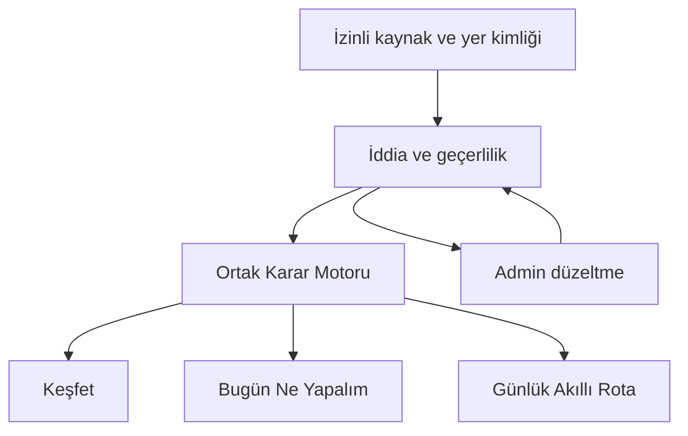

### D02 — Üç girişin ortak sözleşmesi

Üç giriş ayrı uygunluk hesabı yaratmaz. Çok günlük giriş G statüsündedir.

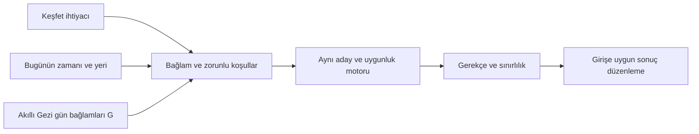

### D03 — Kanıt hazırlama ve karar ayrımı

Kaynak hazırlama kişiye özel kararı veya yayın yetkisini üstlenmez.

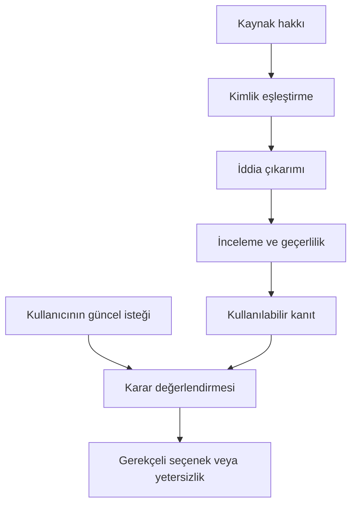

### D04 — Zorunlu koşul kapısı

Bilinmeyen kritik koşul olumlu uygunluk olarak geçemez.

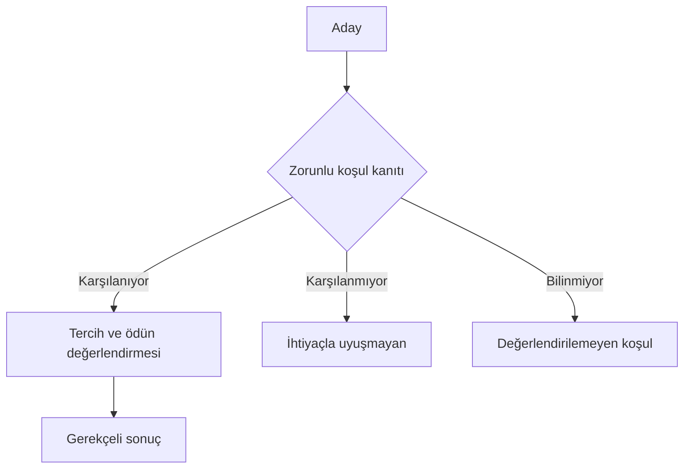

### D05 — Keşfet gelişim sırası

Önce karar tamamlanır; kayıt ve paylaşım bu kararı taşır.

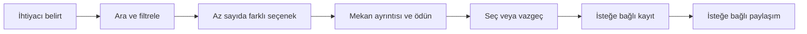

### D06 — Bugün Ne Yapalım bağlamı

Konum izni verilmemesi görevi bitirmez; saat belirsizliği gizlenmez.

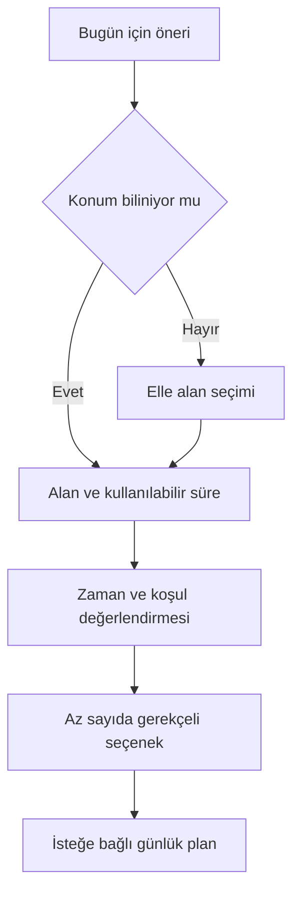

### D07 — Günlük Akıllı Rota sınırı

Kabul edilmiş rota bir günlük karar dilimidir; gece yarısını geçmek tek başına çok günlük ürün yaratmaz.

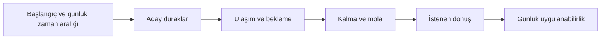

### D08 — Varış bağlamıyla yeniden değerlendirme

Rota, Karar Motorunun yerine geçmez; koordinasyon güncel bağlamı tekrar değerlendirir.

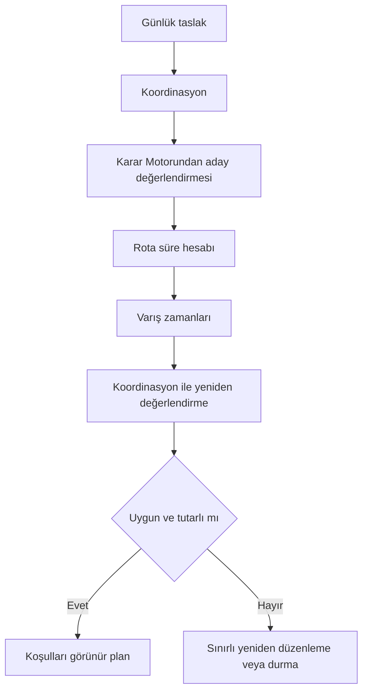

### D09 — Taslak ile uygulanabilir plan

Kaydetme hakkı uygulanabilirlik iddiasına bağlı değildir.

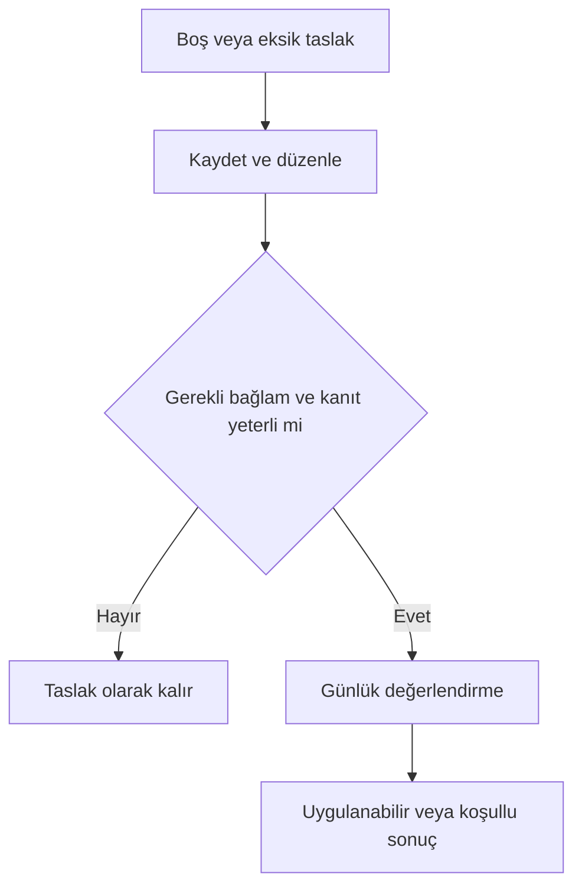

### D10 — Çok günlük genişlemenin kabul kapısı

Günlük kararları birleştirmek kendiliğinden bütün gezi garantisi vermez.

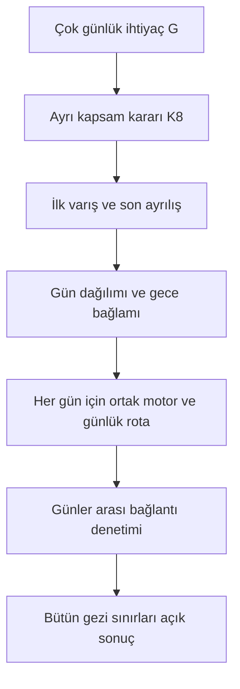

### D11 — Günlük koleksiyon ile Akıllı Gezi ayrımı

Koleksiyon düzen sağlar; günler arası uygulanabilirlik sorumluluğu taşımaz.

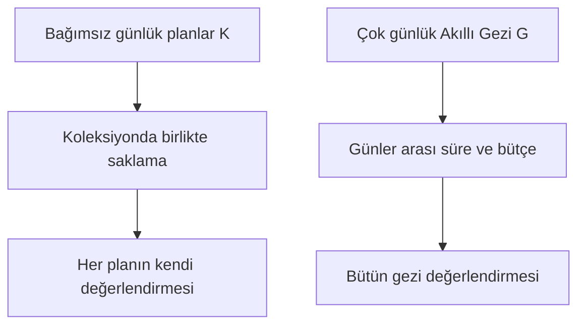

### D12 — Kişisel kayıtların anlamı

Favoriler ayrı nesne veya sosyal beğeni oluşturmaz; ziyaret kaydı kullanıcı beyanıdır.

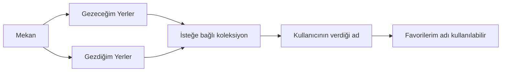

### D13 — Misafirden hesaba geçiş

Giriş yapmak bütün yerel kayıtların otomatik taşınması değildir.

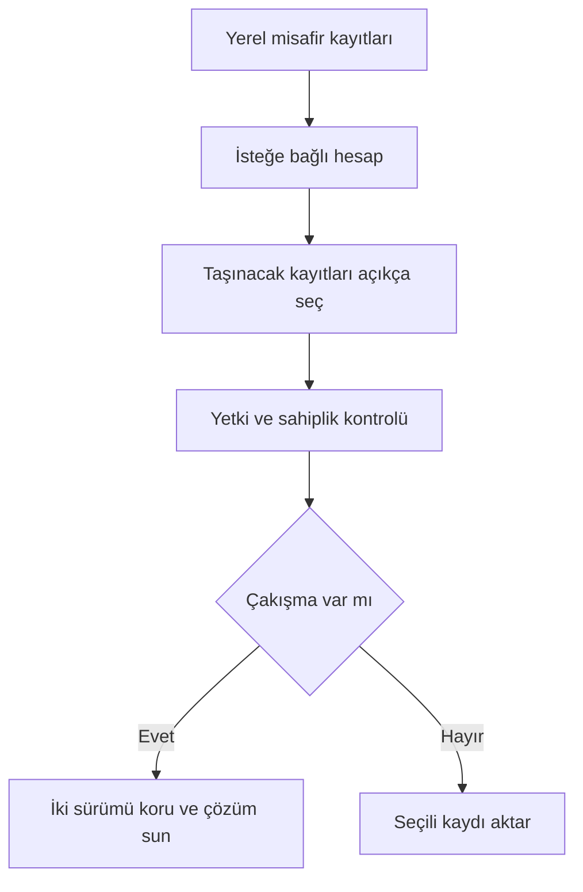

### D14 — Paylaşım yaşamı

Özel kayıt, yayınlanan sürüm ve alıcının kopyası ayrı yaşam döngüleridir.

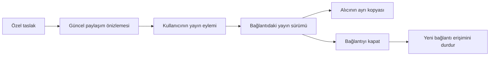

### D15 — Geçersiz kanıtın yayılımı

Düzeltme yalnız kaynak ekranında kalırsa eski iddia yaşamaya devam eder.

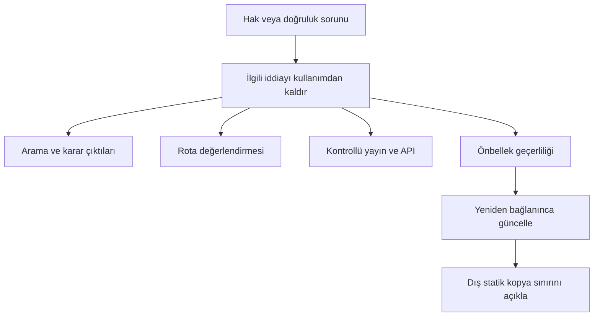

### D16 — Offline dürüstlüğü

Yerel okuma ile güncel öneri üretme farklı vaatlerdir.

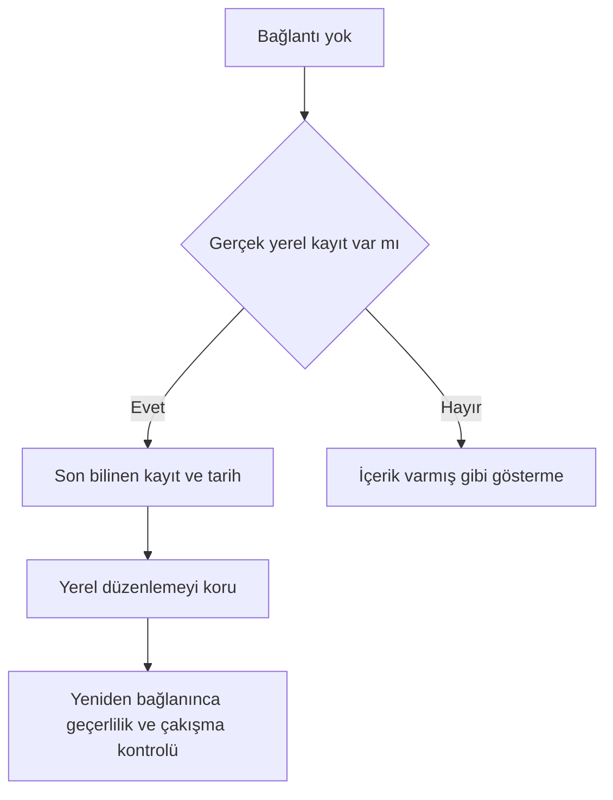

### D17 — Bildirim yetkisi

İşlem içi kritik durum temel hizmettir; dış bildirim ayrı tercihe bağlıdır.

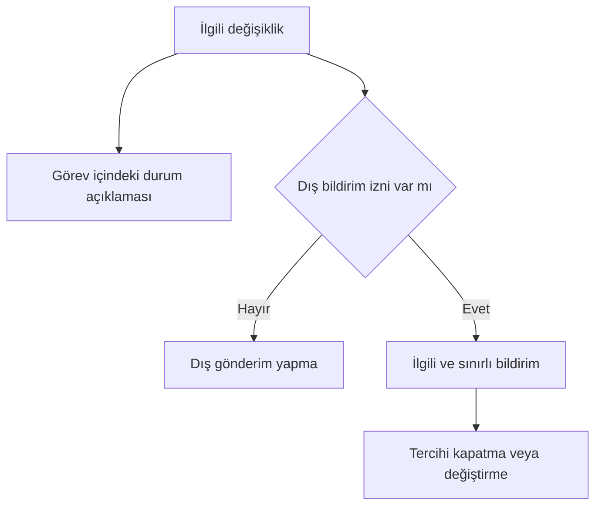

### D18 — Bir İz kanıt kapısı

Katkının alınması yayın veya doğrulama demek değildir.

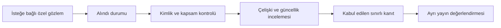

### D19 — Duygu analizinin sınırı

Çıkarım bağlamsal iddiaya yardımcı olur; kişinin ruhsal profiline dönüşmez.

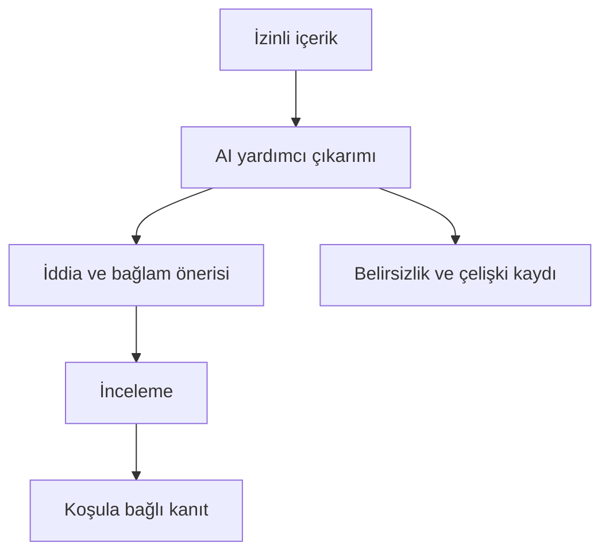

### D20 — Admin inceleme

Kritik işlemlerin ikinci incelemesi gelişme hızının karşılığında kaldırılmaz.

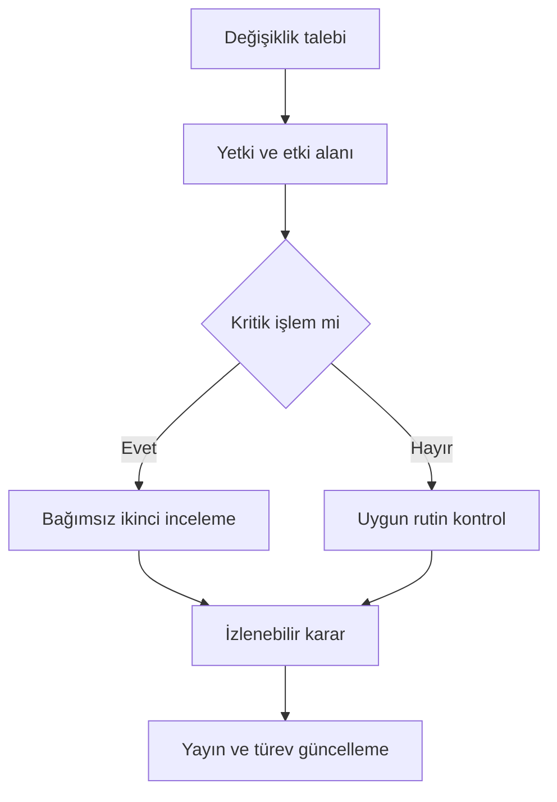

### D21 — Şehir büyümesi

Yeni şehir kayıt sayısıyla değil sürdürülebilir karar kapsamıyla açılır.

```mermaid
flowchart TD
  A[Yeni şehir adayı] --> B[Alan ve amaç kapsamı]
  B --> C[Kaynak hakkı ve kanıt]
  C --> D[Yenileme ve destek kapasitesi]
  D --> E{K6 geçildi mi}
  E -->|Evet| F[Sınırlı şehir pilotu]
  E -->|Hayır| G[Ertele veya kapsamı daralt]
```

### D22 — İlçe sayfası kararı

Yeterli özgün karar bilgisi yoksa ayrı sayfa üretilmez.

```mermaid
flowchart TD
  A[İlçe] --> B{Destekli özgün ayrım ve yeterli yer var mı}
  B -->|Evet| C[İlçeye özgü karar içeriği]
  B -->|Hayır| D[Keşfette ilçe filtresi]
  C --> E[Aynı mekan ve kanıt sistemi]
  D --> E
```

### D23 — Ücretsiz temel ile ücretli kolaylık

Premium uygunluğu değiştirmez; kanıtlanmış tekrar işini azaltır.

```mermaid
flowchart TD
  A[Aynı bağlam ve kanıt] --> B[Aynı Karar Motoru]
  B --> C[Ücretsiz temel karar]
  B --> D[Ücretli kullanımda aynı karar]
  E[Tekrar eden düzenleme işi] --> F[K7 değer araştırması]
  F --> G[Koşullu ek kolaylık paketi]
```

### D24 — Premium araştırma kapısı

Ücret alınabilir görünen özellik değer gösterilmeden paket olmaz.

```mermaid
flowchart LR
  A[Gerçek tekrar işi] --> B[Ücretsiz temel ile karşılaştır]
  B --> C[Çaba azalmasını gözle]
  C --> D[Ödeme isteği ve devamlılık]
  D --> E[Hizmet ve bakım maliyeti]
  E --> F[Paketle veya ertele]
```

### D25 — Kurumsal sınır

Kurumsal bütçe kamusal uygunluğu satın alamaz.

```mermaid
flowchart TD
  A[Kurumsal kullanım ihtiyacı] --> B[Kendi çalışma alanı ve izinleri]
  B --> C[Koordinasyon veya çıktı kullanım değeri]
  C --> D[K9 hak ve sınır denetimi]
  D --> E[Koşullu hizmet]
  F[Kamusal karar sistemi] --> G[Aynı kanıt ve uygunluk kuralları]
```

### D26 — İş ortağı hizmeti

API ürünleşmesi kullanım hakkı ve düzeltme zincirine bağlıdır.

```mermaid
flowchart LR
  A[Çıktı kullanım talebi] --> B[İzinli kapsam]
  B --> C[Bağlamlı çıktı ve sınırlılık]
  C --> D[Hacim ve destek hizmeti]
  D --> E[Geri çekme ve güncelleme yükümlülüğü]
  E --> F[K9 sağlanırsa pilot]
```

### D27 — Ticari büyüme döngüsü

Güvenilir karar tekrar kullanım üretirse ticari büyüme denenebilir.

```mermaid
flowchart LR
  A[Dar kapsamda faydalı karar] --> B[Kişisel devamlılık]
  B --> C[Gönüllü paylaşım]
  C --> D[Yeni ilgili kullanıcı]
  D --> A
  B --> E[Gerçek tekrar işine ücretli kolaylık]
  E --> F[Bakım ve destek kapasitesi]
  F --> A
```

### D28 — MVP kritik yolu

Bağımlılık sırası P statüsündedir; tarih taahhüdü değildir.

```mermaid
flowchart LR
  A[İP01 kaynak ve fark] --> B[İP02 kanıt]
  B --> C[İP03 admin ve düzeltme]
  C --> D[İP04 ortak karar]
  D --> E[İP05 giriş ve mekan]
  E --> F[İP06 günlük rota]
  F --> G[İP07 kayıt ve offline]
  G --> H[İP08 paylaşım]
  H --> I[İP09 MVP kapıları]
```

### D29 — Yayını durdurma ve daraltma

Başka bir metriğin başarısı kritik ihlali telafi etmez.

```mermaid
flowchart TD
  A[Pilot incelemesi] --> B{Açık kritik ihlal var mı}
  B -->|Evet| C[İlgili yayını durdur]
  C --> D[Düzelt ve etkilenen akışı yeniden doğrula]
  B -->|Hayır| E[Kapasite ve görev başarısını incele]
  E --> F[Devam et veya kapsamı daralt]
```

### D30 — Nihai sürüm ayrımı

v2 etiketi bütün genişlemeleri otomatik onaylamaz.

```mermaid
flowchart TD
  A[Temel ve MVP P] --> B[v1 kişisel devamlılık P]
  B --> C[v2 koşullu derinleşme P]
  B --> D[K7 Premium araştırması]
  C --> E[K6 yeni şehir]
  C --> F[K8 çok günlük Akıllı Gezi G]
  C --> G[K9 kurumsal ve ortak hizmet G]
  D --> H[Kanıt varsa ücretli pilot]
```
## 37. Kırk uçtan uca kabul senaryosu

Senaryolar ürün kabul örnekleridir; çalıştırılmış yazılım testi veya kullanıcı araştırması sonucu değildir. Her satır başlangıç, eylem, gözlenebilir sonuç ve başarısızlık sınırı içerir. G satırları mevcut ürün için teslim sözü oluşturmaz. Kapılar §34'te, sorumluluklar §32'de tanımlıdır.

| No | Aşama ve bağlam | Başlangıç ve eylem | Beklenen gözlenebilir sonuç | Başarısızlık sınırı / kapı |
| --- | --- | --- | --- | --- |
| S01 | MVP, Keşfet | Misafir sessiz, kısa süre oturabileceği bir yer arar; alanı elle seçer. | Desteklenen seçenekler gerekçe ve sessizlik bilgisinin zaman kapsamıyla gelir; hesap açmadan ayrıntıya geçilir. | Zorunlu giriş veya geçmiş gözlemden anlık sessizlik iddiası; K2, K5. |
| S02 | MVP, arama | Kullanıcı adını bildiği bir mekanı arar; mevcut ihtiyacına uygunluğu bilinmemektedir. | Mekan bulunur, kimliği ve bilinen bilgileri açılır; bulunma uygunluk tavsiyesi diye sunulmaz. | İsim eşleşmesinin olumlu uygunluk etiketine dönüşmesi; K1, K2. |
| S03 | MVP, filtre | Kullanıcı bir koşulu zorunlu yapar; kanıtı yeterli aday kalmaz. | Sistem yetersizliği açıklar; değiştirebileceği koşulu gösterir, değişimi kullanıcı seçer. | Koşulu sessizce kaldırıp sonuç üretmek; K2. |
| S04 | MVP, kritik bilinmeyen | Kullanıcı basamaksız giriş ister; adayın erişim bilgisi eksiktir. | Bilinmeyen alan açık kalır; aday koşulu sağlıyor gibi önerilmez. Diğer destekli adaylar varsa ayrıştırılır. | Eksik bilginin olumlu varsayılması veya erişimin ücretli filtre olması; K2, K5. |
| S05 | MVP, seçenek sayısı | Aynı ihtiyaca benzeyen çok sayıda yer vardır. Kullanıcı öneri ister. | İlk karşılaşmada 3–5 anlamlı seçenek ve gerçek ödünler açıklanır; daha fazlasına erişim bağlamı korur. | Tekrarlı seçeneklerle karar yükünün büyümesi; K2. |
| S06 | MVP, mekan ayrıntısı | Kullanıcı bir seçeneği açar; aynı konuya ait kaynaklar çelişir. | İlgili iddianın çelişkisi ve kapsamı görünür; genel puan çelişkiyi örtmez, alternatifler en fazla üçtür. | Yorum alıntısı veya ortalama puanın kanıt yerine geçmesi; K1, K2. |
| S07 | MVP, Bugün Ne Yapalım | Kullanıcı konum iznini reddeder ve yakın bir ilçeyi elle girer. | Aynı karar işi elle seçilmiş alanla devam eder; konum izni tekrar tekrar zorlanmaz. | İzin vermediği için öneri görevinin kapanması; K5. |
| S08 | MVP, kısa zaman | Kullanıcının 50 dakikası vardır; yakın görünen bir yere gidiş, bekleme ve kalma süreleri sığmaz. | Süre uyuşmazlığı açıklanır, sığdığı desteklenen seçenek aranır veya sonuç verilemediği söylenir. | Yalnız mesafeye bakılarak uygun öneri; K2, K4. |
| S09 | MVP, geçmiş yoğunluk | Eski gözlemler sakin saatleri gösterir; kullanıcı şimdi sakin yer ister. | Geçmiş örüntü ile mevcut durum ayrılır; anlık kalabalık bilinmiyorsa bilinmediği yazılır. | Tarihsel veriden canlı yoğunluk vaadi; K1, K2. |
| S10 | MVP, giriş tutarlılığı | Aynı kullanıcı aynı alan, zaman ve zorunlu koşullarla Keşfet ile Bugün girişini kullanır. | Aynı kanıt ve politika altında uygunluk ve kritik sınırlılıklar tutarlıdır; sunum ve bağlam toplama sırası değişebilir. | Giriş adının çelişkili uygunluk yaratması; K2. |
| S11 | MVP, belirsiz saat | Bir yerin saat bilgisi çelişkilidir; kullanıcının varış saati yakındır. | Açık olduğu kesin söylenmez; saat sınırlılığı hem ayrıntıda hem karar çıktısında korunur. | Bir ekranda bilinmeyen saatin diğerinde kesinleşmesi; K2, K3. |
| S12 | MVP, ücret ve karar | İleride ücretli hesapla ücretsiz kullanıcı aynı bağlamı gönderir; ödeme durumu dışında girdiler eşittir. | Aday uygunluğu, kanıt kalitesi ve kritik uyarılar eşit kalır; ücret ayrı kolaylık hizmetini etkileyebilir. | Ücretli sıraya yükseltme veya ücretsiz kanıtı eksiltme; K2, K7. |
| S13 | MVP, günlük rota | Kullanıcı üç durak ve akşam dönüş noktası belirler. | Gidiş, geçiş, bekleme, ziyaret, mola ve istenen dönüş birlikte değerlendirilir; hesaplanamayan kalem açıklanır. | Yalnız duraklar arası süreyle uygulanabilirlik; K4. |
| S14 | MVP, varış değişmesi | Durak sırası değiştirilir; ikinci durağa varış artık kapanıştan sonradır. | Yeni varış bağlamı ortak motorda değerlendirilir; eski uygunluk kaldırılır, kullanıcı seçimi korunarak sorun açıklanır. | Eski uygunlukla yeni rota yayınlama; K2, K4. |
| S15 | MVP, kilitli durak | Kullanıcı bir durağı korur; kalan zaman bütün isteklere yetmez. | Kilit kaldırılmadan çelişki gösterilir; çıkarma veya koşul değişimini kullanıcı seçer. | Planı sığdırmak için korunan tercihi gizlice değiştirme; K4. |
| S16 | MVP, eksik taslak | Kullanıcı henüz tarih ve başlangıç seçmeden iki mekan kaydeder. | Taslak kaydedilir ve yeniden açılır; uygulanabilir plan iddiası taşımaz. | Eksik taslağı kaydetmeyi engellemek veya tamamlanmış rota diye etiketlemek; K4, K5. |
| S17 | MVP, gece sınırı | Kullanıcı gece başlayan ve ertesi takvim gününün ilk saatinde biten tek gezi dilimi oluşturur. | Günlük karar diliminin saatleri doğru yorumlanır; kendiliğinden çok günlük seyahat ürünü sayılmaz. | Takvim değişimini konaklamalı gezi desteği sanmak; K4. |
| S18 | MVP, erken bitiş | Kullanıcı iki durağı tamamlamışken gezisini bitirir. | Tamamlanmış kişisel durum korunur; kalan duraklar başarısızlık veya seri kaybı olarak sunulmaz. | Zorlayıcı devam bildirimi, puan kaybı veya geçmişi yeniden yazma; K4, K5. |
| S19 | MVP, Gezeceğim Yerler | Misafir bir yeri kaydeder, yeniden açar ve kaydı kaldırır. | Kaydın cihaz kapsamı anlaşılır; kaldırma sonucu görünür, sunulan geri alma kişisel kaydı geri getirir. | Temel kayda zorunlu hesap veya yerel kayda bulut güvencesi; K5. |
| S20 | MVP, şehir değiştirme | Samsun taslağı olan kullanıcı başka şehir bağlamına geçer. | Eski taslak korunur; yeni şehir için ayrı taslak seçimi açıkça yapılır. | Şehir değiştirince eski durakları silme veya otomatik karma rota; K4, K5. |
| S21 | MVP, offline okuma | Bağlantı kesilir; daha önce gerçekten saklanmış taslak açılır. | Son bilinen kayıt ve güncellik sınırı görünür; yeni canlı değerlendirme üretildiği iddia edilmez. | Yerel içerik yokken sahte sonuç veya güncel açık olma iddiası; K3, K5. |
| S22 | MVP, belirsiz işlem | Kaydetme isteğinin yanıtı kesilir; kullanıcı tekrar dener. | Gönderilmedi, sonucu belirsiz ve tamamlandı durumları ayrılır; yinelenen kayıt oluşmadan sonuç uzlaştırılır. | Yanıt yokluğunu kesin başarı saymak veya kaydı kaybetmek; K5. |
| S23 | v1, ziyaret beyanı | Kullanıcı geçmişte gittiği bir yeri Gezdiğim Yerler'e ekler. | Kişisel beyan olarak saklanır; yerin bugünkü saatine, erişimine veya kalitesine otomatik kanıt sayılmaz. | Ziyaret kaydını doğrulanmış kamusal gözlem yapmak; K1, K5. |
| S24 | v1, koleksiyon adı | Kullanıcı koleksiyonuna Favorilerim adını verir ve yer ekler. | Mevcut koleksiyon ilişkisi kullanılır; yeni sosyal beğeni veya ayrı favori nesnesi oluşmaz. | Birbirinden kopuk yıldız, favori ve Gezeceğim kayıtları; K5. |
| S25 | MVP, özelden paylaşıma | Kullanıcı yerel günlük taslağı paylaşmak ister; taslakta kişisel not vardır. | Güncel önizleme yayınlanacak alanları gösterir; açık yayın eylemi gerekir, özel alanlar kendiliğinden dahil olmaz. | Taslağı kaydetmenin otomatik yayın olması; K5. |
| S26 | MVP, bağlantıyı kapatma | Kullanıcı paylaştığı bağlantıyı kapatır, sonra taslakta geri alma yapar. | Bağlantı kapalı kalır; kişisel düzenlemeyi geri almak yayın yetkisini canlandırmaz. | Geri almanın iptal edilen bağlantıyı açması; K5. |
| S27 | MVP, alıcı kopyası | Alıcı planı kendi kaydına kopyalamıştır; kaynak sahibi paylaşımı kapatır. | Kontrollü bağlantı kapanır; ayrı kopyanın sınırı açıklanır. Kaynak hakkı/geçersizlik kuralları kontrollü içerikte sürer. | Dış kopyaların tamamının uzaktan silindiğini söylemek; K3, K5. |
| S28 | MVP, offline paylaşım | Kullanıcı bağlantısızken paylaşımı hazırlar, sonra tekrar bağlanır. | Hazırlık korunur; yayın öncesi güncel içerik ve açık eylem gerekir. Yetkili kişisel kaydetme ile kamuya yayın ayrılır. | Bağlantı gelince eski önizlemeyi otomatik yayınlamak; K5. |
| S29 | v1, Bir İz | Misafir bir yerin girişindeki yeni basamağı bildirir; katkı alınır. | Alındı durumu görünür, katkı hemen doğrulanmış yayın olmaz; inceleme ve etkilenen iddia bağlantısı izlenir. | Katkı sayısını kanıt gücü saymak veya sosyal yorum akışı açmak; K1, K3. |
| S30 | v1, katkıyı geri çekme | Katkı sahibi cihazındaki sınırlı erişimle geri çekme ister; başka cihazda kodu yoktur. | Erişebildiği kayıtta izinli kontrol işler; her cihazdan anonim kurtarma sözü verilmez, sınır baştan anlaşılır. | Kimliksiz sınırsız geri erişim garantisi veya başkasının katkısını açma; K5. |
| S31 | v1, hesap aktarımı | Misafir hesap açar; yerel taslaklardan yalnız birini taşımayı seçer. | Seçilmeyen kayıtlar yerel kalır, sahiplik ve aktarım sonucu görünür; giriş toplu eşitleme sayılmaz. | Bütün cihaz kayıtlarını otomatik hesaba aktarma; K5. |
| S32 | v1, eşitleme çakışması | Aynı kayıt iki cihazda değişmiştir; birinde durak kaldırılmıştır. | Çakışma görünür ve iki niyet korunur; silinmiş nesne eski durumdan sessizce dirilmez. | Son gelenin gizli kazanması veya kalıcı veri kaybı; K5. |
| S33 | Koşullu Premium | Tekrar gezi düzenleyen kullanıcı şablon kolaylığını dener. | Yeniden giriş ve düzenleme çabası ücretsiz temele göre ölçülür; değer ve ödeme isteği kanıtı yoksa paket açılmaz. | Sadece tıklama veya deneme kaydını ödeme değeri saymak; K7. |
| S34 | Koşullu Premium iptali | Kullanıcı ek kolaylık aboneliğini sonlandırır. | Temel kaydetme, düzenleme ve izinli kayıt kontrolü sürer; bitecek hizmet ve saklama sınırı önceden açıklanmıştır. | Kullanıcının kendi kayıtlarını ücret duvarında tutmak; K5, K7. |
| S35 | Koşullu kurumsal | Kurum kendi çalışma alanındaki gezi koordinasyonunu ister. | Yalnız yetkili çalışma verisi kullanılır; personelin özel geçmişi aktarılmaz, kamusal sıralama değişmez. | Üyeliği kişisel izleme izni saymak veya ödeme karşılığı uygunluk; K5, K9. |
| S36 | Koşullu iş ortağı | API tüketicisine verilmiş bir iddianın kullanım hakkı geri çekilir. | Kontrollü çıktılar durdurulur; güncelleme/geri çekme yolu işletilir ve sınır izlenir. | API kopyasını düzeltme zinciri dışında bırakmak; K3, K9. |
| S37 | v2 şehir kapısı | Çok kayıtlı ikinci şehirde akşam saatleri ve bazı amaçlar için kanıt yetersizdir. | Şehir bütünü hazır denmez; destekli alan ve amaçla sınırlandırılır veya ertelenir, bakım kapasitesi de ölçülür. | Kayıt sayısı veya sponsor bütçesiyle şehir açma; K6. |
| S38 | MVP admin ve AI | Kaynakta AI'ya kuralları değiştirmesini söyleyen metin vardır; ayrıca kritik kimlik birleştirme talebi gelir. | Kaynak metni talimat olmaz; kritik kimlik birleştirmesi bağımsız ikinci incelemeden geçer. | AI'nın yayın/yetki kararı vermesi veya kritik birleşimin tek onayla yapılması; K1, K3. |
| S39 | G, çok günlük plan | Kullanıcı üç gün, ilk gün öğleden sonra varış ve son gün erken ayrılış ister; gece bağlamı eksiktir. | Mevcut üründe çok günlük bütünlük sözü verilmez. K8 sonrası prototipte eksik bağlam sorulur, günler ve bağlantılar doğrulanır. | Üç günlük rotayı günlük motorun zaten desteklediğini iddia etmek; K8. |
| S40 | G, günler arası değişim | K8 sonrası üç günlük taslakta ikinci günün bir durağı başka güne taşınır. | Etkilenen günler, geçişler, toplam süre ve bütçe kapsamı yeniden incelenir; tamamlanan ziyaretler değişmez, ücret uygunluğu etkilemez. | Yalnız taşınan günü hesaplayıp bütün geziyi geçerli saymak; K2, K4, K8. |
## 38. Altmış maddelik öz eleştiri

Bu liste tamamlanmış doğrulama iddiası değildir. Her madde planın zayıf kalabileceği noktayı, gerekli kanıtı ve sonuç alınmazsa değişecek kararı gösterir. Belgede bir korumanın yazılı olması, uygulandığının kanıtı sayılmaz.

| No | Eleştiri ve belirsizlik | Sınama / karar sonucu |
| --- | --- | --- |
| Ö01 | MVP veri, rota, kayıt ve paylaşımı birlikte istediğinden büyük olabilir. | İP01'de gerçek iş yükü çıkarılır; kapasite yetmezse Keşfet pilotu ayrı adlandırılır, eksik sürüme tam MVP denmez. |
| Ö02 | Dar Samsun kapsamı bile yer ve amaç bakımından fazla geniş olabilir. | Alan × amaç × zaman kanıt matrisi çıkarılır; zayıf hücreler yayından çıkarılır. |
| Ö03 | Mevcut kayıt sayısı sahte hazırlık hissi verebilir. | Kaynak hakkı, kimlik ve iddia güncelliği incelenir; yalnız sayıyla K1 geçilmez. |
| Ö04 | README'deki hazır bileşenler hedef sözleşmeyle uyumsuz olabilir. | İP01 davranış farkı incelemesi yapılmadan efor indirimi veya hazır kabulü yapılmaz. |
| Ö05 | Kaynak haklarının türev çıktılara etkisi geç fark edilebilir. | Kaynak–iddia–çıktı izi üzerinde geri çekme tatbikatı yapılır; iz kurulamıyorsa kullanım açılmaz. |
| Ö06 | Mekan kimliği yanlış birleşirse gerekçeler yanlış yere taşınır. | Aynı adlı ve taşınmış yer örnekleriyle inceleme yapılır; kritik birleşim için ikinci göz korunur. |
| Ö07 | Güncelleme tarihi gözlem tarihini gizleyebilir. | Tarih alanları ayrı kontrol edilir; yeni işleme tarihiyle eski olgunun canlılığı yenilenmez. |
| Ö08 | Çok susan motor başarıyı yanlış ölçebilir. | Gereksiz susma ve aday kaçırma bağımsız örneklerde ölçülür; sadece yanlış olumlu oranına bakılmaz. |
| Ö09 | Arama havuzu daralırsa doğru motor da iyi aday bulamaz. | Bilinen ilgili adaylarla kapsama incelemesi yapılır; arama sorunu tercih puanıyla örtülmez. |
| Ö10 | 3–5 seçenek her görevde yeterli olmayabilir. | Seçim ve daha fazlasına erişim incelenir; kaynak ilkesini değiştirecek sonuç ayrı karara taşınır. |
| Ö11 | Farklı görünen seçenekler aynı ödünü sunabilir. | Gerekçeler karşılaştırılır; anlamlı ayrım yoksa tekrarlı liste yerine daha az seçenek sunulur. |
| Ö12 | Açıklama gerçek karar nedenini yansıtmayabilir. | Gerekçe karar girdisine geri izlenir; sonradan AI'nın yazdığı ikna metni yeterli sayılmaz. |
| Ö13 | Güncel istek ile öğrenilmiş tercih çatışması kaçabilir. | Aykırı açık istek senaryosu uygulanır; öğrenilmiş varsayım açık isteğin üstüne çıkamaz. |
| Ö14 | Bugün girişi ikinci Keşfet ürünü gibi şişebilir. | Aynı bağlam çıktıları karşılaştırılır; bağımsız uygunluk mantığı ve gereksiz gezinme ayrımı kaldırılır. |
| Ö15 | Konum izni reddi pratikte zorlayıcı olabilir. | Elle alan seçerek görevin tamamlanması gözlenir; izin gerektiren çıkmaz yayını engeller. |
| Ö16 | Anlık sakinlik beklentisi geçmiş kanıtla karşılanamayabilir. | Kullanıcıdan iddianın zamanını açıklaması istenir; yanlış anlaşılıyorsa ifade ve kapsam daraltılır. |
| Ö17 | Erişilebilirlik bilgisindeki boşluklar kritik sonuç doğurabilir. | Bilinmeyen zorunlu koşul örnekleri incelenir; olumlu varsayım K2 engelidir. |
| Ö18 | Üç girişte aynı alan adları anlam birliğini garanti etmez. | Aynı kanıt sürümü, zaman ve koşulla karşılaştırmalı çıktı incelemesi yapılır. |
| Ö19 | Günlük rota ulaşım sürelerine fazla güvenebilir. | Eksik, eski ve değişken süre örnekleri denenir; bilinmeyen süre uydurulmaz, uygulanabilirlik sınırlanır. |
| Ö20 | Bekleme ve mola eksikliği yorucu plan üretebilir. | Toplam zamanın bütün kalemleri izlenir; tek toplam sayı yeterli doğrulama sayılmaz. |
| Ö21 | İstenen dönüş açık söylenmemiş olabilir. | Dönüşün dahil olup olmadığı anlaşılır kılınır; kapalı tur varsayımı otomatik yapılmaz. |
| Ö22 | Bütçe kapsamı bilinmediğinde toplam ucuzluk iddiası yanıltır. | Bilinen maliyetlerin kapsamı açıklanır; bilinmeyenler sıfır sayılmaz. |
| Ö23 | Yeniden rota denemeleri kararı bitirmeyebilir. | Sınırlı deneme ve durma sonucu doğrulanır; sonsuz iyileştirme yerine çözülemeyen çelişki gösterilir. |
| Ö24 | Kilitler çözüm alanını daraltınca gizli değişiklik yapılabilir. | Kilitli durak ve dar süre birlikte denenir; çözüm üretme isteği kullanıcı tercihinden üstün tutulmaz. |
| Ö25 | Gece yarısı sınırı kapsamı yanlış genişletebilir. | Tek gezi dilimi ile birden fazla günün bağlantısı ayrı örneklerle doğrulanır. |
| Ö26 | Günlük koleksiyon çok günlük güvence izlenimi verebilir. | Koleksiyonun toplam uygulanabilirlik sunmadığı anlaşılıyor mu ölçülür; yanlış anlaşılıyorsa ifade düzeltilir. |
| Ö27 | Akıllı Gezi talebi kabul edilmiş gibi okunabilir. | G etiketi, K8 ve günlük sınır korunur; kaynak değişmeden teslim taahhüdü verilmez. |
| Ö28 | Çok günlük genişleme rezervasyona sürüklenebilir. | Gece başlangıç bağlamı ile satın alma ürünü ayrılır; yeni ticaret modülü bu belgeye eklenmez. |
| Ö29 | Günler arası taşıma toplam bütçeyi ve varışları bozabilir. | K8 araştırmasında etkilenen bütün günler değerlendirilir; günlük motor doğruluğu tek başına yeterli sayılmaz. |
| Ö30 | Hesabı ertelemek kayıt güvencesini zayıflatabilir. | Yerel saklama sınırı görev içinde anlaşılır mı incelenir; açıklanamayan güvenceyle MVP açılmaz. |
| Ö31 | Hesabı v1'e koymak kullanıcı beklentisini karşılamayabilir. | Kayıp ve cihaz değiştirme ihtiyacı araştırılır; gerekirse öncelik değişir, temel kayıt ücretlenmez. |
| Ö32 | Eşitleme ücretli değer değil temel beklenti olabilir. | Ücretsiz temelle değer araştırması yapılır; bu nedenle paket kararı açık kalır. |
| Ö33 | Çakışmalar kullanıcının emeğini silebilir. | İki cihaz ve silme örnekleri denenir; iki niyet korunmadan eşitleme açılmaz. |
| Ö34 | Favori adı ayrı veri nesnesi beklentisi yaratabilir. | Gezeceğim ve koleksiyon görevleriyle anlam kontrol edilir; çoğaltılmış kayıt modeli kurulmaz. |
| Ö35 | Gezdiğim Yerler hassas bir kişisel geçmiş oluşturur. | Varsayılan özel durum ve açık paylaşım kontrolü doğrulanır; ziyaret beyanı kamu kanıtına çevrilmez. |
| Ö36 | Paylaşım önizlemesi son içerikle ayrışabilir. | Önizleme sonrası değişiklik ve bağlantı kesilmesi denenir; güncel açık eylem olmadan yayın yapılmaz. |
| Ö37 | Bağlantıyı kapatma bütün kopyaları silme sanılabilir. | Kullanıcı anlayışı ve dış kopya sınırı sınanır; kontrol edilmeyen silme vaadi verilmez. |
| Ö38 | Geri alma yetki veya geçersiz kanıtı diriltebilir. | İptal edilmiş bağlantı, kaldırılmış iddia ve geri alma birlikte denenir; eski haklar geri gelmez. |
| Ö39 | Offline kayıt güncel bilgi gibi kullanılabilir. | Son bilinen tarih ve canlılık farkı anlaşılmıyorsa offline kapsam daraltılır. |
| Ö40 | Kuyruklanan işlem iki kez uygulanabilir. | Belirsiz yanıt ve tekrar deneme örnekleri incelenir; çift kayıt/çift yayın varsa K5 geçilmez. |
| Ö41 | Bildirim kolaylığı geri çağırma baskısına dönüşebilir. | Her tetikleyici kullanıcı göreviyle eşleştirilir; ilgisiz rutin dürtü ve seri koruma uyarısı açılmaz. |
| Ö42 | Bildirim izni kritik bilgiyi görmenin koşulu olabilir. | Dış izin kapalıyken işlem içi kritik bilgi görünürlüğü doğrulanır. |
| Ö43 | Bir İz inceleme kapasitesinden hızlı büyüyebilir. | Kuyruk ve çelişki yükü ölçülür; kapasite yetmezse katkı kapsamı sınırlandırılır. |
| Ö44 | Anonim geri çekme beklentisi erişim sınırını aşabilir. | Cihaz/kod kaybı anlatımı sınanır; evrensel kurtarma sözü yerine gerçek sınır korunur. |
| Ö45 | Duygu analizi sessizlik, enerji ve kişiliği karıştırabilir. | Çıkarımlar iddia düzeyinde incelenir; ruhsal profil ve kamusal skor üretilmez. |
| Ö46 | Kaynak içeriği AI davranışını değiştirebilir. | Talimat içeren kaynak örnekleri değerlendirilir; kaynak metninin yetki kazanması yayın engelidir. |
| Ö47 | AI kesintisi temel hizmeti gereksiz durdurabilir. | AI olmadan izinli bilgi okuma denenir; geçerlilik arızası ise ilgili olumlu kararı durdurur. |
| Ö48 | İkinci inceleme küçük ekipte darboğaz yaratabilir. | Kuyruk ve bağımsız inceleme kapasitesi izlenir; kontrol kaldırılmak yerine kapsam azaltılır. |
| Ö49 | Geri çekme önbellek, plan ve ortak çıktıda unutulabilir. | Uçtan uca tatbikat yapılır; son kontrollü tüketiciye ulaşmadan düzeltme tamamlandı sayılmaz. |
| Ö50 | Şehir sayısı büyüme hedefi bakım yükünü gizleyebilir. | Alan × amaç × zaman kapsamı ve bakım maliyeti birlikte raporlanır; şehir sayısı tek hedef olmaz. |
| Ö51 | İlçe sayfaları özgün değer olmadan çoğalabilir. | Destekli özgün ayrım aranır; yoksa filtreli Keşfet kullanılır. |
| Ö52 | Premium geçmiş, temel kişisel kaydı rehin tutmaya dönüşebilir. | İptal ve erişim senaryosu incelenir; temel kaydı açma/düzeltme/silme ücret duvarına taşınmaz. |
| Ö53 | Şablon kullanımı ödeme isteği diye okunabilir. | Tekrar işte fayda ve gerçek ödeme davranışı birlikte aranır; ilgi tek başına gelir kanıtı değildir. |
| Ö54 | Yoğun kullanımın AI ve destek maliyeti geliri aşabilir. | Paket başına kullanım dağılımı ve bakım maliyeti incelenir; sınırsız vaat verilmez. |
| Ö55 | Kurumsal müşteri tarafsızlığı dolaylı etkileyebilir. | Kamusal sıralama ve şehir önceliği ticari talepten ayrılır; sağlanamazsa hizmet açılmaz. |
| Ö56 | İş ortağı düzeltme sözünü uygulamayabilir. | Geri çekme kabiliyeti pilotta doğrulanır; yalnız sözleşme metni yeterli değildir. |
| Ö57 | Ölçüm kişisel profil toplamaya kayabilir. | Her ölçüm için en az veri ve görev amacı sorgulanır; fayda ölçmek özel geçmişin açılmasını gerektirmez. |
| Ö58 | Erişilebilirlik yalnız görsel uyumla ölçülebilir. | Klavye, yardımcı teknoloji ve haritasız görevler incelenir; görsel tutarlılık tek başına K5 değildir. |
| Ö59 | Yayın eşikleri ve ekip kapasitesi henüz sayısal değildir. | Pilot öncesi sorumlu, dönem, örnek ve eşikler yazılır; bunlar yokken tarih veya kapı geçişi taahhüdü verilmez. |
| Ö60 | FAZ 13'ün kabulü ile bu belgenin aşamaları kaynak kararı sanılabilir. | Statüler ayrı tutulur; kabul teyidi ve genişleme kararı gelmeden D/P/G ifadeleri K olarak etiketlenmez. |
## 39. Kaynak izlenebilirliği ve açık kararlar

### 39.1. Kaynakların yetkisi

Bu harita aşağıdaki belgelerin kararlarını sürüm ve iş bağımlılıklarına dönüştürür. Kaynaklarda geçen araştırma adaylarını kabul edilmiş ürün taahhüdüne yükseltmez. Kök README uygulama geçmişini anlamaya yarar; ürün felsefesinin önüne geçmez. Dizin kaydına göre 00–12 kabul edilmiş referans kümesidir; 13 tamamlayıcı davranış kaynağıdır. Dosya tarihi tek başına kabul sırası değildir.

| Kaynak | Bu belgede korunan temel karar | Başlıca karşılığı |
| --- | --- | --- |
| [00 Ürün Felsefesi](../00-product/00-urun-felsefesi.md) | Karar yükünü azaltma, kişiye ve bağlama uygunluk, güvenin ticari çıkardan önce gelmesi | §1–6, §15–16, §23, §33–34 |
| [01 Bilgi Mimarisi](../00-product/01-bilgi-mimarisi.md) | Keşfet, Yer, Şehir, İlçe ve yöntem ilişkisi; aramanın keşif bağlamı; destekli özgün sayfa | §2, §15–19, §26–28 |
| [02 Product Language](../00-product/02-product-language.md) | İddia düzeyinde güven, uygunluk ayrımları, bilinmeyenin korunması; tempo ve enerjinin skor olmaması | §1, §9, §17, §20–21, §31 |
| [03 Karar Motoru](../00-product/03-karar-motoru.md) | Aday bulma ile önerinin ayrılması, zorunlu koşullar, gerçek gerekçe; aynı bağlamda aynı karar | §2, §15–16, §26–27, §31 |
| [04 Sistem Mimarisi](../00-product/04-sistem-mimarisi.md) | Mantıksal sorumluluklar, koordinasyon, türev geçerlilik, yetki ve hata sınırları | §1–2, §8–9, §25, §31–32, §35 |
| [05 AI Bilgi Motoru](../04-ai/05-ai-bilgi-motoru.md) | Kaynak hakkı, iddia yaşamı, AI yardımcı rolü ve Bir İz inceleme ayrımı | §8–10, §17, §20, §34 |
| [06 Akıllı Rota Motoru](../00-product/06-akilli-rota-motoru.md) | §0/1 günlük karar dilimi; §14 şehir ayrımı; §15–20 ücretsiz kayıt/düzenleme/paylaşım; §22 kapsam yasağı | §3–6, §12, §14, §21–22, §31 |
| [07 UX Karar Akışları](../02-ux/07-ux-karar-akislari.md) | Açık kullanıcı kontrolü, kaldığı yerden devam, taslak/uygulanabilirlik, kesinti ve erişilebilirlik | §3, §11–16, §21–25, §35 |
| [08 Tasarım İlkeleri](../03-design/08-tasarim-ilkeleri.md) | Seçim baskısını azaltma; belirsizliği ve kullanıcı kontrolünü görünür tutma | §3–5, §15–17, §23, §34–35 |
| [09 Ürün Ekosistemi](./09-urun-ekosistemi.md) | §20 ücretsiz haklar; §21–23 kolaylık geliri/büyüme; §31 günlük koleksiyon ve çok günlük ayrımı; §32 işletim | §1, §6–7, §10–14, §22–30, §33–34 |
| [10 Design System](../03-design/10-design-system.md) | Ortak anlam, erişilebilir eşdeğerlik ve bileşenlerin görev sözleşmeleri | §3–5, §8, §17, §24–28, §35 |
| [11 Ekran Mimarisi](../03-design/11-ekran-mimarisi.md) | Ekran ile ürün modülü ayrımı; bağlamın, geçmişin, sahipliğin ve yetkinin korunması | §2, §11–13, §22, §25–28, §35 |
| [12 Görsel Tasarım Dili](../03-design/12-gorsel-tasarim-dili.md) | Görsel kararın ürün kapsamı yaratmaması; durumların ve kritik anlamın korunması | §3–5, §17, §23–25, §30, §35 |
| [13 Bileşen ve Etkileşim Sözleşmeleri](../03-design/13-bilesen-ve-etkilesim-sozlesmeleri.md) | D statüsünde tamamlayıcı davranış: Favoriler nesnesi yok; silme/geri alma/paylaşım ve kesintide kontrol | §11–13, §22–28, §37 |
| [Dokümantasyon dizini](../README.md) | Güncel kabul kayıtları, tarihsel etiketlerin ayrımı ve belge ilişkileri | Statü anahtarı, bu bölüm |
| [Kök README](../../README.md) | Mevcut uygulamaya ilişkin tarihsel beyanlar; hedef ürünün uygulanmış sayılmaması | Başlangıç durumu, §32 İP01 |

Eski plan ve teknik belgeler uygulama farkını anlamak için tarihsel bağlamdır; bu kaynak kümesine eşdeğer yeni ürün yetkisi vermez. Henüz yazılmamış Kanıt, Güncellik ve Yayın Politikası belgesi mevcut 05 AI Bilgi Motoru ile aynı dosya değildir. Yayın eşikleri bu eksik politika yazılmış gibi varsayılmaz.

### 39.2. Çelişki ve karar bekleyen konu kaydı

| Kimlik | Tür | Gerilim / açık konu | Bu belgedeki işlem | Kapanma koşulu ve sorumlu |
| --- | --- | --- | --- | --- |
| Ç01 | Açık kapsam çelişkisi | Kullanıcının istediği çok günlük Akıllı Gezi değerlendirmesi, 06 §0/14/22 ve 09 §0/16/21/31'deki günlük sınırı aşar. | Günlük Akıllı Rota K olarak korunur; Akıllı Gezi G olarak ayrı anlatılır. MVP/v1'e ve mevcut Premium'a konmaz; v2 yalnız değerlendirme yeridir. | Ürün sorumlusunun açık kapsam kararı; etkilenen 03/04/06/07/09 ve davranış referanslarının tutarlı güncellenmesi; K8 kanıtı. Bu görev kaynakları değiştirmez. |
| Ç02 | Tarihsel kayıt–hedef ayrılığı | Kök README/eski planların gün gün rota, konaklama bağlamı, duygu skoru, yorum parçacığı ve sponsor vitrini anlatıları kabul edilmiş hedefle aynı kapsam değildir. | README'ye kaynak otoritesi notu eklenir; mevcut davranışın bu hedefe uyduğu iddia edilmez. | İP01'de uygulama farklarının somut incelenmesi ve sonraki ayrı uygulama işi. Bu dokümantasyon görevi çalışan sistemi doğrulamamıştır. |
| A01 | Kabul kaydı belirsizliği | 13 dosyası incelemeye hazırdır; dizinde ayrıca kabulü kayıtlı değildir. | D statüsünde kullanılır; dosyanın varlığı kabul sayılmaz. | Açık kabul kaydı; ürün sorumlusu. Mevcut 00–12 kuralları geçerliliğini korur. |
| A02 | Ticari araştırma | Eşitleme, şablon, uzun geçmiş ve ortak düzenleme için gerçek ücretli değer ve paket sınırı bilinmiyor. | Kaynaklarda aday olan kolaylıklar koşullu tutulur; fiyat ve ödeme isteği uydurulmaz. | K7 araştırması, ücretsiz temel beklenti ve maliyet kanıtı; ticari ve ürün sorumluları. Bir kaynak çelişkisi değildir. |
| A03 | Operasyon eksikliği | Aile bazlı yayın politikası, pilot eşikleri, ekip kapasitesi ve tarihler kesinleşmemiştir. | İP01–03 ve §34 önkoşullarıdır; yol haritası bağımlılık sırası verir. | Sorumlu/örnek/dönem/eşik ve kaynak planı; bilgi, işletim ve değerlendirme sorumluları. |

Bu kayıt açık konuları çözülmüş gibi göstermez. **Ç01 ve Ç02'nin uygulama/kapsam sonucu açıktır; belgenin hangi karara uyacağı açıktır.** Favoriler ayrı modülüne ve rekabetçi rozetlere ilişkin istekler kaynakla uyumlu biçimde §28 ve §23'te sonuçlandırılmıştır; bunlar bekleyen geliştirme vaadi değildir. Kabul edilmiş temel hakların ertelenmiş sürümde uygulanması, bu hakların ücretli hale getirilmesi değildir.

## 40. Nihai Ürün Yol Haritası

### 40.1. Teslim sırası ve geçiş koşulları

Aşağıdaki sıra bu belgenin nihai **P statüsündeki gelişim planıdır**. Her satır tamamlanınca bir sonraki satır kendiliğinden kabul edilmez; ilgili yayın kapısı ayrıca değerlendirilir. Tarih vermek için önce mevcut uygulama farkı ve gerçek kapasite ölçülmelidir.

| Evre | Teslim edilecek sonuç | İş paketleri ve bağımlılıklar | Geçiş kanıtı | Ticari iş / sorumlu | Geçilemezse |
| --- | --- | --- | --- | --- | --- |
| R0 — Kaynak ve pilot sınırı | Kabul matrisiyle uyumlu, Samsun'da alan/amaç/zamanı belli ilk kapsam; mevcut uygulama farkı | İP01; 00–12 ve D olarak 13 | Farkların, kaynak haklarının ve bakım sahiplerinin kaydı | Ürün + bilgi + işletim; bakım maliyeti başlangıcı | Uygulama hazır ilan edilmez; kapsam daraltılır. |
| R1 — Güvenilir temel | Kimlik, iddia, geçerlilik, admin, düzeltme ve izlenebilir yayın | İP02–03; R0 | K1 ve K3; kritik birleşim/geri çekme örnekleri | Bilgi + işletim; veri üretiminden çok bakım maliyeti izlenir | İlgili olumlu bilgi yayını açılmaz. |
| R2 — İlk karar pilotu | Hesapsız Keşfet, bağlamlı Bugün girişi, arama/filtre, mekan ve destekli şehir/ilçe bilgisi | İP04–05; R1 | K2 ve ilgili K5; S01–S11, S38 | Ürün + değerlendirme; ilk karar faydası ve organik giriş | İlgili amaç/alan daralır. Bu pilot tek başına tam MVP değildir. |
| R3 — MVP'nin tamamlanması | Dar günlük Akıllı Rota; Gezeceğim ve rota taslağı kaydı, düzenleme, geri alma; gerçek offline kayıt; kontrollü link/metin paylaşımı | İP06–09; R1–R2 ve geçiş kanıtı | K1–K5 birlikte; S13–S22, S25–S28; ücretsiz haklar | Rota + ürün + işletim; geri dönüş ve kayıt emeği ölçülür, ücretli çekirdek açılmaz | Günlük uygulanabilirlik yoksa taslak korunur; tam MVP tamamlandı denmez. |
| R4 — v1 kişisel devamlılık | İsteğe bağlı hesap/aktarım, Gezdiğim, temel koleksiyon; kontrollü Bir İz; kapasiteye göre harita, izinli dış bildirim, açık tercih hatırlama | İP10–11; R3; her alt yeteneğin kendi kanıtı | K3/K5; S23–S24, S29–S32; katkı inceleme ve kesinti kontrolü | Ürün + işletim; tekrar kullanım yükü ve destek ihtiyacı | İlgili yetenek ertelenir; ücretsiz temel hak ücret duvarına taşınmaz. |
| R5 — Premium değer kararı | Kaynaklardaki kolaylık adaylarından ölçülmüş değer sağlayan paket veya paket açmama kararı | İP12/14; R3–R4'te tekrar iş kanıtı | K7; S12, S33–S34; aynı karar kalitesi, iptal ve kayıt kontrolü | Ticari + ürün; gerçek ödeme nedeni ve net katkı | Paket sadeleşir veya açılmaz; yapay kısıtla talep üretilmez. |
| R6 — v2 seçici derinleşme ve coğrafya | Kanıtlanmış ileri düzenleme hizmetleri; yeterliyse ikinci şehirde sınırlı pilot | İP13–14; bakım kapasitesi; ücretli hizmet için ayrıca R5 | K6; S37; ilgili hizmette K7 | Şehir + işletim + ticari; iki kapsamın birlikte bakım maliyeti | Mevcut kapsam korunur veya daralır. Premium geliri şehir kalitesini satın almaz. |
| R7 — Çok günlük genişleme kararı G | Akıllı Gezi için kabul/ret; kabul edilirse günlüklerden ayrı günler arası sorumluluk ve doğrulama planı | İP15; günlük motor olgunluğu, Ç01 için açık referans kararı | K8; S39–S40; bağımsız günlük koleksiyona göre fayda | Ürün + rota; gerçek planlama yükü araştırılır, otomatik Premium etiketi yok | Bağımsız günlük planlar ve koleksiyon kalır; çok günlük ürün yayınlanmaz. |
| R8 — Kurumsal/partner hizmet G | Kendi çalışma alanı veya izinli çıktı kullanımında sınırlı pilot | İP16; olgun çekirdek, hak, yetki, destek ve düzeltme zinciri | K9; S35–S36; kişisel/kamusal sınır | İşletim + bilgi + ticari; ek hizmetin maliyeti ve müşteri yoğunlaşması | Hizmet alınmaz/açılmaz; kamusal uygunluk satılmaz. |

R5, R6, R7 ve R8 birbirini zorunlu olarak izlemez. Örneğin yeni şehrin koşulu abonelik satışı değil K6 kapasitesidir; kurumsal hizmetin koşulu Akıllı Gezi değil K9'dur. Tablodaki sıra dikkat ve kaynak önceliğidir. Hiçbir koşullu sütun bütün yeteneklerin aynı v2 yayınında açılacağı anlamına gelmez.

### 40.2. Sürümün bitmiş sayılması

- **MVP tamamlandı:** R0–R3'ün kapsamı ve K1–K5 doğrulanmış; günlük plan, temel kayıt ve paylaşım sözleri gerçek davranışla karşılanmış olmalıdır. Keşfet pilotu ile tam MVP raporu ayrıdır.
- **v1 tamamlandı:** R4'te açılacağı kesinleştirilen alt kapsamın kişisel devam, izin ve katkı kontrolleri geçmiş olmalıdır. Açılmayan yetenekler açıkça ertelenmiş görünür; Premium araştırmasının başarısı v1 için zorunlu değildir.
- **v2 tamamlandı:** R6'da seçilen kapsam kendi kapılarını geçmiştir. R7 ve R8'in koşullu olması v2'yi sınırsız bekletmez; bu genişlemeler v2 adıyla gizlice kabul edilmez.
- **Premium hazır:** Yalnız K7'yi geçen somut kolaylık hizmeti, anlaşılır ücret/iptal sınırı ve sürdürülebilir maliyetle hazırdır. Bu belge fiyat veya satışa hazır paket belirlemez.
- **Akıllı Gezi hazır:** Ç01 kapsam değişikliği ve K8 tamamlanmadan bu ifade kullanılamaz. Mevcut kabul edilmiş günlük Akıllı Rota bu ifade yerine kullanılmaz.

Kişisel kayıt ailesinin MVP kabulü İP07 ve S19–S22'dir; S23–S24 İP10 ile v1 kapsamındadır. S12 ücretsiz/ücretli eşitlik sözleşmesidir; MVP'de ödeme sistemi geliştirme işi değildir, ücretli pilot açılırken tekrar doğrulanır. G senaryoları mevcut günlük ürünün yayın önkoşulu değildir.

### 40.3. Bir sonraki somut çalışma

Önce İP01 kapsamında mevcut uygulama–kabul edilmiş davranış farkları, dar pilotun kapsamı ve kapasitesi çıkarılmalıdır. Bununla birlikte planlanan Kanıt, Güncellik ve Yayın Politikası ve UX/kabul doğrulama protokolü hazırlanmalıdır. Daha sonra bağımlılığı açılan iş paketleri tarihlenebilir. Bu sırayı atlayıp ücretli paket, yeni şehir veya çok günlük gezi geliştirmek önerilmez.

**Ürün yol haritası belge olarak tamamlanmıştır.** Kabul edilmiş kararlar ile P/G planları ayrıdır; uygulama, kullanıcı doğrulaması, açık kapsam değişikliği ve ticari kanıt bu dokümantasyon görevinin tamamlanmasıyla gerçekleşmiş sayılmaz.

### Bu dokümanın bağlı olduğu belgeler

§39.1'de tek tek bağlantılanan 00–12 kabul edilmiş referansları, D statüsündeki 13 davranış sözleşmeleri, [dokümantasyon dizini](../README.md) ve [kök README](../../README.md). Günlük kapsam için özellikle [06 Akıllı Rota Motoru](../00-product/06-akilli-rota-motoru.md), gelir ve genişleme sınırları için [09 Ürün Ekosistemi](./09-urun-ekosistemi.md), ortak uygunluk için [03 Karar Motoru](../00-product/03-karar-motoru.md) birlikte okunur.

### Bu dokümanın etkilediği belgeler

- [Dokümantasyon dizini](../README.md) ve [kök README](../../README.md): FAZ 14 bağlantısı ve kaynak otoritesinin açıklanması.
- Mevcut kabul edilmiş 00–12 ve 13 kaynaklarının gövdeleri bu görevde değiştirilmez. Çok günlük genişleme kabul edilirse §39 Ç01'deki referanslar ayrı değişiklik konusu olur.
- Uygulama fark analizi, teslim planı, UX/kabul doğrulaması ve Premium değer araştırması **planlanan çalışmalardır**; mevcut dosyaymış gibi bağlantılanmaz.

### Bundan sonra okunması gereken belge

Önce [06 Akıllı Rota Motoru](../00-product/06-akilli-rota-motoru.md) ve [09 Ürün Ekosistemi](./09-urun-ekosistemi.md) ile kapsam sınırı kontrol edilir. Sonraki üretilecek belge **planlanan uygulama farkı ve pilot doğrulama planıdır**. Ayrıca dizinde planlanan `04-ai/05-kanit-guncellik-yayin-politikasi.md` henüz mevcut değildir; bilgi yayını önkoşulları için ayrı çalışma olarak kalır.
