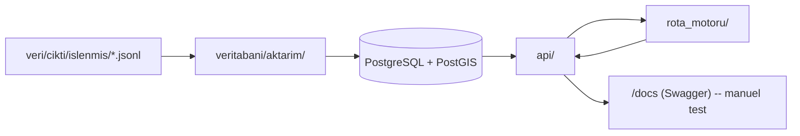

# Sunucu Katmanı (Backend)

Bu klasör üç parçadan oluşur: veritabanı şeması + veri aktarımı
(`veritabani/`), REST API (`api/`) ve kişiselleştirilmiş rota üretme
algoritması (`rota_motoru/`). `veri/` katmanının ürettiği JSONL dosyalarını
okuyup PostgreSQL'e aktarır, üzerine bir API + rota motoru inşa eder.
`site/` (ŞAMANDIRA — Next.js 16) bu API'yi tüketir.



## Kurulum

```bash
cd sunucu
python -m venv .venv
.venv\Scripts\activate          # Windows
pip install -r requirements.txt
copy .env.example .env          # DB baglanti bilgisini duzenle (gerekirse)
alembic upgrade head            # Veritabani semasini olustur/guncelle
```

Komutları **repo kökünden** (`gezi_bot/` içinden) çalıştır, çünkü modüller
`ortak.*`, `veri.*` ve `sunucu.*` şeklinde birbirine referans veriyor.

### Yerel PostgreSQL + PostGIS

`altyapi/docker-compose.yml` ile Docker üzerinden ayağa kaldırabilirsin
(`cd altyapi && docker compose up -d`). Docker yoksa, herhangi bir
PostgreSQL 14+ kurulumuna PostGIS eklentisini (bkz.
[postgis.net/install](https://postgis.net/install/)) kurup
`sunucu/.env.example`'daki `VERITABANI_URL` formatına uygun bir kullanıcı/
veritabanı oluşturman yeterli:

```sql
CREATE ROLE gezi_kullanici LOGIN PASSWORD 'gezi_sifre';
CREATE DATABASE gezi_veritabani OWNER gezi_kullanici;
\c gezi_veritabani
CREATE EXTENSION postgis;
```

## Veri Aktarımı (`veritabani/aktarim/`)

`veri/cikti/islenmis/` altındaki JSONL çıktılarını (`veri/` katmanı
tarafından üretilir, bkz. `veri/README.md`) PostgreSQL'e aktarır. **API'nin
gerçek veriyle çalışabilmesi için önce bu adımın çalıştırılması gerekir.**

```bash
python -m sunucu.veritabani.aktarim.calistir --sehir samsun
```

Bu, sırasıyla:

1. `Sehir` satırını `veri/ortak/sehir_ayarlari.py::SEHIRLER`'den upsert eder.
2. En güncel `birlesik_yerler/*.jsonl` dosyasını okuyup her `BirlesikYer`i
   `Yer` + `YerKaynak` satırlarına aktarır (`yer_aktar.py`).
3. En güncel `yorumlar/*.jsonl` dosyasını okuyup `Yorum` satırlarına aktarır,
   `Yer.duygu_skoru_ortalama`'yı günceller (`yorum_aktar.py`).
4. En güncel `yer_profilleri/*.jsonl` dosyasını okuyup `Yer.yer_profili` /
   `Yer.duygu_ozeti` alanlarını doldurur (`profil_aktar.py`).

**İdempotenttir** — defalarca çalıştırılabilir, aynı yer/yorum tekrar tekrar
eklenmez (eşleme `YerKaynak(kaynak, kaynak_id)` / yorum için
`(kaynak, kaynak_yorum_id)` ya da `(yer, kaynak, yorum_metni)` üzerinden
yapılır). Konsola her adım için kaç kayıt eklendiği/güncellendiği/
bağlanamadığı özetlenir.

## API (`api/`)

```bash
uvicorn sunucu.api.uygulama:uygulama --reload
```

Sonra tarayıcıda `http://127.0.0.1:8000/docs` (veya `8125`) adresine gidip
Swagger üzerinden uç noktaları deneyebilirsin. ŞAMANDIRA sitesi aynı
API'yi `NEXT_PUBLIC_API_URL` ile kullanır. Detaylar için
`sunucu/api/README.md`.

## Rota Motoru (`rota_motoru/`)

Kütüphanesiz (dış ML/optimizasyon bağımlılığı olmayan), adım adım
izlenebilir bir skorlama → kümeleme → sıralama zinciri. Detaylar için
`sunucu/rota_motoru/README.md`.

```bash
python -m pytest sunucu/rota_motoru/testler/ -v
```

## Klasör Yapısı

```
sunucu/
  veritabani/
    modeller.py           SQLAlchemy ORM modelleri (Sehir, Yer, Yorum, ...)
    baglanti.py            Veritabani baglantisi / oturum (session) uretimi
    sorgular.py             Ortak sorgu yardimcilari (PostGIS enlem/boylam cikarma)
    migrasyonlar/           Alembic migration'lari
    aktarim/                JSONL -> PostgreSQL aktarim katmani
  api/
    uygulama.py             FastAPI giris noktasi
    semalar.py              Istek/cevap Pydantic semalari
    yerler_router.py        Sehir/yer listeleme ve detay uc noktalari
    rotalar_router.py       Rota olusturma/getirme + sabit rota uc noktalari
  rota_motoru/
    veri_tipleri.py         DB'den bagimsiz saf veri tipleri (AdayYer, RotaTercihleri, ...)
    skorlama.py              Yer uygunluk puanlama
    zaman_butcesi.py         Gunluk zaman/durak butcesi hesaplari
    kumeleme.py               Yerleri gunlere bolme (acisal/bearing tabanli)
    siralama.py                Gun ici TSP sezgiseli (nearest-neighbor + 2-opt)
    rota_olusturucu.py         Senaryo 1 / Senaryo 2 orkestratoru
    testler/                    pytest birim testleri
```

## Şu Anki Durum

Veri aktarımı, yer/rota API'si ve rota motoru çalışıyor. ŞAMANDIRA
(Next.js 16) bu API'nin tüketicisidir. Canlıya alma (Docker/nginx)
henüz yapılmamıştır.
